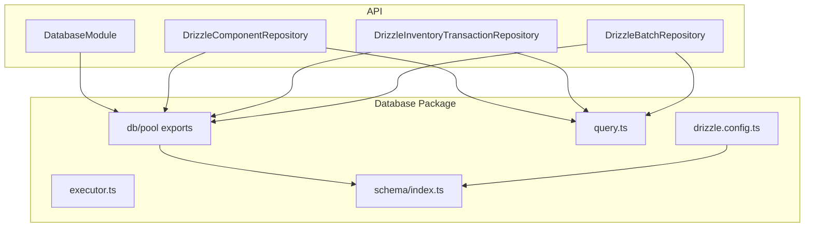
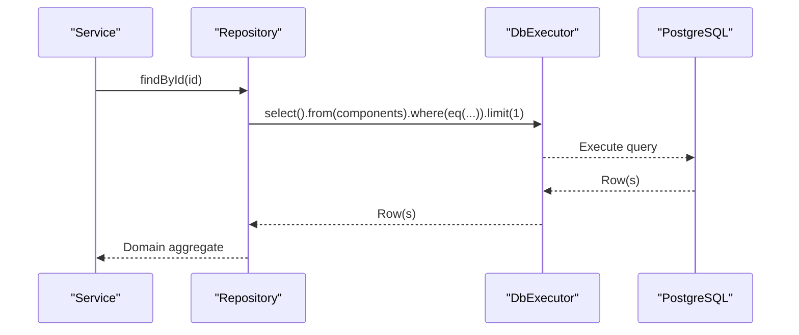
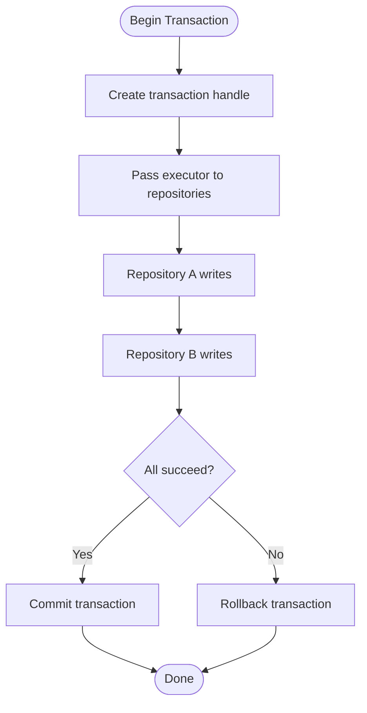
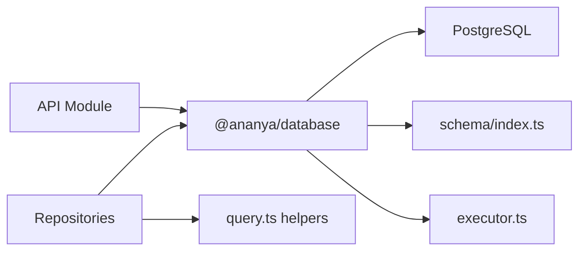
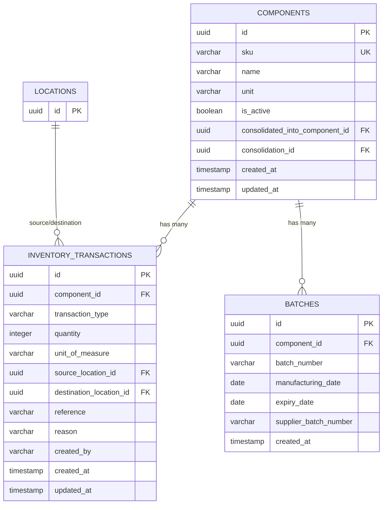

# Data Access Layer (Repositories & Database)

<cite>
**Referenced Files in This Document**
- [index.ts](file://packages/database/src/index.ts)
- [drizzle.config.ts](file://packages/database/drizzle.config.ts)
- [schema/index.ts](file://packages/database/src/schema/index.ts)
- [components.ts](file://packages/database/src/schema/components.ts)
- [inventory-transactions.ts](file://packages/database/src/schema/inventory-transactions.ts)
- [database.module.ts](file://apps/api/src/database/database.module.ts)
- [database.constants.ts](file://apps/api/src/database/database.constants.ts)
- [executor.ts](file://packages/database/src/executor.ts)
- [query.ts](file://packages/database/src/query.ts)
- [drizzle-component.repository.ts](file://apps/api/src/infrastructure/repositories/drizzle-component.repository.ts)
- [drizzle-inventory-transaction.repository.ts](file://apps/api/src/infrastructure/repositories/drizzle-inventory-transaction.repository.ts)
- [drizzle-batch.repository.ts](file://apps/api/src/infrastructure/repositories/drizzle-batch.repository.ts)
- [postgres-error.ts](file://apps/api/src/common/utils/postgres-error.ts)
</cite>

## Table of Contents
1. Introduction
2. Project Structure
3. Core Components
4. Architecture Overview
5. Detailed Component Analysis
6. Dependency Analysis
7. Performance Considerations
8. Troubleshooting Guide
9. Conclusion
10. Appendices

## Introduction
This document explains Ananya ERP’s data access layer built on Drizzle ORM and PostgreSQL. It covers the repository pattern, entity relationships, schema definitions, migrations, constraints, query patterns, transactions, performance techniques, caching and pooling, monitoring, integrity, backup and disaster recovery, and testing strategies for repositories and database interactions.

## Project Structure
The data access layer is split across a shared database package and API-specific wiring:
- packages/database: Drizzle configuration, schema definitions, migration outputs, executor types, and connection/pool management.
- apps/api: NestJS module that exposes the Drizzle client and pool as global providers; feature-specific repositories implement domain interfaces using Drizzle queries.

**Diagram sources**
- [database.module.ts:1-20](file://apps/api/src/database/database.module.ts#L1-L20)
- [index.ts:1-61](file://packages/database/src/index.ts#L1-L61)
- [executor.ts:1-62](file://packages/database/src/executor.ts#L1-L62)
- [query.ts:1-17](file://packages/database/src/query.ts#L1-L17)
- [schema/index.ts:1-61](file://packages/database/src/schema/index.ts#L1-L61)
- [drizzle.config.ts:1-24](file://packages/database/drizzle.config.ts#L1-L24)

**Section sources**
- [database.module.ts:1-20](file://apps/api/src/database/database.module.ts#L1-L20)
- [index.ts:1-61](file://packages/database/src/index.ts#L1-L61)
- [drizzle.config.ts:1-24](file://packages/database/drizzle.config.ts#L1-L24)
- [schema/index.ts:1-61](file://packages/database/src/schema/index.ts#L1-L61)

## Core Components
- Connection and Pooling: A singleton pg Pool and Drizzle client are lazily created from DATABASE_URL and exposed via proxies to avoid circular initialization issues.
- Executor Abstraction: Repositories accept a DbExecutor (root client or transaction handle) to support atomic multi-repository operations.
- Schema Registry: A central index re-exports all domain schemas for consistent imports.
- Query Helpers: Re-exported Drizzle query functions provide a uniform query surface.
- Repository Implementations: Feature-specific repositories map rows to domain aggregates and encapsulate CRUD logic with error translation.

Key responsibilities:
- Centralized DB lifecycle and connection pooling.
- Transaction-aware querying through a single executor type.
- Consistent schema usage across the application.
- Domain mapping and constraint violation translation.

**Section sources**
- [index.ts:1-61](file://packages/database/src/index.ts#L1-L61)
- [executor.ts:1-62](file://packages/database/src/executor.ts#L1-L62)
- [schema/index.ts:1-61](file://packages/database/src/schema/index.ts#L1-L61)
- [query.ts:1-17](file://packages/database/src/query.ts#L1-L17)
- [drizzle-component.repository.ts:1-157](file://apps/api/src/infrastructure/repositories/drizzle-component.repository.ts#L1-L157)
- [drizzle-inventory-transaction.repository.ts:1-114](file://apps/api/src/infrastructure/repositories/drizzle-inventory-transaction.repository.ts#L1-L114)
- [drizzle-batch.repository.ts:1-97](file://apps/api/src/infrastructure/repositories/drizzle-batch.repository.ts#L1-L97)

## Architecture Overview
The API wires the Drizzle client and pool into NestJS as global providers. Repositories consume these via dependency injection and use Drizzle’s query builder to interact with PostgreSQL. Transactions are supported by passing a transaction-scoped executor to repositories.

**Diagram sources**
- [drizzle-component.repository.ts:68-76](file://apps/api/src/infrastructure/repositories/drizzle-component.repository.ts#L68-L76)
- [executor.ts:17-40](file://packages/database/src/executor.ts#L17-L40)
- [index.ts:20-26](file://packages/database/src/index.ts#L20-L26)

## Detailed Component Analysis

### Schema Definitions and Relationships
- Components: Master catalog with SKU uniqueness, optional consolidation links, and multiple indexes for performance and duplicate detection.
- Inventory Transactions: Immutable ledger entries linking components and locations with typed transaction categories and audit fields.
- Batches: Batch tracking per component with manufacturing/expiry dates and supplier batch numbers.

Relationships:
- inventory_transactions.componentId references components.id (cascade delete).
- inventory_transactions.sourceLocationId and destinationLocationId reference locations.id (set null on delete).
- components.defaultLocationId references locations.id (set null on delete).
- components.consolidatedIntoComponentId self-references components.id (restrict delete).
- components.consolidationId references consolidations.id (restrict delete).

Indexes and Constraints:
- Unique constraints ensure data integrity (e.g., SKU).
- Foreign keys enforce referential integrity with defined delete behaviors.
- Functional and partial indexes optimize common queries (e.g., normalized MPN/name, active filtering).

**Section sources**
- [components.ts:15-126](file://packages/database/src/schema/components.ts#L15-L126)
- [inventory-transactions.ts:12-79](file://packages/database/src/schema/inventory-transactions.ts#L12-L79)
- [drizzle-batch.repository.ts:20-28](file://apps/api/src/infrastructure/repositories/drizzle-batch.repository.ts#L20-L28)

### Repository Pattern Implementation
- DrizzleComponentRepository: Implements find-by-id, find-by-SKU, list, create/update/delete with domain mapping and unique constraint translation.
- DrizzleInventoryTransactionRepository: Supports filtered listing by component, location, type, creator, and search; creates transactions.
- DrizzleBatchRepository: Find by ID, composite lookup by component + batch number, list by component, create/update.

Query building patterns:
- Use eq/or/ilike/desc/asc/count from a centralized query helper.
- Compose dynamic filters for flexible listing endpoints.
- Map rows to domain aggregates via rehydrate helpers.

Error handling:
- Translate Postgres unique violations into domain errors using SQLSTATE unwrapping utilities.

**Section sources**
- [drizzle-component.repository.ts:1-157](file://apps/api/src/infrastructure/repositories/drizzle-component.repository.ts#L1-L157)
- [drizzle-inventory-transaction.repository.ts:1-114](file://apps/api/src/infrastructure/repositories/drizzle-inventory-transaction.repository.ts#L1-L114)
- [drizzle-batch.repository.ts:1-97](file://apps/api/src/infrastructure/repositories/drizzle-batch.repository.ts#L1-L97)
- [postgres-error.ts:1-49](file://apps/api/src/common/utils/postgres-error.ts#L1-L49)

### Transactions and Atomic Operations
- Repositories accept a DbExecutor to participate in a caller-owned transaction.
- The executor abstraction allows the same repository code to run under root client or transaction context.
- Multi-repository workflows can be made all-or-nothing by passing the same transaction-scoped executor to each repository.

**Diagram sources**
- [executor.ts:17-40](file://packages/database/src/executor.ts#L17-L40)
- [drizzle-component.repository.ts:17-24](file://apps/api/src/infrastructure/repositories/drizzle-component.repository.ts#L17-L24)

### Migrations Management
- Drizzle Kit configuration points to the schema index and outputs migrations to a versioned directory.
- DATABASE_URL must be configured for migration tooling.
- Migration files exist under drizzle/ with metadata snapshots for state tracking.

Operational notes:
- Ensure DATABASE_URL is set before running migrations.
- Keep schema changes incremental and review generated SQL before applying.

**Section sources**
- [drizzle.config.ts:1-24](file://packages/database/drizzle.config.ts#L1-L24)
- [schema/index.ts:1-61](file://packages/database/src/schema/index.ts#L1-L61)

### Query Building Patterns
- Equality and boolean composition: eq, and, or.
- Text search: ilike with wildcard patterns.
- Ordering and pagination: desc/asc with limit/skip at service layer.
- Aggregations: count available via re-exported helpers.

Examples (conceptual):
- List inventory transactions filtered by component, location, type, creator, and free-text search.
- Find batches by component and batch number using composite equality.
- Retrieve components by SKU with uniqueness enforcement.

**Section sources**
- [drizzle-inventory-transaction.repository.ts:58-99](file://apps/api/src/infrastructure/repositories/drizzle-inventory-transaction.repository.ts#L58-L99)
- [drizzle-batch.repository.ts:43-68](file://apps/api/src/infrastructure/repositories/drizzle-batch.repository.ts#L43-L68)
- [drizzle-component.repository.ts:78-86](file://apps/api/src/infrastructure/repositories/drizzle-component.repository.ts#L78-L86)
- [query.ts:1-17](file://packages/database/src/query.ts#L1-L17)

### Caching Strategies
- Application-level cache (e.g., Redis) can wrap read-heavy repository methods such as findBySku or findManyByComponent to reduce DB load.
- Cache invalidation should align with write paths (create/update/delete) and domain events.
- For bulk reads, consider materialized views or summary tables refreshed periodically.

[No sources needed since this section provides general guidance]

### Connection Pooling
- A single pg Pool is created once and reused via a proxy to avoid repeated initialization.
- Configure pool size and timeouts via environment variables passed to the pool constructor.
- Graceful shutdown closes the pool to release connections.

**Section sources**
- [index.ts:7-18](file://packages/database/src/index.ts#L7-L18)
- [index.ts:28-34](file://packages/database/src/index.ts#L28-L34)

### Database Monitoring Approaches
- Enable slow query logging and statement timeout at the database level.
- Monitor connection pool metrics (active/idle/waiting) and error rates.
- Track repository-level latencies and failure reasons (e.g., unique violations).
- Use EXPLAIN/ANALYZE on hot queries identified by monitoring.

[No sources needed since this section provides general guidance]

### Data Integrity, Backup, and Disaster Recovery
- Integrity: Enforced via foreign keys, unique constraints, and NOT NULL columns. Domain validation complements DB constraints.
- Backups: Schedule regular logical backups (e.g., pg_dump) and periodic full physical backups. Validate restore procedures.
- DR: Define RPO/RTO targets, maintain geo-redundant replicas, and automate failover tests.

[No sources needed since this section provides general guidance]

### Testing Strategies for Repositories and Database Interactions
- Unit tests: Mock DbExecutor to isolate repository logic without hitting the database.
- Integration tests: Spin up a test database, apply migrations, seed fixtures, and assert repository behavior end-to-end.
- Constraint tests: Verify unique and foreign key violations translate to expected domain errors.
- Transaction tests: Validate rollback on failures when repositories share a transaction-scoped executor.

[No sources needed since this section provides general guidance]

## Dependency Analysis

**Diagram sources**
- [database.module.ts:1-20](file://apps/api/src/database/database.module.ts#L1-L20)
- [index.ts:1-61](file://packages/database/src/index.ts#L1-L61)
- [query.ts:1-17](file://packages/database/src/query.ts#L1-L17)
- [schema/index.ts:1-61](file://packages/database/src/schema/index.ts#L1-L61)
- [executor.ts:1-62](file://packages/database/src/executor.ts#L1-L62)

**Section sources**
- [database.module.ts:1-20](file://apps/api/src/database/database.module.ts#L1-L20)
- [index.ts:1-61](file://packages/database/src/index.ts#L1-L61)
- [query.ts:1-17](file://packages/database/src/query.ts#L1-L17)
- [schema/index.ts:1-61](file://packages/database/src/schema/index.ts#L1-L61)
- [executor.ts:1-62](file://packages/database/src/executor.ts#L1-L62)

## Performance Considerations
- Indexes: Leverage existing functional and partial indexes for duplicate detection and active filtering; add targeted indexes for new query patterns.
- Query shape: Prefer selective where clauses, avoid leading wildcards in ILIKE when possible, and paginate results.
- N+1 prevention: Use joins or batch loads when retrieving related entities.
- Bulk operations: Use insert...on conflict patterns and batch updates to minimize round trips.
- Read scaling: Introduce read replicas or materialized views for heavy reporting workloads.

[No sources needed since this section provides general guidance]

## Troubleshooting Guide
Common issues and resolutions:
- Unique constraint violations: Repositories translate SQLSTATE 23505 into domain errors; check for duplicate SKUs or other unique fields.
- Foreign key violations: SQLSTATE 23503 indicates missing referenced records; validate referential data before writes.
- Missing DATABASE_URL: Initialization fails if not set; ensure environment configuration before starting services.
- Stale connections: On shutdown, close the pool to prevent hanging connections.

Diagnostic steps:
- Inspect wrapped error cause chain to extract SQLSTATE.
- Log query plans for slow queries using EXPLAIN/ANALYZE.
- Monitor pool stats and error rates.

**Section sources**
- [postgres-error.ts:1-49](file://apps/api/src/common/utils/postgres-error.ts#L1-L49)
- [index.ts:7-18](file://packages/database/src/index.ts#L7-L18)
- [index.ts:28-34](file://packages/database/src/index.ts#L28-L34)

## Conclusion
Ananya’s data access layer combines a clean separation of concerns (schema, executor, repositories), robust transaction support, and strong integrity guarantees via Drizzle and PostgreSQL. With careful indexing, query design, and operational practices around pooling, monitoring, backups, and testing, the system scales reliably while maintaining correctness and performance.

## Appendices

### Entity Relationship Diagram

**Diagram sources**
- [components.ts:28-126](file://packages/database/src/schema/components.ts#L28-L126)
- [inventory-transactions.ts:12-79](file://packages/database/src/schema/inventory-transactions.ts#L12-L79)
- [drizzle-batch.repository.ts:20-28](file://apps/api/src/infrastructure/repositories/drizzle-batch.repository.ts#L20-L28)