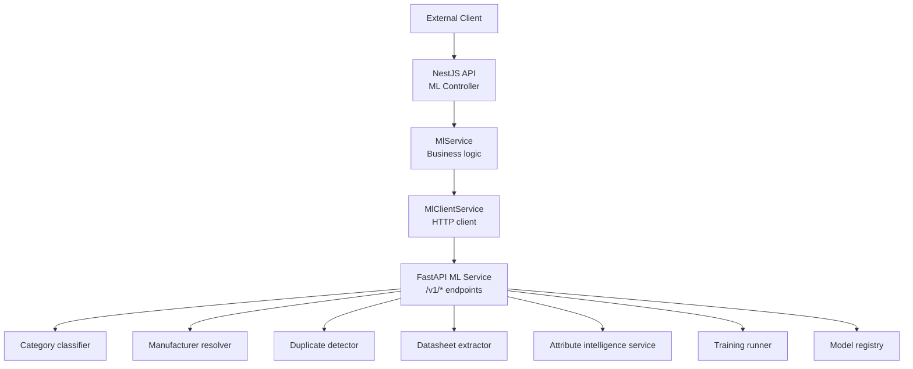
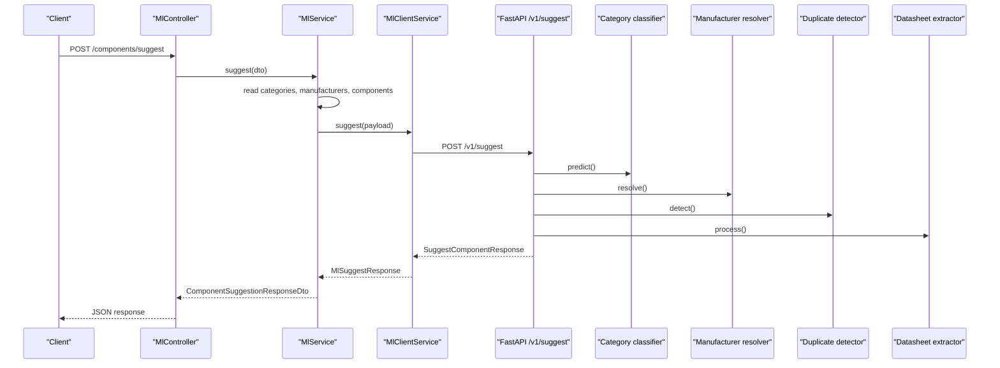
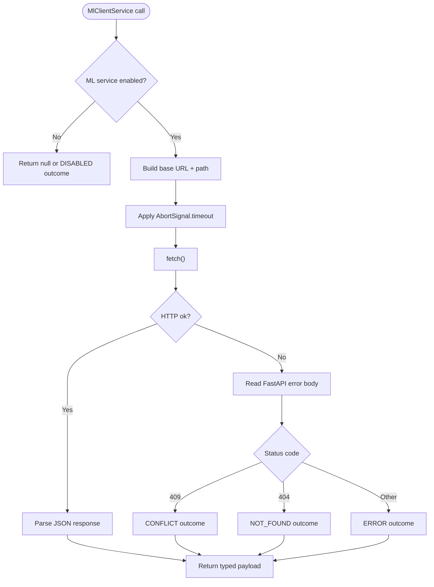
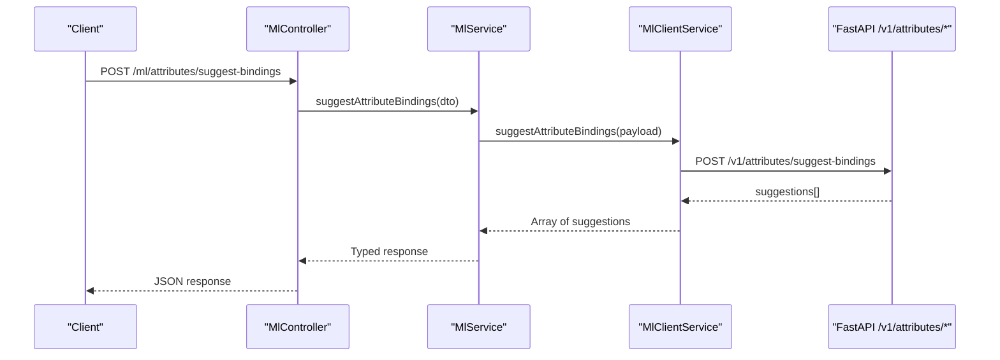
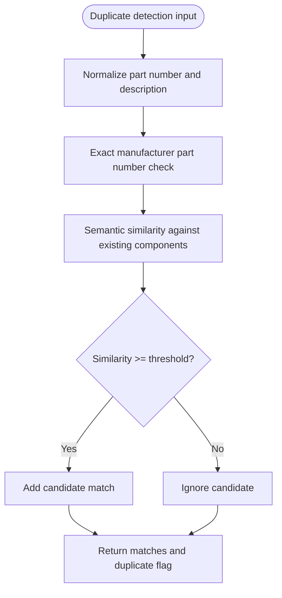
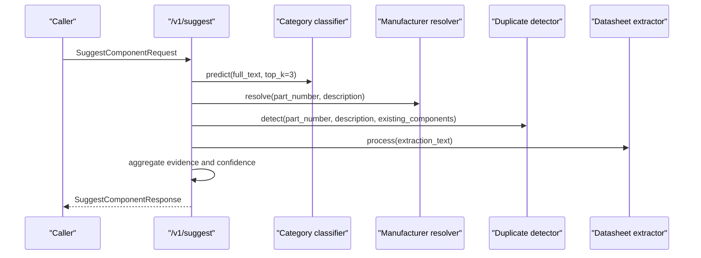
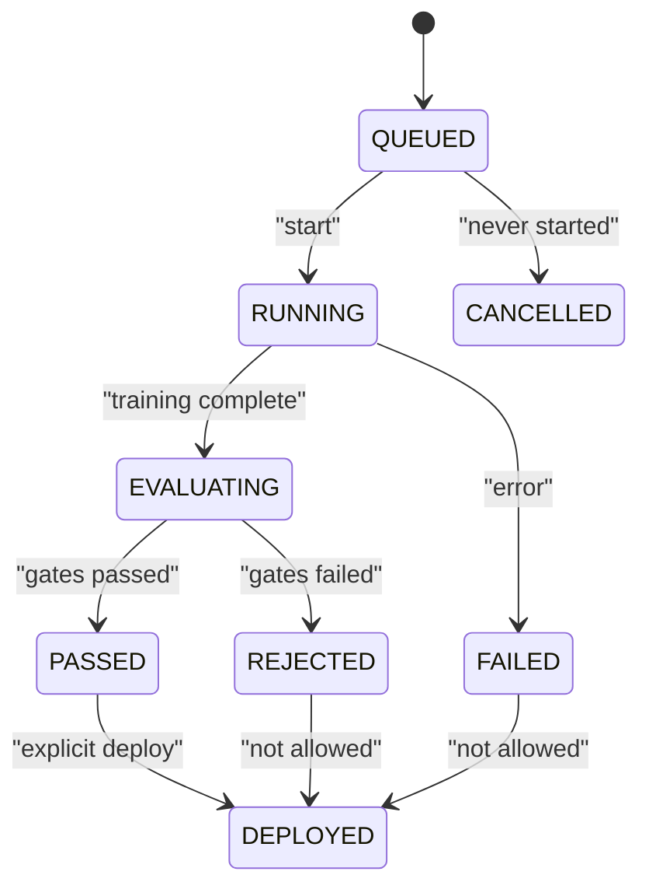
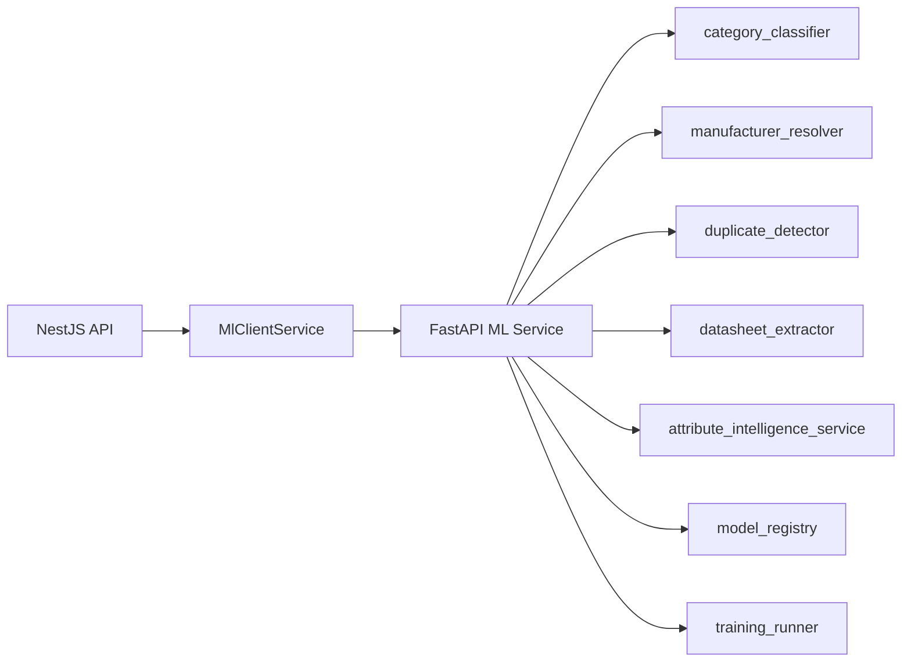

# Communication Patterns

<cite>
**Referenced Files in This Document**
- [main.py](file://apps/ml/app/main.py)
- [schemas.py](file://apps/ml/app/schemas.py)
- [ml-client.service.ts](file://apps/api/src/ml/ml-client.service.ts)
- [ml.controller.ts](file://apps/api/src/ml/ml.controller.ts)
- [ml.service.ts](file://apps/api/src/ml/ml.service.ts)
- [ml-ops.dtos.ts](file://apps/api/src/ml/ops/ml-ops.dtos.ts)
- [ml-ops.service.ts](file://apps/api/src/ml/ops/ml-ops.service.ts)
- [ml-ops.repository.ts](file://apps/api/src/ml/ops/ml-ops.repository.ts)
</cite>

## Table of Contents
1. [Introduction](#introduction)
2. [Project Structure](#project-structure)
3. [Core Components](#core-components)
4. [Architecture Overview](#architecture-overview)
5. [Detailed Component Analysis](#detailed-component-analysis)
6. [Dependency Analysis](#dependency-analysis)
7. [Performance Considerations](#performance-considerations)
8. [Troubleshooting Guide](#troubleshooting-guide)
9. [Conclusion](#conclusion)

## Introduction
This document explains how the main NestJS API communicates with the Python ML microservice. It covers:

- REST endpoints exposed by the ML service and their request/response schemas.
- The HTTP client implementation used by the API to call the ML service.
- Connection behavior, timeouts, error handling, and failure classification.
- Examples for attribute intelligence, duplicate detection, and classification tasks.
- Asynchronous training operations and durable job tracking.
- Performance characteristics, caching strategies, and load balancing considerations.

The communication boundary is intentionally simple: the API uses a typed HTTP client over JSON, while the ML service exposes FastAPI routes with Pydantic models.

## Project Structure
The relevant code is split between two applications:

- `apps/ml` — Python FastAPI service implementing model inference, datasheet extraction, attribute intelligence, and ML operations.
- `apps/api` — NestJS application exposing public and admin APIs that delegate ML work to the Python service through `MlClientService`.

**Diagram sources**
- [ml.controller.ts:41-96](file://apps/api/src/ml/ml.controller.ts#L41-L96)
- [ml.service.ts:304-311](file://apps/api/src/ml/ml.service.ts#L304-L311)
- [ml-client.service.ts:310-322](file://apps/api/src/ml/ml-client.service.ts#L310-L322)
- [main.py:67-80](file://apps/ml/app/main.py#L67-L80)
- [main.py:103-152](file://apps/ml/app/main.py#L103-L152)
- [main.py:262-361](file://apps/ml/app/main.py#L262-L361)
- [main.py:383-486](file://apps/ml/app/main.py#L383-L486)

**Section sources**
- [ml.controller.ts:41-96](file://apps/api/src/ml/ml.controller.ts#L41-L96)
- [main.py:67-80](file://apps/ml/app/main.py#L67-L80)

## Core Components
The communication pattern has three layers:

1. **Public API surface:** `MlController` exposes authenticated or admin-only routes such as component suggestion, feedback, attribute intelligence, and ML operations.
2. **API business layer:** `MlService` enriches requests with ERP context (categories, manufacturers, existing components, Data Pack hints), calls the ML service, and maps results into domain DTOs.
3. **ML client layer:** `MlClientService` performs HTTP calls to the Python service using Node’s built-in `fetch`, applies timeouts, logs failures, and returns typed payloads or `null`.

Key responsibilities:

| Layer | Responsibility |
|---|---|
| `MlController` | Route definition, authentication, authorization, request binding |
| `MlService` | Request enrichment, fallback logic, result normalization, database reads |
| `MlClientService` | Outbound HTTP calls, timeout enforcement, error body parsing, operation outcome classification |
| FastAPI service | Inference, validation, response serialization, training control plane |

**Section sources**
- [ml.controller.ts:41-96](file://apps/api/src/ml/ml.controller.ts#L41-L96)
- [ml.service.ts:304-311](file://apps/api/src/ml/ml.service.ts#L304-L311)
- [ml-client.service.ts:310-322](file://apps/api/src/ml/ml-client.service.ts#L310-L322)

## Architecture Overview
The primary request flow for component intelligence is synchronous: the API builds a rich payload and waits for the ML service to return category predictions, manufacturer resolution, duplicate warnings, and extracted attributes.

**Diagram sources**
- [ml.controller.ts:121-127](file://apps/api/src/ml/ml.controller.ts#L121-L127)
- [ml.service.ts:313-447](file://apps/api/src/ml/ml.service.ts#L313-L447)
- [ml-client.service.ts:340-401](file://apps/api/src/ml/ml-client.service.ts#L340-L401)
- [main.py:154-256](file://apps/ml/app/main.py#L154-L256)

For attribute intelligence, the API calls dedicated `/v1/attributes/*` endpoints. For ML operations, the API uses a separate control-plane path that tracks durable training runs.

**Section sources**
- [ml.controller.ts:196-289](file://apps/api/src/ml/ml.controller.ts#L196-L289)
- [main.py:262-361](file://apps/ml/app/main.py#L262-L361)
- [main.py:383-486](file://apps/ml/app/main.py#L383-L486)

## Detailed Component Analysis

### ML Microservice REST Endpoints
The ML service defines health, readiness, inference, attribute intelligence, and ML operations endpoints.

| Endpoint | Method | Purpose | Request Schema | Response Schema |
|---|---:|---|---|---|
| `/health` | GET | Liveness probe | None | `HealthResponse` |
| `/ready` | GET | Readiness and running model identity | None | `ReadyResponse` |
| `/v1/predict/category` | POST | Category prediction | `PredictCategoryRequest` | `PredictCategoryResponse` |
| `/v1/predict/category/batch` | POST | Batch category prediction | `BatchPredictCategoryRequest` | `BatchPredictCategoryResponse` |
| `/v1/resolve/manufacturer` | POST | Manufacturer resolution | `ResolveManufacturerRequest` | `ResolveManufacturerResponse` |
| `/v1/detect/duplicates` | POST | Duplicate detection | `DetectDuplicatesRequest` | `DetectDuplicatesResponse` |
| `/v1/extract/datasheet` | POST | Datasheet text/PDF extraction | `ExtractDatasheetRequest` | `ExtractDatasheetResponse` |
| `/v1/suggest` | POST | Composite component suggestion | `SuggestComponentRequest` | `SuggestComponentResponse` |
| `/v1/attributes/suggest-bindings` | POST | Attribute-to-category bindings | `SuggestAttributeBindingsRequest` | `SuggestAttributeBindingsResponse` |
| `/v1/attributes/suggest-category-attributes` | POST | Category-level attribute suggestions | `SuggestCategoryAttributesRequest` | `SuggestCategoryAttributesResponse` |
| `/v1/attributes/suggest-component-attributes` | POST | Component-level attribute relevance | `SuggestComponentAttributesRequest` | `SuggestComponentAttributesResponse` |
| `/v1/attributes/suggest-config` | POST | New attribute configuration suggestion | `SuggestAttributeConfigRequest` | `SuggestAttributeConfigResponse` |
| `/v1/attributes/detect-duplicates` | POST | Attribute library duplicates | `DetectAttributeDuplicatesRequest` | `DetectAttributeDuplicatesResponse` |
| `/v1/attributes/suggest-enum-values` | POST | Enum option suggestions | `SuggestEnumValuesRequest` | `SuggestEnumValuesResponse` |
| `/v1/attributes/audit` | POST | Library audit | `AuditAttributeLibraryRequest` | `AuditAttributeLibraryResponse` |
| `/v1/training/runs` | POST | Start training run | `TrainingRunRequest` | `TrainingRunResponse` |
| `/v1/training/runs/active` | GET | Active training run | None | Optional `TrainingRunResponse` |
| `/v1/training/runs` | GET | List training runs | None | `TrainingRunListResponse` |
| `/v1/training/runs/{run_id}` | GET | Get training run | Path parameter | `TrainingRunResponse` |
| `/v1/models` | GET | Model registry overview | None | `ModelRegistryResponse` |
| `/v1/models/active` | GET | Active model alias | None | `ModelRegistryResponse` |
| `/v1/models/deploy` | POST | Deploy candidate | `ModelDeployRequest` | `ModelDeploymentResponse` |
| `/v1/models/rollback` | POST | Rollback production model | None | `ModelDeploymentResponse` |
| `/v1/models/reload` | POST | Reload running artifact | None | `ModelDeploymentResponse` |
| `/v1/datasets/current` | GET | Dataset snapshot and distribution | None | `DatasetOverviewResponse` |

**Section sources**
- [main.py:82-101](file://apps/ml/app/main.py#L82-L101)
- [main.py:103-152](file://apps/ml/app/main.py#L103-L152)
- [main.py:154-256](file://apps/ml/app/main.py#L154-L256)
- [main.py:262-361](file://apps/ml/app/main.py#L262-L361)
- [main.py:383-486](file://apps/ml/app/main.py#L383-L486)
- [schemas.py:86-228](file://apps/ml/app/schemas.py#L86-L228)
- [schemas.py:243-330](file://apps/ml/app/schemas.py#L243-L330)
- [schemas.py:336-500](file://apps/ml/app/schemas.py#L336-L500)
- [schemas.py:511-581](file://apps/ml/app/schemas.py#L511-L581)

### Request and Response Schemas
The ML service uses Pydantic models for strict schema validation. Key shared structures include:

- `EvidenceItem`: describes why a value was suggested, including type, description, weight, source, optional page/text from datasheet extraction, and optional section.
- `DataPackIntelligenceHint`: carries Data Pack guidance such as category aliases, MPN patterns, manufacturer hints, expected attributes, and unit hints.
- `ErpCategory` and `ErpManufacturer`: reference data sent from the API so the ML service can resolve against live ERP state.
- `ExistingComponent`: includes the ERP SKU and the authoritative manufacturer part number used for duplicate detection.
- `ExtractedAttribute`: includes canonical value/unit, source representation, formatted string, confidence, and evidence.

For attribute intelligence, the schemas distinguish library-level operations (bindings, category attributes, config, duplicates, enum values, audit) from component-level relevance (`SuggestComponentAttributesRequest`).

For ML operations, the schemas expose training run metadata, model versions, dataset snapshots, deployment outcomes, and dataset distribution without leaking filesystem paths or credentials.

**Section sources**
- [schemas.py:4-39](file://apps/ml/app/schemas.py#L4-L39)
- [schemas.py:40-60](file://apps/ml/app/schemas.py#L40-L60)
- [schemas.py:132-163](file://apps/ml/app/schemas.py#L132-L163)
- [schemas.py:164-228](file://apps/ml/app/schemas.py#L164-L228)
- [schemas.py:336-500](file://apps/ml/app/schemas.py#L336-L500)
- [schemas.py:511-581](file://apps/ml/app/schemas.py#L511-L581)

### HTTP Client Implementation
`MlClientService` is the single outbound boundary to the ML service. Its key behaviors are:

- Base URL comes from `ML_SERVICE_URL`, defaulting to `http://localhost:5001`.
- Feature toggle comes from `ML_SERVICE_ENABLED`; when disabled, most methods return `null` or a disabled outcome.
- Timeouts use `AbortSignal.timeout`:
  - Default timeout: 1500 ms.
  - Datasheet extraction: 3000 ms.
  - Audit attribute library: 4500 ms.
  - ML operations dataset query: 3000 ms.
  - ML operations deploy/rollback/reload: 6000 ms.
- All calls set `Content-Type: application/json` and serialize payloads with `JSON.stringify`.
- Non-OK responses are logged and converted to `null` for inference calls; ML operations calls return structured `MlOpsCallOutcome`.
- Error bodies accept both plain strings and `{reason, message}` objects produced by FastAPI’s `HTTPException`.

There is no explicit connection pool or retry policy in `MlClientService`. Connections rely on Node’s underlying HTTP agent defaults.

**Diagram sources**
- [ml-client.service.ts:317-322](file://apps/api/src/ml/ml-client.service.ts#L317-L322)
- [ml-client.service.ts:328-338](file://apps/api/src/ml/ml-client.service.ts#L328-L338)
- [ml-client.service.ts:340-401](file://apps/api/src/ml/ml-client.service.ts#L340-L401)
- [ml-client.service.ts:413-455](file://apps/api/src/ml/ml-client.service.ts#L413-L455)
- [ml-client.service.ts:832-874](file://apps/api/src/ml/ml-client.service.ts#L832-L874)
- [ml-client.service.ts:891-942](file://apps/api/src/ml/ml-client.service.ts#L891-L942)

**Section sources**
- [ml-client.service.ts:310-322](file://apps/api/src/ml/ml-client.service.ts#L310-L322)
- [ml-client.service.ts:328-401](file://apps/api/src/ml/ml-client.service.ts#L328-L401)
- [ml-client.service.ts:413-455](file://apps/api/src/ml/ml-client.service.ts#L413-L455)
- [ml-client.service.ts:891-942](file://apps/api/src/ml/ml-client.service.ts#L891-L942)

### Error Handling Strategies
The API and ML service handle errors at different layers:

| Layer | Strategy |
|---|---|
| ML service | Raises FastAPI `HTTPException` with either a string or `{reason, message}` detail |
| ML client inference calls | Logs warning and returns `null`; callers treat this as an optional feature failure |
| ML client operations calls | Returns `MlOpsCallOutcome` with `DISABLED`, `UNREACHABLE`, `CONFLICT`, `NOT_FOUND`, or `ERROR` |
| API controller | Applies authentication and authorization guards before calling services |
| API business layer | Uses `null` ML responses to fall back to deterministic rules where appropriate |

Important distinction:

- Inference endpoints such as `/v1/suggest` and `/v1/extract/datasheet` degrade gracefully because they are assistive features.
- ML operations endpoints such as `/v1/training/runs` and `/v1/models/deploy` must report precise failure kinds because they drive operator workflows.

**Section sources**
- [main.py:383-458](file://apps/ml/app/main.py#L383-L458)
- [ml-client.service.ts:138-163](file://apps/api/src/ml/ml-client.service.ts#L138-L163)
- [ml-client.service.ts:283-308](file://apps/api/src/ml/ml-client.service.ts#L283-L308)
- [ml-client.service.ts:390-401](file://apps/api/src/ml/ml-client.service.ts#L390-L401)
- [ml-client.service.ts:891-942](file://apps/api/src/ml/ml-client.service.ts#L891-L942)

### Retry Mechanisms and Circuit Breaker Patterns
The current implementation does not implement explicit retries or a circuit breaker:

- No retry loop exists around `fetch()` calls.
- No exponential backoff is implemented.
- No circuit breaker state tracks repeated failures.
- Graceful degradation is achieved by returning `null` for non-critical ML calls and by checking `enabled`.

Recommended operational interpretation:

- Treat ML unavailability as a degraded mode rather than a hard failure for suggestion flows.
- Treat ML unavailability as a blocking failure for ML operations flows, which already convert unreachable outcomes into user-facing service-unavailable errors.

If retries or circuit breaking are added later, they should be scoped carefully:

- Retries should only apply to idempotent operations.
- Retries should not mask permanent conflicts such as duplicate training runs.
- A circuit breaker should short-circuit repeated calls after sustained failures while still allowing periodic probes.

**Section sources**
- [ml-client.service.ts:340-401](file://apps/api/src/ml/ml-client.service.ts#L340-L401)
- [ml-client.service.ts:891-942](file://apps/api/src/ml/ml-client.service.ts#L891-L942)
- [ml-ops.service.ts:512-541](file://apps/api/src/ml/ops/ml-ops.service.ts#L512-L541)

### Example: Attribute Intelligence Calls
Attribute intelligence is exposed through `/v1/attributes/*`. The API validates and forwards these requests through `MlService`, which then calls `MlClientService`.

Common scenarios:

| Scenario | ML endpoint | Input highlights | Output highlights |
|---|---|---|---|
| Bind an attribute to categories | `/v1/attributes/suggest-bindings` | Attribute name/code, description, data type, unit category, categories | Suggestions with confidence, reason, evidence, and model version |
| Suggest attributes for a category | `/v1/attributes/suggest-category-attributes` | Category identity, existing attributes, bound attribute IDs | Suggestions indicating whether an attribute is already bound |
| Suggest attributes for a component | `/v1/attributes/suggest-component-attributes` | Query, part number, description, datasheet text, categories, attributes, extracted attributes | Relevance and optional suggested values with evidence |
| Detect attribute duplicates | `/v1/attributes/detect-duplicates` | Attribute name/code, existing attributes/bindings, threshold | Duplicate flag, matches, and suggested aliases |
| Suggest enum values | `/v1/attributes/suggest-enum-values` | Attribute code/name, existing options | Options with code, label, source, and confidence |
| Audit attribute library | `/v1/attributes/audit` | Attributes, categories, bindings, usage counts | Summary and issues with severity and evidence |

**Diagram sources**
- [ml.controller.ts:196-202](file://apps/api/src/ml/ml.controller.ts#L196-L202)
- [ml-client.service.ts:457-506](file://apps/api/src/ml/ml-client.service.ts#L457-L506)
- [main.py:262-274](file://apps/ml/app/main.py#L262-L274)

**Section sources**
- [ml.controller.ts:196-289](file://apps/api/src/ml/ml.controller.ts#L196-L289)
- [ml-client.service.ts:457-874](file://apps/api/src/ml/ml-client.service.ts#L457-L874)
- [main.py:262-361](file://apps/ml/app/main.py#L262-L361)
- [schemas.py:336-500](file://apps/ml/app/schemas.py#L336-L500)

### Example: Duplicate Detection Requests
Duplicate detection has two related surfaces:

1. **Component duplicate detection:** `/v1/detect/duplicates` compares a new component against existing components using exact manufacturer part numbers and semantic similarity.
2. **Attribute duplicate detection:** `/v1/attributes/detect-duplicates` checks whether a new attribute definition duplicates an existing one.

The component duplicate detection request includes:

- Part number and description.
- Existing components with ERP SKU and manufacturer part number.
- Similarity threshold.
- Optional Data Pack hints.

The response includes:

- Boolean duplicate flag.
- Matches with similarity, confidence level, match type, reason, and evidence.

**Diagram sources**
- [main.py:136-144](file://apps/ml/app/main.py#L136-L144)
- [schemas.py:132-163](file://apps/ml/app/schemas.py#L132-L163)

**Section sources**
- [main.py:136-144](file://apps/ml/app/main.py#L136-L144)
- [schemas.py:132-163](file://apps/ml/app/schemas.py#L132-L163)

### Example: Classification Tasks
Classification is primarily exposed through:

- `/v1/predict/category` for single-text classification.
- `/v1/predict/category/batch` for batch classification.
- `/v1/suggest`, which internally performs category classification, manufacturer resolution, duplicate detection, and datasheet extraction.

The composite `/v1/suggest` endpoint computes an overall confidence level based on signals from category prediction, manufacturer resolution, and datasheet extraction.

**Diagram sources**
- [main.py:154-256](file://apps/ml/app/main.py#L154-L256)
- [schemas.py:197-216](file://apps/ml/app/schemas.py#L197-L216)

**Section sources**
- [main.py:103-124](file://apps/ml/app/main.py#L103-L124)
- [main.py:154-256](file://apps/ml/app/main.py#L154-L256)
- [schemas.py:86-105](file://apps/ml/app/schemas.py#L86-L105)
- [schemas.py:197-216](file://apps/ml/app/schemas.py#L197-L216)

### Asynchronous Processing Patterns and Background Job Integration
Asynchronous processing appears in two forms:

1. **Long-running ML operations:** Training runs are started asynchronously. The API creates a durable row first, marks it queued, and then asks the ML service to start the run. The caller receives a run ID and polls status.
2. **Inference calls:** Most inference endpoints are synchronous. The API waits for the ML service to finish before responding.

Training run lifecycle states include:

- `QUEUED`
- `RUNNING`
- `EVALUATING`
- `PASSED`
- `REJECTED`
- `FAILED`
- `CANCELLED`

Active statuses are `QUEUED`, `RUNNING`, and `EVALUATING`.

**Diagram sources**
- [ml-ops.dtos.ts:29-45](file://apps/api/src/ml/ops/ml-ops.dtos.ts#L29-L45)
- [ml-ops.service.ts:512-541](file://apps/api/src/ml/ops/ml-ops.service.ts#L512-L541)

**Section sources**
- [ml-ops.dtos.ts:21-49](file://apps/api/src/ml/ops/ml-ops.dtos.ts#L21-L49)
- [ml-ops.service.ts:512-541](file://apps/api/src/ml/ops/ml-ops.service.ts#L512-L541)
- [ml-ops.repository.ts:88-125](file://apps/api/src/ml/ops/ml-ops.repository.ts#L88-L125)

### Message Queuing
There is no visible message queue integration in the analyzed files. Training dispatch is performed directly via HTTP to the ML service, and the durable record provides persistence and observability. If a queue is introduced later, it would sit between the API and the ML service to decouple long-running jobs from HTTP request lifecycles.

[No sources needed since this section summarizes observed absence of queuing infrastructure]

## Dependency Analysis
The API depends on the ML service through a thin HTTP client. The ML service depends on internal Python services for classification, manufacturer resolution, duplicate detection, datasheet extraction, attribute intelligence, model registry, and training runner.

**Diagram sources**
- [ml-client.service.ts:310-322](file://apps/api/src/ml/ml-client.service.ts#L310-L322)
- [main.py:47-58](file://apps/ml/app/main.py#L47-L58)
- [main.py:67-80](file://apps/ml/app/main.py#L67-L80)

Coupling characteristics:

- The API couples to the ML service through a small set of well-defined JSON contracts.
- The ML service couples to its internal services through function calls rather than another network boundary.
- The API’s business layer adds significant coupling to ERP data and Data Pack hints before calling the ML service.
- The ML client is the only place that knows the ML service’s base URL and timeout strategy.

Potential risks:

- Tight coupling between `MlService` and `MlClientService` means changes to ML payloads require coordinated updates across TypeScript interfaces, Python Pydantic models, and API DTOs.
- Lack of retries and circuit breakers makes transient network failures dependent on caller resilience.
- Long-running operations depend on durable records but do not yet show a queue-based retry mechanism.

**Section sources**
- [ml-client.service.ts:310-322](file://apps/api/src/ml/ml-client.service.ts#L310-L322)
- [ml.service.ts:313-447](file://apps/api/src/ml/ml.service.ts#L313-L447)
- [main.py:47-58](file://apps/ml/app/main.py#L47-L58)

## Performance Considerations

### Timeouts
Timeouts are applied per call:

| Call | Timeout multiplier | Rationale |
|---|---:|---|
| Health, suggest, attribute intelligence | 1x | Short interactive calls |
| Datasheet extraction | 2x | PDF/text processing may take longer |
| Audit attribute library | 3x | Full-library analysis |
| ML operations dataset query | 2x | Registry/dataset queries |
| ML operations deploy/rollback/reload | 4x | Deployment operations |

These timeouts protect the API from hanging indefinitely when the ML service is slow or unresponsive.

**Section sources**
- [ml-client.service.ts:315-315](file://apps/api/src/ml/ml-client.service.ts#L315-L315)
- [ml-client.service.ts:420-426](file://apps/api/src/ml/ml-client.service.ts#L420-L426)
- [ml-client.service.ts:832-838](file://apps/api/src/ml/ml-client.service.ts#L832-L838)
- [ml-client.service.ts:962-1034](file://apps/api/src/ml/ml-client.service.ts#L962-L1034)

### Connection Pooling
There is no explicit connection pool configured in `MlClientService`. Node’s `fetch` uses the default HTTP agent. For high-throughput deployments, consider:

- Configuring a persistent agent with larger connection pools.
- Limiting concurrent ML calls per worker to avoid overwhelming the ML service.
- Monitoring connection exhaustion under load.

**Section sources**
- [ml-client.service.ts:310-322](file://apps/api/src/ml/ml-client.service.ts#L310-L322)

### Caching Strategies
Observed caching behavior:

- The ML service eagerly loads lightweight models during startup.
- The API caches ERP categories, manufacturers, attributes, and Data Pack hints within a single suggestion request.
- There is no cross-request cache for ML inference results in the analyzed code.

Recommendations:

- Add a short-lived cache for stable reference lookups if ERP data does not change frequently.
- Add a content-addressable cache for expensive ML inference results when inputs are identical.
- Ensure cache invalidation aligns with model reloads and Data Pack updates.

**Section sources**
- [main.py:60-65](file://apps/ml/app/main.py#L60-L65)
- [ml.service.ts:322-354](file://apps/api/src/ml/ml.service.ts#L322-L354)

### Load Balancing
The ML service is addressed by a single base URL. Load balancing concerns belong to the deployment layer:

- Use a reverse proxy or service mesh to distribute traffic across multiple ML service replicas.
- Configure health checks against `/health` and readiness checks against `/ready`.
- Avoid sticky sessions unless required; ML inference is stateless except for loaded models.
- Monitor per-replica latency and error rates to detect hotspots.

[No sources needed since this section provides general guidance]

## Troubleshooting Guide

### Common Failure Modes

| Symptom | Likely Cause | Resolution |
|---|---|---|
| ML health probe fails | ML service disabled, unreachable, or unhealthy | Check `ML_SERVICE_ENABLED`, `ML_SERVICE_URL`, and `/health` |
| Suggestion returns partial results | ML service returned non-OK or timed out | Inspect logs for connection or timeout warnings |
| Training cannot start | ML service disabled or unreachable | Check `MlOpsCallOutcome.kind` and service availability |
| Training start returns conflict | Another active training run exists | Wait for completion or cancel according to policy |
| Training run not found | Run ID does not exist or process restarted | Poll `/v1/training/runs` and reconcile with API records |
| Deployment refused | Candidate did not pass gates or is not eligible | Review evaluation summary and gate summary |
| Rollback refused | No backup artifact exists | Restore previous artifact or redeploy a valid candidate |

### Diagnostic Steps

1. Verify the ML service is reachable:
   - Check `GET /health`.
   - Check `GET /ready` for model loading status.
2. Validate the API-side configuration:
   - Confirm `ML_SERVICE_URL` points to the correct host and port.
   - Confirm `ML_SERVICE_ENABLED` is not set to `false`.
3. Inspect API logs:
   - Look for warnings about ML connection failures or timeouts.
   - For ML operations, inspect the structured failure kind and message.
4. Inspect ML service logs:
   - Look for FastAPI exceptions raised by training runner or model registry.
5. Correlate training runs:
   - Use the API’s durable run record to track lifecycle transitions.
   - Compare API status with ML service `/v1/training/runs/{run_id}`.

**Section sources**
- [ml.controller.ts:103-112](file://apps/api/src/ml/ml.controller.ts#L103-L112)
- [ml-client.service.ts:328-338](file://apps/api/src/ml/ml-client.service.ts#L328-L338)
- [ml-client.service.ts:390-401](file://apps/api/src/ml/ml-client.service.ts#L390-L401)
- [ml-client.service.ts:891-942](file://apps/api/src/ml/ml-client.service.ts#L891-L942)
- [main.py:82-101](file://apps/ml/app/main.py#L82-L101)
- [main.py:383-486](file://apps/ml/app/main.py#L383-L486)

## Conclusion
The communication pattern between the main API and the ML microservice is intentionally straightforward:

- The API exposes authenticated REST endpoints.
- `MlService` enriches requests with ERP context and maps results into domain DTOs.
- `MlClientService` performs JSON-over-HTTP calls with timeouts and graceful degradation.
- The ML service implements inference, attribute intelligence, and ML operations with strict Pydantic schemas.
- Asynchronous training is tracked through durable records rather than an explicit queue.
- Reliability relies on timeouts, error classification, and API-side fallbacks rather than retries or circuit breakers.

For production hardening, prioritize:

- Explicit retry policies for idempotent operations.
- Circuit breaker behavior for sustained ML service failures.
- Connection pooling tuned to deployment scale.
- Observability around latency, error rates, and ML service readiness.
- Clear separation between optional inference assistance and blocking ML operations.