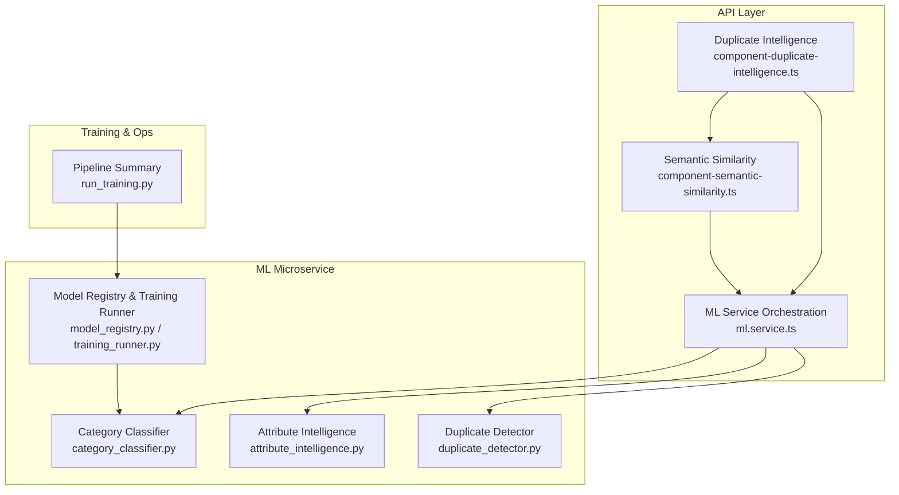
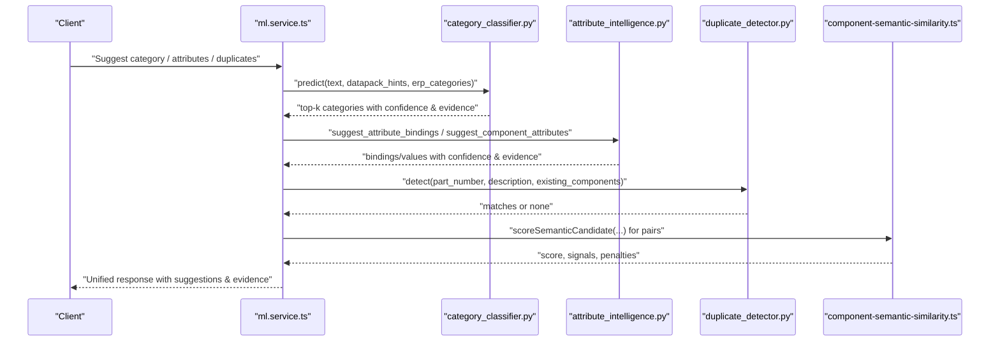
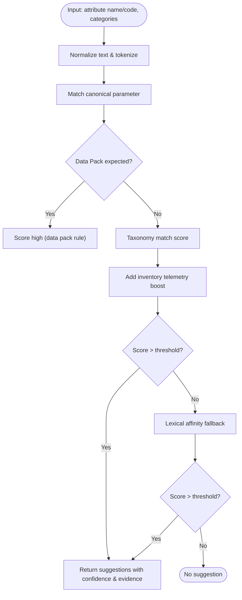
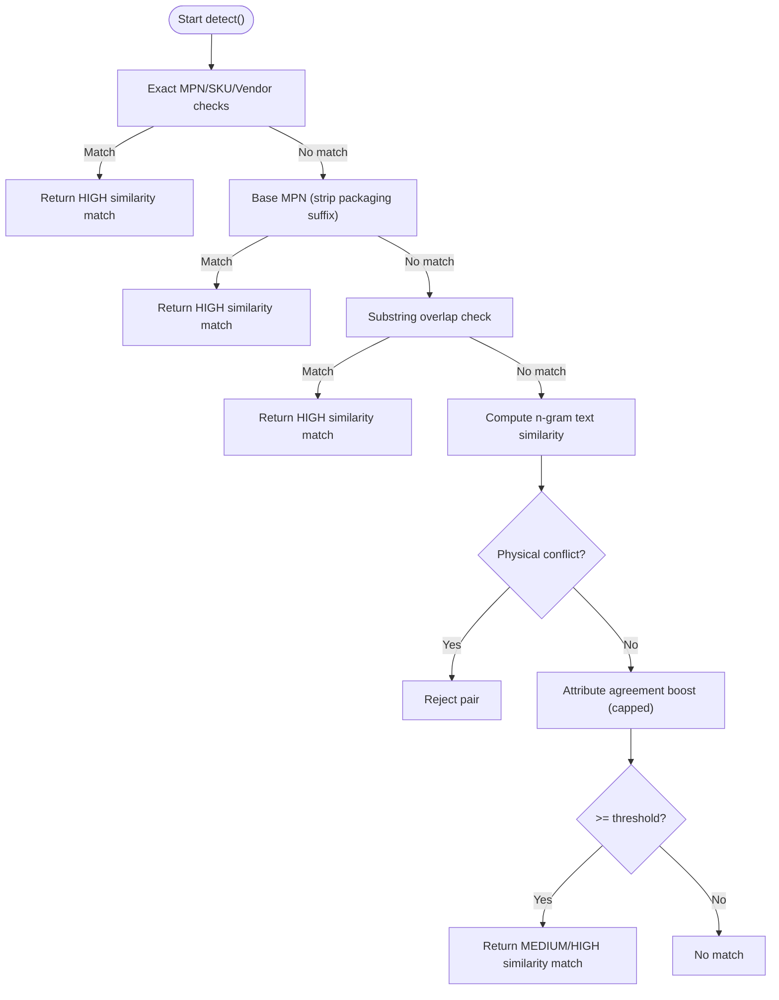
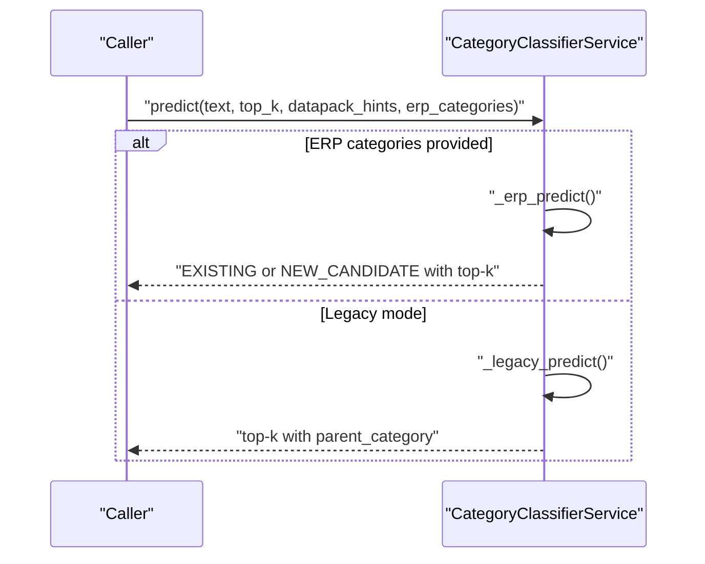
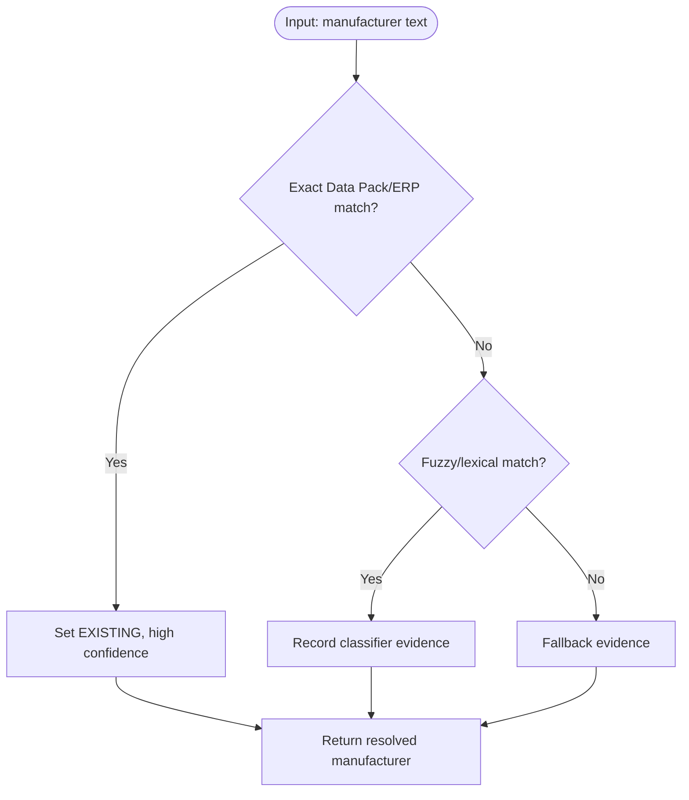
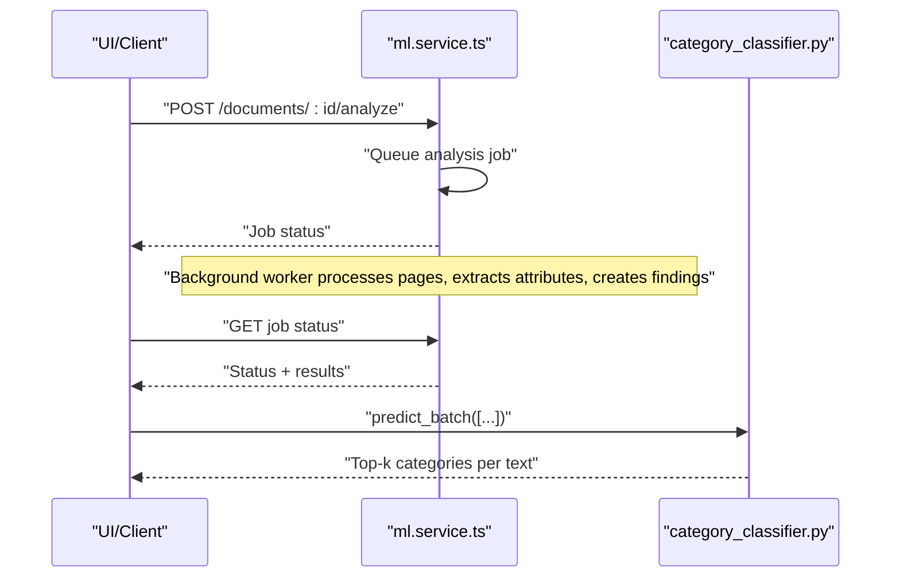
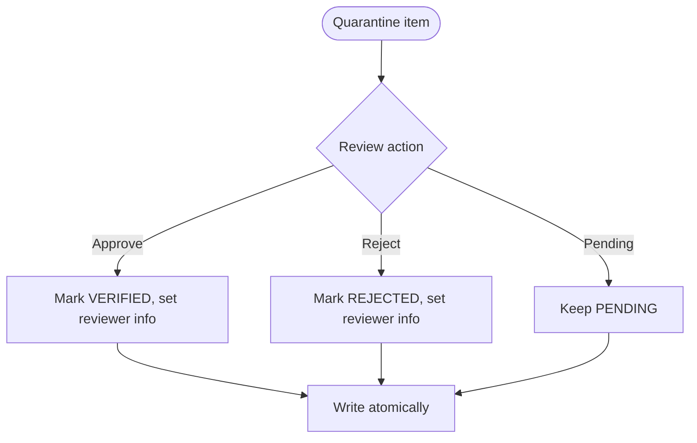
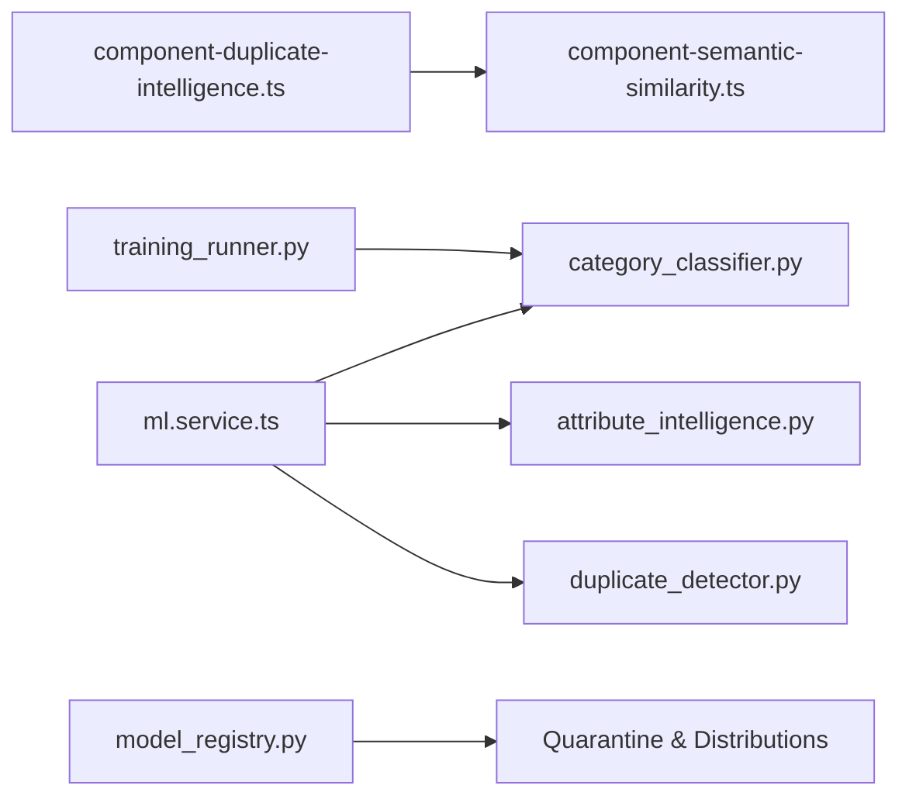

# Intelligence Workflows

<cite>
**Referenced Files in This Document**
- [attribute_intelligence.py](file://apps/ml/app/services/attribute_intelligence.py)
- [category_classifier.py](file://apps/ml/app/services/category_classifier.py)
- [duplicate_detector.py](file://apps/ml/app/services/duplicate_detector.py)
- [component-duplicate-intelligence.ts](file://apps/api/src/ml/component-duplicate-intelligence.ts)
- [component-semantic-similarity.ts](file://apps/api/src/ml/component-semantic-similarity.ts)
- [ml.service.ts](file://apps/api/src/ml/ml.service.ts)
- [run_training.py](file://apps/ml/pipeline/run_training.py)
- [training_runner.py](file://apps/ml/app/services/training_runner.py)
- [model_registry.py](file://apps/ml/app/services/model_registry.py)
- [0056-lightweight-ml-architecture.md](file://docs/rfcs/0056-lightweight-ml-architecture.md)
</cite>

## Table of Contents
1. Introduction
2. Project Structure
3. Core Components
4. Architecture Overview
5. Detailed Component Analysis
6. Dependency Analysis
7. Performance Considerations
8. Troubleshooting Guide
9. Conclusion

## Introduction
This document explains the ML intelligence workflows and processing pipelines that power attribute intelligence, duplicate detection, category classification, manufacturer resolution, entity matching, data enrichment, batch/streaming analysis, real-time inference, quality assurance, result validation, and human-in-the-loop review. It focuses on how text is extracted and normalized, how features are engineered, how predictions are scored and validated, and how results are surfaced to users with confidence levels and evidence.

## Project Structure
The intelligence system spans two main layers:
- Python ML microservice (apps/ml): services for attribute intelligence, category classification, duplicate detection, model registry, training runner, and pipeline orchestration.
- API layer (apps/api): deterministic duplicate intelligence, semantic similarity scoring, manufacturer resolution, and integration points for suggestions and reviews.

**Diagram sources**
- [component-duplicate-intelligence.ts:18-45](file://apps/api/src/ml/component-duplicate-intelligence.ts#L18-L45)
- [component-semantic-similarity.ts:6-23](file://apps/api/src/ml/component-semantic-similarity.ts#L6-L23)
- [ml.service.ts:141-179](file://apps/api/src/ml/ml.service.ts#L141-L179)
- [attribute_intelligence.py:497-632](file://apps/ml/app/services/attribute_intelligence.py#L497-L632)
- [category_classifier.py:44-128](file://apps/ml/app/services/category_classifier.py#L44-L128)
- [duplicate_detector.py:35-46](file://apps/ml/app/services/duplicate_detector.py#L35-L46)
- [training_runner.py:28-58](file://apps/ml/app/services/training_runner.py#L28-L58)
- [run_training.py:113-133](file://apps/ml/pipeline/run_training.py#L113-L133)

**Section sources**
- [0056-lightweight-ml-architecture.md:32-63](file://docs/rfcs/0056-lightweight-ml-architecture.md#L32-L63)

## Core Components
- Attribute Intelligence: Extracts attributes from text, maps them to canonical parameters, suggests bindings to categories, and proposes values aligned with ERP definitions.
- Category Classification: Predicts top-k categories using a combination of legacy rules, ERP-aware scoring, knowledge base terms, MPN patterns, and an ML model when available.
- Duplicate Detection: Two-tier approach—deterministic exact/base MPN/SKU matches first, then advisory semantic similarity with strict physical/electrical guards.
- Semantic Similarity (API): Deterministic lexical/semantic candidate scoring with transparent weights and penalties; surfaces findings for review.
- Manufacturer Resolution: Exact and fuzzy matching against ERP manufacturers with fallbacks and evidence.
- Batch/Streaming/Real-time: Batch predict APIs, per-document analysis endpoints, and model reload for zero-downtime updates.
- Quality Assurance: Quarantine store, human review, audit caps, and training evaluation metrics.

**Section sources**
- [attribute_intelligence.py:497-632](file://apps/ml/app/services/attribute_intelligence.py#L497-L632)
- [category_classifier.py:192-259](file://apps/ml/app/services/category_classifier.py#L192-L259)
- [duplicate_detector.py:77-224](file://apps/ml/app/services/duplicate_detector.py#L77-L224)
- [component-duplicate-intelligence.ts:18-45](file://apps/api/src/ml/component-duplicate-intelligence.ts#L18-L45)
- [component-semantic-similarity.ts:76-155](file://apps/api/src/ml/component-semantic-similarity.ts#L76-L155)
- [ml.service.ts:737-815](file://apps/api/src/ml/ml.service.ts#L737-L815)
- [run_training.py:113-133](file://apps/ml/pipeline/run_training.py#L113-L133)

## Architecture Overview
End-to-end flow from input to decision:
- Inputs: component name, description, datasheet text, MPN/SKU, ERP categories/manufacturers, Data Pack hints.
- Processing:
  - Text normalization and tokenization.
  - Attribute extraction and canonical mapping.
  - Category prediction via hybrid scoring (rules + model).
  - Duplicate detection via exact/base matches then semantic similarity with guards.
  - Manufacturer resolution via exact/fuzzy match with ERP context.
- Outputs: structured suggestions with confidence, confidence level, candidates, and evidence.

**Diagram sources**
- [category_classifier.py:457-473](file://apps/ml/app/services/category_classifier.py#L457-L473)
- [attribute_intelligence.py:501-632](file://apps/ml/app/services/attribute_intelligence.py#L501-L632)
- [duplicate_detector.py:36-46](file://apps/ml/app/services/duplicate_detector.py#L36-L46)
- [component-semantic-similarity.ts:105-155](file://apps/api/src/ml/component-semantic-similarity.ts#L105-L155)
- [ml.service.ts:737-815](file://apps/api/src/ml/ml.service.ts#L737-L815)

## Detailed Component Analysis

### Attribute Intelligence Processing
- Text extraction and normalization:
  - Normalizes text, tokenizes words, computes hybrid similarity across aliases, canonical knowledge, substring overlap, Jaccard tokens, and character n-grams.
- Feature engineering:
  - Canonical parameter knowledge base defines standard electronics attributes with codes, units, groups, validation rules, and category associations.
  - Concept-to-option spellings map free-form values to ERP option codes safely.
- Prediction workflow:
  - Suggests category bindings for attributes using Data Pack hints, canonical taxonomy, inventory telemetry, and lexical fallback.
  - Suggests category attributes by combining Data Pack expectations and canonical domain knowledge.
  - Suggests component attributes by reconciling category bindings, Data Packs, extractor outputs, and definition options.

**Diagram sources**
- [attribute_intelligence.py:244-306](file://apps/ml/app/services/attribute_intelligence.py#L244-L306)
- [attribute_intelligence.py:501-632](file://apps/ml/app/services/attribute_intelligence.py#L501-L632)

**Section sources**
- [attribute_intelligence.py:244-306](file://apps/ml/app/services/attribute_intelligence.py#L244-L306)
- [attribute_intelligence.py:501-632](file://apps/ml/app/services/attribute_intelligence.py#L501-L632)

### Duplicate Detection Algorithms, Similarity Scoring, Merge Decision Logic
- Tier 1: Deterministic identity matches
  - Exact MPN, SKU, vendor part number, base MPN (packaging suffixes ignored), and significant substring overlaps.
  - Physical conflict guard rejects if guarded attributes disagree.
- Tier 2: Advisory semantic similarity
  - Character n-gram Jaccard similarity over descriptive text.
  - Attribute agreement corroborates only above a text floor and is capped to avoid false positives.
  - Returns top matches with similarity scores and evidence.

**Diagram sources**
- [duplicate_detector.py:77-224](file://apps/ml/app/services/duplicate_detector.py#L77-L224)
- [duplicate_detector.py:226-309](file://apps/ml/app/services/duplicate_detector.py#L226-L309)

**Section sources**
- [duplicate_detector.py:77-224](file://apps/ml/app/services/duplicate_detector.py#L77-L224)
- [duplicate_detector.py:226-309](file://apps/ml/app/services/duplicate_detector.py#L226-L309)

### Category Classification Processes, Confidence Scoring, Fallback Mechanisms
- Hybrid scoring:
  - Legacy path uses TF-IDF probabilities plus Data Pack rules and MPN patterns.
  - ERP-aware path enriches scores with category metadata, hierarchy specificity, manufacturer context, knowledge base terms, and model probabilities.
- Confidence levels:
  - HIGH/MEDIUM/LOW thresholds applied consistently.
- Fallbacks:
  - Empty input defaults to a broad category.
  - Knowledge-based new candidate proposals when no active category matches strongly.
  - Unknown resolution when ambiguous or low confidence.

**Diagram sources**
- [category_classifier.py:192-259](file://apps/ml/app/services/category_classifier.py#L192-L259)
- [category_classifier.py:278-455](file://apps/ml/app/services/category_classifier.py#L278-L455)
- [category_classifier.py:457-473](file://apps/ml/app/services/category_classifier.py#L457-L473)

**Section sources**
- [category_classifier.py:192-259](file://apps/ml/app/services/category_classifier.py#L192-L259)
- [category_classifier.py:278-455](file://apps/ml/app/services/category_classifier.py#L278-L455)
- [category_classifier.py:457-473](file://apps/ml/app/services/category_classifier.py#L457-L473)

### Manufacturer Resolution, Entity Matching, Data Enrichment
- Resolution strategy:
  - Exact Data Pack or ERP manufacturer match yields EXISTING resolution with high confidence.
  - Fallback classifier evidence recorded when no exact match found.
- Evidence and candidates:
  - Suggestions include matched type, confidence, confidence level, and candidate list with evidence.
- Data enrichment:
  - Manufacturer context boosts category scoring when present.

**Diagram sources**
- [ml.service.ts:737-815](file://apps/api/src/ml/ml.service.ts#L737-L815)

**Section sources**
- [ml.service.ts:737-815](file://apps/api/src/ml/ml.service.ts#L737-L815)

### Batch Processing, Streaming Analysis, Real-time Inference
- Batch:
  - Category classifier supports batch predict for multiple texts.
  - Pipeline summary reports dataset sizes, splits, accuracy, latency, memory, and promotion eligibility.
- Streaming/real-time:
  - Per-document analysis endpoint triggers asynchronous extraction and findings creation.
  - Model reload endpoint swaps artifacts atomically without downtime.

**Diagram sources**
- [category_classifier.py:472-473](file://apps/ml/app/services/category_classifier.py#L472-L473)
- [run_training.py:113-133](file://apps/ml/pipeline/run_training.py#L113-L133)

**Section sources**
- [category_classifier.py:472-473](file://apps/ml/app/services/category_classifier.py#L472-L473)
- [run_training.py:113-133](file://apps/ml/pipeline/run_training.py#L113-L133)

### Quality Assurance, Result Validation, Human-in-the-Loop Review
- Quarantine store:
  - Records pending/verified/rejected items with reasons and reviewer metadata.
  - Provides distribution summaries and truncated scans for large datasets.
- Human review:
  - Admin-guarded route to update quarantine record status, notes, and resolved fields.
  - Captures reviewer email honestly (null when unknown).
- Audit caps:
  - Duplicate findings capped per audit to prevent unbounded writes.
  - Semantic candidate retrieval bounded to protect performance.

**Diagram sources**
- [model_registry.py:371-403](file://apps/ml/app/services/model_registry.py#L371-L403)
- [ml.service.ts:1779-1840](file://apps/api/src/ml/ml.service.ts#L1779-L1840)
- [component-duplicate-intelligence.ts:101-129](file://apps/api/src/ml/component-duplicate-intelligence.ts#L101-L129)

**Section sources**
- [model_registry.py:371-403](file://apps/ml/app/services/model_registry.py#L371-L403)
- [ml.service.ts:1779-1840](file://apps/api/src/ml/ml.service.ts#L1779-L1840)
- [component-duplicate-intelligence.ts:101-129](file://apps/api/src/ml/component-duplicate-intelligence.ts#L101-L129)

## Dependency Analysis
Key dependencies and coupling:
- API duplicate intelligence depends on semantic similarity module for candidate scoring and blocking keys.
- ML service orchestrates category classifier, attribute intelligence, and duplicate detector.
- Training runner coordinates model registry and ensures safe, single-active-job execution.
- Model registry exposes quarantine and validated distributions for QA.

**Diagram sources**
- [component-duplicate-intelligence.ts:18-45](file://apps/api/src/ml/component-duplicate-intelligence.ts#L18-L45)
- [component-semantic-similarity.ts:6-23](file://apps/api/src/ml/component-semantic-similarity.ts#L6-L23)
- [ml.service.ts:141-179](file://apps/api/src/ml/ml.service.ts#L141-L179)
- [training_runner.py:28-58](file://apps/ml/app/services/training_runner.py#L28-L58)
- [model_registry.py:371-403](file://apps/ml/app/services/model_registry.py#L371-L403)

**Section sources**
- [component-duplicate-intelligence.ts:18-45](file://apps/api/src/ml/component-duplicate-intelligence.ts#L18-L45)
- [component-semantic-similarity.ts:6-23](file://apps/api/src/ml/component-semantic-similarity.ts#L6-L23)
- [ml.service.ts:141-179](file://apps/api/src/ml/ml.service.ts#L141-L179)
- [training_runner.py:28-58](file://apps/ml/app/services/training_runner.py#L28-L58)
- [model_registry.py:371-403](file://apps/ml/app/services/model_registry.py#L371-L403)

## Performance Considerations
- Deterministic rules minimize heavy computation; semantic similarity uses bounded candidate sets and caps.
- N-gram similarity and guarded attribute checks keep false positives low while preserving recall.
- Model artifact reload avoids restarts; atomic swap ensures consistent serving.
- Audit caps prevent runaway writes during catalog-wide scans.

[No sources needed since this section provides general guidance]

## Troubleshooting Guide
Common issues and diagnostics:
- No category prediction:
  - Check empty input fallback behavior and whether ERP categories were provided.
  - Verify model artifact loaded and knowledge file exists.
- Unexpected duplicates:
  - Inspect tier 1 exact/base MPN matches and physical conflict guards.
  - Review semantic similarity thresholds and penalties.
- Manufacturer not resolved:
  - Confirm ERP manufacturer list and Data Pack hints; check fallback classifier evidence.
- Quarantine backlog:
  - Use distribution endpoints to inspect counts and reasons; perform human reviews to advance items.

**Section sources**
- [category_classifier.py:192-259](file://apps/ml/app/services/category_classifier.py#L192-L259)
- [duplicate_detector.py:77-224](file://apps/ml/app/services/duplicate_detector.py#L77-L224)
- [ml.service.ts:737-815](file://apps/api/src/ml/ml.service.ts#L737-L815)
- [model_registry.py:371-403](file://apps/ml/app/services/model_registry.py#L371-L403)

## Conclusion
The intelligence workflows combine deterministic rules, domain knowledge, and lightweight models to deliver accurate, explainable suggestions for categories, attributes, duplicates, and manufacturers. Strong safeguards prevent false positives, while evidence and confidence levels enable effective human-in-the-loop review. Batch and streaming capabilities support both high-throughput operations and real-time interactions, backed by robust quality assurance and deployment safety.

[No sources needed since this section summarizes without analyzing specific files]