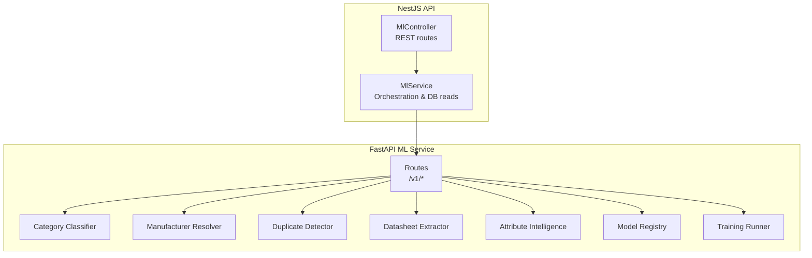
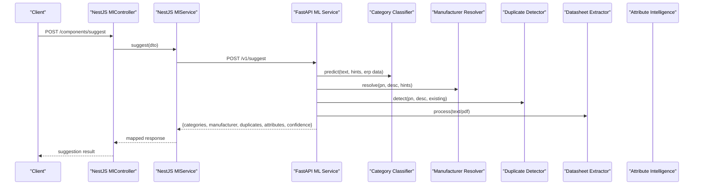
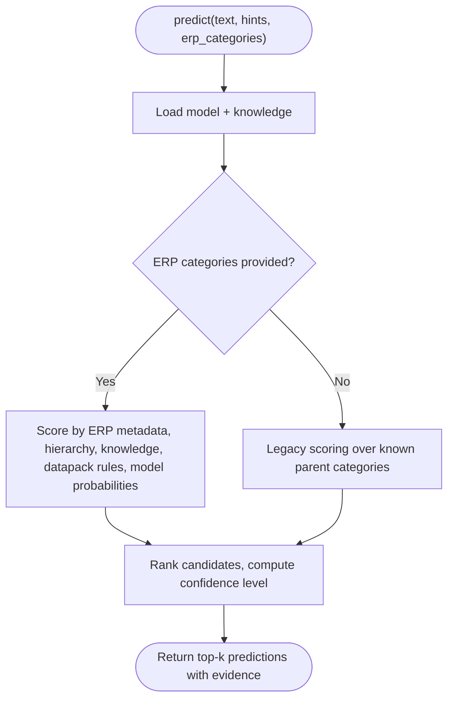
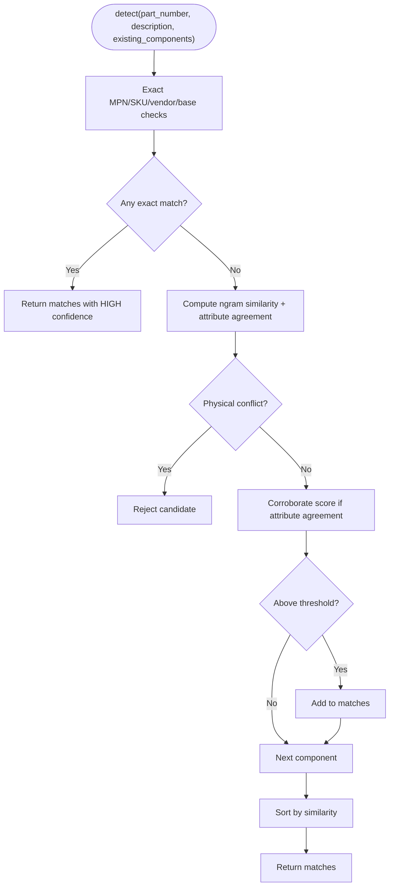
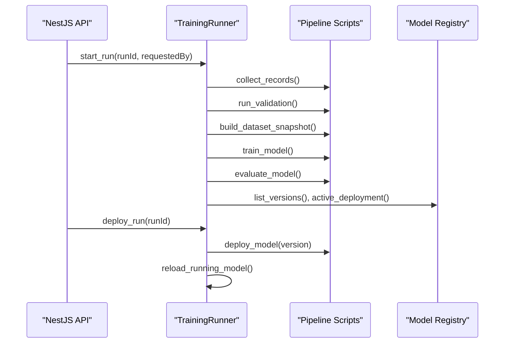
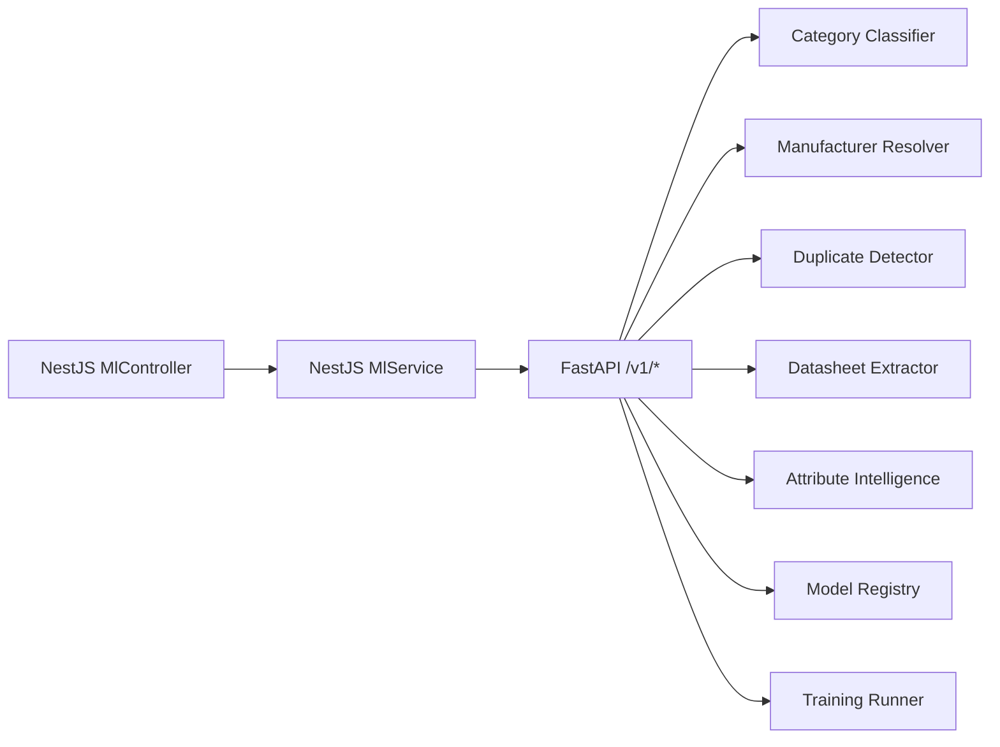

# ML Microservice Integration

<cite>
**Referenced Files in This Document**
- [main.py](file://apps/ml/app/main.py)
- [schemas.py](file://apps/ml/app/schemas.py)
- [config.py](file://apps/ml/app/config.py)
- [category_classifier.py](file://apps/ml/app/services/category_classifier.py)
- [manufacturer_resolver.py](file://apps/ml/app/services/manufacturer_resolver.py)
- [duplicate_detector.py](file://apps/ml/app/services/duplicate_detector.py)
- [attribute_intelligence.py](file://apps/ml/app/services/attribute_intelligence.py)
- [model_registry.py](file://apps/ml/app/services/model_registry.py)
- [training_runner.py](file://apps/ml/app/services/training_runner.py)
- [ml.controller.ts](file://apps/api/src/ml/ml.controller.ts)
- [ml.service.ts](file://apps/api/src/ml/ml.service.ts)
</cite>

## Table of Contents
1. Introduction
2. Project Structure
3. Core Components
4. Architecture Overview
5. Detailed Component Analysis
6. Dependency Analysis
7. Performance Considerations
8. Troubleshooting Guide
9. Conclusion
10. Appendices

## Introduction
This document explains the ML microservice integration architecture for Ananya ERP. It covers the FastAPI-based ML service, model serving patterns, training pipeline integration, and communication protocols between the main NestJS API and the ML service. It also documents the model registry, versioning strategies, deployment patterns, attribute intelligence workflows, duplicate detection, automated classification tasks, error handling, retry and circuit breaker considerations, performance and scaling strategies, monitoring approaches, and testing strategies for ML service integration and model validation.

## Project Structure
The ML integration spans two services:
- NestJS API (apps/api): Public-facing REST endpoints with authentication and orchestration logic that call into the ML service.
- Python FastAPI ML Service (apps/ml): Lightweight CPU-first inference service exposing category classification, manufacturer resolution, duplicate detection, datasheet extraction, attribute intelligence, and ML operations endpoints.

**Diagram sources**
- [ml.controller.ts:40-289](file://apps/api/src/ml/ml.controller.ts#L40-L289)
- [ml.service.ts:304-452](file://apps/api/src/ml/ml.service.ts#L304-L452)
- [main.py:67-488](file://apps/ml/app/main.py#L67-L488)

**Section sources**
- [ml.controller.ts:40-289](file://apps/api/src/ml/ml.controller.ts#L40-L289)
- [ml.service.ts:304-452](file://apps/api/src/ml/ml.service.ts#L304-L452)
- [main.py:67-488](file://apps/ml/app/main.py#L67-L488)

## Core Components
- FastAPI application: Defines lifespan to eagerly load lightweight models, health/ready probes, and all /v1 endpoints for inference and ML operations.
- Schemas: Pydantic models define request/response contracts for all endpoints, including evidence items, category predictions, manufacturer resolution, duplicates, extracted attributes, and ML ops artifacts.
- Services:
  - Category classifier: Loads a pickled model and knowledge base; combines ERP categories, Data Pack hints, and text to produce ranked category predictions with evidence.
  - Manufacturer resolver: Resolves manufacturers using ERP records, knowledge base, aliases, MPN patterns, and text signals.
  - Duplicate detector: Tiered matching (exact MPN/SKU/vendor part, then semantic similarity with strict physical attribute guards).
  - Attribute intelligence: Suggests bindings, category/component attributes, config, enum values, detects duplicates, and audits the library.
  - Model registry: Read-only view over registry artifacts, dataset snapshots, quarantine summaries, and validated record distributions.
  - Training runner: Orchestrates dataset collection/validation/build, training, evaluation, packaging, and promotion via existing pipeline scripts.

**Section sources**
- [main.py:60-101](file://apps/ml/app/main.py#L60-L101)
- [schemas.py:1-582](file://apps/ml/app/schemas.py#L1-L582)
- [category_classifier.py:44-477](file://apps/ml/app/services/category_classifier.py#L44-L477)
- [manufacturer_resolver.py:20-308](file://apps/ml/app/services/manufacturer_resolver.py#L20-L308)
- [duplicate_detector.py:35-312](file://apps/ml/app/services/duplicate_detector.py#L35-L312)
- [attribute_intelligence.py:497-800](file://apps/ml/app/services/attribute_intelligence.py#L497-L800)
- [model_registry.py:96-454](file://apps/ml/app/services/model_registry.py#L96-L454)
- [training_runner.py:116-592](file://apps/ml/app/services/training_runner.py#L116-L592)

## Architecture Overview
The NestJS API exposes authenticated REST endpoints that forward requests to the FastAPI ML service. The ML service performs inference using in-memory models and knowledge bases, returns structured responses with evidence, and exposes internal ML operations for training control.

**Diagram sources**
- [ml.controller.ts:119-125](file://apps/api/src/ml/ml.controller.ts#L119-L125)
- [ml.service.ts:313-452](file://apps/api/src/ml/ml.service.ts#L313-L452)
- [main.py:154-256](file://apps/ml/app/main.py#L154-L256)

## Detailed Component Analysis

### FastAPI ML Service Endpoints and Contracts
- Health and readiness: GET /health, GET /ready expose service status and loaded model identities.
- Inference:
  - POST /v1/predict/category and batch variant
  - POST /v1/resolve/manufacturer
  - POST /v1/detect/duplicates
  - POST /v1/extract/datasheet
  - POST /v1/suggest (composite endpoint combining classification, manufacturer resolution, duplicate detection, and attribute extraction)
- Attribute Intelligence:
  - POST /v1/attributes/suggest-bindings
  - POST /v1/attributes/suggest-category-attributes
  - POST /v1/attributes/suggest-component-attributes
  - POST /v1/attributes/suggest-config
  - POST /v1/attributes/detect-duplicates
  - POST /v1/attributes/suggest-enum-values
  - POST /v1/attributes/audit
- ML Operations (internal):
  - POST /v1/training/runs, GET /v1/training/runs/active, GET /v1/training/runs, GET /v1/training/runs/{run_id}
  - GET /v1/models, GET /v1/models/active
  - POST /v1/models/deploy, POST /v1/models/rollback, POST /v1/models/reload
  - GET /v1/datasets/current

Request/response schemas are defined centrally in schemas.py and enforced by FastAPI.

**Section sources**
- [main.py:82-488](file://apps/ml/app/main.py#L82-L488)
- [schemas.py:1-582](file://apps/ml/app/schemas.py#L1-L582)

### Category Classification
- Loads a pickled sklearn-like model and category knowledge on startup or demand.
- Combines ERP categories, Data Pack hints, manufacturer context, and textual signals to compute scores per category.
- Produces top-k candidates with confidence levels and evidence items.
- Supports legacy mode without ERP context and ERP-aware mode when categories are provided.

**Diagram sources**
- [category_classifier.py:457-477](file://apps/ml/app/services/category_classifier.py#L457-L477)
- [category_classifier.py:278-455](file://apps/ml/app/services/category_classifier.py#L278-L455)
- [category_classifier.py:192-259](file://apps/ml/app/services/category_classifier.py#L192-L259)

**Section sources**
- [category_classifier.py:44-477](file://apps/ml/app/services/category_classifier.py#L44-L477)

### Manufacturer Resolution
- Builds a searchable index from ERP manufacturers, knowledge base, and Data Pack hints.
- Scores candidates based on alias matches, name presence, MPN prefix patterns, and exact ERP matches.
- Returns resolution type (EXISTING/NEW_CANDIDATE/UNKNOWN), confidence, match_type, and evidence.

**Section sources**
- [manufacturer_resolver.py:20-308](file://apps/ml/app/services/manufacturer_resolver.py#L20-L308)

### Duplicate Detection
- Tier 1: Authoritative exact matches on MPN, SKU, vendor part, and base MPN (ignoring packaging suffixes).
- Tier 2: Semantic similarity with strict physical attribute guardrails to avoid false positives.
- Returns is_duplicate flag, top matches with similarity and evidence.

**Diagram sources**
- [duplicate_detector.py:35-312](file://apps/ml/app/services/duplicate_detector.py#L35-L312)

**Section sources**
- [duplicate_detector.py:35-312](file://apps/ml/app/services/duplicate_detector.py#L35-L312)

### Attribute Intelligence
- Suggests bindings for attributes to categories using Data Pack expectations, canonical electronics domain knowledge, and inventory telemetry.
- Suggests category-level attributes and component-level attributes, mapping extractor outputs to definition options where possible.
- Detects duplicate attributes, suggests enum values, and audits the attribute library for issues like duplicates, suspicious bindings, missing expected attributes, and unused attributes.

**Section sources**
- [attribute_intelligence.py:497-800](file://apps/ml/app/services/attribute_intelligence.py#L497-L800)

### Model Registry and Versioning
- Reads registry artifacts under models/registry/v{version}, active deployment metadata, dataset snapshots, quarantine, and validated records.
- Computes deployability based on artifact existence and evaluation report flags.
- Provides checksum-based version resolution to reconcile what is deployed vs what is running.

**Section sources**
- [model_registry.py:96-454](file://apps/ml/app/services/model_registry.py#L96-L454)

### Training Pipeline Integration
- TrainingRunner orchestrates dataset collection, validation, snapshot build, training, evaluation, and packaging via existing pipeline modules.
- Enforces exactly one active run, never auto-deploys, and requires explicit operator action to promote.
- Exposes endpoints to start runs, list runs, query active run, deploy candidate, rollback, and reload running model.

**Diagram sources**
- [training_runner.py:154-366](file://apps/ml/app/services/training_runner.py#L154-L366)
- [training_runner.py:392-534](file://apps/ml/app/services/training_runner.py#L392-L534)
- [model_registry.py:199-245](file://apps/ml/app/services/model_registry.py#L199-L245)

**Section sources**
- [training_runner.py:116-592](file://apps/ml/app/services/training_runner.py#L116-L592)

### Communication Protocols Between Main API and ML Service
- Protocol: HTTP REST over JSON.
- Authentication: Internal service-to-service auth is not enforced at the ML service boundary today; authorization, audit, and durable run records live in the NestJS API.
- Key endpoints:
  - NestJS: /ml/* routes proxy to ML service calls and enforce guards.
  - ML: /v1/* inference and /v1/training/*, /v1/models/*, /v1/datasets/* operational endpoints.
- Request shaping: NestJS MlService maps ERP categories/manufacturers and Data Pack hints into ML service payloads and normalizes responses.

**Section sources**
- [ml.controller.ts:40-289](file://apps/api/src/ml/ml.controller.ts#L40-L289)
- [ml.service.ts:313-452](file://apps/api/src/ml/ml.service.ts#L313-L452)
- [main.py:82-488](file://apps/ml/app/main.py#L82-L488)

## Dependency Analysis
- NestJS API depends on:
  - MlController for route definitions and guards.
  - MlService for business logic, DB reads, and calling the ML service.
- FastAPI ML Service depends on:
  - Config for paths and feature flags.
  - Services for inference and operations.
  - Model registry for read-only access to artifacts and datasets.
  - Training runner for orchestrating pipeline steps.

**Diagram sources**
- [ml.controller.ts:40-289](file://apps/api/src/ml/ml.controller.ts#L40-L289)
- [ml.service.ts:304-452](file://apps/api/src/ml/ml.service.ts#L304-L452)
- [main.py:67-488](file://apps/ml/app/main.py#L67-L488)

**Section sources**
- [ml.controller.ts:40-289](file://apps/api/src/ml/ml.controller.ts#L40-L289)
- [ml.service.ts:304-452](file://apps/api/src/ml/ml.service.ts#L304-L452)
- [main.py:67-488](file://apps/ml/app/main.py#L67-L488)

## Performance Considerations
- Eager loading: Lightweight models are loaded during FastAPI lifespan to reduce first-request latency.
- Bounded inputs: Max request size configured; PDF/text extraction bounded to prevent oversized payloads.
- Duplicate detection limits: Candidate set limited to a fixed number ordered oldest-first to ensure deterministic truncation.
- Evidence aggregation: Composite confidence computed across multiple signals to balance accuracy and speed.
- Monitoring: Execution time included in composite suggestions; health/ready endpoints support liveness/readiness probes.

[No sources needed since this section provides general guidance]

## Troubleshooting Guide
- Health and readiness:
  - Use GET /health and GET /ready to verify service availability and model loading status.
- Training runs:
  - Check active run and run details via /v1/training/runs/active and /v1/training/runs/{run_id}.
  - Errors map to stable codes (e.g., DATASET_BUILD_FAILED, TRAINING_FAILED, EVALUATION_FAILED, PACKAGING_FAILED, INTERNAL_ERROR).
- Deployment:
  - Deploy candidate only if status is PASSED and quality gates passed; otherwise, a DeploymentRefusedError is raised.
  - Rollback requires an available backup artifact; otherwise refused.
- Reload:
  - Use /v1/models/reload to re-read production artifact without restart; watch reloadPending and reloadError fields.

**Section sources**
- [main.py:82-101](file://apps/ml/app/main.py#L82-L101)
- [main.py:383-475](file://apps/ml/app/main.py#L383-L475)
- [training_runner.py:85-99](file://apps/ml/app/services/training_runner.py#L85-L99)
- [training_runner.py:392-534](file://apps/ml/app/services/training_runner.py#L392-L534)

## Conclusion
The ML microservice integrates tightly with the NestJS API through well-defined REST contracts, providing robust category classification, manufacturer resolution, duplicate detection, and attribute intelligence. The model registry and training runner enable safe, auditable model lifecycle management with explicit promotion and rollback. Operational endpoints and evidence-rich responses facilitate transparency and debugging. Performance is optimized via eager loading, bounded processing, and clear readiness signaling.

[No sources needed since this section summarizes without analyzing specific files]

## Appendices

### Example Workflows

#### Attribute Intelligence Processing
- Bindings: Map an attribute to categories using Data Pack expectations and canonical domain knowledge.
- Category attributes: Recommend attributes bound to a category, prioritizing already-bound ones.
- Component attributes: For a specific part, determine relevant attributes and map extractor outputs to definition options.

**Section sources**
- [attribute_intelligence.py:501-632](file://apps/ml/app/services/attribute_intelligence.py#L501-L632)
- [attribute_intelligence.py:634-725](file://apps/ml/app/services/attribute_intelligence.py#L634-L725)
- [attribute_intelligence.py:727-800](file://apps/ml/app/services/attribute_intelligence.py#L727-L800)

#### Duplicate Detection Workflow
- Exact MPN/SKU/vendor/base MPN checks first.
- If no exact match, compute semantic similarity with strict physical attribute guards.
- Return matches with similarity and evidence for review.

**Section sources**
- [duplicate_detector.py:35-312](file://apps/ml/app/services/duplicate_detector.py#L35-L312)

#### Automated Classification Tasks
- Composite suggestion endpoint aggregates category predictions, manufacturer resolution, duplicate detection, and attribute extraction into a single response with overall confidence and evidence.

**Section sources**
- [main.py:154-256](file://apps/ml/app/main.py#L154-L256)

### Error Handling, Retries, and Circuit Breakers
- ML service errors:
  - HTTPException used for client/server errors (e.g., 409 conflicts, 404 not found, 500 deployment failures).
  - Stable error codes for training phases to aid UI mapping.
- Retry mechanisms:
  - Not implemented within the ML service; clients should implement retries with backoff for transient network errors.
- Circuit breaker:
  - Not implemented within the ML service; consider implementing at the NestJS API layer around ML service calls to fail fast when the ML service is unhealthy.

**Section sources**
- [main.py:383-475](file://apps/ml/app/main.py#L383-L475)
- [training_runner.py:85-99](file://apps/ml/app/services/training_runner.py#L85-L99)

### Scaling Strategies and Monitoring
- Horizontal scaling:
  - Stateless inference endpoints can be scaled horizontally behind a load balancer.
  - Ensure shared model artifacts are accessible (e.g., mounted volumes or object storage) and consistent across replicas.
- Vertical scaling:
  - Tune memory and CPU for model loading and inference bursts.
- Monitoring:
  - Use /health and /ready for orchestration probes.
  - Track execution_time_ms in composite suggestions.
  - Monitor training run statuses and durations via /v1/training/runs*.

[No sources needed since this section provides general guidance]

### Testing Strategies
- Unit tests:
  - Validate individual services (classifier, resolver, detector, attribute intelligence) with fixtures and edge cases.
- Integration tests:
  - Test FastAPI endpoints with test clients against real services and mock external dependencies where applicable.
- Model validation:
  - Use training runner’s evaluation reports and gate thresholds to validate new candidates before deployment.
- Regression tests:
  - Re-run benchmarks and regression suites after model or pipeline changes.

**Section sources**
- [training_runner.py:560-588](file://apps/ml/app/services/training_runner.py#L560-L588)