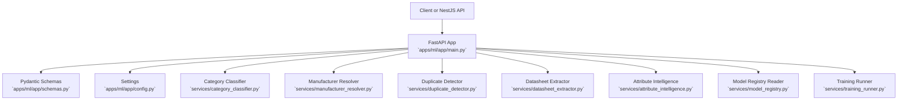
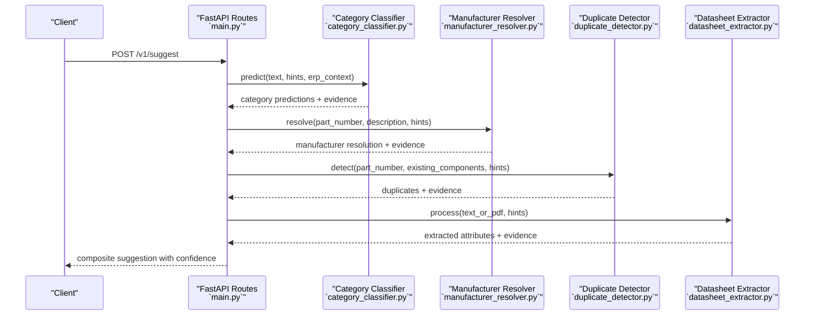
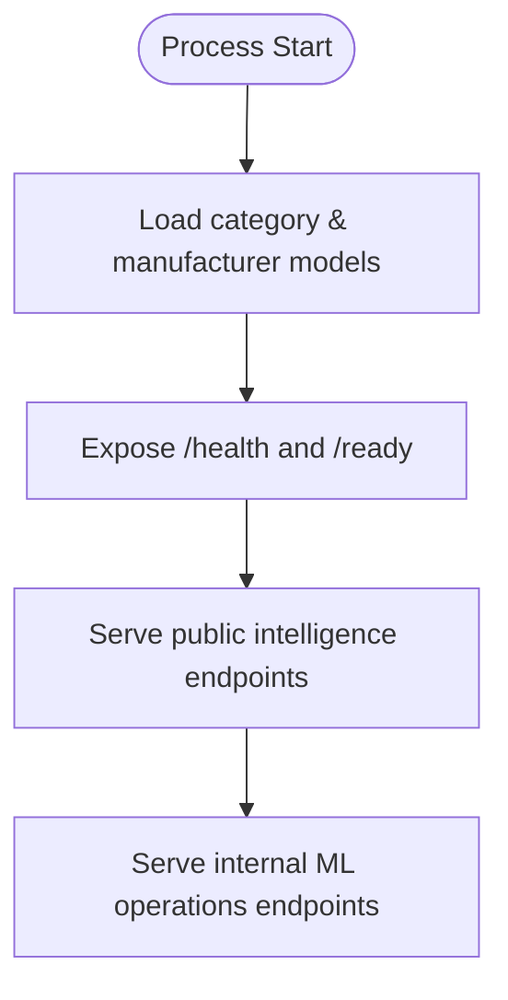
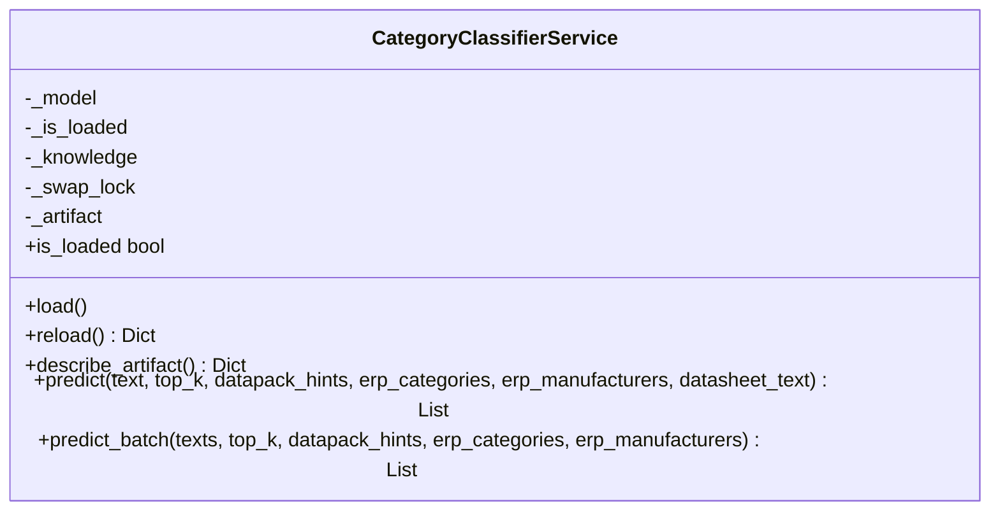
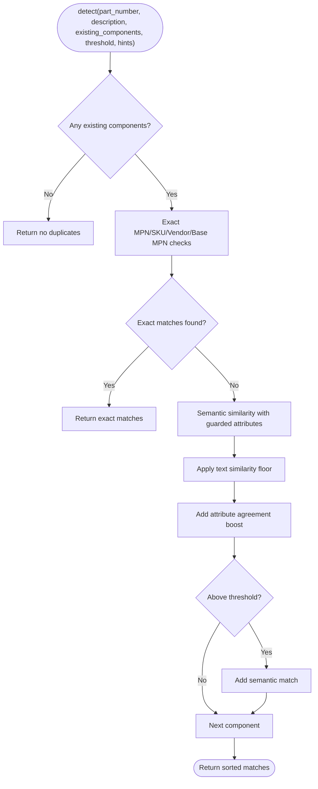
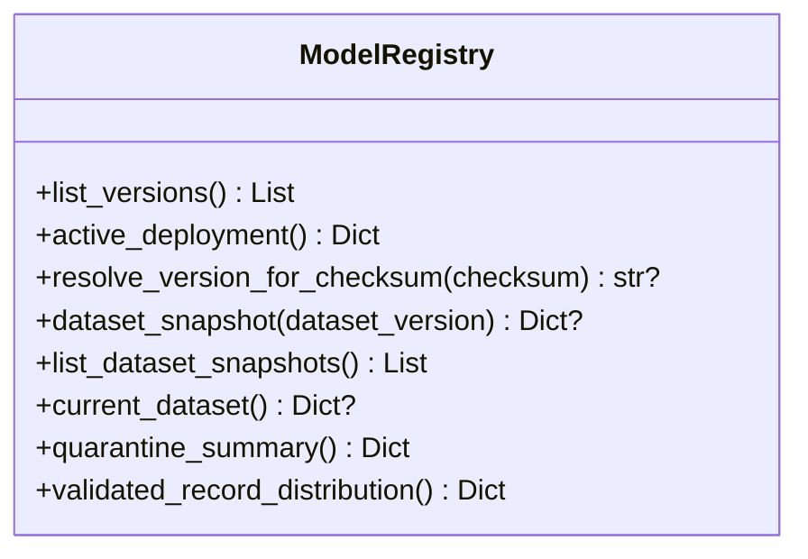
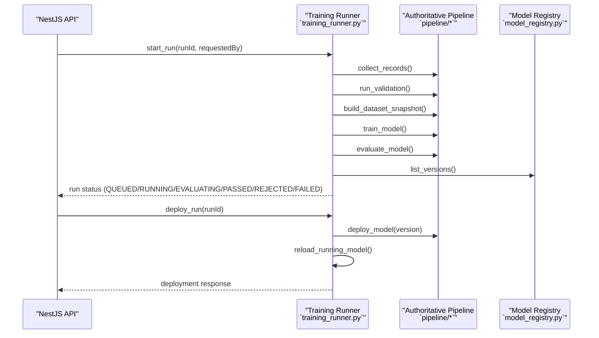
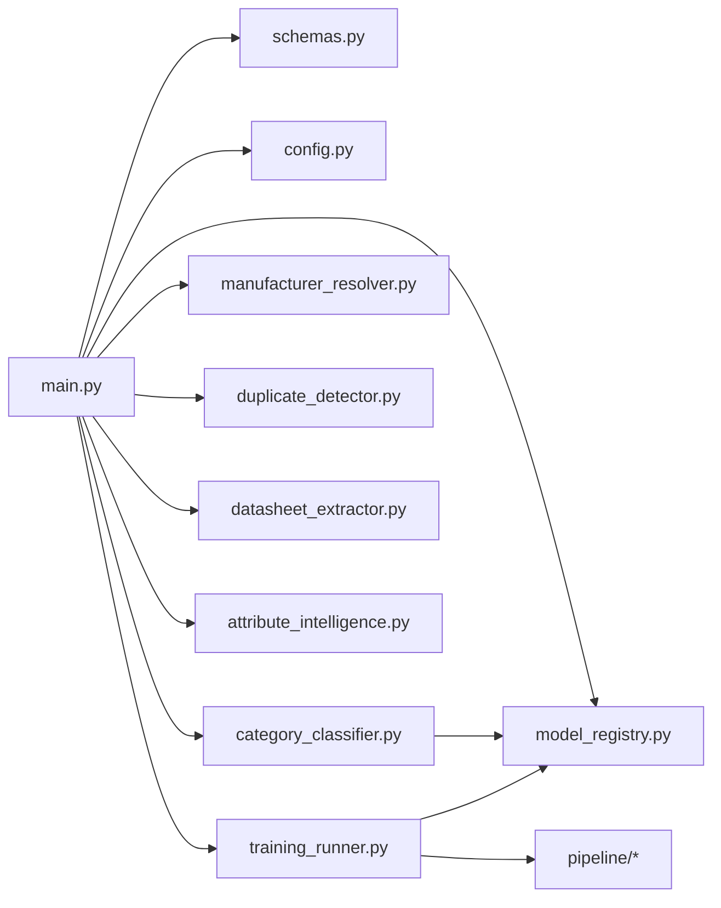

# ML Service Architecture

<cite>
**Referenced Files in This Document**
- [main.py](file://apps/ml/app/main.py)
- [config.py](file://apps/ml/app/config.py)
- [schemas.py](file://apps/ml/app/schemas.py)
- [category_classifier.py](file://apps/ml/app/services/category_classifier.py)
- [manufacturer_resolver.py](file://apps/ml/app/services/manufacturer_resolver.py)
- [duplicate_detector.py](file://apps/ml/app/services/duplicate_detector.py)
- [datasheet_extractor.py](file://apps/ml/app/services/datasheet_extractor.py)
- [attribute_intelligence.py](file://apps/ml/app/services/attribute_intelligence.py)
- [model_registry.py](file://apps/ml/app/services/model_registry.py)
- [training_runner.py](file://apps/ml/app/services/training_runner.py)
</cite>

## Table of Contents
1. [Introduction](#introduction)
2. [Project Structure](#project-structure)
3. [Core Components](#core-components)
4. [Architecture Overview](#architecture-overview)
5. [Detailed Component Analysis](#detailed-component-analysis)
6. [Dependency Analysis](#dependency-analysis)
7. [Performance Considerations](#performance-considerations)
8. [Troubleshooting Guide](#troubleshooting-guide)
9. [Security and API Protection](#security-and-api-protection)
10. [Conclusion](#conclusion)

## Introduction
This document explains the ML microservice architecture built on FastAPI. It covers the service structure, dependency injection patterns, modular services, configuration management, model registry and versioning, training control plane, health checks, graceful reload behavior, error handling, logging strategy, monitoring integration points, and security considerations. The service exposes public intelligence endpoints for category classification, manufacturer resolution, duplicate detection, datasheet extraction, and attribute intelligence, as well as internal ML operations endpoints for training runs and model deployment.

## Project Structure
The ML service is a Python FastAPI application under `apps/ml`. Its runtime surface is defined by:
- Application entry point and routes
- Configuration via Pydantic settings
- Request/response schemas
- Modular services for each intelligence capability
- Model registry and dataset snapshot reader
- Training runner that orchestrates the existing authoritative pipeline

**Diagram sources**
- [main.py:67-80](file://apps/ml/app/main.py#L67-L80)
- [config.py:4-19](file://apps/ml/app/config.py#L4-L19)
- [schemas.py:1-20](file://apps/ml/app/schemas.py#L1-L20)
- [category_classifier.py:44-51](file://apps/ml/app/services/category_classifier.py#L44-L51)
- [manufacturer_resolver.py:20-37](file://apps/ml/app/services/manufacturer_resolver.py#L20-L37)
- [duplicate_detector.py:35-43](file://apps/ml/app/services/duplicate_detector.py#L35-L43)
- [datasheet_extractor.py:78-118](file://apps/ml/app/services/datasheet_extractor.py#L78-L118)
- [attribute_intelligence.py:497-511](file://apps/ml/app/services/attribute_intelligence.py#L497-L511)
- [model_registry.py:31-49](file://apps/ml/app/services/model_registry.py#L31-L49)
- [training_runner.py:116-131](file://apps/ml/app/services/training_runner.py#L116-L131)

**Section sources**
- [main.py:67-80](file://apps/ml/app/main.py#L67-L80)
- [config.py:4-19](file://apps/ml/app/config.py#L4-L19)
- [schemas.py:1-20](file://apps/ml/app/schemas.py#L1-L20)

## Core Components
- FastAPI application with lifespan-based startup loading for lightweight models.
- Pydantic-based request/response contracts for all endpoints.
- Modular services encapsulating domain logic:
  - Category classifier with legacy and ERP-aware prediction paths.
  - Manufacturer resolver using knowledge, ERP context, and Data Pack hints.
  - Duplicate detector with exact and semantic tiers and physical guardrails.
  - Datasheet extractor with bounded PDF/page selection and deterministic evidence.
  - Attribute intelligence providing library and component-level suggestions.
- Read-only model registry exposing versions, active deployment, dataset snapshots, quarantine summaries, and distributions.
- Training runner orchestrating dataset collection, validation, training, evaluation, packaging, and promotion through the existing pipeline.

Key responsibilities:
- Routing and orchestration: `main.py`
- Configuration: `config.py`
- Contracts: `schemas.py`
- Inference services: `category_classifier.py`, `manufacturer_resolver.py`, `duplicate_detector.py`, `datasheet_extractor.py`, `attribute_intelligence.py`
- Model metadata and datasets: `model_registry.py`
- Operator training control plane: `training_runner.py`

**Section sources**
- [main.py:60-101](file://apps/ml/app/main.py#L60-L101)
- [config.py:4-19](file://apps/ml/app/config.py#L4-L19)
- [schemas.py:217-229](file://apps/ml/app/schemas.py#L217-L229)
- [category_classifier.py:44-51](file://apps/ml/app/services/category_classifier.py#L44-L51)
- [manufacturer_resolver.py:20-37](file://apps/ml/app/services/manufacturer_resolver.py#L20-L37)
- [duplicate_detector.py:35-43](file://apps/ml/app/services/duplicate_detector.py#L35-L43)
- [datasheet_extractor.py:78-118](file://apps/ml/app/services/datasheet_extractor.py#L78-L118)
- [attribute_intelligence.py:497-511](file://apps/ml/app/services/attribute_intelligence.py#L497-L511)
- [model_registry.py:96-145](file://apps/ml/app/services/model_registry.py#L96-L145)
- [training_runner.py:116-131](file://apps/ml/app/services/training_runner.py#L116-L131)

## Architecture Overview
The service follows a layered design:
- HTTP layer: FastAPI routes validate inputs and delegate to services.
- Service layer: Each service owns one capability and returns structured results with evidence.
- Registry layer: Read-only access to model artifacts, dataset snapshots, and deployment state.
- Training control plane: Background thread executes the existing pipeline; promotion is explicit and safe.

**Diagram sources**
- [main.py:154-256](file://apps/ml/app/main.py#L154-L256)
- [category_classifier.py:457-470](file://apps/ml/app/services/category_classifier.py#L457-L470)
- [manufacturer_resolver.py:73-80](file://apps/ml/app/services/manufacturer_resolver.py#L73-L80)
- [duplicate_detector.py:36-43](file://apps/ml/app/services/duplicate_detector.py#L36-L43)
- [datasheet_extractor.py:348-355](file://apps/ml/app/services/datasheet_extractor.py#L348-L355)

## Detailed Component Analysis

### FastAPI Application and Lifecycle
- Lifespan loads lightweight models eagerly so `/ready` reflects actual serving state.
- CORS middleware is enabled for development flexibility.
- Health and readiness endpoints expose service version and per-model load status.
- Public endpoints cover category prediction, batch prediction, manufacturer resolution, duplicate detection, datasheet extraction, and component suggestion.
- Internal ML operations endpoints manage training runs, list models, deploy candidates, rollback, reload running model, and inspect current dataset.

**Diagram sources**
- [main.py:60-72](file://apps/ml/app/main.py#L60-L72)
- [main.py:82-101](file://apps/ml/app/main.py#L82-L101)
- [main.py:103-152](file://apps/ml/app/main.py#L103-L152)
- [main.py:154-256](file://apps/ml/app/main.py#L154-L256)
- [main.py:383-486](file://apps/ml/app/main.py#L383-L486)

**Section sources**
- [main.py:60-101](file://apps/ml/app/main.py#L60-L101)
- [main.py:103-152](file://apps/ml/app/main.py#L103-L152)
- [main.py:154-256](file://apps/ml/app/main.py#L154-L256)
- [main.py:383-486](file://apps/ml/app/main.py#L383-L486)

### Configuration Management and Environment Variables
Configuration is centralized in a Pydantic `Settings` object with environment overrides:
- `MODEL_DIR`: Base directory for models and registry.
- `CATEGORY_MODEL_PATH`, `CATEGORY_KNOWLEDGE_PATH`, `MANUFACTURER_KNOWLEDGE_PATH`: Paths to artifacts.
- `ENABLE_ONNX_EMBEDDINGS`, `ONNX_MODEL_PATH`, `ONNX_TOKENIZER_PATH`: Optional ONNX embedding support.
- `MAX_REQUEST_SIZE_BYTES`: Request size limit.

Defaults are provided when environment variables are absent, ensuring predictable local and containerized operation.

**Section sources**
- [config.py:4-19](file://apps/ml/app/config.py#L4-L19)
- [config.py:20-26](file://apps/ml/app/config.py#L20-L26)

### Request and Response Contracts
All endpoints use Pydantic models for validation and documentation:
- Evidence items carry type, description, weight, source, page, text, and section where applicable.
- Domain models include category predictions, manufacturer candidates, duplicate matches, extracted attributes, and attribute intelligence suggestions.
- ML operations schemas define training run lifecycle, model registry responses, dataset snapshots, and deployment outcomes.

These contracts ensure consistent serialization, clear API documentation, and strong typing across the service.

**Section sources**
- [schemas.py:4-20](file://apps/ml/app/schemas.py#L4-L20)
- [schemas.py:61-105](file://apps/ml/app/schemas.py#L61-L105)
- [schemas.py:107-163](file://apps/ml/app/schemas.py#L107-L163)
- [schemas.py:164-215](file://apps/ml/app/schemas.py#L164-L215)
- [schemas.py:217-331](file://apps/ml/app/schemas.py#L217-L331)
- [schemas.py:336-500](file://apps/ml/app/schemas.py#L336-L500)
- [schemas.py:511-582](file://apps/ml/app/schemas.py#L511-L582)

### Category Classifier Service
Responsibilities:
- Load and serve the pickled category model.
- Provide legacy prediction path and ERP-aware prediction path.
- Combine statistical model probabilities with Data Pack hints, ERP categories/manufacturers, and knowledge terms.
- Produce ranked candidates with confidence levels and evidence.

Key behaviors:
- Eager loading at startup.
- Atomic artifact reload with swap lock.
- Artifact identity derived from checksum and registry mapping.

**Diagram sources**
- [category_classifier.py:44-51](file://apps/ml/app/services/category_classifier.py#L44-L51)
- [category_classifier.py:114-165](file://apps/ml/app/services/category_classifier.py#L114-L165)
- [category_classifier.py:167-179](file://apps/ml/app/services/category_classifier.py#L167-L179)
- [category_classifier.py:457-470](file://apps/ml/app/services/category_classifier.py#L457-L470)

**Section sources**
- [category_classifier.py:44-51](file://apps/ml/app/services/category_classifier.py#L44-L51)
- [category_classifier.py:114-165](file://apps/ml/app/services/category_classifier.py#L114-L165)
- [category_classifier.py:167-179](file://apps/ml/app/services/category_classifier.py#L167-L179)
- [category_classifier.py:192-259](file://apps/ml/app/services/category_classifier.py#L192-L259)
- [category_classifier.py:278-470](file://apps/ml/app/services/category_classifier.py#L278-L470)

### Manufacturer Resolver Service
Responsibilities:
- Load manufacturer knowledge.
- Score candidates using ERP manufacturers, knowledge aliases, MPN prefix patterns, and Data Pack hints.
- Return resolution with confidence level, match type, and evidence.

Key behaviors:
- Normalization and alias matching.
- Ambiguity detection against runner-up candidate.

**Section sources**
- [manufacturer_resolver.py:20-37](file://apps/ml/app/services/manufacturer_resolver.py#L20-L37)
- [manufacturer_resolver.py:73-80](file://apps/ml/app/services/manufacturer_resolver.py#L73-L80)
- [manufacturer_resolver.py:110-244](file://apps/ml/app/services/manufacturer_resolver.py#L110-L244)
- [manufacturer_resolver.py:253-304](file://apps/ml/app/services/manufacturer_resolver.py#L253-L304)

### Duplicate Detector Service
Responsibilities:
- Tiered duplicate detection:
  - Exact MPN/SKU/vendor part matches.
  - Base MPN equivalence ignoring packaging suffixes.
  - Semantic similarity with strict physical attribute guards.
- Guarded attributes prevent false positives when electrical/physical specs conflict.

Key behaviors:
- Normalization and packaging suffix stripping.
- Corroboration boost only after minimum textual similarity floor.
- Bounded result set and evidence-rich responses.

**Diagram sources**
- [duplicate_detector.py:36-43](file://apps/ml/app/services/duplicate_detector.py#L36-L43)
- [duplicate_detector.py:77-224](file://apps/ml/app/services/duplicate_detector.py#L77-L224)
- [duplicate_detector.py:226-309](file://apps/ml/app/services/duplicate_detector.py#L226-L309)

**Section sources**
- [duplicate_detector.py:35-43](file://apps/ml/app/services/duplicate_detector.py#L35-L43)
- [duplicate_detector.py:77-224](file://apps/ml/app/services/duplicate_detector.py#L77-L224)
- [duplicate_detector.py:226-309](file://apps/ml/app/services/duplicate_detector.py#L226-L309)

### Datasheet Extractor Service
Responsibilities:
- Parse PDFs from base64 input.
- Select pages deterministically within bounded scan limits.
- Classify sections (electrical, maximum ratings, ordering, mechanical).
- Extract standardized attributes with evidence including page, snippet, and section.

Key behaviors:
- Page selection prioritizes recognized specification sections and term density.
- Section inheritance rule handles table continuations.
- Evidence ranking prefers primary specification sections.

**Section sources**
- [datasheet_extractor.py:78-118](file://apps/ml/app/services/datasheet_extractor.py#L78-L118)
- [datasheet_extractor.py:120-197](file://apps/ml/app/services/datasheet_extractor.py#L120-L197)
- [datasheet_extractor.py:348-355](file://apps/ml/app/services/datasheet_extractor.py#L348-L355)
- [datasheet_extractor.py:357-800](file://apps/ml/app/services/datasheet_extractor.py#L357-L800)

### Attribute Intelligence Service
Responsibilities:
- Suggest attribute bindings to categories.
- Suggest category attributes based on Data Packs, canonical electronics knowledge, and existing inventory telemetry.
- Suggest component attributes with relevance and value suggestions constrained to definition options.
- Detect attribute duplicates and suggest enum values.
- Audit attribute libraries for issues like duplicates, suspicious bindings, missing expected attributes, and unused attributes.

Key behaviors:
- Hybrid similarity combining lexical, token, n-gram, and canonical parameter knowledge.
- Concept-to-option canonicalization ensures suggested values map to ERP definitions.
- Evidence-rich outputs explain reasoning and sources.

**Section sources**
- [attribute_intelligence.py:23-242](file://apps/ml/app/services/attribute_intelligence.py#L23-L242)
- [attribute_intelligence.py:244-306](file://apps/ml/app/services/attribute_intelligence.py#L244-L306)
- [attribute_intelligence.py:321-433](file://apps/ml/app/services/attribute_intelligence.py#L321-L433)
- [attribute_intelligence.py:497-632](file://apps/ml/app/services/attribute_intelligence.py#L497-L632)
- [attribute_intelligence.py:634-725](file://apps/ml/app/services/attribute_intelligence.py#L634-L725)
- [attribute_intelligence.py:727-800](file://apps/ml/app/services/attribute_intelligence.py#L727-L800)

### Model Registry and Dataset Snapshots
Responsibilities:
- Read-only view over model registry artifacts and dataset snapshots.
- Compute artifact checksums, sizes, and version sorting.
- Resolve active deployment by checksum vs metadata claim.
- Provide dataset overview, quarantine summary, and validated record distribution.

Key behaviors:
- Version directories scanned and filtered by pattern.
- Evaluation reports sanitized before exposure.
- Bounds enforced on scanned records and distribution entries.

**Diagram sources**
- [model_registry.py:96-145](file://apps/ml/app/services/model_registry.py#L96-L145)
- [model_registry.py:199-229](file://apps/ml/app/services/model_registry.py#L199-L229)
- [model_registry.py:232-245](file://apps/ml/app/services/model_registry.py#L232-L245)
- [model_registry.py:276-316](file://apps/ml/app/services/model_registry.py#L276-L316)
- [model_registry.py:319-345](file://apps/ml/app/services/model_registry.py#L319-L345)
- [model_registry.py:348-398](file://apps/ml/app/services/model_registry.py#L348-L398)
- [model_registry.py:401-449](file://apps/ml/app/services/model_registry.py#L401-L449)

**Section sources**
- [model_registry.py:96-145](file://apps/ml/app/services/model_registry.py#L96-L145)
- [model_registry.py:199-229](file://apps/ml/app/services/model_registry.py#L199-L229)
- [model_registry.py:276-316](file://apps/ml/app/services/model_registry.py#L276-L316)
- [model_registry.py:319-345](file://apps/ml/app/services/model_registry.py#L319-L345)
- [model_registry.py:348-398](file://apps/ml/app/services/model_registry.py#L348-L398)
- [model_registry.py:401-449](file://apps/ml/app/services/model_registry.py#L401-L449)

### Training Runner and Control Plane
Responsibilities:
- Start background training runs with unique IDs and candidate versions.
- Execute authoritative pipeline steps: collect, validate, build dataset, train, evaluate, package.
- Enforce exactly-one-active-run policy.
- Promote candidates only if PASSED and eligible; otherwise refuse with stable error codes.
- Reload running model safely after deployment.
- Rollback to previous artifact when available.

Key behaviors:
- In-memory run state with bounded retention; durable state lives in PostgreSQL via the API.
- Bounded logs per run.
- Stable error codes and phase reporting.

**Diagram sources**
- [training_runner.py:154-216](file://apps/ml/app/services/training_runner.py#L154-L216)
- [training_runner.py:253-365](file://apps/ml/app/services/training_runner.py#L253-L365)
- [training_runner.py:392-453](file://apps/ml/app/services/training_runner.py#L392-L453)
- [training_runner.py:455-480](file://apps/ml/app/services/training_runner.py#L455-L480)
- [training_runner.py:482-534](file://apps/ml/app/services/training_runner.py#L482-L534)

**Section sources**
- [training_runner.py:116-131](file://apps/ml/app/services/training_runner.py#L116-L131)
- [training_runner.py:154-216](file://apps/ml/app/services/training_runner.py#L154-L216)
- [training_runner.py:253-365](file://apps/ml/app/services/training_runner.py#L253-L365)
- [training_runner.py:392-453](file://apps/ml/app/services/training_runner.py#L392-L453)
- [training_runner.py:455-534](file://apps/ml/app/services/training_runner.py#L455-L534)

## Dependency Analysis
High-level dependencies:
- FastAPI app depends on services and schemas.
- Services depend on configuration and shared schemas.
- Training runner depends on model registry and existing pipeline modules.
- Category classifier depends on model registry for artifact identity resolution.

**Diagram sources**
- [main.py:47-58](file://apps/ml/app/main.py#L47-L58)
- [category_classifier.py:91-112](file://apps/ml/app/services/category_classifier.py#L91-L112)
- [training_runner.py:262-267](file://apps/ml/app/services/training_runner.py#L262-L267)
- [training_runner.py:407-441](file://apps/ml/app/services/training_runner.py#L407-L441)

**Section sources**
- [main.py:47-58](file://apps/ml/app/main.py#L47-L58)
- [category_classifier.py:91-112](file://apps/ml/app/services/category_classifier.py#L91-L112)
- [training_runner.py:262-267](file://apps/ml/app/services/training_runner.py#L262-L267)
- [training_runner.py:407-441](file://apps/ml/app/services/training_runner.py#L407-L441)

## Performance Considerations
- Lightweight model loading at startup reduces cold latency for inference endpoints.
- Bounded PDF scanning and page analysis prevent large documents from degrading performance.
- Duplicate detection uses exact matches first, then semantic similarity with guarded attributes to avoid expensive computations unless necessary.
- Training runner keeps in-memory state bounded and avoids capturing global stdout to prevent log contention.
- Request size limit prevents oversized payloads.

[No sources needed since this section provides general guidance]

## Troubleshooting Guide
Common operational scenarios:
- Models not loaded:
  - Check `/ready` to see per-model load status and running artifact identity.
  - Ensure model files exist at configured paths.
- Deployment mismatch:
  - Compare `runningVersion` from `/ready` with `artifactVersion` from `/v1/models`.
  - Use `/v1/models/reload` to refresh the in-process model without restarting.
- Training run conflicts:
  - Only one run may be active; a second start returns a conflict error.
- Candidate not deployable:
  - Candidate must be PASSED and pass quality gates; otherwise deployment is refused.
- Rollback failures:
  - Rollback requires a backup artifact; otherwise it is refused.

Error handling patterns:
- HTTP exceptions for client errors (e.g., unknown training run) and server errors (deployment/rollback failures).
- Stable error codes for training phases and deployment refusals.
- Bounded run logs capture recent messages and truncate long lines.

**Section sources**
- [main.py:82-101](file://apps/ml/app/main.py#L82-L101)
- [main.py:404-411](file://apps/ml/app/main.py#L404-L411)
- [main.py:429-458](file://apps/ml/app/main.py#L429-L458)
- [training_runner.py:85-99](file://apps/ml/app/services/training_runner.py#L85-L99)
- [training_runner.py:230-249](file://apps/ml/app/services/training_runner.py#L230-L249)
- [training_runner.py:392-453](file://apps/ml/app/services/training_runner.py#L392-L453)
- [training_runner.py:482-534](file://apps/ml/app/services/training_runner.py#L482-L534)

## Security and API Protection
- CORS is enabled broadly for development; restrict origins in production.
- Public endpoints accept structured requests validated by Pydantic models.
- Internal ML operations endpoints are intended for authenticated NestJS API calls only; they do not implement authentication themselves.
- No schema carries filesystem paths, environment values, or credentials.
- Model registry sanitizes evaluation reports and never exposes raw file paths in responses.
- Maximum request size is enforced to mitigate abuse.

Recommendations:
- Place the service behind an authenticated gateway or reverse proxy.
- Restrict CORS to trusted origins in production.
- Monitor `/ready` and `/v1/models` for drift between deployed artifact and running model.
- Log operator actions at the API layer for auditability.

**Section sources**
- [main.py:74-80](file://apps/ml/app/main.py#L74-L80)
- [main.py:363-380](file://apps/ml/app/main.py#L363-L380)
- [schemas.py:231-241](file://apps/ml/app/schemas.py#L231-L241)
- [model_registry.py:186-196](file://apps/ml/app/services/model_registry.py#L186-L196)
- [config.py:17-17](file://apps/ml/app/config.py#L17-L17)

## Conclusion
The ML microservice provides a robust, modular FastAPI surface for component intelligence and a safe control plane for model training and deployment. Its design emphasizes:
- Clear separation of concerns across services.
- Strong contracts via Pydantic schemas.
- Deterministic, bounded processing for PDFs and datasets.
- Honest artifact identity and deployment state reporting.
- Safe, explicit promotion and rollback workflows.
- Operational visibility through health, readiness, model registry, and dataset overview endpoints.

For production hardening, apply gateway-level authentication, tighten CORS, and integrate external monitoring and logging around the documented endpoints and error signals.