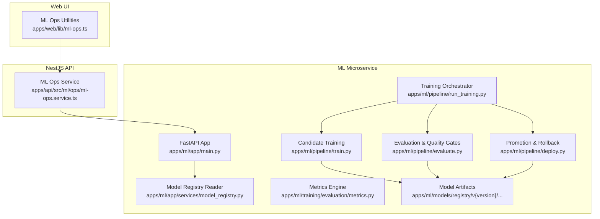
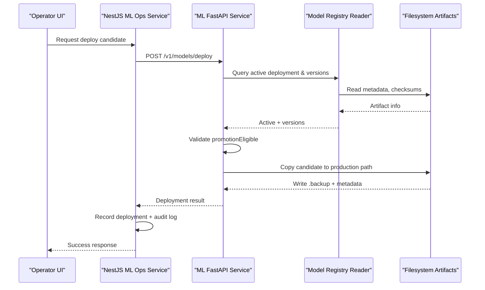
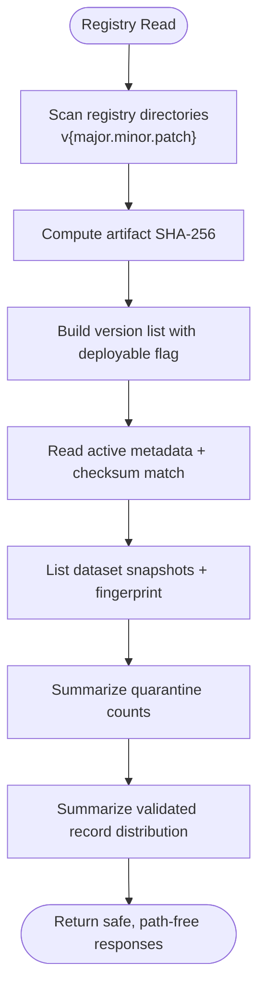
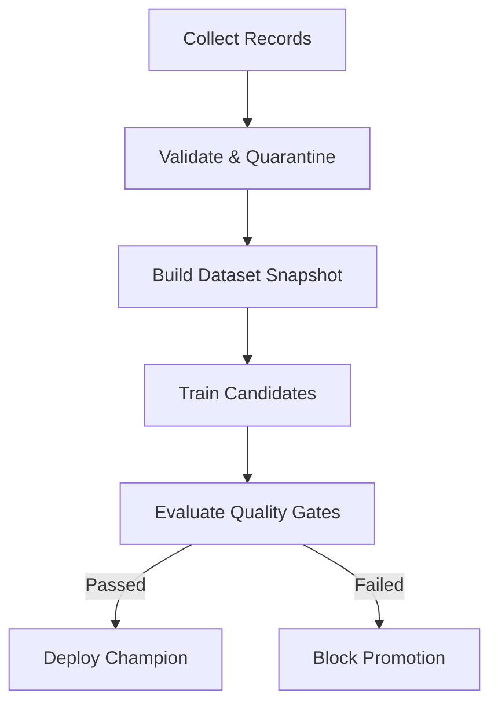
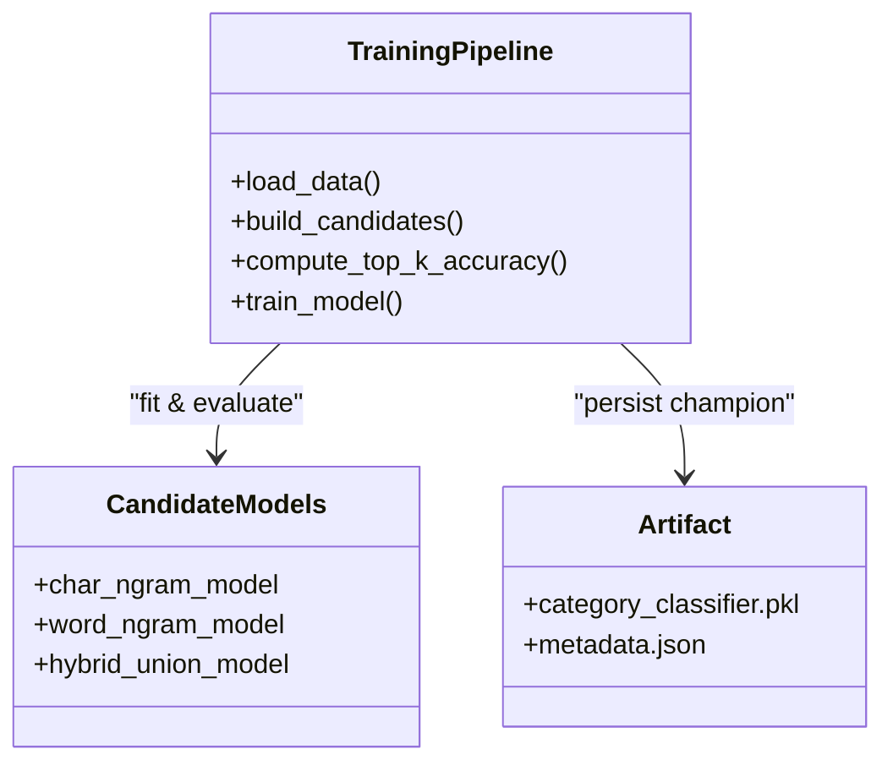
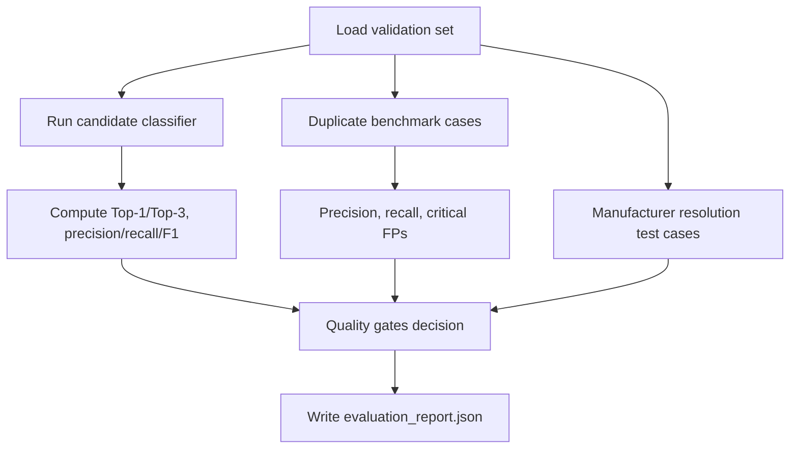
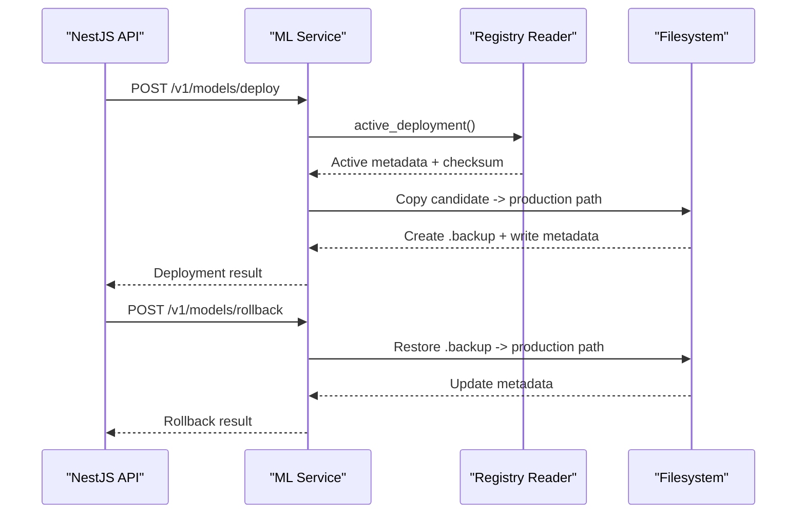
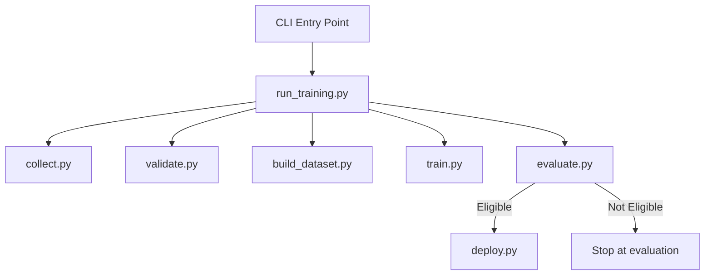
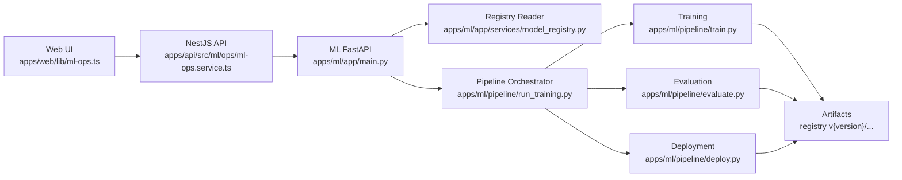

# Model Management

<cite>
**Referenced Files in This Document**
- [apps/ml/README.md](file://apps/ml/README.md)
- [apps/ml/app/main.py](file://apps/ml/app/main.py)
- [apps/ml/app/services/model_registry.py](file://apps/ml/app/services/model_registry.py)
- [apps/ml/pipeline/run_training.py](file://apps/ml/pipeline/run_training.py)
- [apps/ml/pipeline/train.py](file://apps/ml/pipeline/train.py)
- [apps/ml/pipeline/evaluate.py](file://apps/ml/pipeline/evaluate.py)
- [apps/ml/pipeline/deploy.py](file://apps/ml/pipeline/deploy.py)
- [apps/ml/training/evaluation/metrics.py](file://apps/ml/training/evaluation/metrics.py)
- [apps/ml/models/model_metadata.json](file://apps/ml/models/model_metadata.json)
- [apps/api/src/ml/ops/ml-ops.service.ts](file://apps/api/src/ml/ops/ml-ops.service.ts)
- [apps/web/lib/ml-ops.ts](file://apps/web/lib/ml-ops.ts)
</cite>

## Table of Contents
1. Introduction
2. Project Structure
3. Core Components
4. Architecture Overview
5. Detailed Component Analysis
6. Dependency Analysis
7. Performance Considerations
8. Troubleshooting Guide
9. Conclusion

## Introduction
This document explains the model management and deployment processes for the Ananya ML microservice. It covers the model registry structure, versioning strategy, training pipeline integration, evaluation metrics, validation procedures, packaging and serialization formats, storage strategies, deployment automation, rollback mechanisms, A/B testing considerations, performance monitoring, and security and audit logging for model operations. The goal is to make these workflows understandable for both technical operators and non-technical stakeholders while remaining grounded in the actual implementation.

## Project Structure
The ML capability lives under `apps/ml` and exposes a FastAPI service for inference and ML operations, alongside a Python-based training and deployment pipeline. The NestJS API orchestrates ML operations with authorization and audit logging, while the Next.js web UI provides operator controls.

**Diagram sources**
- [apps/ml/app/main.py:60-101](file://apps/ml/app/main.py#L60-L101)
- [apps/ml/app/services/model_registry.py:33-49](file://apps/ml/app/services/model_registry.py#L33-L49)
- [apps/ml/pipeline/run_training.py:29-73](file://apps/ml/pipeline/run_training.py#L29-L73)
- [apps/ml/pipeline/train.py:99-193](file://apps/ml/pipeline/train.py#L99-L193)
- [apps/ml/pipeline/evaluate.py:27-245](file://apps/ml/pipeline/evaluate.py#L27-L245)
- [apps/ml/pipeline/deploy.py:16-116](file://apps/ml/pipeline/deploy.py#L16-L116)
- [apps/ml/training/evaluation/metrics.py:20-151](file://apps/ml/training/evaluation/metrics.py#L20-L151)
- [apps/api/src/ml/ops/ml-ops.service.ts:688-763](file://apps/api/src/ml/ops/ml-ops.service.ts#L688-L763)
- [apps/web/lib/ml-ops.ts:323-355](file://apps/web/lib/ml-ops.ts#L323-L355)

**Section sources**
- [apps/ml/README.md:19-40](file://apps/ml/README.md#L19-L40)
- [apps/ml/README.md:92-188](file://apps/ml/README.md#L92-L188)

## Core Components
- FastAPI ML service: Provides inference endpoints and ML operations control plane (training runs, model listing, deploy, rollback, reload).
- Model registry reader: Read-only view over registry artifacts, active deployment metadata, dataset snapshots, quarantine summaries, and validated record distributions.
- Training pipeline orchestrator: Executes collect, validate, build dataset, train, evaluate, and deploy stages; writes a comprehensive summary report.
- Candidate training: Trains multiple architectures and persists the champion artifact and metadata into a versioned registry directory.
- Evaluation pipeline: Computes classification, manufacturer resolution, duplicate detection, latency, memory, provenance checks, and quality gates.
- Deployment tool: Promotes eligible candidates to production with backup and metadata; supports rollback using `.backup`.
- Metrics engine: Reusable functions for classification, duplicate detection, set relevance, and system benchmarks.
- NestJS ML ops service: Authorizes and records deployments and rollbacks, integrates with the ML service, and writes audit logs.
- Web ML ops utilities: Client-side guards mirroring server rules for deployability and rollback availability.

**Section sources**
- [apps/ml/app/main.py:363-486](file://apps/ml/app/main.py#L363-L486)
- [apps/ml/app/services/model_registry.py:96-454](file://apps/ml/app/services/model_registry.py#L96-L454)
- [apps/ml/pipeline/run_training.py:29-133](file://apps/ml/pipeline/run_training.py#L29-L133)
- [apps/ml/pipeline/train.py:99-193](file://apps/ml/pipeline/train.py#L99-L193)
- [apps/ml/pipeline/evaluate.py:27-245](file://apps/ml/pipeline/evaluate.py#L27-L245)
- [apps/ml/pipeline/deploy.py:16-116](file://apps/ml/pipeline/deploy.py#L16-L116)
- [apps/ml/training/evaluation/metrics.py:20-151](file://apps/ml/training/evaluation/metrics.py#L20-L151)
- [apps/api/src/ml/ops/ml-ops.service.ts:688-763](file://apps/api/src/ml/ops/ml-ops.service.ts#L688-L763)
- [apps/web/lib/ml-ops.ts:323-355](file://apps/web/lib/ml-ops.ts#L323-L355)

## Architecture Overview
The ML service exposes an internal control plane for ML operations. The NestJS API enforces authorization and durable records, then calls the ML service to run training, evaluate, promote, or rollback models. The model registry is a read-only filesystem view that reports versions, checksums, and active deployment state without writing.

**Diagram sources**
- [apps/api/src/ml/ops/ml-ops.service.ts:688-763](file://apps/api/src/ml/ops/ml-ops.service.ts#L688-L763)
- [apps/ml/app/main.py:429-458](file://apps/ml/app/main.py#L429-L458)
- [apps/ml/app/services/model_registry.py:199-245](file://apps/ml/app/services/model_registry.py#L199-L245)
- [apps/ml/pipeline/deploy.py:51-112](file://apps/ml/pipeline/deploy.py#L51-L112)

## Detailed Component Analysis

### Model Registry Structure and Versioning Strategy
- Registry layout: Each candidate is stored under `apps/ml/models/registry/v{version}/`, containing the serialized model artifact (`category_classifier.pkl`) and sidecar metadata (`metadata.json`, `evaluation_report.json`, `pipeline_summary.json`).
- Active deployment: `apps/ml/models/model_metadata.json` tracks the currently deployed version, artifact checksum, dataset version, git commit, timestamps, and quality gate status. A separate `active_deployment.json` is also maintained by the deployment tool.
- Version allocation: The registry reader computes the next patch version based on existing directories, ensuring no collision between builds.
- Checksum-based identity: The registry resolves the actual artifact version from its SHA-256, which remains accurate even after rollbacks when sidecar metadata may be stale.
- Dataset snapshots: Built datasets are stored under `apps/ml/data/datasets/{datasetVersion}/` with a deterministic fingerprint computed from `metadata.json`, `train.json`, and `val.json`.
- Quarantine and distribution: The registry reader summarizes quarantined records and validated record distributions without exposing raw payloads.

**Diagram sources**
- [apps/ml/app/services/model_registry.py:96-145](file://apps/ml/app/services/model_registry.py#L96-L145)
- [apps/ml/app/services/model_registry.py:199-245](file://apps/ml/app/services/model_registry.py#L199-L245)
- [apps/ml/app/services/model_registry.py:276-345](file://apps/ml/app/services/model_registry.py#L276-L345)
- [apps/ml/app/services/model_registry.py:348-449](file://apps/ml/app/services/model_registry.py#L348-L449)

**Section sources**
- [apps/ml/app/services/model_registry.py:33-49](file://apps/ml/app/services/model_registry.py#L33-L49)
- [apps/ml/app/services/model_registry.py:96-145](file://apps/ml/app/services/model_registry.py#L96-L145)
- [apps/ml/app/services/model_registry.py:199-245](file://apps/ml/app/services/model_registry.py#L199-L245)
- [apps/ml/app/services/model_registry.py:276-345](file://apps/ml/app/services/model_registry.py#L276-L345)
- [apps/ml/app/services/model_registry.py:348-449](file://apps/ml/app/services/model_registry.py#L348-L449)
- [apps/ml/models/model_metadata.json:1-155](file://apps/ml/models/model_metadata.json#L1-L155)

### Training Pipeline Integration
The training pipeline orchestrates six sequential stages:
1. Collect authoritative records with provenance.
2. Validate schema, physics bounds, and isolate conflicts to quarantine.
3. Build a versioned dataset snapshot with grouped zero-leakage split.
4. Train multiple candidate architectures and select the champion.
5. Evaluate against quality gates compared to the active baseline.
6. Deploy if eligible.

**Diagram sources**
- [apps/ml/pipeline/run_training.py:29-73](file://apps/ml/pipeline/run_training.py#L29-L73)

**Section sources**
- [apps/ml/pipeline/run_training.py:29-133](file://apps/ml/pipeline/run_training.py#L29-L133)
- [apps/ml/README.md:92-188](file://apps/ml/README.md#L92-L188)

### Candidate Training and Serialization
- Architectures: Character n-grams, word n-grams, and hybrid union feature pipelines trained with scikit-learn.
- Selection: Best candidate selected by validation accuracy and top-3 accuracy tiebreaker.
- Serialization: Champion saved as a Python pickle artifact (`category_classifier.pkl`) under the versioned registry directory.
- Metadata: Includes champion name, sample counts, categories, per-class report, and flags indicating provenance verification and data leakage checks.

**Diagram sources**
- [apps/ml/pipeline/train.py:23-52](file://apps/ml/pipeline/train.py#L23-L52)
- [apps/ml/pipeline/train.py:54-80](file://apps/ml/pipeline/train.py#L54-L80)
- [apps/ml/pipeline/train.py:99-193](file://apps/ml/pipeline/train.py#L99-L193)

**Section sources**
- [apps/ml/pipeline/train.py:23-52](file://apps/ml/pipeline/train.py#L23-L52)
- [apps/ml/pipeline/train.py:54-80](file://apps/ml/pipeline/train.py#L54-L80)
- [apps/ml/pipeline/train.py:99-193](file://apps/ml/pipeline/train.py#L99-L193)

### Evaluation Metrics and Validation Procedures
- Classification metrics: Top-1 and Top-3 accuracy, weighted precision/recall/F1, per-class reports.
- Manufacturer resolution accuracy: Deterministic prefix matching evaluated against known cases.
- Duplicate detection: Precision, recall, and critical false-positive merge counting.
- Latency and memory: P50/P95/P99 latency and peak RAM usage measured during evaluation.
- Provenance validation: Ensures unverified samples are zero.
- Quality gates: Accuracy regression check vs active baseline, duplicate precision/recall thresholds, latency/memory limits, and provenance gate.

**Diagram sources**
- [apps/ml/pipeline/evaluate.py:27-245](file://apps/ml/pipeline/evaluate.py#L27-L245)
- [apps/ml/training/evaluation/metrics.py:20-151](file://apps/ml/training/evaluation/metrics.py#L20-L151)

**Section sources**
- [apps/ml/pipeline/evaluate.py:27-245](file://apps/ml/pipeline/evaluate.py#L27-L245)
- [apps/ml/training/evaluation/metrics.py:20-151](file://apps/ml/training/evaluation/metrics.py#L20-L151)

### Deployment Workflows and Rollback Mechanisms
- Promotion: Copies the champion artifact to the active production path, creates a `.backup`, and writes deployment metadata including artifact checksum and timestamps.
- Eligibility: Requires an evaluation report indicating promotion eligibility unless forced.
- Rollback: Restores the `.backup` artifact and records the rollback operation.
- Control plane: The ML service exposes `/v1/models/deploy` and `/v1/models/rollback`; the NestJS API validates permissions, records deployments, and writes audit logs.

**Diagram sources**
- [apps/ml/pipeline/deploy.py:16-116](file://apps/ml/pipeline/deploy.py#L16-L116)
- [apps/ml/app/main.py:429-458](file://apps/ml/app/main.py#L429-L458)
- [apps/api/src/ml/ops/ml-ops.service.ts:688-763](file://apps/api/src/ml/ops/ml-ops.service.ts#L688-L763)

**Section sources**
- [apps/ml/pipeline/deploy.py:16-116](file://apps/ml/pipeline/deploy.py#L16-L116)
- [apps/ml/app/main.py:429-458](file://apps/ml/app/main.py#L429-L458)
- [apps/api/src/ml/ops/ml-ops.service.ts:688-763](file://apps/api/src/ml/ops/ml-ops.service.ts#L688-L763)

### Model Packaging, Serialization Formats, and Storage Strategies
- Serialization format: Scikit-learn pipelines serialized via Python pickle (`category_classifier.pkl`).
- Storage locations:
  - Candidate artifacts: `apps/ml/models/registry/v{version}/category_classifier.pkl`
  - Sidecar metadata: `metadata.json`, `evaluation_report.json`, `pipeline_summary.json`
  - Active production model: `apps/ml/models/category_classifier.pkl`
  - Backup: `apps/ml/models/category_classifier.pkl.backup`
  - Deployment metadata: `apps/ml/models/model_metadata.json`
  - Dataset snapshots: `apps/ml/data/datasets/{datasetVersion}/`
- Integrity: SHA-256 checksums used to identify artifacts and detect drift after rollbacks.

**Section sources**
- [apps/ml/pipeline/train.py:145-193](file://apps/ml/pipeline/train.py#L145-L193)
- [apps/ml/pipeline/evaluate.py:220-222](file://apps/ml/pipeline/evaluate.py#L220-L222)
- [apps/ml/pipeline/deploy.py:51-112](file://apps/ml/pipeline/deploy.py#L51-L112)
- [apps/ml/models/model_metadata.json:1-155](file://apps/ml/models/model_metadata.json#L1-L155)

### Examples of Training Workflows, Evaluation Processes, and Deployment Automation
- Full pipeline execution: Single command orchestrates all stages and writes a summary report to the registry.
- Individual stage execution: Each stage can be run independently for debugging or iteration.
- Feedback incorporation: Human feedback exported from the review queue can be passed into retraining.
- CLI options: Version, feedback file, extra catalog, and auto-deploy toggle.

**Diagram sources**
- [apps/ml/pipeline/run_training.py:29-73](file://apps/ml/pipeline/run_training.py#L29-L73)
- [apps/ml/README.md:92-188](file://apps/ml/README.md#L92-L188)

**Section sources**
- [apps/ml/pipeline/run_training.py:29-133](file://apps/ml/pipeline/run_training.py#L29-L133)
- [apps/ml/README.md:92-188](file://apps/ml/README.md#L92-L188)

### A/B Testing Strategies
- Current implementation does not include built-in traffic splitting or A/B testing.
- Recommended approach: Use the registry’s checksum-based artifact identity and the active deployment metadata to route subsets of requests to different model artifacts behind a load balancer or feature flag layer, while keeping the ML service read-only for artifacts and letting external routing manage splits.
- Monitoring: Track per-variant metrics through the evaluation and latency measurement utilities to compare performance across variants.

[No sources needed since this section provides general guidance]

### Model Performance Monitoring
- Inference latency and memory: Measured during evaluation using percentile latencies and resident memory.
- Operational health: `/health` and `/ready` endpoints expose service status and model loading state.
- Dashboard visibility: The registry reader exposes version lists, active deployment details, dataset snapshots, quarantine summaries, and validated record distributions for observability.

**Section sources**
- [apps/ml/pipeline/evaluate.py:170-176](file://apps/ml/pipeline/evaluate.py#L170-L176)
- [apps/ml/app/main.py:82-101](file://apps/ml/app/main.py#L82-L101)
- [apps/ml/app/services/model_registry.py:96-145](file://apps/ml/app/services/model_registry.py#L96-L145)
- [apps/ml/app/services/model_registry.py:199-245](file://apps/ml/app/services/model_registry.py#L199-L245)
- [apps/ml/app/services/model_registry.py:276-345](file://apps/ml/app/services/model_registry.py#L276-L345)
- [apps/ml/app/services/model_registry.py:348-449](file://apps/ml/app/services/model_registry.py#L348-L449)

### Security, Access Control, and Audit Logging
- Authorization: ML operations routes are internal and called only by the authenticated NestJS API; they are not exposed to the browser.
- Access control: The NestJS API uses permission guards to restrict access to administration capabilities.
- Audit logging: Successful and failed deployments/rollbacks are recorded as audit events with actor information and deployment details.
- Safety constraints enforced in ML service:
  - Exactly one training run active at a time.
  - Runs never auto-promote models.
  - Deployment refuses anything not marked as PASSED with `promotionEligible`.
  - Rollback refused when no backup exists.

**Section sources**
- [apps/ml/app/main.py:363-380](file://apps/ml/app/main.py#L363-L380)
- [apps/api/src/ml/ops/ml-ops.service.ts:688-763](file://apps/api/src/ml/ops/ml-ops.service.ts#L688-L763)

## Dependency Analysis
The ML service depends on:
- Filesystem artifacts for model artifacts, metadata, and dataset snapshots.
- Scikit-learn and NumPy for training and evaluation.
- The NestJS API for authorization, orchestration, and audit logging.
- The web UI for operator interactions and guard logic.

**Diagram sources**
- [apps/web/lib/ml-ops.ts:323-355](file://apps/web/lib/ml-ops.ts#L323-L355)
- [apps/api/src/ml/ops/ml-ops.service.ts:688-763](file://apps/api/src/ml/ops/ml-ops.service.ts#L688-L763)
- [apps/ml/app/main.py:363-486](file://apps/ml/app/main.py#L363-L486)
- [apps/ml/app/services/model_registry.py:96-454](file://apps/ml/app/services/model_registry.py#L96-L454)
- [apps/ml/pipeline/run_training.py:29-133](file://apps/ml/pipeline/run_training.py#L29-L133)
- [apps/ml/pipeline/train.py:99-193](file://apps/ml/pipeline/train.py#L99-L193)
- [apps/ml/pipeline/evaluate.py:27-245](file://apps/ml/pipeline/evaluate.py#L27-L245)
- [apps/ml/pipeline/deploy.py:16-116](file://apps/ml/pipeline/deploy.py#L16-L116)

**Section sources**
- [apps/web/lib/ml-ops.ts:323-355](file://apps/web/lib/ml-ops.ts#L323-L355)
- [apps/api/src/ml/ops/ml-ops.service.ts:688-763](file://apps/api/src/ml/ops/ml-ops.service.ts#L688-L763)
- [apps/ml/app/main.py:363-486](file://apps/ml/app/main.py#L363-L486)
- [apps/ml/app/services/model_registry.py:96-454](file://apps/ml/app/services/model_registry.py#L96-L454)
- [apps/ml/pipeline/run_training.py:29-133](file://apps/ml/pipeline/run_training.py#L29-L133)
- [apps/ml/pipeline/train.py:99-193](file://apps/ml/pipeline/train.py#L99-L193)
- [apps/ml/pipeline/evaluate.py:27-245](file://apps/ml/pipeline/evaluate.py#L27-L245)
- [apps/ml/pipeline/deploy.py:16-116](file://apps/ml/pipeline/deploy.py#L16-L116)

## Performance Considerations
- CPU-first design: The ML service targets low footprint and fast inference with lightweight classifiers.
- Latency gates: Evaluation enforces P95 latency thresholds to prevent regressions.
- Memory constraints: Peak RAM is monitored and gated to keep resource usage within limits.
- Artifact size: Model artifact size is tracked and reported in evaluation and deployment metadata.

**Section sources**
- [apps/ml/README.md:9-16](file://apps/ml/README.md#L9-L16)
- [apps/ml/pipeline/evaluate.py:170-188](file://apps/ml/pipeline/evaluate.py#L170-L188)
- [apps/ml/pipeline/train.py:153-178](file://apps/ml/pipeline/train.py#L153-L178)

## Troubleshooting Guide
- No evaluation report found during deployment: Ensure evaluation has been run and produced `evaluation_report.json` with promotion eligibility.
- Promotion blocked: Verify quality gates passed; check accuracy regression, duplicate precision/recall, latency, memory, and provenance checks.
- Rollback unavailable: Confirm a `.backup` artifact exists; otherwise, rollback cannot proceed.
- Unknown training run: If the ML process restarted, a previously active run may appear lost; the API maps this to a job-lost state.
- Active vs artifact version mismatch: After rollback, the active metadata may differ from the artifact checksum; the registry reader resolves the true running version from the checksum.

**Section sources**
- [apps/ml/pipeline/deploy.py:38-49](file://apps/ml/pipeline/deploy.py#L38-L49)
- [apps/ml/pipeline/evaluate.py:178-218](file://apps/ml/pipeline/evaluate.py#L178-L218)
- [apps/ml/app/main.py:404-411](file://apps/ml/app/main.py#L404-L411)
- [apps/ml/app/services/model_registry.py:199-245](file://apps/ml/app/services/model_registry.py#L199-L245)

## Conclusion
The Ananya ML system implements a robust, auditable model lifecycle: authoritative data collection, strict validation, zero-leakage dataset snapshots, multi-candidate training, rigorous evaluation with quality gates, and safe promotion with rollback support. The registry provides a secure, read-only view of artifacts and deployment state, while the NestJS API centralizes authorization and audit logging. Operators can automate training and deployment, monitor performance, and maintain confidence in model integrity through checksums, provenance checks, and comprehensive reporting.