# Presentation Layer (Next.js Web App)

<cite>
**Referenced Files in This Document**
- [package.json](file://apps/web/package.json)
- [next.config.mjs](file://apps/web/next.config.mjs)
- [middleware.ts](file://apps/web/middleware.ts)
- [app/layout.tsx](file://apps/web/app/layout.tsx)
- [app/page.tsx](file://apps/web/app/page.tsx)
- [components/theme-provider.tsx](file://apps/web/components/theme-provider.tsx)
- [lib/auth/auth-context.tsx](file://apps/web/lib/auth/auth-context.tsx)
- [components/dashboard-layout.tsx](file://apps/web/components/dashboard-layout.tsx)
- [components/pwa-register.tsx](file://apps/web/components/pwa-register.tsx)
- [app/manifest.ts](file://apps/web/app/manifest.ts)
- [lib/api-client.ts](file://apps/web/lib/api-client.ts)
- [app/dashboard/page.tsx](file://apps/web/app/dashboard/page.tsx)
- [app/login/page.tsx](file://apps/web/app/login/page.tsx)
- [public/sw.js](file://apps/web/public/sw.js)
</cite>

## Table of Contents
1. [Introduction](#introduction)
2. [Project Structure](#project-structure)
3. [Core Components](#core-components)
4. [Architecture Overview](#architecture-overview)
5. [Detailed Component Analysis](#detailed-component-analysis)
6. [Dependency Analysis](#dependency-analysis)
7. [Performance Considerations](#performance-considerations)
8. [Troubleshooting Guide](#troubleshooting-guide)
9. [Conclusion](#conclusion)

## Introduction
This document describes the presentation layer of Ananya ERP built with Next.js. It covers the app router structure, page organization, component architecture, theme provider, authentication middleware, client-side state management, UI components, form handling patterns, data fetching strategies, PWA capabilities, service worker configuration, performance optimizations, backend API integration, error handling, and user experience patterns.

## Project Structure
The web application is a Next.js app under apps/web. The root layout composes global providers and the authenticated shell. Pages are organized by feature under app/. Shared UI components live under components/ui/, while domain-specific components are colocated near their pages or in feature folders. Client-side utilities for API access and authentication are under lib/.

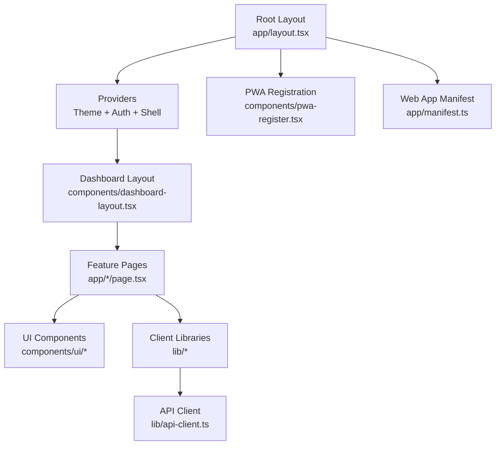

**Diagram sources**
- [app/layout.tsx:1-63](file://apps/web/app/layout.tsx#L1-L63)
- [components/dashboard-layout.tsx:1-131](file://apps/web/components/dashboard-layout.tsx#L1-L131)
- [components/pwa-register.tsx:1-46](file://apps/web/components/pwa-register.tsx#L1-L46)
- [app/manifest.ts:1-46](file://apps/web/app/manifest.ts#L1-L46)

**Section sources**
- [package.json:1-55](file://apps/web/package.json#L1-L55)
- [app/layout.tsx:1-63](file://apps/web/app/layout.tsx#L1-L63)

## Core Components
- Root layout: Sets metadata, viewport, theme provider, auth provider, dashboard layout, and PWA registration.
- Theme provider: Wraps the app with next-themes to support light/dark themes.
- Authentication context: Provides login/logout, permissions, role checks, multi-tab session sync, and unauthorized handling.
- Dashboard layout: Renders the authenticated shell with navigation rail, sidebar, header, command palette, and footer; hides chrome for public and standalone routes.
- PWA registration: Registers the service worker when supported and secure.
- API client: Centralized fetch wrapper with token injection, error normalization, and 401 interception.

**Section sources**
- [app/layout.tsx:1-63](file://apps/web/app/layout.tsx#L1-L63)
- [components/theme-provider.tsx:1-12](file://apps/web/components/theme-provider.tsx#L1-L12)
- [lib/auth/auth-context.tsx:1-232](file://apps/web/lib/auth/auth-context.tsx#L1-L232)
- [components/dashboard-layout.tsx:1-131](file://apps/web/components/dashboard-layout.tsx#L1-L131)
- [components/pwa-register.tsx:1-46](file://apps/web/components/pwa-register.tsx#L1-L46)
- [lib/api-client.ts:1-295](file://apps/web/lib/api-client.ts#L1-L295)

## Architecture Overview
The presentation layer follows a layered approach:
- Routing and layout: Next.js app router defines routes; root layout composes providers and shell.
- Middleware: Server-side route protection based on cookies/headers.
- Client state: React Context for auth and UI state; local component state for page data.
- Data fetching: Client-side API calls via apiClient to the backend REST API.
- PWA: Service worker registration and manifest for installability.

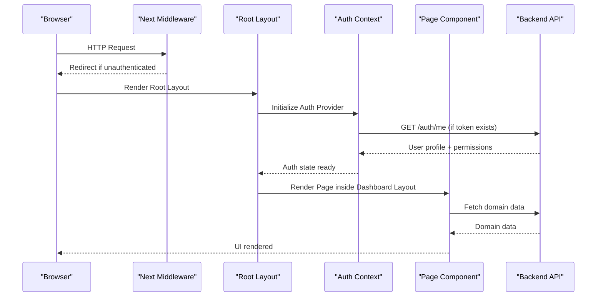

**Diagram sources**
- [middleware.ts:1-55](file://apps/web/middleware.ts#L1-L55)
- [app/layout.tsx:1-63](file://apps/web/app/layout.tsx#L1-L63)
- [lib/auth/auth-context.tsx:1-232](file://apps/web/lib/auth/auth-context.tsx#L1-L232)
- [app/dashboard/page.tsx:1-492](file://apps/web/app/dashboard/page.tsx#L1-L492)

## Detailed Component Analysis

### App Router and Page Organization
- Root entry redirects to the dashboard.
- Dashboard page aggregates multiple domain metrics using parallel requests and renders widgets.
- Login page handles sign-in flow, error states, and post-login destination logic.

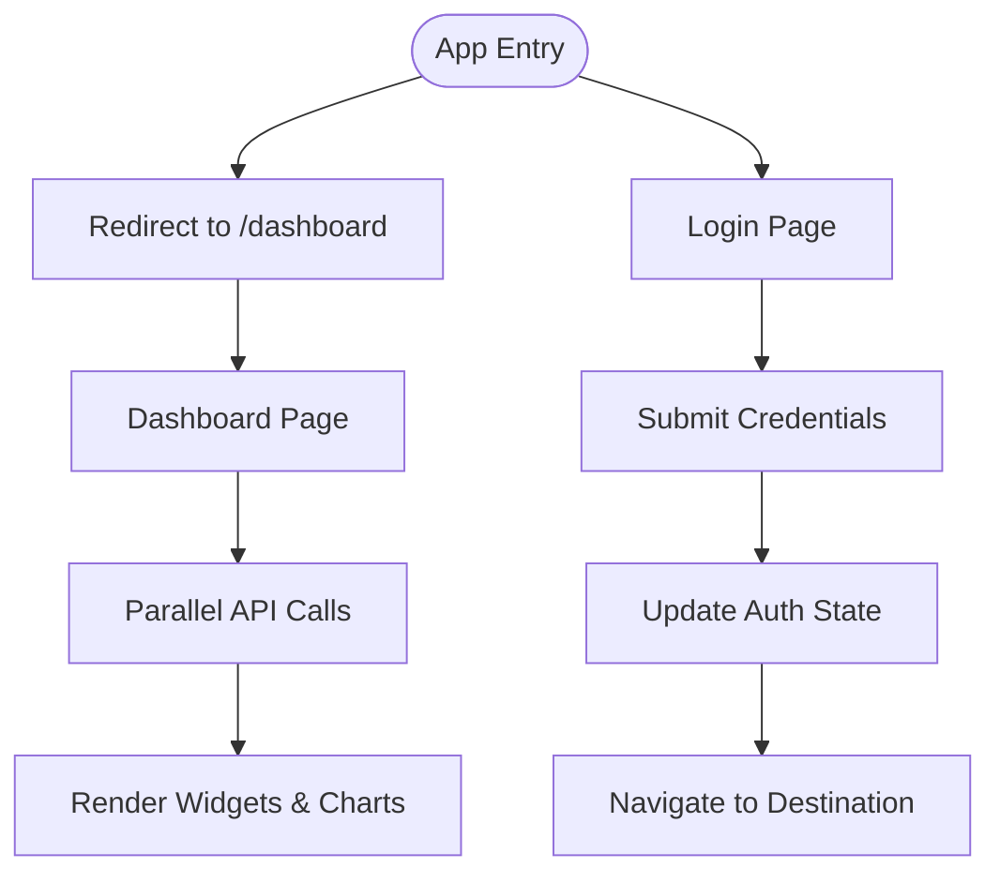

**Diagram sources**
- [app/page.tsx:1-6](file://apps/web/app/page.tsx#L1-L6)
- [app/dashboard/page.tsx:1-492](file://apps/web/app/dashboard/page.tsx#L1-L492)
- [app/login/page.tsx:1-202](file://apps/web/app/login/page.tsx#L1-L202)

**Section sources**
- [app/page.tsx:1-6](file://apps/web/app/page.tsx#L1-L6)
- [app/dashboard/page.tsx:1-492](file://apps/web/app/dashboard/page.tsx#L1-L492)
- [app/login/page.tsx:1-202](file://apps/web/app/login/page.tsx#L1-L202)

### Theme Provider Implementation
- The root layout wraps the app with a theme provider that supports system preference detection and class-based theming.
- Viewport metadata includes theme colors for both light and dark modes.

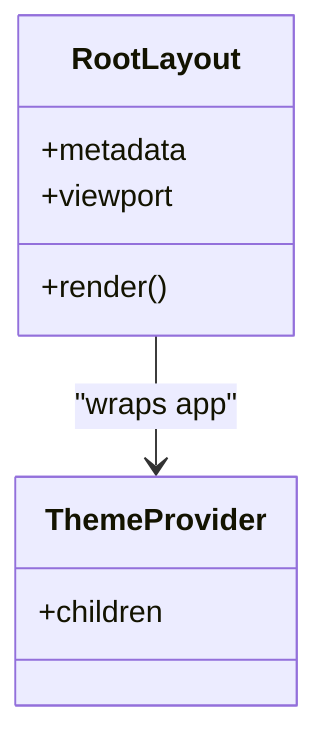

**Diagram sources**
- [app/layout.tsx:1-63](file://apps/web/app/layout.tsx#L1-L63)
- [components/theme-provider.tsx:1-12](file://apps/web/components/theme-provider.tsx#L1-L12)

**Section sources**
- [app/layout.tsx:1-63](file://apps/web/app/layout.tsx#L1-L63)
- [components/theme-provider.tsx:1-12](file://apps/web/components/theme-provider.tsx#L1-L12)

### Authentication Middleware
- Protects routes by checking cookies or Authorization headers.
- Allows public routes and static assets.
- Redirects unauthenticated users to login with a return URL.
- Redirects authenticated users away from login/forgot-password.

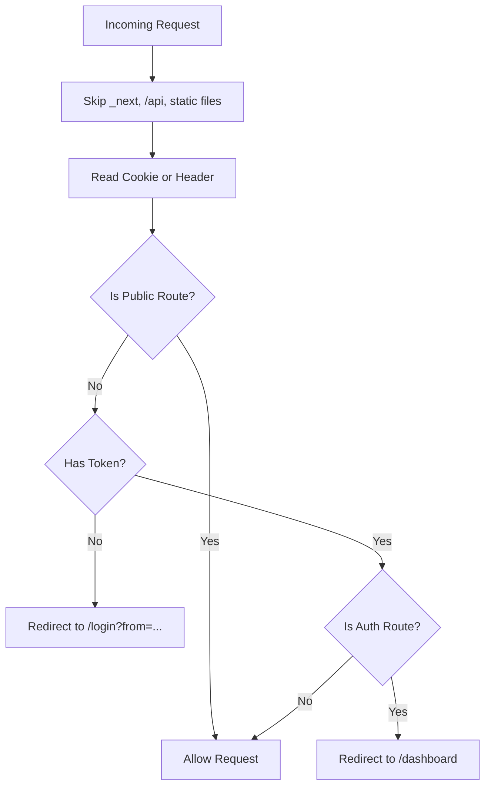

**Diagram sources**
- [middleware.ts:1-55](file://apps/web/middleware.ts#L1-L55)

**Section sources**
- [middleware.ts:1-55](file://apps/web/middleware.ts#L1-L55)

### Client-Side State Management
- AuthContext manages user profile, token, permissions, permission groups, loading state, and provides login/logout, hasPermission, hasRole, refreshUser.
- Multi-tab synchronization uses BroadcastChannel and Storage events.
- Unauthorized responses trigger global logout and redirect to session-expired flow.

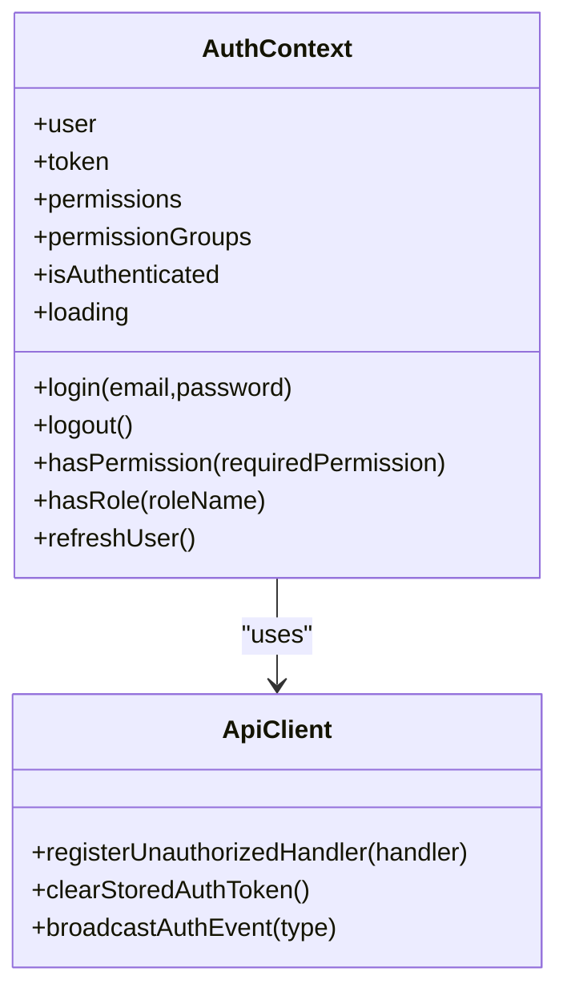

**Diagram sources**
- [lib/auth/auth-context.tsx:1-232](file://apps/web/lib/auth/auth-context.tsx#L1-L232)
- [lib/api-client.ts:1-295](file://apps/web/lib/api-client.ts#L1-L295)

**Section sources**
- [lib/auth/auth-context.tsx:1-232](file://apps/web/lib/auth/auth-context.tsx#L1-L232)
- [lib/api-client.ts:1-295](file://apps/web/lib/api-client.ts#L1-L295)

### UI Component Library Usage
- The app uses a rich set of UI primitives under components/ui/, including buttons, inputs, dialogs, tables, charts, and layout helpers.
- Pages compose these primitives to build dashboards, forms, and data views.

Examples:
- Dashboard page uses StatCard, ChartCard, Button, StatusBadge, WidgetPicker, and DashboardGrid.
- Login page uses Input, Checkbox, Field, FieldLabel, and Button.

**Section sources**
- [app/dashboard/page.tsx:1-492](file://apps/web/app/dashboard/page.tsx#L1-L492)
- [app/login/page.tsx:1-202](file://apps/web/app/login/page.tsx#L1-L202)

### Form Handling Patterns
- Forms use controlled inputs with React state and submit handlers.
- Validation is performed inline before submission; errors are displayed in dedicated message areas.
- Post-login destination is computed from search params to preserve navigation intent.

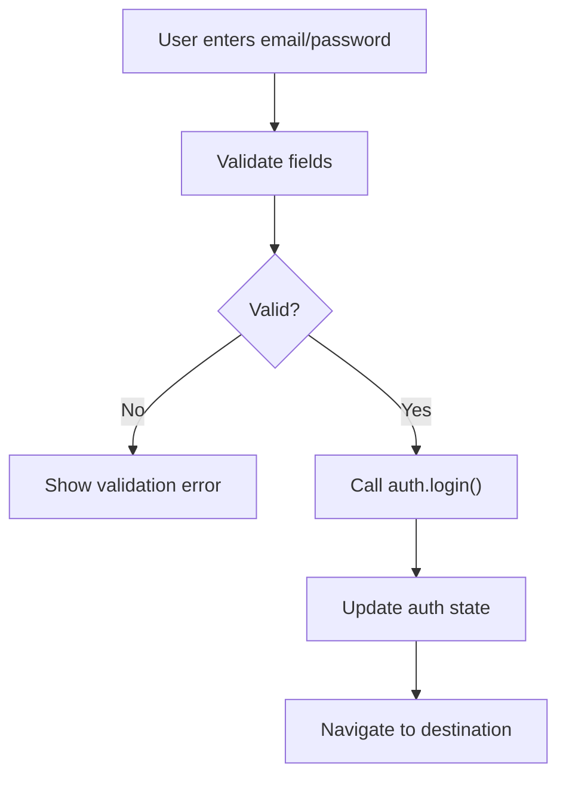

**Diagram sources**
- [app/login/page.tsx:1-202](file://apps/web/app/login/page.tsx#L1-L202)

**Section sources**
- [app/login/page.tsx:1-202](file://apps/web/app/login/page.tsx#L1-L202)

### Data Fetching Strategies
- Client-side data fetching via apiClient methods (get, post, put, patch, delete, getBlob, postFormData).
- Parallel aggregation using Promise.allSettled for robust partial failures.
- Error normalization and 401 interception handled centrally.

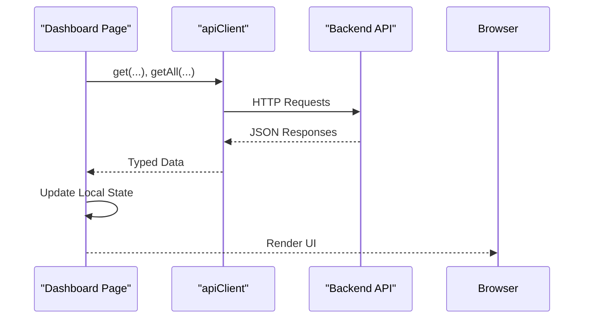

**Diagram sources**
- [app/dashboard/page.tsx:1-492](file://apps/web/app/dashboard/page.tsx#L1-L492)
- [lib/api-client.ts:1-295](file://apps/web/lib/api-client.ts#L1-L295)

**Section sources**
- [app/dashboard/page.tsx:1-492](file://apps/web/app/dashboard/page.tsx#L1-L492)
- [lib/api-client.ts:1-295](file://apps/web/lib/api-client.ts#L1-L295)

### PWA Capabilities and Service Worker Configuration
- Web app manifest defines name, scope, display mode, icons, and theme colors.
- Root layout sets Apple mobile web app metadata and icons.
- PwaRegister component registers the service worker at runtime when supported and secure.
- Next config adds headers for the service worker file to ensure proper caching behavior.

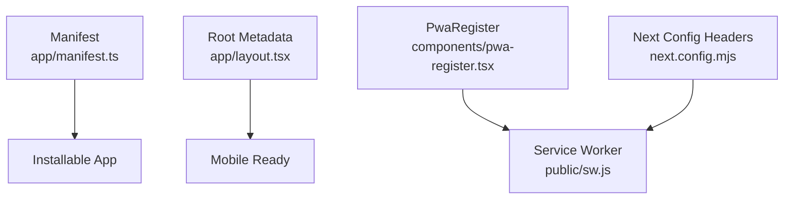

**Diagram sources**
- [app/manifest.ts:1-46](file://apps/web/app/manifest.ts#L1-L46)
- [app/layout.tsx:1-63](file://apps/web/app/layout.tsx#L1-L63)
- [components/pwa-register.tsx:1-46](file://apps/web/components/pwa-register.tsx#L1-L46)
- [next.config.mjs:1-30](file://apps/web/next.config.mjs#L1-L30)
- [public/sw.js](file://apps/web/public/sw.js)

**Section sources**
- [app/manifest.ts:1-46](file://apps/web/app/manifest.ts#L1-L46)
- [app/layout.tsx:1-63](file://apps/web/app/layout.tsx#L1-L63)
- [components/pwa-register.tsx:1-46](file://apps/web/components/pwa-register.tsx#L1-L46)
- [next.config.mjs:1-30](file://apps/web/next.config.mjs#L1-L30)
- [public/sw.js](file://apps/web/public/sw.js)

### Responsive Design Patterns
- Dashboard layout adapts between desktop and mobile:
  - Desktop shows fixed navigation rail and context sidebar.
  - Mobile shows a drawer and top header.
  - Print styles hide non-essential chrome and adjust content overflow.
- Standalone routes like /scan bypass the shell entirely.

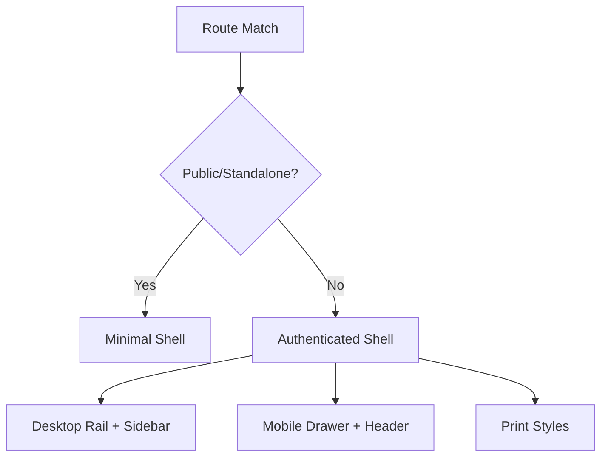

**Diagram sources**
- [components/dashboard-layout.tsx:1-131](file://apps/web/components/dashboard-layout.tsx#L1-L131)

**Section sources**
- [components/dashboard-layout.tsx:1-131](file://apps/web/components/dashboard-layout.tsx#L1-L131)

## Dependency Analysis
Key dependencies include:
- Next.js framework and app router.
- next-themes for theme management.
- react-hook-form ecosystem not used directly here; forms are controlled via React state.
- UI libraries such as lucide-react icons, recharts for charts, and shadcn/ui primitives.
- Workspace packages for domain APIs.

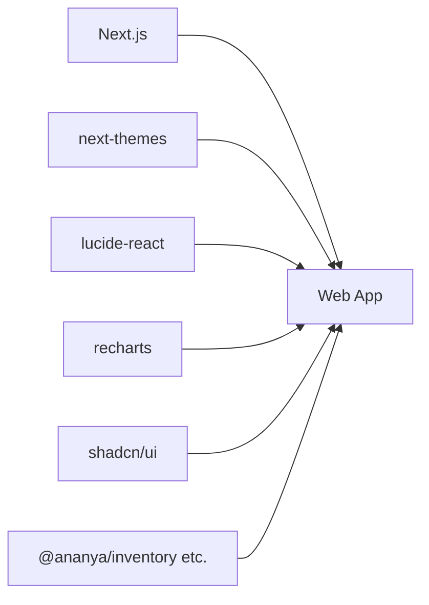

**Diagram sources**
- [package.json:1-55](file://apps/web/package.json#L1-L55)

**Section sources**
- [package.json:1-55](file://apps/web/package.json#L1-L55)

## Performance Considerations
- Image optimization is disabled in Next config; consider enabling it for production image delivery.
- Output is configured as standalone for efficient deployment.
- Use code splitting via Next.js automatic chunking and dynamic imports for heavy components.
- Prefer server components where possible to reduce client bundle size.
- Avoid unnecessary re-renders by memoizing callbacks and stable references.
- Monitor bundle size with Next.js built-in analysis tools.

[No sources needed since this section provides general guidance]

## Troubleshooting Guide
Common issues and resolutions:
- Unauthenticated access: Ensure cookies or Authorization headers are present; middleware will redirect to login otherwise.
- Session expiration: Global 401 handling clears tokens, broadcasts an event, and redirects to session-expired flow.
- Multi-tab logout: BroadcastChannel and Storage events keep tabs in sync; verify browser support.
- Service worker registration: Requires secure context or localhost; check console logs for registration failures.

**Section sources**
- [middleware.ts:1-55](file://apps/web/middleware.ts#L1-L55)
- [lib/api-client.ts:1-295](file://apps/web/lib/api-client.ts#L1-L295)
- [lib/auth/auth-context.tsx:1-232](file://apps/web/lib/auth/auth-context.tsx#L1-L232)
- [components/pwa-register.tsx:1-46](file://apps/web/components/pwa-register.tsx#L1-L46)

## Conclusion
Ananya ERP’s Next.js presentation layer combines a robust app router structure, a flexible dashboard layout, centralized authentication and authorization, a comprehensive UI component library, and reliable client-side data fetching. PWA features enable installability and offline readiness, while middleware ensures secure routing. The architecture balances developer ergonomics with performance and maintainability, providing a solid foundation for enterprise operations.