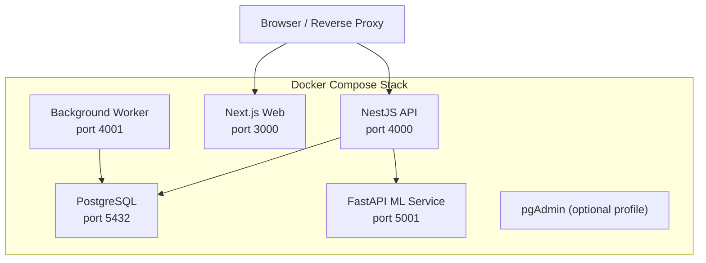
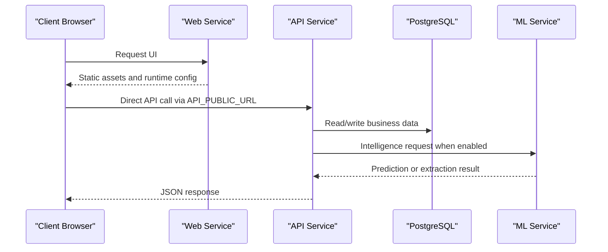
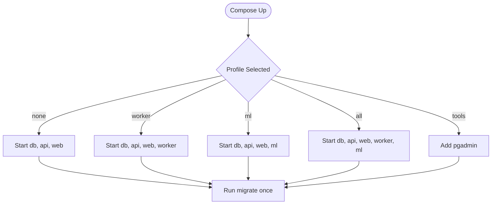
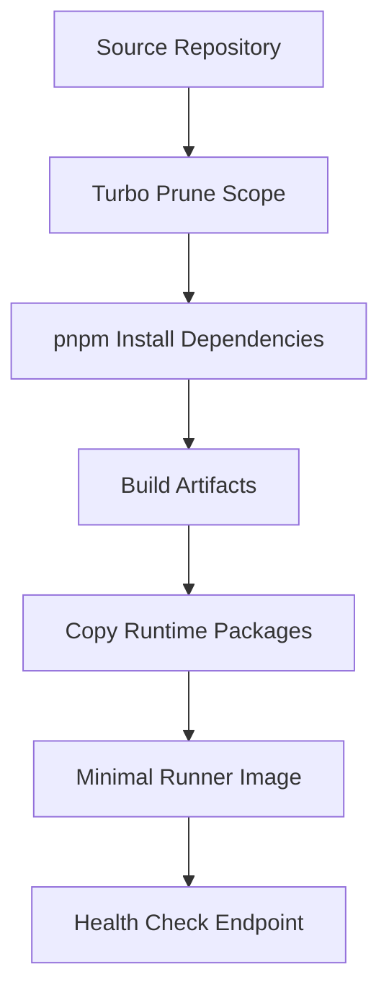
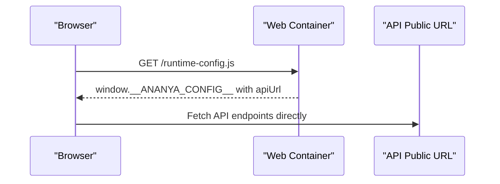
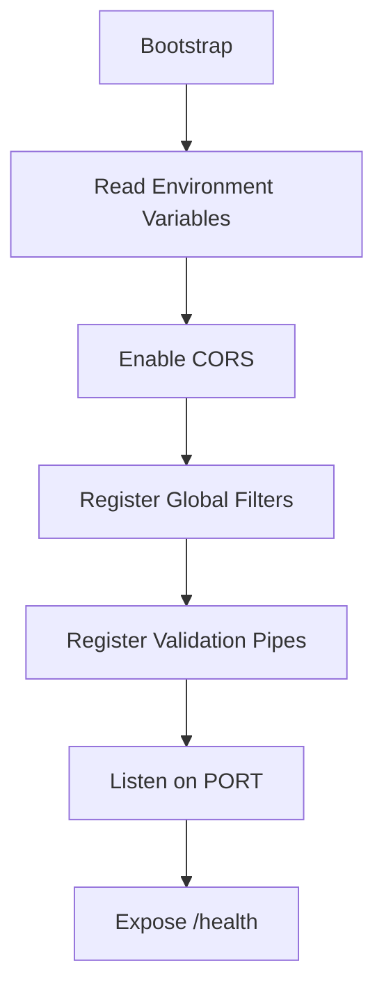
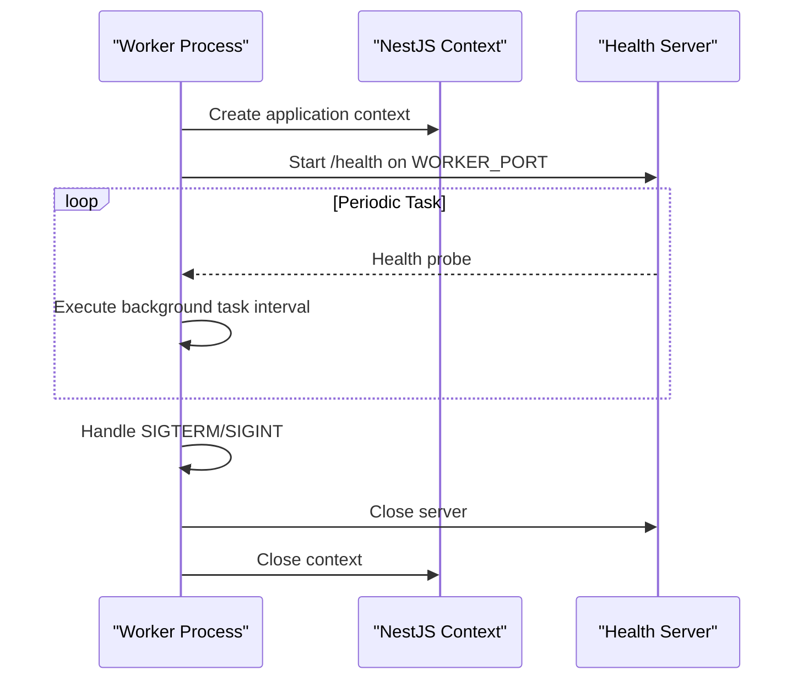
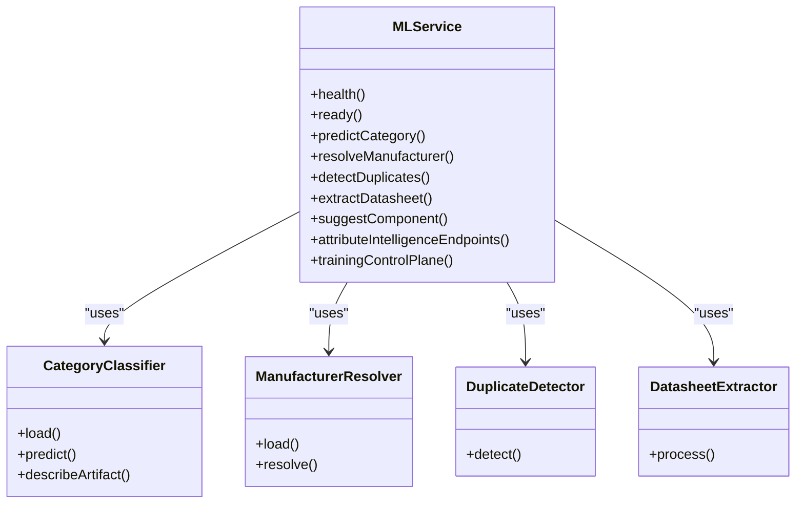
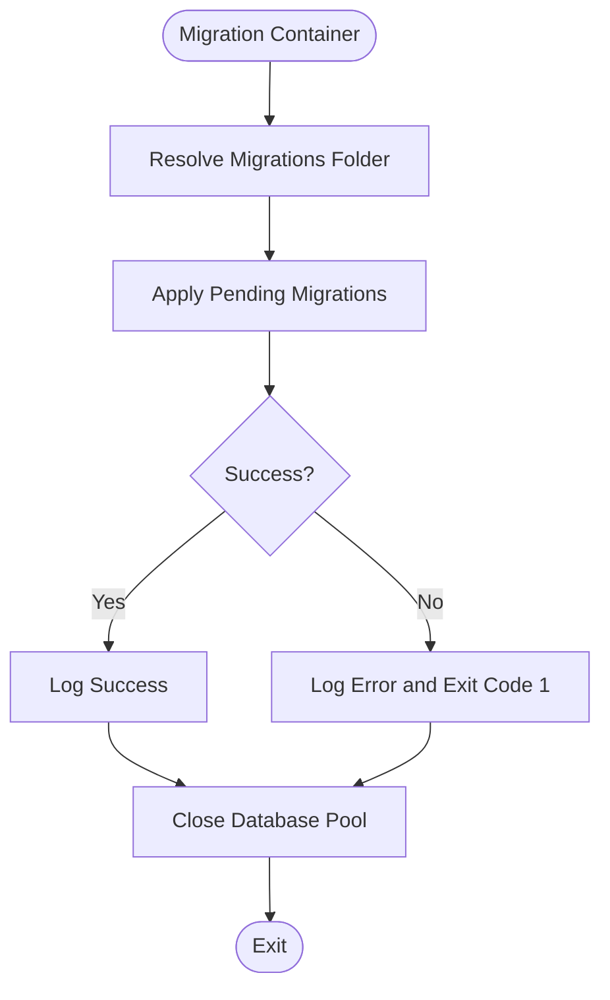
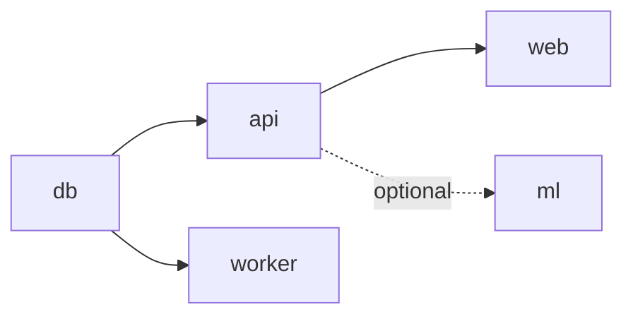

# Deployment Architecture

<cite>
**Referenced Files in This Document**
- [compose.yml](file://compose.yml)
- [compose.local.yml](file://compose.local.yml)
- [compose.prod.yml](file://compose.prod.yml)
- [docker/README.md](file://docker/README.md)
- [turbo.json](file://turbo.json)
- [docker/Dockerfile.web](file://docker/Dockerfile.web)
- [docker/Dockerfile.api](file://docker/Dockerfile.api)
- [docker/Dockerfile.worker](file://docker/Dockerfile.worker)
- [docker/Dockerfile.ml](file://docker/Dockerfile.ml)
- [apps/api/src/main.ts](file://apps/api/src/main.ts)
- [apps/api/src/worker.ts](file://apps/api/src/worker.ts)
- [apps/ml/app/main.py](file://apps/ml/app/main.py)
- [apps/ml/app/config.py](file://apps/ml/app/config.py)
- [apps/api/src/app.module.ts](file://apps/api/src/app.module.ts)
- [packages/database/src/setup/migrate.ts](file://packages/database/src/setup/migrate.ts)
</cite>

## Table of Contents
1. [Introduction](#introduction)
2. [Project Structure](#project-structure)
3. [Core Components](#core-components)
4. [Architecture Overview](#architecture-overview)
5. [Detailed Component Analysis](#detailed-component-analysis)
6. [Dependency Analysis](#dependency-analysis)
7. [Performance Considerations](#performance-considerations)
8. [Troubleshooting Guide](#troubleshooting-guide)
9. [Conclusion](#conclusion)
10. [Appendices](#appendices)

## Introduction
This document explains the deployment architecture for Ananya ERP. It covers containerized orchestration with Docker and Docker Compose, production image usage, environment configuration, service dependencies, build pipeline integration with Turborepo, multi-stage Docker builds, network topology, scaling considerations, health checks, monitoring guidance, backup and recovery procedures, disaster recovery planning, operational maintenance tasks, troubleshooting, and performance tuning recommendations.

Ananya deploys four primary application services:
- Web: Next.js frontend served as a standalone Node.js application.
- API: NestJS REST API handling business logic, authentication, database access, and ML integration.
- Worker: Background processing service sharing the NestJS application context.
- ML: Python FastAPI microservice providing component intelligence endpoints.

The stack also includes PostgreSQL for persistence and optional pgAdmin for database administration.

## Project Structure
The deployment surface is defined by three Compose files and per-service Dockerfiles:
- `compose.yml` defines the canonical base stack, including PostgreSQL, API, migration runner, worker, web, ML, shared volumes, internal networking, and health checks.
- `compose.local.yml` provides local build directives so the repository’s Dockerfiles are used instead of published images.
- `compose.prod.yml` pins published GitHub Container Registry images and enforces required runtime arguments such as `API_PUBLIC_URL`.

**Diagram sources**
- [compose.yml:18-195](file://compose.yml#L18-L195)
- [docker/README.md:125-158](file://docker/README.md#L125-L158)

**Section sources**
- [compose.yml:1-205](file://compose.yml#L1-L205)
- [compose.local.yml:1-44](file://compose.local.yml#L1-L44)
- [compose.prod.yml:1-47](file://compose.prod.yml#L1-L47)
- [docker/README.md:1-176](file://docker/README.md#L1-L176)

## Core Components
- Database: PostgreSQL runs on an internal Docker network with a named volume for data persistence. Health is probed using `pg_isready`.
- API: NestJS application listens on port 4000, reads CORS configuration from environment variables, connects to PostgreSQL via `DATABASE_URL`, and optionally calls the ML service through `ML_SERVICE_URL`.
- Worker: Background process that initializes the NestJS application context and exposes a lightweight HTTP health endpoint on port 4001.
- Web: Standalone Next.js application built with Turborepo and injected at runtime with `API_PUBLIC_URL`. The browser communicates directly with this public API URL.
- ML: CPU-first FastAPI service exposing classification, manufacturer resolution, duplicate detection, datasheet extraction, attribute intelligence, and training control-plane endpoints.
- Migration Runner: One-shot container executing Drizzle migrations against PostgreSQL before starting application services.

Key environment variables include:
- Database connection: `POSTGRES_DB`, `POSTGRES_USER`, `POSTGRES_PASSWORD`, and derived `DATABASE_URL`.
- API runtime: `PORT`, `CORS_ORIGIN`, `JWT_SECRET`, `ML_SERVICE_URL`, `ML_SERVICE_ENABLED`.
- Web runtime: `API_PUBLIC_URL`.
- Worker runtime: `WORKER_PORT`, `WORKER_CONCURRENCY`.
- ML runtime: `PORT`, model paths, and feature flags.

**Section sources**
- [compose.yml:19-173](file://compose.yml#L19-L173)
- [apps/api/src/main.ts:11-41](file://apps/api/src/main.ts#L11-L41)
- [apps/api/src/worker.ts:9-42](file://apps/api/src/worker.ts#L9-L42)
- [apps/ml/app/main.py:60-101](file://apps/ml/app/main.py#L60-L101)
- [apps/ml/app/config.py:4-19](file://apps/ml/app/config.py#L4-L19)

## Architecture Overview
The deployment follows a layered, containerized architecture:
- External clients reach the Web and API through a reverse proxy or host-level routing.
- Internal container communication uses Docker DNS names such as `db`, `ml`, and service ports.
- Data persistence is provided by PostgreSQL with a dedicated volume.
- Optional tools like pgAdmin can be enabled through Compose profiles.

**Diagram sources**
- [compose.yml:10-13](file://compose.yml#L10-L13)
- [compose.yml:41-72](file://compose.yml#L41-L72)
- [compose.yml:120-148](file://compose.yml#L120-L148)
- [apps/api/src/main.ts:14-22](file://apps/api/src/main.ts#L14-L22)
- [apps/ml/app/main.py:103-152](file://apps/ml/app/main.py#L103-L152)

## Detailed Component Analysis

### Compose Orchestration and Profiles
The base stack defines services, networks, volumes, health checks, and dependency ordering. Profiles allow selective activation of optional components:
- Default services: `db`, `api`, `web`, and one-shot `migrate`.
- Optional services: `worker`, `ml`, and `pgadmin`.
- Recommended full deployment profile: `all`.

**Diagram sources**
- [compose.yml:74-118](file://compose.yml#L74-L118)
- [compose.yml:150-195](file://compose.yml#L150-L195)
- [docker/README.md:79-90](file://docker/README.md#L79-L90)

**Section sources**
- [compose.yml:1-205](file://compose.yml#L1-L205)
- [docker/README.md:79-101](file://docker/README.md#L79-L101)

### Build Pipeline and Multi-Stage Images
Turborepo drives workspace-aware builds. Each service has a hardened multi-stage Dockerfile:
- Pruner stage prunes the monorepo to only the relevant scope.
- Builder stage installs dependencies and compiles artifacts.
- Production dependencies stage installs runtime-only packages.
- Runner stage copies minimal artifacts and runs the service as a non-root user.

**Diagram sources**
- [turbo.json:17-31](file://turbo.json#L17-L31)
- [docker/Dockerfile.web:10-88](file://docker/Dockerfile.web#L10-L88)
- [docker/Dockerfile.api:10-92](file://docker/Dockerfile.api#L10-L92)
- [docker/Dockerfile.worker:10-91](file://docker/Dockerfile.worker#L10-L91)
- [docker/Dockerfile.ml:6-59](file://docker/Dockerfile.ml#L6-L59)

**Section sources**
- [turbo.json:1-53](file://turbo.json#L1-L53)
- [docker/Dockerfile.web:1-89](file://docker/Dockerfile.web#L1-L89)
- [docker/Dockerfile.api:1-93](file://docker/Dockerfile.api#L1-L93)
- [docker/Dockerfile.worker:1-92](file://docker/Dockerfile.worker#L1-L92)
- [docker/Dockerfile.ml:1-60](file://docker/Dockerfile.ml#L1-L60)

### Web Service Configuration and Immutability
The Web image is environment-agnostic and does not embed domain-specific API URLs. At container boot, a runtime entrypoint generates `/app/apps/web/public/runtime-config.js` containing the configured `API_PUBLIC_URL`. The browser loads this file and calls the API directly.

**Diagram sources**
- [docker/README.md:143-151](file://docker/README.md#L143-L151)
- [compose.yml:120-148](file://compose.yml#L120-L148)

**Section sources**
- [docker/README.md:143-158](file://docker/README.md#L143-L158)
- [compose.yml:120-148](file://compose.yml#L120-L148)

### API Service Bootstrap and Health
The API bootstrap enables CORS, global exception filters, logging interceptors, and validation pipes. It listens on the configured port and exposes a `/health` endpoint used by Docker health checks.

**Diagram sources**
- [apps/api/src/main.ts:11-41](file://apps/api/src/main.ts#L11-L41)
- [compose.yml:41-72](file://compose.yml#L41-L72)

**Section sources**
- [apps/api/src/main.ts:1-42](file://apps/api/src/main.ts#L1-L42)
- [compose.yml:41-72](file://compose.yml#L41-L72)

### Worker Service Lifecycle
The worker initializes the NestJS application context without serving HTTP routes, then starts a lightweight HTTP server solely for health probes. It simulates periodic background work and handles graceful shutdown signals.

**Diagram sources**
- [apps/api/src/worker.ts:9-72](file://apps/api/src/worker.ts#L9-L72)
- [compose.yml:89-118](file://compose.yml#L89-L118)

**Section sources**
- [apps/api/src/worker.ts:1-73](file://apps/api/src/worker.ts#L1-L73)
- [compose.yml:89-118](file://compose.yml#L89-L118)

### ML Service Endpoints and Training Control Plane
The ML service loads lightweight models at startup and exposes prediction, extraction, attribute intelligence, and training control-plane endpoints. The `/health` and `/ready` endpoints support container readiness and model availability checks.

**Diagram sources**
- [apps/ml/app/main.py:60-101](file://apps/ml/app/main.py#L60-L101)
- [apps/ml/app/main.py:103-152](file://apps/ml/app/main.py#L103-L152)
- [apps/ml/app/main.py:154-256](file://apps/ml/app/main.py#L154-L256)
- [apps/ml/app/main.py:258-361](file://apps/ml/app/main.py#L258-L361)
- [apps/ml/app/main.py:363-488](file://apps/ml/app/main.py#L363-L488)
- [apps/ml/app/config.py:4-19](file://apps/ml/app/config.py#L4-L19)

**Section sources**
- [apps/ml/app/main.py:1-488](file://apps/ml/app/main.py#L1-L488)
- [apps/ml/app/config.py:1-26](file://apps/ml/app/config.py#L1-L26)

### Database Migration Runner
Migrations are executed explicitly by a one-shot container using Drizzle. The migration script resolves the migrations folder, applies pending changes, logs success or failure, and closes the database pool.

**Diagram sources**
- [packages/database/src/setup/migrate.ts:5-21](file://packages/database/src/setup/migrate.ts#L5-L21)
- [compose.yml:74-87](file://compose.yml#L74-L87)

**Section sources**
- [packages/database/src/setup/migrate.ts:1-22](file://packages/database/src/setup/migrate.ts#L1-L22)
- [compose.yml:74-87](file://compose.yml#L74-L87)

## Dependency Analysis
Service dependencies and health-based startup order are enforced by Compose:
- `api` depends on `db` being healthy.
- `web` depends on `api` being healthy.
- `worker` depends on `db` being healthy.
- `ml` is optional and can be activated via profiles.
- In production, `api` optionally waits for `ml` to become healthy, but the dependency is marked non-required so the API remains functional if ML is disabled.

**Diagram sources**
- [compose.yml:41-72](file://compose.yml#L41-L72)
- [compose.yml:89-118](file://compose.yml#L89-L118)
- [compose.yml:120-148](file://compose.yml#L120-L148)
- [compose.prod.yml:23-28](file://compose.prod.yml#L23-L28)

**Section sources**
- [compose.yml:41-173](file://compose.yml#L41-L173)
- [compose.prod.yml:22-47](file://compose.prod.yml#L22-L47)

## Performance Considerations
- Use published images in production to avoid rebuilding large workspaces on every deployment.
- Pin versions using `ANANYA_VERSION` to ensure reproducible deployments.
- Keep the Web image immutable; configure runtime behavior through `API_PUBLIC_URL`.
- Enable Compose profiles to reduce unnecessary service footprints.
- Monitor health endpoints to detect slow startups or degraded services.
- Tune worker concurrency through `WORKER_CONCURRENCY` based on workload characteristics.
- Avoid exposing PostgreSQL to the host in production; use `compose.local.yml` only for development.
- Ensure reverse proxy timeouts align with API and ML latency expectations.

[No sources needed since this section provides general guidance]

## Troubleshooting Guide
Common deployment issues and resolutions:
- Web cannot reach API: Verify `API_PUBLIC_URL` points to a browser-reachable address, not a Docker service name.
- API fails to start: Check `DATABASE_URL`, `JWT_SECRET`, and `CORS_ORIGIN`; confirm PostgreSQL is healthy.
- Worker health check fails: Confirm `WORKER_PORT` is exposed internally and the health endpoint responds.
- ML features unavailable: Ensure the `ml` profile is active and `ML_SERVICE_URL` is reachable; verify `/health` and `/ready` endpoints.
- Migrations fail: Inspect migration logs and ensure schema compatibility; run migrations before starting application services.
- Port conflicts: Adjust `WEB_PORT`, `API_PORT`, `ML_PORT`, `PGADMIN_PORT`, and `POSTGRES_PORT` in `.env` or Compose overrides.

Operational checks:
- Web health: `http://localhost:3000/api/health`
- API health: `http://localhost:4000/health`
- Worker health: `http://localhost:4001/health`
- ML health: `http://localhost:5001/health`
- PostgreSQL readiness: `pg_isready`

**Section sources**
- [docker/README.md:167-176](file://docker/README.md#L167-L176)
- [compose.yml:31-72](file://compose.yml#L31-L72)
- [compose.yml:107-148](file://compose.yml#L107-L148)
- [compose.yml:162-173](file://compose.yml#L162-L173)

## Conclusion
Ananya ERP’s deployment architecture combines a modular Compose stack, hardened multi-stage Docker images, and Turborepo-driven builds. The design emphasizes immutability, explicit migrations, clear health checks, and optional ML capabilities. By following the documented deployment order, environment configuration, and operational practices, teams can deploy reliably, scale thoughtfully, and maintain predictable production environments.

[No sources needed since this section summarizes without analyzing specific files]

## Appendices

### Production Deployment Checklist
- Set required environment variables: `ANANYA_VERSION`, `POSTGRES_DB`, `POSTGRES_USER`, `POSTGRES_PASSWORD`, `JWT_SECRET`, `CORS_ORIGIN`, `API_PUBLIC_URL`.
- Pull published images using `compose.prod.yml`.
- Start PostgreSQL, run migrations, then start all application services with the recommended profile.
- Validate health endpoints for all running services.
- Configure external reverse proxy to route browser traffic to Web and API public URLs.

**Section sources**
- [docker/README.md:55-77](file://docker/README.md#L55-L77)
- [compose.prod.yml:1-47](file://compose.prod.yml#L1-L47)

### Backup and Recovery Procedures
- Back up the PostgreSQL volume (`ananya_db`) regularly using your platform’s volume snapshot or dump strategy.
- Store backups off-host and retain according to retention policies.
- Test restore procedures in a staging environment before relying on them in production.
- For disaster recovery, rebuild the stack from pinned images and restore the database volume or import a known-good dump.

[No sources needed since this section provides general guidance]

### Operational Maintenance Tasks
- Rotate secrets such as `JWT_SECRET` and database credentials securely.
- Update images by pinning new `ANANYA_VERSION`, pulling images, running migrations, and rolling out updated services.
- Monitor health endpoints and logs for anomalies.
- Review Compose profiles to remove unused services and reduce attack surface.
- Perform capacity planning for worker concurrency and ML request throughput.

**Section sources**
- [docker/README.md:91-101](file://docker/README.md#L91-L101)
- [compose.yml:89-118](file://compose.yml#L89-L118)