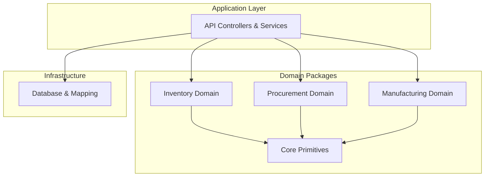
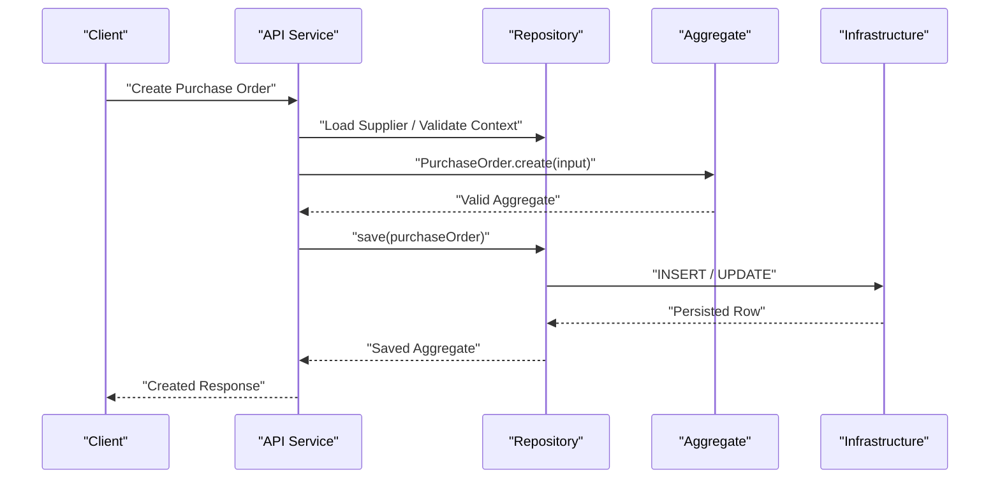
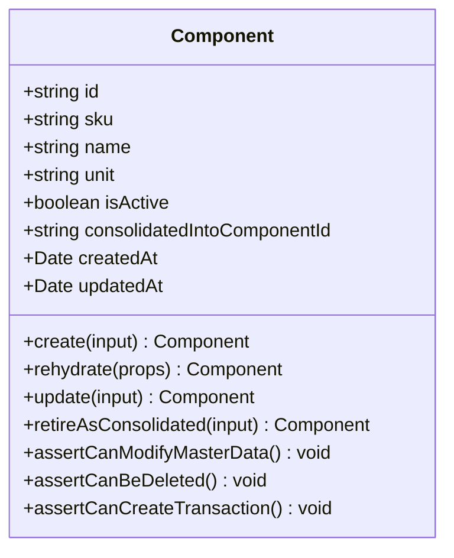
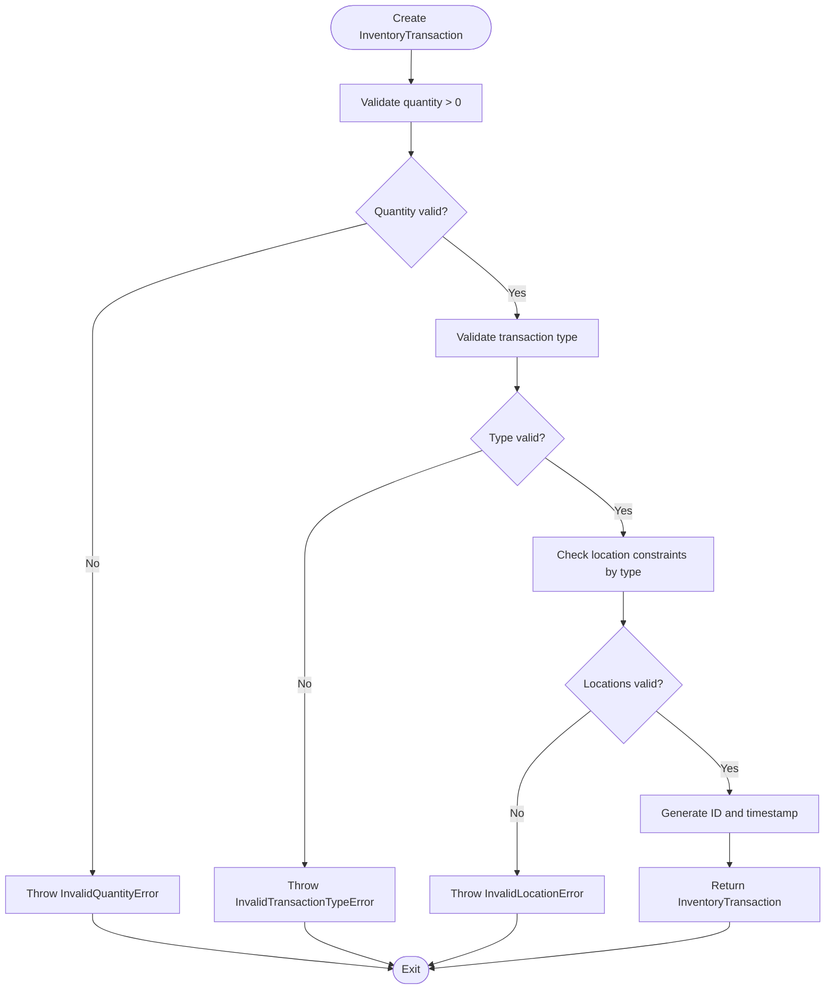
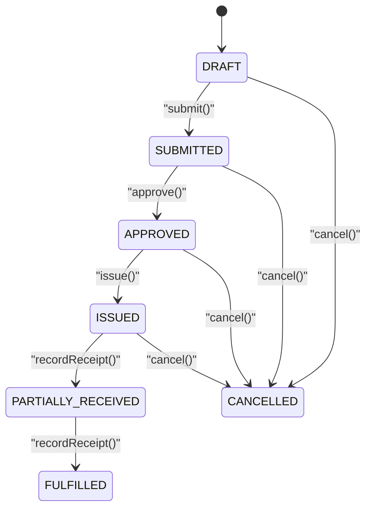
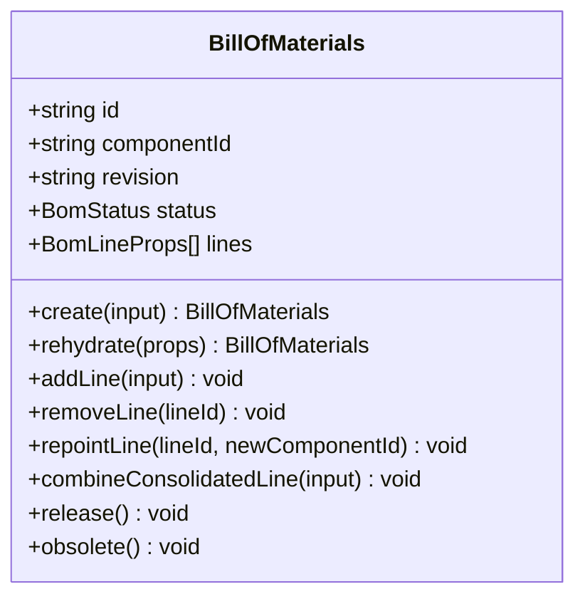
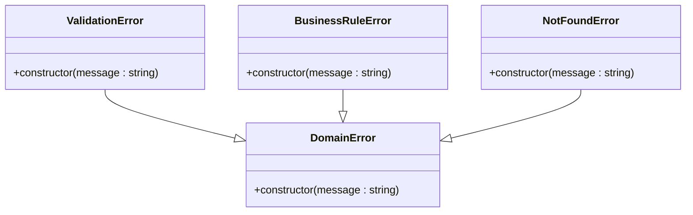
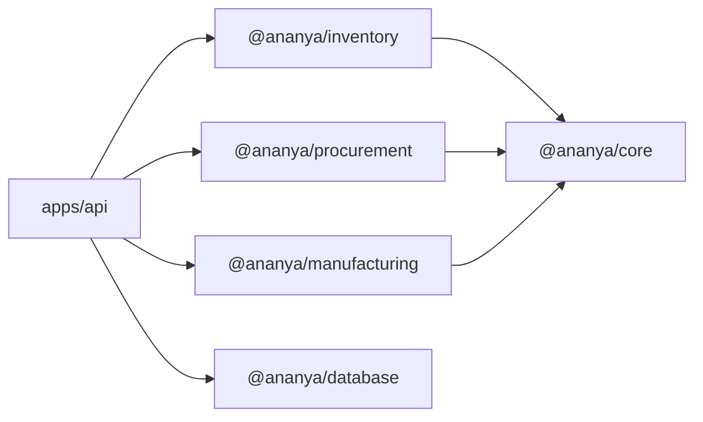

# Core Domain Concepts

<cite>
**Referenced Files in This Document**
- [DDD.md](file://docs/architecture/DDD.md)
- [engineering.md](file://docs/standards/engineering.md)
- [PROJECT_STRUCTURE.md](file://docs/architecture/PROJECT_STRUCTURE.md)
- [component.ts](file://packages/inventory/src/components/component.ts)
- [inventory-transaction.ts](file://packages/inventory/src/ledger/inventory-transaction.ts)
- [purchase-order.ts](file://packages/procurement/src/purchase-orders/purchase-order.ts)
- [bill-of-materials.ts](file://packages/manufacturing/src/boms/bill-of-materials.ts)
- [domain-error.ts](file://packages/core/src/errors/domain-error.ts)
- [validation-error.ts](file://packages/core/src/errors/validation-error.ts)
- [domain-rule-violation-error.ts](file://packages/core/src/errors/domain-rule-violation-error.ts)
- [not-found-error.ts](file://packages/core/src/errors/not-found-error.ts)
- [index.ts (core errors)](file://packages/core/src/errors/index.ts)
</cite>

## Table of Contents
1. Introduction
2. Project Structure
3. Core Components
4. Architecture Overview
5. Detailed Component Analysis
6. Dependency Analysis
7. Performance Considerations
8. Troubleshooting Guide
9. Conclusion

## Introduction
This document explains Ananya ERP’s core domain concepts and how Domain-Driven Design is implemented across the system. It covers aggregate roots, entities, value objects, domain events, shared abstractions, business rule encapsulation, separation of concerns between domain and infrastructure, and event-driven communication patterns. Concrete examples are drawn from inventory, procurement, and manufacturing domains to illustrate entity relationships, domain service responsibilities, and error handling strategies.

## Project Structure
Ananya organizes domain logic into feature packages under packages/, each representing a bounded context or cohesive capability:
- @ananya/inventory: components, ledger, locations, manufacturers, units, reservations, batches, serials, attributes, categories, projection
- @ananya/procurement: suppliers, purchase orders, goods receipts, supplier returns, policies, purchase invoices
- @ananya/manufacturing: BOMs, production orders, material consumptions, finished goods, traceability
- @ananya/core: shared engineering primitives such as ObjectId and the domain error hierarchy
- @ananya/database: persistence infrastructure and mapping
- apps/api: application layer (controllers, services, modules) that orchestrates use cases and calls domain behavior

The architecture enforces strict dependency direction: applications depend on domain packages; domain packages do not depend on infrastructure or applications. The database exists to persist the domain, and the API exists to expose it.

**Diagram sources**
- [PROJECT_STRUCTURE.md:155-171](file://docs/architecture/PROJECT_STRUCTURE.md#L155-L171)
- [engineering.md:25-50](file://docs/standards/engineering.md#L25-L50)

**Section sources**
- [PROJECT_STRUCTURE.md:155-171](file://docs/architecture/PROJECT_STRUCTURE.md#L155-L171)
- [engineering.md:25-50](file://docs/standards/engineering.md#L25-L50)

## Core Components
Ananya’s DDD standard defines clear layer responsibilities and aggregate lifecycle rules:
- Application layer orchestrates use cases, coordinates repositories, and calls domain behavior without containing business rules or persistence logic.
- Domain layer owns business rules, invariants, aggregate lifecycle, identity, timestamps, and ubiquitous language.
- Infrastructure provides persistence, Drizzle mapping, external services, messaging, and file systems.

Aggregates must always be valid and never exist in an invalid state. They own identity, timestamps, invariants, normalization, and business behavior. Each aggregate exposes exactly two construction paths:
- create(): for new aggregates, responsible for validation, normalization, identity generation, timestamps, and defaults
- rehydrate(): used only by repositories to rebuild persisted state without validation or normalization

Repositories persist aggregates (never DTOs), decide HOW persistence occurs, and expose stable query contracts like findMany(options?). Identity and time belong to the domain; repositories preserve but do not generate them.

**Section sources**
- [DDD.md:28-59](file://docs/architecture/DDD.md#L28-L59)
- [DDD.md:62-126](file://docs/architecture/DDD.md#L62-L126)
- [DDD.md:128-172](file://docs/architecture/DDD.md#L128-L172)
- [DDD.md:293-320](file://docs/architecture/DDD.md#L293-L320)
- [DDD.md:322-337](file://docs/architecture/DDD.md#L322-L337)

## Architecture Overview
The system follows a layered architecture with strict boundaries:
- Domain models encapsulate business rules and invariants
- Repositories abstract persistence and map between aggregates and storage
- Application services orchestrate workflows using repositories and domain behavior
- Infrastructure adapts to databases, messaging, and external services

**Diagram sources**
- [DDD.md:174-207](file://docs/architecture/DDD.md#L174-L207)
- [DDD.md:128-172](file://docs/architecture/DDD.md#L128-L172)

## Detailed Component Analysis

### Inventory Domain: Component Aggregate
The Component aggregate enforces consolidation lifecycle invariants and protects master data integrity:
- Consolidation state is derived from persisted fields (ACTIVE vs CONSOLIDATED)
- Retiring a component marks it as consolidated and prevents further edits or transactions
- Methods assert preconditions before allowing updates, deletions, or transaction creation

**Diagram sources**
- [component.ts:77-321](file://packages/inventory/src/components/component.ts#L77-L321)

Key behaviors:
- create(): validates SKU/name/unit, generates identity and timestamps, sets defaults
- retireAsConsolidated(): prevents self-consolidation and double consolidation, records canonical target and timestamp
- update(): guards against editing consolidated components
- assertCanCreateTransaction(): prevents ledger entries for consolidated components
- assertCanBeDeleted(): prevents deletion of historical consolidated records

**Section sources**
- [component.ts:113-155](file://packages/inventory/src/components/component.ts#L113-L155)
- [component.ts:157-165](file://packages/inventory/src/components/component.ts#L157-L165)
- [component.ts:167-218](file://packages/inventory/src/components/component.ts#L167-L218)
- [component.ts:220-265](file://packages/inventory/src/components/component.ts#L220-L265)
- [component.ts:267-314](file://packages/inventory/src/components/component.ts#L267-L314)
- [component.ts:316-321](file://packages/inventory/src/components/component.ts#L316-L321)

### Inventory Domain: Inventory Transaction Aggregate
The InventoryTransaction aggregate validates transaction types and location constraints:
- Quantity must be greater than zero
- Transaction type determines required/forbidden location fields
- Exhaustive switch ensures all transaction types are handled explicitly

**Diagram sources**
- [inventory-transaction.ts:49-156](file://packages/inventory/src/ledger/inventory-transaction.ts#L49-L156)

**Section sources**
- [inventory-transaction.ts:49-156](file://packages/inventory/src/ledger/inventory-transaction.ts#L49-L156)
- [inventory-transaction.ts:158-167](file://packages/inventory/src/ledger/inventory-transaction.ts#L158-L167)

### Procurement Domain: Purchase Order Aggregate
The PurchaseOrder aggregate manages order lifecycle and line items:
- Status transitions are enforced (DRAFT → SUBMITTED → APPROVED → ISSUED → FULFILLED/CANCELLED)
- Line operations validate quantities and prevent edits after submission
- Totals are recalculated when lines change

**Diagram sources**
- [purchase-order.ts:8-15](file://packages/procurement/src/purchase-orders/purchase-order.ts#L8-L15)
- [purchase-order.ts:217-253](file://packages/procurement/src/purchase-orders/purchase-order.ts#L217-L253)

Key behaviors:
- create(): initializes default currency, status, totals, and empty lines
- addLine(): validates positive quantity, computes line total with tax
- submit()/approve()/issue(): enforce status transitions
- recordReceipt(): updates received quantities and transitions to partially fulfilled or fulfilled
- recalculateTotals(): recomputes subtotal, tax total, and grand total

**Section sources**
- [purchase-order.ts:122-145](file://packages/procurement/src/purchase-orders/purchase-order.ts#L122-L145)
- [purchase-order.ts:163-174](file://packages/procurement/src/purchase-orders/purchase-order.ts#L163-L174)
- [purchase-order.ts:176-215](file://packages/procurement/src/purchase-orders/purchase-order.ts#L176-L215)
- [purchase-order.ts:217-253](file://packages/procurement/src/purchase-orders/purchase-order.ts#L217-L253)
- [purchase-order.ts:255-269](file://packages/procurement/src/purchase-orders/purchase-order.ts#L255-L269)

### Manufacturing Domain: Bill of Materials Aggregate
The BillOfMaterials aggregate manages product structure with strict invariants:
- Prevents circular dependencies (BOM cannot consume itself)
- Prevents duplicate component lines
- Enforces immutability once released
- Supports consolidation scenarios through repointing and combining lines

**Diagram sources**
- [bill-of-materials.ts:51-337](file://packages/manufacturing/src/boms/bill-of-materials.ts#L51-L337)

Key behaviors:
- addLine(): validates quantity, scrap factor, prevents duplicates and circular dependencies
- repointLine(): supports consolidation by moving retired component references to canonical components
- combineConsolidatedLine(): merges lines when components consolidate, ensuring positive quantities and non-negative scrap factors
- release()/obsolete(): enforce status transitions and immutability

**Section sources**
- [bill-of-materials.ts:74-89](file://packages/manufacturing/src/boms/bill-of-materials.ts#L74-L89)
- [bill-of-materials.ts:99-136](file://packages/manufacturing/src/boms/bill-of-materials.ts#L99-L136)
- [bill-of-materials.ts:146-187](file://packages/manufacturing/src/boms/bill-of-materials.ts#L146-L187)
- [bill-of-materials.ts:189-271](file://packages/manufacturing/src/boms/bill-of-materials.ts#L189-L271)
- [bill-of-materials.ts:315-333](file://packages/manufacturing/src/boms/bill-of-materials.ts#L315-L333)

### Shared Abstractions: Domain Error Hierarchy
Ananya uses a consistent error hierarchy in @ananya/core:
- DomainError: base class for all domain-specific errors
- ValidationError: generic validation failures
- BusinessRuleError: violations of business rules or invariants
- NotFoundError: resource not found

All domain packages extend these base classes to ensure consistent error handling and categorization.

**Diagram sources**
- [domain-error.ts:1-9](file://packages/core/src/errors/domain-error.ts#L1-L9)
- [validation-error.ts:1-10](file://packages/core/src/errors/validation-error.ts#L1-L10)
- [domain-rule-violation-error.ts:1-10](file://packages/core/src/errors/domain-rule-violation-error.ts#L1-L10)
- [not-found-error.ts:1-10](file://packages/core/src/errors/not-found-error.ts#L1-L10)
- [index.ts:1-4](file://packages/core/src/errors/index.ts#L1-L4)

**Section sources**
- [domain-error.ts:1-9](file://packages/core/src/errors/domain-error.ts#L1-L9)
- [validation-error.ts:1-10](file://packages/core/src/errors/validation-error.ts#L1-L10)
- [domain-rule-violation-error.ts:1-10](file://packages/core/src/errors/domain-rule-violation-error.ts#L1-L10)
- [not-found-error.ts:1-10](file://packages/core/src/errors/not-found-error.ts#L1-L10)
- [index.ts:1-4](file://packages/core/src/errors/index.ts#L1-L4)

## Dependency Analysis
Dependency direction is strictly enforced:
- Applications depend on domain packages
- Domain packages depend only on shared primitives (@ananya/core)
- Infrastructure depends on domain abstractions but not vice versa

**Diagram sources**
- [PROJECT_STRUCTURE.md:155-171](file://docs/architecture/PROJECT_STRUCTURE.md#L155-L171)
- [engineering.md:25-50](file://docs/standards/engineering.md#L25-L50)

**Section sources**
- [PROJECT_STRUCTURE.md:155-171](file://docs/architecture/PROJECT_STRUCTURE.md#L155-L171)
- [engineering.md:25-50](file://docs/standards/engineering.md#L25-L50)

## Performance Considerations
- Aggregates should expose readonly state and mutate through explicit methods to maintain consistency
- Repository queries should use stable contracts (findMany(options?)) to avoid signature changes
- Avoid unnecessary object creation in hot paths; prefer immutable updates where appropriate
- Use exhaustive switches for type safety to prevent runtime errors in transaction processing

[No sources needed since this section provides general guidance]

## Troubleshooting Guide
Common domain errors and their meanings:
- InvalidComponentSkuError: SKU validation failed during component creation
- InvalidComponentNameError: Name validation failed during component operations
- InvalidUnitError: Unit validation failed during component operations
- ComponentConsolidatedError: Attempted operation on a consolidated component
- InvalidTransactionTypeError: Unsupported transaction type
- InvalidQuantityError: Non-positive quantity in transactions
- InvalidLocationError: Location constraints violated for transaction type
- EmptyPurchaseOrderError: Submitting PO without lines
- InvalidPoStatusTransitionError: Invalid status transition
- CircularBomDependencyError: BOM consumes itself
- DuplicateBomComponentLineError: Duplicate component in BOM lines
- ImmutableBomError: Modifying released BOM

Error handling strategy:
- Business failures throw DomainError subclasses
- Infrastructure failures throw infrastructure-specific errors
- Do not mix domain and infrastructure error types

**Section sources**
- [DDD.md:263-290](file://docs/architecture/DDD.md#L263-L290)
- [component.errors.ts](file://packages/inventory/src/components/component.errors.ts)
- [inventory-transaction.errors.ts](file://packages/inventory/src/ledger/inventory-transaction.errors.ts)
- [purchase-order.errors.ts](file://packages/procurement/src/purchase-orders/purchase-order.errors.ts)
- [bill-of-materials.errors.ts](file://packages/manufacturing/src/boms/bill-of-materials.errors.ts)

## Conclusion
Ananya ERP implements Domain-Driven Design with clear boundaries between domain, application, and infrastructure layers. Aggregates encapsulate business rules and invariants, repositories handle persistence without business logic, and application services orchestrate workflows. The shared error hierarchy and strict dependency management ensure consistency and maintainability. Event-driven patterns can be added through infrastructure while preserving domain purity. This architecture supports scalable feature development while maintaining stability and clarity.

[No sources needed since this section summarizes without analyzing specific files]