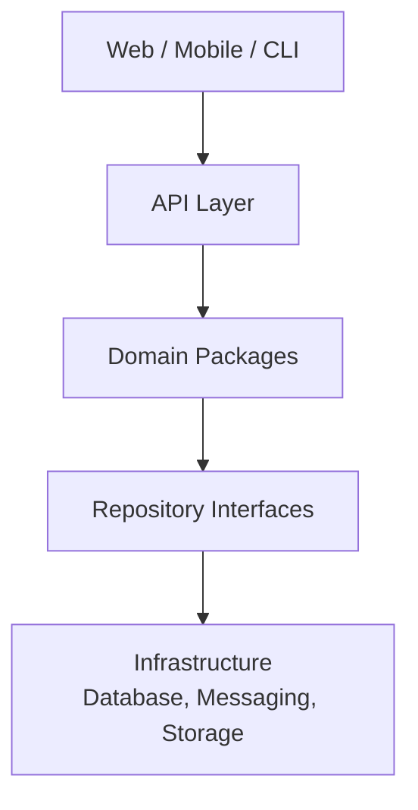
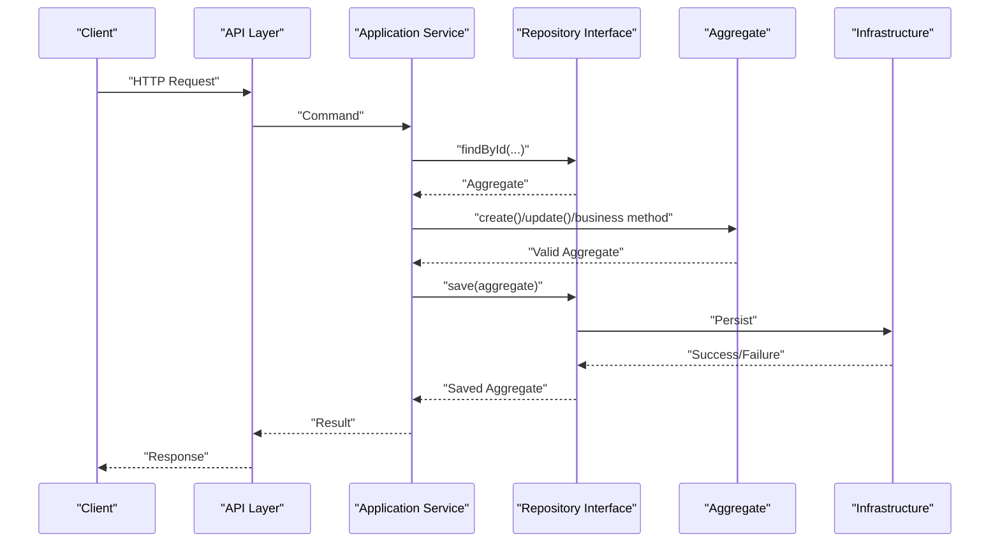
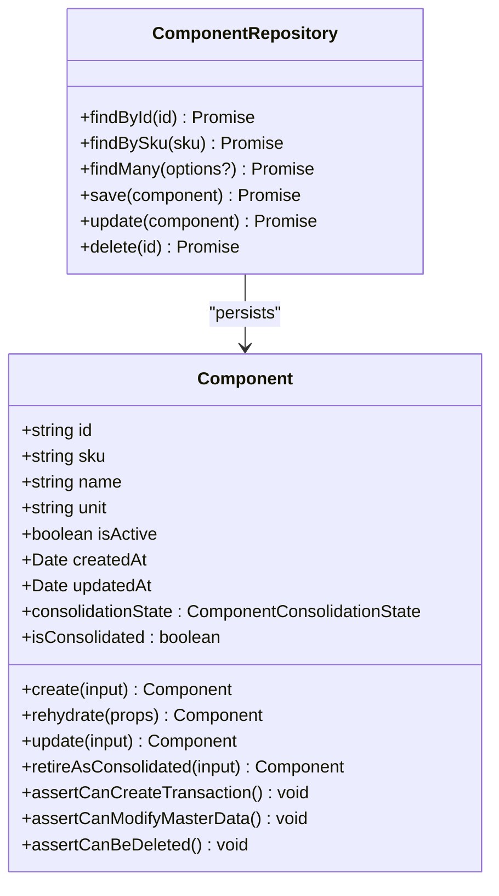
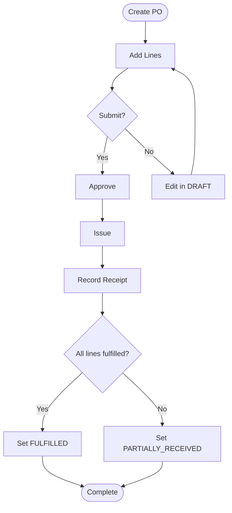
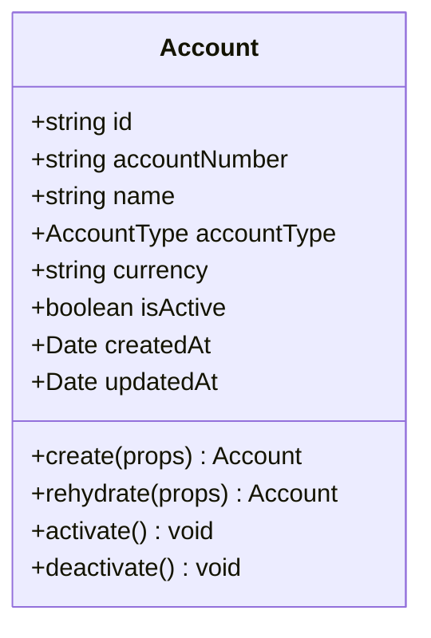
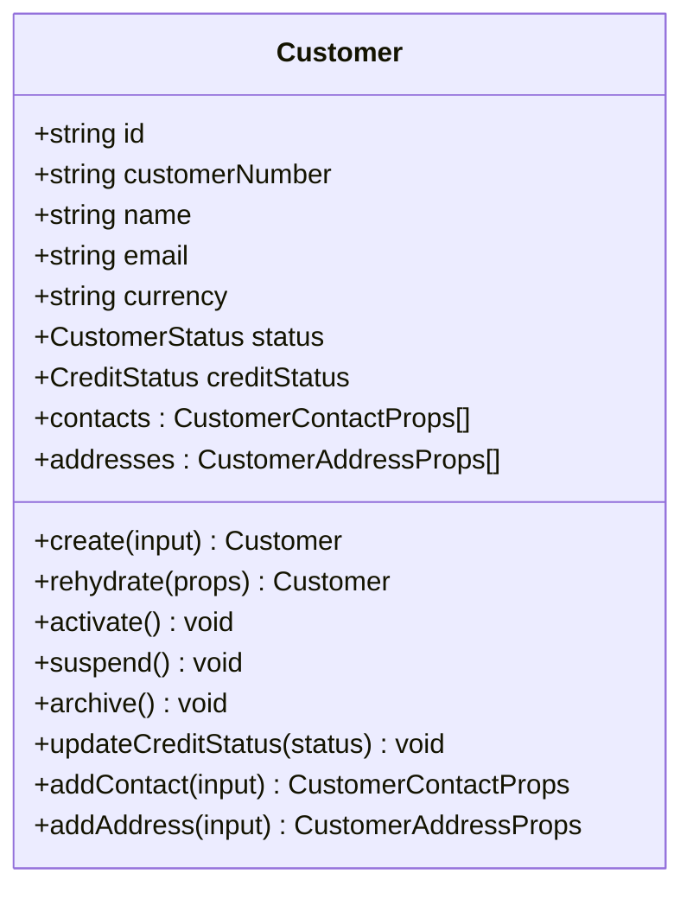
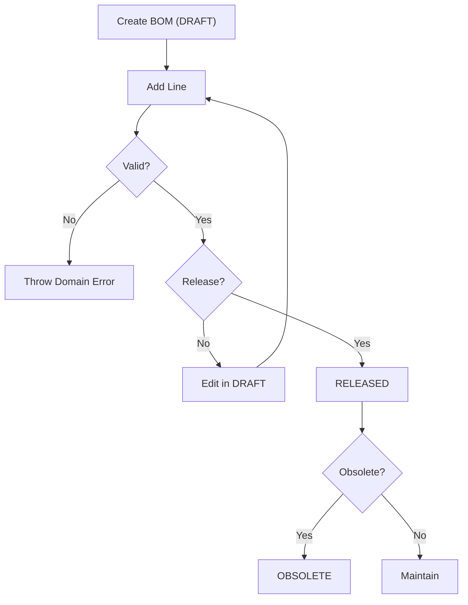
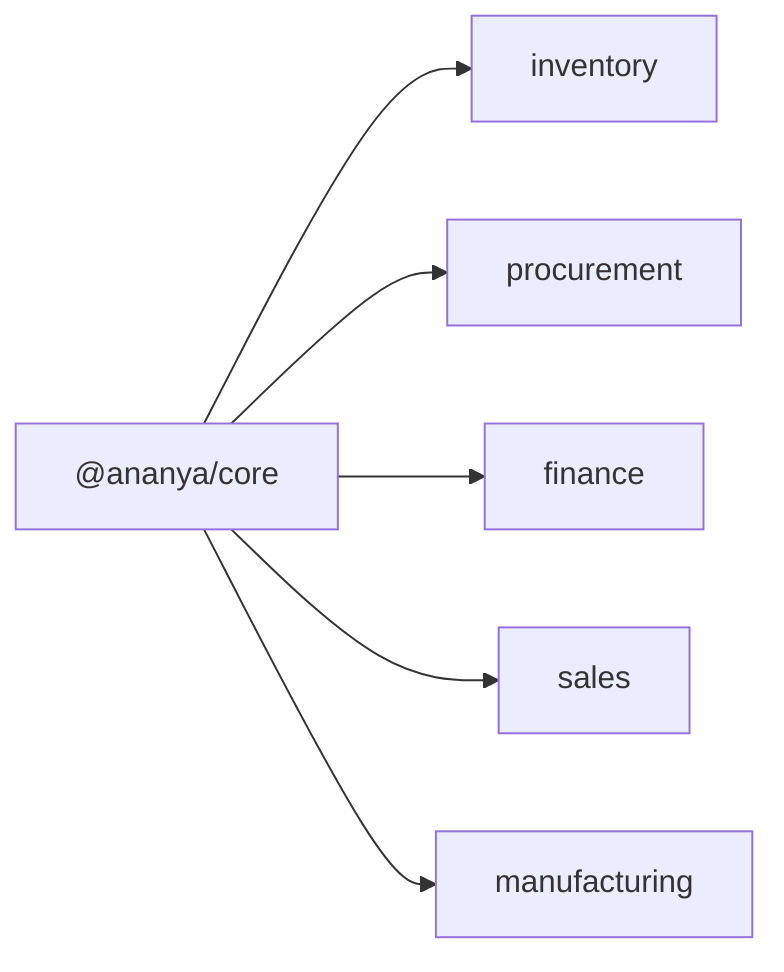

# Domain Architecture

<cite>
**Referenced Files in This Document**
- [DDD.md](file://docs/architecture/DDD.md)
- [ARCHITECTURE.md](file://docs/architecture/ARCHITECTURE.md)
- [PROJECT_STRUCTURE.md](file://docs/architecture/PROJECT_STRUCTURE.md)
- [NEW_PACKAGE.md](file://docs/standards/NEW_PACKAGE.md)
- [component.ts](file://packages/inventory/src/components/component.ts)
- [component.repository.ts](file://packages/inventory/src/components/component.repository.ts)
- [purchase-order.ts](file://packages/procurement/src/purchase-orders/purchase-order.ts)
- [account.ts](file://packages/finance/src/accounts/account.ts)
- [customer.ts](file://packages/sales/src/customers/customer.ts)
- [bill-of-materials.ts](file://packages/manufacturing/src/boms/bill-of-materials.ts)
- [index.ts (core errors)](file://packages/core/src/errors/index.ts)
</cite>

## Table of Contents
1. Introduction
2. Project Structure
3. Core Components
4. Architecture Overview
5. Detailed Component Analysis
6. Dependency Analysis
7. Performance Considerations
8. Troubleshooting Guide
9. Conclusion
10. Appendices

## Introduction
This document explains how Ananya ERP implements Domain-Driven Design across its domain packages. It focuses on how business domains are encapsulated as independent packages, how each package contains entities, value objects, and domain services, and how infrastructure concerns are separated from business logic. It also documents communication patterns between domains, shared abstractions, versioning guidance, testing strategies, and development workflows grounded in the repository’s standards.

## Project Structure
Ananya follows a modular monolith architecture where business capabilities are implemented as independent domain modules within a single deployable application. The layered design places Web/Mobile/CLI at the top, then API, then Domain Packages, then Repository Interfaces, and finally Infrastructure (Database, External Services). Dependencies always point downward; business logic never depends on infrastructure.

**Diagram sources**
- [ARCHITECTURE.md:33-58](file://docs/architecture/ARCHITECTURE.md#L33-L58)

Key structural rules:
- Domain packages own business rules, invariants, aggregate lifecycles, identity, timestamps, and ubiquitous language.
- Application orchestrates use cases, coordinates repositories, calls domain behavior, and contains no business rules or persistence logic.
- Infrastructure provides persistence, mapping, messaging, and external service integration without leaking into the domain.

**Section sources**
- [ARCHITECTURE.md:17-58](file://docs/architecture/ARCHITECTURE.md#L17-L58)
- [PROJECT_STRUCTURE.md:155-168](file://docs/architecture/PROJECT_STRUCTURE.md#L155-L168)

## Core Components
Each domain package exposes rich aggregates with explicit creation and rehydration paths, along with repository interfaces that abstract persistence.

- Inventory domain: components, categories, manufacturers, units, locations, batches, serials, reservations, ledger, projections.
- Procurement domain: suppliers, purchase orders, goods receipts, purchase invoices, policies.
- Finance domain: accounts, journals, payables, receivables, payments, banking.
- Sales domain: customers, quotations, sales orders, fulfillment, returns.
- Manufacturing domain: BOMs, production orders, material consumptions, finished goods receipts, traceability.

Common patterns:
- Aggregates expose create() for new instances and rehydrate() for loading persisted state.
- Aggregates enforce invariants via methods and guards.
- Repository interfaces define findById, findByUnique/findMany, save, update, delete.
- Domain errors represent business rule violations; infrastructure errors are separate.

**Section sources**
- [DDD.md:28-58](file://docs/architecture/DDD.md#L28-L58)
- [DDD.md:80-126](file://docs/architecture/DDD.md#L80-L126)
- [DDD.md:128-172](file://docs/architecture/DDD.md#L128-L172)
- [DDD.md:263-290](file://docs/architecture/DDD.md#L263-L290)

## Architecture Overview
The system enforces strict separation between domain and infrastructure. Domain packages define contracts (repository interfaces), while infrastructure provides implementations (e.g., Drizzle-based repositories). This inversion keeps persistence replaceable and allows multiple clients to share the same domain.

**Diagram sources**
- [ARCHITECTURE.md:33-58](file://docs/architecture/ARCHITECTURE.md#L33-L58)
- [ARCHITECTURE.md:84-100](file://docs/architecture/ARCHITECTURE.md#L84-L100)

## Detailed Component Analysis

### Inventory Domain: Component Aggregate
The Component aggregate encapsulates master data lifecycle, consolidation state, and transaction safety. It owns identity generation, timestamps, normalization, and invariants. Methods guard against editing consolidated records and prevent transactions on retired components.

**Diagram sources**
- [component.ts:77-321](file://packages/inventory/src/components/component.ts#L77-L321)
- [component.repository.ts:4-10](file://packages/inventory/src/components/component.repository.ts#L4-L10)

Key behaviors:
- Creation validates SKU, name, unit; generates id and timestamps.
- Update preserves invariants and prevents edits when consolidated.
- Retirement sets consolidation state and blocks further transactions.
- Guards ensure consolidated components cannot be edited or deleted.

**Section sources**
- [component.ts:117-155](file://packages/inventory/src/components/component.ts#L117-L155)
- [component.ts:174-218](file://packages/inventory/src/components/component.ts#L174-L218)
- [component.ts:232-265](file://packages/inventory/src/components/component.ts#L232-L265)
- [component.ts:275-314](file://packages/inventory/src/components/component.ts#L275-L314)
- [component.ts:317-321](file://packages/inventory/src/components/component.ts#L317-L321)
- [component.repository.ts:4-10](file://packages/inventory/src/components/component.repository.ts#L4-L10)

### Procurement Domain: Purchase Order Aggregate
PurchaseOrder manages order lifecycle transitions, line management, totals recalculation, and receipt recording. It enforces status transitions and validates line quantities.

**Diagram sources**
- [purchase-order.ts:122-145](file://packages/procurement/src/purchase-orders/purchase-order.ts#L122-L145)
- [purchase-order.ts:163-174](file://packages/procurement/src/purchase-orders/purchase-order.ts#L163-L174)
- [purchase-order.ts:184-215](file://packages/procurement/src/purchase-orders/purchase-order.ts#L184-L215)
- [purchase-order.ts:217-243](file://packages/procurement/src/purchase-orders/purchase-order.ts#L217-L243)
- [purchase-order.ts:245-253](file://packages/procurement/src/purchase-orders/purchase-order.ts#L245-L253)
- [purchase-order.ts:255-269](file://packages/procurement/src/purchase-orders/purchase-order.ts#L255-L269)

Key behaviors:
- Creation initializes defaults and starts in DRAFT.
- Line addition validates quantity and computes line total.
- Status transitions enforced by methods; invalid transitions throw domain errors.
- Totals recalculated after line changes.

**Section sources**
- [purchase-order.ts:122-145](file://packages/procurement/src/purchase-orders/purchase-order.ts#L122-L145)
- [purchase-order.ts:184-215](file://packages/procurement/src/purchase-orders/purchase-order.ts#L184-L215)
- [purchase-order.ts:217-253](file://packages/procurement/src/purchase-orders/purchase-order.ts#L217-L253)
- [purchase-order.ts:255-269](file://packages/procurement/src/purchase-orders/purchase-order.ts#L255-L269)

### Finance Domain: Account Aggregate
Account models chart-of-accounts entries with type hierarchy and lifecycle controls. It validates required fields during creation and supports activation/deactivation.

**Diagram sources**
- [account.ts:26-84](file://packages/finance/src/accounts/account.ts#L26-L84)

Key behaviors:
- Creation validates account number and name; sets default currency and active state.
- Activation/deactivation toggles status and updates timestamp.

**Section sources**
- [account.ts:49-69](file://packages/finance/src/accounts/account.ts#L49-L69)
- [account.ts:75-83](file://packages/finance/src/accounts/account.ts#L75-L83)

### Sales Domain: Customer Aggregate
Customer manages customer lifecycle, credit status, contacts, and addresses. It enforces constraints such as not activating archived customers and maintaining primary/default flags consistently.

**Diagram sources**
- [customer.ts:59-198](file://packages/sales/src/customers/customer.ts#L59-L198)

Key behaviors:
- Creation normalizes identifiers and sets defaults.
- Lifecycle methods enforce valid transitions (e.g., archive prevents activation).
- Contact/address additions maintain primary/default invariants.

**Section sources**
- [customer.ts:90-107](file://packages/sales/src/customers/customer.ts#L90-L107)
- [customer.ts:113-134](file://packages/sales/src/customers/customer.ts#L113-L134)
- [customer.ts:136-198](file://packages/sales/src/customers/customer.ts#L136-L198)

### Manufacturing Domain: Bill of Materials Aggregate
BillOfMaterials defines product structure with revision control, line management, and release/obsolescence workflow. It enforces immutability once released and prevents circular dependencies and duplicate lines.

**Diagram sources**
- [bill-of-materials.ts:74-89](file://packages/manufacturing/src/boms/bill-of-materials.ts#L74-L89)
- [bill-of-materials.ts:99-136](file://packages/manufacturing/src/boms/bill-of-materials.ts#L99-L136)
- [bill-of-materials.ts:160-187](file://packages/manufacturing/src/boms/bill-of-materials.ts#L160-L187)
- [bill-of-materials.ts:209-271](file://packages/manufacturing/src/boms/bill-of-materials.ts#L209-L271)
- [bill-of-materials.ts:315-333](file://packages/manufacturing/src/boms/bill-of-materials.ts#L315-L333)

Key behaviors:
- Creation sets initial revision and DRAFT status.
- Line operations validate quantities, scrap factors, and prevent duplicates/circular references.
- Release locks edits; obsolete transitions require prior release.

**Section sources**
- [bill-of-materials.ts:74-89](file://packages/manufacturing/src/boms/bill-of-materials.ts#L74-L89)
- [bill-of-materials.ts:99-136](file://packages/manufacturing/src/boms/bill-of-materials.ts#L99-L136)
- [bill-of-materials.ts:160-187](file://packages/manufacturing/src/boms/bill-of-materials.ts#L160-L187)
- [bill-of-materials.ts:209-271](file://packages/manufacturing/src/boms/bill-of-materials.ts#L209-L271)
- [bill-of-materials.ts:315-333](file://packages/manufacturing/src/boms/bill-of-materials.ts#L315-L333)

## Dependency Analysis
Domain packages depend only on shared core abstractions (e.g., ObjectId, domain errors) and never on infrastructure frameworks. Repository interfaces are defined within domain packages; infrastructure provides concrete implementations outside the domain.

**Diagram sources**
- [component.ts:1-9](file://packages/inventory/src/components/component.ts#L1-L9)
- [purchase-order.ts:1-6](file://packages/procurement/src/purchase-orders/purchase-order.ts#L1-L6)
- [account.ts:1-1](file://packages/finance/src/accounts/account.ts#L1-L1)
- [customer.ts:1-1](file://packages/sales/src/customers/customer.ts#L1-L1)
- [bill-of-materials.ts:1-9](file://packages/manufacturing/src/boms/bill-of-materials.ts#L1-L9)
- [index.ts (core errors):1-4](file://packages/core/src/errors/index.ts#L1-L4)

Observations:
- All aggregates import identity generation and error types from @ananya/core.
- Domain packages remain framework-independent (no NestJS/Next.js/Drizzle imports).
- Repository interfaces are co-located with aggregates to keep boundaries clear.

**Section sources**
- [ARCHITECTURE.md:62-80](file://docs/architecture/ARCHITECTURE.md#L62-L80)
- [ARCHITECTURE.md:84-100](file://docs/architecture/ARCHITECTURE.md#L84-L100)

## Performance Considerations
- Keep domain logic pure and fast; avoid I/O in aggregates.
- Use repository findMany with options to minimize over-fetching.
- Prefer immutable updates in aggregates to reduce side effects and simplify caching.
- Defer heavy computations (e.g., projections) to background processes where appropriate.
[No sources needed since this section provides general guidance]

## Troubleshooting Guide
Common issues and resolutions:
- Business rule violations: thrown as domain errors (e.g., InvalidComponentSkuError, InvalidPoStatusTransitionError). Inspect aggregate methods and their guards.
- Infrastructure failures: database/network errors should not be conflated with domain errors; handle separately in infrastructure layers.
- Identity/time ownership: ensure aggregates generate IDs and timestamps; repositories must not create them.
- State transitions: verify allowed transitions in aggregates (e.g., PO status, BOM release).

**Section sources**
- [DDD.md:263-290](file://docs/architecture/DDD.md#L263-L290)
- [component.ts:117-155](file://packages/inventory/src/components/component.ts#L117-L155)
- [purchase-order.ts:217-253](file://packages/procurement/src/purchase-orders/purchase-order.ts#L217-L253)
- [bill-of-materials.ts:315-333](file://packages/manufacturing/src/boms/bill-of-materials.ts#L315-L333)
- [index.ts (core errors):1-4](file://packages/core/src/errors/index.ts#L1-L4)

## Conclusion
Ananya’s DDD implementation centers the domain model, isolates business rules in aggregates, and uses repository interfaces to abstract infrastructure. Each domain package encapsulates its bounded context with clear boundaries, consistent lifecycle methods, and strong invariants. This structure supports long-term evolution, testability, and multi-client reuse while keeping infrastructure replaceable.

## Appendices

### Domain Package Communication Patterns
- Direct calls between domains should be minimized; prefer application services to orchestrate cross-domain workflows.
- When cross-domain events are necessary, emit domain events from aggregates and handle them in application or infrastructure layers to preserve loose coupling.
- Shared abstractions (ObjectId, domain errors) reside in @ananya/core to avoid duplication.

[No sources needed since this section provides general guidance]

### Versioning Strategy
- Domain packages follow workspace conventions: added to pnpm-workspace.yaml, versioned in package.json, with public APIs reviewed via index.ts exports.
- Changes to repository contracts or aggregate responsibilities require careful review due to their impact across applications.

**Section sources**
- [NEW_PACKAGE.md:3-31](file://docs/standards/NEW_PACKAGE.md#L3-L31)
- [AI_AGENT_GUIDE.md:84-123](file://docs/architecture/AI_AGENT_GUIDE.md#L84-L123)

### Testing Strategies
- Unit tests for aggregates validate invariants and lifecycle transitions.
- Integration tests exercise repository implementations against real storage.
- E2E tests cover end-to-end workflows across API and UI layers.

[No sources needed since this section provides general guidance]

### Development Workflows
- New features belong in domain packages; do not originate business logic in UI or API.
- Follow DDD standard before implementing domain changes; resolve conflicts with architecture first.
- Use RFCs for long-term architectural decisions.

**Section sources**
- [PROJECT_STRUCTURE.md:161-168](file://docs/architecture/PROJECT_STRUCTURE.md#L161-L168)
- [AI_AGENT_GUIDE.md:112-123](file://docs/architecture/AI_AGENT_GUIDE.md#L112-L123)
- [ARCHITECTURE.md:128-136](file://docs/architecture/ARCHITECTURE.md#L128-L136)