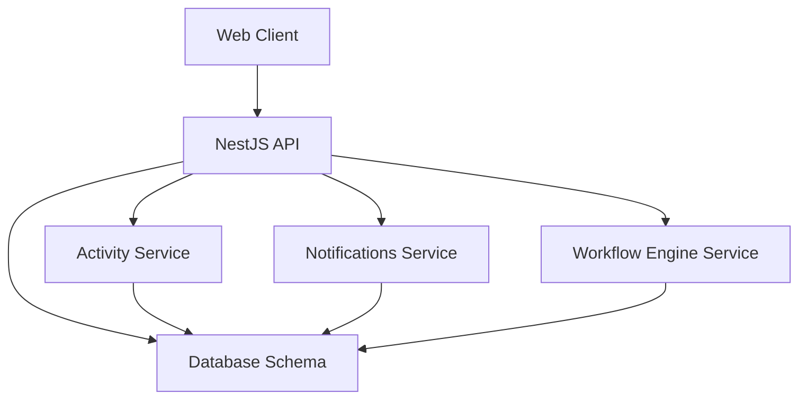
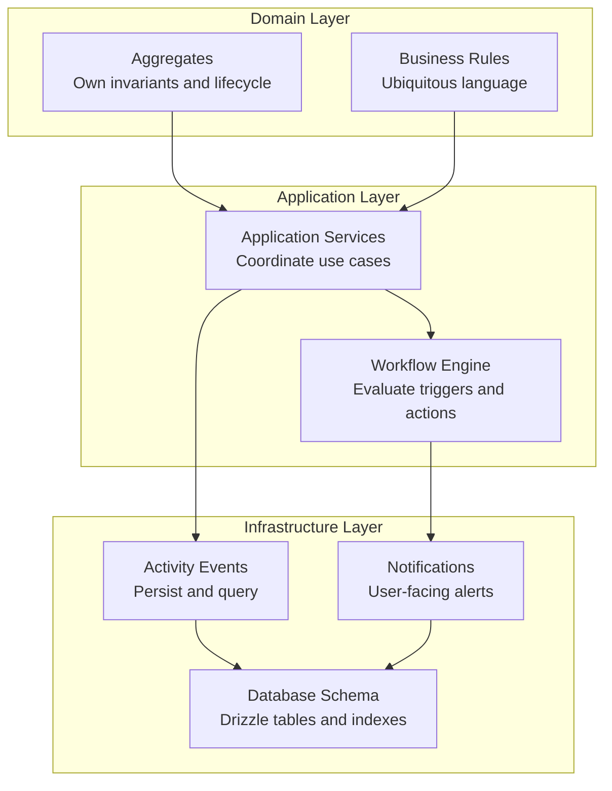
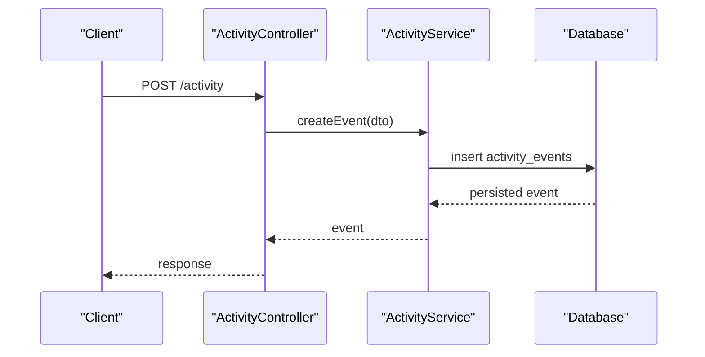
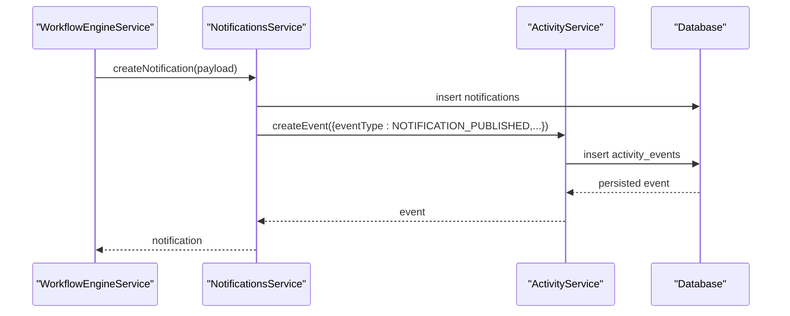
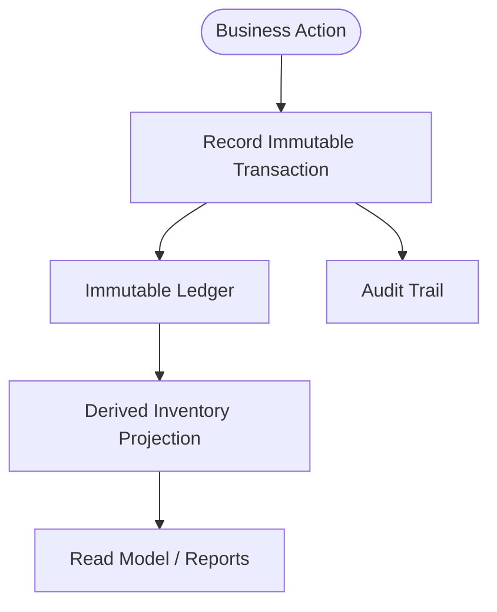
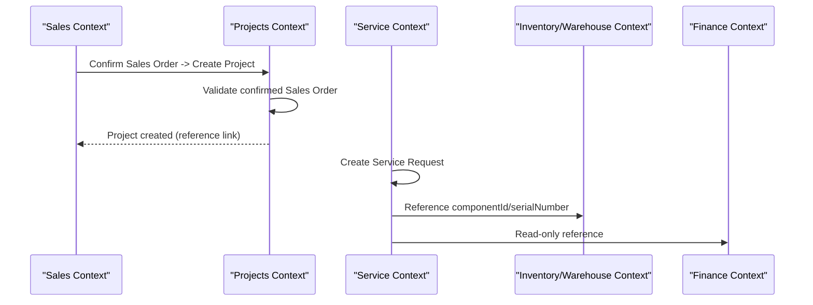
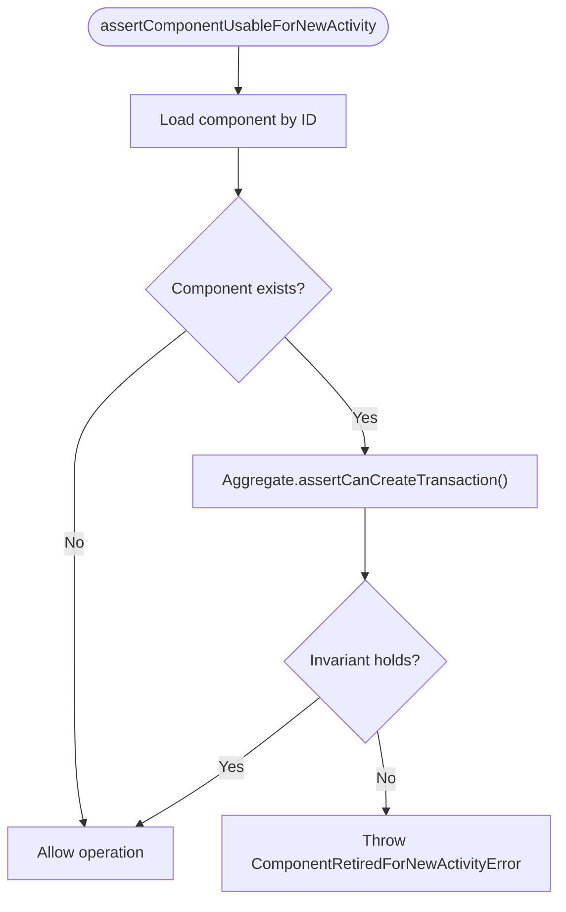
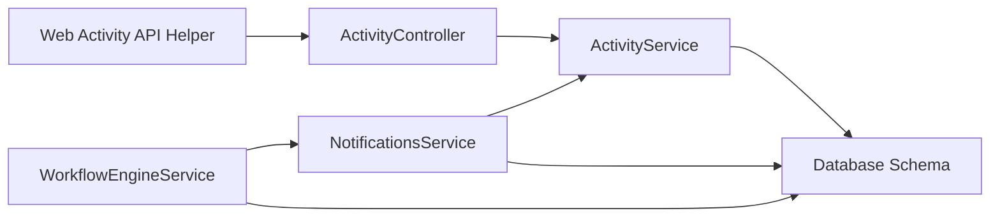

# Domain Interactions & Events

<cite>
**Referenced Files in This Document**
- [DDD.md](file://docs/architecture/DDD.md)
- [0003-inventory-ledger.md](file://docs/rfcs/0003-inventory-ledger.md)
- [0005-transaction-types.md](file://docs/rfcs/0005-transaction-types.md)
- [0045-project-integration.md](file://docs/rfcs/0045-project-integration.md)
- [0050-service-integration.md](file://docs/rfcs/0050-service-integration.md)
- [activity.service.ts](file://apps/api/src/activity/activity.service.ts)
- [activity.controller.ts](file://apps/api/src/activity/activity.controller.ts)
- [dtos.ts](file://apps/api/src/activity/dtos.ts)
- [activity.ts](file://packages/database/src/schema/activity.ts)
- [notifications.service.ts](file://apps/api/src/notifications/notifications.service.ts)
- [workflow-engine.service.ts](file://apps/api/src/notifications/workflow-engine.service.ts)
- [component-lifecycle.guard.ts](file://apps/api/src/components/component-lifecycle.guard.ts)
- [activity-api.ts](file://apps/web/lib/api/activity-api.ts)
</cite>

## Table of Contents
1. [Introduction](#introduction)
2. [Project Structure](#project-structure)
3. [Core Components](#core-components)
4. [Architecture Overview](#architecture-overview)
5. [Detailed Component Analysis](#detailed-component-analysis)
6. [Dependency Analysis](#dependency-analysis)
7. [Performance Considerations](#performance-considerations)
8. [Troubleshooting Guide](#troubleshooting-guide)
9. [Conclusion](#conclusion)
10. [Appendices](#appendices)

## Introduction
This document explains how domains interact and communicate through events, message-like patterns, and API contracts in Ananya ERP. It focuses on:
- How bounded contexts coordinate without direct cross-context mutations.
- The event schema used for activity and audit logging.
- Event-driven inventory modeling and immutable transaction history.
- Workflow orchestration that triggers notifications and logs execution.
- Practical inter-domain communication patterns visible in the codebase.
- Consistency mechanisms, versioning considerations, and debugging techniques.

The repository follows Domain-Driven Design principles, where domain logic owns invariants, application services coordinate use cases, and infrastructure adapts persistence and external concerns. Inventory is modeled as an event-based ledger with immutable transactions and derived projections.

## Project Structure
At a high level, domain interactions are implemented inside the NestJS API application, while shared schemas and domain concepts live in packages and documentation. Key areas:
- Activity and audit event persistence under `apps/api/src/activity`.
- Notification creation and workflow evaluation under `apps/api/src/notifications`.
- Database schema definitions under `packages/database/src/schema`.
- Web client helpers for querying activity events under `apps/web/lib/api`.
- DDD and RFC documents describing event-based design and cross-context boundaries.

**Diagram sources**
- [activity.service.ts:1-136](file://apps/api/src/activity/activity.service.ts#L1-L136)
- [notifications.service.ts:1-238](file://apps/api/src/notifications/notifications.service.ts#L1-L238)
- [workflow-engine.service.ts:1-147](file://apps/api/src/notifications/workflow-engine.service.ts#L1-L147)
- [activity.ts:1-47](file://packages/database/src/schema/activity.ts#L1-L47)

**Section sources**
- [DDD.md:1-59](file://docs/architecture/DDD.md#L1-L59)
- [activity.service.ts:1-136](file://apps/api/src/activity/activity.service.ts#L1-L136)
- [notifications.service.ts:1-238](file://apps/api/src/notifications/notifications.service.ts#L1-L238)
- [workflow-engine.service.ts:1-147](file://apps/api/src/notifications/workflow-engine.service.ts#L1-L147)
- [activity.ts:1-47](file://packages/database/src/schema/activity.ts#L1-L47)

## Core Components
- Activity service: persists and queries activity events; enriches context such as user identity and IP address.
- Notifications service: creates notifications and publishes activity events to record notification lifecycle.
- Workflow engine service: evaluates configured workflows against trigger data and executes actions like creating notifications.
- Activity database schema: defines the event table structure and indexes for efficient querying.
- Web activity API helper: exposes endpoints for listing and filtering activity events from the frontend.

These components implement a lightweight event-audit pattern rather than a full distributed event bus. Cross-domain coordination uses explicit service calls and reference identifiers, not direct database mutations across contexts.

**Section sources**
- [activity.service.ts:1-136](file://apps/api/src/activity/activity.service.ts#L1-L136)
- [notifications.service.ts:1-238](file://apps/api/src/notifications/notifications.service.ts#L1-L238)
- [workflow-engine.service.ts:1-147](file://apps/api/src/notifications/workflow-engine.service.ts#L1-L147)
- [activity.ts:1-47](file://packages/database/src/schema/activity.ts#L1-L47)
- [activity-api.ts:33-67](file://apps/web/lib/api/activity-api.ts#L33-L67)

## Architecture Overview
Ananya’s architecture emphasizes:
- Domain ownership of business rules and invariants.
- Application services coordinating repositories and domain behavior.
- Infrastructure handling persistence, mapping, and external services.
- Event-based inventory modeling with immutable transactions and derived projections.

**Diagram sources**
- [DDD.md:28-59](file://docs/architecture/DDD.md#L28-L59)
- [activity.service.ts:1-136](file://apps/api/src/activity/activity.service.ts#L1-L136)
- [notifications.service.ts:1-238](file://apps/api/src/notifications/notifications.service.ts#L1-L238)
- [workflow-engine.service.ts:1-147](file://apps/api/src/notifications/workflow-engine.service.ts#L1-L147)
- [activity.ts:1-47](file://packages/database/src/schema/activity.ts#L1-L47)

## Detailed Component Analysis

### Activity Events: Schema, DTOs, Controller, and Service
The activity subsystem provides a consistent way to record operational events across modules.

- Schema:
  - Defines fields such as event type, module, entity type and ID, description, user information, status, severity, href, IP address, metadata, and timestamps.
  - Includes indexes for module, entity type, entity ID, user ID, event type, and created time.

- DTOs:
  - CreateActivityEventDto validates required fields like eventType, module, entityType, entityId, and description, with optional user and metadata fields.
  - QueryActivityEventsDto supports filtering by module, eventType, entityType, entityId, userId, severity, search term, and limit.

- Controller:
  - Exposes endpoints to create events, list events, get audit trails, retrieve entity-specific events, and retrieve user-specific events.

- Service:
  - Enriches incoming events with request context (user ID, email, IP).
  - Persists events into the activity_events table.
  - Provides query methods for filtering and pagination.

**Diagram sources**
- [activity.controller.ts:1-36](file://apps/api/src/activity/activity.controller.ts#L1-L36)
- [activity.service.ts:1-136](file://apps/api/src/activity/activity.service.ts#L1-L136)
- [activity.ts:1-47](file://packages/database/src/schema/activity.ts#L1-L47)

**Section sources**
- [activity.ts:1-47](file://packages/database/src/schema/activity.ts#L1-L47)
- [dtos.ts:1-88](file://apps/api/src/activity/dtos.ts#L1-L88)
- [activity.controller.ts:1-36](file://apps/api/src/activity/activity.controller.ts#L1-L36)
- [activity.service.ts:1-136](file://apps/api/src/activity/activity.service.ts#L1-L136)

### Notifications and Activity Event Publishing
Notifications are created via the notifications service, which also publishes an activity event to record the notification lifecycle.

- Notifications service:
  - Resolves user identity safely.
  - Creates a notification record.
  - Publishes an activity event with module, entity type, entity ID, event type, description, severity, status, and metadata.

- Workflow engine service:
  - Evaluates active workflows matching a trigger type.
  - Executes actions such as creating notifications.
  - Logs execution details and outcomes.

**Diagram sources**
- [notifications.service.ts:34-72](file://apps/api/src/notifications/notifications.service.ts#L34-L72)
- [activity.service.ts:10-37](file://apps/api/src/activity/activity.service.ts#L10-L37)
- [workflow-engine.service.ts:102-124](file://apps/api/src/notifications/workflow-engine.service.ts#L102-L124)

**Section sources**
- [notifications.service.ts:1-238](file://apps/api/src/notifications/notifications.service.ts#L1-L238)
- [workflow-engine.service.ts:1-147](file://apps/api/src/notifications/workflow-engine.service.ts#L1-L147)
- [activity.service.ts:1-136](file://apps/api/src/activity/activity.service.ts#L1-L136)

### Event-Based Inventory Modeling and Transaction Types
Inventory is modeled as an event-based ledger:
- Transactions are immutable and represent business events.
- Inventory is derived from the complete history of transactions.
- History is never rewritten; corrections are compensating transactions.
- Canonical transaction types provide stable reporting and analytics.

**Diagram sources**
- [0003-inventory-ledger.md:175-218](file://docs/rfcs/0003-inventory-ledger.md#L175-L218)
- [0005-transaction-types.md:227-286](file://docs/rfcs/0005-transaction-types.md#L227-L286)

**Section sources**
- [0003-inventory-ledger.md:175-260](file://docs/rfcs/0003-inventory-ledger.md#L175-L260)
- [0005-transaction-types.md:227-286](file://docs/rfcs/0005-transaction-types.md#L227-L286)

### Cross-Domain Orchestration and Saga Patterns
Cross-domain workflows avoid direct mutations between contexts:
- Projects integration references Sales Order IDs without mutating Sales or other domains.
- Service integration references Customer, Sales Order, Project, Inventory, Warehouse, and Finance entities only as primitive UUID strings.
- State transitions are documented and enforced at the aggregate level.

**Diagram sources**
- [0045-project-integration.md:1-56](file://docs/rfcs/0045-project-integration.md#L1-L56)
- [0050-service-integration.md:52-89](file://docs/rfcs/0050-service-integration.md#L52-L89)

**Section sources**
- [0045-project-integration.md:1-56](file://docs/rfcs/0045-project-integration.md#L1-L56)
- [0050-service-integration.md:52-89](file://docs/rfcs/0050-service-integration.md#L52-L89)

### Retired Component Guard and Domain Invariants
A guard prevents new operational activity on retired (consolidated) components:
- It reads the component via a repository.
- If present, it delegates to the aggregate’s invariant check.
- On violation, it throws a domain-aware error preserving the original cause.

**Diagram sources**
- [component-lifecycle.guard.ts:1-67](file://apps/api/src/components/component-lifecycle.guard.ts#L1-L67)

**Section sources**
- [component-lifecycle.guard.ts:1-67](file://apps/api/src/components/component-lifecycle.guard.ts#L1-L67)

## Dependency Analysis
Key dependencies and relationships:
- Activity controller depends on ActivityService.
- NotificationsService depends on ActivityService to publish activity events.
- WorkflowEngineService depends on NotificationsService to execute CREATE_NOTIFICATION actions.
- All services depend on the database schema layer for persistence.
- Web client depends on API endpoints exposed by the activity controller.

**Diagram sources**
- [activity.controller.ts:1-36](file://apps/api/src/activity/activity.controller.ts#L1-L36)
- [activity.service.ts:1-136](file://apps/api/src/activity/activity.service.ts#L1-L136)
- [notifications.service.ts:1-238](file://apps/api/src/notifications/notifications.service.ts#L1-L238)
- [workflow-engine.service.ts:1-147](file://apps/api/src/notifications/workflow-engine.service.ts#L1-L147)
- [activity-api.ts:33-67](file://apps/web/lib/api/activity-api.ts#L33-L67)

**Section sources**
- [activity.controller.ts:1-36](file://apps/api/src/activity/activity.controller.ts#L1-L36)
- [activity.service.ts:1-136](file://apps/api/src/activity/activity.service.ts#L1-L136)
- [notifications.service.ts:1-238](file://apps/api/src/notifications/notifications.service.ts#L1-L238)
- [workflow-engine.service.ts:1-147](file://apps/api/src/notifications/workflow-engine.service.ts#L1-L147)
- [activity-api.ts:33-67](file://apps/web/lib/api/activity-api.ts#L33-L67)

## Performance Considerations
- Indexing strategy:
  - Activity events include multiple indexes (module, entity type, entity ID, user ID, event type, created_at) to support common queries and audit lookups.
- Pagination and limits:
  - Activity queries enforce limits to prevent large result sets.
- Defensive payload reading:
  - Payload readers validate JSONB fields defensively to avoid runtime errors when producers supply unexpected shapes.

Recommendations:
- Keep event payloads minimal and structured.
- Use targeted filters (module, entityType, entityId) to leverage indexes.
- Monitor query performance and adjust indexes as usage patterns evolve.

**Section sources**
- [activity.ts:12-43](file://packages/database/src/schema/activity.ts#L12-L43)
- [activity.service.ts:39-81](file://apps/api/src/activity/activity.service.ts#L39-L81)
- [attribute-audit-normalizer.ts:669-696](file://apps/api/src/ml/attribute-findings/attribute-audit-normalizer.ts#L669-L696)

## Troubleshooting Guide
Common issues and debugging techniques:
- Missing or invalid user context:
  - ActivityService resolves user identity from request context; ensure upstream context is set correctly.
- Notification publishing failures:
  - Verify NotificationsService.createNotification succeeds before activity event publication.
- Workflow evaluation logs:
  - WorkflowEngineService records step-by-step logs for each rule evaluation and action execution.
- Retired component selection:
  - If operations fail due to consolidated components, inspect the guard error and identify the surviving component ID.

Practical steps:
- Query activity events by module, eventType, entityType, entityId, userId, severity, and search terms.
- Retrieve entity-specific or user-specific event timelines.
- Inspect workflow execution logs to understand why a rule passed or failed.
- Handle ComponentRetiredForNewActivityError by redirecting operators to the surviving component.

**Section sources**
- [activity.service.ts:10-37](file://apps/api/src/activity/activity.service.ts#L10-L37)
- [notifications.service.ts:34-72](file://apps/api/src/notifications/notifications.service.ts#L34-L72)
- [workflow-engine.service.ts:74-144](file://apps/api/src/notifications/workflow-engine.service.ts#L74-L144)
- [component-lifecycle.guard.ts:22-67](file://apps/api/src/components/component-lifecycle.guard.ts#L22-L67)
- [activity-api.ts:33-67](file://apps/web/lib/api/activity-api.ts#L33-L67)

## Conclusion
Ananya ERP implements a pragmatic event-driven approach:
- Activity events provide a unified audit trail across modules.
- Notifications integrate with activity events to record user-facing lifecycle changes.
- Workflow evaluation orchestrates automated actions and logs execution details.
- Inventory modeling follows an immutable event ledger with derived projections.
- Cross-domain coordination uses explicit service calls and reference identifiers, avoiding direct cross-context mutations.

While there is no full distributed event bus in the analyzed code, the patterns shown—event schemas, activity logging, workflow orchestration, and strict domain invariants—provide a solid foundation for scaling toward more advanced event sourcing and saga orchestration if needed.

[No sources needed since this section summarizes without analyzing specific files]

## Appendices

### Event Schema Definition Summary
- Fields:
  - eventType, module, entityType, entityId, entityTitle, description
  - userId, userName, userEmail
  - status, severity, href, ipAddress
  - metadata (JSONB), createdAt
- Indexes:
  - module, entityType, entityId, userId, eventType, createdAt

**Section sources**
- [activity.ts:12-43](file://packages/database/src/schema/activity.ts#L12-L43)

### API Contracts for Activity Events
- Endpoints:
  - POST /activity: create event
  - GET /activity: list events with filters
  - GET /activity/audit: audit trail
  - GET /activity/entity/:type/:id: entity timeline
  - GET /activity/user/:id: user timeline

**Section sources**
- [activity.controller.ts:1-36](file://apps/api/src/activity/activity.controller.ts#L1-L36)

### Event Versioning and Backward Compatibility
Guidelines:
- Treat event payloads as evolving contracts; add new fields optionally.
- Readers should be defensive when parsing JSONB payloads.
- Maintain canonical event types and avoid changing their semantics.
- Prefer compensating transactions over editing immutable history.

**Section sources**
- [0003-inventory-ledger.md:175-218](file://docs/rfcs/0003-inventory-ledger.md#L175-L218)
- [0005-transaction-types.md:227-286](file://docs/rfcs/0005-transaction-types.md#L227-L286)
- [attribute-audit-normalizer.ts:669-696](file://apps/api/src/ml/attribute-findings/attribute-audit-normalizer.ts#L669-L696)