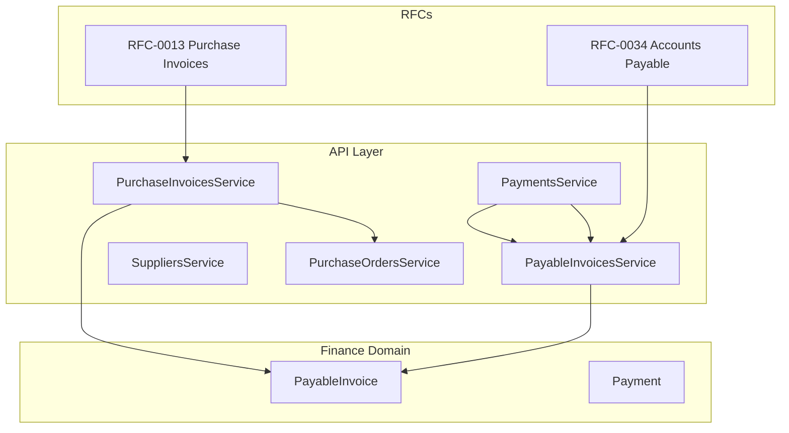
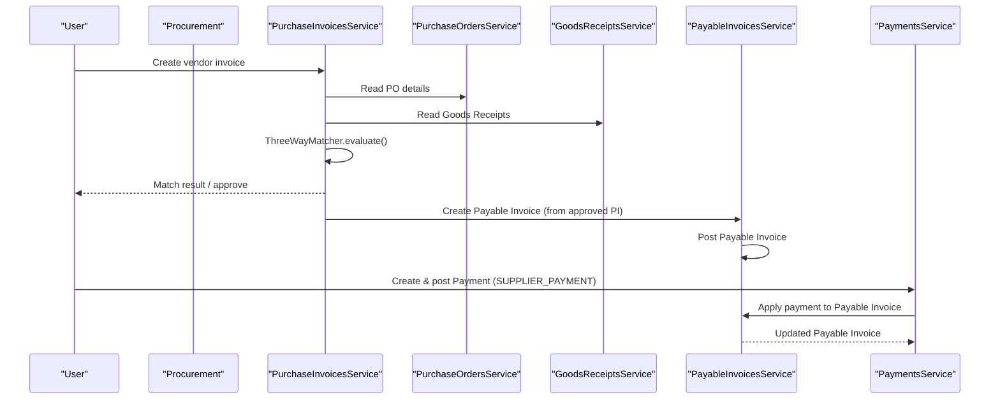
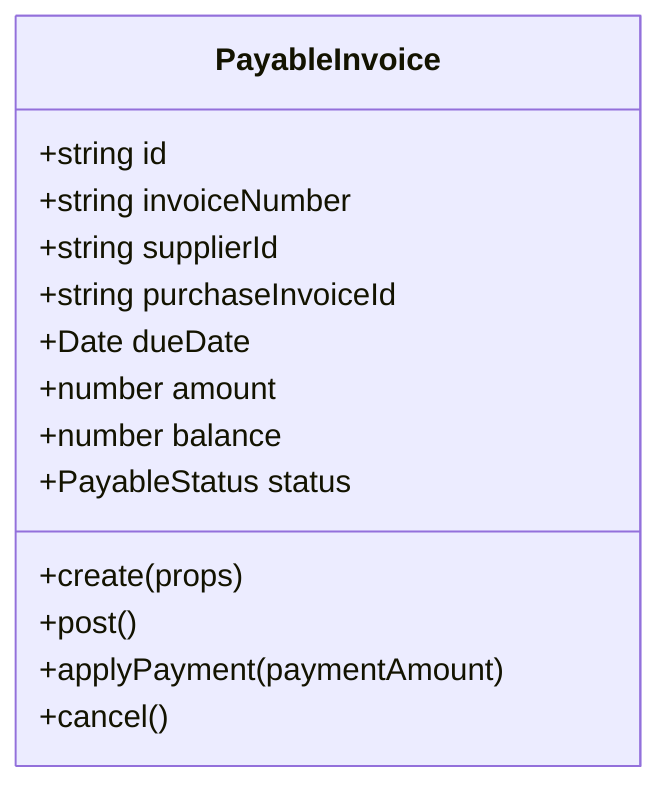
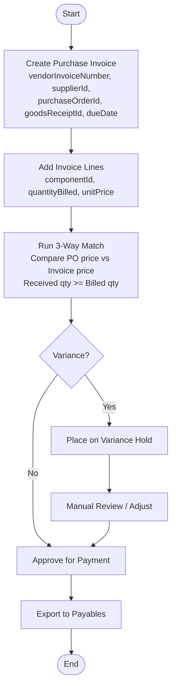
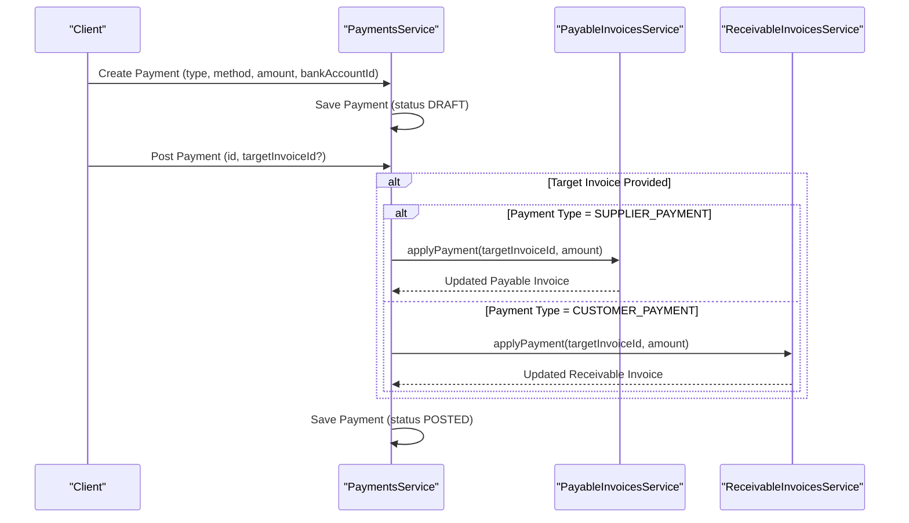
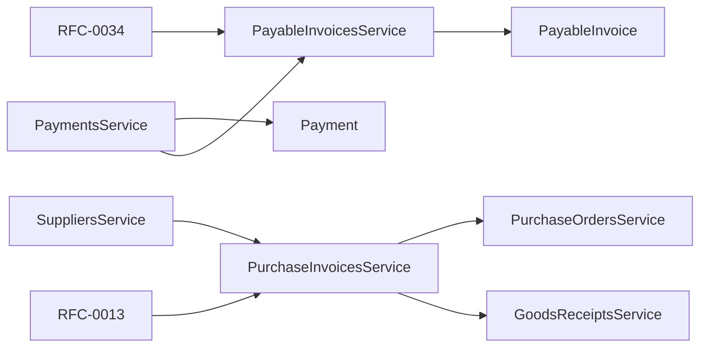

# Accounts Payable

<cite>
**Referenced Files in This Document**
- [0034-accounts-payable.md](file://docs/rfcs/0034-accounts-payable.md)
- [0013-purchase-invoices.md](file://docs/rfcs/0013-purchase-invoices.md)
- [payable-invoices.service.ts](file://apps/api/src/payable-invoices/payable-invoices.service.ts)
- [dtos.ts](file://apps/api/src/payable-invoices/dtos.ts)
- [purchase-invoices.service.ts](file://apps/api/src/purchase-invoices/purchase-invoices.service.ts)
- [purchase-orders.service.ts](file://apps/api/src/purchase-orders/purchase-orders.service.ts)
- [suppliers.service.ts](file://apps/api/src/suppliers/suppliers.service.ts)
- [payments.service.ts](file://apps/api/src/payments/payments.service.ts)
- [payable-invoice.ts](file://packages/finance/src/payables/payable-invoice.ts)
- [payment.ts](file://packages/finance/src/payments/payment.ts)
</cite>

## Table of Contents
1. [Introduction](#introduction)
2. [Project Structure](#project-structure)
3. [Core Components](#core-components)
4. [Architecture Overview](#architecture-overview)
5. [Detailed Component Analysis](#detailed-component-analysis)
6. [Dependency Analysis](#dependency-analysis)
7. [Performance Considerations](#performance-considerations)
8. [Troubleshooting Guide](#troubleshooting-guide)
9. [Conclusion](#conclusion)

## Introduction
This document explains the Accounts Payable (AP) operations implemented in the system, focusing on vendor invoice processing, purchase order matching, three-way matching, and payment scheduling. It covers the end-to-end AP workflow from receiving a vendor bill to executing supplier payments, including approval workflows, exception handling, expense allocation concepts, tax handling considerations, vendor management integration, compliance features, audit trails, and financial controls.

The AP domain is defined by RFCs that specify aggregates, state machines, commands, queries, and cross-module integrations with Procurement and General Ledger. The implementation exposes NestJS application services for payable invoices, purchase invoices, suppliers, and payments, backed by domain entities in the finance package.

## Project Structure
The AP-related functionality spans:
- API layer controllers/services for Payable Invoices, Purchase Invoices, Suppliers, and Payments
- Finance domain models for Payable Invoice and Payment
- RFC specifications defining AP scope, state transitions, and integration points

**Diagram sources**
- [payable-invoices.service.ts:1-76](file://apps/api/src/payable-invoices/payable-invoices.service.ts#L1-L76)
- [purchase-invoices.service.ts:1-116](file://apps/api/src/purchase-invoices/purchase-invoices.service.ts#L1-L116)
- [payments.service.ts:1-88](file://apps/api/src/payments/payments.service.ts#L1-L88)
- [payable-invoice.ts:1-112](file://packages/finance/src/payables/payable-invoice.ts#L1-L112)
- [payment.ts:1-106](file://packages/finance/src/payments/payment.ts#L1-L106)
- [0034-accounts-payable.md:1-92](file://docs/rfcs/0034-accounts-payable.md#L1-L92)
- [0013-purchase-invoices.md:1-206](file://docs/rfcs/0013-purchase-invoices.md#L1-L206)

**Section sources**
- [0034-accounts-payable.md:1-92](file://docs/rfcs/0034-accounts-payable.md#L1-L92)
- [0013-purchase-invoices.md:1-206](file://docs/rfcs/0013-purchase-invoices.md#L1-L206)

## Core Components
- Payable Invoice: Represents a financial liability for supplier purchases, tracks balance, due date, and status transitions. Supports creation, posting, payment application, and cancellation.
- Purchase Invoice: Vendor bill record with 3-way matching against Purchase Order and Goods Receipt, enabling variance detection and approval for payment.
- Payment: Financial instrument for disbursing funds; supports auto-allocation to receivable or payable invoices when posted with a target invoice reference.
- Supplier: Master data for vendors, including tax identifiers, payment terms, currency, and component mappings used across procurement and payables.

Key responsibilities:
- PayableInvoicesService orchestrates payable invoice lifecycle and payment application.
- PurchaseInvoicesService manages vendor invoice entry, 3-way matching, and approval.
- PaymentsService creates and posts payments, optionally allocating them to invoices.
- SuppliersService provides vendor master data and relationships.

**Section sources**
- [payable-invoices.service.ts:1-76](file://apps/api/src/payable-invoices/payable-invoices.service.ts#L1-L76)
- [purchase-invoices.service.ts:1-116](file://apps/api/src/purchase-invoices/purchase-invoices.service.ts#L1-L116)
- [payments.service.ts:1-88](file://apps/api/src/payments/payments.service.ts#L1-L88)
- [suppliers.service.ts:1-103](file://apps/api/src/suppliers/suppliers.service.ts#L1-L103)
- [payable-invoice.ts:1-112](file://packages/finance/src/payables/payable-invoice.ts#L1-L112)
- [payment.ts:1-106](file://packages/finance/src/payments/payment.ts#L1-L106)

## Architecture Overview
The AP workflow integrates Procurement and Finance modules:
- Procurement generates Purchase Orders and Goods Receipts.
- Purchase Invoices capture vendor bills and perform 3-way matching.
- Payable Invoices represent liabilities derived from approved Purchase Invoices.
- Payments disburse funds and allocate to Payable Invoices.

**Diagram sources**
- [purchase-invoices.service.ts:70-83](file://apps/api/src/purchase-invoices/purchase-invoices.service.ts#L70-L83)
- [payable-invoices.service.ts:18-30](file://apps/api/src/payable-invoices/payable-invoices.service.ts#L18-L30)
- [payments.service.ts:58-75](file://apps/api/src/payments/payments.service.ts#L58-L75)

## Detailed Component Analysis

### Payable Invoice Lifecycle
Payable invoices track supplier liabilities, enforce state transitions, and manage partial/full payments.

Lifecycle rules:
- Creation initializes amount and balance equal to invoice amount, status DRAFT.
- Posting transitions DRAFT → POSTED.
- Applying payment reduces balance and transitions to PARTIALLY_PAID or PAID.
- Cancellation sets status CANCELLED unless already PAID.

Validation highlights:
- Amount must be greater than zero at creation.
- Payment cannot exceed remaining balance.
- Posting only allowed from DRAFT.
- Cancellation blocked if PAID.

**Diagram sources**
- [payable-invoice.ts:27-111](file://packages/finance/src/payables/payable-invoice.ts#L27-L111)

**Section sources**
- [payable-invoice.ts:1-112](file://packages/finance/src/payables/payable-invoice.ts#L1-L112)
- [payable-invoices.service.ts:18-74](file://apps/api/src/payable-invoices/payable-invoices.service.ts#L18-L74)

### Purchase Invoice and Three-Way Matching
Purchase invoices register vendor bills and execute automated 3-way matching against Purchase Orders and Goods Receipts.

Matching outcomes:
- MATCHED: Price and quantity align within policy thresholds.
- VARIANCE_HOLD: Price or quantity variance detected; requires manual review.
- APPROVED: Authorized for payment after successful match or variance approval.

Integration:
- Reads Purchase Order prices via PurchaseOrdersService.
- Reads Goods Receipt quantities via GoodsReceiptsService.
- Uses ThreeWayMatcher.evaluate to compute match results.

**Diagram sources**
- [purchase-invoices.service.ts:70-83](file://apps/api/src/purchase-invoices/purchase-invoices.service.ts#L70-L83)
- [0013-purchase-invoices.md:13-31](file://docs/rfcs/0013-purchase-invoices.md#L13-L31)

**Section sources**
- [purchase-invoices.service.ts:1-116](file://apps/api/src/purchase-invoices/purchase-invoices.service.ts#L1-L116)
- [0013-purchase-invoices.md:1-206](file://docs/rfcs/0013-purchase-invoices.md#L1-L206)

### Payment Scheduling and Allocation
Payments are created, posted, and optionally allocated to invoices based on payment type.

Controls:
- Auto-allocation only occurs when a target invoice ID is provided.
- Payment type determines whether allocation applies to receivables or payables.
- Payment posting enforces DRAFT → POSTED transition.

**Diagram sources**
- [payments.service.ts:23-79](file://apps/api/src/payments/payments.service.ts#L23-L79)

**Section sources**
- [payments.service.ts:1-88](file://apps/api/src/payments/payments.service.ts#L1-L88)
- [payment.ts:1-106](file://packages/finance/src/payments/payment.ts#L1-L106)

### Vendor Management Integration
Supplier master data includes tax identifiers, payment terms, and currency settings used across procurement and payables.

Key capabilities:
- Create, update, and delete suppliers.
- Manage contacts and component mappings.
- Provide search and lookup for vendor records.

Compliance relevance:
- Tax ID and payment terms support regulatory reporting and cash flow planning.
- Currency selection ensures consistent monetary calculations across modules.

**Section sources**
- [suppliers.service.ts:1-103](file://apps/api/src/suppliers/suppliers.service.ts#L1-L103)

### Expense Allocation and Tax Handling
- Expense allocation: Payable lines can be associated with cost centers, projects, or accounts through upstream procurement processes and journal entries. While explicit GL posting is not shown in these files, RFC-0034 states integration with General Ledger for expense/liability postings.
- Tax handling: Supplier records include tax identifiers; purchase invoices may carry tax amounts per line totals plus fees. RFC-0013 notes total invoice amount equals sum of line totals plus tax/shipping fees.

Operational guidance:
- Ensure tax rates and exemptions are configured in supplier profiles.
- Validate invoice totals include applicable taxes and shipping charges before approval.

**Section sources**
- [0034-accounts-payable.md:65-68](file://docs/rfcs/0034-accounts-payable.md#L65-L68)
- [0013-purchase-invoices.md:114-118](file://docs/rfcs/0013-purchase-invoices.md#L114-L118)
- [suppliers.service.ts:35-55](file://apps/api/src/suppliers/suppliers.service.ts#L35-L55)

## Dependency Analysis
The AP module depends on:
- Procurement module for Purchase Orders and Goods Receipts data during 3-way matching.
- Finance domain models for Payable Invoice and Payment state machines.
- Supplier master data for vendor attributes and payment terms.

**Diagram sources**
- [purchase-invoices.service.ts:1-116](file://apps/api/src/purchase-invoices/purchase-invoices.service.ts#L1-L116)
- [payable-invoices.service.ts:1-76](file://apps/api/src/payable-invoices/payable-invoices.service.ts#L1-L76)
- [payments.service.ts:1-88](file://apps/api/src/payments/payments.service.ts#L1-L88)
- [payable-invoice.ts:1-112](file://packages/finance/src/payables/payable-invoice.ts#L1-L112)
- [payment.ts:1-106](file://packages/finance/src/payments/payment.ts#L1-L106)
- [0034-accounts-payable.md:1-92](file://docs/rfcs/0034-accounts-payable.md#L1-L92)
- [0013-purchase-invoices.md:1-206](file://docs/rfcs/0013-purchase-invoices.md#L1-L206)

**Section sources**
- [purchase-invoices.service.ts:1-116](file://apps/api/src/purchase-invoices/purchase-invoices.service.ts#L1-L116)
- [payable-invoices.service.ts:1-76](file://apps/api/src/payable-invoices/payable-invoices.service.ts#L1-L76)
- [payments.service.ts:1-88](file://apps/api/src/payments/payments.service.ts#L1-L88)

## Performance Considerations
- Batch operations: When creating multiple payable invoices or applying bulk payments, consider batching repository saves to reduce database round-trips.
- Matching efficiency: Cache PO and Goods Receipt lookups during 3-way matching to avoid repeated reads.
- Validation overhead: Defer expensive validations until necessary stages (e.g., match and approval).
- Concurrency: Use optimistic locking or versioned entities to prevent race conditions during concurrent payment applications.

[No sources needed since this section provides general guidance]

## Troubleshooting Guide
Common issues and resolutions:
- Cannot post payable invoice: Ensure status is DRAFT before posting.
- Payment exceeds balance: Verify remaining balance and adjust payment amount accordingly.
- Paid invoices cannot be cancelled: Reconcile or reverse through appropriate accounting procedures rather than cancelling paid items.
- 3-way match variance: Review price and quantity variances; either adjust invoice lines or obtain variance approvals before marking matched/approved.

Error handling patterns:
- Domain entities throw errors for invalid state transitions or invalid amounts.
- Application services throw NotFoundException when referenced entities do not exist.

**Section sources**
- [payable-invoice.ts:76-110](file://packages/finance/src/payables/payable-invoice.ts#L76-L110)
- [payment.ts:82-104](file://packages/finance/src/payments/payment.ts#L82-L104)
- [payable-invoices.service.ts:44-49](file://apps/api/src/payable-invoices/payable-invoices.service.ts#L44-L49)
- [purchase-invoices.service.ts:52-58](file://apps/api/src/purchase-invoices/purchase-invoices.service.ts#L52-L58)

## Conclusion
The Accounts Payable module provides a robust foundation for vendor bill processing, three-way matching, and supplier payment execution. It integrates closely with Procurement and Finance domains, enforcing strict state transitions and validation rules to ensure financial integrity. By leveraging supplier master data, tax identifiers, and payment terms, the system supports compliant, auditable, and controlled payable operations. Future enhancements include automated early payment discount calculations and deeper GL integration for comprehensive financial reporting.

[No sources needed since this section summarizes without analyzing specific files]