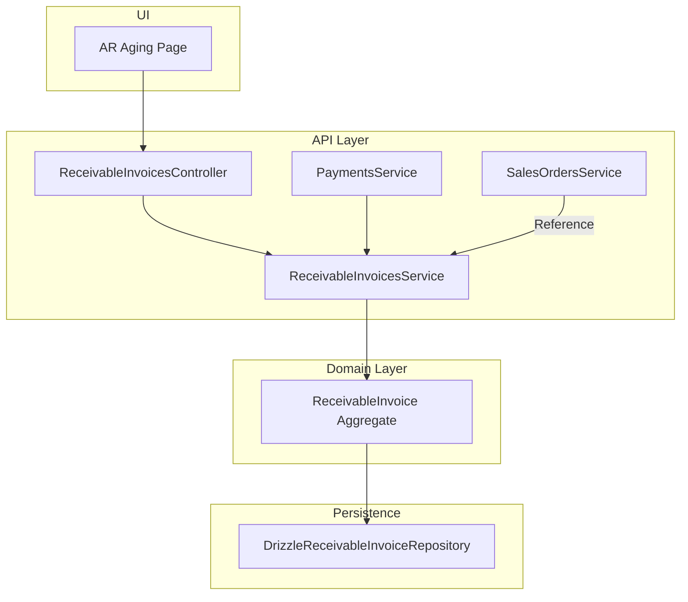
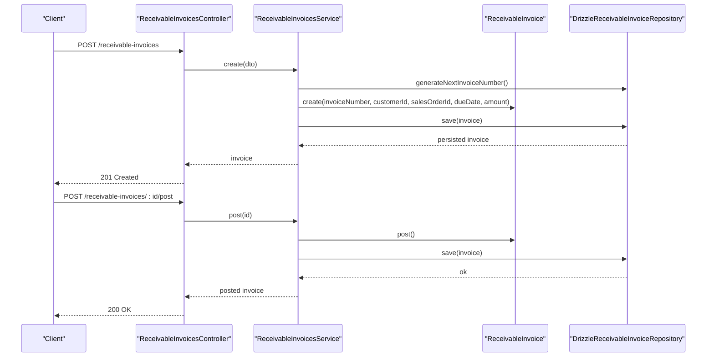
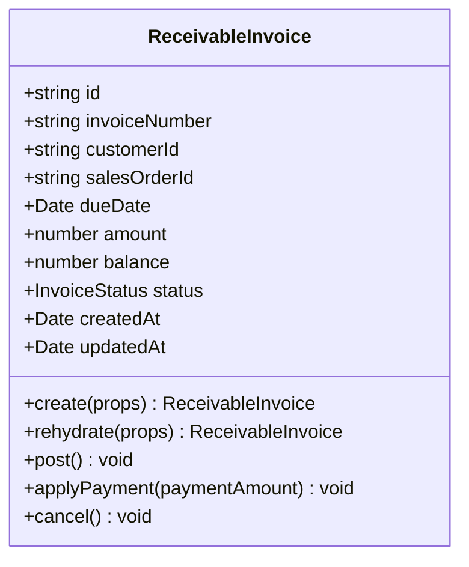
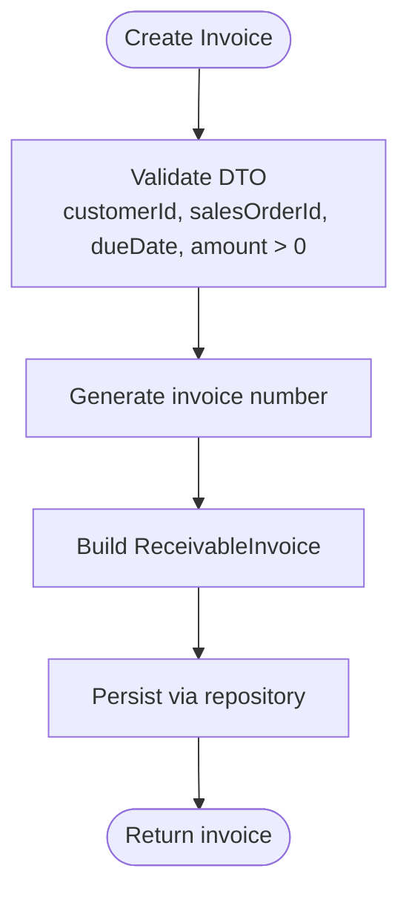
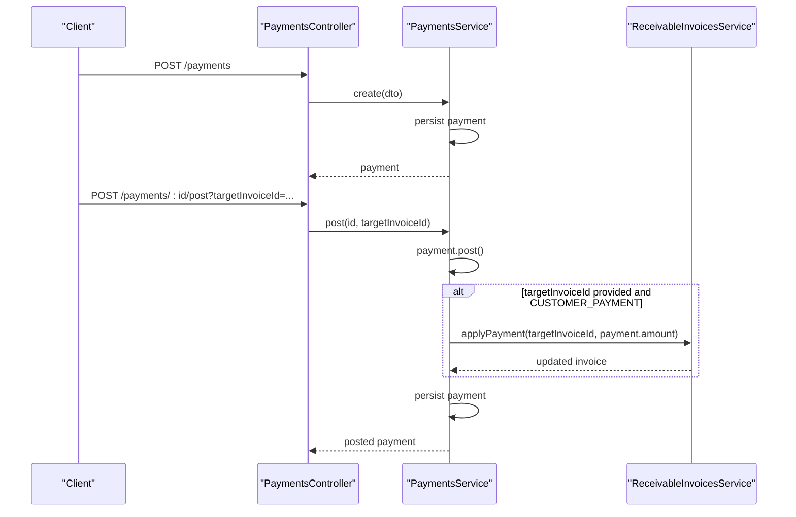
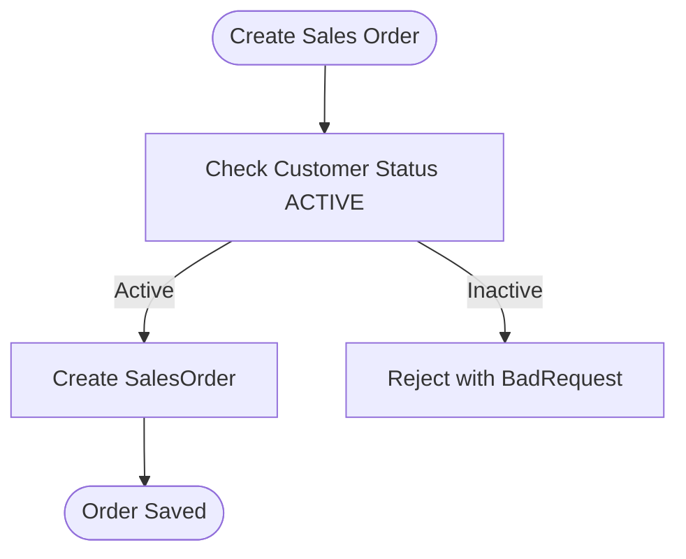
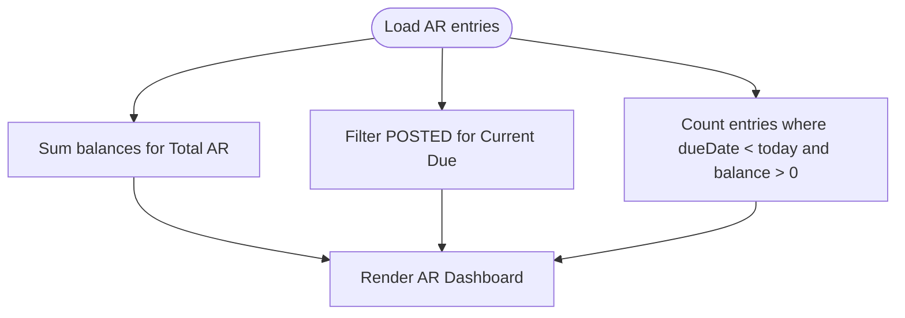
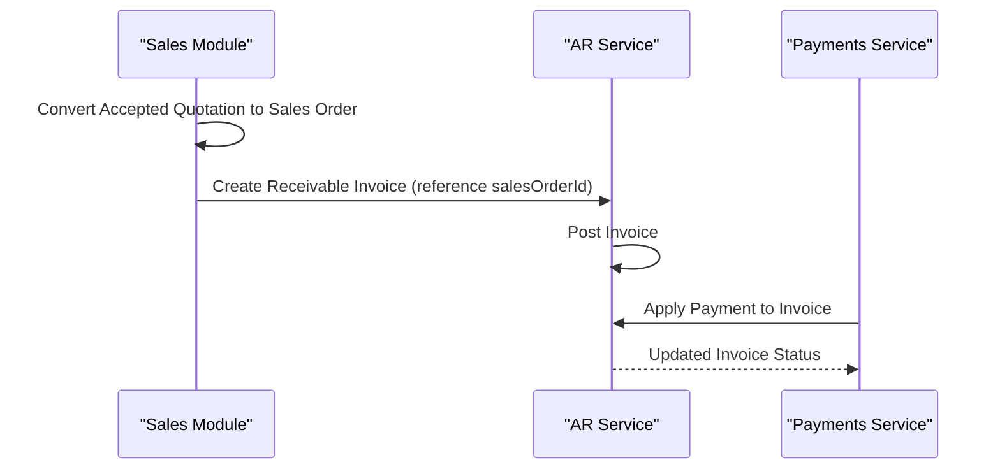
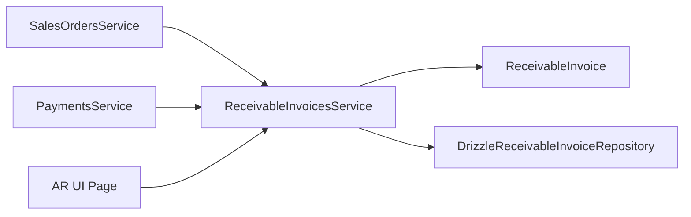

# Accounts Receivable

<cite>
**Referenced Files in This Document**
- [0033-accounts-receivable.md](file://docs/rfcs/0033-accounts-receivable.md)
- [receivable-invoices.service.ts](file://apps/api/src/receivable-invoices/receivable-invoices.service.ts)
- [receivable-invoices.controller.ts](file://apps/api/src/receivable-invoices/receivable-invoices.controller.ts)
- [dtos.ts (Receivable Invoices)](file://apps/api/src/receivable-invoices/dtos.ts)
- [payments.service.ts](file://apps/api/src/payments/payments.service.ts)
- [dtos.ts (Payments)](file://apps/api/src/payments/dtos.ts)
- [sales-orders.service.ts](file://apps/api/src/sales-orders/sales-orders.service.ts)
- [receivable-invoice.ts](file://packages/finance/src/receivables/receivable-invoice.ts)
- [index.ts (Finance Receivables)](file://packages/finance/src/receivables/index.ts)
- [drizzle-receivable-invoice.repository.ts](file://apps/api/src/infrastructure/repositories/drizzle-receivable-invoice.repository.ts)
- [page.tsx (Accounts Receivable UI)](file://apps/web/app/accounts-receivable/page.tsx)
</cite>

## Table of Contents
1. [Introduction](#introduction)
2. [Project Structure](#project-structure)
3. [Core Components](#core-components)
4. [Architecture Overview](#architecture-overview)
5. [Detailed Component Analysis](#detailed-component-analysis)
6. [Dependency Analysis](#dependency-analysis)
7. [Performance Considerations](#performance-considerations)
8. [Troubleshooting Guide](#troubleshooting-guide)
9. [Conclusion](#conclusion)

## Introduction
This document explains the Accounts Receivable (AR) capabilities in the system, focusing on invoice creation from sales orders, customer billing cycles, payment terms, aging analysis, and the end-to-end quote-to-cash workflow. It also covers credit management considerations, collections practices, bad debt handling, recurring billing patterns, discount applications, customer statements, integration with sales orders and payments, and financial reporting for receivables.

The AR domain is defined by a ReceivableInvoice aggregate that tracks invoice balance and status, supports posting and payment application, and integrates with Sales Orders and Payments to complete the quote-to-cash cycle. The UI provides an AR aging dashboard showing outstanding balances, current due amounts, and overdue accounts.

## Project Structure
AR-related functionality spans:
- Domain model and state machine in the finance package
- API controllers and services for creating, posting, querying, and applying payments to receivable invoices
- Payment service that auto-allocates customer payments to target invoices
- Repository implementation for persistence
- Web UI for AR aging overview

**Diagram sources**
- [receivable-invoices.controller.ts:6-38](file://apps/api/src/receivable-invoices/receivable-invoices.controller.ts#L6-L38)
- [receivable-invoices.service.ts:11-77](file://apps/api/src/receivable-invoices/receivable-invoices.service.ts#L11-L77)
- [payments.service.ts:14-86](file://apps/api/src/payments/payments.service.ts#L14-L86)
- [sales-orders.service.ts:22-134](file://apps/api/src/sales-orders/sales-orders.service.ts#L22-L134)
- [receivable-invoice.ts:27-111](file://packages/finance/src/receivables/receivable-invoice.ts#L27-L111)
- [drizzle-receivable-invoice.repository.ts:27-44](file://apps/api/src/infrastructure/repositories/drizzle-receivable-invoice.repository.ts#L27-L44)
- [page.tsx (Accounts Receivable UI):36-144](file://apps/web/app/accounts-receivable/page.tsx#L36-L144)

**Section sources**
- [0033-accounts-receivable.md:1-92](file://docs/rfcs/0033-accounts-receivable.md#L1-L92)
- [receivable-invoices.controller.ts:6-38](file://apps/api/src/receivable-invoices/receivable-invoices.controller.ts#L6-L38)
- [receivable-invoices.service.ts:11-77](file://apps/api/src/receivable-invoices/receivable-invoices.service.ts#L11-L77)
- [payments.service.ts:14-86](file://apps/api/src/payments/payments.service.ts#L14-L86)
- [sales-orders.service.ts:22-134](file://apps/api/src/sales-orders/sales-orders.service.ts#L22-L134)
- [receivable-invoice.ts:27-111](file://packages/finance/src/receivables/receivable-invoice.ts#L27-L111)
- [drizzle-receivable-invoice.repository.ts:27-44](file://apps/api/src/infrastructure/repositories/drizzle-receivable-invoice.repository.ts#L27-L44)
- [page.tsx (Accounts Receivable UI):36-144](file://apps/web/app/accounts-receivable/page.tsx#L36-L144)

## Core Components
- ReceivableInvoice aggregate: Encapsulates invoice lifecycle, balance tracking, and payment application rules.
- ReceivableInvoicesService: Orchestrates invoice creation, posting, cancellation, and payment application; delegates persistence via repository.
- ReceivableInvoicesController: Exposes REST endpoints for AR operations.
- PaymentsService: Creates payments and optionally allocates them to a target receivable invoice when posting.
- DrizzleReceivableInvoiceRepository: Persists and retrieves receivable invoices using Drizzle ORM.
- AR UI page: Displays AR aging summary, total outstanding, current due, and overdue counts.

Key behaviors:
- Invoice creation requires customerId, salesOrderId, dueDate, and amount > 0.
- Posting transitions DRAFT → POSTED.
- Applying payments reduces balance and transitions to PARTIALLY_PAID or PAID.
- Cancellation is disallowed for PAID invoices.

**Section sources**
- [receivable-invoice.ts:27-111](file://packages/finance/src/receivables/receivable-invoice.ts#L27-L111)
- [receivable-invoices.service.ts:18-77](file://apps/api/src/receivable-invoices/receivable-invoices.service.ts#L18-L77)
- [receivable-invoices.controller.ts:6-38](file://apps/api/src/receivable-invoices/receivable-invoices.controller.ts#L6-L38)
- [payments.service.ts:23-86](file://apps/api/src/payments/payments.service.ts#L23-L86)
- [drizzle-receivable-invoice.repository.ts:27-44](file://apps/api/src/infrastructure/repositories/drizzle-receivable-invoice.repository.ts#L27-L44)
- [page.tsx (Accounts Receivable UI):36-144](file://apps/web/app/accounts-receivable/page.tsx#L36-L144)

## Architecture Overview
The AR architecture follows a layered approach:
- API layer exposes endpoints for invoice and payment operations.
- Application services coordinate business logic and enforce domain rules.
- Domain aggregates encapsulate core AR behavior and invariants.
- Persistence layer stores AR data and maps between domain objects and database records.
- UI renders AR aging dashboards and actions.

**Diagram sources**
- [receivable-invoices.controller.ts:10-32](file://apps/api/src/receivable-invoices/receivable-invoices.controller.ts#L10-L32)
- [receivable-invoices.service.ts:18-59](file://apps/api/src/receivable-invoices/receivable-invoices.service.ts#L18-L59)
- [receivable-invoice.ts:52-82](file://packages/finance/src/receivables/receivable-invoice.ts#L52-L82)
- [drizzle-receivable-invoice.repository.ts:27-44](file://apps/api/src/infrastructure/repositories/drizzle-receivable-invoice.repository.ts#L27-L44)

## Detailed Component Analysis

### ReceivableInvoice Aggregate
The ReceivableInvoice aggregate enforces AR invariants:
- Amount must be greater than zero at creation.
- Posting allowed only from DRAFT.
- Payment application allowed only from POSTED or PARTIALLY_PAID.
- Payment cannot exceed remaining balance.
- Cancellation not allowed if already PAID.

**Diagram sources**
- [receivable-invoice.ts:27-111](file://packages/finance/src/receivables/receivable-invoice.ts#L27-L111)

**Section sources**
- [receivable-invoice.ts:27-111](file://packages/finance/src/receivables/receivable-invoice.ts#L27-L111)

### ReceivableInvoicesService and Controller
Responsibilities:
- Create invoices with generated invoice numbers and validated inputs.
- Find invoices by filters (customerId, salesOrderId, status).
- Post invoices to move them into accounting.
- Apply customer payments to reduce balances and update statuses.
- Cancel invoices where permitted.

**Diagram sources**
- [receivable-invoices.service.ts:18-30](file://apps/api/src/receivable-invoices/receivable-invoices.service.ts#L18-L30)
- [dtos.ts (Receivable Invoices):9-25](file://apps/api/src/receivable-invoices/dtos.ts#L9-L25)

**Section sources**
- [receivable-invoices.service.ts:18-77](file://apps/api/src/receivable-invoices/receivable-invoices.service.ts#L18-L77)
- [receivable-invoices.controller.ts:6-38](file://apps/api/src/receivable-invoices/receivable-invoices.controller.ts#L6-L38)
- [dtos.ts (Receivable Invoices):9-25](file://apps/api/src/receivable-invoices/dtos.ts#L9-L25)

### PaymentsService Integration
Responsibilities:
- Create payments with type, method, amount, optional reference and bank account.
- Post payments and optionally allocate to a target invoice.
- For CUSTOMER_PAYMENT, call ReceivableInvoicesService.applyPayment to reduce AR balance.

**Diagram sources**
- [payments.service.ts:23-86](file://apps/api/src/payments/payments.service.ts#L23-L86)
- [receivable-invoices.service.ts:61-69](file://apps/api/src/receivable-invoices/receivable-invoices.service.ts#L61-L69)

**Section sources**
- [payments.service.ts:23-86](file://apps/api/src/payments/payments.service.ts#L23-L86)
- [dtos.ts (Payments):10-34](file://apps/api/src/payments/dtos.ts#L10-L34)

### Sales Order Integration
AR originates from commercial sales orders. While AR invoice creation accepts a salesOrderId, the Sales module validates customer status and quotation conversion before order creation. This ensures AR references valid commercial transactions.

**Diagram sources**
- [sales-orders.service.ts:31-49](file://apps/api/src/sales-orders/sales-orders.service.ts#L31-L49)

**Section sources**
- [sales-orders.service.ts:31-49](file://apps/api/src/sales-orders/sales-orders.service.ts#L31-L49)

### AR Aging and Statements
The AR UI displays:
- Total outstanding AR
- Current due (<30 days)
- Overdue accounts count
- A table of receivable invoices with customer name, invoice number, balance, status, and due date

Aging buckets are conceptualized as 0-30, 31-60, 61-90, 90+ days per RFC language. The UI currently highlights POSTED invoices as current due and flags overdue based on due date vs. today.

**Diagram sources**
- [page.tsx (Accounts Receivable UI):36-144](file://apps/web/app/accounts-receivable/page.tsx#L36-L144)

**Section sources**
- [page.tsx (Accounts Receivable UI):36-144](file://apps/web/app/accounts-receivable/page.tsx#L36-L144)
- [0033-accounts-receivable.md:11-14](file://docs/rfcs/0033-accounts-receivable.md#L11-L14)

### Quote-to-Cash Workflow
End-to-end flow:
1. Quotation accepted → Sales Order created (with lines including discounts).
2. Sales Order referenced when creating Receivable Invoice.
3. Invoice posted to accounting.
4. Customer payment applied to invoice reducing balance.
5. Invoice transitions to PARTIALLY_PAID or PAID.

**Diagram sources**
- [sales-orders.service.ts:51-79](file://apps/api/src/sales-orders/sales-orders.service.ts#L51-L79)
- [receivable-invoices.service.ts:18-59](file://apps/api/src/receivable-invoices/receivable-invoices.service.ts#L18-L59)
- [payments.service.ts:58-79](file://apps/api/src/payments/payments.service.ts#L58-L79)

**Section sources**
- [sales-orders.service.ts:51-79](file://apps/api/src/sales-orders/sales-orders.service.ts#L51-L79)
- [receivable-invoices.service.ts:18-59](file://apps/api/src/receivable-invoices/receivable-invoices.service.ts#L18-L59)
- [payments.service.ts:58-79](file://apps/api/src/payments/payments.service.ts#L58-L79)

## Dependency Analysis
AR depends on:
- Finance domain models (ReceivableInvoice, InvoiceStatus)
- Sales module for order references
- Payments module for allocation
- Database repository for persistence

**Diagram sources**
- [sales-orders.service.ts:22-134](file://apps/api/src/sales-orders/sales-orders.service.ts#L22-L134)
- [receivable-invoices.service.ts:11-77](file://apps/api/src/receivable-invoices/receivable-invoices.service.ts#L11-L77)
- [receivable-invoice.ts:27-111](file://packages/finance/src/receivables/receivable-invoice.ts#L27-L111)
- [drizzle-receivable-invoice.repository.ts:27-44](file://apps/api/src/infrastructure/repositories/drizzle-receivable-invoice.repository.ts#L27-L44)
- [payments.service.ts:14-86](file://apps/api/src/payments/payments.service.ts#L14-L86)
- [page.tsx (Accounts Receivable UI):36-144](file://apps/web/app/accounts-receivable/page.tsx#L36-L144)

**Section sources**
- [index.ts (Finance Receivables):1-2](file://packages/finance/src/receivables/index.ts#L1-L2)
- [receivable-invoices.service.ts:11-77](file://apps/api/src/receivable-invoices/receivable-invoices.service.ts#L11-L77)
- [payments.service.ts:14-86](file://apps/api/src/payments/payments.service.ts#L14-L86)
- [sales-orders.service.ts:22-134](file://apps/api/src/sales-orders/sales-orders.service.ts#L22-L134)
- [drizzle-receivable-invoice.repository.ts:27-44](file://apps/api/src/infrastructure/repositories/drizzle-receivable-invoice.repository.ts#L27-L44)
- [page.tsx (Accounts Receivable UI):36-144](file://apps/web/app/accounts-receivable/page.tsx#L36-L144)

## Performance Considerations
- Use filtered queries (customerId, salesOrderId, status) to limit result sets for AR listings.
- Avoid unnecessary rehydration of large datasets; paginate AR lists in the UI.
- Batch payment allocations when multiple invoices are settled in one operation.
- Index frequently queried fields such as customerId, salesOrderId, status, and dueDate in the database schema.

[No sources needed since this section provides general guidance]

## Troubleshooting Guide
Common issues and resolutions:
- Cannot post invoice: Ensure invoice is in DRAFT status before posting.
- Cannot apply payment: Ensure invoice is in POSTED or PARTIALLY_PAID and payment amount does not exceed remaining balance.
- Cannot cancel invoice: Paid invoices cannot be cancelled; consider reversal workflows instead.
- Invalid DTOs: Ensure required fields (customerId, salesOrderId, dueDate, amount > 0) are present and valid.

Operational checks:
- Verify Sales Order exists and references a valid customer.
- Confirm PaymentType is CUSTOMER_PAYMENT when allocating to AR.
- Inspect AR UI for overdue counts and current due totals to identify collection priorities.

**Section sources**
- [receivable-invoice.ts:76-111](file://packages/finance/src/receivables/receivable-invoice.ts#L76-L111)
- [receivable-invoices.service.ts:44-77](file://apps/api/src/receivable-invoices/receivable-invoices.service.ts#L44-L77)
- [payments.service.ts:58-86](file://apps/api/src/payments/payments.service.ts#L58-L86)
- [dtos.ts (Receivable Invoices):9-25](file://apps/api/src/receivable-invoices/dtos.ts#L9-L25)
- [dtos.ts (Payments):10-34](file://apps/api/src/payments/dtos.ts#L10-L34)

## Conclusion
The AR module provides a robust foundation for managing customer invoices, payment application, and aging visibility. It integrates cleanly with Sales Orders and Payments, enforcing domain invariants through the ReceivableInvoice aggregate. The UI offers actionable insights into outstanding balances and overdue accounts. Future enhancements can include automated dunning letters, credit limit enforcement, recurring billing schedules, discount application strategies, and comprehensive customer statement generation aligned with aging buckets.

[No sources needed since this section summarizes without analyzing specific files]