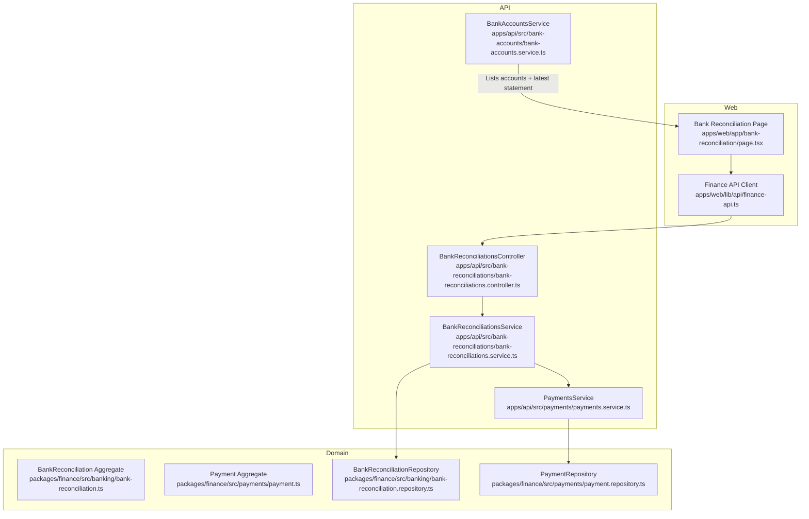
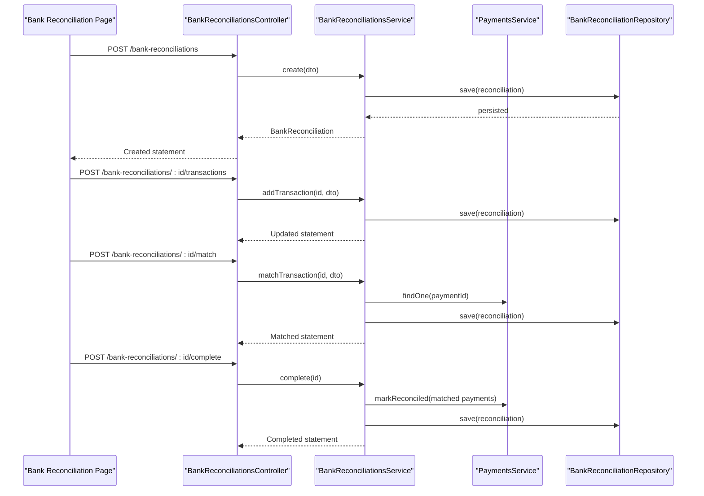
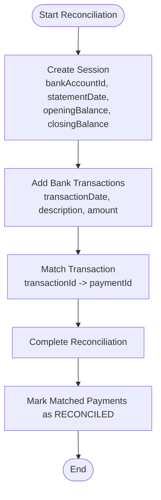
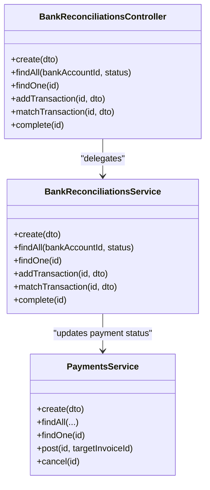
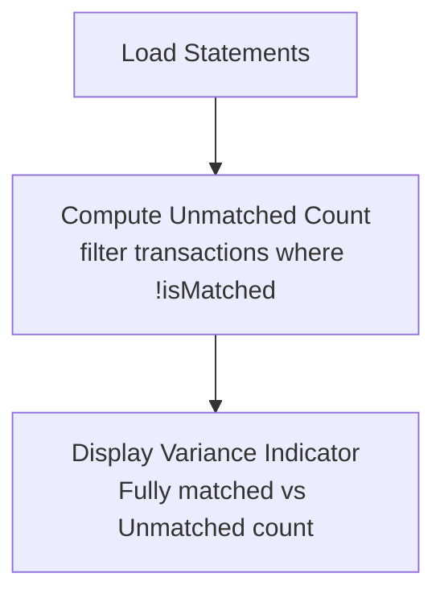
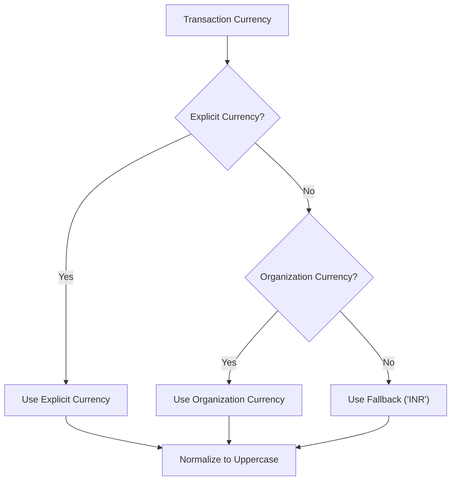
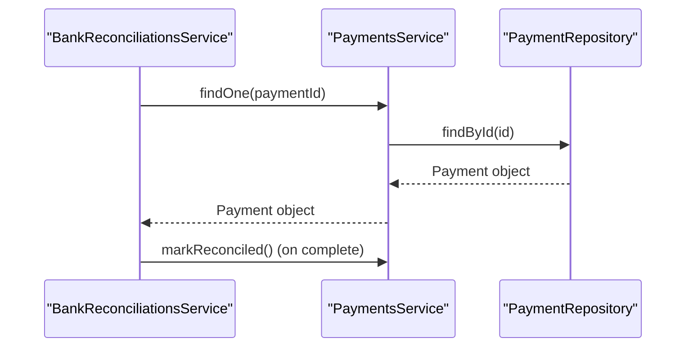
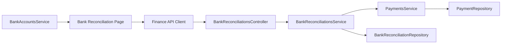
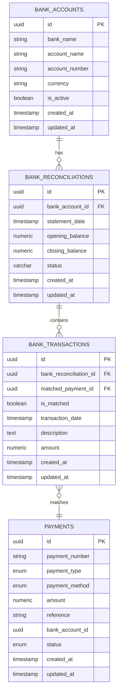

# Bank Reconciliation

<cite>
**Referenced Files in This Document**   
- [0035-payments-and-bank-reconciliation.md](file://docs/rfcs/0035-payments-and-bank-reconciliation.md)
- [bank-reconciliations.controller.ts](file://apps/api/src/bank-reconciliations/bank-reconciliations.controller.ts)
- [bank-reconciliations.service.ts](file://apps/api/src/bank-reconciliations/bank-reconciliations.service.ts)
- [dtos.ts](file://apps/api/src/bank-reconciliations/dtos.ts)
- [page.tsx](file://apps/web/app/bank-reconciliation/page.tsx)
- [finance-api.ts](file://apps/web/lib/api/finance-api.ts)
- [payments.service.ts](file://apps/api/src/payments/payments.service.ts)
- [bank-accounts.service.ts](file://apps/api/src/bank-accounts/bank-accounts.service.ts)
- [currency-resolver.ts](file://apps/api/src/common/utils/currency-resolver.ts)
- [index.ts](file://packages/finance/src/index.ts)
- [bank-reconciliation.repository.ts](file://packages/finance/src/banking/bank-reconciliation.repository.ts)
- [bank-reconciliation.ts](file://packages/finance/src/banking/bank-reconciliation.ts)
- [payment.repository.ts](file://packages/finance/src/payments/payment.repository.ts)
- [payment.ts](file://packages/finance/src/payments/payment.ts)
</cite>

## Table of Contents
1. [Introduction](#introduction)
2. [Project Structure](#project-structure)
3. [Core Components](#core-components)
4. [Architecture Overview](#architecture-overview)
5. [Detailed Component Analysis](#detailed-component-analysis)
6. [Dependency Analysis](#dependency-analysis)
7. [Performance Considerations](#performance-considerations)
8. [Troubleshooting Guide](#troubleshooting-guide)
9. [Conclusion](#conclusion)
10. [Appendices](#appendices)

## Introduction
This document explains the Bank Reconciliation functionality, including bank statement import, automatic matching algorithms, manual reconciliation workflows, discrepancy identification, and adjustment posting. It also covers integration with payment systems, multi-currency considerations, reporting capabilities, audit requirements, and future extensions such as automated bank feeds and AI-assisted fuzzy matching.

The feature is designed around two aggregate roots: Payment and BankReconciliation. Payments record cash inflows, outflows, transfers, and refunds. Bank reconciliations match bank statement transactions against posted payments to ensure ledger accuracy.

**Section sources**
- [0035-payments-and-bank-reconciliation.md:1-105](file://docs/rfcs/0035-payments-and-bank-reconciliation.md#L1-L105)

## Project Structure
Bank Reconciliation spans API controllers/services, domain aggregates, repositories, and a web UI page that displays reconciliation statements and summary metrics.

**Diagram sources**
- [page.tsx:1-181](file://apps/web/app/bank-reconciliation/page.tsx#L1-L181)
- [finance-api.ts:1-53](file://apps/web/lib/api/finance-api.ts#L1-L53)
- [bank-reconciliations.controller.ts:1-47](file://apps/api/src/bank-reconciliations/bank-reconciliations.controller.ts#L1-L47)
- [bank-reconciliations.service.ts:1-97](file://apps/api/src/bank-reconciliations/bank-reconciliations.service.ts#L1-L97)
- [payments.service.ts:1-88](file://apps/api/src/payments/payments.service.ts#L1-L88)
- [bank-accounts.service.ts:1-59](file://apps/api/src/bank-accounts/bank-accounts.service.ts#L1-L59)
- [bank-reconciliation.ts](file://packages/finance/src/banking/bank-reconciliation.ts)
- [payment.ts](file://packages/finance/src/payments/payment.ts)
- [bank-reconciliation.repository.ts](file://packages/finance/src/banking/bank-reconciliation.repository.ts)
- [payment.repository.ts](file://packages/finance/src/payments/payment.repository.ts)

**Section sources**
- [page.tsx:1-181](file://apps/web/app/bank-reconciliation/page.tsx#L1-L181)
- [finance-api.ts:1-53](file://apps/web/lib/api/finance-api.ts#L1-L53)
- [bank-reconciliations.controller.ts:1-47](file://apps/api/src/bank-reconciliations/bank-reconciliations.controller.ts#L1-L47)
- [bank-reconciliations.service.ts:1-97](file://apps/api/src/bank-reconciliations/bank-reconciliations.service.ts#L1-L97)
- [payments.service.ts:1-88](file://apps/api/src/payments/payments.service.ts#L1-L88)
- [bank-accounts.service.ts:1-59](file://apps/api/src/bank-accounts/bank-accounts.service.ts#L1-L59)

## Core Components
- BankReconciliation Controller: Exposes endpoints to create, list, add transactions, match transactions, and complete reconciliations.
- BankReconciliation Service: Orchestrates reconciliation lifecycle, persists changes via repository, and updates payment status upon completion.
- DTOs: Validate inputs for creating reconciliations, adding bank transactions, and matching transactions.
- Web Page: Displays reconciliation statements, account summaries, unmatched variance counts, and status indicators.
- Payments Service: Manages payment creation, posting, allocation to invoices, and cancellation; used by reconciliation service to update payment statuses.
- Bank Accounts Service: Provides bank account listings with latest reconciliation data for UI display.

Key responsibilities:
- Importing bank statement lines into a reconciliation session.
- Matching bank transactions to posted payments.
- Completing reconciliation and marking matched payments as reconciled.
- Presenting reconciliation status and variances in the UI.

**Section sources**
- [bank-reconciliations.controller.ts:1-47](file://apps/api/src/bank-reconciliations/bank-reconciliations.controller.ts#L1-L47)
- [bank-reconciliations.service.ts:1-97](file://apps/api/src/bank-reconciliations/bank-reconciliations.service.ts#L1-L97)
- [dtos.ts:1-41](file://apps/api/src/bank-reconciliations/dtos.ts#L1-L41)
- [page.tsx:1-181](file://apps/web/app/bank-reconciliation/page.tsx#L1-L181)
- [payments.service.ts:1-88](file://apps/api/src/payments/payments.service.ts#L1-L88)
- [bank-accounts.service.ts:1-59](file://apps/api/src/bank-accounts/bank-accounts.service.ts#L1-L59)

## Architecture Overview
The system follows a layered architecture:
- Web layer: React page consumes finance API client to fetch reconciliation statements and bank accounts.
- API layer: NestJS controller delegates to services; services coordinate domain aggregates and repositories.
- Domain layer: Aggregates enforce business rules (e.g., reconciliation states, payment states).
- Persistence layer: Repositories abstract database operations.

**Diagram sources**
- [bank-reconciliations.controller.ts:14-45](file://apps/api/src/bank-reconciliations/bank-reconciliations.controller.ts#L14-L45)
- [bank-reconciliations.service.ts:24-95](file://apps/api/src/bank-reconciliations/bank-reconciliations.service.ts#L24-L95)
- [payments.service.ts:50-86](file://apps/api/src/payments/payments.service.ts#L50-L86)

## Detailed Component Analysis

### Bank Reconciliation Workflow
The reconciliation workflow includes:
- Creating a reconciliation session with bank account, statement date, opening and closing balances.
- Adding bank statement transactions (date, description, amount).
- Matching each bank transaction to a posted payment.
- Completing the reconciliation, which marks matched payments as reconciled.

**Diagram sources**
- [bank-reconciliations.service.ts:24-95](file://apps/api/src/bank-reconciliations/bank-reconciliations.service.ts#L24-L95)

**Section sources**
- [bank-reconciliations.service.ts:24-95](file://apps/api/src/bank-reconciliations/bank-reconciliations.service.ts#L24-L95)

### Automatic Matching Algorithms
The RFC defines a domain service named BankReconciliationMatcher intended to automatically match statement transactions against posted payments using date and amount heuristics. The current implementation exposes manual matching via the API; automatic matching can be implemented within the service or matcher component to propose matches before user confirmation.

Recommendations:
- Implement rule-based matching prioritizing exact amount and date proximity.
- Provide confidence scores for suggested matches.
- Allow users to accept or override suggestions.

**Section sources**
- [0035-payments-and-bank-reconciliation.md:47-54](file://docs/rfcs/0035-payments-and-bank-reconciliation.md#L47-L54)

### Manual Reconciliation Process
Manual reconciliation is supported through:
- Adding bank transactions to a session.
- Matching transactions to payments by IDs.
- Completing the session to finalize and update payment statuses.

**Diagram sources**
- [bank-reconciliations.controller.ts:10-45](file://apps/api/src/bank-reconciliations/bank-reconciliations.controller.ts#L10-L45)
- [bank-reconciliations.service.ts:16-95](file://apps/api/src/bank-reconciliations/bank-reconciliations.service.ts#L16-L95)
- [payments.service.ts:14-86](file://apps/api/src/payments/payments.service.ts#L14-L86)

**Section sources**
- [bank-reconciliations.controller.ts:10-45](file://apps/api/src/bank-reconciliations/bank-reconciliations.controller.ts#L10-L45)
- [bank-reconciliations.service.ts:16-95](file://apps/api/src/bank-reconciliations/bank-reconciliations.service.ts#L16-L95)
- [payments.service.ts:14-86](file://apps/api/src/payments/payments.service.ts#L14-L86)

### Discrepancy Identification
The UI calculates unmatched variance by counting transactions without a matched payment. This helps identify discrepancies between bank statement totals and internal ledger entries.

**Diagram sources**
- [page.tsx:90-108](file://apps/web/app/bank-reconciliation/page.tsx#L90-L108)

**Section sources**
- [page.tsx:90-108](file://apps/web/app/bank-reconciliation/page.tsx#L90-L108)

### Adjustment Posting
Adjustment posting is not directly exposed by the reconciliation service. Adjustments should be handled via journal entries or payment adjustments outside the reconciliation flow. Reconciliations cannot alter already posted general ledger journal entries per domain invariants.

Guidelines:
- Use journal entries for corrections after reconciliation completion.
- Ensure debits and credits balance per ledger rules.
- Maintain audit trails for all adjustments.

**Section sources**
- [0035-payments-and-bank-reconciliation.md:61-65](file://docs/rfcs/0035-payments-and-bank-reconciliation.md#L61-L65)

### Bank Feed Integration
Future extensions include OFX/MT940 automated bank feed imports. Until implemented, bank transactions are added manually via the API. When integrating feeds:
- Parse OFX/MT940 files into normalized transaction records.
- Map external fields to transactionDate, description, and amount.
- Enforce currency resolution and validation.

**Section sources**
- [0035-payments-and-bank-reconciliation.md:102-105](file://docs/rfcs/0035-payments-and-bank-reconciliation.md#L102-L105)

### Rule-Based Matching
Rule-based matching should prioritize:
- Exact amount match.
- Date proximity thresholds.
- Description similarity (optional).
- Payment method alignment.

Implementation options:
- Pre-suggest matches based on rules.
- Allow user acceptance or override.
- Record match rationale for auditability.

**Section sources**
- [0035-payments-and-bank-reconciliation.md:47-54](file://docs/rfcs/0035-payments-and-bank-reconciliation.md#L47-L54)

### Multi-Currency Reconciliation
Currency resolution utility enforces precedence: explicit currency > organization base currency > safe fallback ("INR"). For multi-currency reconciliation:
- Ensure bank statement transactions carry explicit currency codes.
- Normalize currencies using the resolver before matching.
- Handle exchange rate conversions if needed for comparison.

**Diagram sources**
- [currency-resolver.ts:1-25](file://apps/api/src/common/utils/currency-resolver.ts#L1-L25)

**Section sources**
- [currency-resolver.ts:1-25](file://apps/api/src/common/utils/currency-resolver.ts#L1-L25)

### Reporting Capabilities
The web page provides:
- Statement count.
- Number of completed reconciliations.
- Unmatched items across statements.

Enhancements:
- Export reconciliation reports (CSV/PDF).
- Drill-down views for unmatched transactions.
- Historical trend analysis of variances.

**Section sources**
- [page.tsx:142-167](file://apps/web/app/bank-reconciliation/page.tsx#L142-L167)

### Audit Requirements
Auditability requires:
- Immutable completed reconciliations.
- Clear state transitions for payments and reconciliations.
- Logging of matching decisions and adjustments.

State machines:
- Payment: DRAFT → POSTED → RECONCILED / CANCELLED.
- BankReconciliation: IN_PROGRESS → COMPLETED / CANCELLED.

**Section sources**
- [0035-payments-and-bank-reconciliation.md:67-70](file://docs/rfcs/0035-payments-and-bank-reconciliation.md#L67-L70)

### Integration with Payment Systems
Reconciliation integrates with payments to:
- Verify payment existence during matching.
- Update payment status to RECONCILED upon completion.
- Coordinate with receivable and payable invoice services when posting payments.

**Diagram sources**
- [bank-reconciliations.service.ts:66-95](file://apps/api/src/bank-reconciliations/bank-reconciliations.service.ts#L66-L95)
- [payments.service.ts:50-86](file://apps/api/src/payments/payments.service.ts#L50-L86)

**Section sources**
- [bank-reconciliations.service.ts:66-95](file://apps/api/src/bank-reconciliations/bank-reconciliations.service.ts#L66-L95)
- [payments.service.ts:50-86](file://apps/api/src/payments/payments.service.ts#L50-L86)

## Dependency Analysis
The reconciliation module depends on:
- Finance domain aggregates and repositories.
- Payments service for payment verification and status updates.
- Bank accounts service for listing accounts and latest statement data.
- Web finance API client for UI data fetching.

**Diagram sources**
- [bank-reconciliations.controller.ts:1-47](file://apps/api/src/bank-reconciliations/bank-reconciliations.controller.ts#L1-L47)
- [bank-reconciliations.service.ts:1-97](file://apps/api/src/bank-reconciliations/bank-reconciliations.service.ts#L1-L97)
- [payments.service.ts:1-88](file://apps/api/src/payments/payments.service.ts#L1-L88)
- [bank-accounts.service.ts:1-59](file://apps/api/src/bank-accounts/bank-accounts.service.ts#L1-L59)
- [page.tsx:1-181](file://apps/web/app/bank-reconciliation/page.tsx#L1-L181)
- [finance-api.ts:1-53](file://apps/web/lib/api/finance-api.ts#L1-L53)

**Section sources**
- [bank-reconciliations.controller.ts:1-47](file://apps/api/src/bank-reconciliations/bank-reconciliations.controller.ts#L1-L47)
- [bank-reconciliations.service.ts:1-97](file://apps/api/src/bank-reconciliations/bank-reconciliations.service.ts#L1-L97)
- [payments.service.ts:1-88](file://apps/api/src/payments/payments.service.ts#L1-L88)
- [bank-accounts.service.ts:1-59](file://apps/api/src/bank-accounts/bank-accounts.service.ts#L1-L59)
- [page.tsx:1-181](file://apps/web/app/bank-reconciliation/page.tsx#L1-L181)
- [finance-api.ts:1-53](file://apps/web/lib/api/finance-api.ts#L1-L53)

## Performance Considerations
- Batch operations: When importing many bank transactions, consider batching adds to reduce round trips.
- Indexing: Database indexes on bank_reconciliation_id and matched_payment_id improve query performance.
- UI rendering: Minimize re-renders by memoizing computed columns and avoiding unnecessary state updates.
- Concurrency: Prevent concurrent modifications to completed reconciliations; enforce immutability at the domain level.

[No sources needed since this section provides general guidance]

## Troubleshooting Guide
Common issues and resolutions:
- Not found errors: If a reconciliation session or payment ID is invalid, the service throws a not found exception. Validate IDs before calling APIs.
- Unmatched transactions: Review descriptions and amounts; refine matching rules or adjust statement dates.
- Completion failures: Ensure all matched payments are posted before completing reconciliation; otherwise, status updates may fail.

Operational checks:
- Verify bank account is active.
- Confirm payment amount is greater than zero.
- Check that reconciliation status transitions adhere to defined state machines.

**Section sources**
- [bank-reconciliations.service.ts:42-49](file://apps/api/src/bank-reconciliations/bank-reconciliations.service.ts#L42-L49)
- [payments.service.ts:50-56](file://apps/api/src/payments/payments.service.ts#L50-L56)
- [0035-payments-and-bank-reconciliation.md:97-101](file://docs/rfcs/0035-payments-and-bank-reconciliation.md#L97-L101)

## Conclusion
Bank Reconciliation in this system provides a structured workflow for importing bank statements, matching transactions to posted payments, identifying discrepancies, and finalizing reconciliations while maintaining audit integrity. Future enhancements include automated bank feeds and AI-assisted fuzzy matching. Multi-currency support is facilitated through a canonical currency resolver, and reporting capabilities help monitor reconciliation health. Integration with payment systems ensures accurate financial records and consistent state transitions.

[No sources needed since this section summarizes without analyzing specific files]

## Appendices

### Data Models

**Diagram sources**
- [bank-reconciliation.repository.ts](file://packages/finance/src/banking/bank-reconciliation.repository.ts)
- [bank-reconciliation.ts](file://packages/finance/src/banking/bank-reconciliation.ts)
- [payment.repository.ts](file://packages/finance/src/payments/payment.repository.ts)
- [payment.ts](file://packages/finance/src/payments/payment.ts)

### API Endpoints
- POST /bank-reconciliations: Create a new reconciliation session.
- GET /bank-reconciliations: List sessions with optional filters.
- GET /bank-reconciliations/:id: Retrieve a session.
- POST /bank-reconciliations/:id/transactions: Add bank statement transactions.
- POST /bank-reconciliations/:id/match: Match a bank transaction to a payment.
- POST /bank-reconciliations/:id/complete: Complete the reconciliation.

**Section sources**
- [bank-reconciliations.controller.ts:14-45](file://apps/api/src/bank-reconciliations/bank-reconciliations.controller.ts#L14-L45)
- [0035-payments-and-bank-reconciliation.md:84-91](file://docs/rfcs/0035-payments-and-bank-reconciliation.md#L84-L91)