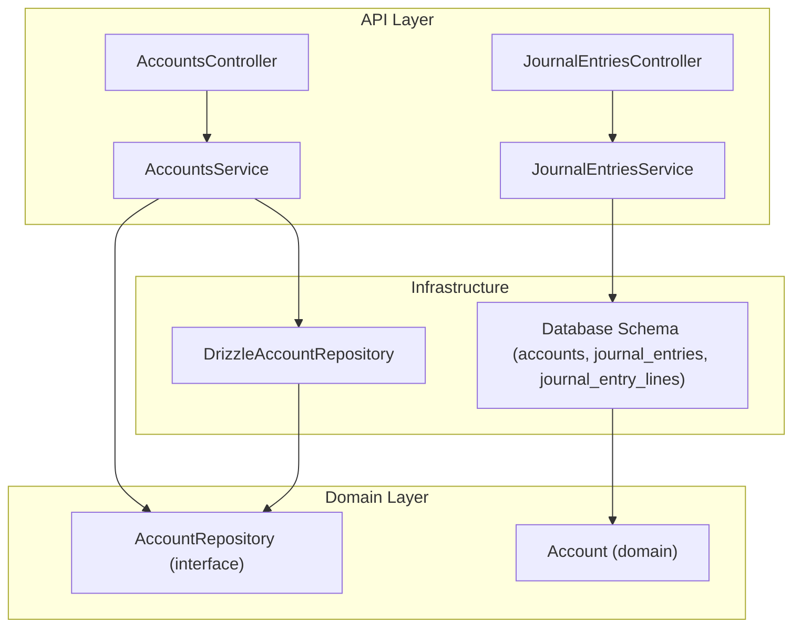
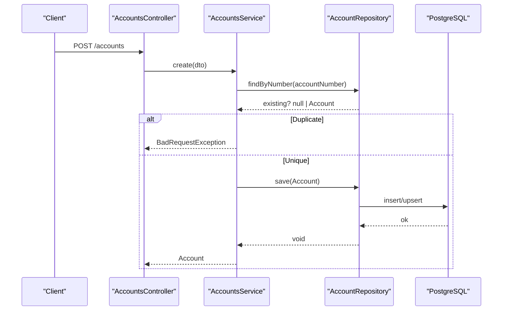
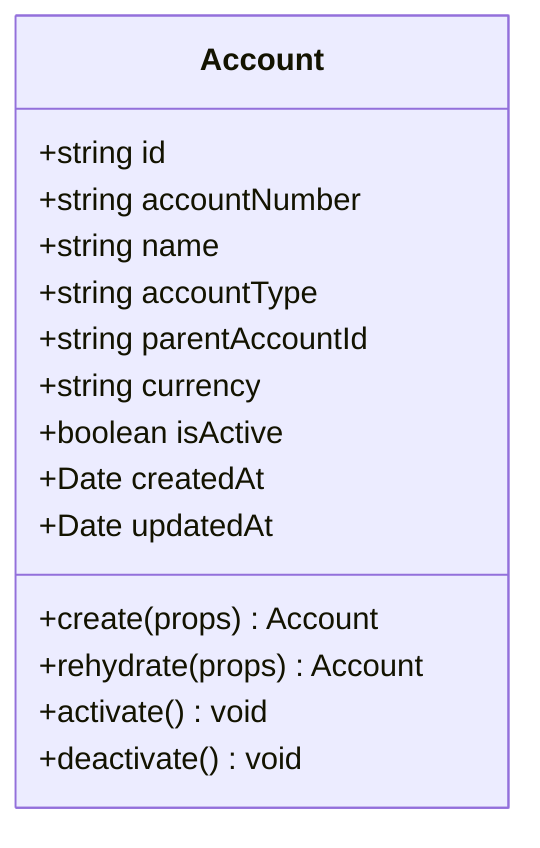
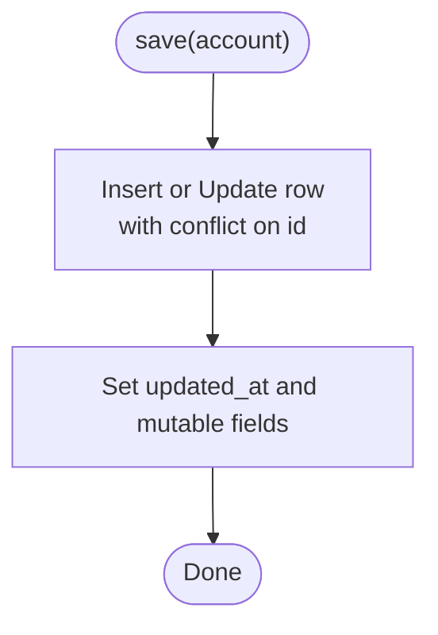
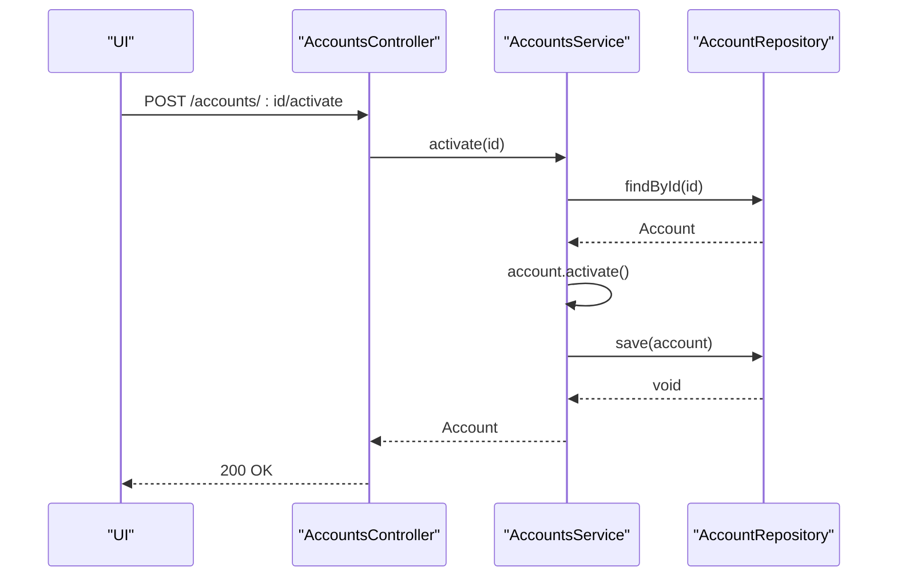
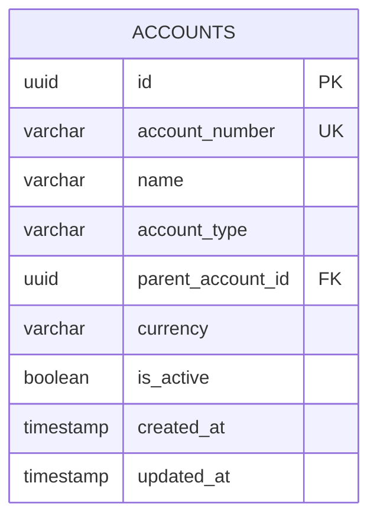
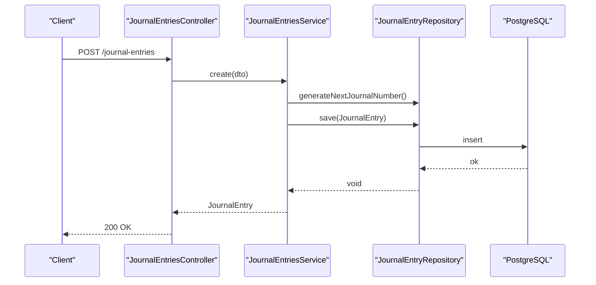
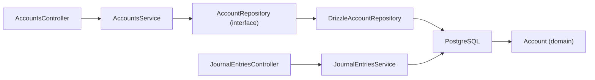

# Chart of Accounts

<cite>
**Referenced Files in This Document**
- [0031-chart-of-accounts.md](file://docs/rfcs/0031-chart-of-accounts.md)
- [0032-general-ledger-and-journal-entries.md](file://docs/rfcs/0032-general-ledger-and-journal-entries.md)
- [account.ts](file://packages/finance/src/accounts/account.ts)
- [account.repository.ts](file://packages/finance/src/accounts/account.repository.ts)
- [accounts.controller.ts](file://apps/api/src/accounts/accounts.controller.ts)
- [accounts.service.ts](file://apps/api/src/accounts/accounts.service.ts)
- [dtos.ts](file://apps/api/src/accounts/dtos.ts)
- [drizzle-account.repository.ts](file://apps/api/src/infrastructure/repositories/drizzle-account.repository.ts)
- [accounts.ts](file://packages/database/src/schema/accounts.ts)
- [journal-entries.controller.ts](file://apps/api/src/journal-entries/journal-entries.controller.ts)
- [journal-entries.service.ts](file://apps/api/src/journal-entries/journal-entries.service.ts)
- [journal-entries.ts](file://packages/database/src/schema/journal-entries.ts)
</cite>

## Table of Contents
1. [Introduction](#introduction)
2. [Project Structure](#project-structure)
3. [Core Components](#core-components)
4. [Architecture Overview](#architecture-overview)
5. [Detailed Component Analysis](#detailed-component-analysis)
6. [Dependency Analysis](#dependency-analysis)
7. [Performance Considerations](#performance-considerations)
8. [Troubleshooting Guide](#troubleshooting-guide)
9. [Conclusion](#conclusion)

## Introduction
This document explains the Chart of Accounts system and its integration with the double-entry accounting model. It covers account hierarchy, account types (Assets, Liabilities, Equity, Revenue, Expenses), categorization rules, creation and maintenance workflows, validation constraints, status management, and how accounts participate in journal entries and general ledger posting.

## Project Structure
The Chart of Accounts spans domain models, API controllers/services, repository implementations, and database schemas:
- Domain model and repository interface are defined in the finance package.
- API endpoints for account CRUD and lifecycle actions live under apps/api.
- Database schema definitions reside in packages/database.
- Journal entries and lines are modeled alongside accounts to support double-entry bookkeeping.

**Diagram sources**
- [accounts.controller.ts:1-39](file://apps/api/src/accounts/accounts.controller.ts#L1-L39)
- [accounts.service.ts:1-69](file://apps/api/src/accounts/accounts.service.ts#L1-L69)
- [account.ts:1-85](file://packages/finance/src/accounts/account.ts#L1-L85)
- [account.repository.ts:1-15](file://packages/finance/src/accounts/account.repository.ts#L1-L15)
- [drizzle-account.repository.ts:1-88](file://apps/api/src/infrastructure/repositories/drizzle-account.repository.ts#L1-L88)
- [accounts.ts:1-35](file://packages/database/src/schema/accounts.ts#L1-L35)
- [journal-entries.ts:1-66](file://packages/database/src/schema/journal-entries.ts#L1-L66)

**Section sources**
- [accounts.controller.ts:1-39](file://apps/api/src/accounts/accounts.controller.ts#L1-L39)
- [accounts.service.ts:1-69](file://apps/api/src/accounts/accounts.service.ts#L1-L69)
- [account.ts:1-85](file://packages/finance/src/accounts/account.ts#L1-L85)
- [account.repository.ts:1-15](file://packages/finance/src/accounts/account.repository.ts#L1-L15)
- [drizzle-account.repository.ts:1-88](file://apps/api/src/infrastructure/repositories/drizzle-account.repository.ts#L1-L88)
- [accounts.ts:1-35](file://packages/database/src/schema/accounts.ts#L1-L35)
- [journal-entries.ts:1-66](file://packages/database/src/schema/journal-entries.ts#L1-L66)

## Core Components
- Account domain model: Defines account type enumeration, properties, creation, activation/deactivation, and default currency behavior.
- Account repository interface: Declares find-by-id, find-by-number, find-many with filters, and save operations.
- API controller and service: Expose REST endpoints for creating, listing, retrieving, activating, and deactivating accounts; enforce uniqueness on account number at the application layer.
- Repository implementation: Maps database rows to domain objects, supports filtering by type, active status, and search terms, and persists changes via upsert.
- Database schema: Defines accounts table with unique account_number, parent_account_id for hierarchy, currency, and active flag; indexes optimize queries by type and active status.

Key responsibilities:
- Validation: Required fields enforced in domain creation; duplicate account numbers rejected at the service layer.
- Hierarchy: Parent-child relationships supported via parent_account_id.
- Status management: Active/inactive toggles maintained through domain methods and persisted.

**Section sources**
- [account.ts:1-85](file://packages/finance/src/accounts/account.ts#L1-L85)
- [account.repository.ts:1-15](file://packages/finance/src/accounts/account.repository.ts#L1-L15)
- [accounts.controller.ts:1-39](file://apps/api/src/accounts/accounts.controller.ts#L1-L39)
- [accounts.service.ts:1-69](file://apps/api/src/accounts/accounts.service.ts#L1-L69)
- [drizzle-account.repository.ts:1-88](file://apps/api/src/infrastructure/repositories/drizzle-account.repository.ts#L1-L88)
- [accounts.ts:1-35](file://packages/database/src/schema/accounts.ts#L1-L35)

## Architecture Overview
The Chart of Accounts integrates with journal entries to enable double-entry bookkeeping. Accounts serve as the primary dimension for debits and credits. Journal entries reference accounts via foreign keys and must balance total debits and credits before posting.

**Diagram sources**
- [accounts.controller.ts:10-13](file://apps/api/src/accounts/accounts.controller.ts#L10-L13)
- [accounts.service.ts:19-36](file://apps/api/src/accounts/accounts.service.ts#L19-L36)
- [drizzle-account.repository.ts:63-86](file://apps/api/src/infrastructure/repositories/drizzle-account.repository.ts#L63-L86)
- [accounts.ts:11-31](file://packages/database/src/schema/accounts.ts#L11-L31)

## Detailed Component Analysis

### Account Domain Model
The Account class encapsulates core attributes and behaviors:
- Types: Asset, Liability, Equity, Revenue, Expense.
- Creation: Validates required fields, trims inputs, sets defaults (currency INR, isActive true).
- Lifecycle: activate() and deactivate() update state and timestamps.

**Diagram sources**
- [account.ts:1-85](file://packages/finance/src/accounts/account.ts#L1-L85)

**Section sources**
- [account.ts:1-85](file://packages/finance/src/accounts/account.ts#L1-L85)

### Account Repository Interface and Implementation
- Interface defines query capabilities and persistence.
- Drizzle implementation provides:
  - findById, findByNumber, findMany with filters (type, active, search), and save with upsert semantics.
  - Mapping from database rows to domain Account objects.

**Diagram sources**
- [drizzle-account.repository.ts:63-86](file://apps/api/src/infrastructure/repositories/drizzle-account.repository.ts#L63-L86)

**Section sources**
- [account.repository.ts:1-15](file://packages/finance/src/accounts/account.repository.ts#L1-L15)
- [drizzle-account.repository.ts:1-88](file://apps/api/src/infrastructure/repositories/drizzle-account.repository.ts#L1-L88)

### API Endpoints and Validation
- Create account: POST /accounts
- List accounts: GET /accounts?accountType&isActive&search
- Get account: GET /accounts/:id
- Activate: POST /accounts/:id/activate
- Deactivate: POST /accounts/:id/deactivate

Validation rules:
- Account number required and unique across the chart.
- Name required.
- Account type must be a valid enum value.
- Optional parent account ID for hierarchy.
- Optional currency; defaults applied in domain.

**Diagram sources**
- [accounts.controller.ts:29-32](file://apps/api/src/accounts/accounts.controller.ts#L29-L32)
- [accounts.service.ts:55-60](file://apps/api/src/accounts/accounts.service.ts#L55-L60)

**Section sources**
- [accounts.controller.ts:1-39](file://apps/api/src/accounts/accounts.controller.ts#L1-L39)
- [accounts.service.ts:1-69](file://apps/api/src/accounts/accounts.service.ts#L1-L69)
- [dtos.ts:1-35](file://apps/api/src/accounts/dtos.ts#L1-L35)

### Database Schema and Indexes
- accounts table includes:
  - Unique account_number
  - parent_account_id for hierarchical rollups
  - currency with default
  - is_active flag
  - Timestamps
- Indexes:
  - accounts_account_type_idx
  - accounts_is_active_idx

**Diagram sources**
- [accounts.ts:11-31](file://packages/database/src/schema/accounts.ts#L11-L31)

**Section sources**
- [accounts.ts:1-35](file://packages/database/src/schema/accounts.ts#L1-L35)

### Integration with Journal Entries
Journal entries reference accounts and enforce double-entry balancing:
- journal_entries stores header metadata and status.
- journal_entry_lines store per-account debit/credit amounts and link back to accounts.
- Posting requires balanced debits and credits; posted entries are immutable; adjustments use reversing entries.

**Diagram sources**
- [journal-entries.controller.ts:10-13](file://apps/api/src/journal-entries/journal-entries.controller.ts#L10-L13)
- [journal-entries.service.ts:18-29](file://apps/api/src/journal-entries/journal-entries.service.ts#L18-L29)
- [journal-entries.ts:13-33](file://packages/database/src/schema/journal-entries.ts#L13-L33)

**Section sources**
- [journal-entries.controller.ts:1-48](file://apps/api/src/journal-entries/journal-entries.controller.ts#L1-L48)
- [journal-entries.service.ts:1-74](file://apps/api/src/journal-entries/journal-entries.service.ts#L1-L74)
- [journal-entries.ts:1-66](file://packages/database/src/schema/journal-entries.ts#L1-L66)

## Dependency Analysis
- Controllers depend on services for business logic.
- Services depend on repository interfaces; concrete Drizzle repositories implement persistence.
- Domain models are independent of infrastructure; mapping occurs in repositories.
- Database schema enforces referential integrity between journal entry lines and accounts.

**Diagram sources**
- [accounts.controller.ts:1-39](file://apps/api/src/accounts/accounts.controller.ts#L1-L39)
- [accounts.service.ts:1-69](file://apps/api/src/accounts/accounts.service.ts#L1-L69)
- [account.repository.ts:1-15](file://packages/finance/src/accounts/account.repository.ts#L1-L15)
- [drizzle-account.repository.ts:1-88](file://apps/api/src/infrastructure/repositories/drizzle-account.repository.ts#L1-L88)
- [journal-entries.controller.ts:1-48](file://apps/api/src/journal-entries/journal-entries.controller.ts#L1-L48)
- [journal-entries.service.ts:1-74](file://apps/api/src/journal-entries/journal-entries.service.ts#L1-L74)

**Section sources**
- [accounts.controller.ts:1-39](file://apps/api/src/accounts/accounts.controller.ts#L1-L39)
- [accounts.service.ts:1-69](file://apps/api/src/accounts/accounts.service.ts#L1-L69)
- [account.repository.ts:1-15](file://packages/finance/src/accounts/account.repository.ts#L1-L15)
- [drizzle-account.repository.ts:1-88](file://apps/api/src/infrastructure/repositories/drizzle-account.repository.ts#L1-L88)
- [journal-entries.controller.ts:1-48](file://apps/api/src/journal-entries/journal-entries.controller.ts#L1-L48)
- [journal-entries.service.ts:1-74](file://apps/api/src/journal-entries/journal-entries.service.ts#L1-L74)

## Performance Considerations
- Use indexes on account_type and is_active to accelerate filtered list queries.
- Leverage search term matching on name and account_number for efficient lookups.
- Avoid unnecessary joins; load journal entry lines only when needed.
- Prefer upsert patterns to reduce write contention during account updates.

[No sources needed since this section provides general guidance]

## Troubleshooting Guide
Common issues and resolutions:
- Duplicate account number: The service rejects creation if an account with the same number exists. Ensure unique numbering conventions.
- Missing required fields: Domain creation throws errors if account number or name are empty; validate inputs before calling create.
- Not found errors: Service throws when retrieving non-existent accounts; verify IDs and data consistency.
- Balance not zero: Journal entries cannot be posted unless total debits equal total credits; review line items and adjust accordingly.

**Section sources**
- [accounts.service.ts:19-36](file://apps/api/src/accounts/accounts.service.ts#L19-L36)
- [accounts.service.ts:47-53](file://apps/api/src/accounts/accounts.service.ts#L47-L53)
- [account.ts:49-68](file://packages/finance/src/accounts/account.ts#L49-L68)
- [0032-general-ledger-and-journal-entries.md:55-59](file://docs/rfcs/0032-general-ledger-and-journal-entries.md#L55-L59)

## Conclusion
The Chart of Accounts provides a robust foundation for financial recordkeeping within the system. It enforces clear validation, supports hierarchical organization, and integrates tightly with journal entries to maintain double-entry integrity. With well-defined APIs, domain-driven models, and indexed database schemas, it enables scalable and reliable accounting operations.

[No sources needed since this section summarizes without analyzing specific files]