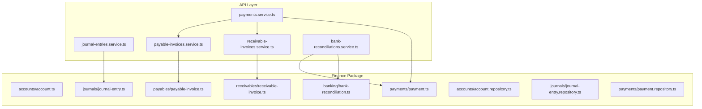
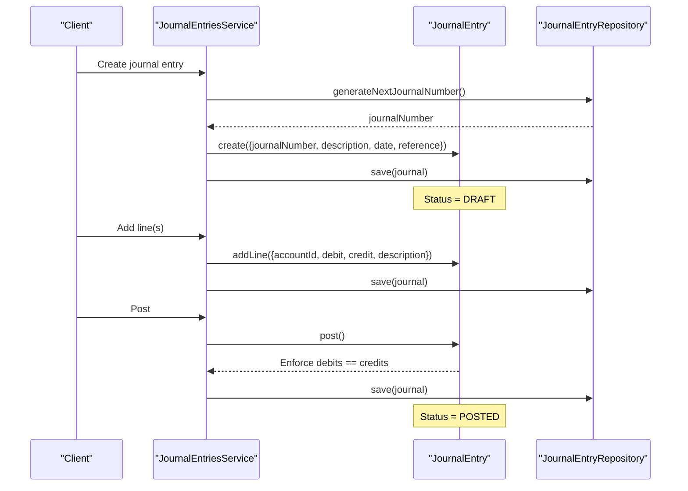
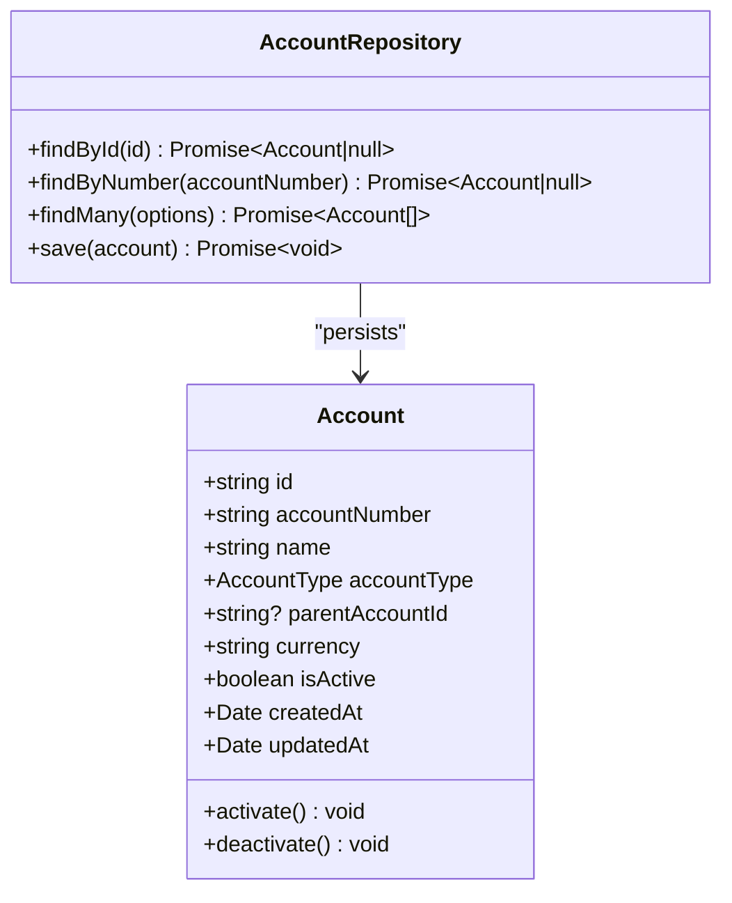
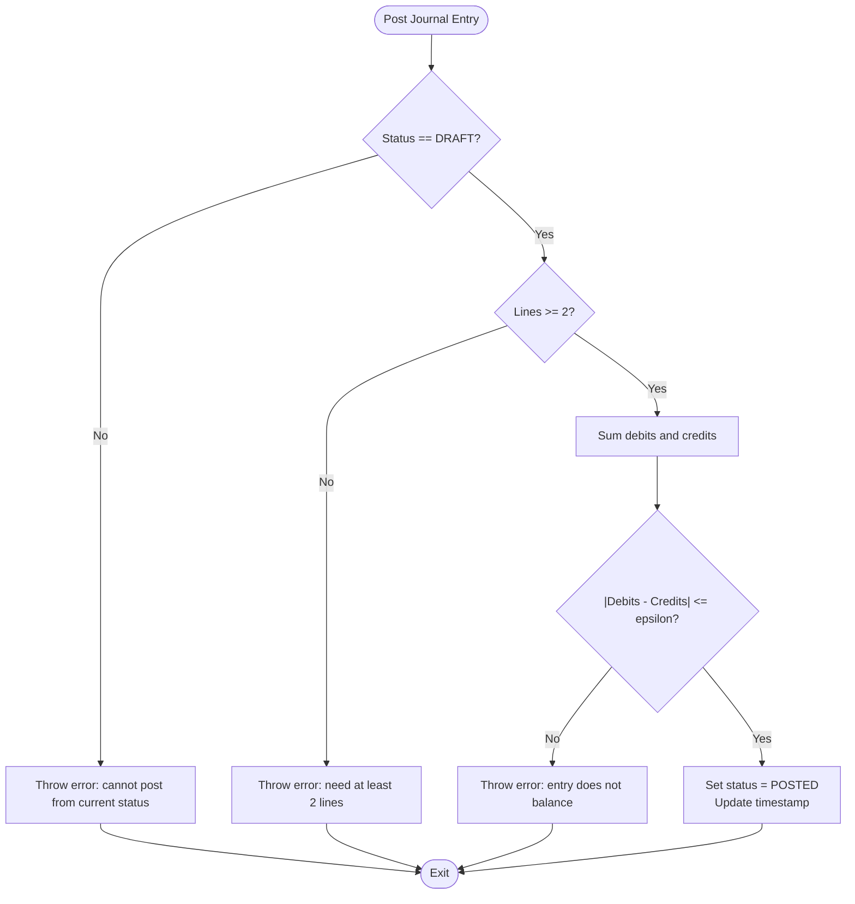
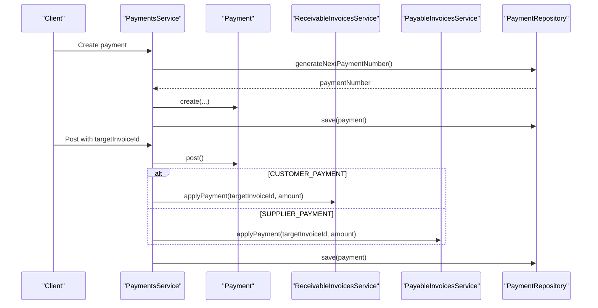
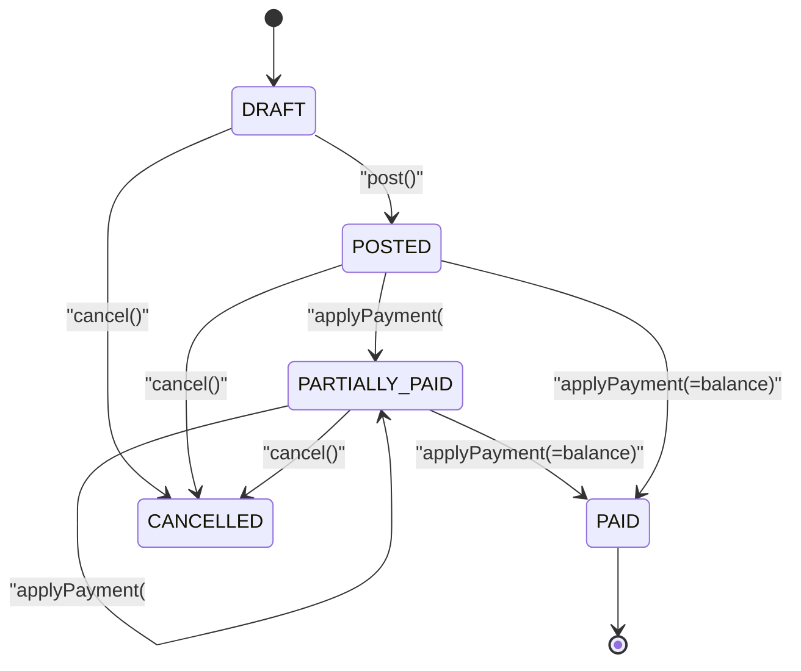
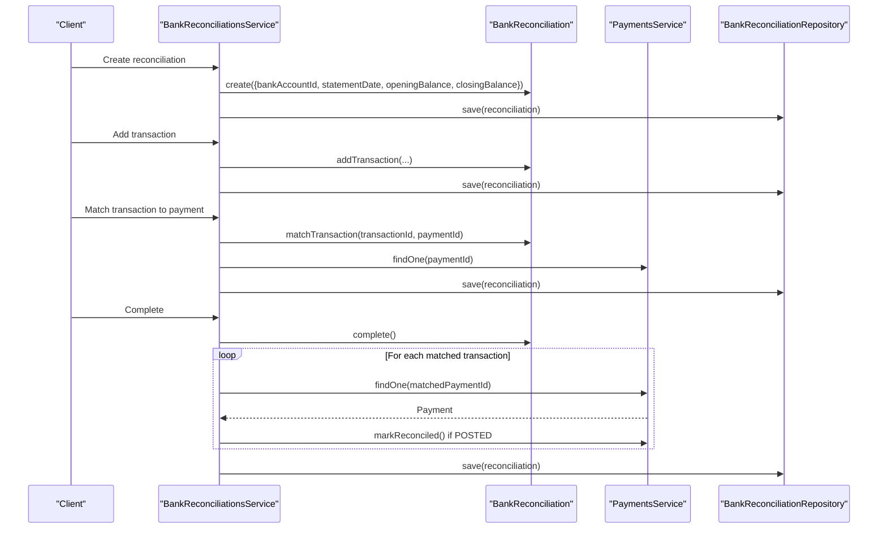
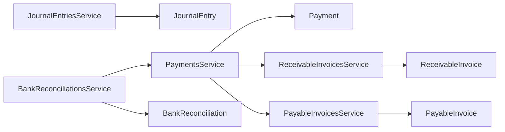

# Finance Domain

<cite>
**Referenced Files in This Document**
- [index.ts](file://packages/finance/src/index.ts)
- [account.ts](file://packages/finance/src/accounts/account.ts)
- [account.repository.ts](file://packages/finance/src/accounts/account.repository.ts)
- [journal-entry.ts](file://packages/finance/src/journals/journal-entry.ts)
- [journal-entry.repository.ts](file://packages/finance/src/journals/journal-entry.repository.ts)
- [payment.ts](file://packages/finance/src/payments/payment.ts)
- [payment.repository.ts](file://packages/finance/src/payments/payment.repository.ts)
- [receivable-invoice.ts](file://packages/finance/src/receivables/receivable-invoice.ts)
- [payable-invoice.ts](file://packages/finance/src/payables/payable-invoice.ts)
- [bank-reconciliation.ts](file://packages/finance/src/banking/bank-reconciliation.ts)
- [journal-entries.service.ts](file://apps/api/src/journal-entries/journal-entries.service.ts)
- [payments.service.ts](file://apps/api/src/payments/payments.service.ts)
- [receivable-invoices.service.ts](file://apps/api/src/receivable-invoices/receivable-invoices.service.ts)
- [payable-invoices.service.ts](file://apps/api/src/payable-invoices/payable-invoices.service.ts)
- [bank-reconciliations.service.ts](file://apps/api/src/bank-reconciliations/bank-reconciliations.service.ts)
</cite>

## Table of Contents
1. Introduction
2. Project Structure
3. Core Components
4. Architecture Overview
5. Detailed Component Analysis
6. Dependency Analysis
7. Performance Considerations
8. Troubleshooting Guide
9. Conclusion

## Introduction
This document explains the Finance Domain package implementation that models financial accounting with a double-entry system, chart of accounts, journal entries, payments processing, invoice management (receivables and payables), and bank reconciliation. It details business rules for debit/credit operations, account balancing, state transitions, and integration points between domain entities and API services. Concrete examples are referenced via file paths to demonstrate journal entry creation, payment allocation, and invoice reconciliation workflows.

## Project Structure
The Finance Domain is implemented as a reusable package exposing domain models, repositories interfaces, and related utilities. The API layer composes these domain objects through NestJS services that orchestrate persistence and cross-domain interactions.

**Diagram sources**
- [index.ts:1-7](file://packages/finance/src/index.ts#L1-L7)
- [account.ts:1-85](file://packages/finance/src/accounts/account.ts#L1-L85)
- [journal-entry.ts:1-158](file://packages/finance/src/journals/journal-entry.ts#L1-L158)
- [payment.ts:1-106](file://packages/finance/src/payments/payment.ts#L1-L106)
- [receivable-invoice.ts:1-112](file://packages/finance/src/receivables/receivable-invoice.ts#L1-L112)
- [payable-invoice.ts:1-112](file://packages/finance/src/payables/payable-invoice.ts#L1-L112)
- [bank-reconciliation.ts:1-138](file://packages/finance/src/banking/bank-reconciliation.ts#L1-L138)
- [journal-entries.service.ts:1-74](file://apps/api/src/journal-entries/journal-entries.service.ts#L1-L74)
- [payments.service.ts:1-88](file://apps/api/src/payments/payments.service.ts#L1-L88)
- [receivable-invoices.service.ts:1-78](file://apps/api/src/receivable-invoices/receivable-invoices.service.ts#L1-L78)
- [payable-invoices.service.ts:1-76](file://apps/api/src/payable-invoices/payable-invoices.service.ts#L1-L76)
- [bank-reconciliations.service.ts:1-97](file://apps/api/src/bank-reconciliations/bank-reconciliations.service.ts#L1-L97)

**Section sources**
- [index.ts:1-7](file://packages/finance/src/index.ts#L1-L7)

## Core Components
- Chart of Accounts: Defines account types and hierarchy via parent-child relationships and currency context.
- Journal Entries: Double-entry ledger with strict balance enforcement at post time; supports draft/post/reverse/void states.
- Payments: Encapsulates payment lifecycle and status transitions; integrates with receivables/payables for allocation.
- Receivable Invoices: Tracks customer invoices, balances, and partial/full payment application.
- Payable Invoices: Tracks supplier invoices, balances, and partial/full payment application.
- Bank Reconciliation: Matches bank statement transactions to posted payments and enforces completion only when all items are matched.

Key business rules:
- Debits must equal credits for a posted journal entry.
- Lines can be added only to draft journals; posting requires at least two lines.
- Payments cannot be cancelled once reconciled; only posted payments can be marked reconciled.
- Invoice payment application validates non-negative amounts and does not exceed remaining balance.
- Bank reconciliation completion requires all transactions matched.

**Section sources**
- [account.ts:1-85](file://packages/finance/src/accounts/account.ts#L1-L85)
- [journal-entry.ts:1-158](file://packages/finance/src/journals/journal-entry.ts#L1-L158)
- [payment.ts:1-106](file://packages/finance/src/payments/payment.ts#L1-L106)
- [receivable-invoice.ts:1-112](file://packages/finance/src/receivables/receivable-invoice.ts#L1-L112)
- [payable-invoice.ts:1-112](file://packages/finance/src/payables/payable-invoice.ts#L1-L112)
- [bank-reconciliation.ts:1-138](file://packages/finance/src/banking/bank-reconciliation.ts#L1-L138)

## Architecture Overview
The finance domain follows a layered architecture:
- Domain layer (packages/finance): Entities and repository interfaces encapsulate business logic and invariants.
- Application/API layer (apps/api): Services coordinate use cases, enforce cross-entity workflows, and persist via repositories.

**Diagram sources**
- [journal-entries.service.ts:18-74](file://apps/api/src/journal-entries/journal-entries.service.ts#L18-L74)
- [journal-entry.ts:65-140](file://packages/finance/src/journals/journal-entry.ts#L65-L140)
- [journal-entry.repository.ts:1-15](file://packages/finance/src/journals/journal-entry.repository.ts#L1-L15)

**Section sources**
- [journal-entries.service.ts:1-74](file://apps/api/src/journal-entries/journal-entries.service.ts#L1-L74)
- [journal-entry.ts:1-158](file://packages/finance/src/journals/journal-entry.ts#L1-L158)
- [journal-entry.repository.ts:1-15](file://packages/finance/src/journals/journal-entry.repository.ts#L1-L15)

## Detailed Component Analysis

### Chart of Accounts
- Account model supports hierarchical structure via parentAccountId and typed categories (ASSET, LIABILITY, EQUITY, REPOSITORY, EXPENSE).
- Creation enforces required fields and defaults currency; activation/deactivation toggles isActive with timestamp updates.
- Repository interface provides query capabilities by type, active status, and search.

**Diagram sources**
- [account.ts:1-85](file://packages/finance/src/accounts/account.ts#L1-L85)
- [account.repository.ts:1-15](file://packages/finance/src/accounts/account.repository.ts#L1-L15)

**Section sources**
- [account.ts:1-85](file://packages/finance/src/accounts/account.ts#L1-L85)
- [account.repository.ts:1-15](file://packages/finance/src/accounts/account.repository.ts#L1-L15)

### Journal Entries (Double-Entry Accounting)
- JournalEntry enforces:
  - Only draft entries accept new lines.
  - Non-negative debit/credit per line; at least one positive amount per line.
  - Posting requires minimum two lines and exact balance (debits equals credits within tolerance).
  - State transitions: DRAFT -> POSTED; POSTED -> REVERSED; DRAFT -> VOID.
- Service orchestrates number generation, persistence, and state changes.

**Diagram sources**
- [journal-entry.ts:120-140](file://packages/finance/src/journals/journal-entry.ts#L120-L140)

**Section sources**
- [journal-entry.ts:1-158](file://packages/finance/src/journals/journal-entry.ts#L1-L158)
- [journal-entries.service.ts:18-74](file://apps/api/src/journal-entries/journal-entries.service.ts#L18-L74)

### Payments Processing and Allocation
- Payment model enforces:
  - Positive amount on creation.
  - Status transitions: DRAFT -> POSTED; POSTED -> RECONCILED; DRAFT/CANCELLED allowed under constraints.
- Service auto-allocates payment to target invoice when posting:
  - CUSTOMER_PAYMENT -> ReceivableInvoice.applyPayment
  - SUPPLIER_PAYMENT -> PayableInvoice.applyPayment

**Diagram sources**
- [payments.service.ts:23-79](file://apps/api/src/payments/payments.service.ts#L23-L79)
- [payment.ts:58-106](file://packages/finance/src/payments/payment.ts#L58-L106)
- [receivable-invoices.service.ts:61-69](file://apps/api/src/receivable-invoices/receivable-invoices.service.ts#L61-L69)
- [payable-invoices.service.ts:59-67](file://apps/api/src/payable-invoices/payable-invoices.service.ts#L59-L67)

**Section sources**
- [payment.ts:1-106](file://packages/finance/src/payments/payment.ts#L1-L106)
- [payments.service.ts:1-88](file://apps/api/src/payments/payments.service.ts#L1-L88)

### Receivable Invoices (Accounts Receivable)
- ReceivableInvoice tracks amount, balance, due date, and status transitions:
  - DRAFT -> POSTED
  - Apply payment reduces balance; sets PARTIALLY_PAID or PAID accordingly.
  - Paid invoices cannot be cancelled.

**Diagram sources**
- [receivable-invoice.ts:52-111](file://packages/finance/src/receivables/receivable-invoice.ts#L52-L111)

**Section sources**
- [receivable-invoice.ts:1-112](file://packages/finance/src/receivables/receivable-invoice.ts#L1-L112)
- [receivable-invoices.service.ts:18-78](file://apps/api/src/receivable-invoices/receivable-invoices.service.ts#L18-L78)

### Payable Invoices (Accounts Payable)
- PayableInvoice mirrors receivable behavior for suppliers:
  - DRAFT -> POSTED
  - Apply payment reduces balance; sets PARTIALLY_PAID or PAID.
  - Paid invoices cannot be cancelled.

**Diagram sources**
- [payable-invoice.ts:52-111](file://packages/finance/src/payables/payable-invoice.ts#L52-L111)

**Section sources**
- [payable-invoice.ts:1-112](file://packages/finance/src/payables/payable-invoice.ts#L1-L112)
- [payable-invoices.service.ts:18-76](file://apps/api/src/payable-invoices/payable-invoices.service.ts#L18-L76)

### Bank Reconciliation
- BankReconciliation manages statement matching:
  - Transactions can be added only during IN_PROGRESS.
  - matchTransaction links a bank transaction to a posted payment.
  - complete() enforces all transactions matched; marks matched payments RECONCILED if they are POSTED.

**Diagram sources**
- [bank-reconciliations.service.ts:24-97](file://apps/api/src/bank-reconciliations/bank-reconciliations.service.ts#L24-L97)
- [bank-reconciliation.ts:65-138](file://packages/finance/src/banking/bank-reconciliation.ts#L65-L138)
- [payment.ts:82-106](file://packages/finance/src/payments/payment.ts#L82-L106)

**Section sources**
- [bank-reconciliation.ts:1-138](file://packages/finance/src/banking/bank-reconciliation.ts#L1-L138)
- [bank-reconciliations.service.ts:1-97](file://apps/api/src/bank-reconciliations/bank-reconciliations.service.ts#L1-L97)

## Dependency Analysis
- Domain entities depend on core utilities (e.g., ObjectId) for identifiers.
- API services depend on domain entities and repository interfaces; they also coordinate across domains (payments to receivables/payables; reconciliation to payments).
- Repository interfaces decouple persistence from business logic, enabling testability and future implementation swaps.

**Diagram sources**
- [journal-entries.service.ts:1-74](file://apps/api/src/journal-entries/journal-entries.service.ts#L1-L74)
- [payments.service.ts:1-88](file://apps/api/src/payments/payments.service.ts#L1-L88)
- [receivable-invoices.service.ts:1-78](file://apps/api/src/receivable-invoices/receivable-invoices.service.ts#L1-L78)
- [payable-invoices.service.ts:1-76](file://apps/api/src/payable-invoices/payable-invoices.service.ts#L1-L76)
- [bank-reconciliations.service.ts:1-97](file://apps/api/src/bank-reconciliations/bank-reconciliations.service.ts#L1-L97)

**Section sources**
- [journal-entries.service.ts:1-74](file://apps/api/src/journal-entries/journal-entries.service.ts#L1-L74)
- [payments.service.ts:1-88](file://apps/api/src/payments/payments.service.ts#L1-L88)
- [receivable-invoices.service.ts:1-78](file://apps/api/src/receivable-invoices/receivable-invoices.service.ts#L1-L78)
- [payable-invoices.service.ts:1-76](file://apps/api/src/payable-invoices/payable-invoices.service.ts#L1-L76)
- [bank-reconciliations.service.ts:1-97](file://apps/api/src/bank-reconciliations/bank-reconciliations.service.ts#L1-L97)

## Performance Considerations
- Journal posting computes totals over lines; keep line counts reasonable to avoid heavy reductions.
- Payment allocation triggers additional service calls; batch operations where possible to reduce round-trips.
- Bank reconciliation iterates matched transactions to update payment statuses; consider indexing by paymentId for large datasets.
- Repository queries support filtering by status/type; leverage these filters to minimize data transfer.

[No sources needed since this section provides general guidance]

## Troubleshooting Guide
Common errors and their causes:
- Journal entry does not balance: Ensure total debits equal total credits before posting. See validation in post().
- Cannot post journal entry in invalid status: Only DRAFT entries can be posted.
- Cannot add lines to non-draft journal: Modify lines only while status is DRAFT.
- Payment amount must be greater than zero: Validate input before creating a payment.
- Cannot apply payment to invoice in invalid status: Only POSTED or PARTIALLY_PAID invoices accept payments.
- Payment exceeds remaining balance: Ensure applied amount does not exceed outstanding balance.
- Cannot complete reconciliation with unmatched transactions: Match all transactions before completing.
- Reconciled payments cannot be cancelled: Once RECONCILED, cancellation is disallowed.

**Section sources**
- [journal-entry.ts:91-156](file://packages/finance/src/journals/journal-entry.ts#L91-L156)
- [payment.ts:58-106](file://packages/finance/src/payments/payment.ts#L58-L106)
- [receivable-invoice.ts:76-111](file://packages/finance/src/receivables/receivable-invoice.ts#L76-L111)
- [payable-invoice.ts:76-111](file://packages/finance/src/payables/payable-invoice.ts#L76-L111)
- [bank-reconciliation.ts:86-138](file://packages/finance/src/banking/bank-reconciliation.ts#L86-L138)

## Conclusion
The Finance Domain implements a robust double-entry accounting system with clear state machines and invariants for journal entries, payments, and invoices. Receivables and payables provide structured workflows for AR/AP, while bank reconciliation ensures alignment between internal records and external statements. The separation of domain logic from API orchestration enables maintainability, testability, and compliance with accounting standards such as balanced postings and auditable state transitions.

[No sources needed since this section summarizes without analyzing specific files]