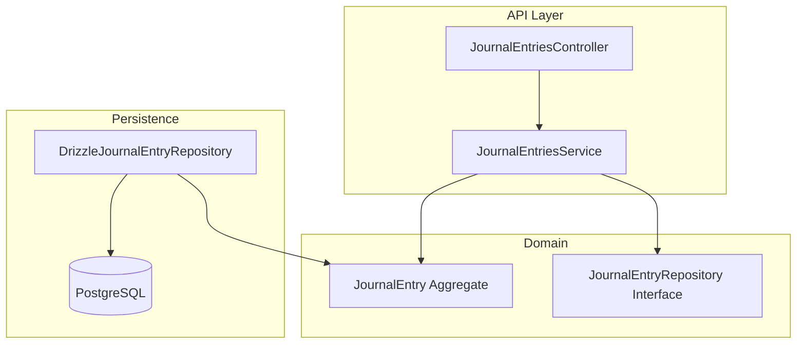
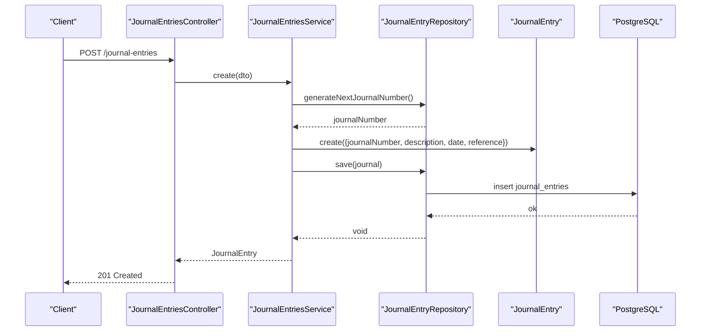
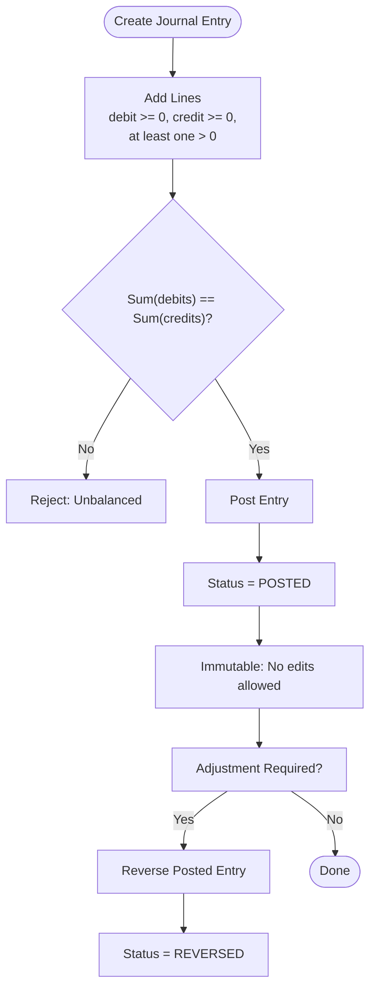
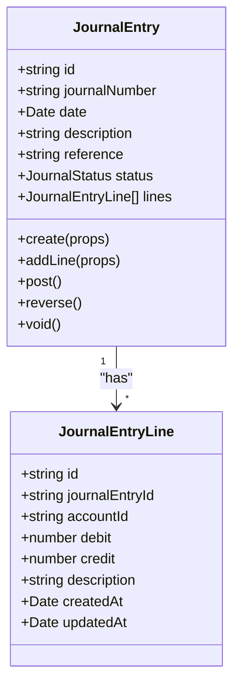
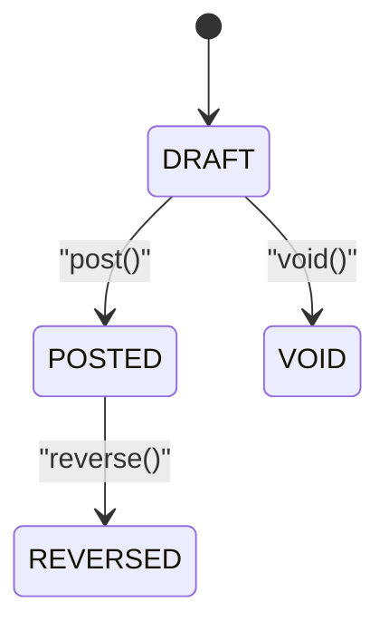
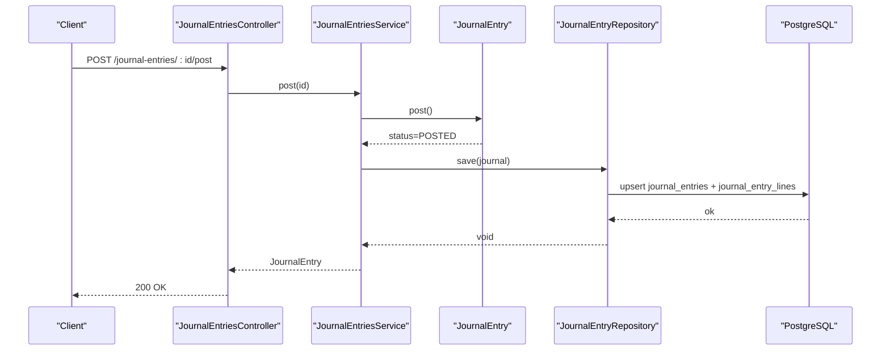
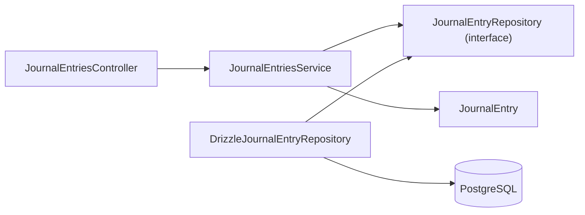

# Journal Entries

<cite>
**Referenced Files in This Document**   
- [0032-general-ledger-and-journal-entries.md](file://docs/rfcs/0032-general-ledger-and-journal-entries.md)
- [journal-entry.ts](file://packages/finance/src/journals/journal-entry.ts)
- [journal-entry.repository.ts](file://packages/finance/src/journals/journal-entry.repository.ts)
- [drizzle-journal-entry.repository.ts](file://apps/api/src/infrastructure/repositories/drizzle-journal-entry.repository.ts)
- [journal-entries.controller.ts](file://apps/api/src/journal-entries/journal-entries.controller.ts)
- [journal-entries.service.ts](file://apps/api/src/journal-entries/journal-entries.service.ts)
- [dtos.ts](file://apps/api/src/journal-entries/dtos.ts)
- [0031-chart-of-accounts.md](file://docs/rfcs/0031-chart-of-accounts.md)
</cite>

## Table of Contents
1. [Introduction](#introduction)
2. [Project Structure](#project-structure)
3. [Core Components](#core-components)
4. [Architecture Overview](#architecture-overview)
5. [Detailed Component Analysis](#detailed-component-analysis)
6. [Dependency Analysis](#dependency-analysis)
7. [Performance Considerations](#performance-considerations)
8. [Troubleshooting Guide](#troubleshooting-guide)
9. [Conclusion](#conclusion)

## Introduction
This document explains the Journal Entries functionality, focusing on double-entry accounting principles, debit/credit mechanics, validation and posting rules, approval-like state transitions, and integration with the general ledger. It also provides examples of common accounting transactions and clarifies how journal entries relate to account balances, audit trails, and compliance requirements.

## Project Structure
The Journal Entries feature spans domain logic, API layer, and persistence:
- Domain model and invariants are implemented in the finance package.
- The NestJS API exposes REST endpoints for creating, editing, posting, reversing, and voiding journal entries.
- A Drizzle-based repository persists journal entries and lines and maps database rows to domain objects.

**Diagram sources**
- [journal-entries.controller.ts:6-46](file://apps/api/src/journal-entries/journal-entries.controller.ts#L6-L46)
- [journal-entries.service.ts:12-72](file://apps/api/src/journal-entries/journal-entries.service.ts#L12-L72)
- [journal-entry.ts:42-157](file://packages/finance/src/journals/journal-entry.ts#L42-L157)
- [journal-entry.repository.ts:8-13](file://packages/finance/src/journals/journal-entry.repository.ts#L8-L13)
- [drizzle-journal-entry.repository.ts:41-138](file://apps/api/src/infrastructure/repositories/drizzle-journal-entry.repository.ts#L41-L138)

**Section sources**
- [journal-entries.controller.ts:6-46](file://apps/api/src/journal-entries/journal-entries.controller.ts#L6-L46)
- [journal-entries.service.ts:12-72](file://apps/api/src/journal-entries/journal-entries.service.ts#L12-L72)
- [journal-entry.ts:42-157](file://packages/finance/src/journals/journal-entry.ts#L42-L157)
- [drizzle-journal-entry.repository.ts:41-138](file://apps/api/src/infrastructure/repositories/drizzle-journal-entry.repository.ts#L41-L138)

## Core Components
- JournalEntry aggregate: Encapsulates double-entry rules, line management, and lifecycle transitions (DRAFT → POSTED → REVERSED or VOID).
- JournalEntryRepository interface: Defines persistence operations and number generation.
- DrizzleJournalEntryRepository: Implements persistence using Drizzle ORM and PostgreSQL.
- JournalEntriesController: Exposes REST endpoints for journal entry operations.
- JournalEntriesService: Orchestrates creation, line addition, posting, reversal, and voiding.
- DTOs: Validate input for creation and line addition.

Key responsibilities:
- Enforce non-negative debits/credits and at least one positive amount per line.
- Ensure total debits equal total credits before posting.
- Prevent modifications after posting; adjustments require reversal.
- Provide unique sequential journal numbers per year.

**Section sources**
- [journal-entry.ts:42-157](file://packages/finance/src/journals/journal-entry.ts#L42-L157)
- [journal-entry.repository.ts:8-13](file://packages/finance/src/journals/journal-entry.repository.ts#L8-L13)
- [drizzle-journal-entry.repository.ts:41-138](file://apps/api/src/infrastructure/repositories/drizzle-journal-entry.repository.ts#L41-L138)
- [journal-entries.controller.ts:6-46](file://apps/api/src/journal-entries/journal-entries.controller.ts#L6-L46)
- [journal-entries.service.ts:12-72](file://apps/api/src/journal-entries/journal-entries.service.ts#L12-L72)
- [dtos.ts:10-40](file://apps/api/src/journal-entries/dtos.ts#L10-L40)

## Architecture Overview
The system follows a layered architecture:
- Controller handles HTTP requests and delegates to service.
- Service coordinates domain logic via the JournalEntry aggregate and persistence via repository.
- Repository abstracts data access and maps between domain models and database records.

**Diagram sources**
- [journal-entries.controller.ts:10-13](file://apps/api/src/journal-entries/journal-entries.controller.ts#L10-L13)
- [journal-entries.service.ts:18-29](file://apps/api/src/journal-entries/journal-entries.service.ts#L18-L29)
- [drizzle-journal-entry.repository.ts:133-138](file://apps/api/src/infrastructure/repositories/drizzle-journal-entry.repository.ts#L133-L138)
- [journal-entry.ts:65-85](file://packages/finance/src/journals/journal-entry.ts#L65-L85)

## Detailed Component Analysis

### Double-Entry Accounting Principles and Posting Rules
- Every journal entry must balance: Sum(Debits) equals Sum(Credits).
- Lines cannot have negative amounts; each line must specify either a positive debit or credit.
- At least two lines are required to post an entry.
- Once posted, entries are immutable; corrections use reversal.

**Diagram sources**
- [journal-entry.ts:91-118](file://packages/finance/src/journals/journal-entry.ts#L91-L118)
- [journal-entry.ts:120-140](file://packages/finance/src/journals/journal-entry.ts#L120-L140)
- [journal-entry.ts:142-156](file://packages/finance/src/journals/journal-entry.ts#L142-L156)

**Section sources**
- [journal-entry.ts:91-156](file://packages/finance/src/journals/journal-entry.ts#L91-L156)
- [0032-general-ledger-and-journal-entries.md:55-63](file://docs/rfcs/0032-general-ledger-and-journal-entries.md#L55-L63)

### Journal Entry Creation and Validation
- Creation requires a valid journal number, description, optional date, and optional reference.
- Line creation enforces non-negative values and ensures at least one positive amount per line.
- DTOs validate request payloads at the API boundary.

**Diagram sources**
- [journal-entry.ts:5-26](file://packages/finance/src/journals/journal-entry.ts#L5-L26)
- [journal-entry.ts:42-85](file://packages/finance/src/journals/journal-entry.ts#L42-L85)

**Section sources**
- [journal-entry.ts:65-118](file://packages/finance/src/journals/journal-entry.ts#L65-L118)
- [dtos.ts:10-40](file://apps/api/src/journal-entries/dtos.ts#L10-L40)

### Approval Workflow and State Transitions
- Lifecycle states: DRAFT → POSTED → REVERSED or VOID.
- Only DRAFT entries can be edited or voided.
- Only POSTED entries can be reversed.
- Posting validates balance and minimum line count.

**Diagram sources**
- [journal-entry.ts:120-156](file://packages/finance/src/journals/journal-entry.ts#L120-L156)
- [0032-general-ledger-and-journal-entries.md:61-63](file://docs/rfcs/0032-general-ledger-and-journal-entries.md#L61-L63)

**Section sources**
- [journal-entry.ts:120-156](file://packages/finance/src/journals/journal-entry.ts#L120-L156)
- [0032-general-ledger-and-journal-entries.md:61-63](file://docs/rfcs/0032-general-ledger-and-journal-entries.md#L61-L63)

### Posting to General Ledger
- Posting is represented by transitioning the journal entry to POSTED and persisting it.
- The repository persists both the journal header and its lines.
- Cross-module integrations (receivables, payables, payments, inventory valuation) consume posted entries to update account balances and reports.

**Diagram sources**
- [journal-entries.controller.ts:33-36](file://apps/api/src/journal-entries/journal-entries.controller.ts#L33-L36)
- [journal-entries.service.ts:53-58](file://apps/api/src/journal-entries/journal-entries.service.ts#L53-L58)
- [journal-entry.ts:120-140](file://packages/finance/src/journals/journal-entry.ts#L120-L140)
- [drizzle-journal-entry.repository.ts:89-131](file://apps/api/src/infrastructure/repositories/drizzle-journal-entry.repository.ts#L89-L131)

**Section sources**
- [journal-entries.controller.ts:33-36](file://apps/api/src/journal-entries/journal-entries.controller.ts#L33-L36)
- [journal-entries.service.ts:53-58](file://apps/api/src/journal-entries/journal-entries.service.ts#L53-L58)
- [drizzle-journal-entry.repository.ts:89-131](file://apps/api/src/infrastructure/repositories/drizzle-journal-entry.repository.ts#L89-L131)

### Examples of Common Accounting Transactions
- Sales: Debit Accounts Receivable, Credit Revenue.
- Purchase: Debit Inventory or Expense, Credit Accounts Payable.
- Adjustment: Debit/Credit appropriate asset or expense accounts to correct balances.
- Period-end closing: Transfer temporary accounts to retained earnings or closing accounts.

These examples align with the requirement that every entry balances and uses active accounts from the chart of accounts.

**Section sources**
- [0032-general-ledger-and-journal-entries.md:69-71](file://docs/rfcs/0032-general-ledger-and-journal-entries.md#L69-L71)
- [0031-chart-of-accounts.md:55-59](file://docs/rfcs/0031-chart-of-accounts.md#L55-L59)

### Relationship Between Journal Entries and Account Balances
- Journal lines reference accounts from the chart of accounts.
- Inactive accounts should not receive new postings.
- Posted entries contribute to cumulative account balances used in financial statements.

**Section sources**
- [0031-chart-of-accounts.md:55-59](file://docs/rfcs/0031-chart-of-accounts.md#L55-L59)
- [0032-general-ledger-and-journal-entries.md:69-71](file://docs/rfcs/0032-general-ledger-and-journal-entries.md#L69-L71)

### Audit Trails and Compliance Requirements
- Journal entries maintain timestamps and status transitions for auditability.
- Posted entries are immutable; changes require reversal, preserving a clear audit trail.
- Unique journal numbers provide traceability across periods.

**Section sources**
- [journal-entry.ts:65-85](file://packages/finance/src/journals/journal-entry.ts#L65-L85)
- [journal-entry.ts:120-156](file://packages/finance/src/journals/journal-entry.ts#L120-L156)
- [drizzle-journal-entry.repository.ts:133-138](file://apps/api/src/infrastructure/repositories/drizzle-journal-entry.repository.ts#L133-L138)

## Dependency Analysis
The following diagram shows key dependencies among components:

**Diagram sources**
- [journal-entries.controller.ts:6-46](file://apps/api/src/journal-entries/journal-entries.controller.ts#L6-L46)
- [journal-entries.service.ts:12-72](file://apps/api/src/journal-entries/journal-entries.service.ts#L12-L72)
- [journal-entry.repository.ts:8-13](file://packages/finance/src/journals/journal-entry.repository.ts#L8-L13)
- [drizzle-journal-entry.repository.ts:41-138](file://apps/api/src/infrastructure/repositories/drizzle-journal-entry.repository.ts#L41-L138)

**Section sources**
- [journal-entries.controller.ts:6-46](file://apps/api/src/journal-entries/journal-entries.controller.ts#L6-L46)
- [journal-entries.service.ts:12-72](file://apps/api/src/journal-entries/journal-entries.service.ts#L12-L72)
- [journal-entry.repository.ts:8-13](file://packages/finance/src/journals/journal-entry.repository.ts#L8-L13)
- [drizzle-journal-entry.repository.ts:41-138](file://apps/api/src/infrastructure/repositories/drizzle-journal-entry.repository.ts#L41-L138)

## Performance Considerations
- Use pagination and filters when listing journal entries to reduce payload size.
- Batch operations where possible; the repository already upserts lines efficiently.
- Avoid unnecessary rehydration of large datasets; query only needed fields.
- Indexes on status and date columns support efficient filtering and reporting.

[No sources needed since this section provides general guidance]

## Troubleshooting Guide
Common issues and resolutions:
- Cannot add lines to non-DRAFT entries: Ensure the journal entry is still in DRAFT before adding lines.
- Negative debit or credit amounts: Validate inputs; only non-negative values are allowed.
- Empty line amounts: Each line must have either a positive debit or credit.
- Unbalanced entry: Total debits must equal total credits before posting.
- Posting invalid state: Only DRAFT entries can be posted; only POSTED entries can be reversed; only DRAFT entries can be voided.

**Section sources**
- [journal-entry.ts:91-118](file://packages/finance/src/journals/journal-entry.ts#L91-L118)
- [journal-entry.ts:120-156](file://packages/finance/src/journals/journal-entry.ts#L120-L156)

## Conclusion
The Journal Entries module implements robust double-entry accounting with strict validation, immutable posted records, and clear state transitions. It integrates with the chart of accounts and supports cross-module financial flows. The design emphasizes correctness, auditability, and extensibility for future features such as recurring entries and period-end closing procedures.

[No sources needed since this section summarizes without analyzing specific files]