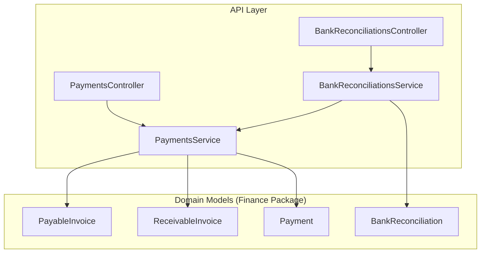
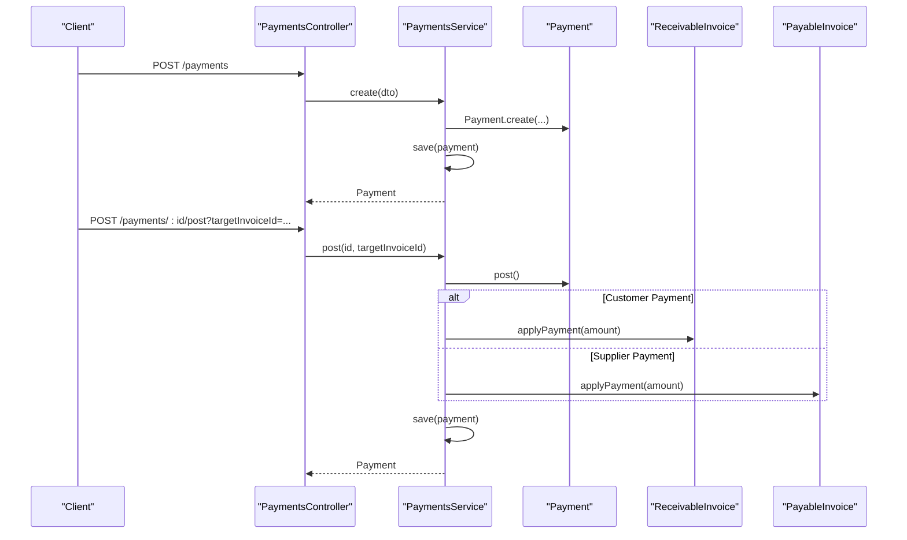
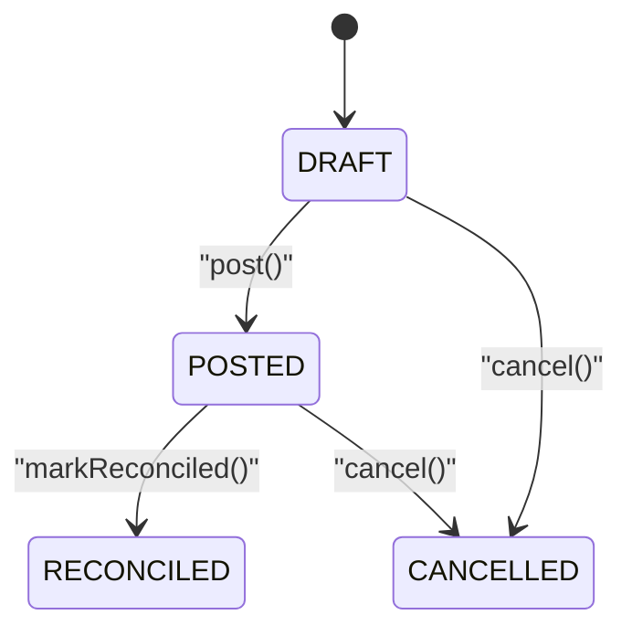
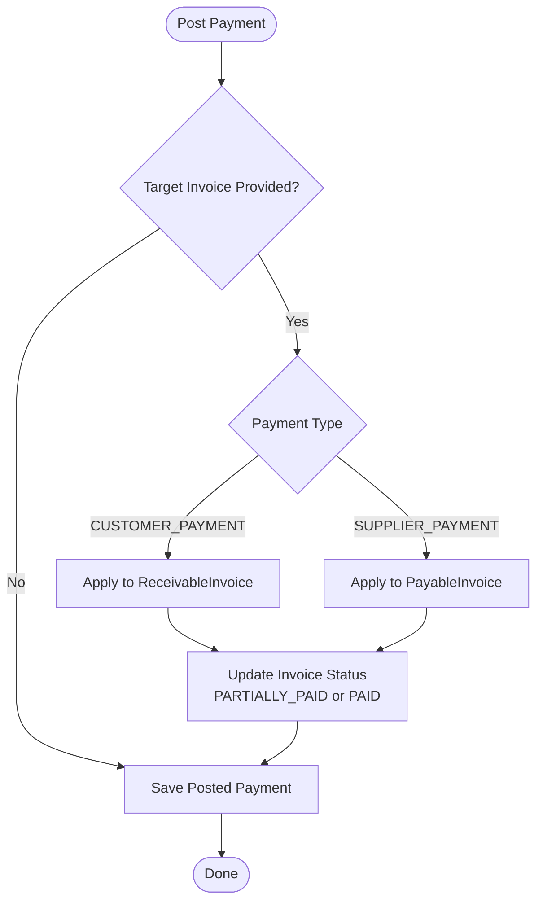
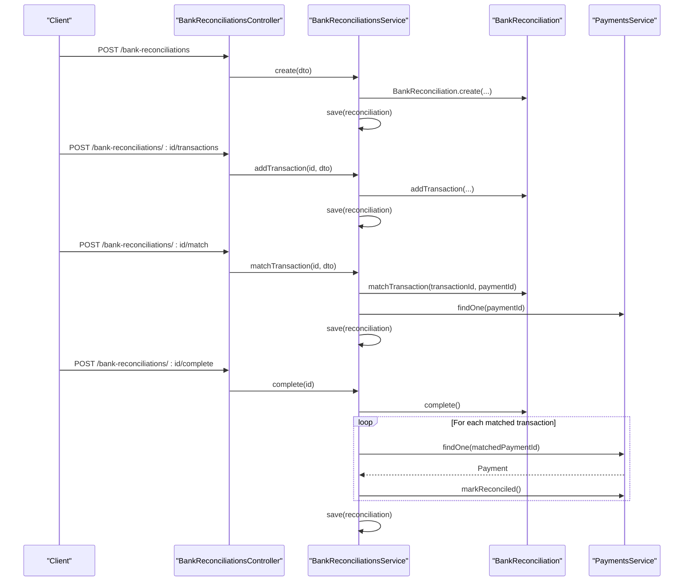
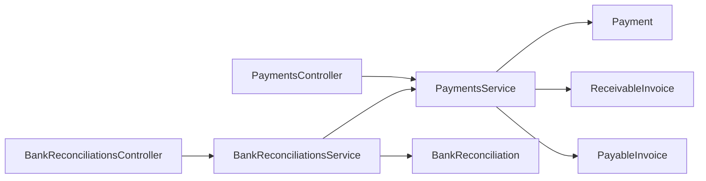

# Payments Processing

<cite>
**Referenced Files in This Document**
- [0035-payments-and-bank-reconciliation.md](file://docs/rfcs/0035-payments-and-bank-reconciliation.md)
- [payments.controller.ts](file://apps/api/src/payments/payments.controller.ts)
- [payments.service.ts](file://apps/api/src/payments/payments.service.ts)
- [dtos.ts](file://apps/api/src/payments/dtos.ts)
- [bank-reconciliations.controller.ts](file://apps/api/src/bank-reconciliations/bank-reconciliations.controller.ts)
- [bank-reconciliations.service.ts](file://apps/api/src/bank-reconciliations/bank-reconciliations.service.ts)
- [payment.ts](file://packages/finance/src/payments/payment.ts)
- [bank-reconciliation.ts](file://packages/finance/src/banking/bank-reconciliation.ts)
- [payable-invoice.ts](file://packages/finance/src/payables/payable-invoice.ts)
- [receivable-invoice.ts](file://packages/finance/src/receivables/receivable-invoice.ts)
- [index.ts](file://packages/finance/src/index.ts)
</cite>

## Table of Contents
1. [Introduction](#introduction)
2. [Project Structure](#project-structure)
3. [Core Components](#core-components)
4. [Architecture Overview](#architecture-overview)
5. [Detailed Component Analysis](#detailed-component-analysis)
6. [Dependency Analysis](#dependency-analysis)
7. [Performance Considerations](#performance-considerations)
8. [Troubleshooting Guide](#troubleshooting-guide)
9. [Conclusion](#conclusion)

## Introduction
This document explains the Payment Processing system, covering the end-to-end lifecycle from payment initiation to completion and reconciliation. It documents supported payment methods, routing logic for allocating payments to invoices, handling partial payments and holds, and the bank reconciliation workflow that ties internal payments to external bank statements. It also outlines validation rules, error handling, and integration points with receivables and payables modules.

The system supports:
- Payment types: customer payments, supplier payments, internal transfers, refunds
- Payment methods: wire transfer, check, credit card, cash, ACH
- Payment states: draft, posted, reconciled, cancelled
- Reconciliation states: in progress, completed, cancelled

## Project Structure
Payment processing is implemented across API controllers/services and shared domain models in the finance package:
- API layer exposes REST endpoints for creating, posting, cancelling payments and managing bank reconciliations
- Domain models define state machines and business rules for payments and reconciliations
- Receivables and Payables modules provide invoice entities used for allocation

**Diagram sources**
- [payments.controller.ts:6-41](file://apps/api/src/payments/payments.controller.ts#L6-L41)
- [payments.service.ts:14-87](file://apps/api/src/payments/payments.service.ts#L14-L87)
- [bank-reconciliations.controller.ts:10-46](file://apps/api/src/bank-reconciliations/bank-reconciliations.controller.ts#L10-L46)
- [bank-reconciliations.service.ts:16-96](file://apps/api/src/bank-reconciliations/bank-reconciliations.service.ts#L16-L96)
- [payment.ts:33-105](file://packages/finance/src/payments/payment.ts#L33-L105)
- [bank-reconciliation.ts:42-137](file://packages/finance/src/banking/bank-reconciliation.ts#L42-L137)
- [receivable-invoice.ts:27-111](file://packages/finance/src/receivables/receivable-invoice.ts#L27-L111)
- [payable-invoice.ts:27-111](file://packages/finance/src/payables/payable-invoice.ts#L27-L111)

**Section sources**
- [payments.controller.ts:6-41](file://apps/api/src/payments/payments.controller.ts#L6-L41)
- [payments.service.ts:14-87](file://apps/api/src/payments/payments.service.ts#L14-L87)
- [bank-reconciliations.controller.ts:10-46](file://apps/api/src/bank-reconciliations/bank-reconciliations.controller.ts#L10-L46)
- [bank-reconciliations.service.ts:16-96](file://apps/api/src/bank-reconciliations/bank-reconciliations.service.ts#L16-L96)
- [payment.ts:33-105](file://packages/finance/src/payments/payment.ts#L33-L105)
- [bank-reconciliation.ts:42-137](file://packages/finance/src/banking/bank-reconciliation.ts#L42-L137)
- [receivable-invoice.ts:27-111](file://packages/finance/src/receivables/receivable-invoice.ts#L27-L111)
- [payable-invoice.ts:27-111](file://packages/finance/src/payables/payable-invoice.ts#L27-L111)

## Core Components
- PaymentsController: Exposes endpoints to create, list, retrieve, post, and cancel payments. Supports filtering by payment type, bank account, and status.
- PaymentsService: Orchestrates payment creation, posting, cancellation, and optional automatic allocation to a target invoice based on payment type.
- BankReconciliationsController: Exposes endpoints to create reconciliation sessions, add bank transactions, match transactions to payments, and complete reconciliation.
- BankReconciliationsService: Manages reconciliation session lifecycle, transaction matching, and marks matched payments as reconciled upon completion.
- Payment (domain): Defines payment attributes, validation, and state transitions (draft → posted → reconciled/cancelled).
- BankReconciliation (domain): Defines reconciliation session, transaction management, matching, and completion constraints.
- ReceivableInvoice and PayableInvoice (domains): Provide applyPayment behavior supporting partial payments and full settlement.

Key responsibilities:
- Validate input amounts and statuses
- Enforce state machine transitions
- Allocate payments to invoices when specified
- Synchronize reconciliation status with payment records

**Section sources**
- [payments.controller.ts:6-41](file://apps/api/src/payments/payments.controller.ts#L6-L41)
- [payments.service.ts:23-87](file://apps/api/src/payments/payments.service.ts#L23-L87)
- [bank-reconciliations.controller.ts:10-46](file://apps/api/src/bank-reconciliations/bank-reconciliations.controller.ts#L10-L46)
- [bank-reconciliations.service.ts:24-96](file://apps/api/src/bank-reconciliations/bank-reconciliations.service.ts#L24-L96)
- [payment.ts:33-105](file://packages/finance/src/payments/payment.ts#L33-L105)
- [bank-reconciliation.ts:42-137](file://packages/finance/src/banking/bank-reconciliation.ts#L42-L137)
- [receivable-invoice.ts:84-101](file://packages/finance/src/receivables/receivable-invoice.ts#L84-L101)
- [payable-invoice.ts:84-101](file://packages/finance/src/payables/payable-invoice.ts#L84-L101)

## Architecture Overview
The payment flow integrates API endpoints, application services, domain aggregates, and cross-module invoice services.

**Diagram sources**
- [payments.controller.ts:10-35](file://apps/api/src/payments/payments.controller.ts#L10-L35)
- [payments.service.ts:23-79](file://apps/api/src/payments/payments.service.ts#L23-L79)
- [payment.ts:58-88](file://packages/finance/src/payments/payment.ts#L58-L88)
- [receivable-invoice.ts:84-101](file://packages/finance/src/receivables/receivable-invoice.ts#L84-L101)
- [payable-invoice.ts:84-101](file://packages/finance/src/payables/payable-invoice.ts#L84-L101)

## Detailed Component Analysis

### Payment Lifecycle
- Creation: Validates amount > 0, assigns number, sets status DRAFT
- Posting: Transitions DRAFT → POSTED; optionally allocates to a target invoice if provided
- Reconciliation: Only POSTED payments can be marked RECONCILED
- Cancellation: Prevents cancellation of RECONCILED payments

**Diagram sources**
- [payment.ts:58-104](file://packages/finance/src/payments/payment.ts#L58-L104)

**Section sources**
- [payment.ts:58-104](file://packages/finance/src/payments/payment.ts#L58-L104)
- [payments.service.ts:58-87](file://apps/api/src/payments/payments.service.ts#L58-L87)

### Payment Allocation to Invoices
- Automatic allocation occurs during posting when a target invoice ID is provided
- For CUSTOMER_PAYMENT, applies to ReceivableInvoice
- For SUPPLIER_PAYMENT, applies to PayableInvoice
- Partial payments are supported; invoice status updates to PARTIALLY_PAID or PAID accordingly

**Diagram sources**
- [payments.service.ts:58-79](file://apps/api/src/payments/payments.service.ts#L58-L79)
- [receivable-invoice.ts:84-101](file://packages/finance/src/receivables/receivable-invoice.ts#L84-L101)
- [payable-invoice.ts:84-101](file://packages/finance/src/payables/payable-invoice.ts#L84-L101)

**Section sources**
- [payments.service.ts:58-79](file://apps/api/src/payments/payments.service.ts#L58-L79)
- [receivable-invoice.ts:84-101](file://packages/finance/src/receivables/receivable-invoice.ts#L84-L101)
- [payable-invoice.ts:84-101](file://packages/finance/src/payables/payable-invoice.ts#L84-L101)

### Bank Reconciliation Workflow
- Create reconciliation session with bank account, statement date, opening/closing balances
- Add bank transactions (date, description, amount)
- Match bank transactions to posted payments
- Complete reconciliation only when all transactions are matched; marks matched payments as RECONCILED

**Diagram sources**
- [bank-reconciliations.controller.ts:14-45](file://apps/api/src/bank-reconciliations/bank-reconciliations.controller.ts#L14-L45)
- [bank-reconciliations.service.ts:24-96](file://apps/api/src/bank-reconciliations/bank-reconciliations.service.ts#L24-L96)
- [bank-reconciliation.ts:86-136](file://packages/finance/src/banking/bank-reconciliation.ts#L86-L136)
- [payment.ts:90-96](file://packages/finance/src/payments/payment.ts#L90-L96)

**Section sources**
- [bank-reconciliations.controller.ts:14-45](file://apps/api/src/bank-reconciliations/bank-reconciliations.controller.ts#L14-L45)
- [bank-reconciliations.service.ts:24-96](file://apps/api/src/bank-reconciliations/bank-reconciliations.service.ts#L24-L96)
- [bank-reconciliation.ts:86-136](file://packages/finance/src/banking/bank-reconciliation.ts#L86-L136)

### Payment Validation and Error Handling
- Amount validation: Must be greater than zero at creation and application
- State enforcement: Posting only allowed from DRAFT; marking reconciled only allowed from POSTED; cancellation blocked for RECONCILED
- Invoice payment application: Only allowed for POSTED or PARTIALLY_PAID invoices; prevents overpayment beyond remaining balance

Examples of validation and errors:
- Payment creation validates amount > 0
- Posting enforces DRAFT → POSTED transition
- Marking reconciled enforces POSTED → RECONCILED transition
- Cancellation disallows RECONCILED payments
- Invoice applyPayment enforces valid states and non-negative amounts not exceeding balance

**Section sources**
- [payment.ts:58-104](file://packages/finance/src/payments/payment.ts#L58-L104)
- [receivable-invoice.ts:84-101](file://packages/finance/src/receivables/receivable-invoice.ts#L84-L101)
- [payable-invoice.ts:84-101](file://packages/finance/src/payables/payable-invoice.ts#L84-L101)

### Payment Methods, Routing, and Types
- Supported payment types: CUSTOMER_PAYMENT, SUPPLIER_PAYMENT, INTERNAL_TRANSFER, REFUND
- Supported payment methods: WIRE_TRANSFER, CHECK, CREDIT_CARD, CASH, ACH
- Routing logic: During posting, if a target invoice is provided, the system routes allocation to either receivables or payables based on payment type

**Section sources**
- [payment.ts:3-9](file://packages/finance/src/payments/payment.ts#L3-L9)
- [payments.service.ts:58-79](file://apps/api/src/payments/payments.service.ts#L58-L79)

### Automated Payment Processing
- Automated posting and allocation: When a payment is posted with a target invoice ID, the system automatically applies the payment to the corresponding invoice based on payment type
- Reconciliation automation: Upon completing a reconciliation, the system iterates matched transactions and marks associated payments as RECONCILED

**Section sources**
- [payments.service.ts:58-79](file://apps/api/src/payments/payments.service.ts#L58-L79)
- [bank-reconciliations.service.ts:79-96](file://apps/api/src/bank-reconciliations/bank-reconciliations.service.ts#L79-L96)

### Manual Payment Entry
- Manual entry via API: Clients can create payments with required fields (type, method, amount), optional reference and bank account, and optional target invoice for immediate allocation
- DTO validation ensures minimum amount and correct types

**Section sources**
- [dtos.ts:10-34](file://apps/api/src/payments/dtos.ts#L10-L34)
- [payments.controller.ts:10-13](file://apps/api/src/payments/payments.controller.ts#L10-L13)

### Integration with Banking Systems
- Bank reconciliation endpoints allow importing bank transactions and matching them to internal payments
- Future extensions include automated bank feed imports (OFX/MT940) and AI-assisted fuzzy matching

**Section sources**
- [bank-reconciliations.controller.ts:32-45](file://apps/api/src/bank-reconciliations/bank-reconciliations.controller.ts#L32-L45)
- [0035-payments-and-bank-reconciliation.md:102-104](file://docs/rfcs/0035-payments-and-bank-reconciliation.md#L102-L104)

### Refund Handling
- Refund is a supported payment type within the domain model
- The current implementation does not show explicit refund-specific workflows; refunds would follow standard payment lifecycle and allocation rules

**Section sources**
- [payment.ts:3-9](file://packages/finance/src/payments/payment.ts#L3-L9)

## Dependency Analysis
The following diagram shows key dependencies between API components and domain models:

**Diagram sources**
- [payments.controller.ts:6-41](file://apps/api/src/payments/payments.controller.ts#L6-L41)
- [payments.service.ts:14-87](file://apps/api/src/payments/payments.service.ts#L14-L87)
- [bank-reconciliations.controller.ts:10-46](file://apps/api/src/bank-reconciliations/bank-reconciliations.controller.ts#L10-L46)
- [bank-reconciliations.service.ts:16-96](file://apps/api/src/bank-reconciliations/bank-reconciliations.service.ts#L16-L96)
- [payment.ts:33-105](file://packages/finance/src/payments/payment.ts#L33-L105)
- [receivable-invoice.ts:27-111](file://packages/finance/src/receivables/receivable-invoice.ts#L27-L111)
- [payable-invoice.ts:27-111](file://packages/finance/src/payables/payable-invoice.ts#L27-L111)
- [bank-reconciliation.ts:42-137](file://packages/finance/src/banking/bank-reconciliation.ts#L42-L137)

**Section sources**
- [payments.controller.ts:6-41](file://apps/api/src/payments/payments.controller.ts#L6-L41)
- [payments.service.ts:14-87](file://apps/api/src/payments/payments.service.ts#L14-L87)
- [bank-reconciliations.controller.ts:10-46](file://apps/api/src/bank-reconciliations/bank-reconciliations.controller.ts#L10-L46)
- [bank-reconciliations.service.ts:16-96](file://apps/api/src/bank-reconciliations/bank-reconciliations.service.ts#L16-L96)

## Performance Considerations
- Batch operations: When completing reconciliation, iterating through matched transactions to mark payments as reconciled could be optimized using batch updates if repositories support it
- Query filters: Use query parameters (payment type, bank account, status) to reduce payload sizes and improve listing performance
- Idempotency: Ensure idempotent operations for posting and allocation to handle retries safely

[No sources needed since this section provides general guidance]

## Troubleshooting Guide
Common issues and resolutions:
- Cannot post payment in invalid state: Ensure payment is in DRAFT before posting
- Cannot mark payment reconciled unless POSTED: Post the payment first
- Cannot cancel reconciled payment: Reconciled payments cannot be cancelled; consider reversal workflows outside current scope
- Overpayment on invoice: Ensure payment amount does not exceed remaining invoice balance
- Cannot complete reconciliation with unmatched transactions: Match all bank transactions before completing

Operational checks:
- Verify DTO validations pass (amount > 0, correct enums)
- Confirm invoice statuses allow payment application (POSTED or PARTIALLY_PAID)
- Ensure bank reconciliation is IN_PROGRESS before adding or matching transactions

**Section sources**
- [payment.ts:82-104](file://packages/finance/src/payments/payment.ts#L82-L104)
- [receivable-invoice.ts:84-101](file://packages/finance/src/receivables/receivable-invoice.ts#L84-L101)
- [payable-invoice.ts:84-101](file://packages/finance/src/payables/payable-invoice.ts#L84-L101)
- [bank-reconciliation.ts:108-136](file://packages/finance/src/banking/bank-reconciliation.ts#L108-L136)

## Conclusion
The Payment Processing system provides a robust foundation for recording, posting, allocating, and reconciling financial transactions. It enforces clear state transitions, supports partial payments, and integrates with receivables and payables modules. Bank reconciliation aligns internal payments with external bank statements, ensuring accurate financial reporting. Future enhancements include automated bank feeds and advanced matching capabilities.

[No sources needed since this section summarizes without analyzing specific files]