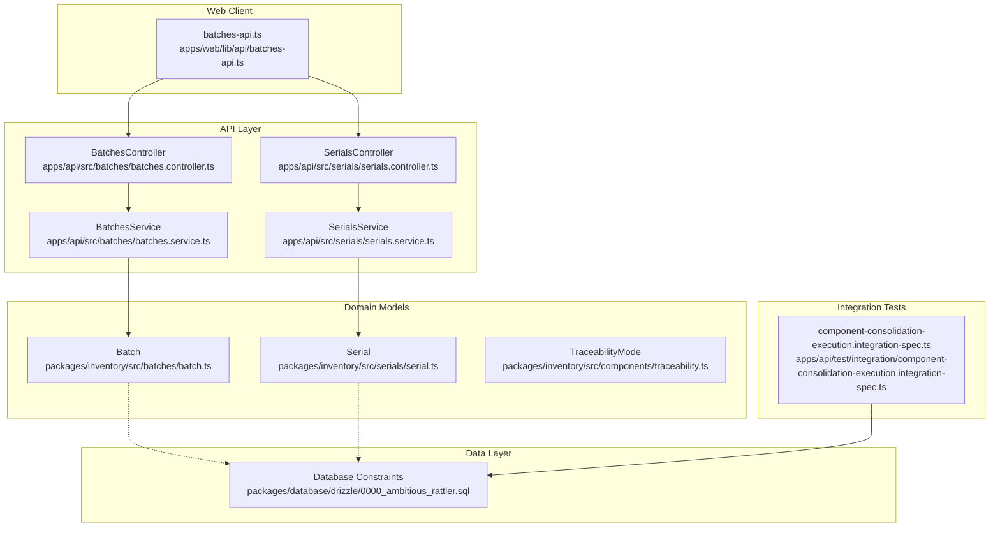
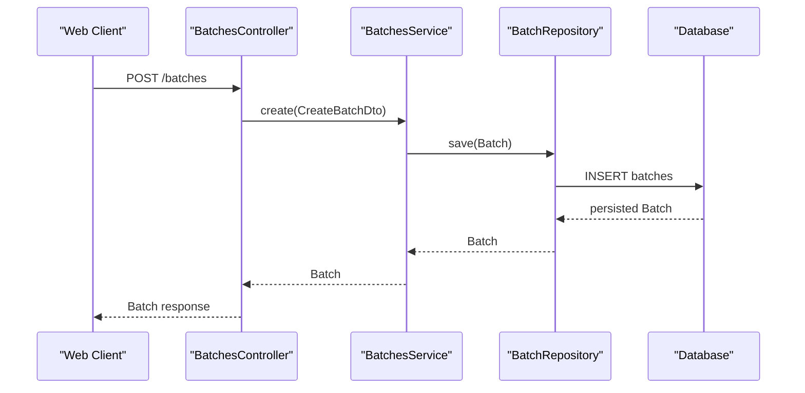
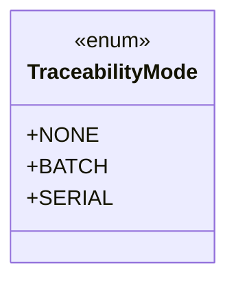
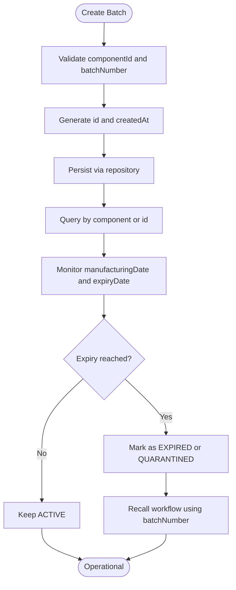
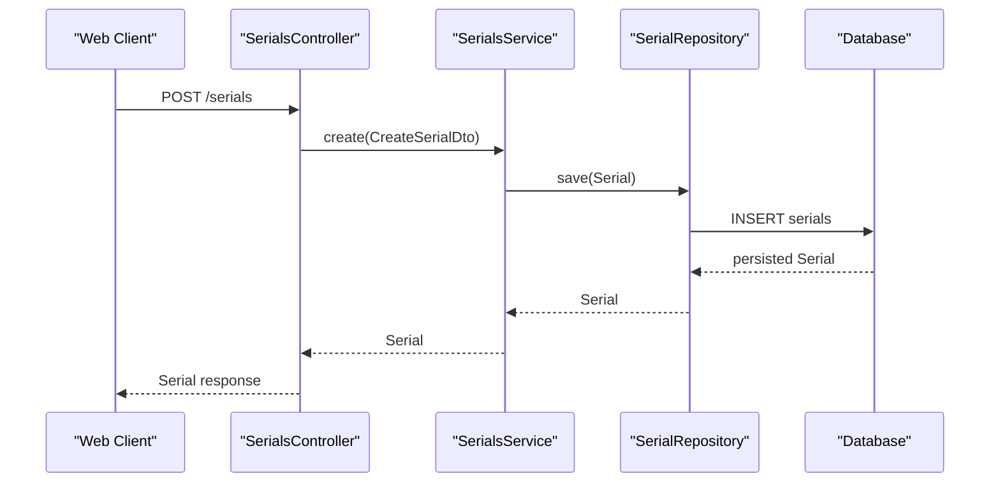
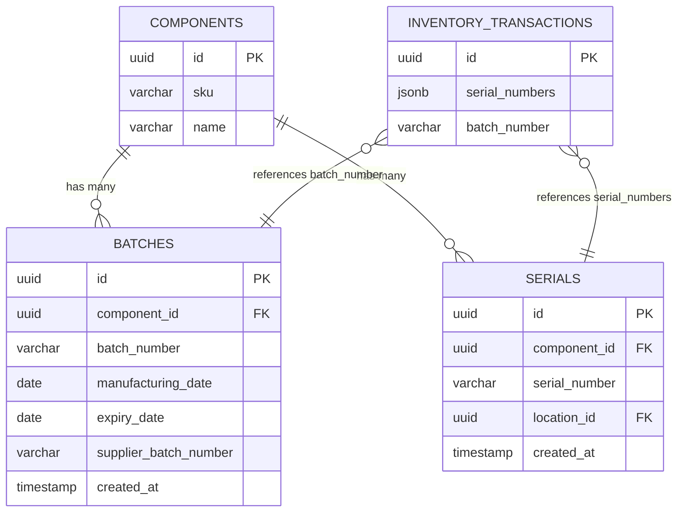
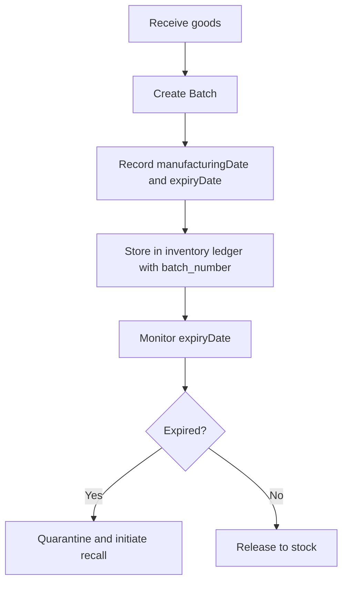
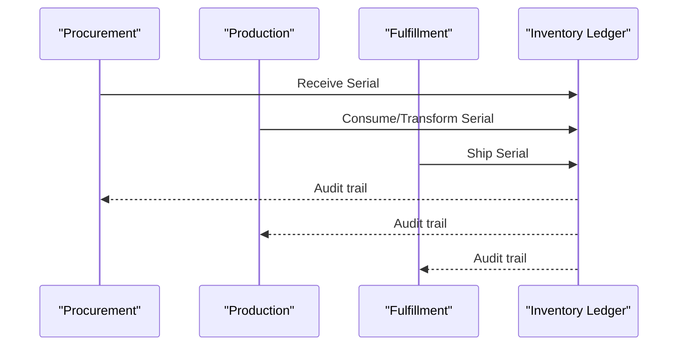
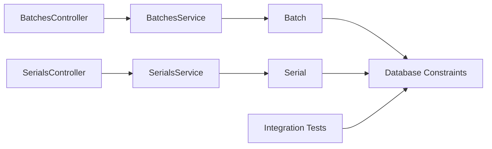

# Batch & Serial Number Tracking

<cite>
**Referenced Files in This Document**
- [0007-batch-and-serial-tracking.md](file://docs/rfcs/0007-batch-and-serial-tracking.md)
- [batch.ts](file://packages/inventory/src/batches/batch.ts)
- [traceability.ts](file://packages/inventory/src/components/traceability.ts)
- [batches.controller.ts](file://apps/api/src/batches/batches.controller.ts)
- [batches.service.ts](file://apps/api/src/batches/batches.service.ts)
- [create-batch.dto.ts](file://apps/api/src/batches/create-batch.dto.ts)
- [serials.controller.ts](file://apps/api/src/serials/serials.controller.ts)
- [serials.service.ts](file://apps/api/src/serials/serials.service.ts)
- [create-serial.dto.ts](file://apps/api/src/serials/create-serial.dto.ts)
- [serial.ts](file://packages/inventory/src/serials/serial.ts)
- [batches-api.ts](file://apps/web/lib/api/batches-api.ts)
- [component-consolidation-execution.integration-spec.ts](file://apps/api/test/integration/component-consolidation-execution.integration-spec.ts)
- [0000_ambitious_rattler.sql](file://packages/database/drizzle/0000_ambitious_rattler.sql)
</cite>

## Table of Contents
1. [Introduction](#introduction)
2. [Project Structure](#project-structure)
3. [Core Components](#core-components)
4. [Architecture Overview](#architecture-overview)
5. [Detailed Component Analysis](#detailed-component-analysis)
6. [Dependency Analysis](#dependency-analysis)
7. [Performance Considerations](#performance-considerations)
8. [Troubleshooting Guide](#troubleshooting-guide)
9. [Conclusion](#conclusion)
10. [Appendices](#appendices)

## Introduction
This document explains the Batch and Serial Number Tracking capabilities implemented in the system. It covers:
- Traceability modes and when to use them
- Batch lifecycle management, including creation, metadata, expiration awareness, and recall workflows
- Serial number generation, assignment, and traceability through inventory movements
- The relationship between batches, serial numbers, and inventory transactions
- Examples for batch-based operations, serial tracking across the supply chain, and compliance reporting
- Regulatory considerations, quality control processes, and audit trail maintenance
- Integration points with manufacturing and quality assurance systems

The design is governed by an accepted RFC that defines traceability as a per-Component extension over the Inventory Ledger, preserving immutable history and consistent inventory semantics.

**Section sources**
- [0007-batch-and-serial-tracking.md:11-18](file://docs/rfcs/0007-batch-and-serial-tracking.md#L11-L18)
- [0007-batch-and-serial-tracking.md:129-159](file://docs/rfcs/0007-batch-and-serial-tracking.md#L129-L159)

## Project Structure
Batch and Serial tracking spans domain models, API controllers/services, web client DTOs, database constraints, and integration tests.

**Diagram sources**
- [batch.ts:21-94](file://packages/inventory/src/batches/batch.ts#L21-L94)
- [serial.ts:17-82](file://packages/inventory/src/serials/serial.ts#L17-L82)
- [traceability.ts:1-5](file://packages/inventory/src/components/traceability.ts#L1-L5)
- [batches.controller.ts:12-45](file://apps/api/src/batches/batches.controller.ts#L12-L45)
- [batches.service.ts:12-49](file://apps/api/src/batches/batches.service.ts#L12-L49)
- [serials.controller.ts:12-39](file://apps/api/src/serials/serials.controller.ts#L12-L39)
- [serials.service.ts:12-49](file://apps/api/src/serials/serials.service.ts#L12-L49)
- [batches-api.ts:3-53](file://apps/web/lib/api/batches-api.ts#L3-L53)
- [0000_ambitious_rattler.sql:1661-1664](file://packages/database/drizzle/0000_ambitious_rattler.sql#L1661-L1664)
- [component-consolidation-execution.integration-spec.ts:1051-1074](file://apps/api/test/integration/component-consolidation-execution.integration-spec.ts#L1051-L1074)

**Section sources**
- [batches.controller.ts:12-45](file://apps/api/src/batches/batches.controller.ts#L12-L45)
- [batches.service.ts:12-49](file://apps/api/src/batches/batches.service.ts#L12-L49)
- [serials.controller.ts:12-39](file://apps/api/src/serials/serials.controller.ts#L12-L39)
- [serials.service.ts:12-49](file://apps/api/src/serials/serials.service.ts#L12-L49)
- [batches-api.ts:3-53](file://apps/web/lib/api/batches-api.ts#L3-L53)
- [0000_ambitious_rattler.sql:1661-1664](file://packages/database/drizzle/0000_ambitious_rattler.sql#L1661-L1664)

## Core Components
- Traceability Mode: Each Component selects NONE, BATCH, or SERIAL.
- Batch: Represents a group of interchangeable units with identifiers and optional dates.
- Serial: Represents a unique unit identity tied to a Component and optionally a location.
- API Controllers/Services: Provide CRUD endpoints and repository access for batches and serials.
- Web Client DTOs: Define request/response shapes for batch operations.
- Database Constraints: Enforce uniqueness and indexing for traceability data.

Key responsibilities:
- Domain models enforce validation and immutability principles.
- API layer exposes controlled entry points for creating and querying traceable items.
- Data layer ensures referential integrity and efficient lookups.

**Section sources**
- [traceability.ts:1-5](file://packages/inventory/src/components/traceability.ts#L1-L5)
- [batch.ts:21-94](file://packages/inventory/src/batches/batch.ts#L21-L94)
- [serial.ts:17-82](file://packages/inventory/src/serials/serial.ts#L17-L82)
- [batches.controller.ts:12-45](file://apps/api/src/batches/batches.controller.ts#L12-L45)
- [batches.service.ts:12-49](file://apps/api/src/batches/batches.service.ts#L12-L49)
- [serials.controller.ts:12-39](file://apps/api/src/serials/serials.controller.ts#L12-L39)
- [serials.service.ts:12-49](file://apps/api/src/serials/serials.service.ts#L12-L49)
- [batches-api.ts:3-53](file://apps/web/lib/api/batches-api.ts#L3-L53)
- [0000_ambitious_rattler.sql:1661-1664](file://packages/database/drizzle/0000_ambitious_rattler.sql#L1661-L1664)

## Architecture Overview
The system extends the Inventory Ledger with traceability attributes at transaction time. Batches and serials are first-class entities used by higher-level processes (procurement, production, fulfillment, returns).

**Diagram sources**
- [batches.controller.ts:21-30](file://apps/api/src/batches/batches.controller.ts#L21-L30)
- [batches.service.ts:19-22](file://apps/api/src/batches/batches.service.ts#L19-L22)
- [batch.ts:40-60](file://packages/inventory/src/batches/batch.ts#L40-L60)
- [0000_ambitious_rattler.sql:1661-1662](file://packages/database/drizzle/0000_ambitious_rattler.sql#L1661-L1662)

## Detailed Component Analysis

### Traceability Model
- TraceabilityMode enumerates NONE, BATCH, SERIAL.
- Components choose the simplest mode that satisfies business needs.
- Transactions preserve traceability information without altering ledger structure.

**Diagram sources**
- [traceability.ts:1-5](file://packages/inventory/src/components/traceability.ts#L1-L5)

**Section sources**
- [0007-batch-and-serial-tracking.md:37-85](file://docs/rfcs/0007-batch-and-serial-tracking.md#L37-L85)
- [0007-batch-and-serial-tracking.md:117-127](file://docs/rfcs/0007-batch-and-serial-tracking.md#L117-L127)
- [traceability.ts:1-5](file://packages/inventory/src/components/traceability.ts#L1-L5)

### Batch Lifecycle Management
- Creation: A Batch requires a componentId and batchNumber; optional manufacturingDate, expiryDate, supplierBatchNumber.
- Identity: Batch id is generated; createdAt is recorded.
- Reassignment: Batch can be reassigned to another Component while preserving identity and metadata.
- Expiration Awareness: expiryDate is stored; business logic can derive status such as ACTIVE, EXPIRED, QUARANTINED.
- Recall Procedures: Use batchNumber and related transactions to identify affected inventory and issue corrective transactions.

**Diagram sources**
- [batch.ts:40-60](file://packages/inventory/src/batches/batch.ts#L40-L60)
- [batch.ts:73-89](file://packages/inventory/src/batches/batch.ts#L73-L89)
- [batches.controller.ts:21-30](file://apps/api/src/batches/batches.controller.ts#L21-L30)
- [batches.service.ts:19-22](file://apps/api/src/batches/batches.service.ts#L19-L22)
- [batches-api.ts:3-28](file://apps/web/lib/api/batches-api.ts#L3-L28)

**Section sources**
- [batch.ts:21-94](file://packages/inventory/src/batches/batch.ts#L21-L94)
- [batches.controller.ts:21-30](file://apps/api/src/batches/batches.controller.ts#L21-L30)
- [batches.service.ts:19-22](file://apps/api/src/batches/batches.service.ts#L19-L22)
- [batches-api.ts:3-28](file://apps/web/lib/api/batches-api.ts#L3-L28)

### Serial Number Generation, Assignment, and Traceability
- Creation: A Serial requires a componentId and serialNumber; optional locationId.
- Uniqueness: (componentId, serialNumber) is unique; each serial belongs to one Component throughout its lifecycle.
- Assignment: Serials can be created with a locationId to reflect initial placement.
- Traceability: Serial moves independently through inventory transactions.

**Diagram sources**
- [serials.controller.ts:21-24](file://apps/api/src/serials/serials.controller.ts#L21-L24)
- [serials.service.ts:19-22](file://apps/api/src/serials/serials.service.ts#L19-L22)
- [serial.ts:32-50](file://packages/inventory/src/serials/serial.ts#L32-L50)
- [0000_ambitious_rattler.sql:1663-1664](file://packages/database/drizzle/0000_ambitious_rattler.sql#L1663-L1664)

**Section sources**
- [serial.ts:17-82](file://packages/inventory/src/serials/serial.ts#L17-L82)
- [serials.controller.ts:21-24](file://apps/api/src/serials/serials.controller.ts#L21-L24)
- [serials.service.ts:19-22](file://apps/api/src/serials/serials.service.ts#L19-L22)
- [0000_ambitious_rattler.sql:1663-1664](file://packages/database/drizzle/0000_ambitious_rattler.sql#L1663-L1664)

### Relationship Between Batches, Serial Numbers, and Inventory Transactions
- Inventory Transactions preserve traceability:
  - Batch-tracked Components include batch information.
  - Serial-tracked Components include serial numbers.
- Database schema supports batch_number and serial_numbers fields within transactional records.
- Integration tests demonstrate rollback behavior when serial collisions occur during consolidation, ensuring consistency across stages.

**Diagram sources**
- [0000_ambitious_rattler.sql:1661-1664](file://packages/database/drizzle/0000_ambitious_rattler.sql#L1661-L1664)
- [0000_ambitious_rattler.sql:2526-2538](file://packages/database/drizzle/0000_ambitious_rattler.sql#L2526-L2538)
- [0007-batch-and-serial-tracking.md:117-127](file://docs/rfcs/0007-batch-and-serial-tracking.md#L117-L127)

**Section sources**
- [0007-batch-and-serial-tracking.md:117-127](file://docs/rfcs/0007-batch-and-serial-tracking.md#L117-L127)
- [0000_ambitious_rattler.sql:2526-2538](file://packages/database/drizzle/0000_ambitious_rattler.sql#L2526-L2538)
- [component-consolidation-execution.integration-spec.ts:1051-1074](file://apps/api/test/integration/component-consolidation-execution.integration-spec.ts#L1051-L1074)

### Examples of Operations and Workflows

#### Batch-Based Inventory Operations
- Create a batch for a Component with batchNumber, manufacturingDate, expiryDate, and optional supplierBatchNumber.
- Query batches by Component or by id.
- Monitor expiryDate to determine status and trigger quarantine/recall procedures.

[No sources needed since this diagram shows conceptual workflow, not actual code structure]

#### Serial Number Tracking Through Supply Chain
- Create a Serial for a Component with optional locationId.
- Move the Serial through procurement, production, and fulfillment steps, recording each movement in inventory transactions.
- Maintain unique identity across all handoffs.

[No sources needed since this diagram shows conceptual workflow, not actual code structure]

#### Compliance Reporting
- Generate reports by batchNumber to list all transactions and current locations.
- Generate reports by serialNumber to provide full lifecycle history.
- Ensure immutable history and corrections via additional transactions.

[No sources needed since this section provides general guidance]

### Regulatory Requirements, Quality Control, and Audit Trail Maintenance
- Regulatory requirements:
  - Maintain complete traceability from receipt to delivery.
  - Preserve immutable history; corrections must be additive.
- Quality control:
  - Use batch metadata (manufacturingDate, expiryDate, supplierBatchNumber) to support inspections and quarantines.
  - Leverage serial numbers for calibration and warranty tracking.
- Audit trail:
  - Every movement is recorded in the Inventory Ledger with traceability attributes.
  - Reports can reconstruct full histories for batches and serials.

**Section sources**
- [0007-batch-and-serial-tracking.md:129-159](file://docs/rfcs/0007-batch-and-serial-tracking.md#L129-L159)
- [0007-batch-and-serial-tracking.md:175-194](file://docs/rfcs/0007-batch-and-serial-tracking.md#L175-L194)

### Integration With Manufacturing and Quality Assurance Systems
- Manufacturing:
  - Production consumes materials with batch or serial traceability.
  - Finished goods receipts can carry batch or serial identifiers.
- Quality Assurance:
  - Inspection results can be linked to batchNumber or serialNumber.
  - Calibration records and repair histories can extend serial tracking.

[No sources needed since this section provides general guidance]

## Dependency Analysis
- Controllers depend on services for business logic.
- Services depend on domain models and repositories.
- Domain models encapsulate validation and immutability rules.
- Database constraints enforce uniqueness and performance indexes.
- Integration tests validate cross-stage rollback and collision handling.

**Diagram sources**
- [batches.controller.ts:12-45](file://apps/api/src/batches/batches.controller.ts#L12-L45)
- [batches.service.ts:12-49](file://apps/api/src/batches/batches.service.ts#L12-L49)
- [serials.controller.ts:12-39](file://apps/api/src/serials/serials.controller.ts#L12-L39)
- [serials.service.ts:12-49](file://apps/api/src/serials/serials.service.ts#L12-L49)
- [batch.ts:21-94](file://packages/inventory/src/batches/batch.ts#L21-L94)
- [serial.ts:17-82](file://packages/inventory/src/serials/serial.ts#L17-L82)
- [0000_ambitious_rattler.sql:1661-1664](file://packages/database/drizzle/0000_ambitious_rattler.sql#L1661-L1664)
- [component-consolidation-execution.integration-spec.ts:1051-1074](file://apps/api/test/integration/component-consolidation-execution.integration-spec.ts#L1051-L1074)

**Section sources**
- [batches.controller.ts:12-45](file://apps/api/src/batches/batches.controller.ts#L12-L45)
- [batches.service.ts:12-49](file://apps/api/src/batches/batches.service.ts#L12-L49)
- [serials.controller.ts:12-39](file://apps/api/src/serials/serials.controller.ts#L12-L39)
- [serials.service.ts:12-49](file://apps/api/src/serials/serials.service.ts#L12-L49)
- [batch.ts:21-94](file://packages/inventory/src/batches/batch.ts#L21-L94)
- [serial.ts:17-82](file://packages/inventory/src/serials/serial.ts#L17-L82)
- [0000_ambitious_rattler.sql:1661-1664](file://packages/database/drizzle/0000_ambitious_rattler.sql#L1661-L1664)
- [component-consolidation-execution.integration-spec.ts:1051-1074](file://apps/api/test/integration/component-consolidation-execution.integration-spec.ts#L1051-L1074)

## Performance Considerations
- Indexes on component_id, batch_number, serial_number, and location_id improve query performance for traceability lookups.
- Unique constraints prevent duplicate assignments and reduce reconciliation overhead.
- Keeping traceability data minimal and focused reduces payload sizes in transactions.

**Section sources**
- [0000_ambitious_rattler.sql:1661-1664](file://packages/database/drizzle/0000_ambitious_rattler.sql#L1661-L1664)

## Troubleshooting Guide
Common issues and resolutions:
- Duplicate batch or serial assignment:
  - Cause: Attempting to create a batch or serial that violates uniqueness constraints.
  - Resolution: Check existing records before creation; handle constraint violations gracefully.
- Serial collision during consolidation:
  - Cause: Multiple components reference the same serial number.
  - Resolution: The integration test demonstrates rollback behavior; ensure upstream checks prevent collisions.
- Missing traceability in transactions:
  - Cause: Not attaching batch_number or serial_numbers to inventory transactions.
  - Resolution: Update transaction creation logic to include required traceability attributes.

**Section sources**
- [0000_ambitious_rattler.sql:1661-1664](file://packages/database/drizzle/0000_ambitious_rattler.sql#L1661-L1664)
- [component-consolidation-execution.integration-spec.ts:1051-1074](file://apps/api/test/integration/component-consolidation-execution.integration-spec.ts#L1051-L1074)

## Conclusion
Batch and Serial Number Tracking provides robust traceability across the inventory lifecycle. The design preserves immutable history, enforces uniqueness, and integrates seamlessly with manufacturing and quality assurance processes. By adhering to the traceability model and leveraging batch and serial identifiers in transactions, organizations can meet regulatory requirements, support recalls, and maintain comprehensive audit trails.

[No sources needed since this section summarizes without analyzing specific files]

## Appendices

### API Endpoints Summary

- Batches
  - GET /batches
  - POST /batches
  - GET /batches/component/:componentId
  - GET /batches/:id

- Serials
  - GET /serials
  - POST /serials
  - GET /serials/component/:componentId
  - GET /serials/:id

**Section sources**
- [batches.controller.ts:16-44](file://apps/api/src/batches/batches.controller.ts#L16-L44)
- [serials.controller.ts:16-38](file://apps/api/src/serials/serials.controller.ts#L16-L38)

### Web Client DTOs
- BatchDto and CreateBatchPayload define expected fields for batch operations.
- Note: Current read-only registry may restrict creation/update from certain clients.

**Section sources**
- [batches-api.ts:3-53](file://apps/web/lib/api/batches-api.ts#L3-L53)