# Components Management

<cite>
**Referenced Files in This Document**
- [components.controller.ts](file://apps/api/src/components/components.controller.ts)
- [components.service.ts](file://apps/api/src/components/components.service.ts)
- [create-component.dto.ts](file://apps/api/src/components/create-component.dto.ts)
- [update-component.dto.ts](file://apps/api/src/components/update-component.dto.ts)
- [component-sku-allocation.ts](file://apps/api/src/components/component-sku-allocation.ts)
- [pending-component-entity.service.ts](file://apps/api/src/components/pending-component-entity.service.ts)
- [ml.service.ts](file://apps/api/src/ml/ml.service.ts)
- [component-review-queue.ts](file://apps/web/lib/component-review-queue.ts)
- [COMPONENT_CONSOLIDATION.md](file://docs/architecture/COMPONENT_CONSOLIDATION.md)
- [component-lifecycle.guard.ts](file://apps/api/src/components/component-lifecycle.guard.ts)
- [search.controller.ts](file://apps/api/src/search/search.controller.ts)
</cite>

## Table of Contents
1. Introduction
2. Project Structure
3. Core Components
4. Architecture Overview
5. Detailed Component Analysis
6. Dependency Analysis
7. Performance Considerations
8. Troubleshooting Guide
9. Conclusion

## Introduction
This document explains the Components Management system within the Inventory Domain. Components are the core product master data entities that represent parts, materials, and finished goods. The system supports creation, updates, attribute management, SKU allocation, lifecycle states, aggregation via consolidation, validation rules, and business constraints. It integrates with ML intelligence for automatic classification and attribute suggestions, provides a review queue for quality control, and exposes search and filtering capabilities.

## Project Structure
The Components Management feature spans API controllers, services, DTOs, domain use cases, ML integration, and web-side review queue logic:
- API layer: controller defines REST endpoints; service orchestrates use cases, attributes, SKU allocation, and pending entity resolution.
- Domain layer: component aggregates enforce lifecycle and consolidation rules; repository abstracts persistence.
- ML integration: suggestion engine classifies components, resolves manufacturers/categories, and suggests attributes.
- Review queue: UI logic for findings, statuses, decisions, and tabs.
- Search: unified search endpoint to locate components and related entities.

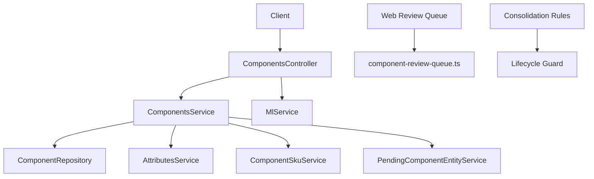

**Diagram sources**
- [components.controller.ts:65-141](file://apps/api/src/components/components.controller.ts#L65-L141)
- [components.service.ts:87-206](file://apps/api/src/components/components.service.ts#L87-L206)
- [ml.service.ts:304-311](file://apps/api/src/ml/ml.service.ts#L304-L311)
- [component-review-queue.ts:236-276](file://apps/web/lib/component-review-queue.ts#L236-L276)
- [COMPONENT_CONSOLIDATION.md:33-60](file://docs/architecture/COMPONENT_CONSOLIDATION.md#L33-L60)
- [component-lifecycle.guard.ts:22-45](file://apps/api/src/components/component-lifecycle.guard.ts#L22-L45)

**Section sources**
- [components.controller.ts:65-141](file://apps/api/src/components/components.controller.ts#L65-L141)
- [components.service.ts:87-206](file://apps/api/src/components/components.service.ts#L87-L206)

## Core Components
- ComponentsController: Exposes secure CRUD and ML-related endpoints for components, including suggest, feedback, and SKU preview.
- ComponentsService: Orchestrates create/update/delete using domain use cases, normalizes attributes, resolves pending manufacturer/category, and attaches attributes to responses.
- DTOs: Validate inputs for create/update, including optional pending entities and attributes.
- SKU Allocation: Generates unique SKUs from a sequence cursor with collision checks.
- Pending Entity Resolution: Creates or reuses manufacturers and categories when not provided by ID.
- ML Service: Classifies components, resolves manufacturers/categories, suggests attributes, and records feedback.
- Review Queue (Web): Presents findings, statuses, decisions, and tabbed views for component intelligence.
- Consolidation: Retires duplicate components into a canonical one with strict transactional guarantees and dependency handling.
- Lifecycle Guard: Prevents retired (consolidated) components from participating in new operational activity.

**Section sources**
- [components.controller.ts:65-141](file://apps/api/src/components/components.controller.ts#L65-L141)
- [components.service.ts:87-206](file://apps/api/src/components/components.service.ts#L87-L206)
- [create-component.dto.ts:44-94](file://apps/api/src/components/create-component.dto.ts#L44-L94)
- [update-component.dto.ts:45-90](file://apps/api/src/components/update-component.dto.ts#L45-L90)
- [component-sku-allocation.ts:13-68](file://apps/api/src/components/component-sku-allocation.ts#L13-L68)
- [pending-component-entity.service.ts:22-127](file://apps/api/src/components/pending-component-entity.service.ts#L22-L127)
- [ml.service.ts:304-311](file://apps/api/src/ml/ml.service.ts#L304-L311)
- [component-review-queue.ts:236-276](file://apps/web/lib/component-review-queue.ts#L236-L276)
- [COMPONENT_CONSOLIDATION.md:33-60](file://docs/architecture/COMPONENT_CONSOLIDATION.md#L33-L60)
- [component-lifecycle.guard.ts:22-45](file://apps/api/src/components/component-lifecycle.guard.ts#L22-L45)

## Architecture Overview
The system follows a layered architecture:
- Presentation/API: Controller routes requests, applies guards, and delegates to services.
- Application/Service: Services coordinate use cases, repositories, and cross-cutting concerns (attributes, SKU, pending entities).
- Domain: Use cases and aggregates enforce business rules (e.g., lifecycle, consolidation).
- Infrastructure: Repositories persist data; ML client calls external intelligence.
- Web: Review queue logic renders findings and manages state transitions.

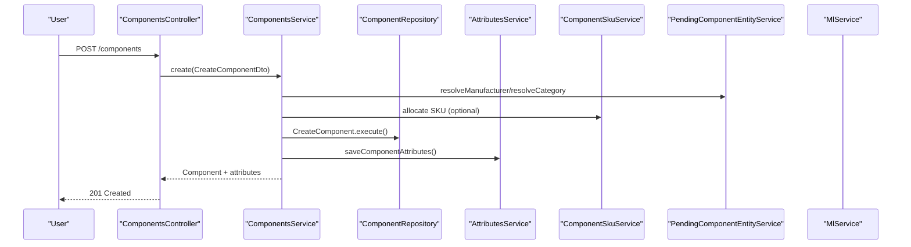

**Diagram sources**
- [components.controller.ts:106-112](file://apps/api/src/components/components.controller.ts#L106-L112)
- [components.service.ts:108-142](file://apps/api/src/components/components.service.ts#L108-L142)
- [component-sku-allocation.ts:43-68](file://apps/api/src/components/component-sku-allocation.ts#L43-L68)
- [pending-component-entity.service.ts:29-84](file://apps/api/src/components/pending-component-entity.service.ts#L29-L84)

**Section sources**
- [components.controller.ts:65-141](file://apps/api/src/components/components.controller.ts#L65-L141)
- [components.service.ts:87-206](file://apps/api/src/components/components.service.ts#L87-L206)

## Detailed Component Analysis

### Component Creation and Updates
- Inputs validated via DTOs support name, description, unit, optional SKU, manufacturer part number, category/manufacturer IDs or pending definitions, and attributes.
- Service normalizes attributes and persists them after component creation/update.
- Pending entities allow creating or reusing manufacturers/categories inline.

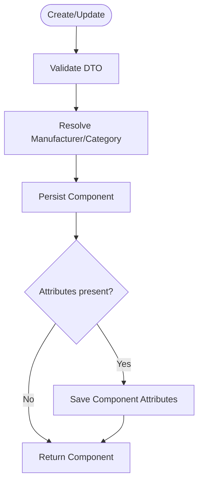

**Diagram sources**
- [create-component.dto.ts:44-94](file://apps/api/src/components/create-component.dto.ts#L44-L94)
- [update-component.dto.ts:45-90](file://apps/api/src/components/update-component.dto.ts#L45-L90)
- [components.service.ts:108-177](file://apps/api/src/components/components.service.ts#L108-L177)
- [pending-component-entity.service.ts:29-84](file://apps/api/src/components/pending-component-entity.service.ts#L29-L84)

**Section sources**
- [create-component.dto.ts:44-94](file://apps/api/src/components/create-component.dto.ts#L44-L94)
- [update-component.dto.ts:45-90](file://apps/api/src/components/update-component.dto.ts#L45-L90)
- [components.service.ts:108-177](file://apps/api/src/components/components.service.ts#L108-L177)

### Attribute Management
- Attributes can be supplied as an object keyed by code or as an array of entries.
- Normalization maps flexible input shapes to canonical attribute inputs, supporting values, units, options, and selected option sets.
- Attributes are saved per component and returned alongside component data.

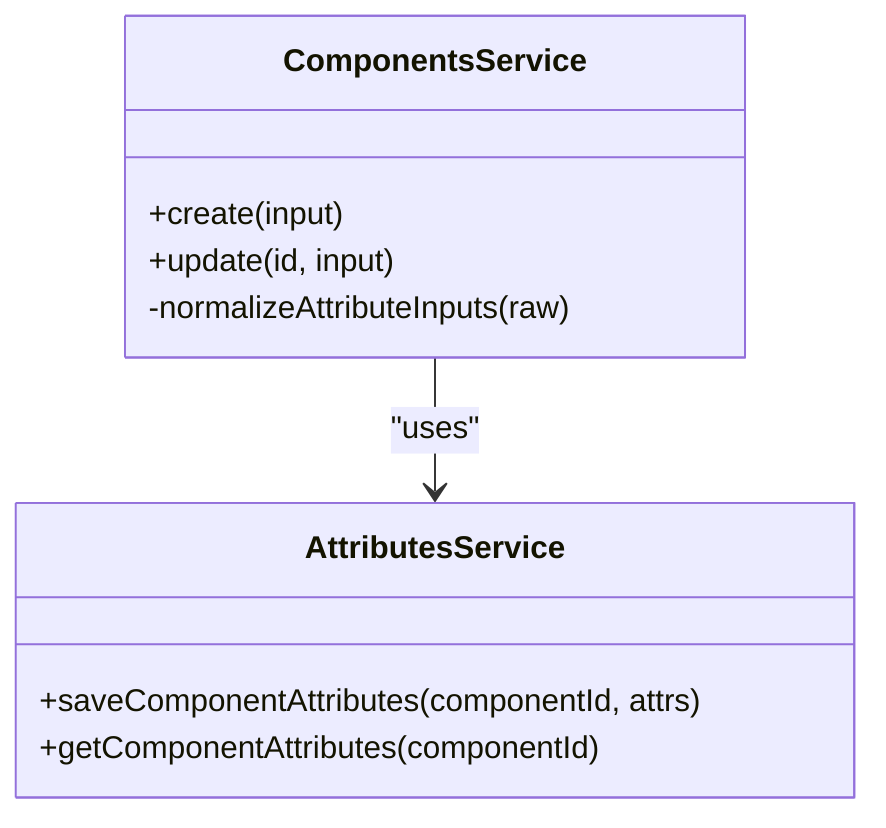

**Diagram sources**
- [components.service.ts:22-85](file://apps/api/src/components/components.service.ts#L22-L85)
- [components.service.ts:108-177](file://apps/api/src/components/components.service.ts#L108-L177)

**Section sources**
- [components.service.ts:22-85](file://apps/api/src/components/components.service.ts#L22-L85)
- [components.service.ts:108-177](file://apps/api/src/components/components.service.ts#L108-L177)

### SKU Allocation
- SKU generation uses a configurable prefix and zero-padded sequence.
- Allocation scans forward from a cursor to find the first available SKU, bounded by max attempts.
- Preview endpoint allows callers to reserve a candidate SKU before creation.

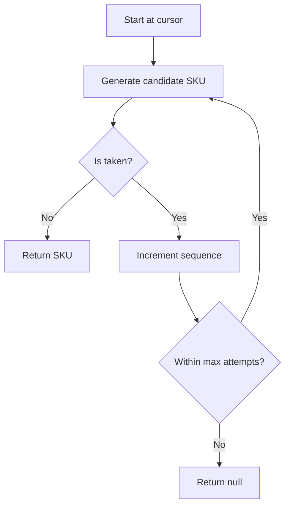

**Diagram sources**
- [component-sku-allocation.ts:13-68](file://apps/api/src/components/component-sku-allocation.ts#L13-L68)

**Section sources**
- [component-sku-allocation.ts:13-68](file://apps/api/src/components/component-sku-allocation.ts#L13-L68)

### Pending Manufacturer and Category Resolution
- If IDs are not provided, pending objects allow creating or reusing manufacturers/categories by name/code.
- Conflicts between explicit IDs and pending objects are rejected.
- Race conditions handled by re-checking existence after creation attempts.

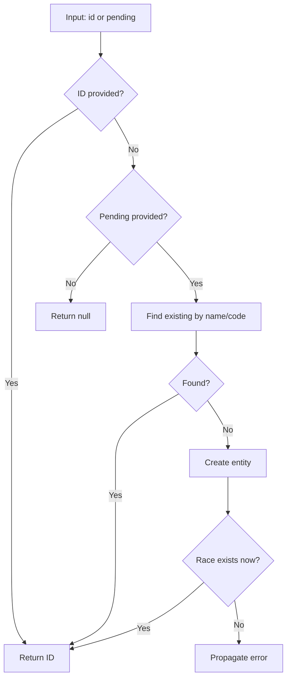

**Diagram sources**
- [pending-component-entity.service.ts:29-84](file://apps/api/src/components/pending-component-entity.service.ts#L29-L84)

**Section sources**
- [pending-component-entity.service.ts:29-84](file://apps/api/src/components/pending-component-entity.service.ts#L29-L84)

### ML Intelligence Integration
- Suggest endpoint classifies components, resolves manufacturers/categories, and suggests attributes based on query, part numbers, descriptions, datasheets, and existing ERP data.
- Feedback recording captures reviewer actions to improve future suggestions.
- Deterministic fallbacks ensure robust behavior when ML is unavailable.

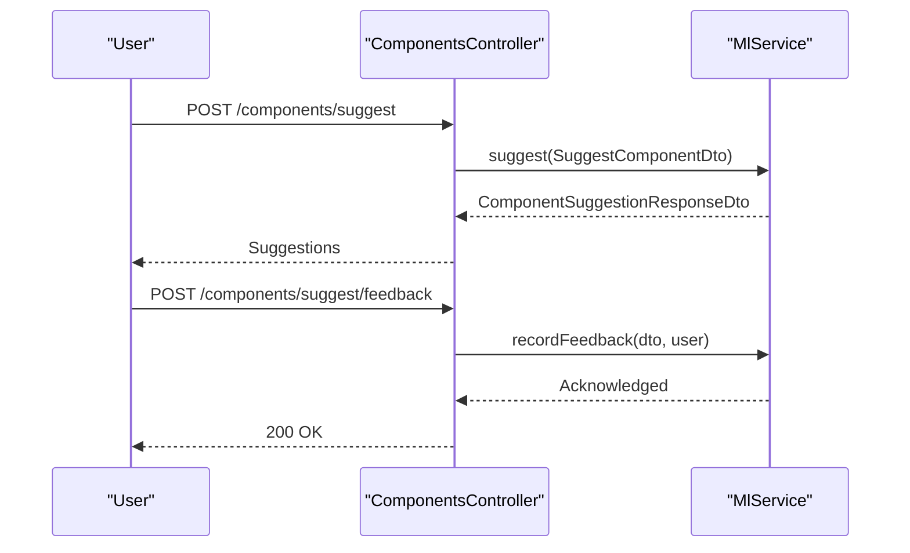

**Diagram sources**
- [components.controller.ts:74-104](file://apps/api/src/components/components.controller.ts#L74-L104)
- [ml.service.ts:313-452](file://apps/api/src/ml/ml.service.ts#L313-L452)

**Section sources**
- [components.controller.ts:74-104](file://apps/api/src/components/components.controller.ts#L74-L104)
- [ml.service.ts:313-452](file://apps/api/src/ml/ml.service.ts#L313-L452)

### Component Review Queue
- The review queue presents findings such as duplicates, unresolved identity/classification, and attribute suggestions.
- Statuses include PENDING, ACCEPTED, REJECTED, DISMISSED, STALE. Decisions are constrained by current status.
- Tabs group findings by category (Identity, Classification, Specifications, Duplicates, Stale).

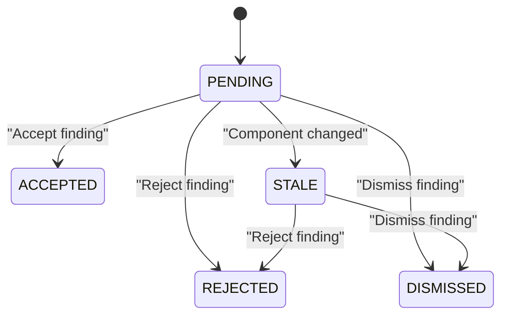

**Diagram sources**
- [component-review-queue.ts:236-276](file://apps/web/lib/component-review-queue.ts#L236-L276)

**Section sources**
- [component-review-queue.ts:236-276](file://apps/web/lib/component-review-queue.ts#L236-L276)

### Component Consolidation and Lifecycle
- Consolidation retires duplicate components into a canonical one without deleting records, preserving history and foreign keys.
- Retired components cannot participate in new transactions, BOM lines, reservations, or edits.
- Execution runs in a single transaction with deterministic locking, fingerprint verification, and adapter-based migrations across domains.

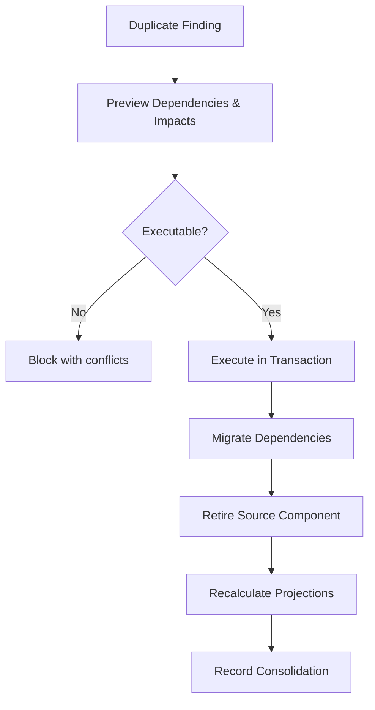

**Diagram sources**
- [COMPONENT_CONSOLIDATION.md:16-31](file://docs/architecture/COMPONENT_CONSOLIDATION.md#L16-L31)
- [COMPONENT_CONSOLIDATION.md:33-60](file://docs/architecture/COMPONENT_CONSOLIDATION.md#L33-L60)
- [COMPONENT_CONSOLIDATION.md:337-365](file://docs/architecture/COMPONENT_CONSOLIDATION.md#L337-L365)

**Section sources**
- [COMPONENT_CONSOLIDATION.md:16-60](file://docs/architecture/COMPONENT_CONSOLIDATION.md#L16-L60)
- [COMPONENT_CONSOLIDATION.md:337-365](file://docs/architecture/COMPONENT_CONSOLIDATION.md#L337-L365)
- [component-lifecycle.guard.ts:22-45](file://apps/api/src/components/component-lifecycle.guard.ts#L22-L45)

### Search and Filtering
- Unified search endpoint accepts a query string and limit to return relevant results across the system, enabling quick discovery of components and related entities.

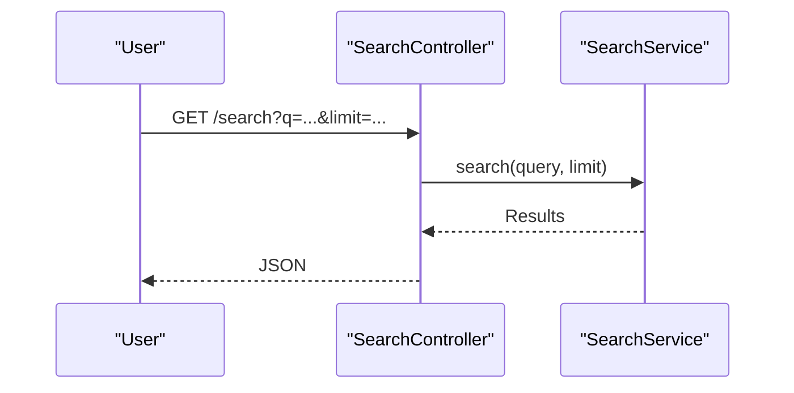

**Diagram sources**
- [search.controller.ts:4-13](file://apps/api/src/search/search.controller.ts#L4-L13)

**Section sources**
- [search.controller.ts:4-13](file://apps/api/src/search/search.controller.ts#L4-L13)

## Dependency Analysis
Components depend on:
- Attributes: For storing and retrieving specification values.
- Manufacturers/Categories: For classification and identity; supported via pending resolution.
- ML Service: For classification, manufacturer/category resolution, and attribute suggestions.
- SKU Service: For generating unique identifiers.
- Repository: For persistence operations.
- Review Queue: For presenting intelligence findings and managing lifecycle states.
- Consolidation: For retiring duplicates and migrating dependencies.

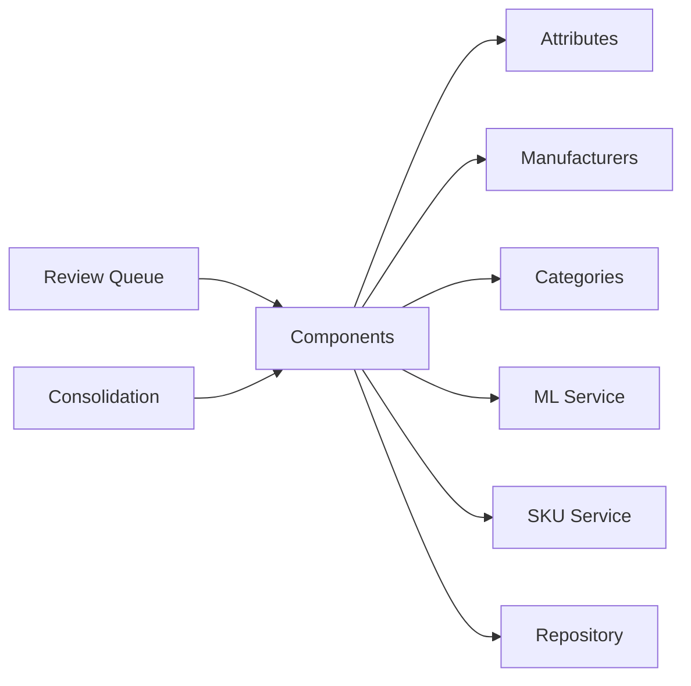

**Diagram sources**
- [components.service.ts:87-206](file://apps/api/src/components/components.service.ts#L87-L206)
- [ml.service.ts:304-311](file://apps/api/src/ml/ml.service.ts#L304-L311)
- [component-review-queue.ts:236-276](file://apps/web/lib/component-review-queue.ts#L236-L276)
- [COMPONENT_CONSOLIDATION.md:33-60](file://docs/architecture/COMPONENT_CONSOLIDATION.md#L33-L60)

**Section sources**
- [components.service.ts:87-206](file://apps/api/src/components/components.service.ts#L87-L206)
- [ml.service.ts:304-311](file://apps/api/src/ml/ml.service.ts#L304-L311)
- [component-review-queue.ts:236-276](file://apps/web/lib/component-review-queue.ts#L236-L276)
- [COMPONENT_CONSOLIDATION.md:33-60](file://docs/architecture/COMPONENT_CONSOLIDATION.md#L33-L60)

## Performance Considerations
- SKU allocation scans forward from a cursor with a bounded maximum attempts to avoid excessive lookups.
- ML suggestion batches reference data reads and limits candidate comparisons to prevent large payloads.
- Review queue loads full result sets for accurate client-side grouping and counts, minimizing pagination complexity but increasing payload size; consider server-side filters for very large queues.
- Consolidation executes in a single transaction with deterministic row locking to prevent deadlocks and ensure consistency.

[No sources needed since this section provides general guidance]

## Troubleshooting Guide
Common issues and resolutions:
- Duplicate SKU: Ensure SKU preview is used and confirm availability before creation; if collisions occur, adjust cursor or allow auto-generation.
- Pending entity conflicts: Do not provide both an explicit ID and a pending object for the same entity; choose one path.
- ML suggestions missing: Verify ML client enabled and data packs active; fallback logic still provides deterministic hints.
- Review queue stale findings: Re-run audits to refresh findings when components change; stale findings can be rejected or dismissed but not accepted.
- Consolidation blocked: Address blocking conflicts (open orders, batch/serial collisions, InitialStock presence); preview lists blockers and required resolutions.

**Section sources**
- [component-sku-allocation.ts:43-68](file://apps/api/src/components/component-sku-allocation.ts#L43-L68)
- [pending-component-entity.service.ts:29-84](file://apps/api/src/components/pending-component-entity.service.ts#L29-L84)
- [ml.service.ts:313-452](file://apps/api/src/ml/ml.service.ts#L313-L452)
- [component-review-queue.ts:236-276](file://apps/web/lib/component-review-queue.ts#L236-L276)
- [COMPONENT_CONSOLIDATION.md:115-133](file://docs/architecture/COMPONENT_CONSOLIDATION.md#L115-L133)

## Conclusion
Components Management provides a robust foundation for inventory master data with strong validation, intelligent classification, and controlled lifecycle management. The system supports attribute-driven specifications, SKU allocation, ML-backed suggestions, and a comprehensive review queue for quality assurance. Consolidation ensures data integrity by retiring duplicates while preserving history and migrating dependencies safely. Search and filtering enable efficient discovery across the catalog.

[No sources needed since this section summarizes without analyzing specific files]