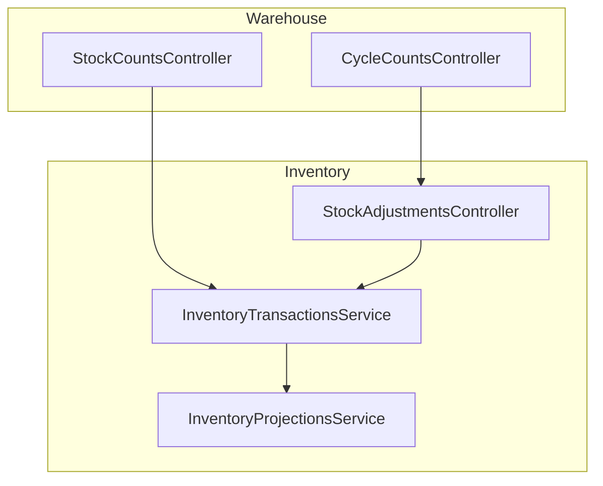
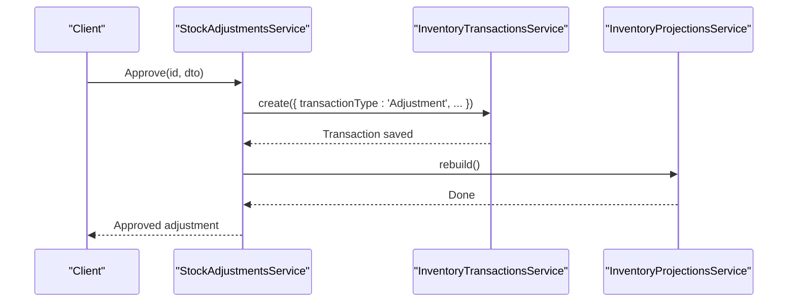
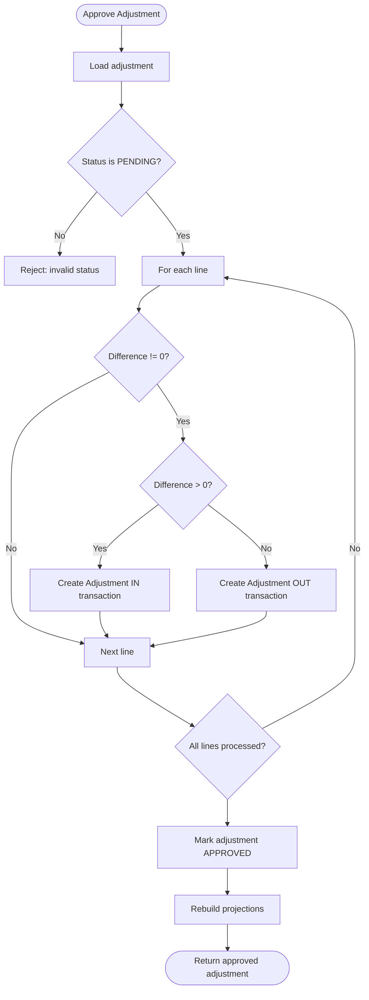
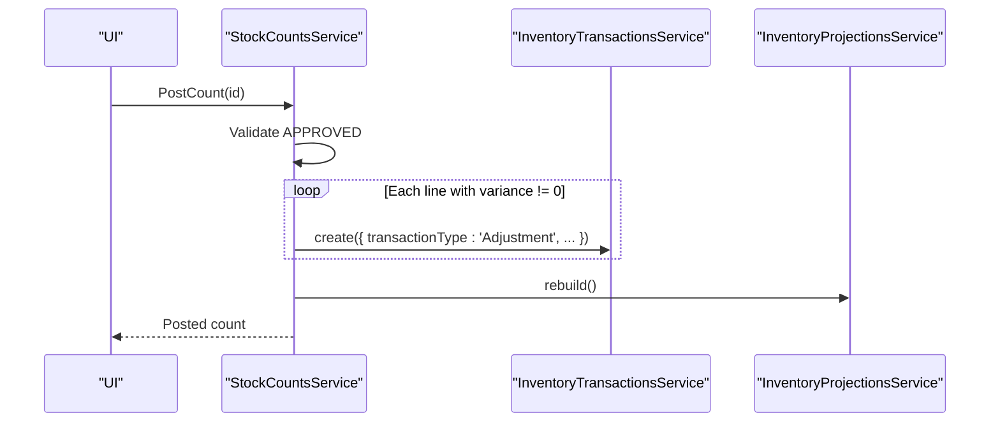
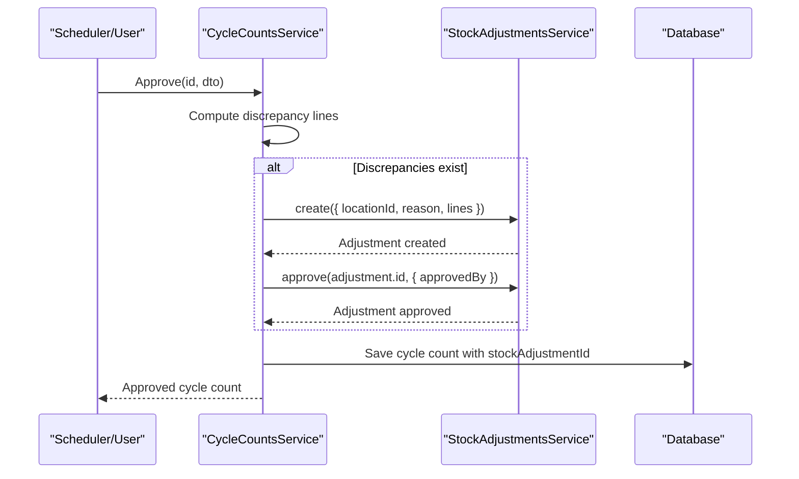
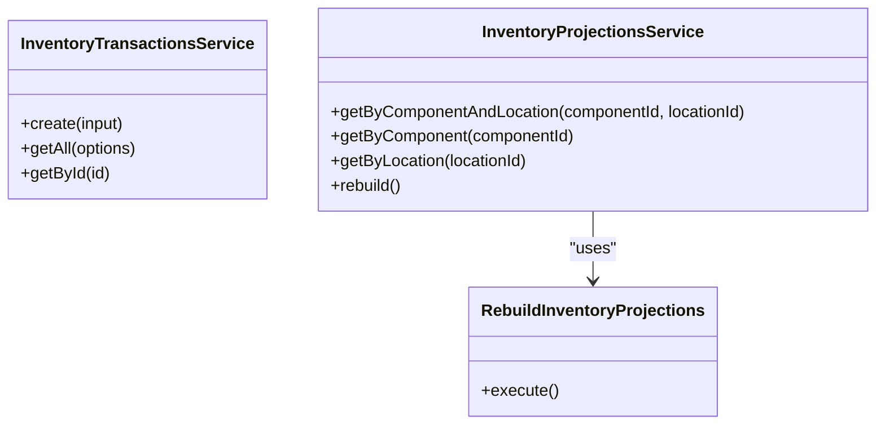
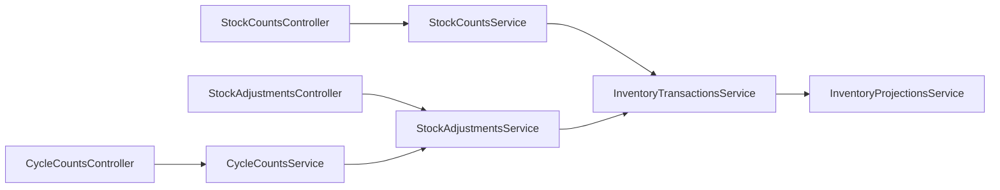

# Inventory Adjustments & Counting

<cite>
**Referenced Files in This Document**
- [stock-adjustments.controller.ts](file://apps/api/src/stock-adjustments/stock-adjustments.controller.ts)
- [stock-adjustments.service.ts](file://apps/api/src/stock-adjustments/stock-adjustments.service.ts)
- [dtos.ts (Stock Adjustments)](file://apps/api/src/stock-adjustments/dtos.ts)
- [stock-counts.controller.ts](file://apps/api/src/stock-counts/stock-counts.controller.ts)
- [stock-counts.service.ts](file://apps/api/src/stock-counts/stock-counts.service.ts)
- [dtos.ts (Stock Counts)](file://apps/api/src/stock-counts/dtos.ts)
- [cycle-counts.controller.ts](file://apps/api/src/cycle-counts/cycle-counts.controller.ts)
- [cycle-counts.service.ts](file://apps/api/src/cycle-counts/cycle-counts.service.ts)
- [inventory-transactions.service.ts](file://apps/api/src/inventory-transactions/inventory-transactions.service.ts)
- [inventory-projections.service.ts](file://apps/api/src/inventory-projections/inventory-projections.service.ts)
- [rebuild-inventory-projections.ts](file://packages/inventory/src/projection/rebuild-inventory-projections.ts)
- [0022-stock-counts.md](file://docs/rfcs/0022-stock-counts.md)
- [0023-cycle-counting.md](file://docs/rfcs/0023-cycle-counting.md)
- [cycle-counts.ts (DB schema)](file://packages/database/src/schema/cycle-counts.ts)
- [import-export.service.ts](file://apps/api/src/import-export/import-export.service.ts)
</cite>

## Table of Contents
1. [Introduction](#introduction)
2. [Project Structure](#project-structure)
3. [Core Components](#core-components)
4. [Architecture Overview](#architecture-overview)
5. [Detailed Component Analysis](#detailed-component-analysis)
6. [Dependency Analysis](#dependency-analysis)
7. [Performance Considerations](#performance-considerations)
8. [Troubleshooting Guide](#troubleshooting-guide)
9. [Conclusion](#conclusion)
10. [Appendices](#appendices)

## Introduction
This document explains inventory adjustment and counting operations, including manual adjustments, write-offs, corrections, cycle counting, scheduling, variance analysis, approval workflows, audit requirements, financial implications, accuracy metrics, discrepancy resolution, continuous improvement practices, and integration with financial systems for valuation adjustments and compliance reporting.

The system separates:
- Warehouse operations (counts, cycle counts) from inventory ledger updates.
- Approval workflows that gate changes to immutable inventory transactions.
- Rebuilt projections that reflect posted adjustments for planning and reporting.

## Project Structure
Inventory adjustments are implemented under the stock-adjustments module, while physical counting is split between stock counts and cycle counts. Both posting paths create inventory adjustment transactions through a shared service and then rebuild projections.

**Diagram sources**
- [stock-counts.controller.ts:1-58](file://apps/api/src/stock-counts/stock-counts.controller.ts#L1-L58)
- [cycle-counts.controller.ts:1-96](file://apps/api/src/cycle-counts/cycle-counts.controller.ts#L1-L96)
- [stock-adjustments.controller.ts:1-50](file://apps/api/src/stock-adjustments/stock-adjustments.controller.ts#L1-L50)
- [inventory-transactions.service.ts:1-44](file://apps/api/src/inventory-transactions/inventory-transactions.service.ts#L1-L44)
- [inventory-projections.service.ts:1-45](file://apps/api/src/inventory-projections/inventory-projections.service.ts#L1-L45)

**Section sources**
- [stock-adjustments.controller.ts:1-50](file://apps/api/src/stock-adjustments/stock-adjustments.controller.ts#L1-L50)
- [stock-counts.controller.ts:1-58](file://apps/api/src/stock-counts/stock-counts.controller.ts#L1-L58)
- [cycle-counts.controller.ts:1-96](file://apps/api/src/cycle-counts/cycle-counts.controller.ts#L1-L96)

## Core Components
- Stock Adjustments: Create, list, approve, and cancel adjustments; on approval, post inventory adjustment transactions and rebuild projections.
- Stock Counts: Create count documents, assign counters, add lines, submit/approve/post, and cancel; posting creates inventory adjustment transactions per line variance.
- Cycle Counts: Schedule and execute recurring counts, record physical quantities, review variances, approve, and automatically generate and approve a linked Stock Adjustment when discrepancies exist.
- Inventory Transactions: Centralized creation of immutable inventory transactions with component usability checks.
- Inventory Projections: Rebuild projections from all transactions to keep planning data current.

Key responsibilities:
- Validation and state transitions occur at the application service layer.
- Financial impact occurs only after approval via immutable inventory transactions.
- Auditability is ensured by reference numbers, reasons, and user attribution.

**Section sources**
- [stock-adjustments.service.ts:27-134](file://apps/api/src/stock-adjustments/stock-adjustments.service.ts#L27-L134)
- [stock-counts.service.ts:27-121](file://apps/api/src/stock-counts/stock-counts.service.ts#L27-L121)
- [cycle-counts.service.ts:39-208](file://apps/api/src/cycle-counts/cycle-counts.service.ts#L39-L208)
- [inventory-transactions.service.ts:19-31](file://apps/api/src/inventory-transactions/inventory-transactions.service.ts#L19-L31)
- [inventory-projections.service.ts:38-44](file://apps/api/src/inventory-projections/inventory-projections.service.ts#L38-L44)

## Architecture Overview
The following sequence shows how approved adjustments flow into the inventory ledger and projections.

**Diagram sources**
- [stock-adjustments.service.ts:70-120](file://apps/api/src/stock-adjustments/stock-adjustments.service.ts#L70-L120)
- [inventory-transactions.service.ts:19-31](file://apps/api/src/inventory-transactions/inventory-transactions.service.ts#L19-L31)
- [inventory-projections.service.ts:38-44](file://apps/api/src/inventory-projections/inventory-projections.service.ts#L38-L44)

## Detailed Component Analysis

### Stock Adjustments
Purpose:
- Record planned or corrective changes to inventory at a location.
- Support manual adjustments, write-offs, and corrections.
- Enforce approval before any ledger change.

Workflow highlights:
- Create: Generates an adjustment number and persists lines with current vs counted quantities.
- Approve: For each line with non-zero difference, posts an inventory adjustment transaction (increase or decrease), marks the adjustment approved, and rebuilds projections.
- Cancel: Only allowed when pending.

Data model and validation:
- Lines include componentId, currentQuantity, countedQuantity, and unitOfMeasure.
- DTOs enforce required fields and non-negative quantities.

Approval and audit:
- Approvals capture approvedBy and reason text propagated to transactions.
- Reference numbers link transactions back to the adjustment.

Financial implications:
- Posting creates immutable inventory transactions that affect valuation and projections.

**Diagram sources**
- [stock-adjustments.service.ts:70-120](file://apps/api/src/stock-adjustments/stock-adjustments.service.ts#L70-L120)

**Section sources**
- [stock-adjustments.controller.ts:15-48](file://apps/api/src/stock-adjustments/stock-adjustments.controller.ts#L15-L48)
- [stock-adjustments.service.ts:27-134](file://apps/api/src/stock-adjustments/stock-adjustments.service.ts#L27-L134)
- [dtos.ts (Stock Adjustments):12-57](file://apps/api/src/stock-adjustments/dtos.ts#L12-L57)

### Stock Counts
Purpose:
- Perform physical audits against expected quantities.
- Calculate variances and reconcile through inventory adjustment transactions upon posting.

Lifecycle:
- Create, assign counter, add lines, submit, approve, post, cancel.
- Posting requires APPROVED status and generates inventory adjustment transactions for non-zero variances.

Integration:
- Uses InventoryTransactionsService to create adjustment transactions.
- Rebuilds projections after posting.

**Diagram sources**
- [stock-counts.service.ts:82-113](file://apps/api/src/stock-counts/stock-counts.service.ts#L82-L113)

**Section sources**
- [stock-counts.controller.ts:6-56](file://apps/api/src/stock-counts/stock-counts.controller.ts#L6-L56)
- [stock-counts.service.ts:27-121](file://apps/api/src/stock-counts/stock-counts.service.ts#L27-L121)
- [dtos.ts (Stock Counts):9-45](file://apps/api/src/stock-counts/dtos.ts#L9-L45)
- [0022-stock-counts.md:11-148](file://docs/rfcs/0022-stock-counts.md#L11-L148)

### Cycle Counting
Purpose:
- Automate recurring counts based on schedules and selection rules.
- Generate stock count documents on schedule execution.
- Provide variance review and automatic reconciliation via Stock Adjustments.

Key capabilities:
- Create/update cycle counts, assign counters, start counting, record physical counts, review variances, approve, cancel, delete (draft only).
- On approval, if there are discrepancies, automatically create and approve a linked Stock Adjustment.

Scheduling and database:
- RFC defines frequencies and next scheduled date tracking.
- Database schema includes fields for assigned counter, scheduled/completed/approved timestamps, and linkage to stock adjustments.

**Diagram sources**
- [cycle-counts.service.ts:156-192](file://apps/api/src/cycle-counts/cycle-counts.service.ts#L156-L192)
- [stock-adjustments.service.ts:27-120](file://apps/api/src/stock-adjustments/stock-adjustments.service.ts#L27-L120)

**Section sources**
- [cycle-counts.controller.ts:23-95](file://apps/api/src/cycle-counts/cycle-counts.controller.ts#L23-L95)
- [cycle-counts.service.ts:39-208](file://apps/api/src/cycle-counts/cycle-counts.service.ts#L39-L208)
- [0023-cycle-counting.md:11-127](file://docs/rfcs/0023-cycle-counting.md#L11-L127)
- [cycle-counts.ts (DB schema):14-43](file://packages/database/src/schema/cycle-counts.ts#L14-L43)

### Inventory Transactions and Projections
- InventoryTransactionsService validates component usability before creating transactions and persists them.
- InventoryProjectionsService rebuilds projections from all transactions using a dedicated use case.

**Diagram sources**
- [inventory-transactions.service.ts:12-43](file://apps/api/src/inventory-transactions/inventory-transactions.service.ts#L12-L43)
- [inventory-projections.service.ts:11-44](file://apps/api/src/inventory-projections/inventory-projections.service.ts#L11-L44)
- [rebuild-inventory-projections.ts:11-29](file://packages/inventory/src/projection/rebuild-inventory-projections.ts#L11-L29)

**Section sources**
- [inventory-transactions.service.ts:19-31](file://apps/api/src/inventory-transactions/inventory-transactions.service.ts#L19-L31)
- [inventory-projections.service.ts:38-44](file://apps/api/src/inventory-projections/inventory-projections.service.ts#L38-L44)
- [rebuild-inventory-projections.ts:17-29](file://packages/inventory/src/projection/rebuild-inventory-projections.ts#L17-L29)

## Dependency Analysis
- Controllers delegate to services for business logic.
- Stock Adjustments and Stock Counts both depend on InventoryTransactionsService to create immutable adjustment transactions.
- Cycle Counts depend on Stock Adjustments to reconcile discrepancies automatically.
- Both posting paths trigger InventoryProjectionsService.rebuild().

**Diagram sources**
- [stock-counts.controller.ts:1-58](file://apps/api/src/stock-counts/stock-counts.controller.ts#L1-L58)
- [cycle-counts.controller.ts:1-96](file://apps/api/src/cycle-counts/cycle-counts.controller.ts#L1-L96)
- [stock-adjustments.controller.ts:1-50](file://apps/api/src/stock-adjustments/stock-adjustments.controller.ts#L1-L50)
- [stock-counts.service.ts:1-25](file://apps/api/src/stock-counts/stock-counts.service.ts#L1-L25)
- [stock-adjustments.service.ts:1-25](file://apps/api/src/stock-adjustments/stock-adjustments.service.ts#L1-L25)
- [cycle-counts.service.ts:1-37](file://apps/api/src/cycle-counts/cycle-counts.service.ts#L1-L37)
- [inventory-transactions.service.ts:1-17](file://apps/api/src/inventory-transactions/inventory-transactions.service.ts#L1-L17)
- [inventory-projections.service.ts:1-18](file://apps/api/src/inventory-projections/inventory-projections.service.ts#L1-L18)

**Section sources**
- [stock-counts.service.ts:1-25](file://apps/api/src/stock-counts/stock-counts.service.ts#L1-L25)
- [stock-adjustments.service.ts:1-25](file://apps/api/src/stock-adjustments/stock-adjustments.service.ts#L1-L25)
- [cycle-counts.service.ts:1-37](file://apps/api/src/cycle-counts/cycle-counts.service.ts#L1-L37)

## Performance Considerations
- Batched projection rebuilds: After approvals or postings, projections are rebuilt once per operation to avoid repeated scans.
- Transaction creation guard: Component usability checks prevent costly failures later in the pipeline.
- Avoid direct ledger writes: Using application services centralizes validation and reduces inconsistent states.

[No sources needed since this section provides general guidance]

## Troubleshooting Guide
Common issues and resolutions:
- Cannot approve/cancel in invalid status: Ensure the document is in PENDING before approval or cancellation.
- Posting without approval: Stock counts must be APPROVED before posting.
- Component consolidation conflicts: New inventory transactions are blocked for consolidated components to maintain data integrity.
- Missing references: Ensure adjustment/count numbers and reasons are provided for auditability.

Operational checks:
- Verify projections are rebuilt after posting.
- Confirm that all non-zero variances were converted to inventory adjustment transactions.
- Review import/export logs for bulk operations involving stock adjustments.

**Section sources**
- [stock-adjustments.service.ts:70-134](file://apps/api/src/stock-adjustments/stock-adjustments.service.ts#L70-L134)
- [stock-counts.service.ts:82-121](file://apps/api/src/stock-counts/stock-counts.service.ts#L82-L121)
- [inventory-transactions.service.ts:19-31](file://apps/api/src/inventory-transactions/inventory-transactions.service.ts#L19-L31)
- [import-export.service.ts:1714-1805](file://apps/api/src/import-export/import-export.service.ts#L1714-L1805)

## Conclusion
The system enforces disciplined inventory adjustments and counting:
- Manual adjustments require approval before impacting the ledger.
- Physical counts compute variances and reconcile via inventory adjustment transactions.
- Cycle counting automates recurring audits and links discrepancies to stock adjustments.
- Immutable transactions and rebuilt projections ensure accurate financial reporting and planning data.

[No sources needed since this section summarizes without analyzing specific files]

## Appendices

### Examples

- Creating a manual stock adjustment:
  - Use the stock adjustments API to create an adjustment with location, reason, notes, and lines containing current and counted quantities.
  - Approve the adjustment to post inventory transactions and rebuild projections.

- Executing a stock count:
  - Create a stock count, assign a counter, add lines with expected and counted quantities, submit, approve, and post to reconcile variances.

- Running a cycle count:
  - Create a cycle count with location and optional scheduled date, assign a counter, start counting, record physical counts, review variances, and approve. If discrepancies exist, a linked stock adjustment is generated and approved automatically.

- Reconciliation process:
  - All non-zero variances become inventory adjustment transactions.
  - Projections are rebuilt to reflect updated balances.

[No sources needed since this section provides conceptual examples]

### Accuracy Metrics and Continuous Improvement
- Track matching, shortage, and surplus item counts per count.
- Monitor total quantity difference and trend over time.
- Use discrepancy summaries to identify high-variance locations/components and refine bin selection rules for cycle counts.

[No sources needed since this section provides general guidance]

### Integration with Financial Systems
- Inventory adjustment transactions carry reference numbers and reasons suitable for downstream financial valuation and compliance reporting.
- Projections provide up-to-date balances for planning and reporting integrations.

[No sources needed since this section provides general guidance]