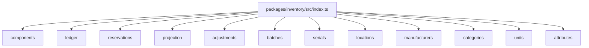
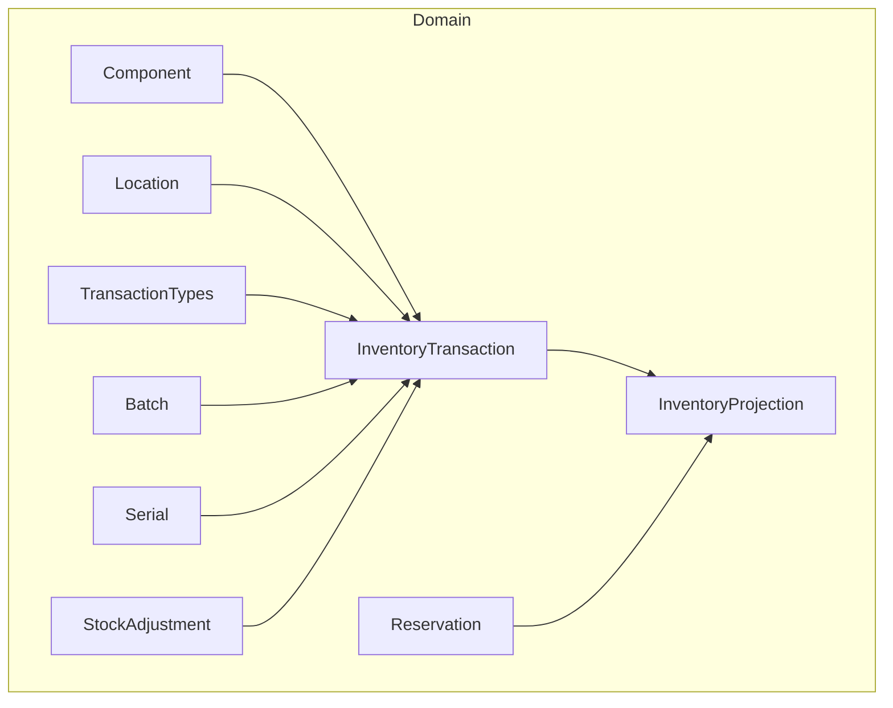
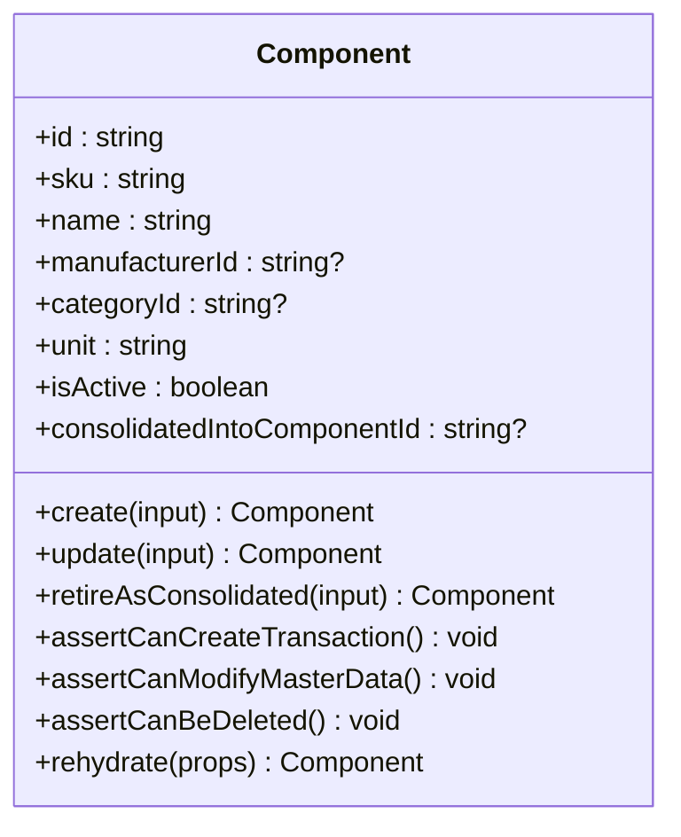
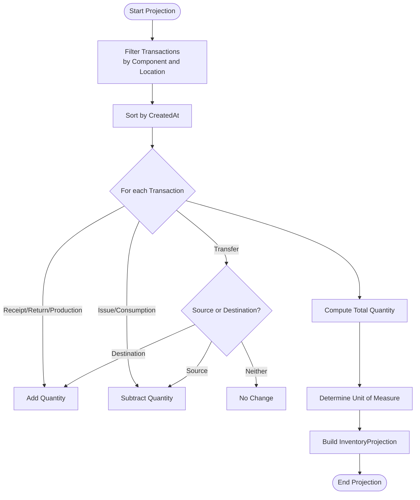
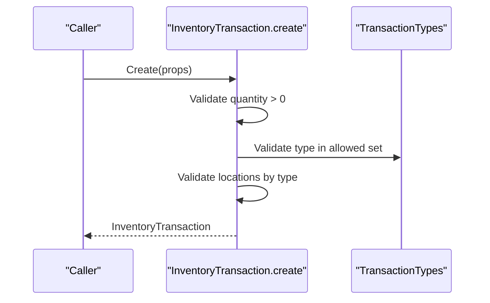
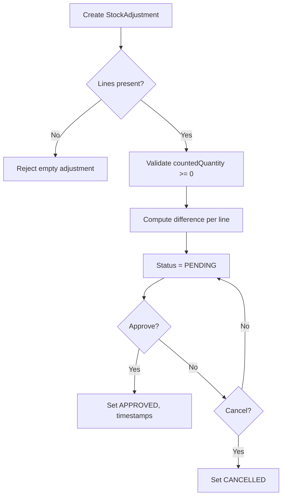
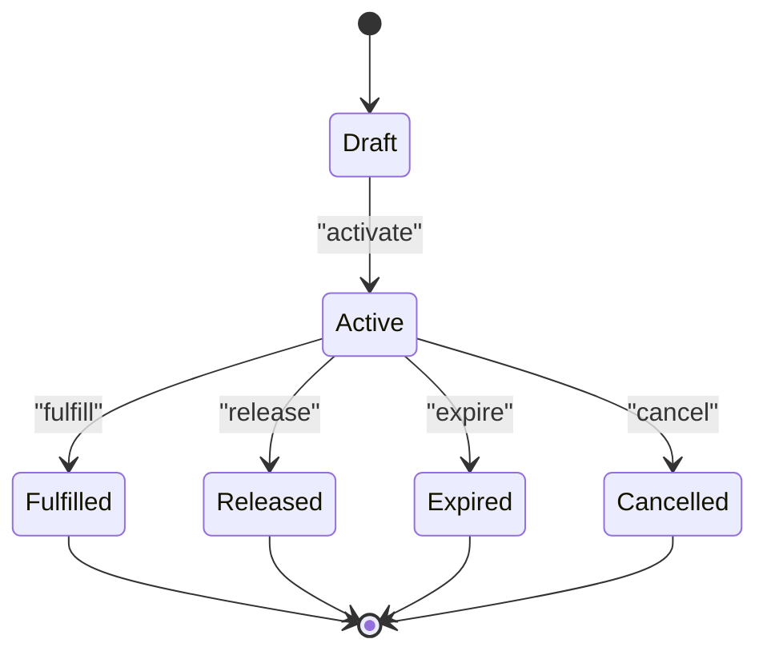
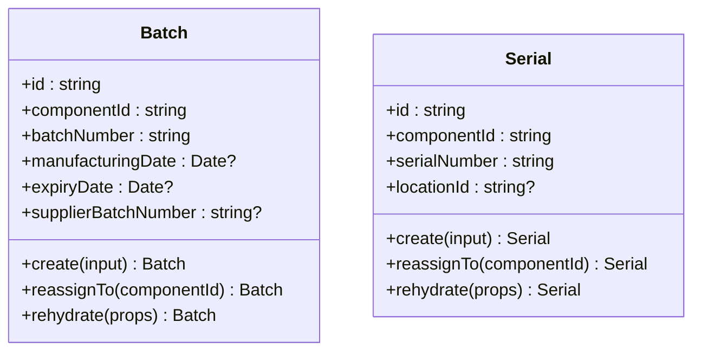
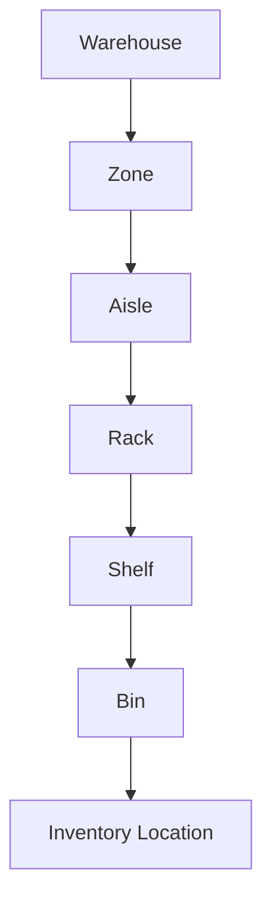
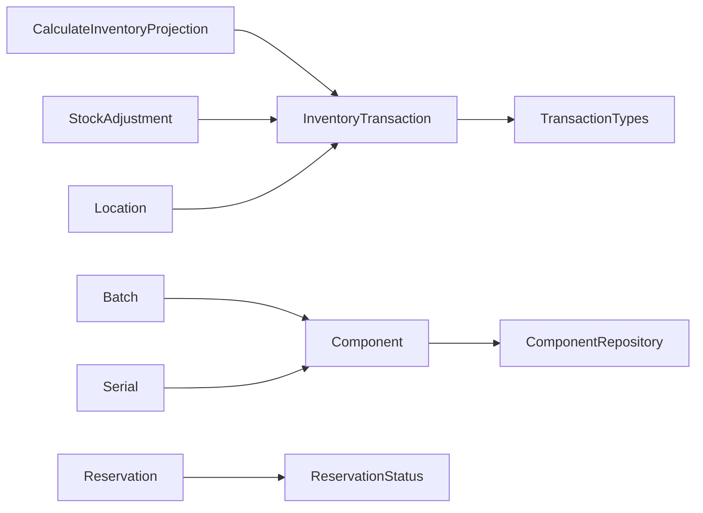

# Inventory Domain

<cite>
**Referenced Files in This Document**
- [0001-inventory-ledger.md](file://docs/rfcs/0001-inventory-ledger.md)
- [0002-inventory-domain-model.md](file://docs/rfcs/0002-inventory-domain-model.md)
- [0005-transaction-types.md](file://docs/rfcs/0005-transaction-types.md)
- [0007-batch-and-serial-tracking.md](file://docs/rfcs/0007-batch-and-serial-tracking.md)
- [0008-inventory-reservations.md](file://docs/rfcs/0008-inventory-reservations.md)
- [0021-warehouse-structure-and-bin-locations.md](file://docs/rfcs/0021-warehouse-structure-and-bin-locations.md)
- [index.ts](file://packages/inventory/src/index.ts)
- [component.ts](file://packages/inventory/src/components/component.ts)
- [create-component.ts](file://packages/inventory/src/components/create-component.ts)
- [inventory-transaction.ts](file://packages/inventory/src/ledger/inventory-transaction.ts)
- [transaction-types.ts](file://packages/inventory/src/ledger/transaction-types.ts)
- [calculate-inventory-projection.ts](file://packages/inventory/src/projection/calculate-inventory-projection.ts)
- [stock-adjustment.ts](file://packages/inventory/src/adjustments/stock-adjustment.ts)
- [reservation.ts](file://packages/inventory/src/reservations/reservation.ts)
- [batch.ts](file://packages/inventory/src/batches/batch.ts)
- [serial.ts](file://packages/inventory/src/serials/serial.ts)
- [location.ts](file://packages/inventory/src/locations/location.ts)
</cite>

## Table of Contents
1. Introduction
2. Project Structure
3. Core Components
4. Architecture Overview
5. Detailed Component Analysis
6. Dependency Analysis
7. Performance Considerations
8. Troubleshooting Guide
9. Conclusion
10. Appendices

## Introduction
This document explains the Inventory Domain package implementation and how it encapsulates inventory management across components, manufacturers, categories, stock levels, batch tracking, serial numbers, reservations, and warehouse locations. It focuses on the immutable ledger model, derived projections, business rules for stock movements, availability calculations, and integration points with other domains such as procurement and manufacturing.

The domain follows a strict separation between catalog data (what exists), transactional data (what happened), and derived data (current state). Inventory is never stored as a mutable quantity; instead, current stock is calculated from an immutable history of transactions. Reservations allocate availability without moving physical inventory. Batches and serials extend traceability while preserving the ledger model. Warehouse structure models physical storage hierarchies that map to inventory locations.

## Project Structure
The Inventory package exposes cohesive subdomains through a single index: locations, components, manufacturers, categories, ledger, adjustments, units, projection, reservations, batches, serials, and attributes. Each subdomain contains domain classes, repositories, and application services where applicable.

**Diagram sources**
- [index.ts:1-13](file://packages/inventory/src/index.ts#L1-L13)

**Section sources**
- [index.ts:1-13](file://packages/inventory/src/index.ts#L1-L13)

## Core Components
- Component: Master data defining what an item is, including SKU, name, manufacturer, category, unit, and lifecycle state. Consolidation prevents new transactions on retired records.
- Location: Hierarchical place that can own inventory, supporting parent-child relationships and metadata.
- InventoryTransaction: Immutable record of inventory movement with type-specific validation and location semantics.
- TransactionType: Canonical vocabulary describing why inventory moved (Receipt, Issue, Transfer, Adjustment, Return, Consumption, Production, ManualCorrection, InitialStock).
- Projection: Derived current stock computed from relevant transactions for a component and location.
- Reservation: Temporary allocation of inventory for future operations without changing physical stock.
- Batch and Serial: Traceability extensions for grouped or unique identification of items.
- StockAdjustment: Controlled workflow to reconcile counted vs. recorded quantities, producing approved changes.

These components implement strong invariants, factory creation, and rehydration patterns to keep domain logic framework-independent.

**Section sources**
- [component.ts:77-324](file://packages/inventory/src/components/component.ts#L77-L324)
- [location.ts:37-149](file://packages/inventory/src/locations/location.ts#L37-L149)
- [inventory-transaction.ts:22-169](file://packages/inventory/src/ledger/inventory-transaction.ts#L22-L169)
- [transaction-types.ts:1-26](file://packages/inventory/src/ledger/transaction-types.ts#L1-L26)
- [calculate-inventory-projection.ts:11-93](file://packages/inventory/src/projection/calculate-inventory-projection.ts#L11-L93)
- [reservation.ts:16-214](file://packages/inventory/src/reservations/reservation.ts#L16-L214)
- [batch.ts:21-95](file://packages/inventory/src/batches/batch.ts#L21-L95)
- [serial.ts:17-83](file://packages/inventory/src/serials/serial.ts#L17-L83)
- [stock-adjustment.ts:51-156](file://packages/inventory/src/adjustments/stock-adjustment.ts#L51-L156)

## Architecture Overview
The system enforces an event-driven, immutable ledger architecture. Business processes create InventoryTransactions, which are persisted immutably. Current stock is derived by projecting these transactions per component and location. Reservations temporarily reduce available inventory without altering the ledger. Batches and serials attach traceability to transactions and entities. Locations provide hierarchical storage addresses used by transfers and putaways.

**Diagram sources**
- [component.ts:77-324](file://packages/inventory/src/components/component.ts#L77-L324)
- [location.ts:37-149](file://packages/inventory/src/locations/location.ts#L37-L149)
- [inventory-transaction.ts:22-169](file://packages/inventory/src/ledger/inventory-transaction.ts#L22-L169)
- [transaction-types.ts:1-26](file://packages/inventory/src/ledger/transaction-types.ts#L1-L26)
- [calculate-inventory-projection.ts:11-93](file://packages/inventory/src/projection/calculate-inventory-projection.ts#L11-L93)
- [reservation.ts:16-214](file://packages/inventory/src/reservations/reservation.ts#L16-L214)
- [batch.ts:21-95](file://packages/inventory/src/batches/batch.ts#L21-L95)
- [serial.ts:17-83](file://packages/inventory/src/serials/serial.ts#L17-L83)
- [stock-adjustment.ts:51-156](file://packages/inventory/src/adjustments/stock-adjustment.ts#L51-L156)

## Detailed Component Analysis

### Component Management and Lifecycle
Components define master data and enforce consolidation rules to prevent drift after merges. They guard against creating transactions on consolidated records and disallow editing or deletion of consolidated components. Creation supports explicit or generated SKUs with uniqueness checks.

**Diagram sources**
- [component.ts:77-324](file://packages/inventory/src/components/component.ts#L77-L324)

**Section sources**
- [component.ts:77-324](file://packages/inventory/src/components/component.ts#L77-L324)
- [create-component.ts:6-47](file://packages/inventory/src/components/create-component.ts#L6-L47)

### Manufacturer Tracking
Manufacturers are reference data representing who made a component. They are decoupled from suppliers and used to classify components. The domain keeps manufacturer identity separate from acquisition channels.

**Section sources**
- [0002-inventory-domain-model.md:33-53](file://docs/rfcs/0002-inventory-domain-model.md#L33-L53)

### Category Hierarchies
Categories classify components into logical groups for organization and reporting. They are reference data without business logic and may be extended with attributes in other modules.

**Section sources**
- [0002-inventory-domain-model.md:55-63](file://docs/rfcs/0002-inventory-domain-model.md#L55-L63)

### Stock Levels and Availability Calculations
Current stock is derived from transactions filtered by component and location, sorted chronologically, and aggregated according to transaction type semantics. Receipts, returns, and production increase stock; issues and consumption decrease stock; transfers adjust based on source/destination matching; adjustments add net differences. Available inventory subtracts active reservations from on-hand stock.

**Diagram sources**
- [calculate-inventory-projection.ts:11-93](file://packages/inventory/src/projection/calculate-inventory-projection.ts#L11-L93)
- [transaction-types.ts:1-26](file://packages/inventory/src/ledger/transaction-types.ts#L1-L26)

**Section sources**
- [calculate-inventory-projection.ts:11-93](file://packages/inventory/src/projection/calculate-inventory-projection.ts#L11-L93)
- [0008-inventory-reservations.md:95-123](file://docs/rfcs/0008-inventory-reservations.md#L95-L123)

### Transaction Processing and Validation
Inventory transactions enforce positive quantities, canonical types, and type-specific location constraints. For example, receipts cannot have a source location; issues cannot have a destination; transfers require distinct source and destination; adjustments require at least one location.

**Diagram sources**
- [inventory-transaction.ts:53-156](file://packages/inventory/src/ledger/inventory-transaction.ts#L53-L156)
- [transaction-types.ts:1-26](file://packages/inventory/src/ledger/transaction-types.ts#L1-L26)

**Section sources**
- [inventory-transaction.ts:53-156](file://packages/inventory/src/ledger/inventory-transaction.ts#L53-L156)
- [0005-transaction-types.md:66-183](file://docs/rfcs/0005-transaction-types.md#L66-L183)

### Stock Adjustments Workflow
Stock adjustments capture counted quantities versus current quantities, compute differences, and enforce approval workflows before affecting inventory. Negative counted quantities are rejected, and adjustments must be approved before use.

**Diagram sources**
- [stock-adjustment.ts:80-156](file://packages/inventory/src/adjustments/stock-adjustment.ts#L80-L156)

**Section sources**
- [stock-adjustment.ts:80-156](file://packages/inventory/src/adjustments/stock-adjustment.ts#L80-L156)

### Reservation Workflows
Reservations allocate inventory for future operations without moving stock. They support lines per component and location, status transitions (Draft, Active, Fulfilled, Released, Cancelled, Expired), and header updates. Fulfillment reduces reserved quantity and triggers actual inventory movement via transactions.

**Diagram sources**
- [reservation.ts:162-214](file://packages/inventory/src/reservations/reservation.ts#L162-L214)

**Section sources**
- [reservation.ts:47-214](file://packages/inventory/src/reservations/reservation.ts#L47-L214)
- [0008-inventory-reservations.md:125-186](file://docs/rfcs/0008-inventory-reservations.md#L125-L186)

### Batch and Serial Tracking
Batches group interchangeable units with shared metadata (e.g., manufacturing date, expiry). Serials uniquely identify individual items and move independently through inventory. Both preserve identity during component consolidation by reassigning to the canonical component.

**Diagram sources**
- [batch.ts:21-95](file://packages/inventory/src/batches/batch.ts#L21-L95)
- [serial.ts:17-83](file://packages/inventory/src/serials/serial.ts#L17-L83)

**Section sources**
- [batch.ts:21-95](file://packages/inventory/src/batches/batch.ts#L21-L95)
- [serial.ts:17-83](file://packages/inventory/src/serials/serial.ts#L17-L83)
- [0007-batch-and-serial-tracking.md:37-127](file://docs/rfcs/0007-batch-and-serial-tracking.md#L37-L127)

### Warehouse Structure and Bin Management
Warehouse modeling defines a six-level hierarchy: Warehouse → Zone → Aisle → Rack → Shelf → Bin. Bins track capacity, utilization, purpose (Receiving, Storage, Production, Shipping, Quality Hold), and lifecycle states. Bins map to inventory locations when stock moves, but the warehouse module does not directly update the inventory ledger.

**Diagram sources**
- [0021-warehouse-structure-and-bin-locations.md:13-50](file://docs/rfcs/0021-warehouse-structure-and-bin-locations.md#L13-L50)
- [0021-warehouse-structure-and-bin-locations.md:134-139](file://docs/rfcs/0021-warehouse-structure-and-bin-locations.md#L134-L139)

**Section sources**
- [0021-warehouse-structure-and-bin-locations.md:13-139](file://docs/rfcs/0021-warehouse-structure-and-bin-locations.md#L13-L139)

### Integration Points with Other Domains
- Procurement: Goods receipts create Receipt transactions; supplier returns generate Return transactions; purchase invoices may reference transactions.
- Manufacturing: Material consumption creates Consumption transactions; finished goods receipt creates Production transactions; work orders may reserve components before consumption.
- Sales and Fulfillment: Sales orders may reserve components; shipments create Issue transactions; customer returns create Return transactions.
- Finance: Journal entries may be linked to inventory movements for cost accounting; valuation methods rely on consistent transaction types and references.

Integration relies on stable transaction types and references rather than direct coupling.

**Section sources**
- [0005-transaction-types.md:66-183](file://docs/rfcs/0005-transaction-types.md#L66-L183)
- [0001-inventory-ledger.md:217-232](file://docs/rfcs/0001-inventory-ledger.md#L217-L232)

## Dependency Analysis
The Inventory package composes several aggregates with clear boundaries:
- Component depends on repository and optional SKU generator for creation flows.
- InventoryTransaction depends on canonical transaction types and validates location semantics per type.
- Projection depends on transactions and computes derived state deterministically.
- Reservation depends on status enums and enforces lifecycle transitions.
- Batch and Serial depend on component identity and support reassignment during consolidation.
- Location provides hierarchical addressing used by transactions and warehouse mapping.

**Diagram sources**
- [create-component.ts:6-47](file://packages/inventory/src/components/create-component.ts#L6-L47)
- [inventory-transaction.ts:53-156](file://packages/inventory/src/ledger/inventory-transaction.ts#L53-L156)
- [transaction-types.ts:1-26](file://packages/inventory/src/ledger/transaction-types.ts#L1-L26)
- [calculate-inventory-projection.ts:11-93](file://packages/inventory/src/projection/calculate-inventory-projection.ts#L11-L93)
- [reservation.ts:16-214](file://packages/inventory/src/reservations/reservation.ts#L16-L214)
- [batch.ts:21-95](file://packages/inventory/src/batches/batch.ts#L21-L95)
- [serial.ts:17-83](file://packages/inventory/src/serials/serial.ts#L17-L83)
- [stock-adjustment.ts:80-156](file://packages/inventory/src/adjustments/stock-adjustment.ts#L80-L156)
- [location.ts:37-149](file://packages/inventory/src/locations/location.ts#L37-L149)

**Section sources**
- [create-component.ts:6-47](file://packages/inventory/src/components/create-component.ts#L6-L47)
- [inventory-transaction.ts:53-156](file://packages/inventory/src/ledger/inventory-transaction.ts#L53-L156)
- [calculate-inventory-projection.ts:11-93](file://packages/inventory/src/projection/calculate-inventory-projection.ts#L11-L93)
- [reservation.ts:16-214](file://packages/inventory/src/reservations/reservation.ts#L16-L214)
- [batch.ts:21-95](file://packages/inventory/src/batches/batch.ts#L21-L95)
- [serial.ts:17-83](file://packages/inventory/src/serials/serial.ts#L17-L83)
- [stock-adjustment.ts:80-156](file://packages/inventory/src/adjustments/stock-adjustment.ts#L80-L156)
- [location.ts:37-149](file://packages/inventory/src/locations/location.ts#L37-L149)

## Performance Considerations
- Projections should filter and sort transactions efficiently per component and location to minimize computation.
- Use indexes on componentId, locationId, and createdAt to optimize projection queries.
- Cache projections for read-heavy scenarios, but always allow rebuild from the ledger to ensure correctness.
- Avoid storing mutable quantities; rely on deterministic calculation from immutable transactions.
- Batch and serial tracking increases record size; consider partitioning or archival strategies for large histories.

[No sources needed since this section provides general guidance]

## Troubleshooting Guide
Common issues and resolutions:
- Invalid transaction type: Ensure only canonical types are used; validate against the central type list.
- Location constraints violated: Verify type-specific requirements (e.g., transfers need distinct source and destination).
- Consolidated component errors: New transactions cannot be created on consolidated components; route to the canonical component.
- Empty or invalid adjustments: Ensure lines exist and counted quantities are non-negative; approve before applying.
- Reservation lifecycle errors: Only draft can activate; only active can fulfill/release/expire; fulfilled/released/cancelled are immutable.

**Section sources**
- [inventory-transaction.ts:53-156](file://packages/inventory/src/ledger/inventory-transaction.ts#L53-L156)
- [component.ts:275-314](file://packages/inventory/src/components/component.ts#L275-L314)
- [stock-adjustment.ts:80-156](file://packages/inventory/src/adjustments/stock-adjustment.ts#L80-L156)
- [reservation.ts:162-214](file://packages/inventory/src/reservations/reservation.ts#L162-L214)

## Conclusion
The Inventory Domain implements a robust, auditable, and extensible model centered on an immutable ledger and derived projections. Components, locations, and transaction types form the foundation, while reservations, batches, serials, and warehouse structures add operational depth. By keeping business rules within domain aggregates and enforcing strict invariants, the system ensures consistency, traceability, and scalability across procurement, manufacturing, sales, and finance integrations.

[No sources needed since this section summarizes without analyzing specific files]

## Appendices

### RFC Reference Summary
- Ledger principles and stock derivation
- Domain model vocabulary and relationships
- Canonical transaction types and classification
- Batch and serial traceability rules
- Reservation lifecycle and availability
- Warehouse hierarchy and bin management

**Section sources**
- [0001-inventory-ledger.md:11-114](file://docs/rfcs/0001-inventory-ledger.md#L11-L114)
- [0002-inventory-domain-model.md:31-239](file://docs/rfcs/0002-inventory-domain-model.md#L31-L239)
- [0005-transaction-types.md:66-183](file://docs/rfcs/0005-transaction-types.md#L66-L183)
- [0007-batch-and-serial-tracking.md:37-127](file://docs/rfcs/0007-batch-and-serial-tracking.md#L37-L127)
- [0008-inventory-reservations.md:125-186](file://docs/rfcs/0008-inventory-reservations.md#L125-L186)
- [0021-warehouse-structure-and-bin-locations.md:13-139](file://docs/rfcs/0021-warehouse-structure-and-bin-locations.md#L13-L139)