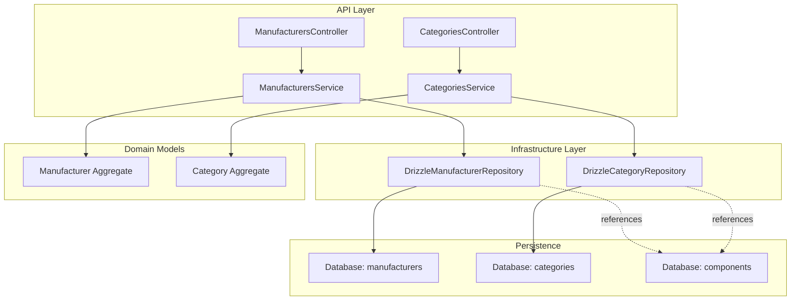
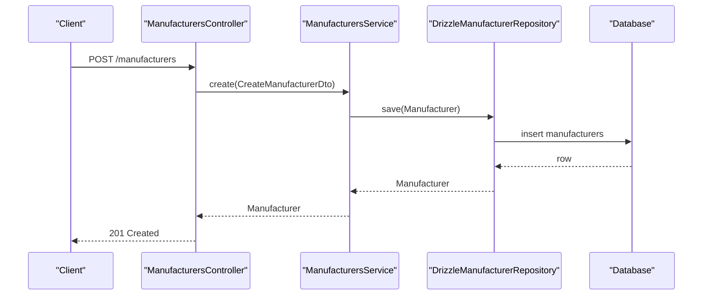
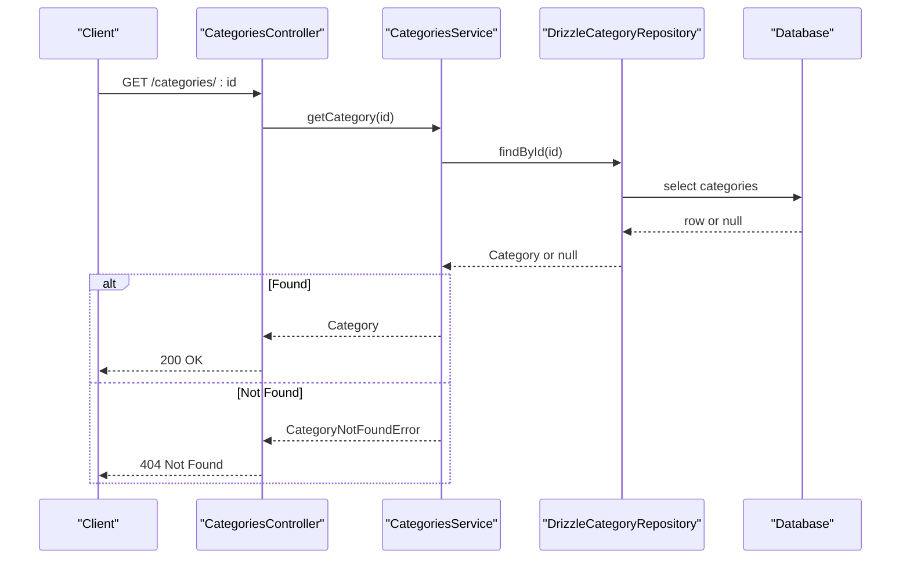
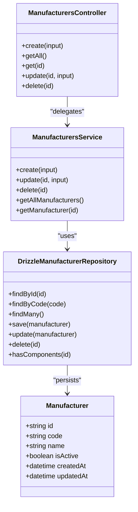
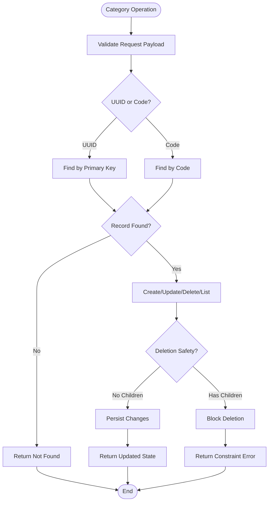
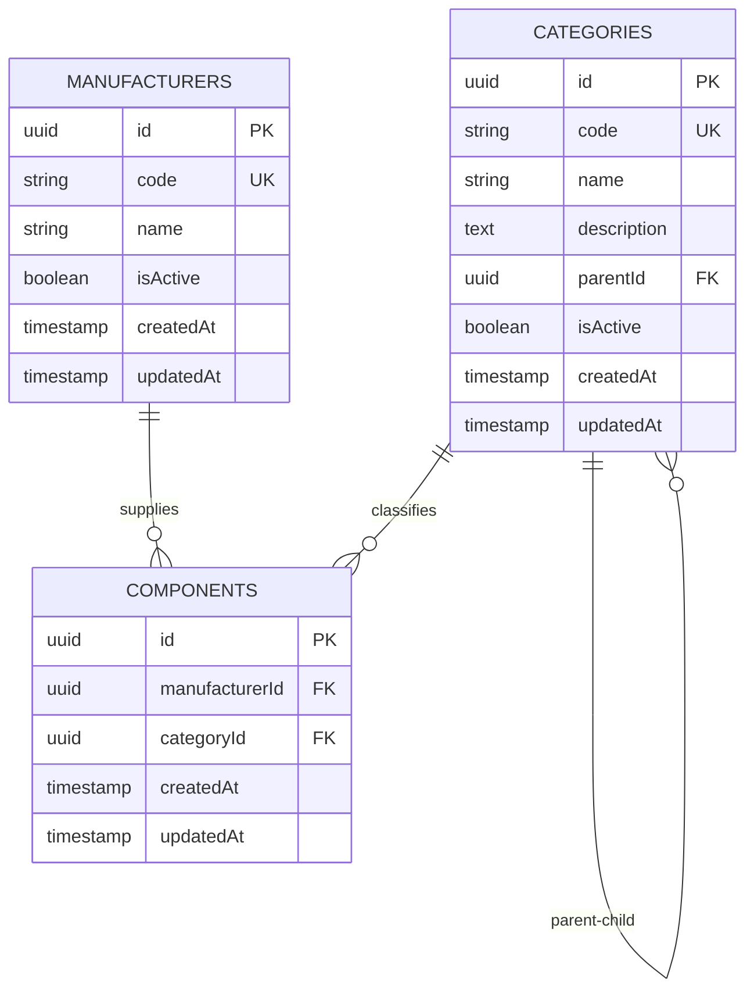
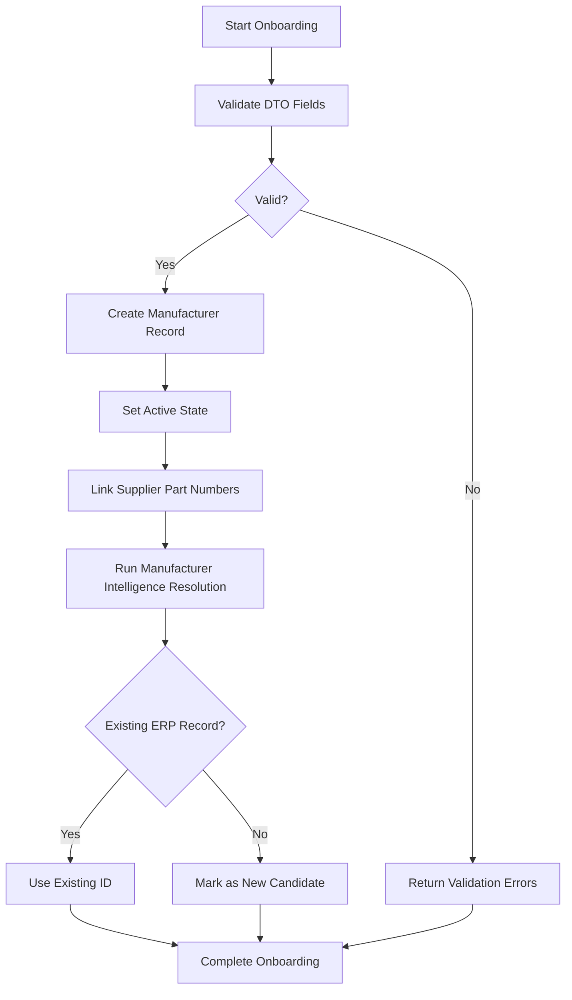
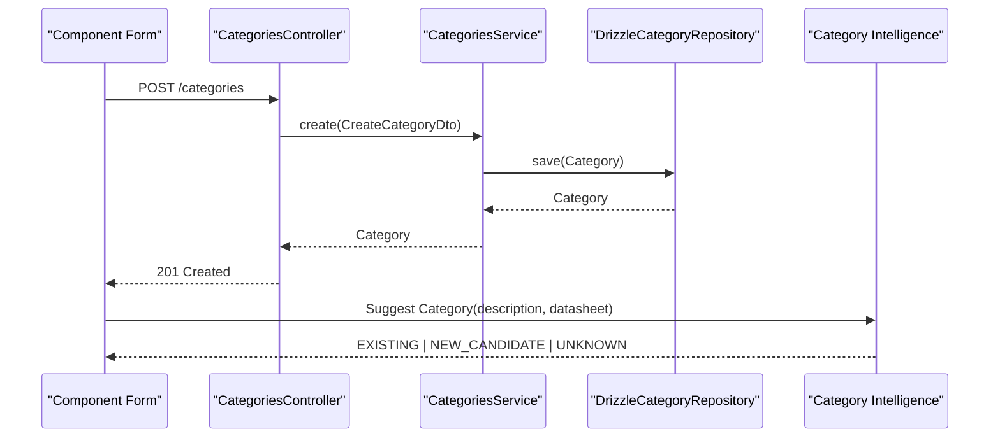
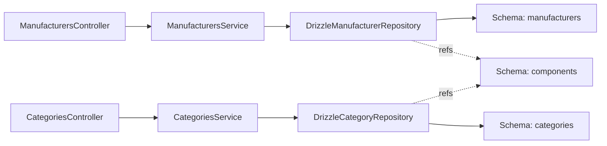

# Manufacturers & Categories

<cite>
**Referenced Files in This Document**
- [manufacturers.controller.ts](file://apps/api/src/manufacturers/manufacturers.controller.ts)
- [manufacturers.service.ts](file://apps/api/src/manufacturers/manufacturers.service.ts)
- [create-manufacturer.dto.ts](file://apps/api/src/manufacturers/create-manufacturer.dto.ts)
- [update-manufacturer.dto.ts](file://apps/api/src/manufacturers/update-manufacturer.dto.ts)
- [drizzle-manufacturer.repository.ts](file://apps/api/src/infrastructure/repositories/drizzle-manufacturer.repository.ts)
- [categories.controller.ts](file://apps/api/src/categories/categories.controller.ts)
- [categories.service.ts](file://apps/api/src/categories/categories.service.ts)
- [create-category.dto.ts](file://apps/api/src/categories/create-category.dto.ts)
- [update-category.dto.ts](file://apps/api/src/categories/update-category.dto.ts)
- [drizzle-category.repository.ts](file://apps/api/src/infrastructure/repositories/drizzle-category.repository.ts)
- [0060-manufacturer-intelligence-v2.md](file://docs/rfcs/0060-manufacturer-intelligence-v2.md)
- [0061-category-intelligence-v2.md](file://docs/rfcs/0061-category-intelligence-v2.md)
</cite>

## Table of Contents
1. [Introduction](#introduction)
2. [Project Structure](#project-structure)
3. [Core Components](#core-components)
4. [Architecture Overview](#architecture-overview)
5. [Detailed Component Analysis](#detailed-component-analysis)
6. [Dependency Analysis](#dependency-analysis)
7. [Performance Considerations](#performance-considerations)
8. [Troubleshooting Guide](#troubleshooting-guide)
9. [Conclusion](#conclusion)
10. [Appendices](#appendices)

## Introduction
This document explains how manufacturers and categories are managed within the Inventory Domain, focusing on master data governance, taxonomy design, classification rules, and integration with procurement and supplier management workflows. It covers:
- Manufacturer master data: identity, codes, active state, and relationships to components and suppliers.
- Category hierarchy: parent-child taxonomy, codes, descriptions, and classification rules.
- Intelligence-driven resolution for manufacturers and categories using ERP as authoritative source.
- Workflows for manufacturer onboarding, category assignment, and catalog organization.
- Reporting, performance tracking, and data governance practices.

## Project Structure
The implementation follows a layered NestJS architecture:
- Controllers expose REST endpoints for manufacturers and categories.
- Services encapsulate domain operations and delegate to repository abstractions.
- Repository implementations persist data through Drizzle ORM against database schema entities.
- DTOs define request validation rules for create and update operations.
- RFC documents define intelligence behavior for manufacturer and category resolution.

**Diagram sources**
- [manufacturers.controller.ts:17-48](file://apps/api/src/manufacturers/manufacturers.controller.ts#L17-L48)
- [manufacturers.service.ts:14-51](file://apps/api/src/manufacturers/manufacturers.service.ts#L14-L51)
- [categories.controller.ts:17-48](file://apps/api/src/categories/categories.controller.ts#L17-L48)
- [categories.service.ts:14-51](file://apps/api/src/categories/categories.service.ts#L14-L51)
- [drizzle-manufacturer.repository.ts:29-103](file://apps/api/src/infrastructure/repositories/drizzle-manufacturer.repository.ts#L29-L103)
- [drizzle-category.repository.ts:36-144](file://apps/api/src/infrastructure/repositories/drizzle-category.repository.ts#L36-L144)

**Section sources**
- [manufacturers.controller.ts:17-48](file://apps/api/src/manufacturers/manufacturers.controller.ts#L17-L48)
- [manufacturers.service.ts:14-51](file://apps/api/src/manufacturers/manufacturers.service.ts#L14-L51)
- [categories.controller.ts:17-48](file://apps/api/src/categories/categories.controller.ts#L17-L48)
- [categories.service.ts:14-51](file://apps/api/src/categories/categories.service.ts#L14-L51)
- [drizzle-manufacturer.repository.ts:29-103](file://apps/api/src/infrastructure/repositories/drizzle-manufacturer.repository.ts#L29-L103)
- [drizzle-category.repository.ts:36-144](file://apps/api/src/infrastructure/repositories/drizzle-category.repository.ts#L36-L144)

## Core Components
- Manufacturers API:
  - Create, read, update, delete, and list manufacturers.
  - Input validation via DTOs for code and name fields.
  - Service delegates to domain commands and repository.
- Categories API:
  - Create, read, update, delete, and list categories.
  - Supports hierarchical taxonomy via parentId.
  - Code-based lookup fallback alongside UUID primary key.
- Repositories:
  - Map between database rows and domain aggregates.
  - Provide existence checks for related components and children.

Key responsibilities:
- Controller: HTTP routing and exception filtering.
- Service: orchestration and error handling (e.g., not found).
- Repository: persistence, queries, and mapping.
- DTOs: input validation constraints.

**Section sources**
- [manufacturers.controller.ts:17-48](file://apps/api/src/manufacturers/manufacturers.controller.ts#L17-L48)
- [manufacturers.service.ts:14-51](file://apps/api/src/manufacturers/manufacturers.service.ts#L14-L51)
- [create-manufacturer.dto.ts:1-14](file://apps/api/src/manufacturers/create-manufacturer.dto.ts#L1-L14)
- [update-manufacturer.dto.ts:1-16](file://apps/api/src/manufacturers/update-manufacturer.dto.ts#L1-L16)
- [categories.controller.ts:17-48](file://apps/api/src/categories/categories.controller.ts#L17-L48)
- [categories.service.ts:14-51](file://apps/api/src/categories/categories.service.ts#L14-L51)
- [create-category.dto.ts:1-20](file://apps/api/src/categories/create-category.dto.ts#L1-L20)
- [update-category.dto.ts:1-24](file://apps/api/src/categories/update-category.dto.ts#L1-L24)

## Architecture Overview
The system separates concerns across controllers, services, repositories, and domain models. Manufacturer and category intelligence is advisory and uses ERP records as authoritative.

**Diagram sources**
- [manufacturers.controller.ts:22-25](file://apps/api/src/manufacturers/manufacturers.controller.ts#L22-L25)
- [manufacturers.service.ts:29-31](file://apps/api/src/manufacturers/manufacturers.service.ts#L29-L31)
- [drizzle-manufacturer.repository.ts:59-70](file://apps/api/src/infrastructure/repositories/drizzle-manufacturer.repository.ts#L59-L70)

**Diagram sources**
- [categories.controller.ts:32-35](file://apps/api/src/categories/categories.controller.ts#L32-L35)
- [categories.service.ts:45-51](file://apps/api/src/categories/categories.service.ts#L45-L51)
- [drizzle-category.repository.ts:37-48](file://apps/api/src/infrastructure/repositories/drizzle-category.repository.ts#L37-L48)

## Detailed Component Analysis

### Manufacturer Master Data Management
- Identity model:
  - Unique code and human-readable name.
  - Active/inactive state controls availability for selection and suggestions.
- CRUD operations:
  - Create requires non-empty string fields with length limits.
  - Update allows partial changes including activation toggle.
  - Delete removes the record; existence checks can be performed before deletion.
- Relationships:
  - Components reference manufacturers by ID, enabling usage analysis and deprecation checks.
- Supplier linkage:
  - While supplier-specific information is typically modeled under suppliers, manufacturer identity can be used to correlate supplier catalogs and part numbers at integration boundaries.

**Diagram sources**
- [manufacturers.controller.ts:17-48](file://apps/api/src/manufacturers/manufacturers.controller.ts#L17-L48)
- [manufacturers.service.ts:14-51](file://apps/api/src/manufacturers/manufacturers.service.ts#L14-L51)
- [drizzle-manufacturer.repository.ts:29-103](file://apps/api/src/infrastructure/repositories/drizzle-manufacturer.repository.ts#L29-L103)

**Section sources**
- [manufacturers.controller.ts:17-48](file://apps/api/src/manufacturers/manufacturers.controller.ts#L17-L48)
- [manufacturers.service.ts:14-51](file://apps/api/src/manufacturers/manufacturers.service.ts#L14-L51)
- [create-manufacturer.dto.ts:1-14](file://apps/api/src/manufacturers/create-manufacturer.dto.ts#L1-L14)
- [update-manufacturer.dto.ts:1-16](file://apps/api/src/manufacturers/update-manufacturer.dto.ts#L1-L16)
- [drizzle-manufacturer.repository.ts:29-103](file://apps/api/src/infrastructure/repositories/drizzle-manufacturer.repository.ts#L29-L103)

### Category Hierarchy and Taxonomy Management
- Taxonomy model:
  - Each category has a unique code, display name, optional description, and optional parent category.
  - Active/inactive state controls visibility and resolution eligibility.
- Lookup flexibility:
  - findById supports both UUID primary keys and code-based lookup.
  - findByParentId enables building tree structures.
- Deletion safety:
  - hasChildren and hasComponents provide pre-checks to prevent breaking hierarchies or component classifications.

**Diagram sources**
- [drizzle-category.repository.ts:37-48](file://apps/api/src/infrastructure/repositories/drizzle-category.repository.ts#L37-L48)
- [drizzle-category.repository.ts:50-68](file://apps/api/src/infrastructure/repositories/drizzle-category.repository.ts#L50-L68)
- [drizzle-category.repository.ts:110-130](file://apps/api/src/infrastructure/repositories/drizzle-category.repository.ts#L110-L130)

**Section sources**
- [categories.controller.ts:17-48](file://apps/api/src/categories/categories.controller.ts#L17-L48)
- [categories.service.ts:14-51](file://apps/api/src/categories/categories.service.ts#L14-L51)
- [create-category.dto.ts:1-20](file://apps/api/src/categories/create-category.dto.ts#L1-L20)
- [update-category.dto.ts:1-24](file://apps/api/src/categories/update-category.dto.ts#L1-L24)
- [drizzle-category.repository.ts:36-144](file://apps/api/src/infrastructure/repositories/drizzle-category.repository.ts#L36-L144)

### Relationship Between Manufacturers, Categories, and Components
- Components link to both manufacturers and categories:
  - manufacturerId ties a component to a manufacturer master record.
  - categoryId ties a component to a taxonomy node.
- Integrity checks:
  - Repository methods detect whether a manufacturer or category is referenced by any component.
- Classification workflow:
  - Assign a category during component creation or update.
  - Use manufacturer identity to enrich component metadata and support supplier-specific part number mapping at integration boundaries.

**Diagram sources**
- [drizzle-manufacturer.repository.ts:95-103](file://apps/api/src/infrastructure/repositories/drizzle-manufacturer.repository.ts#L95-L103)
- [drizzle-category.repository.ts:118-144](file://apps/api/src/infrastructure/repositories/drizzle-category.repository.ts#L118-L144)

**Section sources**
- [drizzle-manufacturer.repository.ts:95-103](file://apps/api/src/infrastructure/repositories/drizzle-manufacturer.repository.ts#L95-L103)
- [drizzle-category.repository.ts:118-144](file://apps/api/src/infrastructure/repositories/drizzle-category.repository.ts#L118-L144)

### Manufacturer Onboarding Workflow
- Steps:
  1. Validate payload: ensure code and name meet constraints.
  2. Create manufacturer record via service and repository.
  3. Activate or deactivate as needed.
  4. Link supplier catalogs and part numbers at integration boundaries.
  5. Use manufacturer intelligence to resolve existing records or propose new candidates without auto-creating ERP records.

**Diagram sources**
- [create-manufacturer.dto.ts:1-14](file://apps/api/src/manufacturers/create-manufacturer.dto.ts#L1-L14)
- [manufacturers.service.ts:29-31](file://apps/api/src/manufacturers/manufacturers.service.ts#L29-L31)
- [drizzle-manufacturer.repository.ts:59-70](file://apps/api/src/infrastructure/repositories/drizzle-manufacturer.repository.ts#L59-L70)
- [0060-manufacturer-intelligence-v2.md:13-35](file://docs/rfcs/0060-manufacturer-intelligence-v2.md#L13-L35)

**Section sources**
- [create-manufacturer.dto.ts:1-14](file://apps/api/src/manufacturers/create-manufacturer.dto.ts#L1-L14)
- [manufacturers.service.ts:29-31](file://apps/api/src/manufacturers/manufacturers.service.ts#L29-L31)
- [drizzle-manufacturer.repository.ts:59-70](file://apps/api/src/infrastructure/repositories/drizzle-manufacturer.repository.ts#L59-L70)
- [0060-manufacturer-intelligence-v2.md:13-35](file://docs/rfcs/0060-manufacturer-intelligence-v2.md#L13-L35)

### Category Assignment Workflow
- Steps:
  1. Validate payload including optional description and parent category.
  2. Resolve target category by UUID or code.
  3. Assign category to component during creation or update.
  4. Use category intelligence to suggest existing categories or propose new candidates.
  5. Maintain hierarchy integrity by checking parent-child relationships.

**Diagram sources**
- [categories.controller.ts:22-25](file://apps/api/src/categories/categories.controller.ts#L22-L25)
- [categories.service.ts:29-31](file://apps/api/src/categories/categories.service.ts#L29-L31)
- [drizzle-category.repository.ts:76-87](file://apps/api/src/infrastructure/repositories/drizzle-category.repository.ts#L76-L87)
- [0061-category-intelligence-v2.md:13-27](file://docs/rfcs/0061-category-intelligence-v2.md#L13-L27)

**Section sources**
- [categories.controller.ts:22-25](file://apps/api/src/categories/categories.controller.ts#L22-L25)
- [categories.service.ts:29-31](file://apps/api/src/categories/categories.service.ts#L29-L31)
- [create-category.dto.ts:1-20](file://apps/api/src/categories/create-category.dto.ts#L1-L20)
- [drizzle-category.repository.ts:76-87](file://apps/api/src/infrastructure/repositories/drizzle-category.repository.ts#L76-L87)
- [0061-category-intelligence-v2.md:13-27](file://docs/rfcs/0061-category-intelligence-v2.md#L13-L27)

### Catalog Organization Examples
- Organize components by:
  - Broad category nodes (e.g., passive components, semiconductors).
  - Specific child nodes (e.g., resistors, capacitors, IC families).
- Enrich with manufacturer data:
  - Associate components with manufacturer identities.
  - Use supplier-specific part numbers at integration points.
- Maintain consistency:
  - Prefer existing ERP categories when possible.
  - Use intelligence to propose new candidates only when evidence is strong.

[No sources needed since this section provides conceptual examples]

## Dependency Analysis
- Coupling:
  - Controllers depend on services for business logic.
  - Services depend on repository interfaces for persistence.
  - Repositories depend on database schema entities and query utilities.
- Cohesion:
  - Manufacturer and category modules are cohesive around their respective domains.
- External dependencies:
  - Database schema tables: manufacturers, categories, components.
  - Intelligence RFCs define resolution contracts and evaluation criteria.

**Diagram sources**
- [manufacturers.controller.ts:17-48](file://apps/api/src/manufacturers/manufacturers.controller.ts#L17-L48)
- [manufacturers.service.ts:14-51](file://apps/api/src/manufacturers/manufacturers.service.ts#L14-L51)
- [categories.controller.ts:17-48](file://apps/api/src/categories/categories.controller.ts#L17-L48)
- [categories.service.ts:14-51](file://apps/api/src/categories/categories.service.ts#L14-L51)
- [drizzle-manufacturer.repository.ts:29-103](file://apps/api/src/infrastructure/repositories/drizzle-manufacturer.repository.ts#L29-L103)
- [drizzle-category.repository.ts:36-144](file://apps/api/src/infrastructure/repositories/drizzle-category.repository.ts#L36-L144)

**Section sources**
- [manufacturers.controller.ts:17-48](file://apps/api/src/manufacturers/manufacturers.controller.ts#L17-L48)
- [manufacturers.service.ts:14-51](file://apps/api/src/manufacturers/manufacturers.service.ts#L14-L51)
- [categories.controller.ts:17-48](file://apps/api/src/categories/categories.controller.ts#L17-L48)
- [categories.service.ts:14-51](file://apps/api/src/categories/categories.service.ts#L14-L51)
- [drizzle-manufacturer.repository.ts:29-103](file://apps/api/src/infrastructure/repositories/drizzle-manufacturer.repository.ts#L29-L103)
- [drizzle-category.repository.ts:36-144](file://apps/api/src/infrastructure/repositories/drizzle-category.repository.ts#L36-L144)

## Performance Considerations
- Query efficiency:
  - Use code-based lookups where appropriate to avoid unnecessary joins.
  - Leverage exists checks (hasComponents, hasChildren) before expensive operations like deletion.
- Indexing:
  - Ensure indexes on manufacturer code, category code, and foreign keys (manufacturerId, categoryId, parentId).
- Intelligence overhead:
  - Keep ML calls stateless and cache snapshots of ERP records when feasible.
- Pagination and filtering:
  - For large catalogs, apply pagination and filters at the repository layer.

[No sources needed since this section provides general guidance]

## Troubleshooting Guide
- Manufacturer not found:
  - The service throws a not found error when retrieval fails.
  - Verify ID or code correctness and check active state if applicable.
- Category not found:
  - The service throws a not found error when retrieval fails.
  - Try resolving by code if UUID is unknown.
- Deletion constraints:
  - Prevent deleting categories with children or components referencing them.
  - Check hasChildren and hasComponents before deletion.
- Validation errors:
  - Ensure required fields are present and within allowed lengths.
  - Confirm boolean flags are correctly typed.

**Section sources**
- [manufacturers.service.ts:45-51](file://apps/api/src/manufacturers/manufacturers.service.ts#L45-L51)
- [categories.service.ts:45-51](file://apps/api/src/categories/categories.service.ts#L45-L51)
- [drizzle-category.repository.ts:110-144](file://apps/api/src/infrastructure/repositories/drizzle-category.repository.ts#L110-L144)
- [create-manufacturer.dto.ts:1-14](file://apps/api/src/manufacturers/create-manufacturer.dto.ts#L1-L14)
- [create-category.dto.ts:1-20](file://apps/api/src/categories/create-category.dto.ts#L1-L20)

## Conclusion
Manufacturers and categories form foundational master data for the Inventory Domain. The implementation provides robust CRUD operations, hierarchical taxonomy support, and intelligence-driven resolution that respects ERP authority. By combining clear domain boundaries, repository-level integrity checks, and well-defined DTOs, the system supports reliable catalog organization, supplier integration, and reporting. Governance practices emphasize explicit creation, careful deactivation, and cautious deletion to maintain data quality and operational stability.

[No sources needed since this section summarizes without analyzing specific files]

## Appendices

### Manufacturer Intelligence Resolution Summary
- Evidence precedence includes exact ERP matches, normalized names, aliases, MPN patterns, and textual signals.
- Resolution states: EXISTING, NEW_CANDIDATE, UNKNOWN.
- ML remains advisory; ERP and Data Pack evidence guide decisions.

**Section sources**
- [0060-manufacturer-intelligence-v2.md:13-35](file://docs/rfcs/0060-manufacturer-intelligence-v2.md#L13-L35)

### Category Intelligence Resolution Summary
- Scoring combines ERP categories, knowledge aliases, Data Pack rules, manufacturer context, datasheet text, classifier signal, and hierarchy specificity.
- Resolution states: EXISTING, NEW_CANDIDATE, UNKNOWN.
- Deterministic fallback available when ML is unavailable.

**Section sources**
- [0061-category-intelligence-v2.md:13-27](file://docs/rfcs/0061-category-intelligence-v2.md#L13-L27)