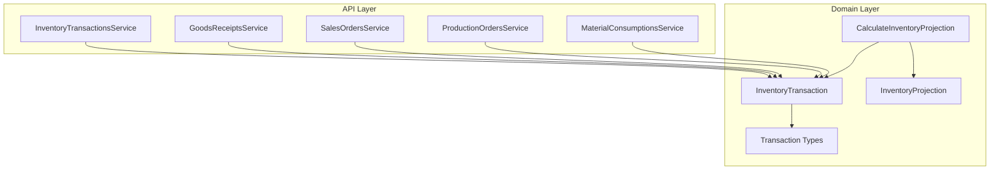
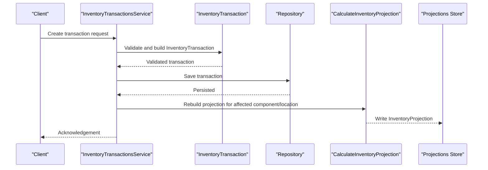
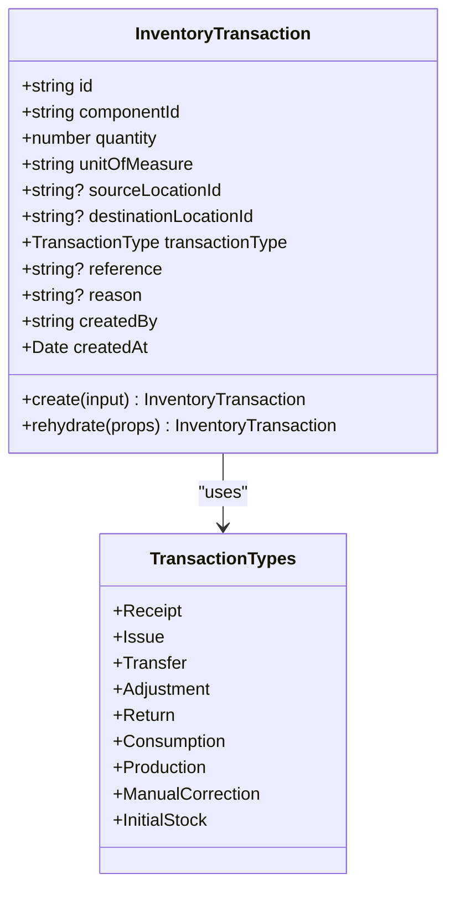
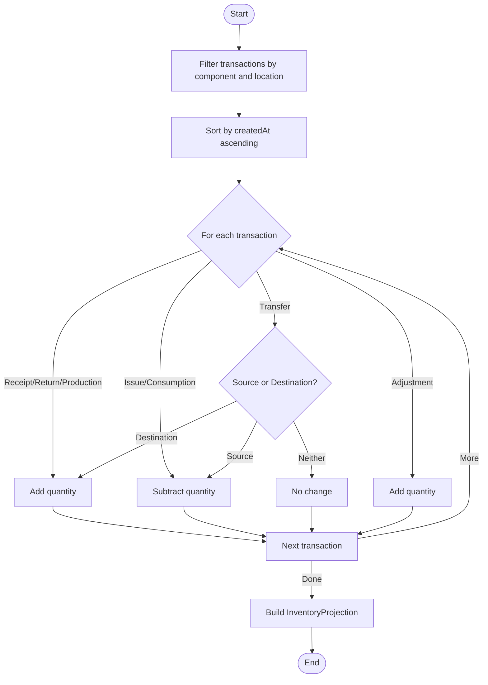
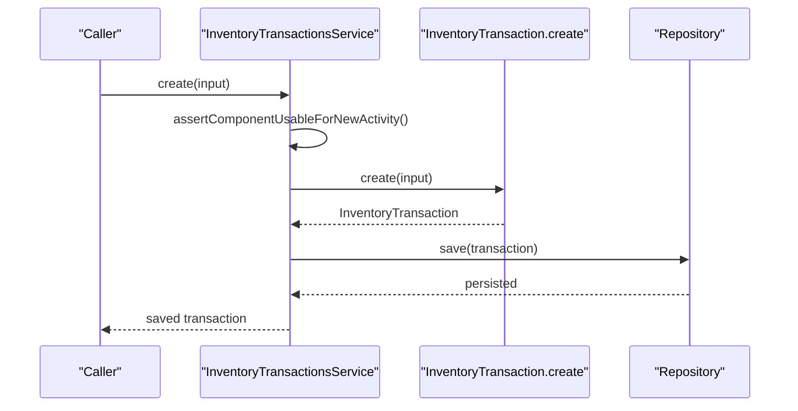
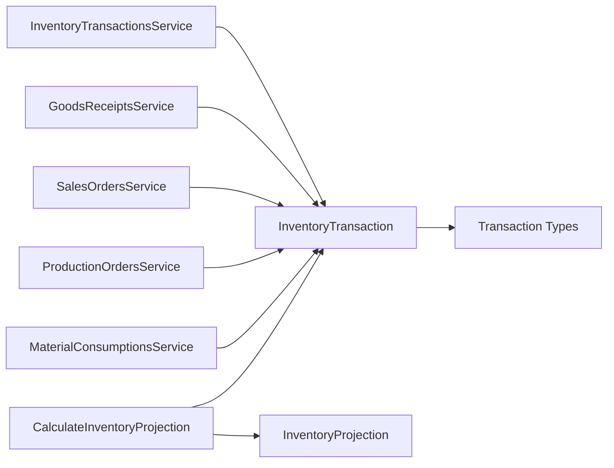

# Stock Tracking & Ledger

<cite>
**Referenced Files in This Document**
- [inventory-transaction.ts](file://packages/inventory/src/ledger/inventory-transaction.ts)
- [transaction-types.ts](file://packages/inventory/src/ledger/transaction-types.ts)
- [inventory-transaction.types.ts](file://packages/inventory/src/ledger/inventory-transaction.types.ts)
- [calculate-inventory-projection.ts](file://packages/inventory/src/projection/calculate-inventory-projection.ts)
- [inventory-projection.ts](file://packages/inventory/src/projection/inventory-projection.ts)
- [inventory-transactions.service.ts](file://apps/api/src/inventory-transactions/inventory-transactions.service.ts)
- [goods-receipts.service.ts](file://apps/api/src/goods-receipts/goods-receipts.service.ts)
- [sales-orders.service.ts](file://apps/api/src/sales-orders/sales-orders.service.ts)
- [production-orders.service.ts](file://apps/api/src/production-orders/production-orders.service.ts)
- [material-consumptions.service.ts](file://apps/api/src/material-consumptions/material-consumptions.service.ts)
- [0001-inventory-ledger.md](file://docs/rfcs/0001-inventory-ledger.md)
- [0003-inventory-ledger.md](file://docs/rfcs/0003-inventory-ledger.md)
- [0005-transaction-types.md](file://docs/rfcs/0005-transaction-types.md)
</cite>

## Table of Contents
1. Introduction
2. Project Structure
3. Core Components
4. Architecture Overview
5. Detailed Component Analysis
6. Dependency Analysis
7. Performance Considerations
8. Troubleshooting Guide
9. Conclusion

## Introduction
This document explains the Stock Tracking and Ledger system that records every inventory movement as an immutable transaction, derives current stock from those transactions, and provides projections for availability and planning. It covers the ledger architecture, canonical transaction types, double-entry style effects across locations, stock projections, real-time updates, and the end-to-end processing pipeline for goods receipts, sales orders, production consumption, and stock adjustments. It also includes examples of queries and reconciliation processes, performance guidance for high-volume operations, caching strategies, audit trails, and integration points with procurement, manufacturing, and sales domains.

## Project Structure
The system is organized into:
- Domain models and rules in the inventory package (ledger and projection).
- API layer services that orchestrate domain logic and persist changes.
- RFCs defining design principles, invariants, and canonical transaction types.

**Diagram sources**
- [inventory-transactions.service.ts:19-31](file://apps/api/src/inventory-transactions/inventory-transactions.service.ts#L19-L31)
- [inventory-transaction.ts:22-169](file://packages/inventory/src/ledger/inventory-transaction.ts#L22-L169)
- [transaction-types.ts:1-26](file://packages/inventory/src/ledger/transaction-types.ts#L1-L26)
- [calculate-inventory-projection.ts:11-93](file://packages/inventory/src/projection/calculate-inventory-projection.ts#L11-L93)
- [inventory-projection.ts:12-76](file://packages/inventory/src/projection/inventory-projection.ts#L12-L76)

**Section sources**
- [0003-inventory-ledger.md:175-219](file://docs/rfcs/0003-inventory-ledger.md#L175-L219)
- [0005-transaction-types.md:11-66](file://docs/rfcs/0005-transaction-types.md#L11-L66)

## Core Components
- InventoryTransaction: Immutable aggregate representing a single inventory movement with validation and type-specific location constraints.
- Transaction Types: Canonical list of business meanings for movements (Receipt, Issue, Transfer, Adjustment, Return, Consumption, Production, ManualCorrection, InitialStock).
- CalculateInventoryProjection: Computes cumulative quantity for a component-location pair by replaying relevant transactions in order.
- InventoryProjection: Read model capturing computed quantity, unit of measure, and last updated timestamp.
- API Services: Orchestrate creation and retrieval of transactions and integrate with domain modules.

Key responsibilities:
- Ledger records history only; no mutable balances are directly edited.
- Projections derive state deterministically from the ledger.
- Business workflows create transactions using standardized types.

**Section sources**
- [inventory-transaction.ts:22-169](file://packages/inventory/src/ledger/inventory-transaction.ts#L22-L169)
- [transaction-types.ts:1-26](file://packages/inventory/src/ledger/transaction-types.ts#L1-L26)
- [calculate-inventory-projection.ts:11-93](file://packages/inventory/src/projection/calculate-inventory-projection.ts#L11-L93)
- [inventory-projection.ts:12-76](file://packages/inventory/src/projection/inventory-projection.ts#L12-L76)
- [inventory-transactions.service.ts:19-31](file://apps/api/src/inventory-transactions/inventory-transactions.service.ts#L19-L31)

## Architecture Overview
The system follows an event-based model where inventory is derived from an append-only ledger. Business workflows emit transactions with canonical types. Projections compute current stock per component-location. The API layer enforces domain invariants and persists data via repositories.

**Diagram sources**
- [inventory-transactions.service.ts:19-31](file://apps/api/src/inventory-transactions/inventory-transactions.service.ts#L19-L31)
- [inventory-transaction.ts:53-156](file://packages/inventory/src/ledger/inventory-transaction.ts#L53-L156)
- [calculate-inventory-projection.ts:11-93](file://packages/inventory/src/projection/calculate-inventory-projection.ts#L11-L93)

## Detailed Component Analysis

### InventoryTransaction Aggregate
- Enforces positive quantities and valid transaction types.
- Validates location requirements per type:
  - Receipt: no source location.
  - Issue: no destination location.
  - Transfer: requires distinct source and destination.
  - Adjustment: at least one location.
  - Other types allow flexible location usage.
- Generates identity and timestamps; rehydration bypasses validation for persistence.

**Diagram sources**
- [inventory-transaction.ts:22-169](file://packages/inventory/src/ledger/inventory-transaction.ts#L22-L169)
- [transaction-types.ts:1-26](file://packages/inventory/src/ledger/transaction-types.ts#L1-L26)

**Section sources**
- [inventory-transaction.ts:53-156](file://packages/inventory/src/ledger/inventory-transaction.ts#L53-L156)
- [transaction-types.ts:1-26](file://packages/inventory/src/ledger/transaction-types.ts#L1-L26)

### Projection Engine
- Filters transactions for a specific component and location.
- Sorts by creation time to ensure deterministic replay.
- Applies type-specific arithmetic:
  - Increases: Receipt, Return, Production.
  - Decreases: Issue, Consumption.
  - Transfers: increase if destination matches, decrease if source matches.
  - Adjustments: additive (can be positive or negative).
- Produces an InventoryProjection with calculated quantity and metadata.

**Diagram sources**
- [calculate-inventory-projection.ts:11-93](file://packages/inventory/src/projection/calculate-inventory-projection.ts#L11-L93)

**Section sources**
- [calculate-inventory-projection.ts:11-93](file://packages/inventory/src/projection/calculate-inventory-projection.ts#L11-L93)
- [inventory-projection.ts:12-76](file://packages/inventory/src/projection/inventory-projection.ts#L12-L76)

### API Service: Inventory Transactions
- Ensures components are usable before creating new transactions (e.g., prevents resurrecting consolidated components).
- Delegates creation to domain factory and persists via repository.
- Provides query methods to retrieve transactions by options or ID.

**Diagram sources**
- [inventory-transactions.service.ts:19-31](file://apps/api/src/inventory-transactions/inventory-transactions.service.ts#L19-L31)
- [inventory-transaction.ts:53-156](file://packages/inventory/src/ledger/inventory-transaction.ts#L53-L156)

**Section sources**
- [inventory-transactions.service.ts:19-31](file://apps/api/src/inventory-transactions/inventory-transactions.service.ts#L19-L31)

### Goods Receipts Integration
- Typically creates Receipt transactions to increase on-hand inventory upon receiving purchased goods.
- May include batch/serial attributes and reference the originating purchase order or goods receipt document.

**Section sources**
- [goods-receipts.service.ts](file://apps/api/src/goods-receipts/goods-receipts.service.ts)
- [0005-transaction-types.md:66-79](file://docs/rfcs/0005-transaction-types.md#L66-L79)

### Sales Orders Integration
- Typically creates Issue transactions when fulfilling sales orders to reduce on-hand inventory.
- May include batch/serial attributes and reference the sales order or fulfillment document.

**Section sources**
- [sales-orders.service.ts](file://apps/api/src/sales-orders/sales-orders.service.ts)
- [0005-transaction-types.md:81-92](file://docs/rfcs/0005-transaction-types.md#L81-L92)

### Production Orders Integration
- Creates Production transactions to add finished goods to inventory upon completion.
- May link to work orders or production orders.

**Section sources**
- [production-orders.service.ts](file://apps/api/src/production-orders/production-orders.service.ts)
- [calculate-inventory-projection.ts:38-44](file://packages/inventory/src/projection/calculate-inventory-projection.ts#L38-L44)

### Material Consumptions Integration
- Creates Consumption transactions to deduct raw materials used in production.
- May reference work orders or production orders.

**Section sources**
- [material-consumptions.service.ts](file://apps/api/src/material-consumptions/material-consumptions.service.ts)
- [calculate-inventory-projection.ts:46-50](file://packages/inventory/src/projection/calculate-inventory-projection.ts#L46-L50)

### Double-Entry Style Effects Across Locations
- While the ledger stores individual transactions, transfers conceptually move stock between locations:
  - Source location: transfer out decreases balance.
  - Destination location: transfer in increases balance.
- This yields a balanced view across locations without mutating a central balance table.

**Section sources**
- [calculate-inventory-projection.ts:52-62](file://packages/inventory/src/projection/calculate-inventory-projection.ts#L52-L62)
- [0001-inventory-ledger.md:195-213](file://docs/rfcs/0001-inventory-ledger.md#L195-L213)

## Dependency Analysis
- API services depend on domain aggregates and repositories.
- Projections depend on the ledger’s transaction stream and type semantics.
- Transaction types provide a stable contract across modules.

**Diagram sources**
- [inventory-transactions.service.ts:19-31](file://apps/api/src/inventory-transactions/inventory-transactions.service.ts#L19-L31)
- [inventory-transaction.ts:22-169](file://packages/inventory/src/ledger/inventory-transaction.ts#L22-L169)
- [transaction-types.ts:1-26](file://packages/inventory/src/ledger/transaction-types.ts#L1-L26)
- [calculate-inventory-projection.ts:11-93](file://packages/inventory/src/projection/calculate-inventory-projection.ts#L11-L93)
- [inventory-projection.ts:12-76](file://packages/inventory/src/projection/inventory-projection.ts#L12-L76)

**Section sources**
- [0003-inventory-ledger.md:175-219](file://docs/rfcs/0003-inventory-ledger.md#L175-L219)

## Performance Considerations
- High-volume writes:
  - Use batched saves for multiple transactions within a single business operation.
  - Ensure indexes on componentId, locationId, createdAt, and transactionType for efficient filtering and sorting during projection rebuilds.
- Projection rebuilds:
  - Rebuild only affected component-location pairs after a transaction write.
  - Consider incremental updates if transaction streams grow large.
- Caching strategies:
  - Cache InventoryProjection results keyed by (componentId, locationId) with invalidation on related transactions.
  - Use short TTLs for hot reads and longer TTLs for reporting windows.
- Concurrency:
  - Apply optimistic concurrency control on projection writes to avoid lost updates.
  - Serialize conflicting operations per component-location when necessary.
- Auditability:
  - Keep all transactions immutable and append-only.
  - Record reference and reason fields for traceability.

[No sources needed since this section provides general guidance]

## Troubleshooting Guide
Common issues and resolutions:
- Invalid quantity:
  - Ensure quantity is greater than zero when creating transactions.
- Invalid transaction type:
  - Use canonical types defined in the transaction types module.
- Location constraints violated:
  - Receipt must not have a source location.
  - Issue must not have a destination location.
  - Transfer must have distinct source and destination.
  - Adjustment must have at least one location.
- Consolidated components:
  - Do not create new transactions for retired/consolidated components; enforce pre-check before creation.

Reconciliation steps:
- Sum all transactions for a component-location pair to verify projected quantity.
- For transfers, confirm equal and opposite effects across source and destination locations.
- Investigate discrepancies by reviewing references and reasons attached to transactions.

**Section sources**
- [inventory-transaction.ts:53-156](file://packages/inventory/src/ledger/inventory-transaction.ts#L53-L156)
- [inventory-transactions.service.ts:19-31](file://apps/api/src/inventory-transactions/inventory-transactions.service.ts#L19-L31)
- [0001-inventory-ledger.md:235-257](file://docs/rfcs/0001-inventory-ledger.md#L235-L257)

## Conclusion
The Stock Tracking and Ledger system models inventory as an immutable sequence of transactions with canonical types, ensuring full auditability and deterministic state derivation. Projections compute current stock per component-location, enabling accurate availability calculations and planning. The API layer integrates with procurement, manufacturing, and sales domains to create appropriate transactions, while robust validation and invariants maintain data integrity. With careful indexing, caching, and projection management, the system scales to high-volume operations while preserving reliability and traceability.