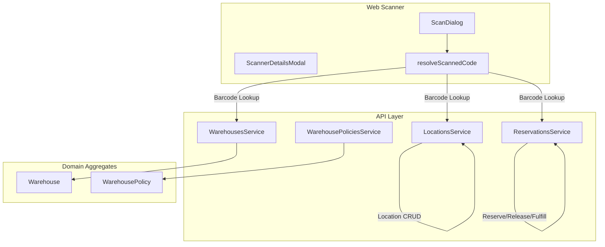
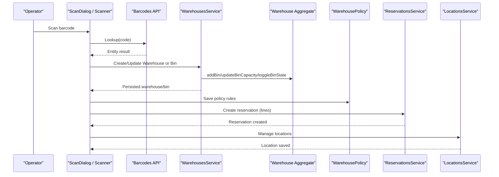
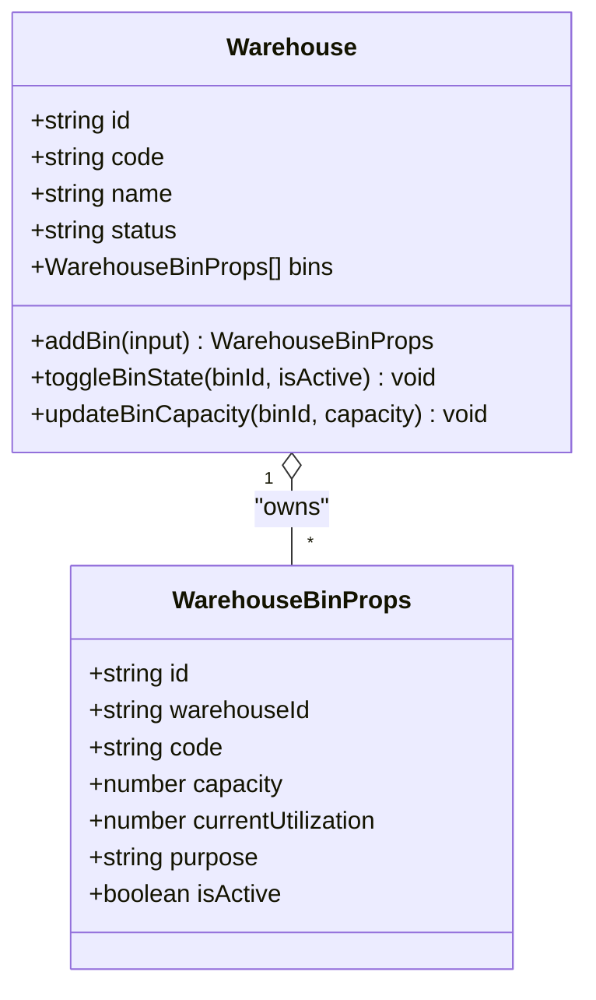
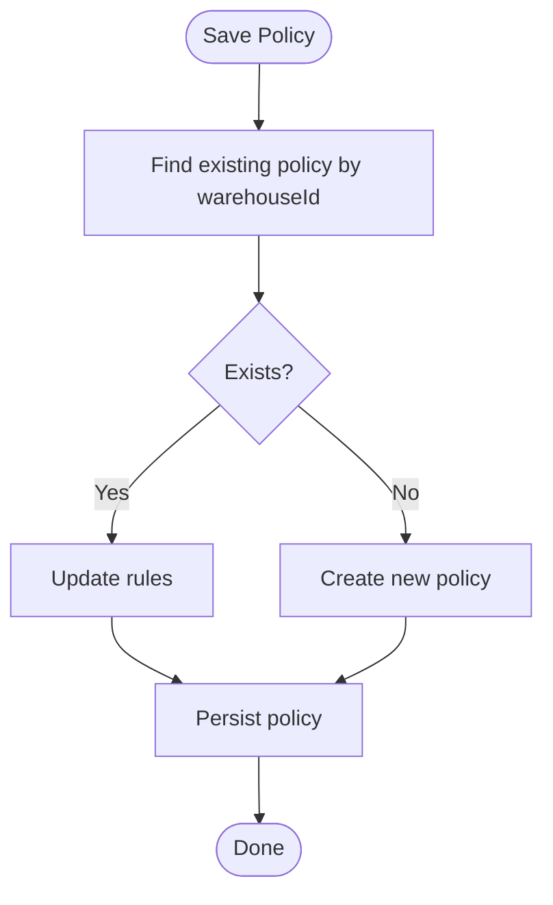
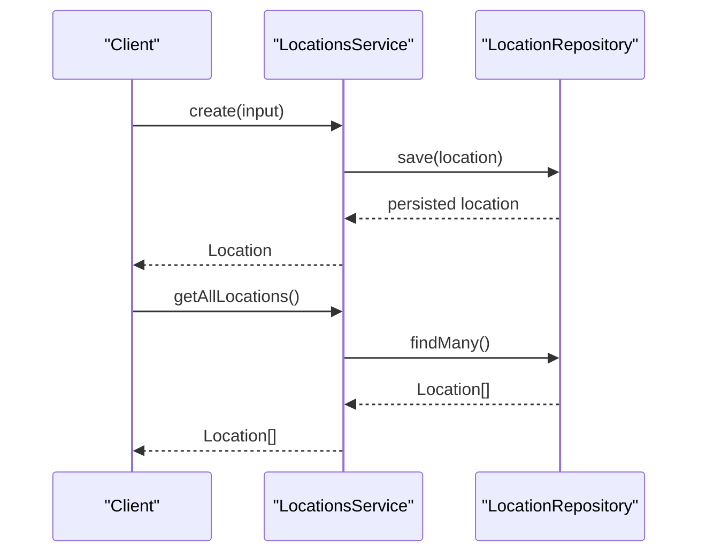
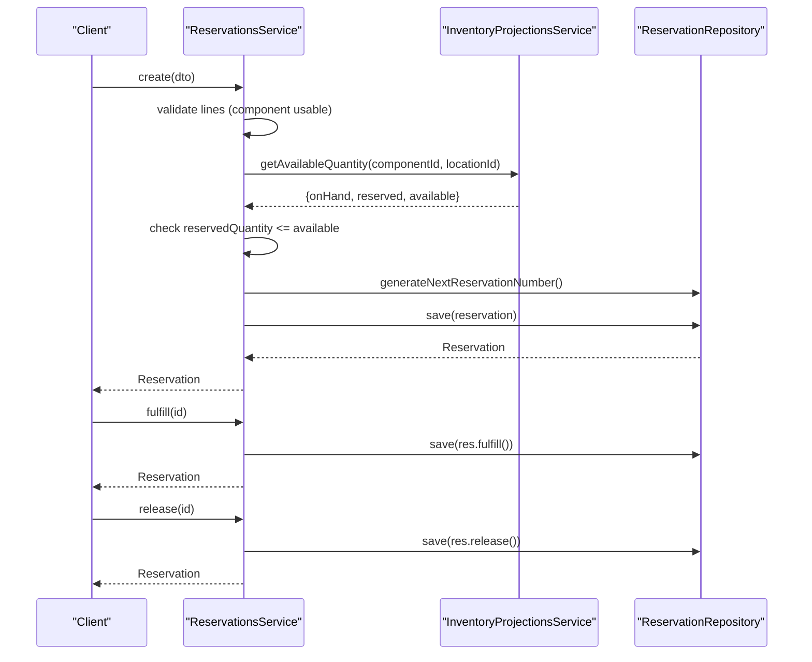
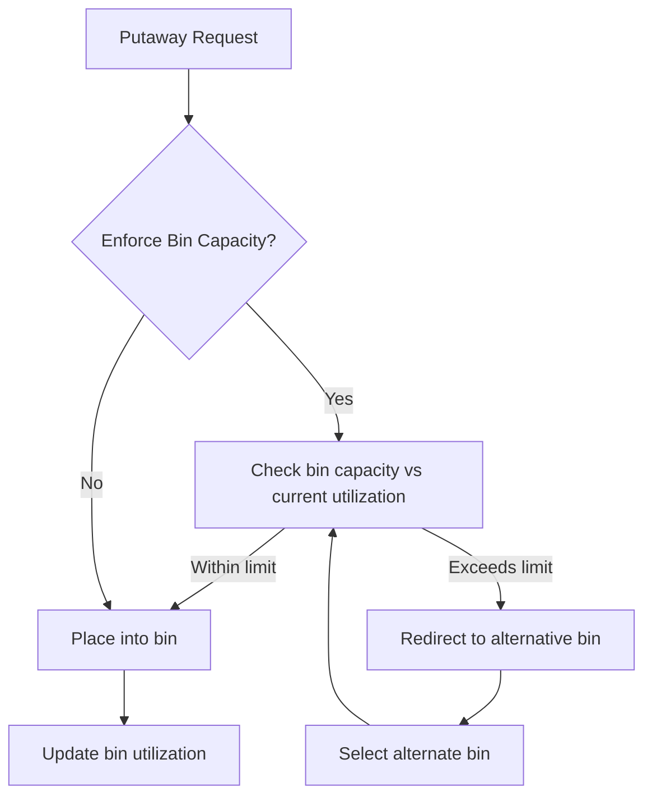
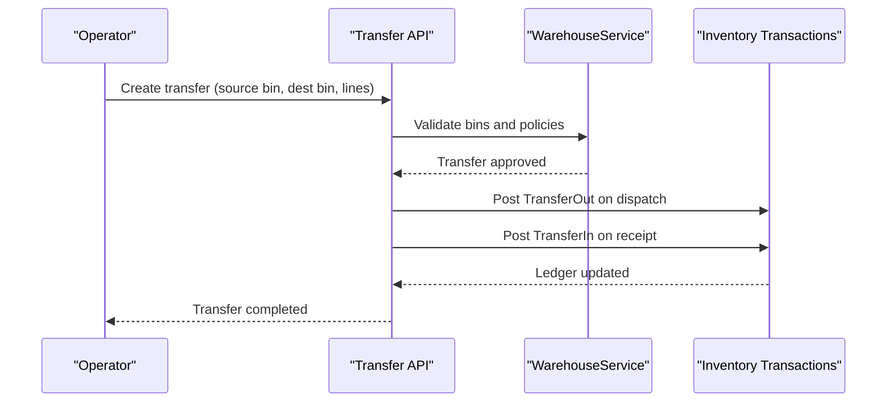
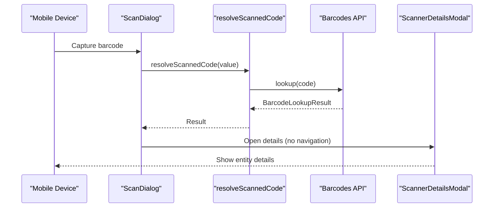
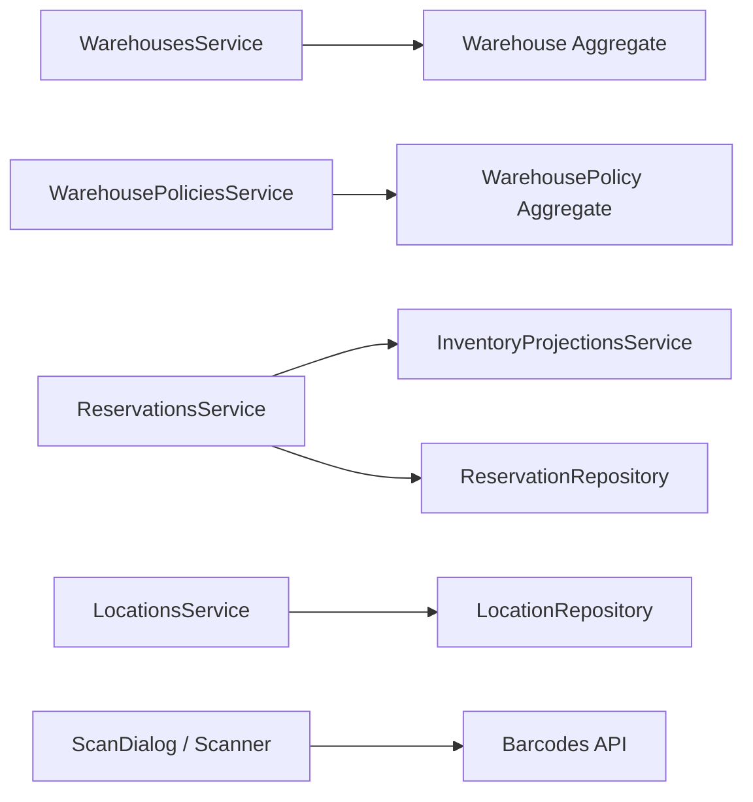

# Warehouse & Location Management

<cite>
**Referenced Files in This Document**
- [0021-warehouse-structure-and-bin-locations.md](file://docs/rfcs/0021-warehouse-structure-and-bin-locations.md)
- [0025-warehouse-policies.md](file://docs/rfcs/0025-warehouse-policies.md)
- [0008-inventory-reservations.md](file://docs/rfcs/0008-inventory-reservations.md)
- [0024-warehouse-transfers.md](file://docs/rfcs/0024-warehouse-transfers.md)
- [warehouses.service.ts](file://apps/api/src/warehouses/warehouses.service.ts)
- [dtos.ts](file://apps/api/src/warehouses/dtos.ts)
- [warehouse.ts](file://packages/warehouse/src/warehouses/warehouse.ts)
- [warehouse-policy.ts](file://packages/warehouse/src/policies/warehouse-policy.ts)
- [warehouse-policies.service.ts](file://apps/api/src/warehouse-policies/warehouse-policies.service.ts)
- [locations.service.ts](file://apps/api/src/locations/locations.service.ts)
- [reservations.service.ts](file://apps/api/src/reservations/reservations.service.ts)
- [dtos.ts](file://apps/api/src/reservations/dtos.ts)
- [scan-dialog.tsx](file://apps/web/components/barcodes/scan-dialog.tsx)
- [scanner-details-modal.tsx](file://apps/web/components/scanner/scanner-details-modal.tsx)
- [scanner.ts](file://apps/web/lib/scanner.ts)
</cite>

## Table of Contents
1. Introduction
2. Project Structure
3. Core Components
4. Architecture Overview
5. Detailed Component Analysis
6. Dependency Analysis
7. Performance Considerations
8. Troubleshooting Guide
9. Conclusion
10. Appendices

## Introduction
This document explains the Warehouse and Location Management capabilities within the Inventory Domain. It covers the hierarchical warehouse structure, location modeling, bin management, warehouse policies, capacity planning, reservation management (stock reservations, allocations, and releases), multi-warehouse support, cross-docking operations, inventory placement strategies, and integration with physical warehouse operations including barcode scanning and mobile devices.

## Project Structure
The warehouse and location features span domain design documents (RFCs), API services, domain aggregates, and web scanner integrations:
- RFCs define the conceptual model for warehouses, bins, policies, transfers, and reservations.
- API services orchestrate commands against domain aggregates and repositories.
- Domain aggregates enforce invariants and state transitions.
- Web components provide barcode scanning and entity lookup to connect operators to ERP data.

**Diagram sources**
- [warehouses.service.ts:18-60](file://apps/api/src/warehouses/warehouses.service.ts#L18-L60)
- [warehouse-policies.service.ts:14-36](file://apps/api/src/warehouse-policies/warehouse-policies.service.ts#L14-L36)
- [locations.service.ts:29-51](file://apps/api/src/locations/locations.service.ts#L29-L51)
- [reservations.service.ts:27-175](file://apps/api/src/reservations/reservations.service.ts#L27-L175)
- [warehouse.ts:66-134](file://packages/warehouse/src/warehouses/warehouse.ts#L66-L134)
- [warehouse-policy.ts:55-97](file://packages/warehouse/src/policies/warehouse-policy.ts#L55-L97)
- [scan-dialog.tsx:177-226](file://apps/web/components/barcodes/scan-dialog.tsx#L177-L226)
- [scanner-details-modal.tsx:19-41](file://apps/web/components/scanner/scanner-details-modal.tsx#L19-L41)
- [scanner.ts:174-205](file://apps/web/lib/scanner.ts#L174-L205)

**Section sources**
- [0021-warehouse-structure-and-bin-locations.md:11-23](file://docs/rfcs/0021-warehouse-structure-and-bin-locations.md#L11-L23)
- [0025-warehouse-policies.md:11-24](file://docs/rfcs/0025-warehouse-policies.md#L11-L24)
- [0008-inventory-reservations.md:11-18](file://docs/rfcs/0008-inventory-reservations.md#L11-L18)
- [0024-warehouse-transfers.md:11-23](file://docs/rfcs/0024-warehouse-transfers.md#L11-L23)

## Core Components
- Hierarchical Warehouse and Bin Model: A six-level hierarchy (Warehouse → Zone → Aisle → Rack → Shelf → Bin) defines physical storage. Bins carry capacity, utilization, purpose, and lifecycle state.
- Warehouse Policies: Configurable rules per warehouse such as capacity enforcement, negative inventory allowance, directed putaway/picking, and default operational bins.
- Locations: Reference locations managed by the Inventory module; warehouse bins map to inventory locations when stock moves.
- Reservations: Temporary allocations that reduce available inventory without moving stock; they can be fulfilled, released, expired, or cancelled.
- Transfers: Bin-to-bin movements across or within warehouses, triggering inventory transactions upon completion.

Key responsibilities:
- WarehousesService creates warehouses, adds bins, toggles bin states, and updates capacities.
- WarehousePoliciesService persists policy configurations per warehouse.
- LocationsService provides CRUD for inventory locations.
- ReservationsService enforces over-reservation checks, manages lifecycle, and computes available quantities.

**Section sources**
- [0021-warehouse-structure-and-bin-locations.md:17-57](file://docs/rfcs/0021-warehouse-structure-and-bin-locations.md#L17-L57)
- [0025-warehouse-policies.md:17-33](file://docs/rfcs/0025-warehouse-policies.md#L17-L33)
- [0008-inventory-reservations.md:78-123](file://docs/rfcs/0008-inventory-reservations.md#L78-L123)
- [0024-warehouse-transfers.md:17-33](file://docs/rfcs/0024-warehouse-transfers.md#L17-L33)
- [warehouses.service.ts:18-60](file://apps/api/src/warehouses/warehouses.service.ts#L18-L60)
- [warehouse-policies.service.ts:14-36](file://apps/api/src/warehouse-policies/warehouse-policies.service.ts#L14-L36)
- [locations.service.ts:29-51](file://apps/api/src/locations/locations.service.ts#L29-L51)
- [reservations.service.ts:27-175](file://apps/api/src/reservations/reservations.service.ts#L27-L175)

## Architecture Overview
The system separates concerns between warehouse physical structure, inventory reference locations, and temporary allocations:
- Warehouse aggregate owns bins and enforces capacity/utilization invariants.
- Warehouse policies govern operational behavior for putaway, picking, and inventory allowances.
- Reservations allocate available inventory without changing on-hand quantities.
- Transfers coordinate physical movement and trigger inventory ledger transactions.
- Barcode scanning integrates operators with the ERP via a unified lookup endpoint.

**Diagram sources**
- [scan-dialog.tsx:177-226](file://apps/web/components/barcodes/scan-dialog.tsx#L177-L226)
- [scanner.ts:174-205](file://apps/web/lib/scanner.ts#L174-L205)
- [warehouses.service.ts:18-60](file://apps/api/src/warehouses/warehouses.service.ts#L18-L60)
- [warehouse.ts:66-134](file://packages/warehouse/src/warehouses/warehouse.ts#L66-L134)
- [warehouse-policies.service.ts:14-36](file://apps/api/src/warehouse-policies/warehouse-policies.service.ts#L14-L36)
- [reservations.service.ts:27-175](file://apps/api/src/reservations/reservations.service.ts#L27-L175)
- [locations.service.ts:29-51](file://apps/api/src/locations/locations.service.ts#L29-L51)

## Detailed Component Analysis

### Warehouse Hierarchy and Bin Management
- The warehouse aggregate models bins with code, capacity, current utilization, purpose, and active state. It validates non-negative capacity and supports toggling bin state and updating capacity.
- DTOs validate input for creating warehouses and adding/updating bins, enforcing required fields and numeric constraints.

**Diagram sources**
- [warehouse.ts:45-134](file://packages/warehouse/src/warehouses/warehouse.ts#L45-L134)

**Section sources**
- [0021-warehouse-structure-and-bin-locations.md:17-57](file://docs/rfcs/0021-warehouse-structure-and-bin-locations.md#L17-L57)
- [warehouses.service.ts:18-60](file://apps/api/src/warehouses/warehouses.service.ts#L18-L60)
- [dtos.ts:10-49](file://apps/api/src/warehouses/dtos.ts#L10-L49)
- [warehouse.ts:66-134](file://packages/warehouse/src/warehouses/warehouse.ts#L66-L134)

### Warehouse Policies
- Policies configure capacity enforcement, negative inventory allowance, directed putaway/picking, and default operational bins per warehouse.
- The service saves or updates the policy for a warehouse and retrieves it by warehouse ID.

**Diagram sources**
- [warehouse-policies.service.ts:14-36](file://apps/api/src/warehouse-policies/warehouse-policies.service.ts#L14-L36)
- [warehouse-policy.ts:55-97](file://packages/warehouse/src/policies/warehouse-policy.ts#L55-L97)

**Section sources**
- [0025-warehouse-policies.md:11-33](file://docs/rfcs/0025-warehouse-policies.md#L11-L33)
- [warehouse-policies.service.ts:14-36](file://apps/api/src/warehouse-policies/warehouse-policies.service.ts#L14-L36)
- [warehouse-policy.ts:55-97](file://packages/warehouse/src/policies/warehouse-policy.ts#L55-L97)

### Location Modeling
- Locations are reference entities managed by the Inventory module. They represent logical places where stock is tracked.
- The LocationsService provides create, update, delete, and retrieval operations using repository abstractions.

**Diagram sources**
- [locations.service.ts:29-51](file://apps/api/src/locations/locations.service.ts#L29-L51)

**Section sources**
- [locations.service.ts:29-51](file://apps/api/src/locations/locations.service.ts#L29-L51)

### Reservation Management
- Reservations temporarily allocate inventory for future use without moving stock. Available = On Hand − Reserved.
- The service validates lines, prevents over-reservation, generates reservation numbers, and supports lifecycle actions (fulfill, release, cancel).

**Diagram sources**
- [reservations.service.ts:27-175](file://apps/api/src/reservations/reservations.service.ts#L27-L175)
- [0008-inventory-reservations.md:78-123](file://docs/rfcs/0008-inventory-reservations.md#L78-L123)

**Section sources**
- [0008-inventory-reservations.md:78-123](file://docs/rfcs/0008-inventory-reservations.md#L78-L123)
- [reservations.service.ts:27-175](file://apps/api/src/reservations/reservations.service.ts#L27-L175)
- [dtos.ts:15-63](file://apps/api/src/reservations/dtos.ts#L15-L63)

### Capacity Planning and Storage Optimization
- Bin capacity and utilization are modeled at the bin level; policies can enforce capacity limits during putaway.
- Directed putaway/picking policies guide optimal placement and retrieval strategies.
- Utilization tracking enables monitoring and optimization of space usage.

**Diagram sources**
- [0025-warehouse-policies.md:17-33](file://docs/rfcs/0025-warehouse-policies.md#L17-L33)
- [warehouse.ts:87-134](file://packages/warehouse/src/warehouses/warehouse.ts#L87-L134)

**Section sources**
- [0025-warehouse-policies.md:17-33](file://docs/rfcs/0025-warehouse-policies.md#L17-L33)
- [warehouse.ts:87-134](file://packages/warehouse/src/warehouses/warehouse.ts#L87-L134)

### Multi-Warehouse Support and Cross-Docking
- Multiple warehouses can be defined and managed independently.
- Cross-docking operations are supported via warehouse transfers that move stock between source and destination bins and post inventory transactions upon completion.

**Diagram sources**
- [0024-warehouse-transfers.md:11-23](file://docs/rfcs/0024-warehouse-transfers.md#L11-L23)

**Section sources**
- [0024-warehouse-transfers.md:11-23](file://docs/rfcs/0024-warehouse-transfers.md#L11-L23)

### Integration with Physical Operations, Barcode Scanning, and Mobile Devices
- The web scanner resolves scanned codes through a unified lookup endpoint, returning consistent entity details used across the ERP.
- The scan dialog handles duplicate scan prevention, camera control, and navigation to entity details or target URLs.
- The scanner details modal reuses the same entity view as the ERP to ensure consistency.

**Diagram sources**
- [scan-dialog.tsx:177-226](file://apps/web/components/barcodes/scan-dialog.tsx#L177-L226)
- [scanner.ts:174-205](file://apps/web/lib/scanner.ts#L174-L205)
- [scanner-details-modal.tsx:19-41](file://apps/web/components/scanner/scanner-details-modal.tsx#L19-L41)

**Section sources**
- [scan-dialog.tsx:177-226](file://apps/web/components/barcodes/scan-dialog.tsx#L177-L226)
- [scanner.ts:174-205](file://apps/web/lib/scanner.ts#L174-L205)
- [scanner-details-modal.tsx:19-41](file://apps/web/components/scanner/scanner-details-modal.tsx#L19-L41)

## Dependency Analysis
- WarehousesService depends on the Warehouse aggregate and repository abstraction to persist changes.
- WarehousePoliciesService depends on the WarehousePolicy aggregate and repository abstraction.
- ReservationsService depends on inventory projections and reservation repository to compute availability and manage lifecycle.
- LocationsService depends on inventory location repository for CRUD operations.
- Web scanner components depend on barcodes API to resolve scanned values consistently.

**Diagram sources**
- [warehouses.service.ts:18-60](file://apps/api/src/warehouses/warehouses.service.ts#L18-L60)
- [warehouse-policies.service.ts:14-36](file://apps/api/src/warehouse-policies/warehouse-policies.service.ts#L14-L36)
- [reservations.service.ts:27-175](file://apps/api/src/reservations/reservations.service.ts#L27-L175)
- [locations.service.ts:29-51](file://apps/api/src/locations/locations.service.ts#L29-L51)
- [scan-dialog.tsx:177-226](file://apps/web/components/barcodes/scan-dialog.tsx#L177-L226)

**Section sources**
- [warehouses.service.ts:18-60](file://apps/api/src/warehouses/warehouses.service.ts#L18-L60)
- [warehouse-policies.service.ts:14-36](file://apps/api/src/warehouse-policies/warehouse-policies.service.ts#L14-L36)
- [reservations.service.ts:27-175](file://apps/api/src/reservations/reservations.service.ts#L27-L175)
- [locations.service.ts:29-51](file://apps/api/src/locations/locations.service.ts#L29-L51)
- [scan-dialog.tsx:177-226](file://apps/web/components/barcodes/scan-dialog.tsx#L177-L226)

## Performance Considerations
- Avoid redundant scans by implementing cooldowns and deduplication in scanner inputs.
- Cache frequent lookups for locations and bins to reduce API calls during high-frequency scanning.
- Batch reservation line validations to minimize projection queries.
- Use pagination and filtering for large lists of warehouses, bins, and reservations.
- Enforce capacity checks early to prevent unnecessary putaway attempts.

[No sources needed since this section provides general guidance]

## Troubleshooting Guide
Common issues and resolutions:
- Over-reservation errors: Ensure reserved quantity does not exceed available inventory; review active reservations and adjust lines accordingly.
- Invalid bin capacity: Confirm capacity is non-negative and updated correctly via the warehouse service.
- Missing locations: Verify location IDs exist before creating reservations or performing transfers.
- Policy misconfiguration: Review policy flags for capacity enforcement and directed workflows; ensure default bins belong to the specified warehouse.
- Barcode lookup failures: Validate scanned codes and network connectivity; confirm the barcodes API returns valid results.

**Section sources**
- [reservations.service.ts:27-175](file://apps/api/src/reservations/reservations.service.ts#L27-L175)
- [warehouses.service.ts:18-60](file://apps/api/src/warehouses/warehouses.service.ts#L18-L60)
- [warehouse-policies.service.ts:14-36](file://apps/api/src/warehouse-policies/warehouse-policies.service.ts#L14-L36)
- [scan-dialog.tsx:177-226](file://apps/web/components/barcodes/scan-dialog.tsx#L177-L226)

## Conclusion
The Warehouse and Location Management system provides a robust foundation for managing physical storage hierarchies, configuring operational policies, allocating inventory through reservations, and coordinating stock movements via transfers. Integrated barcode scanning connects operators seamlessly to ERP data, enabling efficient and accurate warehouse operations. By adhering to the defined invariants and workflows, teams can scale multi-warehouse environments while maintaining inventory integrity and operational efficiency.

[No sources needed since this section summarizes without analyzing specific files]

## Appendices

### Example Workflows

- Warehouse Setup and Bin Creation:
  - Create a warehouse with a unique code and name.
  - Add bins with appropriate capacity and purpose (e.g., receiving, storage, production, shipping, quality hold).
  - Toggle bin state and update capacity as needed.

- Location Hierarchy:
  - Define zones, aisles, racks, shelves, and bins to reflect physical layout.
  - Map bins to inventory locations when stock moves occur.

- Reservation Workflow:
  - Create a reservation with one or more lines specifying component, location, and reserved quantity.
  - Validate against available inventory to prevent over-reservation.
  - Fulfill, release, or cancel reservations based on operational needs.

- Cross-Docking Operation:
  - Create a transfer with source and destination bins.
  - Approve and execute transfer; inventory transactions are posted on dispatch and receipt.

**Section sources**
- [0021-warehouse-structure-and-bin-locations.md:17-57](file://docs/rfcs/0021-warehouse-structure-and-bin-locations.md#L17-L57)
- [0025-warehouse-policies.md:17-33](file://docs/rfcs/0025-warehouse-policies.md#L17-L33)
- [0008-inventory-reservations.md:78-123](file://docs/rfcs/0008-inventory-reservations.md#L78-L123)
- [0024-warehouse-transfers.md:17-33](file://docs/rfcs/0024-warehouse-transfers.md#L17-L33)
- [warehouses.service.ts:18-60](file://apps/api/src/warehouses/warehouses.service.ts#L18-L60)
- [reservations.service.ts:27-175](file://apps/api/src/reservations/reservations.service.ts#L27-L175)