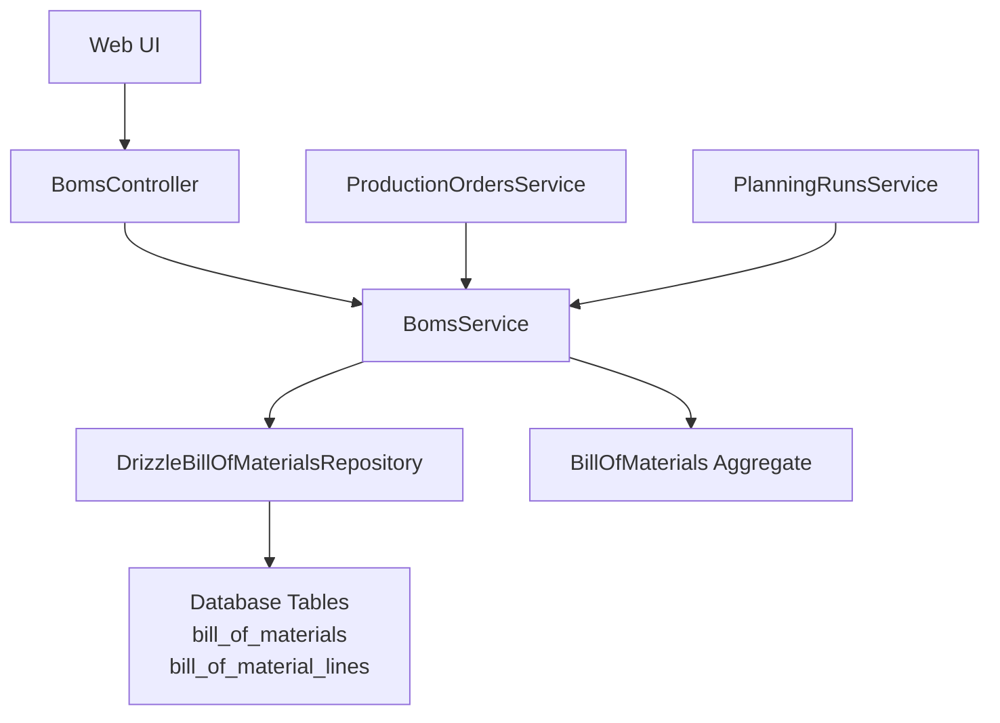
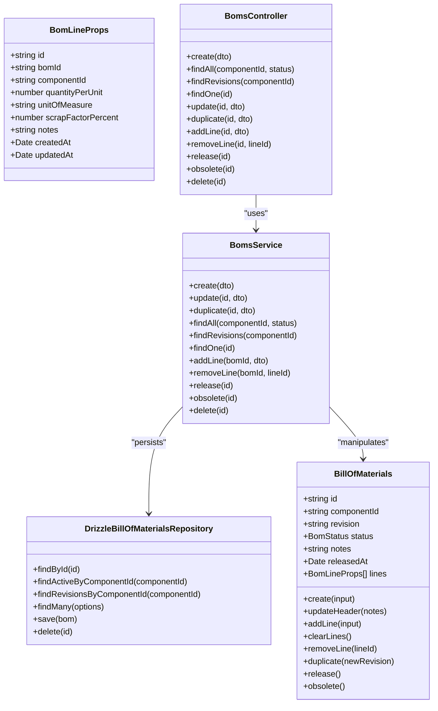
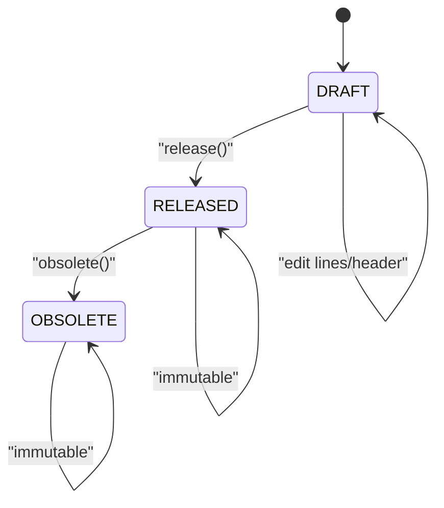
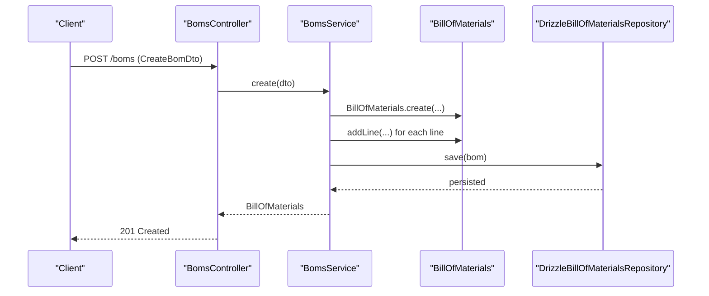
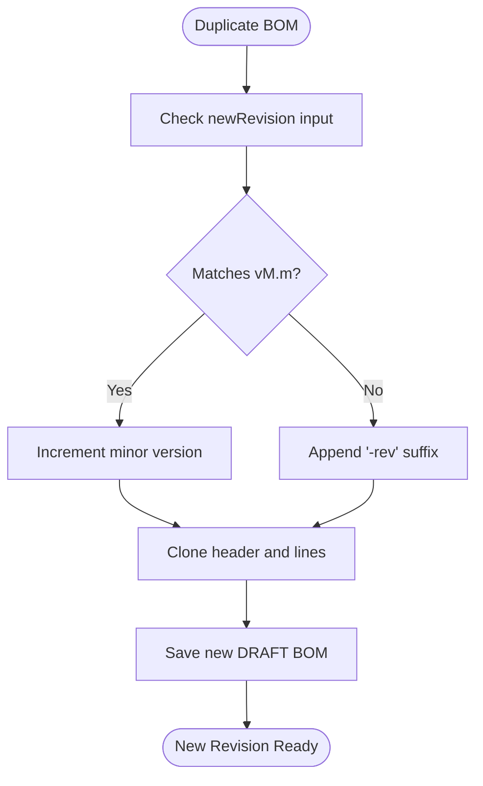
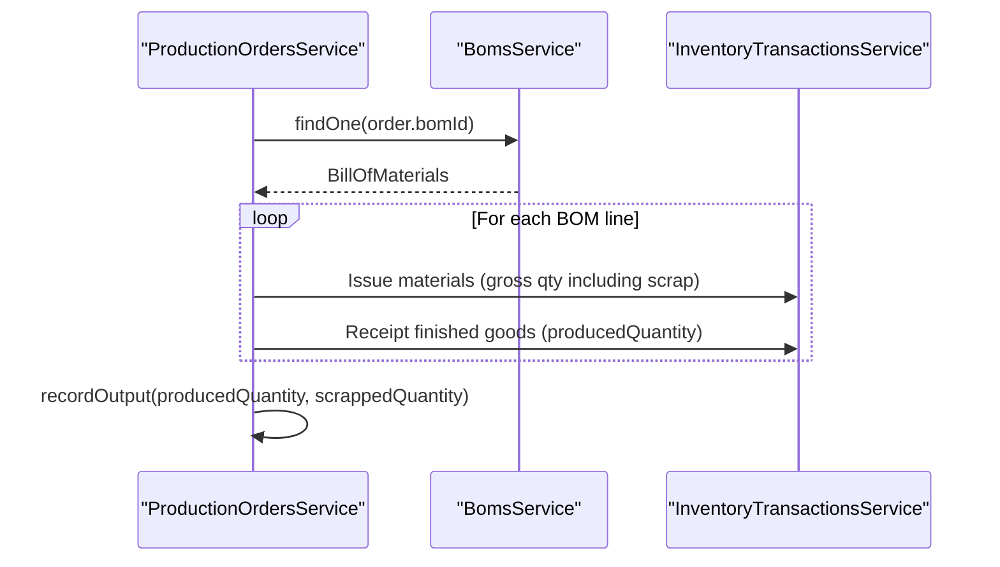
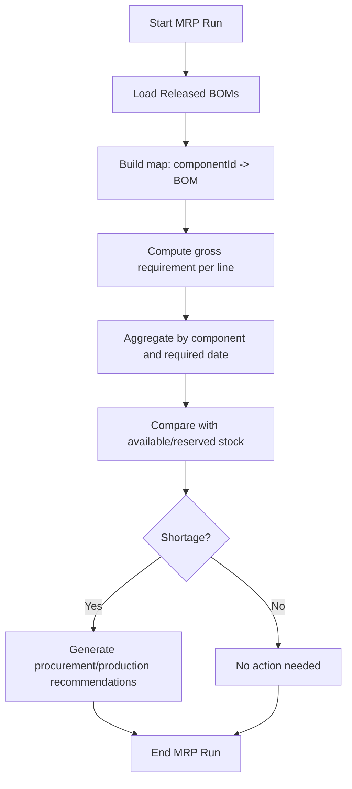
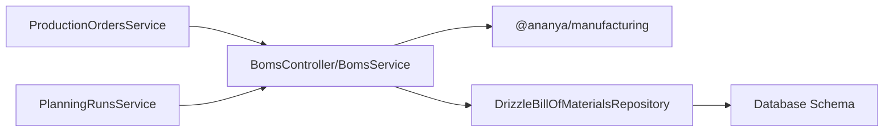

# Bill of Materials Management

<cite>
**Referenced Files in This Document**   
- [boms.controller.ts](file://apps/api/src/boms/boms.controller.ts)
- [boms.service.ts](file://apps/api/src/boms/boms.service.ts)
- [dtos.ts](file://apps/api/src/boms/dtos.ts)
- [bill-of-materials.ts](file://packages/manufacturing/src/boms/bill-of-materials.ts)
- [bill-of-materials.errors.ts](file://packages/manufacturing/src/boms/bill-of-materials.errors.ts)
- [drizzle-bill-of-materials.repository.ts](file://apps/api/src/infrastructure/repositories/drizzle-bill-of-materials.repository.ts)
- [production-orders.service.ts](file://apps/api/src/production-orders/production-orders.service.ts)
- [planning-runs.service.ts](file://apps/api/src/planning-runs/planning-runs.service.ts)
- [0016-bill-of-materials.md](file://docs/rfcs/0016-bill-of-materials.md)
</cite>

## Table of Contents
1. [Introduction](#introduction)
2. [Project Structure](#project-structure)
3. [Core Components](#core-components)
4. [Architecture Overview](#architecture-overview)
5. [Detailed Component Analysis](#detailed-component-analysis)
6. [Dependency Analysis](#dependency-analysis)
7. [Performance Considerations](#performance-considerations)
8. [Troubleshooting Guide](#troubleshooting-guide)
9. [Conclusion](#conclusion)

## Introduction
This document explains the Bill of Materials (BOM) management system implemented in the manufacturing domain. It covers BOM structure, versioning and revision control, hierarchical relationships between components and sub-assemblies, creation workflows, release and obsolescence processes, and integration with production orders and material requirements planning. It also documents validation rules, business constraints, scrap factor handling, alternative component consolidation, and optimization considerations.

The BOM is modeled as a domain aggregate root that enforces immutable state transitions, line-item invariants, and safe revision duplication. The API exposes REST endpoints for creating, editing, releasing, duplicating, and managing BOM lines. Production orders consume released BOMs to calculate material requirements and issue materials during execution. Material Requirements Planning uses released BOMs to compute gross demand across the planning horizon.

## Project Structure
The BOM feature spans three layers:
- Domain model in the manufacturing package
- Application service and HTTP controller in the API application
- Repository implementation using Drizzle ORM

**Diagram sources**
- [boms.controller.ts:22-84](file://apps/api/src/boms/boms.controller.ts#L22-L84)
- [boms.service.ts:24-159](file://apps/api/src/boms/boms.service.ts#L24-L159)
- [drizzle-bill-of-materials.repository.ts:42-187](file://apps/api/src/infrastructure/repositories/drizzle-bill-of-materials.repository.ts#L42-L187)
- [bill-of-materials.ts:51-338](file://packages/manufacturing/src/boms/bill-of-materials.ts#L51-L338)

**Section sources**
- [boms.controller.ts:22-84](file://apps/api/src/boms/boms.controller.ts#L22-L84)
- [boms.service.ts:24-159](file://apps/api/src/boms/boms.service.ts#L24-L159)
- [drizzle-bill-of-materials.repository.ts:42-187](file://apps/api/src/infrastructure/repositories/drizzle-bill-of-materials.repository.ts#L42-L187)
- [bill-of-materials.ts:51-338](file://packages/manufacturing/src/boms/bill-of-materials.ts#L51-L338)

## Core Components
- BillOfMaterials aggregate: owns header data, line collection, status lifecycle, revision duplication, and line mutation methods.
- BomsService: orchestrates BOM operations, validates inputs, enforces lifecycle rules, and persists via repository.
- BomsController: exposes REST endpoints for BOM CRUD, line management, release, obsolete, duplicate, and revisions listing.
- DrizzleBillOfMaterialsRepository: maps domain objects to database tables and provides query methods.
- DTOs: request validation models for create, update, add/remove lines, and duplicate operations.
- Errors: domain-specific exceptions for invalid transitions, empty BOMs, duplicates, circular dependencies, and active BOM conflicts.

Key responsibilities:
- Enforce DRAFT-only edits and immutability after RELEASED.
- Prevent circular dependencies and duplicate component lines.
- Ensure only one RELEASED BOM per product component at a time.
- Support revision duplication with automatic or explicit revision numbering.
- Integrate with production orders and MRP for material requirement calculations.

**Section sources**
- [bill-of-materials.ts:51-338](file://packages/manufacturing/src/boms/bill-of-materials.ts#L51-L338)
- [boms.service.ts:30-159](file://apps/api/src/boms/boms.service.ts#L30-L159)
- [boms.controller.ts:22-84](file://apps/api/src/boms/boms.controller.ts#L22-L84)
- [drizzle-bill-of-materials.repository.ts:42-187](file://apps/api/src/infrastructure/repositories/drizzle-bill-of-materials.repository.ts#L42-L187)
- [dtos.ts:12-72](file://apps/api/src/boms/dtos.ts#L12-L72)
- [bill-of-materials.errors.ts:1-66](file://packages/manufacturing/src/boms/bill-of-materials.errors.ts#L1-L66)

## Architecture Overview
The BOM architecture follows Domain-Driven Design principles:
- The BillOfMaterials aggregate encapsulates all BOM-related invariants and behaviors.
- The BomsService coordinates use cases and delegates persistence to the repository.
- The DrizzleBillOfMaterialsRepository implements persistence and mapping.
- Production orders and MRP depend on released BOMs to calculate material needs.

**Diagram sources**
- [bill-of-materials.ts:51-338](file://packages/manufacturing/src/boms/bill-of-materials.ts#L51-L338)
- [boms.service.ts:24-159](file://apps/api/src/boms/boms.service.ts#L24-L159)
- [drizzle-bill-of-materials.repository.ts:42-187](file://apps/api/src/infrastructure/repositories/drizzle-bill-of-materials.repository.ts#L42-L187)
- [boms.controller.ts:22-84](file://apps/api/src/boms/boms.controller.ts#L22-L84)

## Detailed Component Analysis

### BOM Data Model and Lifecycle
The BillOfMaterials aggregate defines:
- Header fields: componentId, revision, status, notes, releasedAt.
- Line items: componentId, quantityPerUnit, unitOfMeasure, scrapFactorPercent, notes.
- Status lifecycle: DRAFT → RELEASED → OBSOLETE.
- Revision duplication: auto-increments minor version when revision matches vM.m pattern; otherwise appends -rev suffix.

Validation and invariants enforced by the aggregate:
- Only DRAFT BOMs can be edited.
- Release requires at least one line item.
- Obsolete requires RELEASED status.
- No circular dependency: a BOM cannot consume its own product component.
- No duplicate component lines within a BOM.
- Quantity per unit must be positive; scrap factor percent must be non-negative.

**Diagram sources**
- [bill-of-materials.ts:315-333](file://packages/manufacturing/src/boms/bill-of-materials.ts#L315-L333)

**Section sources**
- [bill-of-materials.ts:51-338](file://packages/manufacturing/src/boms/bill-of-materials.ts#L51-L338)
- [0016-bill-of-materials.md:100-114](file://docs/rfcs/0016-bill-of-materials.md#L100-L114)

### BOM Creation and Line Management Workflow
The API workflow for creating and editing BOMs:
- Create: initializes a DRAFT BOM with optional lines; validates component usability before adding lines.
- Update: allows header and line changes only if status is DRAFT; clears and rebuilds lines when provided.
- Add/Remove Lines: adds or removes lines while enforcing component usability and invariants.
- Duplicate: clones an existing BOM into a new DRAFT revision with copied lines.

**Diagram sources**
- [boms.controller.ts:27-30](file://apps/api/src/boms/boms.controller.ts#L27-L30)
- [boms.service.ts:30-49](file://apps/api/src/boms/boms.service.ts#L30-L49)
- [bill-of-materials.ts:74-89](file://packages/manufacturing/src/boms/bill-of-materials.ts#L74-L89)
- [drizzle-bill-of-materials.repository.ts:145-182](file://apps/api/src/infrastructure/repositories/drizzle-bill-of-materials.repository.ts#L145-L182)

**Section sources**
- [boms.controller.ts:27-68](file://apps/api/src/boms/boms.controller.ts#L27-L68)
- [boms.service.ts:30-124](file://apps/api/src/boms/boms.service.ts#L30-L124)
- [bill-of-materials.ts:99-136](file://packages/manufacturing/src/boms/bill-of-materials.ts#L99-L136)

### Revision Control and Change Management
- Versioning: revisions are strings such as v1.0; duplication increments minor version automatically when possible.
- Change process: edit DRAFT BOMs freely; once RELEASED, modifications require creating a new revision.
- Active BOM constraint: only one RELEASED BOM per product component; attempting to release another raises an error indicating the existing active revision.

**Diagram sources**
- [bill-of-materials.ts:284-313](file://packages/manufacturing/src/boms/bill-of-materials.ts#L284-L313)

**Section sources**
- [boms.service.ts:79-85](file://apps/api/src/boms/boms.service.ts#L79-L85)
- [bill-of-materials.ts:284-313](file://packages/manufacturing/src/boms/bill-of-materials.ts#L284-L313)
- [boms.service.ts:126-143](file://apps/api/src/boms/boms.service.ts#L126-L143)

### Relationship Between BOMs and Production Orders
Production orders reference a specific BOM and calculate material requirements based on planned quantities and scrap factors:
- Required quantity per line = planned quantity × quantityPerUnit × (1 + scrapFactorPercent/100).
- Consumed and remaining quantities are derived from completion ratio.
- During partial output recording, materials are issued proportionally and finished goods are received.

**Diagram sources**
- [production-orders.service.ts:146-184](file://apps/api/src/production-orders/production-orders.service.ts#L146-L184)
- [production-orders.service.ts:204-273](file://apps/api/src/production-orders/production-orders.service.ts#L204-L273)

**Section sources**
- [production-orders.service.ts:68-94](file://apps/api/src/production-orders/production-orders.service.ts#L68-L94)
- [production-orders.service.ts:146-184](file://apps/api/src/production-orders/production-orders.service.ts#L146-L184)
- [production-orders.service.ts:204-273](file://apps/api/src/production-orders/production-orders.service.ts#L204-L273)

### Material Requirement Calculations and Cost Rollups
Material Requirements Planning (MRP) consumes released BOMs to compute gross demand:
- Gross requirement per component = net demand × quantityPerUnit × (1 + scrapFactorPercent/100).
- Aggregates requirements by component and required date, then compares against available and reserved quantities to identify shortages.

Cost rollups are not implemented in the current codebase; cost calculation would require integrating component pricing or valuation data, which is outside the scope of the analyzed files.

**Diagram sources**
- [planning-runs.service.ts:128-235](file://apps/api/src/planning-runs/planning-runs.service.ts#L128-L235)

**Section sources**
- [planning-runs.service.ts:128-235](file://apps/api/src/planning-runs/planning-runs.service.ts#L128-L235)

### Validation Rules and Business Constraints
- BOM must have at least one line to be released.
- Only one RELEASED BOM per product component at any time.
- DRAFT-only edits; RELEASED and OBSOLETE are immutable.
- Quantity per unit > 0; scrap factor percent ≥ 0.
- No duplicate component lines in a single BOM.
- No circular dependency: a BOM cannot consume its own product component.
- Retired components cannot be added to new BOM lines.

These rules are enforced by domain errors and service-level checks.

**Section sources**
- [bill-of-materials.errors.ts:1-66](file://packages/manufacturing/src/boms/bill-of-materials.errors.ts#L1-L66)
- [boms.service.ts:52-77](file://apps/api/src/boms/boms.service.ts#L52-L77)
- [boms.service.ts:106-117](file://apps/api/src/boms/boms.service.ts#L106-L117)
- [boms.service.ts:126-143](file://apps/api/src/boms/boms.service.ts#L126-L143)
- [0016-bill-of-materials.md:100-107](file://docs/rfcs/0016-bill-of-materials.md#L100-L107)

### Alternative Components and Scrap Factor Handling
Alternative components are supported through component consolidation:
- When consolidating components, BOMs may contain both source and canonical components; this creates a collision requiring explicit resolution.
- Resolution strategies include using canonical scrap factor, using source scrap factor, or providing an explicit non-negative value.
- Consolidation combines quantities and resolves scrap factors explicitly; it never chooses silently.

Scrap factor handling:
- Scrap factor percent is applied multiplicatively to gross requirements.
- In consolidation collisions, scrap factor decisions are mandatory and validated.

**Section sources**
- [planning-runs.service.ts:200-216](file://apps/api/src/planning-runs/planning-runs.service.ts#L200-L216)
- [drizzle-bill-of-materials.repository.ts:129-143](file://apps/api/src/infrastructure/repositories/drizzle-bill-of-materials.repository.ts#L129-L143)

### BOM Optimization and Hierarchical Relationships
- Hierarchical relationships: BOM lines reference other components, enabling multi-level assemblies.
- Circular dependency prevention ensures a BOM cannot consume its own product component.
- Optimization opportunities:
  - Precompute gross requirements for frequent queries.
  - Cache released BOMs by componentId for faster MRP runs.
  - Validate component usability early to avoid unnecessary processing.
  - Use distinct queries for consuming vs producing relationships to reduce ambiguity.

Note: Multi-level explosion and alternative substitution rules are identified as future extensions in the RFC.

**Section sources**
- [bill-of-materials.ts:99-118](file://packages/manufacturing/src/boms/bill-of-materials.ts#L99-L118)
- [0016-bill-of-materials.md:197-201](file://docs/rfcs/0016-bill-of-materials.md#L197-L201)

## Dependency Analysis
The BOM module depends on:
- Manufacturing domain types and aggregates.
- Inventory transactions and projections for production execution.
- Database schema for persistence.

**Diagram sources**
- [boms.module.ts:6-16](file://apps/api/src/boms/boms.module.ts#L6-L16)
- [production-orders.service.ts:58-66](file://apps/api/src/production-orders/production-orders.service.ts#L58-L66)
- [planning-runs.service.ts:128-139](file://apps/api/src/planning-runs/planning-runs.service.ts#L128-L139)
- [drizzle-bill-of-materials.repository.ts:1-13](file://apps/api/src/infrastructure/repositories/drizzle-bill-of-materials.repository.ts#L1-L13)

**Section sources**
- [boms.module.ts:6-16](file://apps/api/src/boms/boms.module.ts#L6-L16)
- [production-orders.service.ts:58-66](file://apps/api/src/production-orders/production-orders.service.ts#L58-L66)
- [planning-runs.service.ts:128-139](file://apps/api/src/planning-runs/planning-runs.service.ts#L128-L139)
- [drizzle-bill-of-materials.repository.ts:1-13](file://apps/api/src/infrastructure/repositories/drizzle-bill-of-materials.repository.ts#L1-L13)

## Performance Considerations
- Repository queries load BOM lines eagerly for each operation; consider batching or caching for large BOM hierarchies.
- MRP builds maps of released BOMs, components, availability, and reservations; ensure these datasets fit in memory for performance.
- Avoid repeated conversions between domain and persistence models; reuse mappings where possible.
- Validate inputs early to prevent expensive downstream operations.

[No sources needed since this section provides general guidance]

## Troubleshooting Guide
Common issues and resolutions:
- Cannot transition BOM status: ensure correct sequence (DRAFT → RELEASED → OBSOLETE).
- Empty BOM release attempt: add at least one line before releasing.
- Immutable BOM modification: only DRAFT BOMs can be edited; create a new revision for changes.
- Duplicate component line: remove or consolidate duplicate lines.
- Circular dependency: do not add the product component as a line in its own BOM.
- Active BOM already exists: obsolete the current RELEASED BOM before releasing a new one.

**Section sources**
- [bill-of-materials.errors.ts:1-66](file://packages/manufacturing/src/boms/bill-of-materials.errors.ts#L1-L66)
- [boms.service.ts:52-58](file://apps/api/src/boms/boms.service.ts#L52-L58)
- [boms.service.ts:126-143](file://apps/api/src/boms/boms.service.ts#L126-L143)

## Conclusion
The BOM management system provides robust domain modeling, strict lifecycle enforcement, and clear integration points with production and planning. It supports revision control, scrap factor handling, and alternative component consolidation. While cost rollups are not implemented, the foundation is in place for future enhancements such as multi-level explosion and advanced substitution rules. Proper validation and error handling ensure data integrity and operational reliability.

[No sources needed since this section summarizes without analyzing specific files]