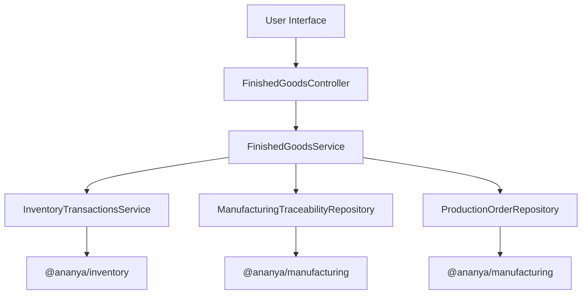
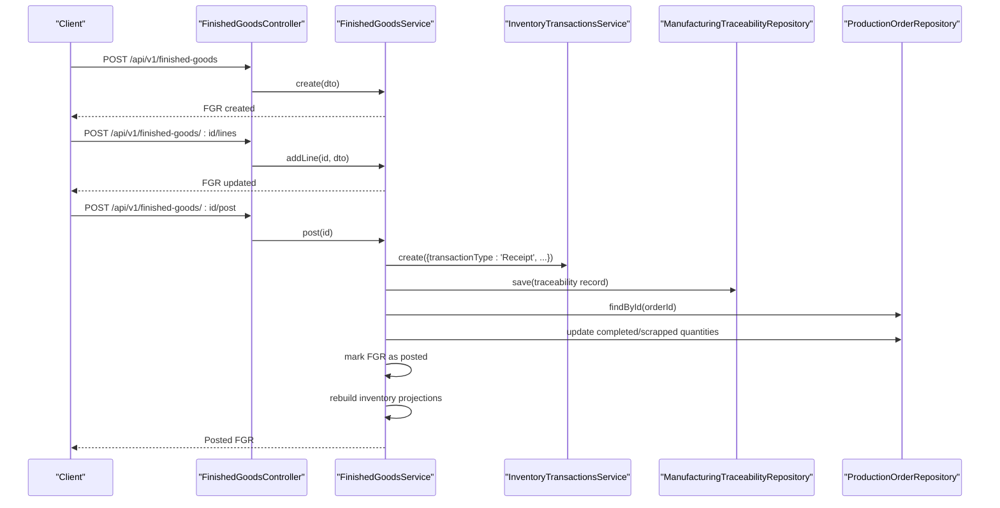
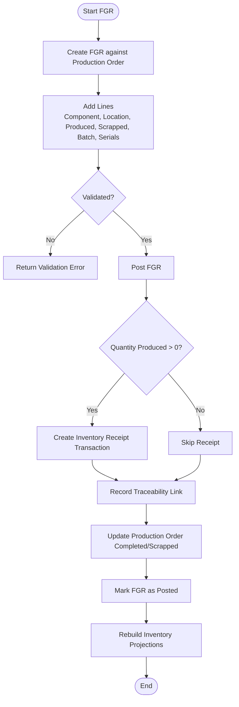
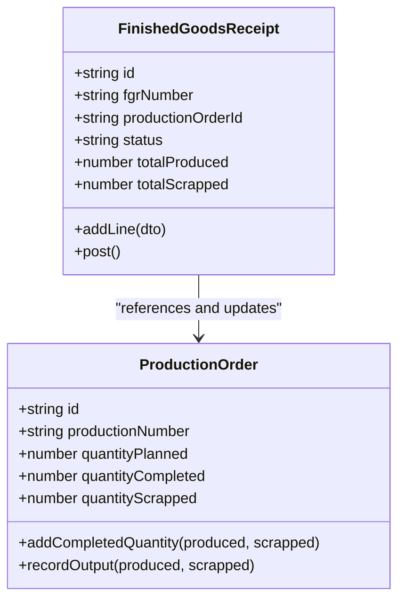
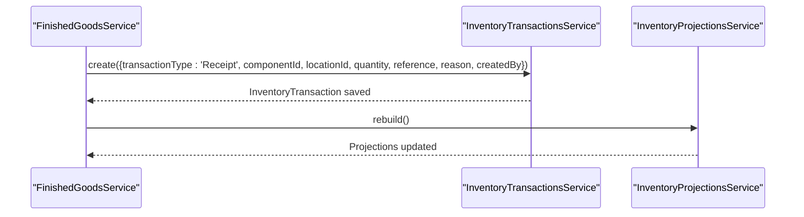
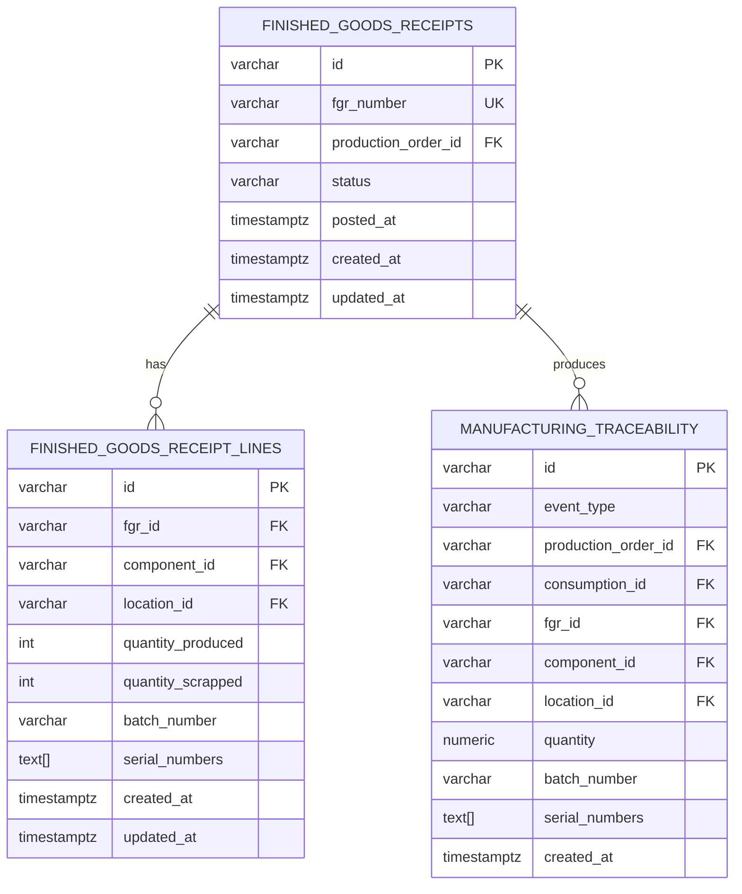
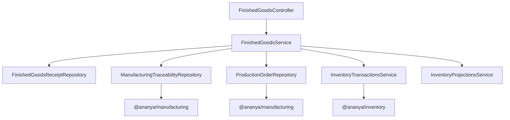

# Finished Goods Receipt

<cite>
**Referenced Files in This Document**
- [0019-finished-goods-receipt.md](file://docs/rfcs/0019-finished-goods-receipt.md)
- [0020-manufacturing-traceability.md](file://docs/rfcs/0020-manufacturing-traceability.md)
- [finished-goods.controller.ts](file://apps/api/src/finished-goods/finished-goods.controller.ts)
- [finished-goods.service.ts](file://apps/api/src/finished-goods/finished-goods.service.ts)
- [dtos.ts](file://apps/api/src/finished-goods/dtos.ts)
- [manufacturing-traceability.service.ts](file://apps/api/src/manufacturing-traceability/manufacturing-traceability.service.ts)
- [production-orders.service.ts](file://apps/api/src/production-orders/production-orders.service.ts)
- [inventory-transactions.service.ts](file://apps/api/src/inventory-transactions/inventory-transactions.service.ts)
- [batches.service.ts](file://apps/api/src/batches/batches.service.ts)
- [serials.service.ts](file://apps/api/src/serials/serials.service.ts)
</cite>

## Table of Contents
1. [Introduction](#introduction)
2. [Project Structure](#project-structure)
3. [Core Components](#core-components)
4. [Architecture Overview](#architecture-overview)
5. [Detailed Component Analysis](#detailed-component-analysis)
6. [Dependency Analysis](#dependency-analysis)
7. [Performance Considerations](#performance-considerations)
8. [Troubleshooting Guide](#troubleshooting-guide)
9. [Conclusion](#conclusion)

## Introduction
This document explains finished goods receipt processing for completed products coming from production. It covers the end-to-end workflow: creating a finished goods receipt, recording yield and scrap, performing quality inspection considerations, verifying quantities, posting inventory receipts, updating production orders, and maintaining traceability through batch and serial numbers. It also documents how finished goods receipts relate to production orders, including yield accumulation, efficiency metrics, rejection handling, rework concepts, and traceability requirements.

Finished goods receipt is designed as a manufacturing domain operation that integrates with inventory transactions, production order completion tracking, and manufacturing traceability records. Quality inspection hold status is defined as a future extension, while current implementation focuses on yield recording, inventory posting, and immutable traceability linkage.

## Project Structure
The finished goods receipt feature is implemented primarily in the API application under the `finished-goods` module, with supporting integration into inventory transactions, production orders, batches, serials, and manufacturing traceability. The RFC documentation defines the domain model, state machine, validation rules, API design, and sequence flow.

**Diagram sources**
- [finished-goods.controller.ts:5-32](file://apps/api/src/finished-goods/finished-goods.controller.ts#L5-L32)
- [finished-goods.service.ts:23-34](file://apps/api/src/finished-goods/finished-goods.service.ts#L23-L34)
- [inventory-transactions.service.ts:12-32](file://apps/api/src/inventory-transactions/inventory-transactions.service.ts#L12-L32)
- [manufacturing-traceability.service.ts:9-14](file://apps/api/src/manufacturing-traceability/manufacturing-traceability.service.ts#L9-L14)

**Section sources**
- [0019-finished-goods-receipt.md:11-24](file://docs/rfcs/0019-finished-goods-receipt.md#L11-L24)
- [finished-goods.controller.ts:5-32](file://apps/api/src/finished-goods/finished-goods.controller.ts#L5-L32)
- [finished-goods.service.ts:23-34](file://apps/api/src/finished-goods/finished-goods.service.ts#L23-L34)

## Core Components
- Finished Goods Controller: Exposes REST endpoints for creating, listing, retrieving, adding lines, and posting finished goods receipts.
- Finished Goods Service: Orchestrates creation, line addition, posting, inventory receipt creation, traceability recording, production order updates, and projection rebuild.
- DTOs: Define input validation for creating a finished goods receipt and adding a line (component, location, produced quantity, scrapped quantity, optional batch number, optional serial numbers).
- Inventory Transactions Service: Creates inventory receipt transactions and validates component usability before persisting.
- Manufacturing Traceability Service: Provides query APIs for forward and backward traceability based on batch or serial numbers.
- Production Orders Service: Updates production order completion and scrap quantities; provides activity timeline and material requirement calculations.
- Batches and Serials Services: Provide batch and serial management capabilities used by inventory and traceability workflows.

Key responsibilities:
- Yield recording: `quantityProduced` and `quantityScrapped` per line.
- Inventory posting: Receipt transaction for each produced quantity.
- Traceability: Immutable record linking production order, FGR, component, location, batch, and serials.
- Production order update: Accumulate completed and scrapped quantities.

**Section sources**
- [finished-goods.controller.ts:5-32](file://apps/api/src/finished-goods/finished-goods.controller.ts#L5-L32)
- [finished-goods.service.ts:36-124](file://apps/api/src/finished-goods/finished-goods.service.ts#L36-L124)
- [dtos.ts:10-41](file://apps/api/src/finished-goods/dtos.ts#L10-L41)
- [inventory-transactions.service.ts:19-32](file://apps/api/src/inventory-transactions/inventory-transactions.service.ts#L19-L32)
- [manufacturing-traceability.service.ts:16-58](file://apps/api/src/manufacturing-traceability/manufacturing-traceability.service.ts#L16-L58)
- [production-orders.service.ts:204-301](file://apps/api/src/production-orders/production-orders.service.ts#L204-L301)
- [batches.service.ts:19-48](file://apps/api/src/batches/batches.service.ts#L19-L48)
- [serials.service.ts:19-48](file://apps/api/src/serials/serials.service.ts#L19-L48)

## Architecture Overview
Finished goods receipt processing follows a clear sequence: create an FGR, add one or more lines with yield and scrap, then post. Posting creates inventory receipts for produced quantities, records immutable traceability links, marks the FGR as posted, updates the production order’s completed and scrapped totals, and rebuilds inventory projections.

**Diagram sources**
- [finished-goods.controller.ts:9-31](file://apps/api/src/finished-goods/finished-goods.controller.ts#L9-L31)
- [finished-goods.service.ts:36-124](file://apps/api/src/finished-goods/finished-goods.service.ts#L36-L124)
- [inventory-transactions.service.ts:19-32](file://apps/api/src/inventory-transactions/inventory-transactions.service.ts#L19-L32)
- [manufacturing-traceability.service.ts:16-58](file://apps/api/src/manufacturing-traceability/manufacturing-traceability.service.ts#L16-L58)
- [production-orders.service.ts:204-301](file://apps/api/src/production-orders/production-orders.service.ts#L204-L301)

## Detailed Component Analysis

### Finished Goods Receipt Workflow
The finished goods receipt workflow supports:
- Creating a receipt against a production order.
- Adding lines with component, destination location, produced quantity, scrapped quantity, optional batch number, and optional serial numbers.
- Posting the receipt to create inventory receipts for produced quantities, record traceability, update production order totals, and rebuild projections.

Validation rules include:
- Production order must exist and be in allowed statuses.
- Component ID must match the production order’s product component.
- Location ID must exist in inventory locations.
- At least one of produced or scrapped quantity must be positive per line.

Quality inspection hold status is defined as a future extension; currently, there is no explicit QA hold state in the posted flow.

**Diagram sources**
- [finished-goods.service.ts:70-124](file://apps/api/src/finished-goods/finished-goods.service.ts#L70-L124)
- [0019-finished-goods-receipt.md:117-143](file://docs/rfcs/0019-finished-goods-receipt.md#L117-L143)

**Section sources**
- [0019-finished-goods-receipt.md:19-60](file://docs/rfcs/0019-finished-goods-receipt.md#L19-L60)
- [0019-finished-goods-receipt.md:98-113](file://docs/rfcs/0019-finished-goods-receipt.md#L98-L113)
- [0019-finished-goods-receipt.md:185-209](file://docs/rfcs/0019-finished-goods-receipt.md#L185-L209)
- [finished-goods.service.ts:36-124](file://apps/api/src/finished-goods/finished-goods.service.ts#L36-L124)

### Relationship Between Finished Goods Receipts and Production Orders
Finished goods receipts accumulate yield and scrap against a production order. When posting:
- The service retrieves the production order and adds the total produced and scrapped quantities from the FGR.
- The production order’s completion progress reflects accumulated output.
- Efficiency metrics can be derived from planned vs. completed quantities and scrap ratios.

Production order operations also support partial outputs and scrap recording, which integrate with inventory transactions and activity timelines.

**Diagram sources**
- [finished-goods.service.ts:111-118](file://apps/api/src/finished-goods/finished-goods.service.ts#L111-L118)
- [production-orders.service.ts:204-301](file://apps/api/src/production-orders/production-orders.service.ts#L204-L301)

**Section sources**
- [finished-goods.service.ts:111-118](file://apps/api/src/finished-goods/finished-goods.service.ts#L111-L118)
- [production-orders.service.ts:146-184](file://apps/api/src/production-orders/production-orders.service.ts#L146-L184)
- [production-orders.service.ts:204-301](file://apps/api/src/production-orders/production-orders.service.ts#L204-L301)

### Inventory Posting and Quantity Verification
When posting an FGR:
- For each line where `quantityProduced > 0`, an inventory receipt transaction is created via `InventoryTransactionsService.create`.
- The transaction includes component ID, destination location, quantity, unit of measure, reference (FGR number), reason, and creator.
- After posting, inventory projections are rebuilt to reflect new stock balances.

Quantity verification occurs at the DTO level (non-negative values) and at the domain level (at least one of produced or scrapped must be positive per line).

**Diagram sources**
- [finished-goods.service.ts:78-91](file://apps/api/src/finished-goods/finished-goods.service.ts#L78-L91)
- [inventory-transactions.service.ts:19-32](file://apps/api/src/inventory-transactions/inventory-transactions.service.ts#L19-L32)

**Section sources**
- [finished-goods.service.ts:78-91](file://apps/api/src/finished-goods/finished-goods.service.ts#L78-L91)
- [inventory-transactions.service.ts:19-32](file://apps/api/src/inventory-transactions/inventory-transactions.service.ts#L19-L32)
- [0019-finished-goods-receipt.md:146-153](file://docs/rfcs/0019-finished-goods-receipt.md#L146-L153)

### Quality Control Procedures, Rejection Handling, and Rework Processes
Current implementation does not include a dedicated quality inspection hold state for finished goods receipts. The RFC identifies this as a future extension. Scrap is recorded separately per line (`quantityScrapped`) and accumulates against the production order.

Recommended procedures aligned with the current model:
- Record rejected units as scrap during FGR line entry.
- Use separate storage locations for quarantine if needed (location selection per line).
- Track scrap reasons in production order notes or activity timeline entries.
- Implement rework by creating additional production runs or partial outputs linked to the original order.

Future enhancements should introduce:
- A QA hold status prior to posting.
- Explicit rejection workflows with disposition codes.
- Rework routing back into production with traceability linkage.

**Section sources**
- [0019-finished-goods-receipt.md:212-215](file://docs/rfcs/0019-finished-goods-receipt.md#L212-L215)
- [finished-goods.service.ts:78-105](file://apps/api/src/finished-goods/finished-goods.service.ts#L78-L105)
- [production-orders.service.ts:275-301](file://apps/api/src/production-orders/production-orders.service.ts#L275-L301)

### Examples: Finished Goods Receipt Creation, Inspection Workflows, and Inventory Updates
Example steps:
1. Create an FGR against a production order using the create endpoint.
2. Add one or more lines specifying component, destination location, produced quantity, scrapped quantity, optional batch number, and optional serial numbers.
3. Review the FGR details and confirm posting.
4. On post, inventory receipts are created for produced quantities, traceability records are saved, production order totals are updated, and projections are rebuilt.

Inspection workflow example:
- If inspection is required before availability, use a quarantine location for destination location and defer posting until QA approval.
- Once approved, post the FGR to move stock into available inventory.

Inventory update example:
- Each produced quantity triggers a receipt transaction referencing the FGR number.
- Projections are rebuilt to reflect updated balances.

**Section sources**
- [finished-goods.controller.ts:9-31](file://apps/api/src/finished-goods/finished-goods.controller.ts#L9-L31)
- [finished-goods.service.ts:36-124](file://apps/api/src/finished-goods/finished-goods.service.ts#L36-L124)
- [0019-finished-goods-receipt.md:185-209](file://docs/rfcs/0019-finished-goods-receipt.md#L185-L209)

### Traceability Requirements and Batch/Serial Number Tracking
Finished goods receipts create immutable traceability records linking:
- Event type: `FINISHED_GOODS_PRODUCED`
- Production order ID
- FGR ID
- Component ID
- Location ID
- Quantity produced
- Batch number
- Serial numbers

Traceability queries support:
- Forward trace from finished product batch or serial to consumed components and supply chain origin.
- Backward trace from component batch or serial to all production orders and finished products that consumed it.
- Retrieval of all traceability records for a specific production order.

Batch and serial services provide CRUD and listing capabilities used across inventory and traceability workflows.

**Diagram sources**
- [0019-finished-goods-receipt.md:156-181](file://docs/rfcs/0019-finished-goods-receipt.md#L156-L181)
- [0020-manufacturing-traceability.md:158-174](file://docs/rfcs/0020-manufacturing-traceability.md#L158-L174)

**Section sources**
- [finished-goods.service.ts:93-105](file://apps/api/src/finished-goods/finished-goods.service.ts#L93-L105)
- [0020-manufacturing-traceability.md:11-23](file://docs/rfcs/0020-manufacturing-traceability.md#L11-L23)
- [0020-manufacturing-traceability.md:61-77](file://docs/rfcs/0020-manufacturing-traceability.md#L61-L77)
- [0020-manufacturing-traceability.md:178-190](file://docs/rfcs/0020-manufacturing-traceability.md#L178-L190)
- [batches.service.ts:19-48](file://apps/api/src/batches/batches.service.ts#L19-L48)
- [serials.service.ts:19-48](file://apps/api/src/serials/serials.service.ts#L19-L48)

## Dependency Analysis
Finished goods receipt depends on several core services and repositories:
- Finished Goods Controller depends on Finished Goods Service.
- Finished Goods Service depends on:
  - Finished Goods Repository (via injection token)
  - Manufacturing Traceability Repository (via injection token)
  - Production Order Repository (via injection token)
  - Inventory Transactions Service
  - Inventory Projections Service
- Inventory Transactions Service depends on the inventory domain repository and validates component usability.
- Manufacturing Traceability Service provides query APIs for genealogy traversal.
- Production Orders Service manages order lifecycle, material requirements, outputs, scrap, and activity timelines.

**Diagram sources**
- [finished-goods.controller.ts:5-32](file://apps/api/src/finished-goods/finished-goods.controller.ts#L5-L32)
- [finished-goods.service.ts:23-34](file://apps/api/src/finished-goods/finished-goods.service.ts#L23-L34)
- [inventory-transactions.service.ts:12-32](file://apps/api/src/inventory-transactions/inventory-transactions.service.ts#L12-L32)
- [manufacturing-traceability.service.ts:9-14](file://apps/api/src/manufacturing-traceability/manufacturing-traceability.service.ts#L9-L14)

**Section sources**
- [finished-goods.controller.ts:5-32](file://apps/api/src/finished-goods/finished-goods.controller.ts#L5-L32)
- [finished-goods.service.ts:23-34](file://apps/api/src/finished-goods/finished-goods.service.ts#L23-L34)
- [inventory-transactions.service.ts:12-32](file://apps/api/src/inventory-transactions/inventory-transactions.service.ts#L12-L32)
- [manufacturing-traceability.service.ts:9-14](file://apps/api/src/manufacturing-traceability/manufacturing-traceability.service.ts#L9-L14)

## Performance Considerations
- Projection rebuild: After posting, inventory projections are rebuilt. Consider batching multiple FGR posts or deferring rebuilds to background jobs if high volume.
- Transaction creation loop: Posting iterates over FGR lines to create inventory receipts; ensure efficient database writes and avoid unnecessary overhead.
- Traceability records: Immutable append-only records should be indexed by production order, component, batch, and serial for fast genealogy queries.
- Component lifecycle guard: Inventory transactions validate component usability; consolidated components cannot receive new stock, preventing accidental resurrection of retired records.

[No sources needed since this section provides general guidance]

## Troubleshooting Guide
Common issues and resolutions:
- Already posted FGR: Attempting to post an FGR that is not in DRAFT status throws a bad request error. Ensure the FGR is still in draft before posting.
- Missing FGR: If an FGR ID is not found, a not found exception is thrown. Verify the ID and existence.
- Invalid production order status: RFC validation requires the production order to be in allowed statuses; ensure the order is IN_PROGRESS or COMPLETED.
- Component mismatch: The component ID must match the production order’s product component; verify BOM and component alignment.
- Location not found: Destination location must exist in inventory locations; validate location IDs before posting.
- Zero quantities: At least one of produced or scrapped quantity must be positive per line; adjust line entries accordingly.
- Inventory transaction failures: Ensure the component is usable for new activities; consolidated components cannot receive new stock.

Operational checks:
- Confirm inventory projections are rebuilt after posting.
- Verify traceability records are created for each produced quantity.
- Review production order activity timeline for output and scrap events.

**Section sources**
- [finished-goods.service.ts:70-76](file://apps/api/src/finished-goods/finished-goods.service.ts#L70-L76)
- [finished-goods.service.ts:50-58](file://apps/api/src/finished-goods/finished-goods.service.ts#L50-L58)
- [0019-finished-goods-receipt.md:203-209](file://docs/rfcs/0019-finished-goods-receipt.md#L203-L209)
- [inventory-transactions.service.ts:19-32](file://apps/api/src/inventory-transactions/inventory-transactions.service.ts#L19-L32)

## Conclusion
Finished goods receipt processing in this system provides a robust foundation for recording production yield and scrap, integrating with inventory transactions, updating production orders, and maintaining immutable traceability. While quality inspection hold status is not yet implemented, the architecture supports future extensions for QA workflows, rejection handling, and reprocess routing. Batch and serial tracking enable full genealogy tracing across the supply chain, ensuring compliance and traceability requirements are met.

[No sources needed since this section summarizes without analyzing specific files]