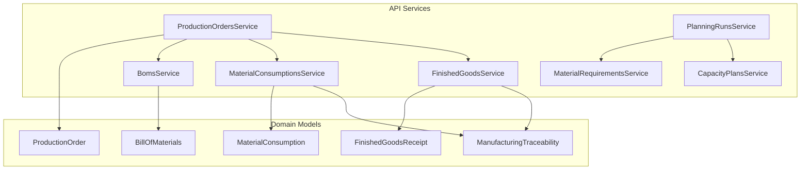
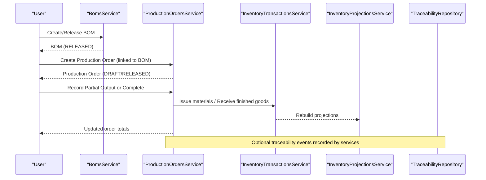
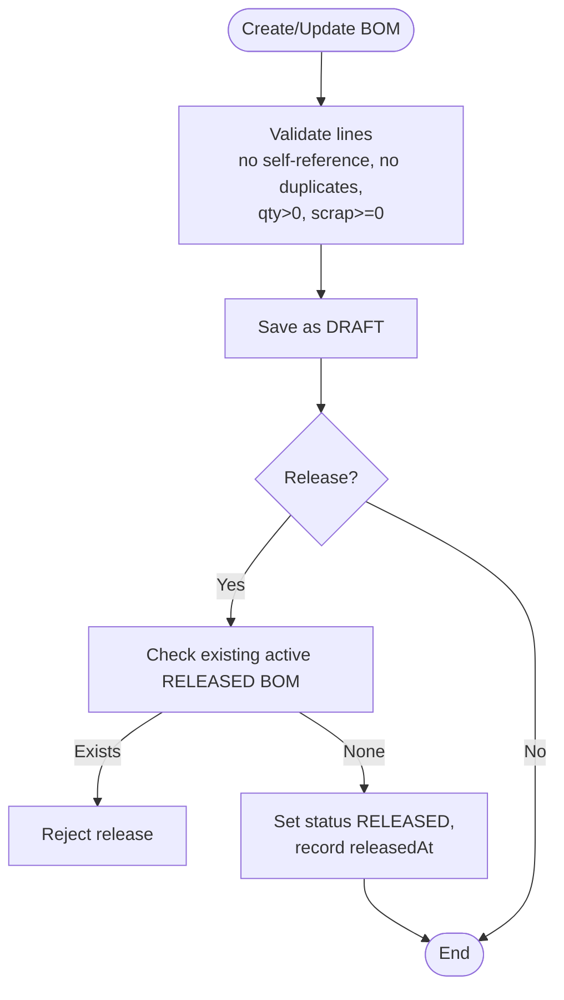
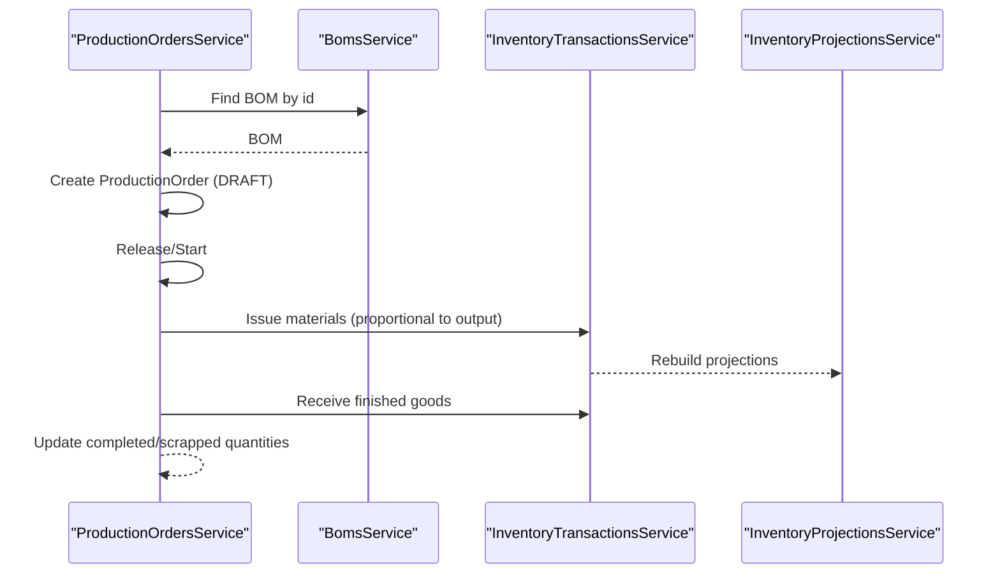
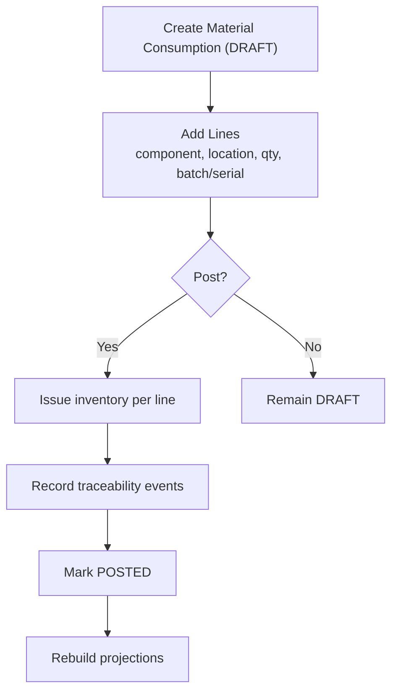
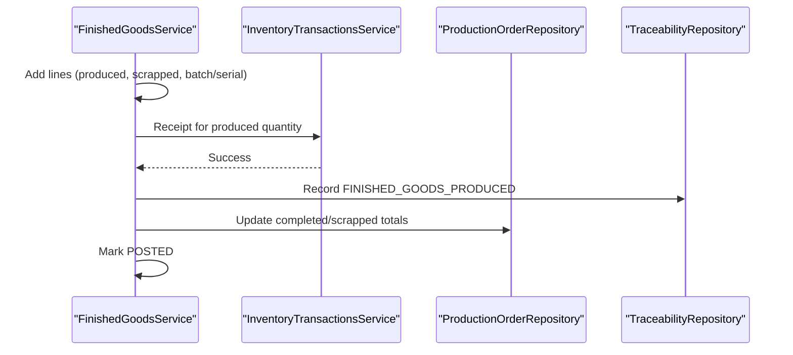
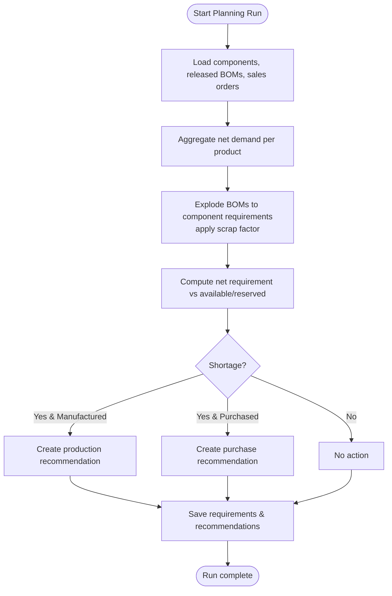
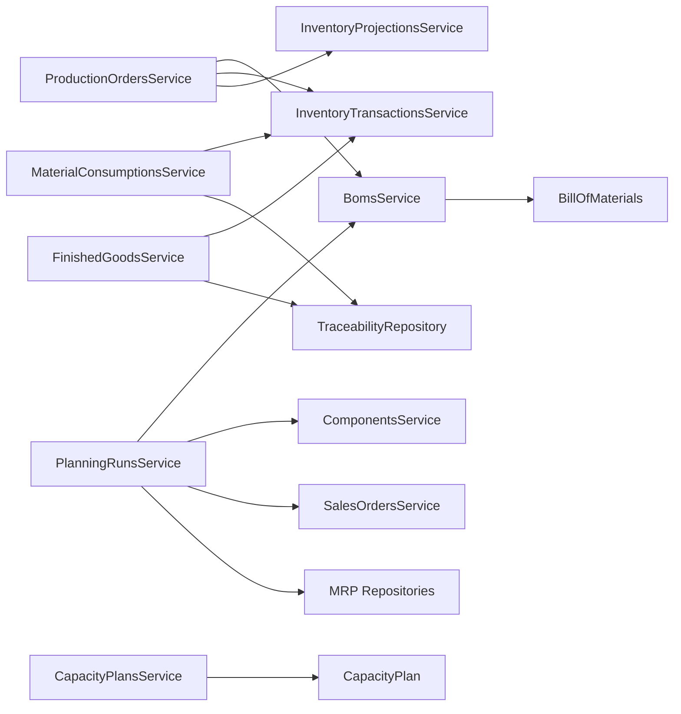

# Manufacturing Domain

<cite>
**Referenced Files in This Document**
- [boms.service.ts](file://apps/api/src/boms/boms.service.ts)
- [production-orders.service.ts](file://apps/api/src/production-orders/production-orders.service.ts)
- [material-consumptions.service.ts](file://apps/api/src/material-consumptions/material-consumptions.service.ts)
- [finished-goods.service.ts](file://apps/api/src/finished-goods/finished-goods.service.ts)
- [planning-runs.service.ts](file://apps/api/src/planning-runs/planning-runs.service.ts)
- [capacity-plans.service.ts](file://apps/api/src/capacity-plans/capacity-plans.service.ts)
- [material-requirements.service.ts](file://apps/api/src/material-requirements/material-requirements.service.ts)
- [bill-of-materials.ts](file://packages/manufacturing/src/boms/bill-of-materials.ts)
- [production-order.ts](file://packages/manufacturing/src/production-orders/production-order.ts)
- [material-consumption.ts](file://packages/manufacturing/src/material-consumptions/material-consumption.ts)
- [finished-goods-receipt.ts](file://packages/manufacturing/src/finished-goods/finished-goods-receipt.ts)
- [manufacturing-traceability.ts](file://packages/manufacturing/src/traceability/manufacturing-traceability.ts)
</cite>

## Table of Contents
1. [Introduction](#introduction)
2. [Project Structure](#project-structure)
3. [Core Components](#core-components)
4. [Architecture Overview](#architecture-overview)
5. [Detailed Component Analysis](#detailed-component-analysis)
6. [Dependency Analysis](#dependency-analysis)
7. [Performance Considerations](#performance-considerations)
8. [Troubleshooting Guide](#troubleshooting-guide)
9. [Conclusion](#conclusion)
10. [Appendices](#appendices)

## Introduction
This document explains the Manufacturing Domain implementation across BOM management, production orders, material consumption, finished goods receipt, planning and capacity, and traceability. It details how manufacturing processes are modeled, including business rules for BOM versioning, production routing concepts via operations, quality control through scrap handling, and integration with inventory and procurement domains. Concrete examples reference actual services and domain models to show BOM creation, production order execution, and material consumption posting.

## Project Structure
The manufacturing capability is implemented as a combination of:
- API services that orchestrate workflows and integrate with other domains (inventory, sales, MRP).
- Core domain models in the manufacturing package that encapsulate state machines, invariants, and calculations.

**Diagram sources**
- [boms.service.ts:23-159](file://apps/api/src/boms/boms.service.ts#L23-L159)
- [production-orders.service.ts:58-471](file://apps/api/src/production-orders/production-orders.service.ts#L58-L471)
- [material-consumptions.service.ts:22-115](file://apps/api/src/material-consumptions/material-consumptions.service.ts#L22-L115)
- [finished-goods.service.ts:23-126](file://apps/api/src/finished-goods/finished-goods.service.ts#L23-L126)
- [planning-runs.service.ts:36-326](file://apps/api/src/planning-runs/planning-runs.service.ts#L36-L326)
- [capacity-plans.service.ts:7-46](file://apps/api/src/capacity-plans/capacity-plans.service.ts#L7-L46)
- [material-requirements.service.ts:12-60](file://apps/api/src/material-requirements/material-requirements.service.ts#L12-L60)
- [bill-of-materials.ts:51-339](file://packages/manufacturing/src/boms/bill-of-materials.ts#L51-L339)
- [production-order.ts:71-272](file://packages/manufacturing/src/production-orders/production-order.ts#L71-L272)
- [material-consumption.ts:59-143](file://packages/manufacturing/src/material-consumptions/material-consumption.ts#L59-L143)
- [finished-goods-receipt.ts:58-154](file://packages/manufacturing/src/finished-goods/finished-goods-receipt.ts#L58-L154)
- [manufacturing-traceability.ts:32-83](file://packages/manufacturing/src/traceability/manufacturing-traceability.ts#L32-L83)

**Section sources**
- [boms.service.ts:23-159](file://apps/api/src/boms/boms.service.ts#L23-L159)
- [production-orders.service.ts:58-471](file://apps/api/src/production-orders/production-orders.service.ts#L58-L471)
- [material-consumptions.service.ts:22-115](file://apps/api/src/material-consumptions/material-consumptions.service.ts#L22-L115)
- [finished-goods.service.ts:23-126](file://apps/api/src/finished-goods/finished-goods.service.ts#L23-L126)
- [planning-runs.service.ts:36-326](file://apps/api/src/planning-runs/planning-runs.service.ts#L36-L326)
- [capacity-plans.service.ts:7-46](file://apps/api/src/capacity-plans/capacity-plans.service.ts#L7-L46)
- [material-requirements.service.ts:12-60](file://apps/api/src/material-requirements/material-requirements.service.ts#L12-L60)
- [bill-of-materials.ts:51-339](file://packages/manufacturing/src/boms/bill-of-materials.ts#L51-L339)
- [production-order.ts:71-272](file://packages/manufacturing/src/production-orders/production-order.ts#L71-L272)
- [material-consumption.ts:59-143](file://packages/manufacturing/src/material-consumptions/material-consumption.ts#L59-L143)
- [finished-goods-receipt.ts:58-154](file://packages/manufacturing/src/finished-goods/finished-goods-receipt.ts#L58-L154)
- [manufacturing-traceability.ts:32-83](file://packages/manufacturing/src/traceability/manufacturing-traceability.ts#L32-L83)

## Core Components
- Bill of Materials (BOM): Versioned, status-controlled structure defining components, quantities per unit, units of measure, and scrap factors. Supports create/update/duplicate/release/obsolete with strict invariants.
- Production Orders: Lifecycle-managed orders tied to a released BOM, tracking planned vs completed/scrapped quantities, scheduling fields, and state transitions.
- Material Consumption: Draft-to-posted documents capturing raw material issues against production orders, with batch/serial traceability.
- Finished Goods Receipt: Draft-to-posted receipts recording produced and scrapped quantities, updating production order totals and inventory.
- Traceability: Immutable event records linking materials consumed and finished goods produced to production orders, consumption/receipt documents, components, locations, batches, and serials.
- Planning and Capacity: MRP run engine generating requirements, purchase and production recommendations; capacity plans store work center availability and planned loads.

**Section sources**
- [bill-of-materials.ts:51-339](file://packages/manufacturing/src/boms/bill-of-materials.ts#L51-L339)
- [production-order.ts:71-272](file://packages/manufacturing/src/production-orders/production-order.ts#L71-L272)
- [material-consumption.ts:59-143](file://packages/manufacturing/src/material-consumptions/material-consumption.ts#L59-L143)
- [finished-goods-receipt.ts:58-154](file://packages/manufacturing/src/finished-goods/finished-goods-receipt.ts#L58-L154)
- [manufacturing-traceability.ts:32-83](file://packages/manufacturing/src/traceability/manufacturing-traceability.ts#L32-L83)
- [planning-runs.service.ts:85-301](file://apps/api/src/planning-runs/planning-runs.service.ts#L85-L301)
- [capacity-plans.service.ts:14-35](file://apps/api/src/capacity-plans/capacity-plans.service.ts#L14-L35)
- [material-requirements.service.ts:19-47](file://apps/api/src/material-requirements/material-requirements.service.ts#L19-L47)

## Architecture Overview
The system separates domain logic from orchestration:
- Domain models enforce invariants and maintain state machines.
- API services coordinate cross-domain actions (e.g., inventory transactions, projections, sales orders, MRP).
- Planning runs aggregate demand and supply to produce actionable recommendations.

**Diagram sources**
- [boms.service.ts:30-143](file://apps/api/src/boms/boms.service.ts#L30-L143)
- [production-orders.service.ts:68-365](file://apps/api/src/production-orders/production-orders.service.ts#L68-L365)
- [material-consumptions.service.ts:70-113](file://apps/api/src/material-consumptions/material-consumptions.service.ts#L70-L113)
- [finished-goods.service.ts:70-123](file://apps/api/src/finished-goods/finished-goods.service.ts#L70-L123)

## Detailed Component Analysis

### Bill of Materials (BOM) Management
- Creation and versioning: New BOMs start in DRAFT with default revision v1.0; duplicate creates a new revision with incremented minor version when possible.
- Line validation: Prevents circular dependencies, duplicates, negative quantities, and negative scrap factors.
- Status workflow: DRAFT -> RELEASED (requires at least one line), RELEASED -> OBSOLETE. Released BOMs cannot be edited.
- Active release enforcement: Only one active RELEASED BOM per component is allowed at release time.

**Diagram sources**
- [bill-of-materials.ts:74-136](file://packages/manufacturing/src/boms/bill-of-materials.ts#L74-L136)
- [bill-of-materials.ts:284-333](file://packages/manufacturing/src/boms/bill-of-materials.ts#L284-L333)
- [boms.service.ts:30-143](file://apps/api/src/boms/boms.service.ts#L30-L143)

**Section sources**
- [bill-of-materials.ts:74-136](file://packages/manufacturing/src/boms/bill-of-materials.ts#L74-L136)
- [bill-of-materials.ts:284-333](file://packages/manufacturing/src/boms/bill-of-materials.ts#L284-L333)
- [boms.service.ts:30-143](file://apps/api/src/boms/boms.service.ts#L30-L143)

### Production Orders and Execution
- Creation ties an order to a released BOM and validates component match.
- State machine: DRAFT -> RELEASED -> IN_PROGRESS -> COMPLETED/CLOSED/CANCELLED; supports PAUSE/RESUME.
- Output recording: Partial outputs issue proportional materials and receive finished goods; scrap can be recorded separately.
- Completion: Finalizes remaining output and posts final material issues and receipts if location is set.

**Diagram sources**
- [production-orders.service.ts:68-365](file://apps/api/src/production-orders/production-orders.service.ts#L68-L365)
- [production-order.ts:110-238](file://packages/manufacturing/src/production-orders/production-order.ts#L110-L238)

**Section sources**
- [production-orders.service.ts:68-365](file://apps/api/src/production-orders/production-orders.service.ts#L68-L365)
- [production-order.ts:110-238](file://packages/manufacturing/src/production-orders/production-order.ts#L110-L238)

### Material Consumption Tracking
- Draft-to-posted lifecycle ensures immutability after posting.
- Posting issues inventory for each line and records traceability events with batch/serial data.
- Projections are rebuilt post-post to reflect updated availability.

**Diagram sources**
- [material-consumptions.service.ts:33-113](file://apps/api/src/material-consumptions/material-consumptions.service.ts#L33-L113)
- [material-consumption.ts:80-135](file://packages/manufacturing/src/material-consumptions/material-consumption.ts#L80-L135)

**Section sources**
- [material-consumptions.service.ts:33-113](file://apps/api/src/material-consumptions/material-consumptions.service.ts#L33-L113)
- [material-consumption.ts:80-135](file://packages/manufacturing/src/material-consumptions/material-consumption.ts#L80-L135)

### Finished Goods Receipt
- Draft-to-posted lifecycle; posting receives finished goods into inventory and updates production order totals.
- Records traceability events for produced and scrapped quantities.

**Diagram sources**
- [finished-goods.service.ts:36-123](file://apps/api/src/finished-goods/finished-goods.service.ts#L36-L123)
- [finished-goods-receipt.ts:79-146](file://packages/manufacturing/src/finished-goods/finished-goods-receipt.ts#L79-L146)

**Section sources**
- [finished-goods.service.ts:36-123](file://apps/api/src/finished-goods/finished-goods.service.ts#L36-L123)
- [finished-goods-receipt.ts:79-146](file://packages/manufacturing/src/finished-goods/finished-goods-receipt.ts#L79-L146)

### Production Planning Algorithms and Material Requirements
- Planning runs ingest all components, released BOMs, and sales orders within a horizon.
- Demand aggregation computes net demand per product and explodes BOMs to generate gross requirements for components, accounting for scrap factors.
- Shortages trigger production or purchase recommendations based on whether a product has a released BOM.

**Diagram sources**
- [planning-runs.service.ts:85-301](file://apps/api/src/planning-runs/planning-runs.service.ts#L85-L301)

**Section sources**
- [planning-runs.service.ts:85-301](file://apps/api/src/planning-runs/planning-runs.service.ts#L85-L301)
- [material-requirements.service.ts:19-47](file://apps/api/src/material-requirements/material-requirements.service.ts#L19-L47)

### Capacity Constraints and Work Center Scheduling
- Capacity plans store work center availability and planned hours per planning run.
- Current planning run logs a warning when capacity plans cannot be generated due to missing work-center master data.
- Work center scheduling beyond capacity plan storage is not implemented in the analyzed code.

**Section sources**
- [capacity-plans.service.ts:14-35](file://apps/api/src/capacity-plans/capacity-plans.service.ts#L14-L35)
- [planning-runs.service.ts:291-300](file://apps/api/src/planning-runs/planning-runs.service.ts#L291-L300)

### Business Rules Summary
- BOM versioning: Duplicate increments revision; only one active RELEASED BOM per component; released BOMs immutable.
- Production routing: Operations exist as structured items on production orders but are not used in execution flows in the analyzed code.
- Quality control: Scrap is tracked both during production execution and via finished goods receipts; traceability captures batch/serial details.
- Inventory integration: Material issues and finished goods receipts update inventory and rebuild projections.
- Procurement integration: MRP generates purchase recommendations for shortages of non-manufactured components.

**Section sources**
- [bill-of-materials.ts:284-333](file://packages/manufacturing/src/boms/bill-of-materials.ts#L284-L333)
- [boms.service.ts:126-143](file://apps/api/src/boms/boms.service.ts#L126-L143)
- [production-order.ts:18-27](file://packages/manufacturing/src/production-orders/production-order.ts#L18-L27)
- [production-orders.service.ts:204-365](file://apps/api/src/production-orders/production-orders.service.ts#L204-L365)
- [material-consumptions.service.ts:70-113](file://apps/api/src/material-consumptions/material-consumptions.service.ts#L70-L113)
- [finished-goods.service.ts:70-123](file://apps/api/src/finished-goods/finished-goods.service.ts#L70-L123)
- [planning-runs.service.ts:237-267](file://apps/api/src/planning-runs/planning-runs.service.ts#L237-L267)

## Dependency Analysis
- BOMsService depends on BillOfMaterials domain model and repository; enforces active BOM uniqueness at release.
- ProductionOrdersService depends on BomsService, InventoryTransactionsService, and InventoryProjectionsService; orchestrates material issues and receipts.
- MaterialConsumptionsService and FinishedGoodsService depend on their respective repositories and traceability repositories; they post inventory changes and traceability events.
- PlanningRunsService depends on ComponentsService, BomsService, SalesOrdersService, and MRP repositories; aggregates demand and generates recommendations.
- CapacityPlansService depends on CapacityPlan domain model and repository; stores capacity snapshots.

**Diagram sources**
- [boms.service.ts:23-159](file://apps/api/src/boms/boms.service.ts#L23-L159)
- [production-orders.service.ts:58-471](file://apps/api/src/production-orders/production-orders.service.ts#L58-L471)
- [material-consumptions.service.ts:22-115](file://apps/api/src/material-consumptions/material-consumptions.service.ts#L22-L115)
- [finished-goods.service.ts:23-126](file://apps/api/src/finished-goods/finished-goods.service.ts#L23-L126)
- [planning-runs.service.ts:36-326](file://apps/api/src/planning-runs/planning-runs.service.ts#L36-L326)
- [capacity-plans.service.ts:7-46](file://apps/api/src/capacity-plans/capacity-plans.service.ts#L7-L46)

**Section sources**
- [boms.service.ts:23-159](file://apps/api/src/boms/boms.service.ts#L23-L159)
- [production-orders.service.ts:58-471](file://apps/api/src/production-orders/production-orders.service.ts#L58-L471)
- [material-consumptions.service.ts:22-115](file://apps/api/src/material-consumptions/material-consumptions.service.ts#L22-L115)
- [finished-goods.service.ts:23-126](file://apps/api/src/finished-goods/finished-goods.service.ts#L23-L126)
- [planning-runs.service.ts:36-326](file://apps/api/src/planning-runs/planning-runs.service.ts#L36-L326)
- [capacity-plans.service.ts:7-46](file://apps/api/src/capacity-plans/capacity-plans.service.ts#L7-L46)

## Performance Considerations
- Batch processing: Planning runs aggregate demand and explode BOMs in memory using maps; consider batching large datasets and indexing queries for projections and reservations.
- Rounding: Quantities are rounded to four decimal places in several calculations to avoid floating-point drift; ensure consistent rounding across modules.
- Projection rebuilds: After inventory changes, projections are rebuilt; schedule rebuilds efficiently to minimize contention.
- Validation overhead: BOM line validations prevent invalid states early; keep validations minimal and focused on critical invariants.

[No sources needed since this section provides general guidance]

## Troubleshooting Guide
Common errors and where they originate:
- BOM release blocked by existing active BOM: Occurs when attempting to release a second RELEASED BOM for the same component.
- Immutable edits: Attempting to modify DRAFT-only entities after release/posting triggers domain errors.
- Invalid quantities: Negative or zero quantities in BOM lines, consumption lines, or production orders raise validation errors.
- Status transition violations: Incorrect state transitions (e.g., completing a cancelled order) throw status transition errors.

Mitigations:
- Ensure only one active RELEASED BOM per component before releasing.
- Validate inputs before calling domain methods.
- Use service-layer guards to enforce preconditions (e.g., retired components not added to new BOM lines).

**Section sources**
- [boms.service.ts:126-143](file://apps/api/src/boms/boms.service.ts#L126-L143)
- [bill-of-materials.ts:99-136](file://packages/manufacturing/src/boms/bill-of-materials.ts#L99-L136)
- [production-order.ts:164-238](file://packages/manufacturing/src/production-orders/production-order.ts#L164-L238)
- [material-consumption.ts:98-135](file://packages/manufacturing/src/material-consumptions/material-consumption.ts#L98-L135)
- [finished-goods-receipt.ts:95-138](file://packages/manufacturing/src/finished-goods/finished-goods-receipt.ts#L95-L138)

## Conclusion
The Manufacturing Domain implements robust BOM management, production order execution, material consumption, and finished goods receipt with strong invariants and traceability. Planning integrates demand and supply to generate actionable recommendations, while capacity plans provide a foundation for future scheduling enhancements. The design cleanly separates domain logic from orchestration, enabling reliable and auditable manufacturing operations integrated with inventory and procurement.

[No sources needed since this section summarizes without analyzing specific files]

## Appendices

### Example Workflows Referenced in Code
- BOM creation and release: See service methods for creating and releasing BOMs with line validation and active release checks.
- Production order execution: See partial output recording and completion flows that issue materials and receive finished goods.
- Material consumption posting: See draft-to-posted flow issuing inventory and recording traceability.
- Finished goods receipt posting: See draft-to-posted flow receiving finished goods and updating production order totals.

**Section sources**
- [boms.service.ts:30-143](file://apps/api/src/boms/boms.service.ts#L30-L143)
- [production-orders.service.ts:204-365](file://apps/api/src/production-orders/production-orders.service.ts#L204-L365)
- [material-consumptions.service.ts:70-113](file://apps/api/src/material-consumptions/material-consumptions.service.ts#L70-L113)
- [finished-goods.service.ts:70-123](file://apps/api/src/finished-goods/finished-goods.service.ts#L70-L123)