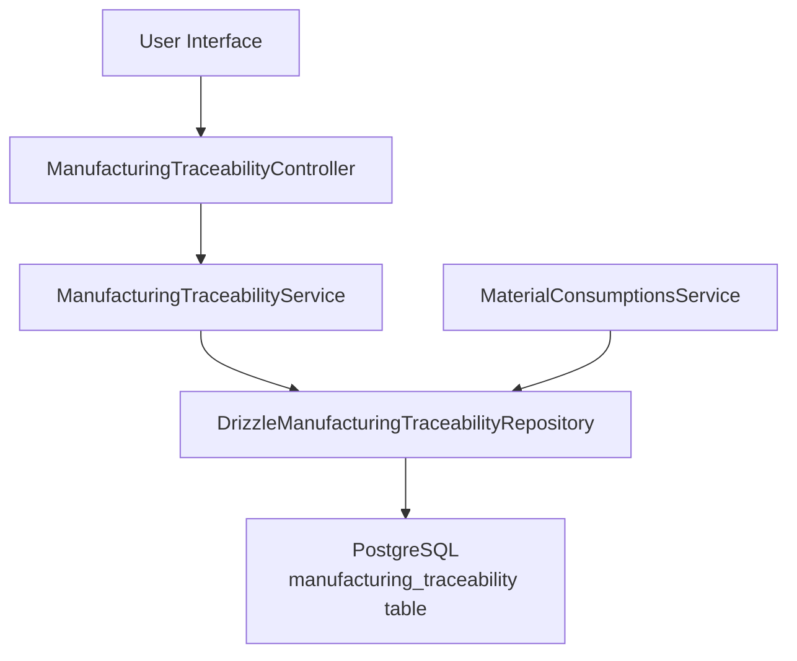
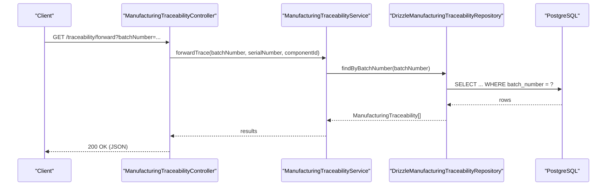
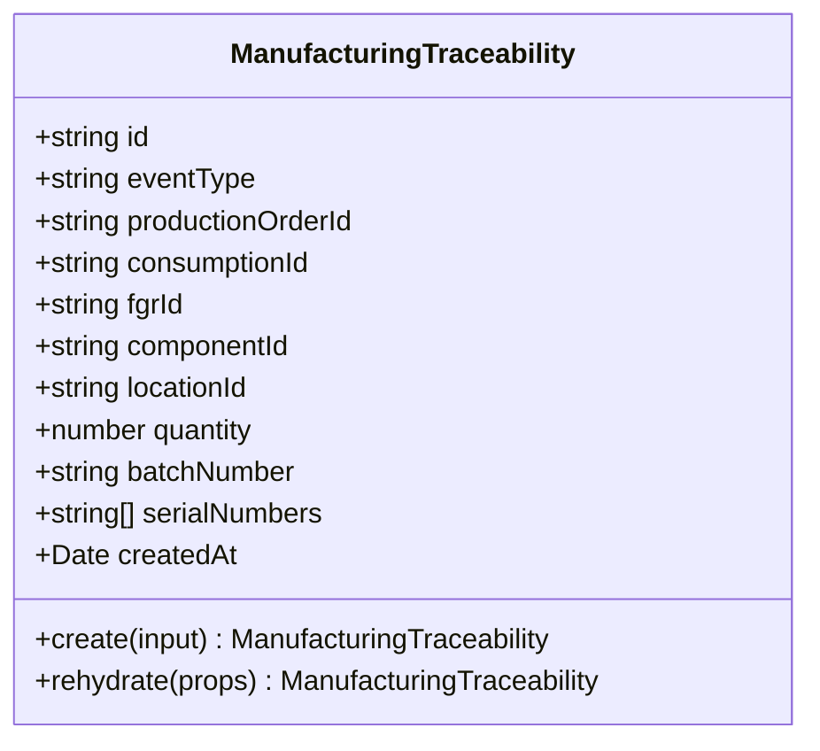
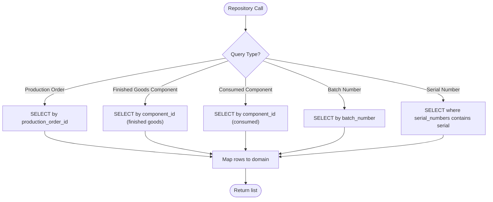
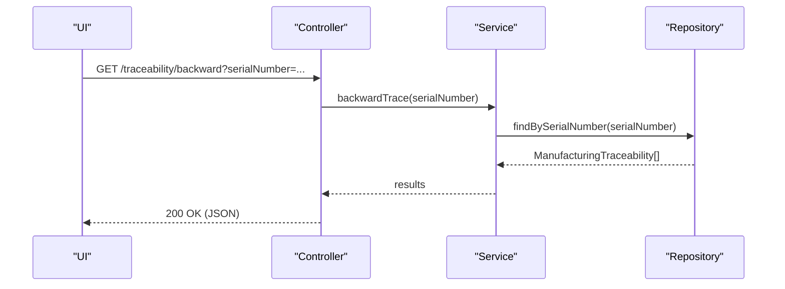
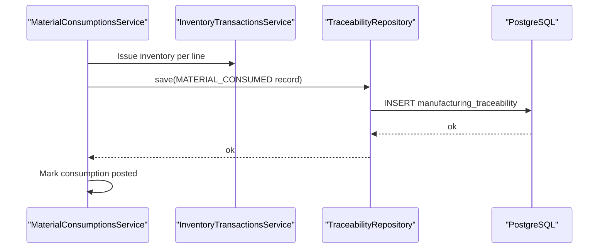
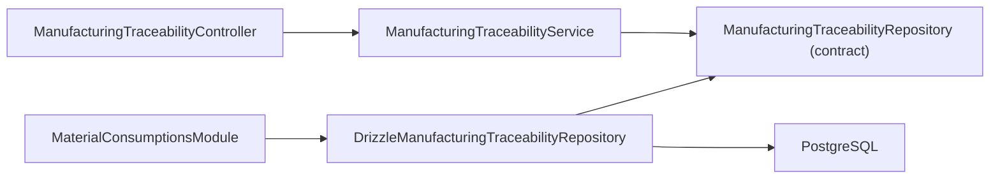

# Manufacturing Traceability

<cite>
**Referenced Files in This Document**
- [0020-manufacturing-traceability.md](file://docs/rfcs/0020-manufacturing-traceability.md)
- [manufacturing-traceability.controller.ts](file://apps/api/src/manufacturing-traceability/manufacturing-traceability.controller.ts)
- [manufacturing-traceability.service.ts](file://apps/api/src/manufacturing-traceability/manufacturing-traceability.service.ts)
- [manufacturing-traceability.module.ts](file://apps/api/src/manufacturing-traceability/manufacturing-traceability.module.ts)
- [drizzle-manufacturing-traceability.repository.ts](file://apps/api/src/infrastructure/repositories/drizzle-manufacturing-traceability.repository.ts)
- [manufacturing-traceability.ts](file://packages/manufacturing/src/traceability/manufacturing-traceability.ts)
- [manufacturing-traceability.repository.ts](file://packages/manufacturing/src/traceability/manufacturing-traceability.repository.ts)
- [material-consumptions.service.ts](file://apps/api/src/material-consumptions/material-consumptions.service.ts)
- [material-consumptions.module.ts](file://apps/api/src/material-consumptions/material-consumptions.module.ts)
</cite>

## Table of Contents
1. Introduction
2. Project Structure
3. Core Components
4. Architecture Overview
5. Detailed Component Analysis
6. Dependency Analysis
7. Performance Considerations
8. Troubleshooting Guide
9. Conclusion
10. Appendices

## Introduction
This document explains the manufacturing traceability capabilities that track the complete history of manufactured products, including component lineage, production batches, and quality-relevant records. It covers forward and backward traceability, integration with serial numbers and batch tracking, example queries, audit trails, compliance reporting considerations, data retention strategies, and traceability data management practices.

The system captures immutable traceability records at key manufacturing events (material consumption and finished goods production) and exposes read APIs to traverse genealogy trees for regulatory and operational needs.

## Project Structure
The manufacturing traceability feature is implemented as a NestJS module with:
- A controller exposing REST endpoints for forward/backward trace and production order queries
- A service delegating to a repository abstraction
- A Drizzle-based repository implementing persistence
- Domain models and repository contracts defined in the manufacturing package
- Integration points where material consumption posts create traceability records

**Diagram sources**
- [manufacturing-traceability.controller.ts:4-39](file://apps/api/src/manufacturing-traceability/manufacturing-traceability.controller.ts#L4-L39)
- [manufacturing-traceability.service.ts:9-58](file://apps/api/src/manufacturing-traceability/manufacturing-traceability.service.ts#L9-L58)
- [drizzle-manufacturing-traceability.repository.ts:29-118](file://apps/api/src/infrastructure/repositories/drizzle-manufacturing-traceability.repository.ts#L29-L118)
- [material-consumptions.service.ts:70-113](file://apps/api/src/material-consumptions/material-consumptions.service.ts#L70-L113)

**Section sources**
- [manufacturing-traceability.controller.ts:4-39](file://apps/api/src/manufacturing-traceability/manufacturing-traceability.controller.ts#L4-L39)
- [manufacturing-traceability.service.ts:9-58](file://apps/api/src/manufacturing-traceability/manufacturing-traceability.service.ts#L9-L58)
- [manufacturing-traceability.module.ts:9-20](file://apps/api/src/manufacturing-traceability/manufacturing-traceability.module.ts#L9-L20)
- [drizzle-manufacturing-traceability.repository.ts:29-118](file://apps/api/src/infrastructure/repositories/drizzle-manufacturing-traceability.repository.ts#L29-L118)
- [material-consumptions.service.ts:70-113](file://apps/api/src/material-consumptions/material-consumptions.service.ts#L70-L113)

## Core Components
- Domain model: Immutable traceability record capturing event type, production order, consumed or produced links, component identity, location, quantity, batch number, and serial numbers.
- Repository contract: Query and save operations by production order, component, batch, and serial; bulk save support.
- Service: Orchestrates forward/backward trace lookups based on query parameters.
- Controller: Exposes GET endpoints for forward trace, backward trace, and production-order-scoped queries.
- Persistence: Drizzle repository mapping domain objects to/from database rows and indexes for efficient lookup.
- Event capture: Material consumption posting creates MATERIAL_CONSUMED traceability records per line.

Key responsibilities:
- Record immutable traceability links at material consumption and finished goods production
- Provide fast lookups by batch, serial, component, and production order
- Support forward and backward genealogy traversal via repository queries

**Section sources**
- [manufacturing-traceability.ts:3-83](file://packages/manufacturing/src/traceability/manufacturing-traceability.ts#L3-L83)
- [manufacturing-traceability.repository.ts:3-19](file://packages/manufacturing/src/traceability/manufacturing-traceability.repository.ts#L3-L19)
- [manufacturing-traceability.service.ts:16-58](file://apps/api/src/manufacturing-traceability/manufacturing-traceability.service.ts#L16-L58)
- [manufacturing-traceability.controller.ts:10-39](file://apps/api/src/manufacturing-traceability/manufacturing-traceability.controller.ts#L10-L39)
- [drizzle-manufacturing-traceability.repository.ts:30-118](file://apps/api/src/infrastructure/repositories/drizzle-manufacturing-traceability.repository.ts#L30-L118)
- [material-consumptions.service.ts:91-102](file://apps/api/src/material-consumptions/material-consumptions.service.ts#L91-L102)

## Architecture Overview
The architecture follows a layered approach:
- API layer: Controller routes requests to service methods
- Application layer: Service selects appropriate repository queries based on inputs
- Domain layer: Immutable entity ensures consistent state and creation rules
- Infrastructure layer: Repository implements SQL queries using Drizzle ORM against PostgreSQL

**Diagram sources**
- [manufacturing-traceability.controller.ts:10-21](file://apps/api/src/manufacturing-traceability/manufacturing-traceability.controller.ts#L10-L21)
- [manufacturing-traceability.service.ts:24-41](file://apps/api/src/manufacturing-traceability/manufacturing-traceability.service.ts#L24-L41)
- [drizzle-manufacturing-traceability.repository.ts:63-72](file://apps/api/src/infrastructure/repositories/drizzle-manufacturing-traceability.repository.ts#L63-L72)

## Detailed Component Analysis

### Domain Model: ManufacturingTraceability
- Immutable record with fields for event type, production order, optional consumption or finished goods receipt IDs, component ID, location, quantity, batch number, serial numbers, and created timestamp.
- Creation via factory method enforces required fields and defaults.

**Diagram sources**
- [manufacturing-traceability.ts:32-83](file://packages/manufacturing/src/traceability/manufacturing-traceability.ts#L32-L83)

**Section sources**
- [manufacturing-traceability.ts:3-83](file://packages/manufacturing/src/traceability/manufacturing-traceability.ts#L3-L83)

### Repository Contract and Implementation
- Contract defines queries by production order, finished goods component, consumed component, batch number, and serial number, plus save and saveMany.
- Drizzle implementation maps rows to domain entities and uses indexes for performance. Serial number search uses array containment.

**Diagram sources**
- [manufacturing-traceability.repository.ts:3-19](file://packages/manufacturing/src/traceability/manufacturing-traceability.repository.ts#L3-L19)
- [drizzle-manufacturing-traceability.repository.ts:30-85](file://apps/api/src/infrastructure/repositories/drizzle-manufacturing-traceability.repository.ts#L30-L85)

**Section sources**
- [manufacturing-traceability.repository.ts:3-19](file://packages/manufacturing/src/traceability/manufacturing-traceability.repository.ts#L3-L19)
- [drizzle-manufacturing-traceability.repository.ts:30-118](file://apps/api/src/infrastructure/repositories/drizzle-manufacturing-traceability.repository.ts#L30-L118)

### API Layer: Controllers and Services
- Controller exposes:
  - Forward trace by batch number, serial number, or component ID
  - Backward trace by batch number, serial number, or component ID
  - Production order trace by ID
- Service selects repository method based on provided query parameters.

**Diagram sources**
- [manufacturing-traceability.controller.ts:23-34](file://apps/api/src/manufacturing-traceability/manufacturing-traceability.controller.ts#L23-L34)
- [manufacturing-traceability.service.ts:43-58](file://apps/api/src/manufacturing-traceability/manufacturing-traceability.service.ts#L43-L58)
- [drizzle-manufacturing-traceability.repository.ts:74-85](file://apps/api/src/infrastructure/repositories/drizzle-manufacturing-traceability.repository.ts#L74-L85)

**Section sources**
- [manufacturing-traceability.controller.ts:4-39](file://apps/api/src/manufacturing-traceability/manufacturing-traceability.controller.ts#L4-L39)
- [manufacturing-traceability.service.ts:9-58](file://apps/api/src/manufacturing-traceability/manufacturing-traceability.service.ts#L9-L58)

### Event Capture: Material Consumption Posting
- When material consumption is posted, inventory is issued and a MATERIAL_CONSUMED traceability record is created per line, linking production order, consumption, component, location, quantity, batch, and serials.

**Diagram sources**
- [material-consumptions.service.ts:70-113](file://apps/api/src/material-consumptions/material-consumptions.service.ts#L70-L113)
- [drizzle-manufacturing-traceability.repository.ts:87-118](file://apps/api/src/infrastructure/repositories/drizzle-manufacturing-traceability.repository.ts#L87-L118)

**Section sources**
- [material-consumptions.service.ts:70-113](file://apps/api/src/material-consumptions/material-consumptions.service.ts#L70-L113)
- [material-consumptions.module.ts:13-29](file://apps/api/src/material-consumptions/material-consumptions.module.ts#L13-L29)

## Dependency Analysis
- The manufacturing traceability module depends on:
  - Domain types and repository contract from the manufacturing package
  - Drizzle schema and query helpers for persistence
  - Material consumption module injects the same repository to write traceability during posting
- Module wiring binds the repository provider to the Drizzle implementation.

**Diagram sources**
- [manufacturing-traceability.module.ts:9-20](file://apps/api/src/manufacturing-traceability/manufacturing-traceability.module.ts#L9-L20)
- [material-consumptions.module.ts:13-29](file://apps/api/src/material-consumptions/material-consumptions.module.ts#L13-L29)
- [manufacturing-traceability.repository.ts:3-19](file://packages/manufacturing/src/traceability/manufacturing-traceability.repository.ts#L3-L19)

**Section sources**
- [manufacturing-traceability.module.ts:9-20](file://apps/api/src/manufacturing-traceability/manufacturing-traceability.module.ts#L9-L20)
- [material-consumptions.module.ts:13-29](file://apps/api/src/material-consumptions/material-consumptions.module.ts#L13-L29)

## Performance Considerations
- Indexes exist for production_order_id and component_id to accelerate common queries.
- Serial number queries use array containment; ensure appropriate indexing strategy if serial arrays grow large.
- Queries return lists ordered by creation time descending to surface latest events first.
- Bulk saves are supported to reduce round trips when recording multiple traceability records.

[No sources needed since this section provides general guidance]

## Troubleshooting Guide
Common issues and resolutions:
- No results for forward/backward trace:
  - Verify input parameters (batchNumber, serialNumber, componentId) match stored values.
  - Confirm that material consumption was posted so traceability records exist.
- Unexpected empty arrays:
  - Check that the correct endpoint is used (forward vs backward).
  - Ensure the repository binding is correctly configured in the module.
- Data integrity errors:
  - Validate that referenced IDs (production order, component, location) exist before posting consumption.
  - Confirm event type constraints are respected.

Operational checks:
- Inspect manufacturing_traceability table entries for the relevant production order or component.
- Review material consumption postings to ensure traceability records were created per line.

**Section sources**
- [manufacturing-traceability.service.ts:24-58](file://apps/api/src/manufacturing-traceability/manufacturing-traceability.service.ts#L24-L58)
- [drizzle-manufacturing-traceability.repository.ts:30-85](file://apps/api/src/infrastructure/repositories/drizzle-manufacturing-traceability.repository.ts#L30-L85)
- [material-consumptions.service.ts:70-113](file://apps/api/src/material-consumptions/material-consumptions.service.ts#L70-L113)

## Conclusion
The manufacturing traceability subsystem provides an immutable, queryable record of production events enabling both forward and backward traceability across components, batches, and serials. It integrates tightly with material consumption posting to capture lineage at the point of truth and exposes simple APIs for genealogy retrieval. With indexed lookups and bulk writes, it supports operational scale while maintaining auditability. Future extensions can add compliance exports and automated recall impact analysis based on backward trace results.

[No sources needed since this section summarizes without analyzing specific files]

## Appendices

### API Reference
- GET /api/v1/traceability/forward
  - Query params: batchNumber, serialNumber, componentId
  - Returns: List of traceability records associated with the specified identifier
- GET /api/v1/traceability/backward
  - Query params: batchNumber, serialNumber, componentId
  - Returns: List of traceability records associated with the specified identifier
- GET /api/v1/traceability/production-order/:id
  - Path param: id (production order ID)
  - Returns: All traceability records for the given production order

**Section sources**
- [manufacturing-traceability.controller.ts:10-39](file://apps/api/src/manufacturing-traceability/manufacturing-traceability.controller.ts#L10-L39)
- [0020-manufacturing-traceability.md:178-182](file://docs/rfcs/0020-manufacturing-traceability.md#L178-L182)

### Data Model and Schema
- Entity: ManufacturingTraceability with fields for event type, production order, optional consumption/fgr IDs, component, location, quantity, batch number, serial numbers, and created timestamp.
- Database table: manufacturing_traceability with indexes on production_order_id and component_id; serial_numbers stored as an array.

**Section sources**
- [manufacturing-traceability.ts:6-18](file://packages/manufacturing/src/traceability/manufacturing-traceability.ts#L6-L18)
- [0020-manufacturing-traceability.md:158-174](file://docs/rfcs/0020-manufacturing-traceability.md#L158-L174)

### Traceability Queries and Examples
- Forward trace by batch number: Retrieve all records linked to a finished product batch to see consumed components and their origins.
- Backward trace by serial number: Find all production orders and finished goods that consumed a specific serial.
- Production order trace: List all traceability records for a production order to build a complete genealogy view.

Example usage patterns:
- Use batchNumber to initiate forward trace for finished goods
- Use serialNumber to perform precise backward trace for serialized items
- Use componentId to find either finished goods or consumed instances depending on endpoint

**Section sources**
- [manufacturing-traceability.service.ts:24-58](file://apps/api/src/manufacturing-traceability/manufacturing-traceability.service.ts#L24-L58)
- [0020-manufacturing-traceability.md:61-66](file://docs/rfcs/0020-manufacturing-traceability.md#L61-L66)

### Audit Trails and Compliance Reporting
- Records are immutable and append-only, providing a reliable audit trail for manufacturing events.
- Compliance reporting can be built by exporting traceability records and joining with procurement data (suppliers, purchase orders, goods receipts) as outlined in the design.
- Future plans include regulatory export formats such as FDA 21 CFR Part 11 and IPC-1782 component traceability.

**Section sources**
- [0020-manufacturing-traceability.md:105-116](file://docs/rfcs/0020-manufacturing-traceability.md#L105-L116)
- [0020-manufacturing-traceability.md:178-182](file://docs/rfcs/0020-manufacturing-traceability.md#L178-L182)
- [0020-manufacturing-traceability.md:202-205](file://docs/rfcs/0020-manufacturing-traceability.md#L202-L205)

### Data Retention and Management Strategies
- Retain traceability records indefinitely to support long-term audits and recalls.
- Archive historical partitions by date ranges to manage growth while preserving access.
- Enforce referential integrity through foreign keys to production orders, material consumptions, finished goods receipts, components, and locations.
- Use bulk inserts for high-volume recording and leverage existing indexes for query performance.

**Section sources**
- [0020-manufacturing-traceability.md:158-174](file://docs/rfcs/0020-manufacturing-traceability.md#L158-L174)
- [drizzle-manufacturing-traceability.repository.ts:87-118](file://apps/api/src/infrastructure/repositories/drizzle-manufacturing-traceability.repository.ts#L87-L118)