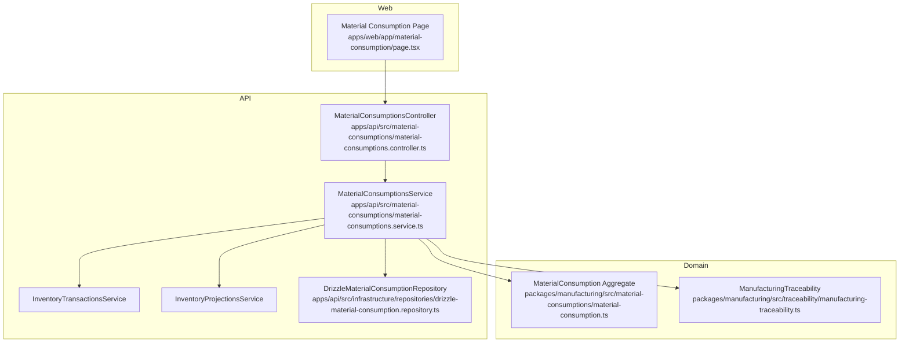
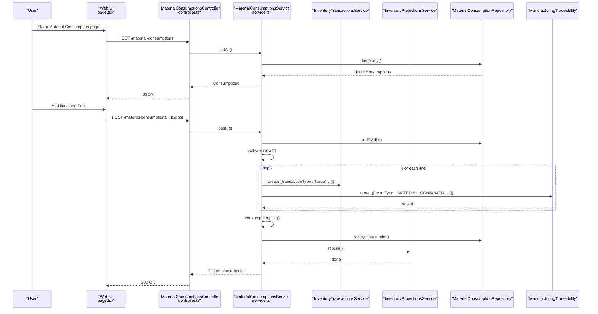
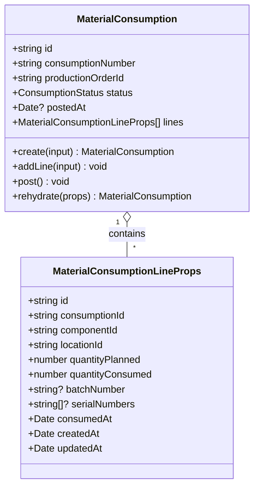
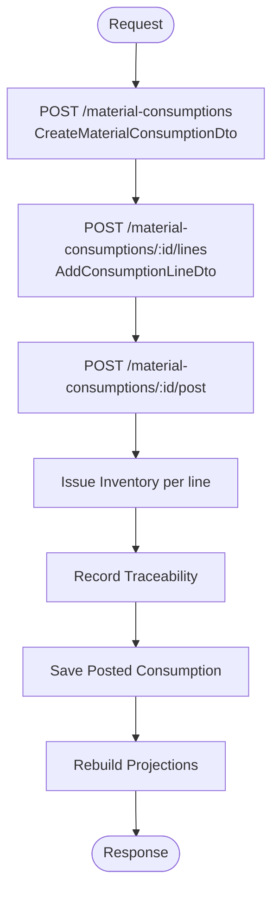
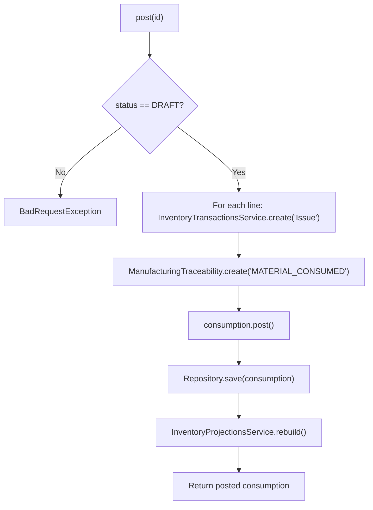
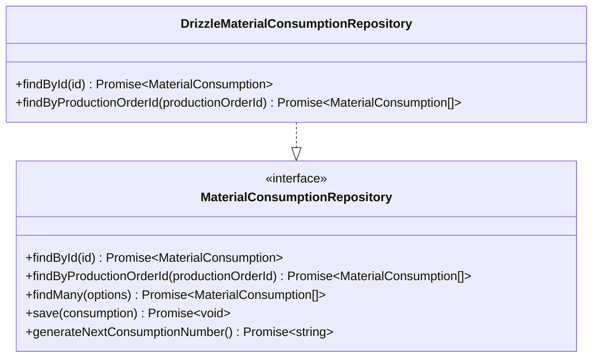
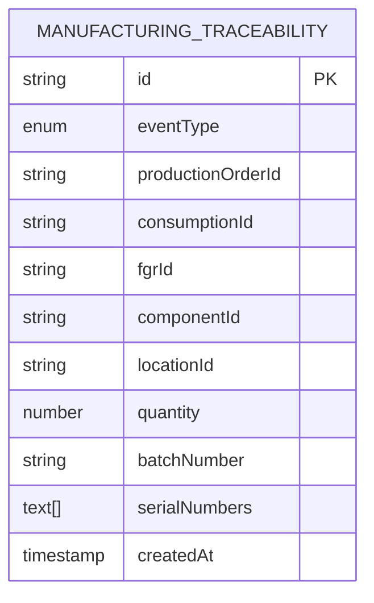
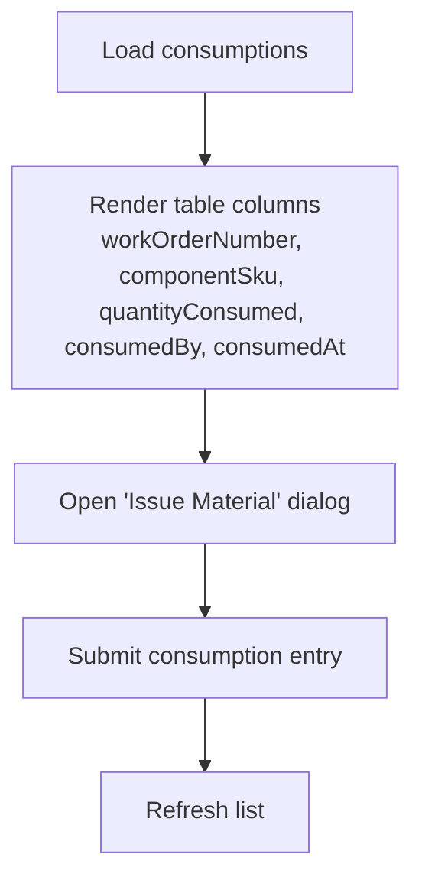
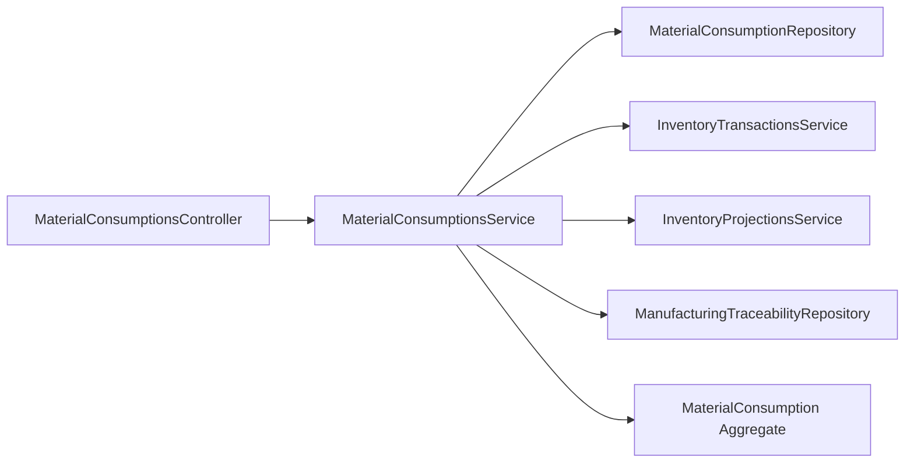
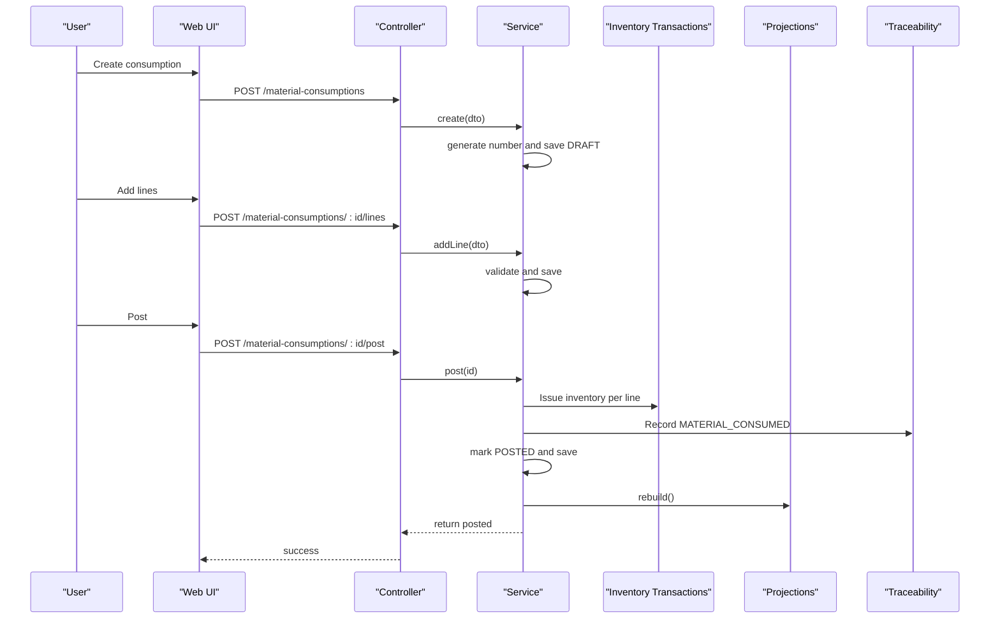

# Material Consumption Tracking

<cite>
**Referenced Files in This Document**
- [0018-material-consumption.md](file://docs/rfcs/0018-material-consumption.md)
- [material-consumptions.service.ts](file://apps/api/src/material-consumptions/material-consumptions.service.ts)
- [material-consumptions.controller.ts](file://apps/api/src/material-consumptions/material-consumptions.controller.ts)
- [dtos.ts](file://apps/api/src/material-consumptions/dtos.ts)
- [material-consumption.ts](file://packages/manufacturing/src/material-consumptions/material-consumption.ts)
- [drizzle-material-consumption.repository.ts](file://apps/api/src/infrastructure/repositories/drizzle-material-consumption.repository.ts)
- [manufacturing-traceability.ts](file://packages/manufacturing/src/traceability/manufacturing-traceability.ts)
- [page.tsx](file://apps/web/app/material-consumption/page.tsx)
- [0020-manufacturing-traceability.md](file://docs/rfcs/0020-manufacturing-traceability.md)
- [api.ts](file://apps/web/src/lib/api.ts)
</cite>

## Table of Contents
1. Introduction
2. Project Structure
3. Core Components
4. Architecture Overview
5. Detailed Component Analysis
6. Dependency Analysis
7. Performance Considerations
8. Troubleshooting Guide
9. Conclusion

## Introduction
This document explains material consumption tracking in manufacturing processes within the system. It covers how materials are consumed during production, standard versus actual consumption tracking, variance analysis, and waste/scrap recording. It also documents consumption posting workflows, inventory updates, cost accounting integration points, and the relationship between consumption records and production orders, including backflushing mechanisms and manual adjustments. Examples include consumption entry, variance reporting, and inventory reconciliation processes.

## Project Structure
Material consumption is implemented across three layers:
- Domain model (Manufacturing package): defines the MaterialConsumption aggregate, line items, status transitions, and validation rules.
- API layer (NestJS): exposes REST endpoints for creating, editing, and posting consumption documents; orchestrates inventory transactions and traceability records.
- Web UI: provides a list view and form to issue materials to work orders.

**Diagram sources**
- [material-consumptions.controller.ts](file://apps/api/src/material-consumptions/material-consumptions.controller.ts)
- [material-consumptions.service.ts](file://apps/api/src/material-consumptions/material-consumptions.service.ts)
- [material-consumption.ts](file://packages/manufacturing/src/material-consumptions/material-consumption.ts)
- [drizzle-material-consumption.repository.ts](file://apps/api/src/infrastructure/repositories/drizzle-material-consumption.repository.ts)
- [manufacturing-traceability.ts](file://packages/manufacturing/src/traceability/manufacturing-traceability.ts)
- [page.tsx](file://apps/web/app/material-consumption/page.tsx)

**Section sources**
- [material-consumptions.controller.ts](file://apps/api/src/material-consumptions/material-consumptions.controller.ts)
- [material-consumptions.service.ts](file://apps/api/src/material-consumptions/material-consumptions.service.ts)
- [material-consumption.ts](file://packages/manufacturing/src/material-consumptions/material-consumption.ts)
- [drizzle-material-consumption.repository.ts](file://apps/api/src/infrastructure/repositories/drizzle-material-consumption.repository.ts)
- [manufacturing-traceability.ts](file://packages/manufacturing/src/traceability/manufacturing-traceability.ts)
- [page.tsx](file://apps/web/app/material-consumption/page.tsx)

## Core Components
- MaterialConsumption aggregate: manages header data, line items, and state transitions (DRAFT to POSTED). Enforces immutability after posting and validates positive consumed quantities.
- Consumption lines: capture componentId, locationId, quantityPlanned, quantityConsumed, batchNumber, serialNumbers, and timestamps.
- Application service: creates consumptions, adds lines, posts them, issues inventory, records traceability, and rebuilds projections.
- Repository: persists consumption headers and lines and maps domain entities to database rows.
- Traceability: immutable records linking consumption events to production orders, components, batches, and serial numbers.

Key responsibilities:
- Standard vs actual: quantityPlanned represents standard BOM requirements; quantityConsumed captures actual usage.
- Posting workflow: converts DRAFT to POSTED, issues inventory per line, writes traceability, and triggers projection rebuild.
- Variance analysis: enabled by comparing planned vs consumed on each line.

**Section sources**
- [material-consumption.ts](file://packages/manufacturing/src/material-consumptions/material-consumption.ts)
- [material-consumptions.service.ts](file://apps/api/src/material-consumptions/material-consumptions.service.ts)
- [drizzle-material-consumption.repository.ts](file://apps/api/src/infrastructure/repositories/drizzle-material-consumption.repository.ts)
- [manufacturing-traceability.ts](file://packages/manufacturing/src/traceability/manufacturing-traceability.ts)

## Architecture Overview
The system follows a clean separation of concerns:
- The Manufacturing domain owns business logic and invariants.
- The API orchestrates cross-cutting operations (inventory issuance, traceability logging, projection rebuild).
- The Web UI provides user interaction for issuing materials and viewing logs.

**Diagram sources**
- [material-consumptions.controller.ts](file://apps/api/src/material-consumptions/material-consumptions.controller.ts)
- [material-consumptions.service.ts](file://apps/api/src/material-consumptions/material-consumptions.service.ts)
- [material-consumption.ts](file://packages/manufacturing/src/material-consumptions/material-consumption.ts)
- [manufacturing-traceability.ts](file://packages/manufacturing/src/traceability/manufacturing-traceability.ts)
- [page.tsx](file://apps/web/app/material-consumption/page.tsx)

## Detailed Component Analysis

### MaterialConsumption Aggregate
- State machine: DRAFT → POSTED. Once posted, the record becomes immutable.
- Line management: addLine enforces positive quantityConsumed and allows optional planned quantity for variance analysis.
- Posting: post sets status to POSTED and records postedAt timestamp.

**Diagram sources**
- [material-consumption.ts](file://packages/manufacturing/src/material-consumptions/material-consumption.ts)

**Section sources**
- [material-consumption.ts](file://packages/manufacturing/src/material-consumptions/material-consumption.ts)

### API Controller and DTOs
- Endpoints:
  - POST /material-consumptions: create a new consumption document linked to a production order.
  - GET /material-consumptions: list consumptions, optionally filtered by productionOrderId.
  - GET /material-consumptions/:id: get details.
  - POST /material-consumptions/:id/lines: add a consumption line.
  - POST /material-consumptions/:id/post: post the consumption and trigger downstream effects.
- DTOs enforce required fields and validations (e.g., positive quantityConsumed).

**Diagram sources**
- [material-consumptions.controller.ts](file://apps/api/src/material-consumptions/material-consumptions.controller.ts)
- [dtos.ts](file://apps/api/src/material-consumptions/dtos.ts)
- [material-consumptions.service.ts](file://apps/api/src/material-consumptions/material-consumptions.service.ts)

**Section sources**
- [material-consumptions.controller.ts](file://apps/api/src/material-consumptions/material-consumptions.controller.ts)
- [dtos.ts](file://apps/api/src/material-consumptions/dtos.ts)

### Service Orchestration and Inventory Integration
- Creation: generates a unique consumption number and persists a DRAFT document.
- Adding lines: validates and appends line items with planned and actual quantities, plus batch/serial tracking.
- Posting:
  - Validates that the consumption is in DRAFT.
  - Issues inventory for each line via InventoryTransactionsService with transactionType 'Issue'.
  - Records ManufacturingTraceability events for each line.
  - Marks the consumption as POSTED and persists it.
  - Calls InventoryProjectionsService.rebuild() to refresh available stock projections.

**Diagram sources**
- [material-consumptions.service.ts](file://apps/api/src/material-consumptions/material-consumptions.service.ts)
- [material-consumption.ts](file://packages/manufacturing/src/material-consumptions/material-consumption.ts)
- [manufacturing-traceability.ts](file://packages/manufacturing/src/traceability/manufacturing-traceability.ts)

**Section sources**
- [material-consumptions.service.ts](file://apps/api/src/material-consumptions/material-consumptions.service.ts)

### Repository and Persistence
- Drizzle-based repository loads consumption headers and lines, mapping them to domain entities.
- Supports findById and findByProductionOrderId queries used by the service.

**Diagram sources**
- [drizzle-material-consumption.repository.ts](file://apps/api/src/infrastructure/repositories/drizzle-material-consumption.repository.ts)
- [0018-material-consumption.md](file://docs/rfcs/0018-material-consumption.md)

**Section sources**
- [drizzle-material-consumption.repository.ts](file://apps/api/src/infrastructure/repositories/drizzle-material-consumption.repository.ts)
- [0018-material-consumption.md](file://docs/rfcs/0018-material-consumption.md)

### Traceability and Genealogy
- Each posted consumption line emits a MATERIAL_CONSUMED event with productionOrderId, componentId, locationId, quantity, and optional batch/serial identifiers.
- Enables forward and backward traceability across the manufacturing lifecycle.

**Diagram sources**
- [manufacturing-traceability.ts](file://packages/manufacturing/src/traceability/manufacturing-traceability.ts)
- [0020-manufacturing-traceability.md](file://docs/rfcs/0020-manufacturing-traceability.md)

**Section sources**
- [manufacturing-traceability.ts](file://packages/manufacturing/src/traceability/manufacturing-traceability.ts)
- [0020-manufacturing-traceability.md](file://docs/rfcs/0020-manufacturing-traceability.md)

### Web UI and Consumption Entry
- The Material Consumption page lists issued materials and provides a dialog to issue materials to work orders.
- Columns show work order number, component SKU, quantity consumed, operator, and timestamp.

**Diagram sources**
- [page.tsx](file://apps/web/app/material-consumption/page.tsx)

**Section sources**
- [page.tsx](file://apps/web/app/material-consumption/page.tsx)

## Dependency Analysis
- The API controller depends on the application service for all business operations.
- The application service depends on:
  - MaterialConsumptionRepository for persistence.
  - InventoryTransactionsService to issue inventory.
  - InventoryProjectionsService to rebuild projections.
  - ManufacturingTraceabilityRepository to persist traceability events.
- The domain aggregate encapsulates invariants and state transitions, ensuring consistency regardless of persistence or external services.

**Diagram sources**
- [material-consumptions.controller.ts](file://apps/api/src/material-consumptions/material-consumptions.controller.ts)
- [material-consumptions.service.ts](file://apps/api/src/material-consumptions/material-consumptions.service.ts)
- [material-consumption.ts](file://packages/manufacturing/src/material-consumptions/material-consumption.ts)

**Section sources**
- [material-consumptions.controller.ts](file://apps/api/src/material-consumptions/material-consumptions.controller.ts)
- [material-consumptions.service.ts](file://apps/api/src/material-consumptions/material-consumptions.service.ts)

## Performance Considerations
- Posting loops over consumption lines to issue inventory and write traceability; consider batching where supported by downstream services.
- Projection rebuild is invoked once after all lines are posted to avoid repeated expensive recalculations.
- Repository queries load lines eagerly for findById and findByProductionOrderId; ensure indexes exist on foreign keys (consumption_id, production_order_id) for performance.

[No sources needed since this section provides general guidance]

## Troubleshooting Guide
Common issues and resolutions:
- Attempting to post a non-DRAFT consumption:
  - Symptom: BadRequestException indicating already posted.
  - Resolution: Ensure the consumption is created and remains in DRAFT until ready to post.
- Invalid consumption quantity:
  - Symptom: Domain error when adding a line with quantityConsumed <= 0.
  - Resolution: Provide a positive quantityConsumed value.
- Missing references:
  - Symptom: Validation errors for invalid componentId or locationId.
  - Resolution: Confirm that referenced component and location exist in inventory master data.
- Inventory not updated:
  - Symptom: Stock levels unchanged after posting.
  - Resolution: Verify InventoryTransactionsService.create was called and InventoryProjectionsService.rebuild completed successfully.

**Section sources**
- [material-consumptions.service.ts](file://apps/api/src/material-consumptions/material-consumptions.service.ts)
- [material-consumption.ts](file://packages/manufacturing/src/material-consumptions/material-consumption.ts)

## Conclusion
Material consumption tracking in this system centers on a robust domain aggregate that separates planning (quantityPlanned) from reality (quantityConsumed), enabling clear variance analysis. The API orchestrates inventory issuance and traceability logging while preserving domain integrity. The UI supports practical shop-floor workflows for issuing materials and reviewing consumption logs. Future enhancements include automatic backflushing at production completion and approval workflows for over-consumption beyond tolerances.

[No sources needed since this section summarizes without analyzing specific files]

## Appendices

### Standard vs Actual Consumption and Variance Analysis
- Standard consumption: captured via quantityPlanned on consumption lines, typically derived from BOM requirements.
- Actual consumption: captured via quantityConsumed on consumption lines.
- Variance: computed per line as quantityConsumed minus quantityPlanned; negative indicates under-consumption, positive indicates over-consumption.
- Reporting: use consumption lines grouped by component to summarize variances across production orders.

**Section sources**
- [0018-material-consumption.md](file://docs/rfcs/0018-material-consumption.md)
- [material-consumption.ts](file://packages/manufacturing/src/material-consumptions/material-consumption.ts)

### Waste and Scrap Recording
- Waste and scrap can be recorded as additional consumption lines with appropriate component references (e.g., scrap bins or rework components) and zero or minimal planned quantities to highlight deviations.
- Alternatively, track finished goods scrapped separately through finished goods receipts and production order scrapped quantities.

**Section sources**
- [0017-production-orders.md](file://docs/rfcs/0017-production-orders.md)
- [0018-material-consumption.md](file://docs/rfcs/0018-material-consumption.md)

### Backflushing Mechanisms and Manual Adjustments
- Backflushing: future extension to automatically consume materials based on BOM at production completion.
- Manual adjustments: operators can manually add consumption lines with actual quantities and locations; these override planned amounts for variance analysis.

**Section sources**
- [0018-material-consumption.md](file://docs/rfcs/0018-material-consumption.md)

### Consumption Posting Workflow
- Steps:
  1. Create consumption against a production order.
  2. Add one or more consumption lines with component, location, planned and actual quantities, and optional batch/serial.
  3. Post the consumption to issue inventory and record traceability.
  4. System rebuilds inventory projections.

**Diagram sources**
- [material-consumptions.controller.ts](file://apps/api/src/material-consumptions/material-consumptions.controller.ts)
- [material-consumptions.service.ts](file://apps/api/src/material-consumptions/material-consumptions.service.ts)
- [material-consumption.ts](file://packages/manufacturing/src/material-consumptions/material-consumption.ts)
- [manufacturing-traceability.ts](file://packages/manufacturing/src/traceability/manufacturing-traceability.ts)

### Inventory Updates and Cost Accounting Integration
- Inventory updates:
  - Each posted consumption line calls InventoryTransactionsService.create with transactionType 'Issue'.
  - After posting, InventoryProjectionsService.rebuild ensures projections reflect the latest ledger entries.
- Cost accounting integration:
  - Consumption records link to production orders, enabling job costing by aggregating actual material costs per order.
  - Batch and serial tracking support precise cost allocation and traceability.

**Section sources**
- [material-consumptions.service.ts](file://apps/api/src/material-consumptions/material-consumptions.service.ts)
- [0018-material-consumption.md](file://docs/rfcs/0018-material-consumption.md)

### Relationship Between Consumption Records and Production Orders
- Each consumption document references a production order, allowing aggregation of actual material usage per order.
- Production order statuses constrain valid consumption creation (e.g., IN_PROGRESS).

**Section sources**
- [0017-production-orders.md](file://docs/rfcs/0017-production-orders.md)
- [0018-material-consumption.md](file://docs/rfcs/0018-material-consumption.md)

### Examples

#### Example: Consumption Entry
- Create a consumption document for a production order.
- Add lines specifying component, source location, planned quantity, and actual consumed quantity.
- Optionally record batch number and serial numbers for traceability.
- Post the consumption to issue inventory and update projections.

**Section sources**
- [material-consumptions.controller.ts](file://apps/api/src/material-consumptions/material-consumptions.controller.ts)
- [material-consumptions.service.ts](file://apps/api/src/material-consumptions/material-consumptions.service.ts)
- [dtos.ts](file://apps/api/src/material-consumptions/dtos.ts)

#### Example: Variance Reporting
- Retrieve consumption lines for a production order.
- Compute variance per line as quantityConsumed minus quantityPlanned.
- Summarize total variance by component and overall order.

**Section sources**
- [0018-material-consumption.md](file://docs/rfcs/0018-material-consumption.md)
- [material-consumption.ts](file://packages/manufacturing/src/material-consumptions/material-consumption.ts)

#### Example: Inventory Reconciliation
- Compare inventory projections before and after posting consumptions.
- Investigate discrepancies by reviewing issued inventory transactions and traceability records.
- Use forward/backward trace APIs to locate affected batches and serials.

**Section sources**
- [material-consumptions.service.ts](file://apps/api/src/material-consumptions/material-consumptions.service.ts)
- [api.ts](file://apps/web/src/lib/api.ts)
- [0020-manufacturing-traceability.md](file://docs/rfcs/0020-manufacturing-traceability.md)