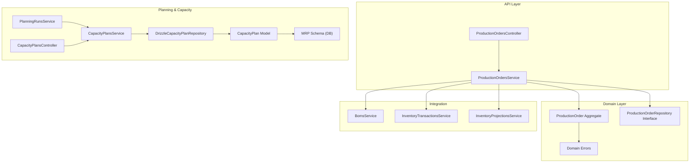
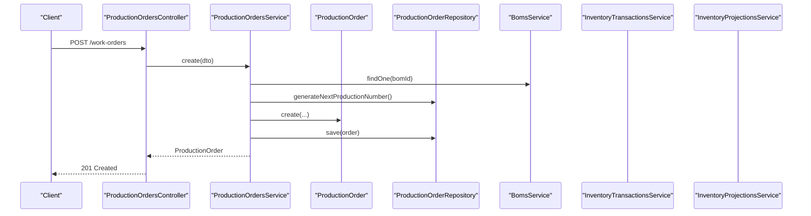
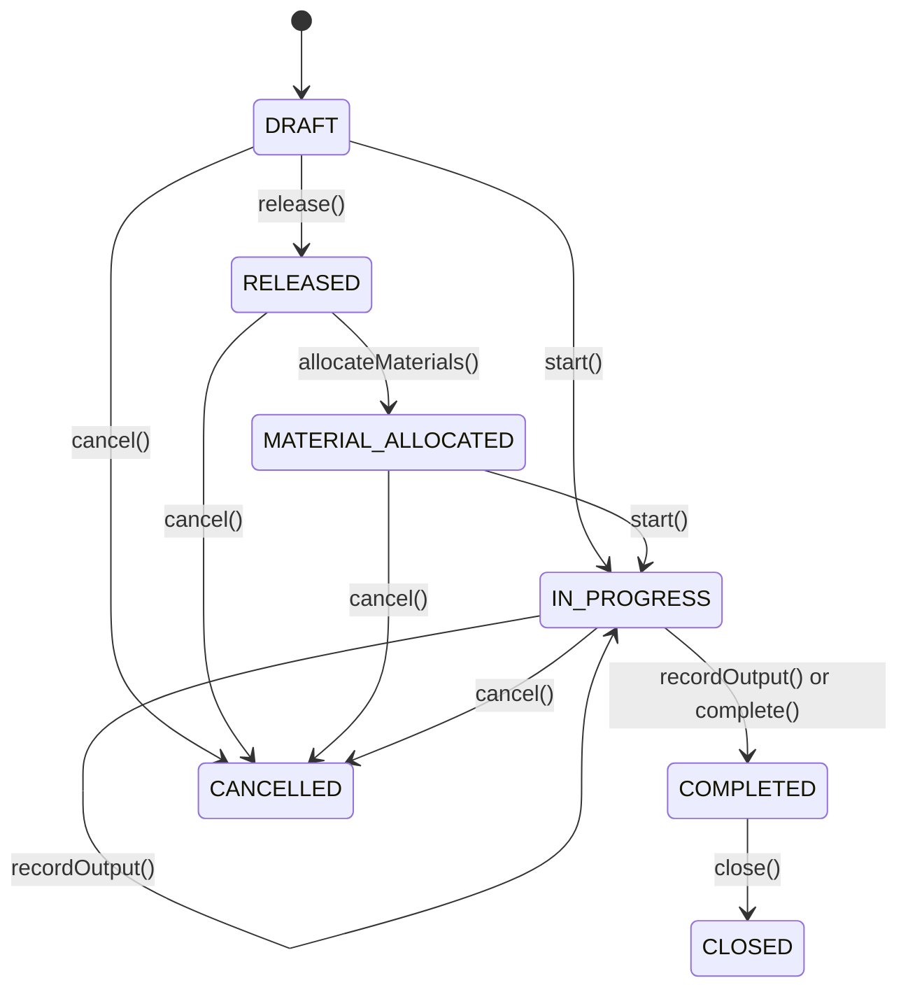
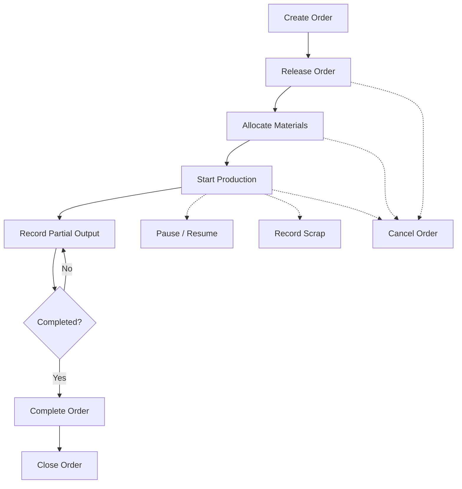
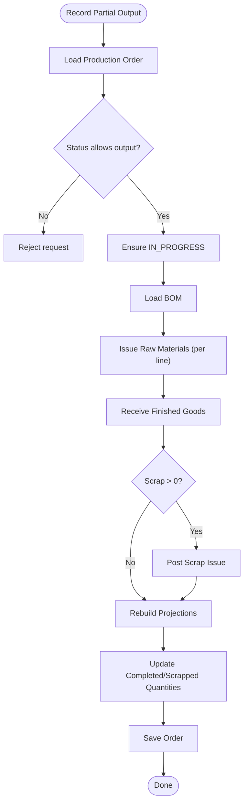
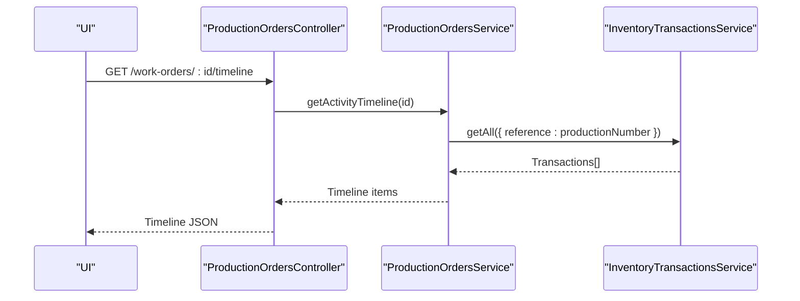
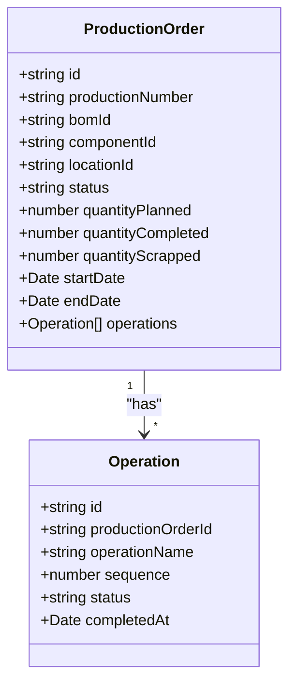
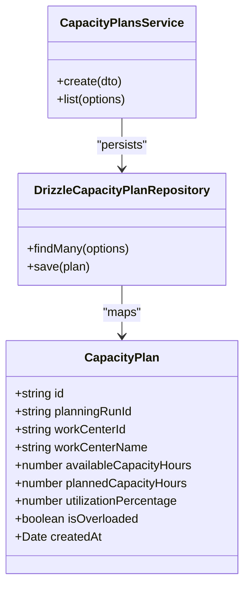
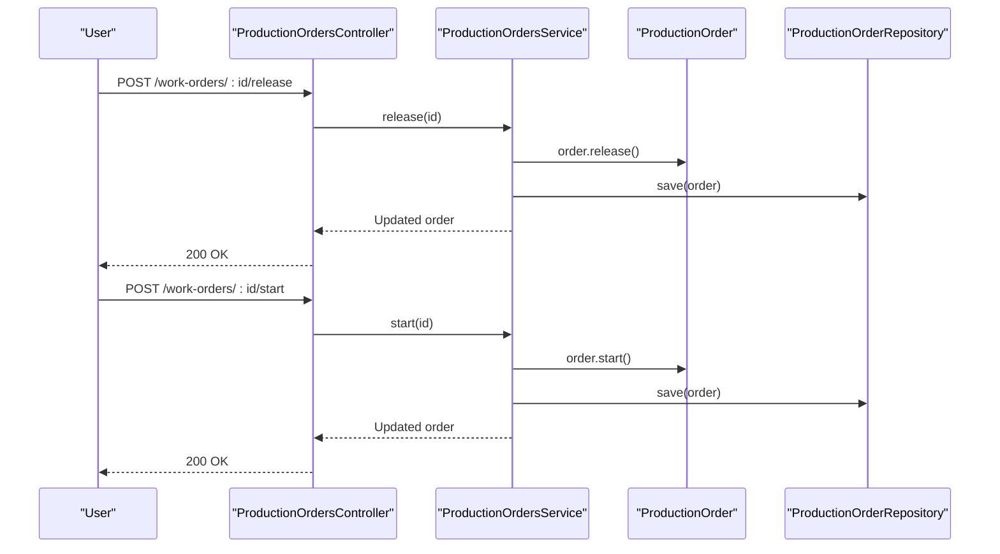
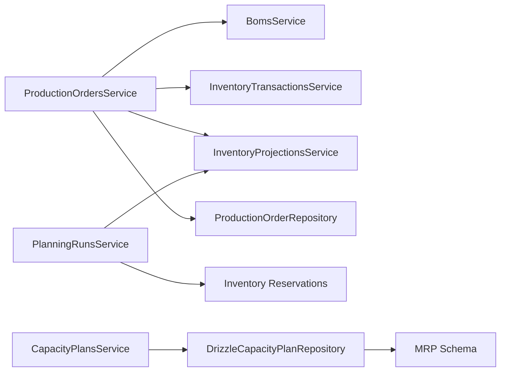

# Production Orders

<cite>
**Referenced Files in This Document**
- [production-orders.controller.ts](file://apps/api/src/production-orders/production-orders.controller.ts)
- [production-orders.service.ts](file://apps/api/src/production-orders/production-orders.service.ts)
- [dtos.ts](file://apps/api/src/production-orders/dtos.ts)
- [production-order.ts](file://packages/manufacturing/src/production-orders/production-order.ts)
- [production-order.errors.ts](file://packages/manufacturing/src/production-orders/production-order.errors.ts)
- [production-order.repository.ts](file://packages/manufacturing/src/production-orders/production-order.repository.ts)
- [0017-production-orders.md](file://docs/rfcs/0017-production-orders.md)
- [capacity-plans.controller.ts](file://apps/api/src/capacity-plans/capacity-plans.controller.ts)
- [capacity-plans.service.ts](file://apps/api/src/capacity-plans/capacity-plans.service.ts)
- [dtos.ts (capacity plans)](file://apps/api/src/capacity-plans/dtos.ts)
- [drizzle-capacity-plan.repository.ts](file://apps/api/src/infrastructure/repositories/drizzle-capacity-plan.repository.ts)
- [capacity-plan.ts](file://packages/mrp/src/capacity/capacity-plan.ts)
- [mrp.ts (schema)](file://packages/database/src/schema/mrp.ts)
- [planning-runs.service.ts](file://apps/api/src/planning-runs/planning-runs.service.ts)
</cite>

## Table of Contents
1. [Introduction](#introduction)
2. [Project Structure](#project-structure)
3. [Core Components](#core-components)
4. [Architecture Overview](#architecture-overview)
5. [Detailed Component Analysis](#detailed-component-analysis)
6. [Dependency Analysis](#dependency-analysis)
7. [Performance Considerations](#performance-considerations)
8. [Troubleshooting Guide](#troubleshooting-guide)
9. [Conclusion](#conclusion)

## Introduction
This document explains the Production Orders module end-to-end: lifecycle, routing and operations, scheduling, execution, material reservation, capacity planning integration, status transitions, approval workflows, quality control checkpoints, and reporting. It also provides optimization strategies for parallel processing and resource allocation.

## Project Structure
The Production Orders feature spans API controllers/services, domain models, repository contracts, RFC design, and related planning/capacity modules.

**Diagram sources**
- [production-orders.controller.ts:26-129](file://apps/api/src/production-orders/production-orders.controller.ts#L26-L129)
- [production-orders.service.ts:58-471](file://apps/api/src/production-orders/production-orders.service.ts#L58-L471)
- [production-order.ts:71-271](file://packages/manufacturing/src/production-orders/production-order.ts#L71-L271)
- [production-order.errors.ts:1-24](file://packages/manufacturing/src/production-orders/production-order.errors.ts#L1-L24)
- [production-order.repository.ts:16-27](file://packages/manufacturing/src/production-orders/production-order.repository.ts#L16-L27)
- [planning-runs.service.ts:81-162](file://apps/api/src/planning-runs/planning-runs.service.ts#L81-L162)
- [capacity-plans.controller.ts:1-40](file://apps/api/src/capacity-plans/capacity-plans.controller.ts#L1-L40)
- [capacity-plans.service.ts:1-40](file://apps/api/src/capacity-plans/capacity-plans.service.ts#L1-L40)
- [drizzle-capacity-plan.repository.ts:1-80](file://apps/api/src/infrastructure/repositories/drizzle-capacity-plan.repository.ts#L1-L80)
- [capacity-plan.ts:1-120](file://packages/mrp/src/capacity/capacity-plan.ts#L1-L120)
- [mrp.ts:147-178](file://packages/database/src/schema/mrp.ts#L147-L178)

**Section sources**
- [production-orders.controller.ts:26-129](file://apps/api/src/production-orders/production-orders.controller.ts#L26-L129)
- [production-orders.service.ts:58-471](file://apps/api/src/production-orders/production-orders.service.ts#L58-L471)
- [production-order.ts:71-271](file://packages/manufacturing/src/production-orders/production-order.ts#L71-L271)
- [production-order.repository.ts:16-27](file://packages/manufacturing/src/production-orders/production-order.repository.ts#L16-L27)
- [0017-production-orders.md:11-23](file://docs/rfcs/0017-production-orders.md#L11-L23)

## Core Components
- ProductionOrdersController: Exposes REST endpoints for creation, updates, release/start/pause/resume/complete/close/cancel, output/scrap recording, and timeline retrieval.
- ProductionOrdersService: Orchestrates order lifecycle, material requirements calculation, inventory transactions, projections rebuild, and activity timeline aggregation.
- ProductionOrder aggregate: Encapsulates state machine, quantity tracking, and operation step progress.
- ProductionOrderRepository interface: Defines persistence and query capabilities.
- Domain errors: Enforce invalid transitions and quantity constraints.
- RFC-0017: Defines scope, language, commands, queries, invariants, state machine, and database schema.

**Section sources**
- [production-orders.controller.ts:26-129](file://apps/api/src/production-orders/production-orders.controller.ts#L26-L129)
- [production-orders.service.ts:58-471](file://apps/api/src/production-orders/production-orders.service.ts#L58-L471)
- [production-order.ts:71-271](file://packages/manufacturing/src/production-orders/production-order.ts#L71-L271)
- [production-order.errors.ts:1-24](file://packages/manufacturing/src/production-orders/production-order.errors.ts#L1-L24)
- [production-order.repository.ts:16-27](file://packages/manufacturing/src/production-orders/production-order.repository.ts#L16-L27)
- [0017-production-orders.md:11-23](file://docs/rfcs/0017-production-orders.md#L11-L23)

## Architecture Overview
The Production Orders module follows a layered architecture with clear separation between API, application service orchestration, domain logic, and infrastructure integrations.

**Diagram sources**
- [production-orders.controller.ts:33-36](file://apps/api/src/production-orders/production-orders.controller.ts#L33-L36)
- [production-orders.service.ts:68-94](file://apps/api/src/production-orders/production-orders.service.ts#L68-L94)

## Detailed Component Analysis

### Production Order Lifecycle and State Machine
The Production Order aggregate enforces a strict state machine with transitions for creation, release, material allocation, start, pause/resume, completion, closure, and cancellation.

- Invariants:
  - Planned quantity must be positive.
  - Editing is allowed only in DRAFT.
  - Completion requires finished goods receipt; closing requires COMPLETED.
  - Cancellation is blocked from terminal states.

**Diagram sources**
- [production-order.ts:110-271](file://packages/manufacturing/src/production-orders/production-order.ts#L110-L271)
- [0017-production-orders.md:106-122](file://docs/rfcs/0017-production-orders.md#L106-L122)

**Section sources**
- [production-order.ts:110-271](file://packages/manufacturing/src/production-orders/production-order.ts#L110-L271)
- [production-order.errors.ts:1-24](file://packages/manufacturing/src/production-orders/production-order.errors.ts#L1-L24)
- [0017-production-orders.md:106-122](file://docs/rfcs/0017-production-orders.md#L106-L122)

### API Endpoints and Control Flow
Endpoints cover full lifecycle management and operational actions.

- Create: POST /work-orders
- List: GET /work-orders?componentId&bomId&locationId&status&priority&search
- Get: GET /work-orders/:id
- Material Requirements: GET /work-orders/:id/materials
- Timeline: GET /work-orders/:id/timeline
- Update: PUT /work-orders/:id
- Release: POST /work-orders/:id/release
- Start: POST /work-orders/:id/start
- Record Output: POST /work-orders/:id/record-output
- Record Scrap: POST /work-orders/:id/record-scrap
- Pause: POST /work-orders/:id/pause
- Resume: POST /work-orders/:id/resume
- Complete: POST /work-orders/:id/complete
- Close: POST /work-orders/:id/close
- Cancel: POST /work-orders/:id/cancel
- Delete: DELETE /work-orders/:id

**Diagram sources**
- [production-orders.controller.ts:33-129](file://apps/api/src/production-orders/production-orders.controller.ts#L33-L129)
- [production-orders.service.ts:68-471](file://apps/api/src/production-orders/production-orders.service.ts#L68-L471)

**Section sources**
- [production-orders.controller.ts:33-129](file://apps/api/src/production-orders/production-orders.controller.ts#L33-L129)

### Material Reservation and Consumption
Material requirements are computed from the BOM lines, including scrap factors. During partial output and final completion, raw materials are issued and finished goods are received. Inventory projections are rebuilt to reflect changes.

Key behaviors:
- Requirement calculation uses planned quantity, per-unit consumption, and scrap factor.
- Partial output issues proportional raw materials and records finished goods output.
- Scrap entries are recorded as separate issues.
- Projections rebuild ensures downstream planning sees updated availability.

**Diagram sources**
- [production-orders.service.ts:204-273](file://apps/api/src/production-orders/production-orders.service.ts#L204-L273)
- [production-orders.service.ts:317-365](file://apps/api/src/production-orders/production-orders.service.ts#L317-L365)

**Section sources**
- [production-orders.service.ts:146-184](file://apps/api/src/production-orders/production-orders.service.ts#L146-L184)
- [production-orders.service.ts:204-273](file://apps/api/src/production-orders/production-orders.service.ts#L204-L273)
- [production-orders.service.ts:317-365](file://apps/api/src/production-orders/production-orders.service.ts#L317-L365)

### Activity Timeline and Quality Control Checkpoints
The timeline aggregates production events: creation, start, material consumption, output produced, scrap recorded, pause/resume, completion, and closure. Scrap recording acts as a quality checkpoint; additional QC steps can be modeled via production order operations.

**Diagram sources**
- [production-orders.controller.ts:67-70](file://apps/api/src/production-orders/production-orders.controller.ts#L67-L70)
- [production-orders.service.ts:367-447](file://apps/api/src/production-orders/production-orders.service.ts#L367-L447)

**Section sources**
- [production-orders.service.ts:367-447](file://apps/api/src/production-orders/production-orders.service.ts#L367-L447)

### Routing and Work Center Assignments
Routing is represented by production order operations. While the current implementation tracks operation metadata, work center assignment and capacity planning integrate through the planning and capacity modules.

- Operations: sequence, name, status, completedAt.
- Work centers: defined in capacity planning data model and persisted in MRP schema.

**Diagram sources**
- [production-order.ts:18-47](file://packages/manufacturing/src/production-orders/production-order.ts#L18-L47)
- [production-order.ts:71-88](file://packages/manufacturing/src/production-orders/production-order.ts#L71-L88)

**Section sources**
- [production-order.ts:18-47](file://packages/manufacturing/src/production-orders/production-order.ts#L18-L47)
- [production-order.ts:71-88](file://packages/manufacturing/src/production-orders/production-order.ts#L71-L88)

### Capacity Planning Integration
Capacity planning is modeled separately but integrates with production planning runs. Capacity plans track available vs planned hours per work center and utilization metrics.

**Diagram sources**
- [capacity-plan.ts:1-120](file://packages/mrp/src/capacity/capacity-plan.ts#L1-L120)
- [drizzle-capacity-plan.repository.ts:1-80](file://apps/api/src/infrastructure/repositories/drizzle-capacity-plan.repository.ts#L1-L80)
- [capacity-plans.service.ts:1-40](file://apps/api/src/capacity-plans/capacity-plans.service.ts#L1-L40)

**Section sources**
- [capacity-plan.ts:1-120](file://packages/mrp/src/capacity/capacity-plan.ts#L1-L120)
- [drizzle-capacity-plan.repository.ts:1-80](file://apps/api/src/infrastructure/repositories/drizzle-capacity-plan.repository.ts#L1-L80)
- [capacity-plans.service.ts:1-40](file://apps/api/src/capacity-plans/capacity-plans.service.ts#L1-L40)
- [mrp.ts:147-178](file://packages/database/src/schema/mrp.ts#L147-L178)

### Approval Workflow and Status Transitions
Approval typically occurs at release and material allocation stages. The controller exposes explicit release and start endpoints; allocation is modeled in the domain and RFC.

**Diagram sources**
- [production-orders.controller.ts:77-85](file://apps/api/src/production-orders/production-orders.controller.ts#L77-L85)
- [production-orders.service.ts:186-202](file://apps/api/src/production-orders/production-orders.service.ts#L186-L202)
- [production-order.ts:164-200](file://packages/manufacturing/src/production-orders/production-order.ts#L164-L200)

**Section sources**
- [production-orders.controller.ts:77-85](file://apps/api/src/production-orders/production-orders.controller.ts#L77-L85)
- [production-orders.service.ts:186-202](file://apps/api/src/production-orders/production-orders.service.ts#L186-L202)
- [production-order.ts:164-200](file://packages/manufacturing/src/production-orders/production-order.ts#L164-L200)

### Examples

- Creating a production order:
  - Use POST /work-orders with BOM ID, component ID, planned quantity, optional location and dates.
  - The service validates BOM matches component, generates a unique production number, creates the order in DRAFT, and persists it.

- Material reservation:
  - Use GET /work-orders/:id/materials to compute required quantities based on BOM lines and scrap factors.
  - Allocation is modeled in the domain; actual reservations integrate with inventory services during execution.

- Progress tracking:
  - Use POST /work-orders/:id/record-output to issue raw materials, receive finished goods, optionally record scrap, update quantities, and rebuild projections.
  - Use GET /work-orders/:id/timeline to view chronological events.

- Completion reporting:
  - Use POST /work-orders/:id/complete to finalize remaining output and post final inventory movements.
  - Use POST /work-orders/:id/close to mark the order closed after reconciliation.

**Section sources**
- [production-orders.controller.ts:33-129](file://apps/api/src/production-orders/production-orders.controller.ts#L33-L129)
- [production-orders.service.ts:68-94](file://apps/api/src/production-orders/production-orders.service.ts#L68-L94)
- [production-orders.service.ts:146-184](file://apps/api/src/production-orders/production-orders.service.ts#L146-L184)
- [production-orders.service.ts:204-273](file://apps/api/src/production-orders/production-orders.service.ts#L204-L273)
- [production-orders.service.ts:317-365](file://apps/api/src/production-orders/production-orders.service.ts#L317-L365)
- [production-orders.service.ts:367-447](file://apps/api/src/production-orders/production-orders.service.ts#L367-L447)

## Dependency Analysis
Production Orders depend on BOMs, inventory transactions, and projections. Planning runs consume inventory projections and reservations to generate requirements and recommendations. Capacity plans provide work center utilization insights.

**Diagram sources**
- [production-orders.service.ts:58-66](file://apps/api/src/production-orders/production-orders.service.ts#L58-L66)
- [planning-runs.service.ts:81-162](file://apps/api/src/planning-runs/planning-runs.service.ts#L81-L162)
- [capacity-plans.service.ts:1-40](file://apps/api/src/capacity-plans/capacity-plans.service.ts#L1-L40)
- [drizzle-capacity-plan.repository.ts:1-80](file://apps/api/src/infrastructure/repositories/drizzle-capacity-plan.repository.ts#L1-L80)
- [mrp.ts:147-178](file://packages/database/src/schema/mrp.ts#L147-L178)

**Section sources**
- [production-orders.service.ts:58-66](file://apps/api/src/production-orders/production-orders.service.ts#L58-L66)
- [planning-runs.service.ts:81-162](file://apps/api/src/planning-runs/planning-runs.service.ts#L81-L162)
- [capacity-plans.service.ts:1-40](file://apps/api/src/capacity-plans/capacity-plans.service.ts#L1-L40)
- [drizzle-capacity-plan.repository.ts:1-80](file://apps/api/src/infrastructure/repositories/drizzle-capacity-plan.repository.ts#L1-L80)
- [mrp.ts:147-178](file://packages/database/src/schema/mrp.ts#L147-L178)

## Performance Considerations
- Batch material issuance and receipts:
  - When recording partial outputs or completing orders, multiple inventory transactions are created. Consider batching these calls where supported to reduce overhead.
- Projection rebuild frequency:
  - After each material issue or output receipt, projections are rebuilt. For high-throughput environments, consider debouncing or consolidating rebuilds.
- Parallel processing:
  - Independent operations across different production orders can be processed concurrently. Avoid concurrent mutations on the same order to prevent race conditions.
- Indexing and queries:
  - Use filters (componentId, bomId, locationId, status, priority) to narrow result sets. Ensure indexes exist on frequently filtered columns.
- Capacity planning:
  - Utilize capacity plan utilizationPercentage and isOverloaded flags to prioritize orders and avoid bottlenecks.

[No sources needed since this section provides general guidance]

## Troubleshooting Guide
Common issues and resolutions:
- Invalid status transition:
  - Occurs when attempting illegal state changes (e.g., starting from an invalid state). Validate current status before invoking domain methods.
- Cannot edit non-DRAFT orders:
  - Only DRAFT orders are editable. Move to DRAFT by creating a new order or use appropriate workflow to adjust.
- Cannot record output on completed/cancelled orders:
  - Ensure order is IN_PROGRESS before recording output or scrap.
- Only DRAFT orders can be deleted:
  - Delete is restricted to DRAFT; otherwise, cancel or close as appropriate.
- Material shortage detection:
  - Use material requirements endpoint to identify shortages and adjust procurement or scheduling.

**Section sources**
- [production-order.errors.ts:1-24](file://packages/manufacturing/src/production-orders/production-order.errors.ts#L1-L24)
- [production-orders.service.ts:96-118](file://apps/api/src/production-orders/production-orders.service.ts#L96-L118)
- [production-orders.service.ts:204-273](file://apps/api/src/production-orders/production-orders.service.ts#L204-L273)
- [production-orders.service.ts:463-469](file://apps/api/src/production-orders/production-orders.service.ts#L463-L469)

## Conclusion
The Production Orders module provides a robust, domain-driven lifecycle for manufacturing work orders, integrating tightly with BOMs, inventory transactions, and projections. Capacity planning and planning runs complement production execution by providing work center utilization and demand-supply insights. By adhering to the defined state machine, validation rules, and integration points, teams can reliably manage production planning, scheduling, execution, and closure while maintaining traceability and quality control.

[No sources needed since this section summarizes without analyzing specific files]