# Goods Receipt Processing

<cite>
**Referenced Files in This Document**
- [RFC-0011: Goods Receipt](file://docs/rfcs/0011-goods-receipt.md)
- [RFC-0005: Inventory Transaction Types](file://docs/rfcs/0005-transaction-types.md)
- [RFC-0012: Supplier Returns](file://docs/rfcs/0012-supplier-returns.md)
- [RFC-0013: Purchase Invoices](file://docs/rfcs/0013-purchase-invoices.md)
- [Goods Receipts Service](file://apps/api/src/goods-receipts/goods-receipts.service.ts)
- [Goods Receipts Controller](file://apps/api/src/goods-receipts/goods-receipts.controller.ts)
- [Goods Receipt DTOs](file://apps/api/src/goods-receipts/dtos.ts)
- [Goods Receipt Domain Model](file://packages/procurement/src/goods-receipts/goods-receipt.ts)
- [Goods Receipt Domain Errors](file://packages/procurement/src/goods-receipts/goods-receipt.errors.ts)
- [Inventory Transactions Service](file://apps/api/src/inventory-transactions/inventory-transactions.service.ts)
- [Purchase Orders Service](file://apps/api/src/purchase-orders/purchase-orders.service.ts)
- [Web Goods Receipt Form](file://apps/web/components/goods-receipts/gr-form.tsx)
- [Web Goods Receipt Detail Page](file://apps/web/app/goods-receipts/[id]/page.tsx)
</cite>

## Table of Contents
1. [Introduction](#introduction)
2. [Project Structure](#project-structure)
3. [Core Components](#core-components)
4. [Architecture Overview](#architecture-overview)
5. [Detailed Component Analysis](#detailed-component-analysis)
6. [Dependency Analysis](#dependency-analysis)
7. [Performance Considerations](#performance-considerations)
8. [Troubleshooting Guide](#troubleshooting-guide)
9. [Conclusion](#conclusion)
10. [Appendices](#appendices)

## Introduction
This document explains the Goods Receipt Processing component, covering how goods receipts are modeled, validated against purchase orders, and integrated with inventory management. It documents the goods receipt lifecycle, quantity validation, quality inspection considerations, discrepancy handling, partial deliveries, return processing, and the three-way matching process between purchase orders, goods receipts, and invoices. It also addresses inventory impact calculations, storage location assignments, and traceability requirements such as batch and serial tracking.

## Project Structure
The Goods Receipt feature spans API controllers, services, domain models, DTOs, and web UI components. The RFCs define the domain model, state machine, integration points, and future extensions such as quality inspection.

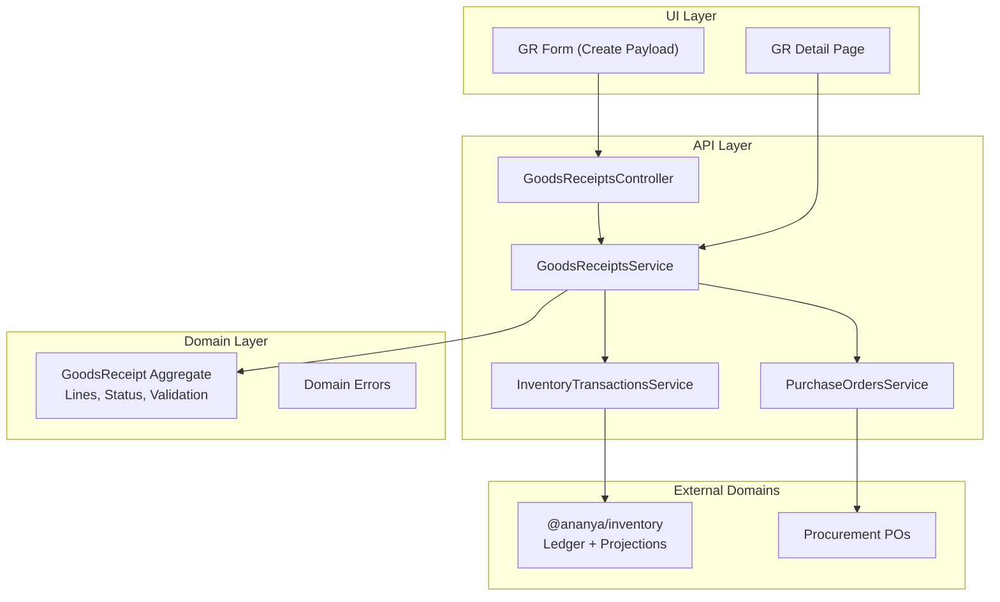

**Diagram sources**
- [Goods Receipts Controller:14-45](file://apps/api/src/goods-receipts/goods-receipts.controller.ts#L14-L45)
- [Goods Receipts Service:26-116](file://apps/api/src/goods-receipts/goods-receipts.service.ts#L26-L116)
- [Inventory Transactions Service:12-32](file://apps/api/src/inventory-transactions/inventory-transactions.service.ts#L12-L32)
- [Purchase Orders Service:22-36](file://apps/api/src/purchase-orders/purchase-orders.service.ts#L22-L36)
- [Goods Receipt Domain Model:7-35](file://packages/procurement/src/goods-receipts/goods-receipt.ts#L7-L35)
- [Goods Receipt Domain Errors:1-31](file://packages/procurement/src/goods-receipts/goods-receipt.errors.ts#L1-L31)
- [Web Goods Receipt Form:241-257](file://apps/web/components/goods-receipts/gr-form.tsx#L241-L257)
- [Web Goods Receipt Detail Page:277-291](file://apps/web/app/goods-receipts/[id]/page.tsx#L277-L291)

**Section sources**
- [RFC-0011: Goods Receipt:11-21](file://docs/rfcs/0011-goods-receipt.md#L11-L21)
- [Goods Receipts Controller:14-45](file://apps/api/src/goods-receipts/goods-receipts.controller.ts#L14-L45)
- [Goods Receipts Service:26-116](file://apps/api/src/goods-receipts/goods-receipts.service.ts#L26-L116)
- [Inventory Transactions Service:12-32](file://apps/api/src/inventory-transactions/inventory-transactions.service.ts#L12-L32)
- [Purchase Orders Service:22-36](file://apps/api/src/purchase-orders/purchase-orders.service.ts#L22-L36)
- [Goods Receipt Domain Model:7-35](file://packages/procurement/src/goods-receipts/goods-receipt.ts#L7-L35)
- [Goods Receipt Domain Errors:1-31](file://packages/procurement/src/goods-receipts/goods-receipt.errors.ts#L1-L31)
- [Web Goods Receipt Form:241-257](file://apps/web/components/goods-receipts/gr-form.tsx#L241-L257)
- [Web Goods Receipt Detail Page:277-291](file://apps/web/app/goods-receipts/[id]/page.tsx#L277-L291)

## Core Components
- Goods Receipt aggregate and lines: defines status, line items, and validation rules for receiving quantities, locations, batches, and serials.
- Goods Receipts service: orchestrates creation, line addition, posting, inventory ledger updates, and PO reconciliation.
- Inventory transactions service: creates immutable inventory ledger entries and enforces component usability constraints.
- Purchase orders service: provides PO lookup and supports PO line receipt updates via domain methods or direct field updates.
- DTOs: validate incoming payloads for creating receipts and adding lines.
- Web UI: composes create payloads and displays inventory integration status.

Key responsibilities:
- Validate that received quantities do not exceed outstanding PO quantities.
- Create inventory ledger transactions of type Receipt for each line.
- Update PO line quantities and PO status to PARTIALLY_RECEIVED or FULFILLED.
- Mark Goods Receipt as COMPLETED upon successful posting.
- Rebuild inventory projections after posting.

**Section sources**
- [Goods Receipt Domain Model:7-35](file://packages/procurement/src/goods-receipts/goods-receipt.ts#L7-L35)
- [Goods Receipt Domain Model:99-140](file://packages/procurement/src/goods-receipts/goods-receipt.ts#L99-L140)
- [Goods Receipt Domain Errors:10-31](file://packages/procurement/src/goods-receipts/goods-receipt.errors.ts#L10-L31)
- [Goods Receipts Service:42-116](file://apps/api/src/goods-receipts/goods-receipts.service.ts#L42-L116)
- [Goods Receipts Service:146-180](file://apps/api/src/goods-receipts/goods-receipts.service.ts#L146-L180)
- [Inventory Transactions Service:19-32](file://apps/api/src/inventory-transactions/inventory-transactions.service.ts#L19-L32)
- [Purchase Orders Service:94-100](file://apps/api/src/purchase-orders/purchase-orders.service.ts#L94-L100)
- [Goods Receipt DTOs:12-45](file://apps/api/src/goods-receipts/dtos.ts#L12-L45)
- [Goods Receipt DTOs:47-69](file://apps/api/src/goods-receipts/dtos.ts#L47-L69)
- [Web Goods Receipt Form:241-257](file://apps/web/components/goods-receipts/gr-form.tsx#L241-L257)

## Architecture Overview
The Goods Receipt workflow integrates Procurement and Inventory domains. On receipt creation or posting, the system validates against the PO, records immutable inventory transactions, updates PO fulfillment, and rebuilds projections.

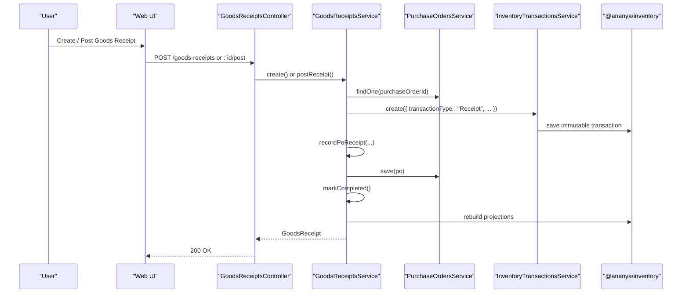

**Diagram sources**
- [Goods Receipts Controller:19-45](file://apps/api/src/goods-receipts/goods-receipts.controller.ts#L19-L45)
- [Goods Receipts Service:42-116](file://apps/api/src/goods-receipts/goods-receipts.service.ts#L42-L116)
- [Goods Receipts Service:146-180](file://apps/api/src/goods-receipts/goods-receipts.service.ts#L146-L180)
- [Inventory Transactions Service:19-32](file://apps/api/src/inventory-transactions/inventory-transactions.service.ts#L19-L32)
- [Purchase Orders Service:94-100](file://apps/api/src/purchase-orders/purchase-orders.service.ts#L94-L100)

## Detailed Component Analysis

### Goods Receipt Lifecycle and State Machine
- States: DRAFT, COMPLETED, CANCELLED.
- Transitions:
  - DRAFT → COMPLETED on successful posting.
  - DRAFT → CANCELLED is defined by the RFC; current service implementation focuses on completion.
- Posting triggers:
  - Creation of immutable inventory ledger transactions.
  - Update of PO line quantities and PO status.
  - Marking the Goods Receipt as COMPLETED.
  - Asynchronous rebuilding of inventory projections.

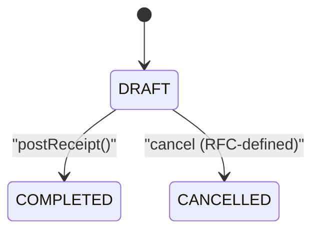

**Diagram sources**
- [RFC-0011: Goods Receipt:104-110](file://docs/rfcs/0011-goods-receipt.md#L104-L110)
- [Goods Receipt Domain Model:132-140](file://packages/procurement/src/goods-receipts/goods-receipt.ts#L132-L140)
- [Goods Receipts Service:146-180](file://apps/api/src/goods-receipts/goods-receipts.service.ts#L146-L180)

**Section sources**
- [RFC-0011: Goods Receipt:104-110](file://docs/rfcs/0011-goods-receipt.md#L104-L110)
- [Goods Receipt Domain Model:132-140](file://packages/procurement/src/goods-receipts/goods-receipt.ts#L132-L140)
- [Goods Receipts Service:146-180](file://apps/api/src/goods-receipts/goods-receipts.service.ts#L146-L180)

### Quantity Validation Against Purchase Orders
- Before creating a Goods Receipt with lines, the service checks each line’s quantityReceived against the remaining outstanding quantity on the corresponding PO line.
- If exceeded, an ExceededRemainingQuantityError is thrown.
- Upon successful creation or posting, PO line quantityReceived is incremented and PO status transitions to PARTIALLY_RECEIVED or FULFILLED.

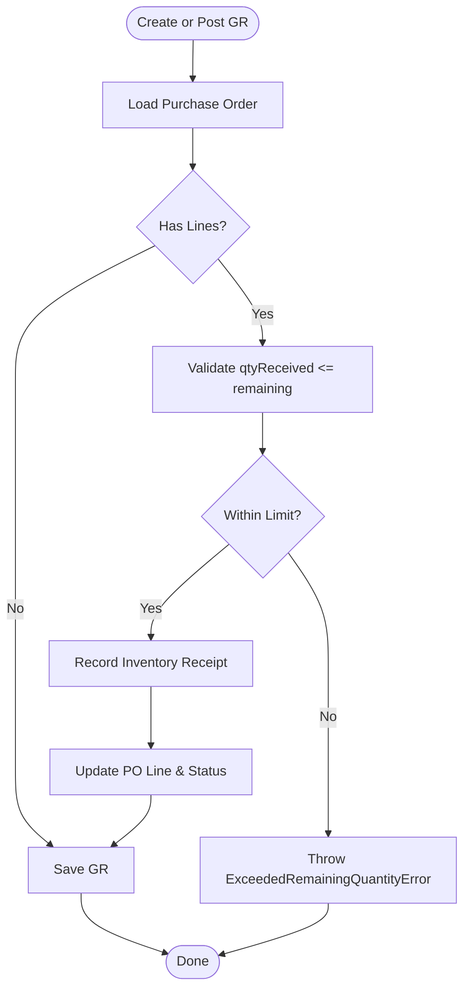

**Diagram sources**
- [Goods Receipts Service:42-60](file://apps/api/src/goods-receipts/goods-receipts.service.ts#L42-L60)
- [Goods Receipts Service:182-205](file://apps/api/src/goods-receipts/goods-receipts.service.ts#L182-L205)
- [Goods Receipt Domain Errors:24-31](file://packages/procurement/src/goods-receipts/goods-receipt.errors.ts#L24-L31)

**Section sources**
- [Goods Receipts Service:42-60](file://apps/api/src/goods-receipts/goods-receipts.service.ts#L42-L60)
- [Goods Receipts Service:182-205](file://apps/api/src/goods-receipts/goods-receipts.service.ts#L182-L205)
- [Goods Receipt Domain Errors:24-31](file://packages/procurement/src/goods-receipts/goods-receipt.errors.ts#L24-L31)

### Inventory Impact Calculations and Storage Location Assignments
- Each Goods Receipt line specifies a destinationLocationId (storage location).
- For each line, the service calls InventoryTransactionsService.create with transactionType Receipt, componentId, destinationLocationId, quantityReceived, unitOfMeasure pcs, reference grNumber, and reason referencing the PO.
- The inventory layer ensures the component is usable for new activity and persists an immutable ledger entry.
- After posting, inventory projections are rebuilt to reflect updated balances at the target locations.

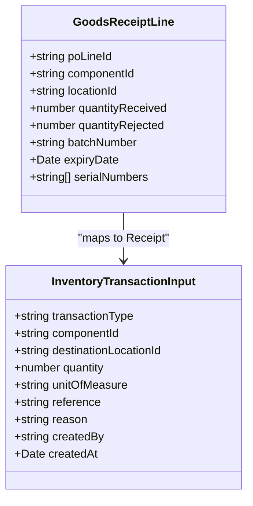

**Diagram sources**
- [Goods Receipt Domain Model:9-22](file://packages/procurement/src/goods-receipts/goods-receipt.ts#L9-L22)
- [Goods Receipts Service:88-104](file://apps/api/src/goods-receipts/goods-receipts.service.ts#L88-L104)
- [Inventory Transactions Service:19-32](file://apps/api/src/inventory-transactions/inventory-transactions.service.ts#L19-L32)

**Section sources**
- [Goods Receipts Service:88-104](file://apps/api/src/goods-receipts/goods-receipts.service.ts#L88-L104)
- [Inventory Transactions Service:19-32](file://apps/api/src/inventory-transactions/inventory-transactions.service.ts#L19-L32)
- [RFC-0005: Inventory Transaction Types:66-79](file://docs/rfcs/0005-transaction-types.md#L66-L79)

### Traceability Requirements: Batch and Serial Tracking
- Goods Receipt lines support batchNumber and serialNumbers fields.
- RFC domain invariants require batchNumber when batch tracking is enabled and serialNumbers count equals quantityReceived when serial tracking is required.
- These fields propagate into inventory ledger references and enable downstream traceability across manufacturing and returns.

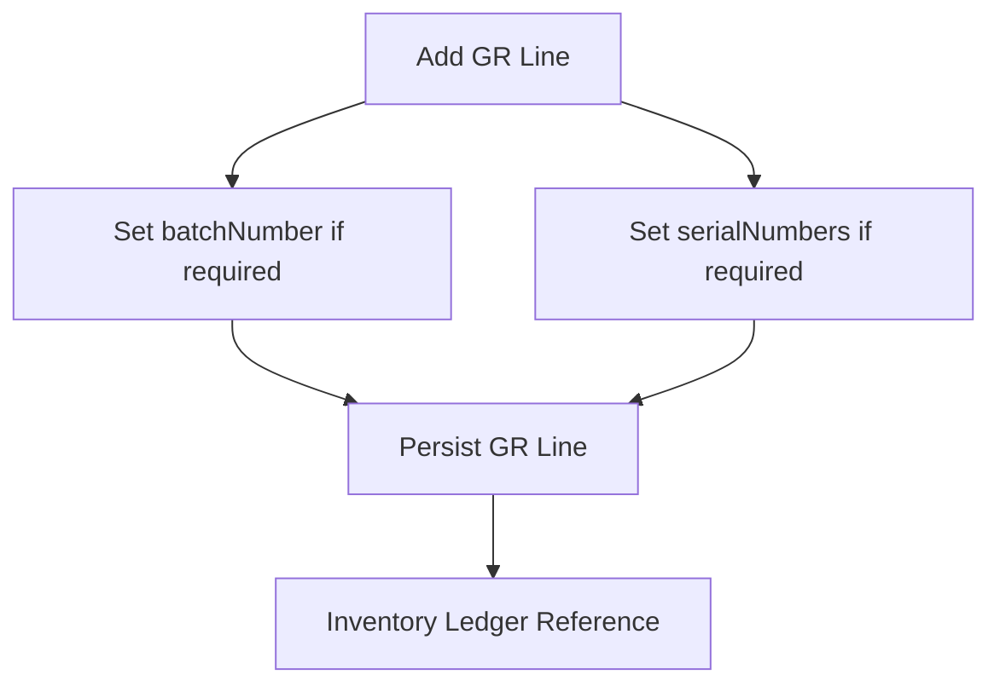

**Diagram sources**
- [Goods Receipt Domain Model:9-22](file://packages/procurement/src/goods-receipts/goods-receipt.ts#L9-L22)
- [RFC-0011: Goods Receipt:114-121](file://docs/rfcs/0011-goods-receipt.md#L114-L121)

**Section sources**
- [Goods Receipt Domain Model:9-22](file://packages/procurement/src/goods-receipts/goods-receipt.ts#L9-L22)
- [RFC-0011: Goods Receipt:114-121](file://docs/rfcs/0011-goods-receipt.md#L114-L121)

### Quality Inspection Workflows
- The RFC identifies quality inspection as a future extension, including quarantine location holds before releasing stock into available inventory.
- Current implementation posts receipts directly to inventory without a dedicated QA hold state.
- Recommended approach: introduce a temporary location or status flag to represent “Quarantine” and release to “Available” after QA approval.

[No sources needed since this section proposes conceptual enhancements beyond current code]

### Discrepancy Handling
- Over-receipts are rejected during creation with ExceededRemainingQuantityError.
- Partial deliveries are supported by incrementally updating PO line quantityReceived until all lines reach FULFILLED.
- Returned or rejected quantities can be tracked via quantityRejected on GR lines; further deduction flows are handled by Supplier Returns using ISSUE transactions.

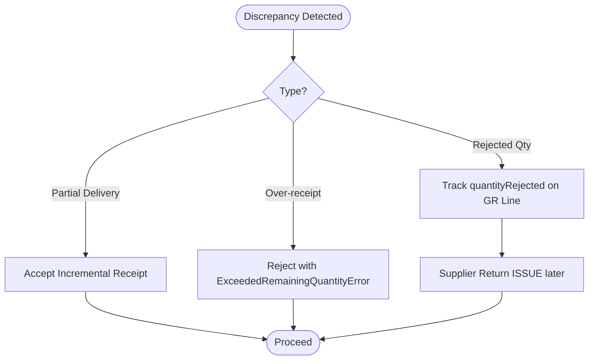

**Diagram sources**
- [Goods Receipts Service:42-60](file://apps/api/src/goods-receipts/goods-receipts.service.ts#L42-L60)
- [Goods Receipt Domain Model:99-130](file://packages/procurement/src/goods-receipts/goods-receipt.ts#L99-L130)
- [RFC-0012: Supplier Returns:91-94](file://docs/rfcs/0012-supplier-returns.md#L91-L94)

**Section sources**
- [Goods Receipts Service:42-60](file://apps/api/src/goods-receipts/goods-receipts.service.ts#L42-L60)
- [Goods Receipt Domain Model:99-130](file://packages/procurement/src/goods-receipts/goods-receipt.ts#L99-L130)
- [RFC-0012: Supplier Returns:91-94](file://docs/rfcs/0012-supplier-returns.md#L91-L94)

### Three-Way Matching Process
- Purchase Invoices perform automated 3-way matching across Purchase Order, Goods Receipt, and Vendor Invoice.
- Matching compares PO price vs invoice price and received quantity vs billed quantity.
- Match states include PENDING, MATCHED, VARIANCE_HOLD, APPROVED, PAID.
- Goods Receipts provide the received quantity baseline used by the matching engine.

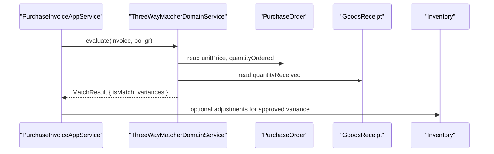

**Diagram sources**
- [RFC-0013: Purchase Invoices:13-21](file://docs/rfcs/0013-purchase-invoices.md#L13-L21)
- [RFC-0013: Purchase Invoices:98-101](file://docs/rfcs/0013-purchase-invoices.md#L98-L101)
- [RFC-0013: Purchase Invoices:104-110](file://docs/rfcs/0013-purchase-invoices.md#L104-L110)
- [RFC-0013: Purchase Invoices:189-199](file://docs/rfcs/0013-purchase-invoices.md#L189-L199)

**Section sources**
- [RFC-0013: Purchase Invoices:13-21](file://docs/rfcs/0013-purchase-invoices.md#L13-L21)
- [RFC-0013: Purchase Invoices:98-101](file://docs/rfcs/0013-purchase-invoices.md#L98-L101)
- [RFC-0013: Purchase Invoices:104-110](file://docs/rfcs/0013-purchase-invoices.md#L104-L110)
- [RFC-0013: Purchase Invoices:189-199](file://docs/rfcs/0013-purchase-invoices.md#L189-L199)

### Concrete Examples

#### Goods Receipt Creation
- The web form constructs a CreateGoodsReceiptPayload including purchaseOrderId, supplierId, packingSlipNumber, receivedAt, and lines with poLineId, componentId, locationId, and quantityReceived.
- The controller delegates to the service, which validates against PO outstanding quantities, creates the Goods Receipt, adds lines, records inventory receipts, updates PO status, marks the receipt completed, and rebuilds projections.

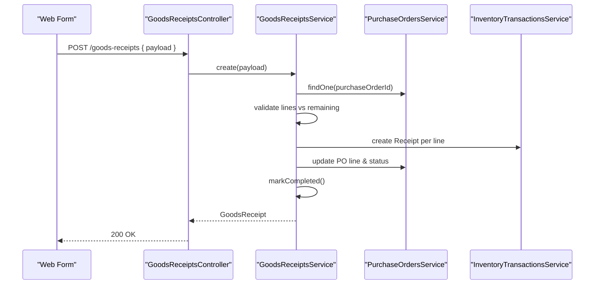

**Diagram sources**
- [Web Goods Receipt Form:241-257](file://apps/web/components/goods-receipts/gr-form.tsx#L241-L257)
- [Goods Receipts Controller:19-22](file://apps/api/src/goods-receipts/goods-receipts.controller.ts#L19-L22)
- [Goods Receipts Service:42-116](file://apps/api/src/goods-receipts/goods-receipts.service.ts#L42-L116)

**Section sources**
- [Web Goods Receipt Form:241-257](file://apps/web/components/goods-receipts/gr-form.tsx#L241-L257)
- [Goods Receipts Controller:19-22](file://apps/api/src/goods-receipts/goods-receipts.controller.ts#L19-L22)
- [Goods Receipts Service:42-116](file://apps/api/src/goods-receipts/goods-receipts.service.ts#L42-L116)

#### Partial Deliveries
- Multiple Goods Receipts can incrementally fulfill a PO.
- Each receipt updates PO line quantityReceived and sets PO status to PARTIALLY_RECEIVED until all lines reach FULFILLED.

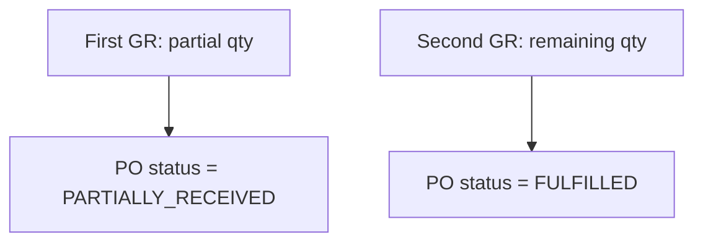

**Diagram sources**
- [Goods Receipts Service:182-205](file://apps/api/src/goods-receipts/goods-receipts.service.ts#L182-L205)

**Section sources**
- [Goods Receipts Service:182-205](file://apps/api/src/goods-receipts/goods-receipts.service.ts#L182-L205)

#### Return Processing
- Supplier Returns deduct stock via ISSUE transactions when dispatched.
- This complements Goods Receipt RECEIPT transactions to maintain accurate inventory balances.

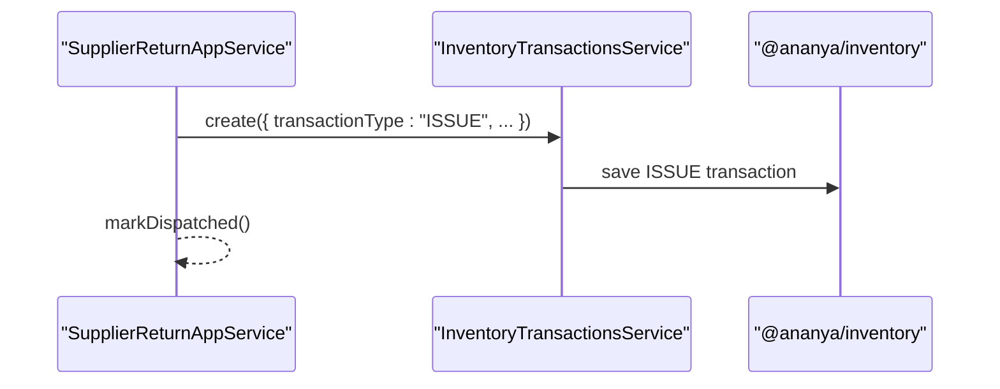

**Diagram sources**
- [RFC-0012: Supplier Returns:91-94](file://docs/rfcs/0012-supplier-returns.md#L91-L94)
- [RFC-0012: Supplier Returns:191-201](file://docs/rfcs/0012-supplier-returns.md#L191-L201)

**Section sources**
- [RFC-0012: Supplier Returns:91-94](file://docs/rfcs/0012-supplier-returns.md#L91-L94)
- [RFC-0012: Supplier Returns:191-201](file://docs/rfcs/0012-supplier-returns.md#L191-L201)

## Dependency Analysis
The Goods Receipt module depends on:
- Procurement domain for Goods Receipt aggregate and Purchase Order data.
- Inventory domain for immutable ledger transactions and projection updates.
- Web UI for composing and displaying receipt workflows.

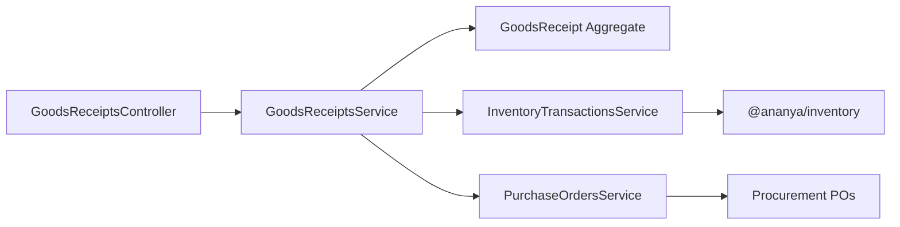

**Diagram sources**
- [Goods Receipts Controller:14-45](file://apps/api/src/goods-receipts/goods-receipts.controller.ts#L14-L45)
- [Goods Receipts Service:26-116](file://apps/api/src/goods-receipts/goods-receipts.service.ts#L26-L116)
- [Inventory Transactions Service:12-32](file://apps/api/src/inventory-transactions/inventory-transactions.service.ts#L12-L32)
- [Purchase Orders Service:22-36](file://apps/api/src/purchase-orders/purchase-orders.service.ts#L22-L36)

**Section sources**
- [Goods Receipts Controller:14-45](file://apps/api/src/goods-receipts/goods-receipts.controller.ts#L14-L45)
- [Goods Receipts Service:26-116](file://apps/api/src/goods-receipts/goods-receipts.service.ts#L26-L116)
- [Inventory Transactions Service:12-32](file://apps/api/src/inventory-transactions/inventory-transactions.service.ts#L12-L32)
- [Purchase Orders Service:22-36](file://apps/api/src/purchase-orders/purchase-orders.service.ts#L22-L36)

## Performance Considerations
- Immutable ledger writes are persisted through InventoryTransactionsService, ensuring consistency and auditability.
- Inventory projections are rebuilt asynchronously after posting to avoid blocking the main request path.
- Avoid over-receipts by validating against PO outstanding quantities early to prevent unnecessary ledger operations.

[No sources needed since this section provides general guidance]

## Troubleshooting Guide
Common issues and resolutions:
- Exceeded Remaining Quantity: Occurs when quantityReceived exceeds PO outstanding quantity. Resolve by reducing the receipt quantity or confirming additional PO amendments.
- Already Processed Receipt: Attempting to post a non-DRAFT receipt fails. Use existing receipt details or create a new one.
- Component Usability Guard: New inventory transactions are blocked for consolidated or retired components. Ensure the component is active and usable.

Operational checks:
- Verify PO exists and is active before creating receipts.
- Confirm destinationLocationId is valid and corresponds to a physical storage location.
- Inspect inventory ledger entries created by the receipt to ensure correct component, location, and quantity.

**Section sources**
- [Goods Receipts Service:42-60](file://apps/api/src/goods-receipts/goods-receipts.service.ts#L42-L60)
- [Goods Receipts Service:146-152](file://apps/api/src/goods-receipts/goods-receipts.service.ts#L146-L152)
- [Inventory Transactions Service:19-32](file://apps/api/src/inventory-transactions/inventory-transactions.service.ts#L19-L32)
- [Goods Receipt Domain Errors:24-31](file://packages/procurement/src/goods-receipts/goods-receipt.errors.ts#L24-L31)

## Conclusion
Goods Receipt Processing provides a robust, auditable pathway from vendor delivery to inventory availability. It enforces strict quantity validation against purchase orders, records immutable inventory transactions, updates procurement fulfillment, and supports traceability via batch and serial numbers. Future enhancements include quality inspection holds and mobile scanning. The three-way matching engine ties receipts to invoices for controlled payment authorization.

[No sources needed since this section summarizes without analyzing specific files]

## Appendices

### API Endpoints Summary
- POST /api/v1/goods-receipts: Create draft receipt and optionally post immediately if lines exist.
- GET /api/v1/goods-receipts: List receipts filtered by purchase order or supplier.
- GET /api/v1/goods-receipts/:id: Retrieve receipt details.
- POST /api/v1/goods-receipts/:id/lines: Add line item to a draft receipt.
- POST /api/v1/goods-receipts/:id/post: Post a draft receipt to finalize and integrate with inventory.

**Section sources**
- [RFC-0011: Goods Receipt:178-184](file://docs/rfcs/0011-goods-receipt.md#L178-L184)
- [Goods Receipts Controller:19-45](file://apps/api/src/goods-receipts/goods-receipts.controller.ts#L19-L45)