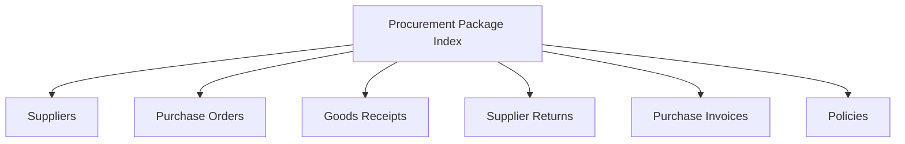
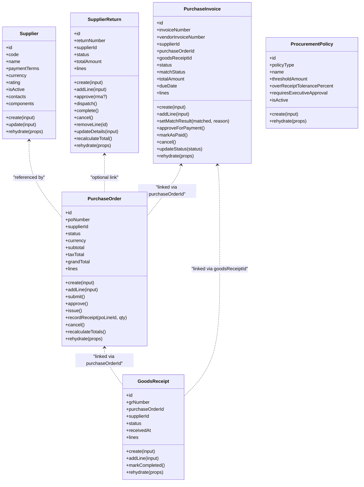
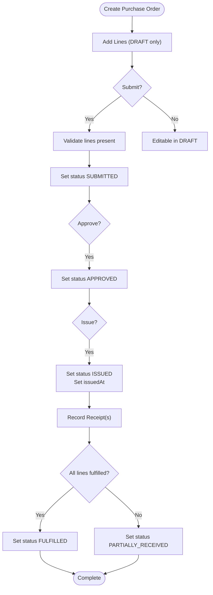
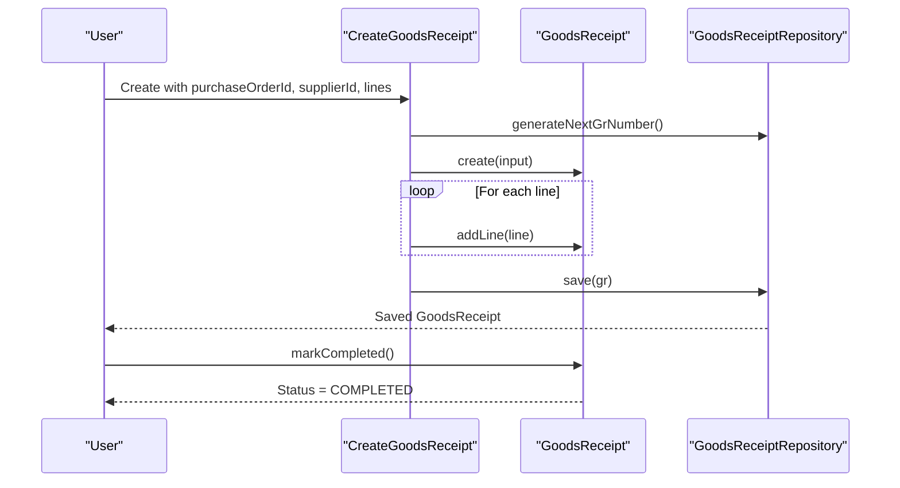
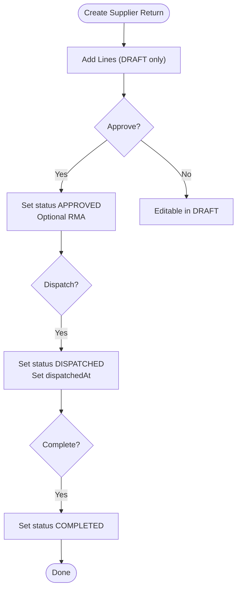
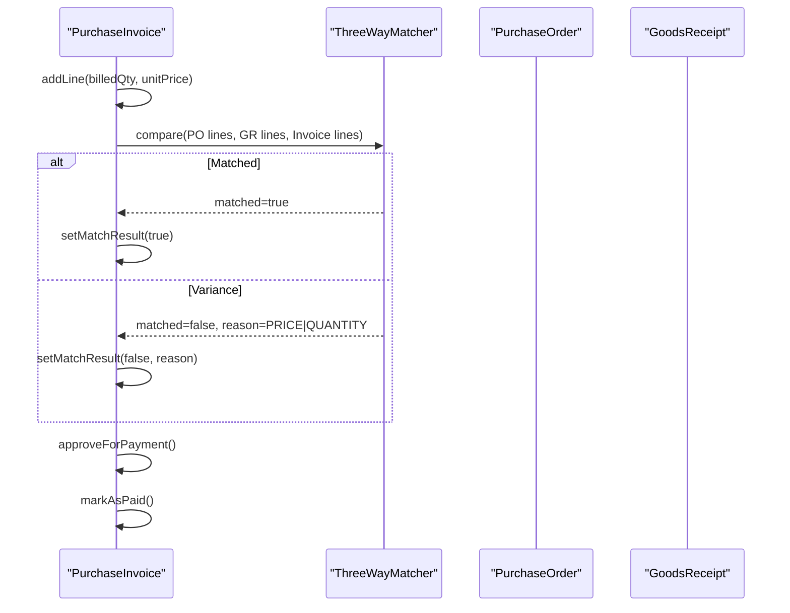
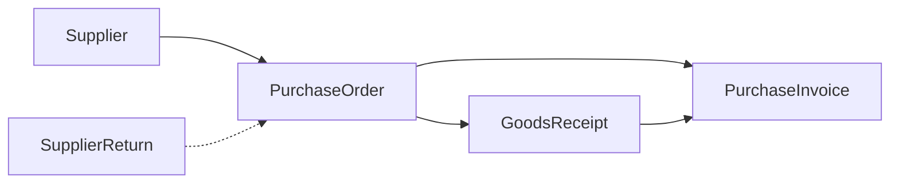

# Procurement Domain

<cite>
**Referenced Files in This Document**
- [index.ts](file://packages/procurement/src/index.ts)
- [purchase-order.ts](file://packages/procurement/src/purchase-orders/purchase-order.ts)
- [create-purchase-order.ts](file://packages/procurement/src/purchase-orders/create-purchase-order.ts)
- [goods-receipt.ts](file://packages/procurement/src/goods-receipts/goods-receipt.ts)
- [create-goods-receipt.ts](file://packages/procurement/src/goods-receipts/create-goods-receipt.ts)
- [supplier-return.ts](file://packages/procurement/src/supplier-returns/supplier-return.ts)
- [supplier.ts](file://packages/procurement/src/suppliers/supplier.ts)
- [create-supplier.ts](file://packages/procurement/src/suppliers/create-supplier.ts)
- [procurement-policy.ts](file://packages/procurement/src/policies/procurement-policy.ts)
- [purchase-invoice.ts](file://packages/procurement/src/purchase-invoices/purchase-invoice.ts)
</cite>

## Table of Contents
1. Introduction
2. Project Structure
3. Core Components
4. Architecture Overview
5. Detailed Component Analysis
6. Dependency Analysis
7. Performance Considerations
8. Troubleshooting Guide
9. Conclusion

## Introduction
This document explains the Procurement Domain package implementation, focusing on how procurement processes are modeled and executed. It covers supplier management, purchase order lifecycle, goods receipt processing, supplier returns, and integration points with inventory and finance domains through purchase invoices and three-way matching. The content includes aggregate definitions, states and transitions, business rules, and concrete examples derived from the codebase.

## Project Structure
The Procurement Domain is organized by functional subdomains: suppliers, purchase orders, goods receipts, supplier returns, purchase invoices, and policies. Each subdomain exposes domain aggregates (entities with behavior), creation/update use cases, and repository interfaces for persistence.

**Diagram sources**
- [index.ts:1-7](file://packages/procurement/src/index.ts#L1-L7)

**Section sources**
- [index.ts:1-7](file://packages/procurement/src/index.ts#L1-L7)

## Core Components
- Supplier: Master data for vendors, including contacts and component-specific pricing and terms.
- Purchase Order: Encapsulates ordering workflow from draft to fulfillment, with line-level quantities and totals.
- Goods Receipt: Captures inbound receiving, tracking received/rejected quantities, batch/expiry, and serial numbers.
- Supplier Return: Models outbound returns to suppliers with approval and dispatch flow.
- Purchase Invoice: Financial document linked to PO and GR, supporting three-way match and payment approvals.
- Procurement Policy: Configurable rules such as approval tiers and receiving tolerances.

Key behaviors include state transitions guarded by business rules, line item validation, and total recalculation.

**Section sources**
- [supplier.ts:65-163](file://packages/procurement/src/suppliers/supplier.ts#L65-L163)
- [purchase-order.ts:81-275](file://packages/procurement/src/purchase-orders/purchase-order.ts#L81-L275)
- [goods-receipt.ts:56-146](file://packages/procurement/src/goods-receipts/goods-receipt.ts#L56-L146)
- [supplier-return.ts:52-210](file://packages/procurement/src/supplier-returns/supplier-return.ts#L52-L210)
- [purchase-invoice.ts:51-163](file://packages/procurement/src/purchase-invoices/purchase-invoice.ts#L51-L163)
- [procurement-policy.ts:25-69](file://packages/procurement/src/policies/procurement-policy.ts#L25-L69)

## Architecture Overview
The domain follows a clean separation between aggregates (state and behavior), application use cases (creation commands), and repositories (persistence). Use cases orchestrate aggregate creation and persistence while enforcing cross-cutting rules like uniqueness or defaults.

**Diagram sources**
- [supplier.ts:65-163](file://packages/procurement/src/suppliers/supplier.ts#L65-L163)
- [purchase-order.ts:81-275](file://packages/procurement/src/purchase-orders/purchase-order.ts#L81-L275)
- [goods-receipt.ts:56-146](file://packages/procurement/src/goods-receipts/goods-receipt.ts#L56-L146)
- [supplier-return.ts:52-210](file://packages/procurement/src/supplier-returns/supplier-return.ts#L52-L210)
- [purchase-invoice.ts:51-163](file://packages/procurement/src/purchase-invoices/purchase-invoice.ts#L51-L163)
- [procurement-policy.ts:25-69](file://packages/procurement/src/policies/procurement-policy.ts#L25-L69)

## Detailed Component Analysis

### Supplier Management
- Purpose: Maintain vendor master data, default payment terms, currency, and performance rating.
- Key behaviors:
  - Creation validates required fields and normalizes codes/names; defaults applied for payment terms and currency.
  - Update enforces non-empty code/name and persists changes.
- Integration:
  - Referenced by purchase orders, goods receipts, and supplier returns.
  - Used by finance for payable invoices and payments.

Business rules:
- Supplier code must be unique at creation time (enforced by use case).
- Default payment terms and currency are applied if not provided.

Example usage:
- Create supplier with code normalization and uniqueness check before saving.

**Section sources**
- [supplier.ts:94-163](file://packages/procurement/src/suppliers/supplier.ts#L94-L163)
- [create-supplier.ts:5-22](file://packages/procurement/src/suppliers/create-supplier.ts#L5-L22)

### Purchase Order Lifecycle
- States: DRAFT → SUBMITTED → APPROVED → ISSUED → PARTIALLY_RECEIVED/FULFILLED → CANCELLED
- Key behaviors:
  - Add lines only in DRAFT; validate positive quantities; compute line totals including tax.
  - Submit requires at least one line; approve requires SUBMITTED; issue sets issued timestamp.
  - Record receipt updates per-line received quantity and transitions status to PARTIALLY_RECEIVED or FULFILLED.
  - Cancel disallowed from terminal states.
  - Totals recalculated whenever lines change.

Business rules:
- Line quantity must be strictly greater than zero.
- Cannot edit header or lines after certain states (e.g., cancel prevents edits).
- Status transitions enforced by methods.

Example usage:
- Create PO with optional lines, add lines, submit, approve, issue, record receipts, and finalize.

**Diagram sources**
- [purchase-order.ts:122-275](file://packages/procurement/src/purchase-orders/purchase-order.ts#L122-L275)

**Section sources**
- [purchase-order.ts:81-275](file://packages/procurement/src/purchase-orders/purchase-order.ts#L81-L275)
- [create-purchase-order.ts:12-45](file://packages/procurement/src/purchase-orders/create-purchase-order.ts#L12-L45)

### Goods Receipt Processing
- States: DRAFT → COMPLETED → CANCELLED
- Key behaviors:
  - Add lines only in DRAFT; validate positive received quantity.
  - Mark completed transitions to COMPLETED; used to trigger downstream inventory updates.
  - Tracks per-line received/rejected quantities, batch/expiry, serial numbers, and destination location.

Business rules:
- Cannot modify lines after completion.
- Received quantity must be greater than zero.

Integration:
- Links to purchase order via purchaseOrderId; used by purchase invoice three-way matching.

Example usage:
- Create GR with lines referencing PO lines, mark completed to post receipt.

**Diagram sources**
- [create-goods-receipt.ts:12-41](file://packages/procurement/src/goods-receipts/create-goods-receipt.ts#L12-L41)
- [goods-receipt.ts:81-146](file://packages/procurement/src/goods-receipts/goods-receipt.ts#L81-L146)

**Section sources**
- [goods-receipt.ts:56-146](file://packages/procurement/src/goods-receipts/goods-receipt.ts#L56-L146)
- [create-goods-receipt.ts:12-41](file://packages/procurement/src/goods-receipts/create-goods-receipt.ts#L12-L41)

### Supplier Returns
- States: DRAFT → APPROVED → DISPATCHED → COMPLETED → CANCELLED
- Key behaviors:
  - Add/remove lines only in DRAFT; update details allowed in DRAFT.
  - Approval can set RMA number; dispatch records dispatchedAt; completion finalizes return.
  - Total amount recalculated based on line unitPrice and quantityReturned.

Business rules:
- Cannot modify lines after leaving DRAFT.
- Cannot cancel once COMPLETED.

Integration:
- Optional link to purchase order; used for credit notes and supplier adjustments.

Example usage:
- Create return, add lines, approve with RMA, dispatch, complete.

**Diagram sources**
- [supplier-return.ts:79-210](file://packages/procurement/src/supplier-returns/supplier-return.ts#L79-L210)

**Section sources**
- [supplier-return.ts:52-210](file://packages/procurement/src/supplier-returns/supplier-return.ts#L52-L210)

### Purchase Invoices and Three-Way Matching
- States: DRAFT → MATCHED/VARIANCE_HOLD → APPROVED → PAID → CANCELLED
- Match statuses: PENDING → MATCHED | PRICE_VARIANCE | QUANTITY_VARIANCE → APPROVED
- Key behaviors:
  - Add lines with billed quantity and unit price; totals recalculated.
  - setMatchResult transitions to MATCHED or VARIANCE_HOLD based on variance reason.
  - approveForPayment and markAsPaid progress financial workflow.

Integration:
- Linked to purchase order and goods receipt for three-way matching against PO price/quantity and GR received quantity.

Example usage:
- Create invoice, add lines, run three-way match, handle variances, approve for payment, mark paid.

**Diagram sources**
- [purchase-invoice.ts:82-163](file://packages/procurement/src/purchase-invoices/purchase-invoice.ts#L82-L163)

**Section sources**
- [purchase-invoice.ts:51-163](file://packages/procurement/src/purchase-invoices/purchase-invoice.ts#L51-L163)

### Procurement Policies
- Types: APPROVAL_TIER, RECEIVING_TOLERANCE
- Purpose: Configure thresholds for approvals and over-receipt tolerances; supports executive approval flags.
- Usage: Applied by services to determine approval routing and tolerance checks during receiving/invoicing.

**Section sources**
- [procurement-policy.ts:25-69](file://packages/procurement/src/policies/procurement-policy.ts#L25-L69)

## Dependency Analysis
- Aggregates encapsulate their own state transitions and validations.
- Use cases coordinate creation flows and persist via repositories.
- Cross-domain links:
  - Purchase Order references Supplier.
  - Goods Receipt references Purchase Order.
  - Purchase Invoice references both Purchase Order and Goods Receipt.
  - Supplier Return optionally references Purchase Order.

**Diagram sources**
- [purchase-order.ts:31-50](file://packages/procurement/src/purchase-orders/purchase-order.ts#L31-L50)
- [goods-receipt.ts:24-35](file://packages/procurement/src/goods-receipts/goods-receipt.ts#L24-L35)
- [purchase-invoice.ts:20-34](file://packages/procurement/src/purchase-invoices/purchase-invoice.ts#L20-L34)
- [supplier-return.ts:21-33](file://packages/procurement/src/supplier-returns/supplier-return.ts#L21-L33)

**Section sources**
- [purchase-order.ts:31-50](file://packages/procurement/src/purchase-orders/purchase-order.ts#L31-L50)
- [goods-receipt.ts:24-35](file://packages/procurement/src/goods-receipts/goods-receipt.ts#L24-L35)
- [purchase-invoice.ts:20-34](file://packages/procurement/src/purchase-invoices/purchase-invoice.ts#L20-L34)
- [supplier-return.ts:21-33](file://packages/procurement/src/supplier-returns/supplier-return.ts#L21-L33)

## Performance Considerations
- Aggregate operations are lightweight and operate in-memory; ensure repository calls are efficient and batched where possible.
- Recalculating totals is O(n) over lines; acceptable for typical PO sizes but consider caching totals when lines are large.
- Avoid repeated queries for policy lookups; cache active policies per tenant/context.

[No sources needed since this section provides general guidance]

## Troubleshooting Guide
Common issues and resolutions:
- Invalid state transitions: Ensure method calls follow allowed transitions (e.g., cannot edit lines after submission).
- Empty purchase order submission: Must have at least one line before submitting.
- Negative or zero quantities: Validate line quantities for PO and GR lines.
- Duplicate supplier code: Creation fails if code already exists; enforce uniqueness at service layer.
- Three-way match variances: Handle PRICE_VARIANCE or QUANTITY_VARIANCE by adjusting invoice or investigating discrepancies.

**Section sources**
- [purchase-order.ts:184-226](file://packages/procurement/src/purchase-orders/purchase-order.ts#L184-L226)
- [goods-receipt.ts:99-110](file://packages/procurement/src/goods-receipts/goods-receipt.ts#L99-L110)
- [create-supplier.ts:8-19](file://packages/procurement/src/suppliers/create-supplier.ts#L8-L19)
- [purchase-invoice.ts:126-142](file://packages/procurement/src/purchase-invoices/purchase-invoice.ts#L126-L142)

## Conclusion
The Procurement Domain models end-to-end procurement workflows using well-defined aggregates with explicit state machines and validation rules. Suppliers, purchase orders, goods receipts, supplier returns, and purchase invoices form a cohesive system that integrates with inventory and finance through clear linkage and three-way matching. Policies provide configurable governance for approvals and receiving tolerances. The design promotes maintainability, testability, and extensibility for future enhancements such as advanced analytics and automation.