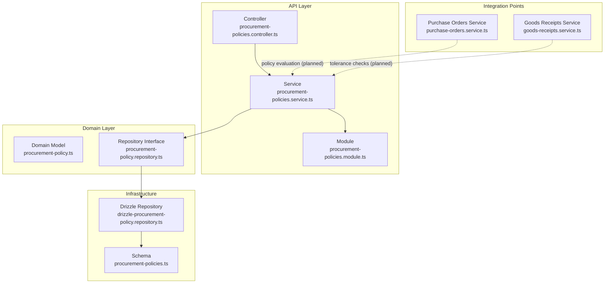
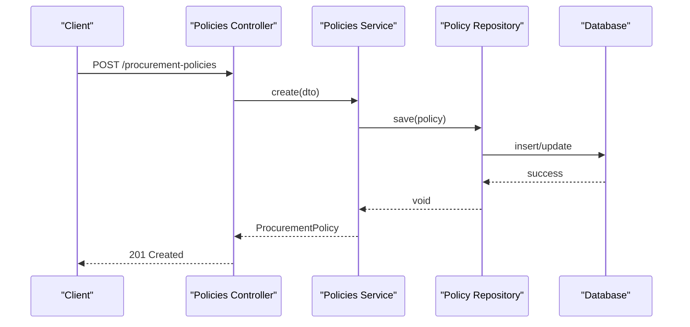
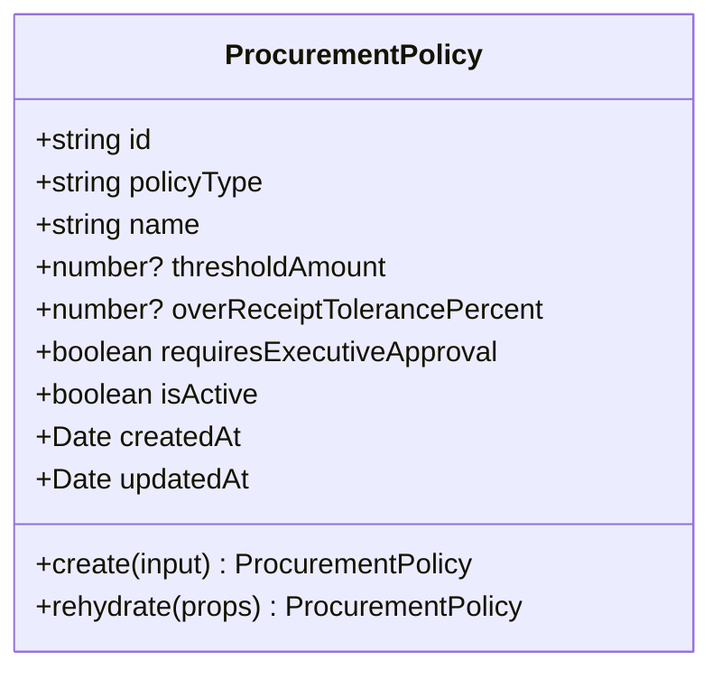
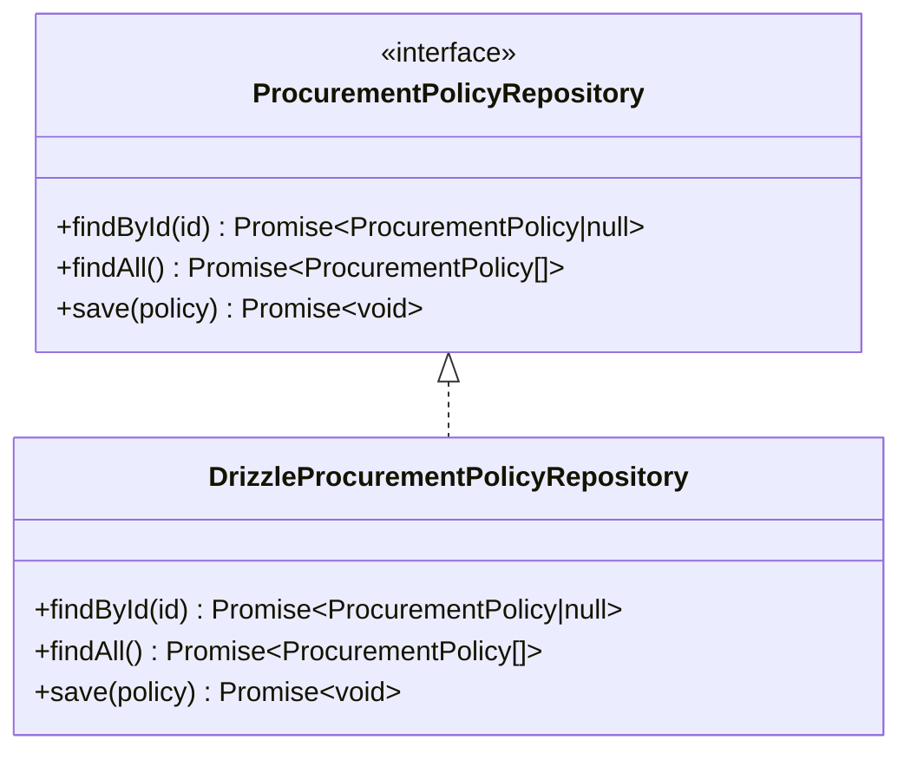
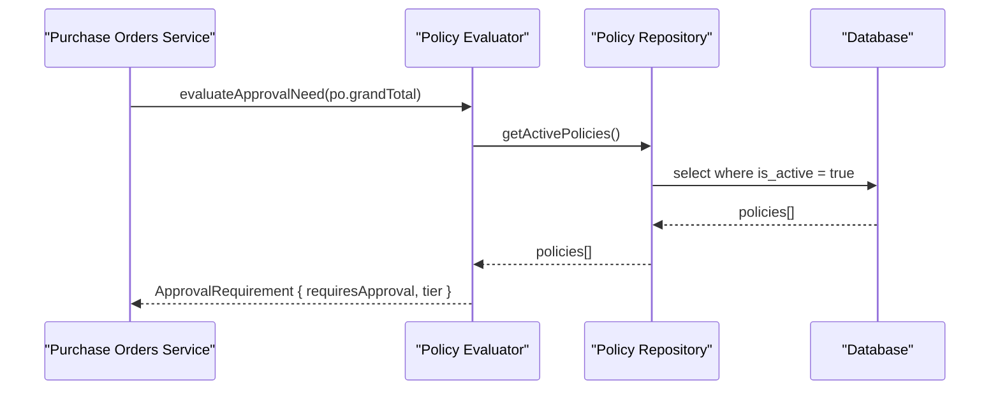
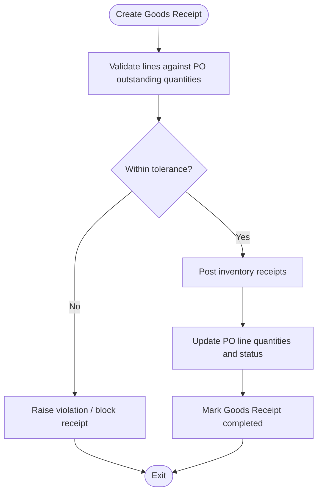
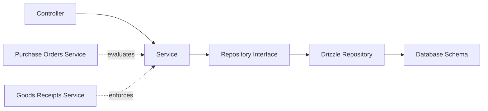

# Procurement Policies

<cite>
**Referenced Files in This Document**
- [RFC-0014: Procurement Policies](file://docs/rfcs/0014-procurement-policies.md)
- [Procurement Policy Domain Model](file://packages/procurement/src/policies/procurement-policy.ts)
- [Procurement Policy Repository Interface](file://packages/procurement/src/policies/procurement-policy.repository.ts)
- [Drizzle Procurement Policy Repository](file://apps/api/src/infrastructure/repositories/drizzle-procurement-policy.repository.ts)
- [Database Schema Definition](file://packages/database/src/schema/procurement-policies.ts)
- [Procurement Policies Controller](file://apps/api/src/procurement-policies/procurement-policies.controller.ts)
- [Procurement Policies Service](file://apps/api/src/procurement-policies/procurement-policies.service.ts)
- [Procurement Policies Module](file://apps/api/src/procurement-policies/procurement-policies.module.ts)
- [Purchase Orders Service](file://apps/api/src/purchase-orders/purchase-orders.service.ts)
- [Goods Receipts Service](file://apps/api/src/goods-receipts/goods-receipts.service.ts)
</cite>

## Table of Contents
1. [Introduction](#introduction)
2. [Project Structure](#project-structure)
3. [Core Components](#core-components)
4. [Architecture Overview](#architecture-overview)
5. [Detailed Component Analysis](#detailed-component-analysis)
6. [Dependency Analysis](#dependency-analysis)
7. [Performance Considerations](#performance-considerations)
8. [Troubleshooting Guide](#troubleshooting-guide)
9. [Conclusion](#conclusion)
10. [Appendices](#appendices)

## Introduction
This document explains the Procurement Policies system that governs approval thresholds and receiving tolerances across the procurement workflow. It covers policy definition, rule configuration, enforcement mechanisms during purchase order processing and goods receipt creation, and the integration points with the broader ERP modules. The goal is to make the system understandable for both technical and non-technical readers while providing precise references to implementation files.

## Project Structure
The Procurement Policies feature spans domain models, API controllers/services, repository implementations, and database schema definitions. It integrates with Purchase Orders and Goods Receipts to enforce business rules at key workflow steps.

**Diagram sources**
- [Procurement Policies Controller:1-24](file://apps/api/src/procurement-policies/procurement-policies.controller.ts#L1-L24)
- [Procurement Policies Service:1-37](file://apps/api/src/procurement-policies/procurement-policies.service.ts#L1-L37)
- [Procurement Policies Module:1-20](file://apps/api/src/procurement-policies/procurement-policies.module.ts#L1-L20)
- [Procurement Policy Domain Model:1-69](file://packages/procurement/src/policies/procurement-policy.ts#L1-L69)
- [Procurement Policy Repository Interface:1-7](file://packages/procurement/src/policies/procurement-policy.repository.ts#L1-L7)
- [Drizzle Procurement Policy Repository:1-71](file://apps/api/src/infrastructure/repositories/drizzle-procurement-policy.repository.ts#L1-L71)
- [Database Schema Definition:1-44](file://packages/database/src/schema/procurement-policies.ts#L1-L44)
- [Purchase Orders Service:1-145](file://apps/api/src/purchase-orders/purchase-orders.service.ts#L1-L145)
- [Goods Receipts Service:1-207](file://apps/api/src/goods-receipts/goods-receipts.service.ts#L1-L207)

**Section sources**
- [RFC-0014: Procurement Policies:1-170](file://docs/rfcs/0014-procurement-policies.md#L1-L170)
- [Procurement Policy Domain Model:1-69](file://packages/procurement/src/policies/procurement-policy.ts#L1-L69)
- [Database Schema Definition:1-44](file://packages/database/src/schema/procurement-policies.ts#L1-L44)

## Core Components
- Policy types: Approval Tier and Receiving Tolerance define governance rules for approvals and receiving limits.
- Domain model: Encapsulates policy properties such as name, threshold amount, tolerance percentage, executive approval flag, and active state.
- Repository abstraction: Defines how policies are persisted and retrieved; implemented via Drizzle ORM.
- API endpoints: Create, list, and fetch individual policies.
- Integration points: Planned evaluation hooks during Purchase Order submission and Goods Receipt creation.

Key responsibilities:
- Define and persist policy configurations.
- Provide a clean interface for other services to evaluate policies.
- Ensure data integrity through validation and consistent storage.

**Section sources**
- [RFC-0014: Procurement Policies:11-104](file://docs/rfcs/0014-procurement-policies.md#L11-L104)
- [Procurement Policy Domain Model:1-69](file://packages/procurement/src/policies/procurement-policy.ts#L1-L69)
- [Procurement Policy Repository Interface:1-7](file://packages/procurement/src/policies/procurement-policy.repository.ts#L1-L7)
- [Procurement Policies Controller:1-24](file://apps/api/src/procurement-policies/procurement-policies.controller.ts#L1-L24)
- [Procurement Policies Service:1-37](file://apps/api/src/procurement-policies/procurement-policies.service.ts#L1-L37)

## Architecture Overview
The architecture follows layered design:
- API layer exposes REST endpoints for policy management.
- Application service orchestrates policy creation and retrieval using the repository.
- Domain model encapsulates policy logic and invariants.
- Infrastructure layer persists policies using Drizzle ORM against the PostgreSQL schema.
- Integration points are designed to be invoked by Purchase Orders and Goods Receipts services to enforce rules.

**Diagram sources**
- [Procurement Policies Controller:1-24](file://apps/api/src/procurement-policies/procurement-policies.controller.ts#L1-L24)
- [Procurement Policies Service:1-37](file://apps/api/src/procurement-policies/procurement-policies.service.ts#L1-L37)
- [Drizzle Procurement Policy Repository:1-71](file://apps/api/src/infrastructure/repositories/drizzle-procurement-policy.repository.ts#L1-L71)
- [Database Schema Definition:1-44](file://packages/database/src/schema/procurement-policies.ts#L1-L44)

## Detailed Component Analysis

### Policy Types and Rules
- Approval Tier: Monetary thresholds determine whether a Purchase Order requires managerial or executive approval.
- Receiving Tolerance: Percentages define acceptable over-receipt and under-receipt limits per component category or line item.

These rules are stored as policies and can be evaluated during workflow steps.

**Section sources**
- [RFC-0014: Procurement Policies:17-28](file://docs/rfcs/0014-procurement-policies.md#L17-L28)
- [RFC-0014: Procurement Policies:100-104](file://docs/rfcs/0014-procurement-policies.md#L100-L104)

### Domain Model
The domain model defines the policy aggregate with fields for type, name, monetary threshold, tolerance percentage, executive approval requirement, active status, and timestamps. Creation sets defaults and ensures consistent initialization.

**Diagram sources**
- [Procurement Policy Domain Model:1-69](file://packages/procurement/src/policies/procurement-policy.ts#L1-L69)

**Section sources**
- [Procurement Policy Domain Model:1-69](file://packages/procurement/src/policies/procurement-policy.ts#L1-L69)

### Repository Abstraction and Implementation
The repository interface defines operations to find by ID, list all, and save policies. The Drizzle implementation maps database rows to domain objects and handles upsert semantics.

**Diagram sources**
- [Procurement Policy Repository Interface:1-7](file://packages/procurement/src/policies/procurement-policy.repository.ts#L1-L7)
- [Drizzle Procurement Policy Repository:1-71](file://apps/api/src/infrastructure/repositories/drizzle-procurement-policy.repository.ts#L1-L71)

**Section sources**
- [Procurement Policy Repository Interface:1-7](file://packages/procurement/src/policies/procurement-policy.repository.ts#L1-L7)
- [Drizzle Procurement Policy Repository:1-71](file://apps/api/src/infrastructure/repositories/drizzle-procurement-policy.repository.ts#L1-L71)

### API Endpoints and Validation
- POST /procurement-policies: Creates a new policy from validated DTO input.
- GET /procurement-policies: Lists all policies.
- GET /procurement-policies/:id: Retrieves a single policy by ID.

Validation ensures required fields and correct types before persistence.

**Section sources**
- [Procurement Policies Controller:1-24](file://apps/api/src/procurement-policies/procurement-policies.controller.ts#L1-L24)
- [Procurement Policies Service:1-37](file://apps/api/src/procurement-policies/procurement-policies.service.ts#L1-L37)

### Database Schema and Indexes
The schema defines columns for policy type, name, monetary threshold, tolerance percentage, executive approval flag, active status, and timestamps. Indexes optimize queries by policy type and active status.

**Section sources**
- [Database Schema Definition:1-44](file://packages/database/src/schema/procurement-policies.ts#L1-L44)
- [RFC-0014: Procurement Policies:125-139](file://docs/rfcs/0014-procurement-policies.md#L125-L139)

### Integration with Purchase Orders
During Purchase Order submission, the system should evaluate active approval tier policies to determine if managerial or executive approval is required. The RFC outlines a sequence where the PO service calls a policy evaluator which retrieves active policies and returns an approval requirement.

**Diagram sources**
- [RFC-0014: Procurement Policies:157-163](file://docs/rfcs/0014-procurement-policies.md#L157-L163)
- [Purchase Orders Service:117-122](file://apps/api/src/purchase-orders/purchase-orders.service.ts#L117-L122)

**Section sources**
- [RFC-0014: Procurement Policies:107-110](file://docs/rfcs/0014-procurement-policies.md#L107-L110)
- [RFC-0014: Procurement Policies:157-163](file://docs/rfcs/0014-procurement-policies.md#L157-L163)
- [Purchase Orders Service:117-122](file://apps/api/src/purchase-orders/purchase-orders.service.ts#L117-L122)

### Integration with Goods Receipts
During Goods Receipt creation or posting, the system should enforce receiving tolerance policies to validate quantities received against ordered amounts and allowed tolerances.

**Diagram sources**
- [Goods Receipts Service:42-116](file://apps/api/src/goods-receipts/goods-receipts.service.ts#L42-L116)
- [RFC-0014: Procurement Policies:17-28](file://docs/rfcs/0014-procurement-policies.md#L17-L28)

**Section sources**
- [Goods Receipts Service:42-116](file://apps/api/src/goods-receipts/goods-receipts.service.ts#L42-L116)
- [RFC-0014: Procurement Policies:17-28](file://docs/rfcs/0014-procurement-policies.md#L17-L28)

### Rule Evaluation Order and Enforcement
- Evaluation order: Retrieve active policies first, then apply thresholds and tolerances based on context (PO total vs line-level details).
- Enforcement: Return structured results indicating required actions (e.g., approval routing or tolerance violations).
- Exception handling: Use domain errors and HTTP exceptions to communicate violations clearly.

**Section sources**
- [RFC-0014: Procurement Policies:107-110](file://docs/rfcs/0014-procurement-policies.md#L107-L110)
- [Goods Receipts Service:42-60](file://apps/api/src/goods-receipts/goods-receipts.service.ts#L42-L60)

### Policy Versioning, Audit Logging, and Regulatory Compliance
- Versioning: Current schema does not include explicit version fields; policies are updated in place with timestamps. Future enhancements may add versioning for auditability.
- Audit logging: Timestamps capture creation and updates; additional audit trails can be added via activity logs or external auditing systems.
- Regulatory compliance: Policies support executive approval flags and thresholds to meet internal controls and regulatory requirements.

**Section sources**
- [Database Schema Definition:29-34](file://packages/database/src/schema/procurement-policies.ts#L29-L34)
- [RFC-0014: Procurement Policies:125-139](file://docs/rfcs/0014-procurement-policies.md#L125-L139)

## Dependency Analysis
The Procurement Policies module depends on domain abstractions and infrastructure for persistence. Integration points are designed to be consumed by Purchase Orders and Goods Receipts services.

**Diagram sources**
- [Procurement Policies Controller:1-24](file://apps/api/src/procurement-policies/procurement-policies.controller.ts#L1-L24)
- [Procurement Policies Service:1-37](file://apps/api/src/procurement-policies/procurement-policies.service.ts#L1-L37)
- [Procurement Policy Repository Interface:1-7](file://packages/procurement/src/policies/procurement-policy.repository.ts#L1-L7)
- [Drizzle Procurement Policy Repository:1-71](file://apps/api/src/infrastructure/repositories/drizzle-procurement-policy.repository.ts#L1-L71)
- [Database Schema Definition:1-44](file://packages/database/src/schema/procurement-policies.ts#L1-L44)
- [Purchase Orders Service:1-145](file://apps/api/src/purchase-orders/purchase-orders.service.ts#L1-L145)
- [Goods Receipts Service:1-207](file://apps/api/src/goods-receipts/goods-receipts.service.ts#L1-L207)

**Section sources**
- [Procurement Policies Module:1-20](file://apps/api/src/procurement-policies/procurement-policies.module.ts#L1-L20)
- [Procurement Policy Repository Interface:1-7](file://packages/procurement/src/policies/procurement-policy.repository.ts#L1-L7)
- [Drizzle Procurement Policy Repository:1-71](file://apps/api/src/infrastructure/repositories/drizzle-procurement-policy.repository.ts#L1-L71)

## Performance Considerations
- Index usage: Queries benefit from indexes on policy_type and is_active for efficient filtering of active policies.
- Minimal payload: DTOs keep request payloads small and focused on necessary fields.
- Asynchronous projections: Goods Receipt processing rebuilds inventory projections asynchronously to avoid blocking.

[No sources needed since this section provides general guidance]

## Troubleshooting Guide
Common issues and resolutions:
- Not found errors: When fetching a policy by ID, ensure the ID exists; otherwise, a not found exception is raised.
- Validation errors: Ensure DTO fields match expected types and constraints before creating policies.
- Tolerance violations: During Goods Receipt creation, exceeding remaining quantities or tolerance limits will raise domain-specific errors; adjust receipt quantities accordingly.

**Section sources**
- [Procurement Policies Service:27-35](file://apps/api/src/procurement-policies/procurement-policies.service.ts#L27-L35)
- [Goods Receipts Service:42-60](file://apps/api/src/goods-receipts/goods-receipts.service.ts#L42-L60)

## Conclusion
The Procurement Policies system provides a robust foundation for enforcing approval thresholds and receiving tolerances within the procurement workflow. With clear domain modeling, repository abstraction, and API endpoints, it integrates seamlessly with Purchase Orders and Goods Receipts. Future enhancements can introduce advanced features like category-specific tolerances, versioning, and comprehensive audit logging to strengthen compliance and operational visibility.

[No sources needed since this section summarizes without analyzing specific files]

## Appendices

### Example: Creating an Approval Tier Policy
- Configure a policy with type APPROVAL_TIER, set a monetary threshold, and mark executive approval if needed.
- Persist via the API endpoint and verify retrieval.

**Section sources**
- [Procurement Policies Controller:9-12](file://apps/api/src/procurement-policies/procurement-policies.controller.ts#L9-L12)
- [Procurement Policies Service:17-21](file://apps/api/src/procurement-policies/procurement-policies.service.ts#L17-L21)
- [RFC-0014: Procurement Policies:143-147](file://docs/rfcs/0014-procurement-policies.md#L143-L147)

### Example: Evaluating a Purchase Order Against Policies
- Submit a Purchase Order and invoke policy evaluation to determine approval routing based on active policies.

**Section sources**
- [RFC-0014: Procurement Policies:157-163](file://docs/rfcs/0014-procurement-policies.md#L157-L163)
- [Purchase Orders Service:117-122](file://apps/api/src/purchase-orders/purchase-orders.service.ts#L117-L122)

### Example: Enforcing Receiving Tolerances
- Create a Goods Receipt and validate quantities against tolerance policies; handle violations appropriately.

**Section sources**
- [Goods Receipts Service:42-60](file://apps/api/src/goods-receipts/goods-receipts.service.ts#L42-L60)
- [RFC-0014: Procurement Policies:17-28](file://docs/rfcs/0014-procurement-policies.md#L17-L28)