# Purchase Order Workflow

<cite>
**Referenced Files in This Document**
- [0010-purchase-orders.md](file://docs/rfcs/0010-purchase-orders.md)
- [0014-procurement-policies.md](file://docs/rfcs/0014-procurement-policies.md)
- [0015-procurement-reporting.md](file://docs/rfcs/0015-procurement-reporting.md)
- [purchase-orders.controller.ts](file://apps/api/src/purchase-orders/purchase-orders.controller.ts)
- [purchase-orders.service.ts](file://apps/api/src/purchase-orders/purchase-orders.service.ts)
- [dtos.ts](file://apps/api/src/purchase-orders/dtos.ts)
- [create-purchase-order.ts](file://packages/procurement/src/purchase-orders/create-purchase-order.ts)
- [delete-purchase-order.ts](file://packages/procurement/src/purchase-orders/delete-purchase-order.ts)
- [purchase-order.errors.ts](file://packages/procurement/src/purchase-orders/purchase-order.errors.ts)
- [purchase-order.repository.ts](file://packages/procurement/src/purchase-orders/purchase-order.repository.ts)
- [goods-receipts.service.ts](file://apps/api/src/goods-receipts/goods-receipts.service.ts)
- [suppliers.service.ts](file://apps/api/src/suppliers/suppliers.service.ts)
- [component-lifecycle.guard.ts](file://apps/api/src/components/component-lifecycle.guard.ts)
- [currency-resolver.ts](file://apps/api/src/common/utils/currency-resolver.ts)
</cite>

## Table of Contents
1. [Introduction](#introduction)
2. [Project Structure](#project-structure)
3. [Core Components](#core-components)
4. [Architecture Overview](#architecture-overview)
5. [Detailed Component Analysis](#detailed-component-analysis)
6. [Dependency Analysis](#dependency-analysis)
7. [Performance Considerations](#performance-considerations)
8. [Troubleshooting Guide](#troubleshooting-guide)
9. [Conclusion](#conclusion)

## Introduction
This document explains the end-to-end Purchase Order workflow in Ananya ERP, covering creation, modification, approval, issuance, receiving, and fulfillment. It details state transitions, validation rules, pricing and currency handling, line item management, integration with suppliers, inventory, and finance domains, procurement policies for budget controls, and audit considerations for compliance.

The design follows a Domain-Driven approach:
- The Procurement package defines domain aggregates, repositories, and use cases.
- The API layer exposes REST endpoints that orchestrate domain operations.
- Cross-cutting concerns such as currency resolution, supplier data access, and component lifecycle guards are integrated at the application service level.

## Project Structure
The Purchase Order feature spans two main layers:
- API Layer (NestJS): Controllers expose HTTP endpoints; services coordinate domain use cases and cross-domain integrations.
- Procurement Package (Domain): Defines aggregate roots, entities, value objects, repository contracts, and domain errors.

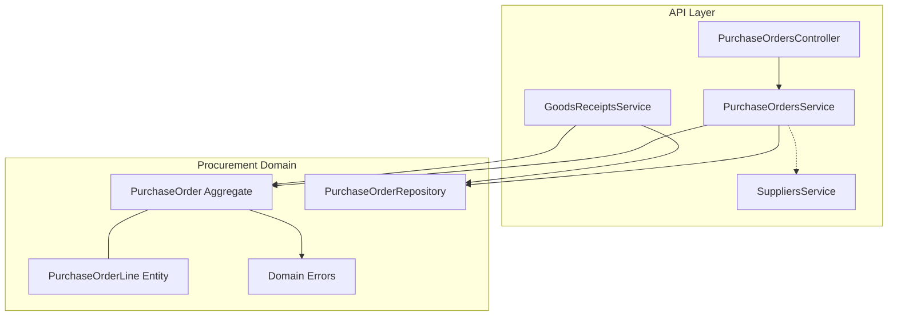

**Diagram sources**
- [purchase-orders.controller.ts:23-82](file://apps/api/src/purchase-orders/purchase-orders.controller.ts#L23-L82)
- [purchase-orders.service.ts:22-144](file://apps/api/src/purchase-orders/purchase-orders.service.ts#L22-L144)
- [goods-receipts.service.ts:26-116](file://apps/api/src/goods-receipts/goods-receipts.service.ts#L26-L116)
- [purchase-order.repository.ts:9-16](file://packages/procurement/src/purchase-orders/purchase-order.repository.ts#L9-L16)
- [purchase-order.errors.ts:1-43](file://packages/procurement/src/purchase-orders/purchase-order.errors.ts#L1-L43)

**Section sources**
- [0010-purchase-orders.md:11-23](file://docs/rfcs/0010-purchase-orders.md#L11-L23)
- [purchase-orders.controller.ts:23-82](file://apps/api/src/purchase-orders/purchase-orders.controller.ts#L23-L82)
- [purchase-orders.service.ts:22-144](file://apps/api/src/purchase-orders/purchase-orders.service.ts#L22-L144)

## Core Components
- Purchase Orders Controller: Exposes endpoints for CRUD, line management, submit/approve/issue/cancel.
- Purchase Orders Service: Orchestrates domain use cases, resolves currency, validates components, persists changes via repository.
- Create/Delete Use Cases: Encapsulate creation and deletion logic with repository interactions.
- Repository Contract: Defines persistence interfaces for purchase orders.
- Domain Errors: Define domain-specific exceptions for invalid transitions, empty orders, not found, and deletion constraints.
- Goods Receipts Service: Integrates receiving with inventory transactions and updates PO lines and status.
- Suppliers Service: Provides supplier master data used by PO workflows.
- Currency Resolver: Canonical utility to determine currency precedence.
- Component Lifecycle Guard: Prevents ordering retired/consolidated components.

Key responsibilities:
- State machine enforcement occurs on the aggregate methods invoked by the service.
- Line item validation and totals are enforced within the aggregate.
- Receiving updates both inventory ledger and PO receipt counters/status.

**Section sources**
- [purchase-orders.controller.ts:23-82](file://apps/api/src/purchase-orders/purchase-orders.controller.ts#L23-L82)
- [purchase-orders.service.ts:22-144](file://apps/api/src/purchase-orders/purchase-orders.service.ts#L22-L144)
- [create-purchase-order.ts:12-44](file://packages/procurement/src/purchase-orders/create-purchase-order.ts#L12-L44)
- [delete-purchase-order.ts:7-23](file://packages/procurement/src/purchase-orders/delete-purchase-order.ts#L7-L23)
- [purchase-order.repository.ts:9-16](file://packages/procurement/src/purchase-orders/purchase-order.repository.ts#L9-L16)
- [purchase-order.errors.ts:1-43](file://packages/procurement/src/purchase-orders/purchase-order.errors.ts#L1-L43)
- [goods-receipts.service.ts:26-116](file://apps/api/src/goods-receipts/goods-receipts.service.ts#L26-L116)
- [suppliers.service.ts:20-102](file://apps/api/src/suppliers/suppliers.service.ts#L20-L102)
- [currency-resolver.ts:14-25](file://apps/api/src/common/utils/currency-resolver.ts#L14-L25)
- [component-lifecycle.guard.ts:22-45](file://apps/api/src/components/component-lifecycle.guard.ts#L22-L45)

## Architecture Overview
The Purchase Order workflow is orchestrated through the API controller and service, which delegate to domain use cases and aggregates. Receiving integrates with inventory and updates PO state.

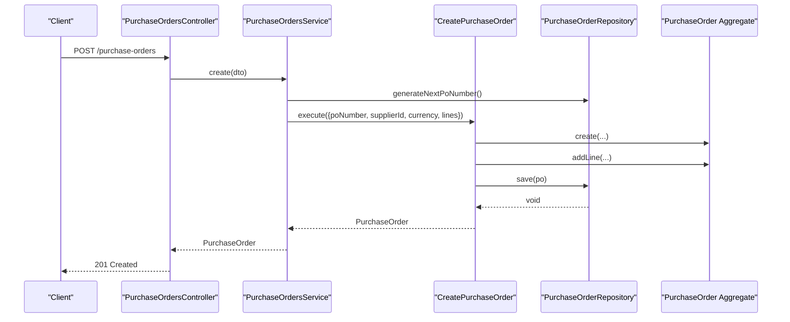

**Diagram sources**
- [purchase-orders.controller.ts:28-31](file://apps/api/src/purchase-orders/purchase-orders.controller.ts#L28-L31)
- [purchase-orders.service.ts:38-60](file://apps/api/src/purchase-orders/purchase-orders.service.ts#L38-L60)
- [create-purchase-order.ts:15-43](file://packages/procurement/src/purchase-orders/create-purchase-order.ts#L15-L43)
- [purchase-order.repository.ts:9-16](file://packages/procurement/src/purchase-orders/purchase-order.repository.ts#L9-L16)

## Detailed Component Analysis

### Purchase Order Lifecycle and State Transitions
The lifecycle includes states: DRAFT, SUBMITTED, APPROVED, ISSUED, PARTIALLY_RECEIVED, FULFILLED, CANCELLED. Transitions are enforced by the aggregate’s methods invoked from the service.

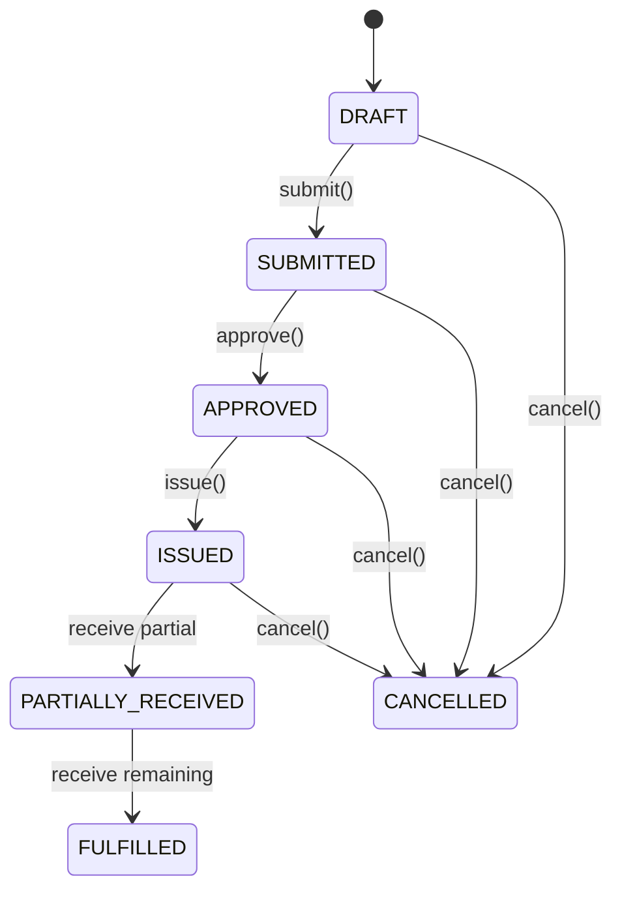

Validation rules include:
- At least one line required before leaving DRAFT.
- Positive quantities per line.
- Totals must be non-negative and consistent with line totals.
- Deletion allowed only for DRAFT or CANCELLED.

**Diagram sources**
- [0010-purchase-orders.md:114-121](file://docs/rfcs/0010-purchase-orders.md#L114-L121)
- [purchase-order.errors.ts:12-26](file://packages/procurement/src/purchase-orders/purchase-order.errors.ts#L12-L26)
- [delete-purchase-order.ts:17-19](file://packages/procurement/src/purchase-orders/delete-purchase-order.ts#L17-L19)

**Section sources**
- [0010-purchase-orders.md:19-23](file://docs/rfcs/0010-purchase-orders.md#L19-L23)
- [0010-purchase-orders.md:125-132](file://docs/rfcs/0010-purchase-orders.md#L125-L132)
- [purchase-orders.service.ts:117-143](file://apps/api/src/purchase-orders/purchase-orders.service.ts#L117-L143)
- [delete-purchase-order.ts:10-22](file://packages/procurement/src/purchase-orders/delete-purchase-order.ts#L10-L22)

### Purchase Order Aggregate Design and Line Item Management
- Aggregate root: PurchaseOrder manages lines, totals, and state transitions.
- Line entity: PurchaseOrderLine tracks component, vendor part number, unit price, quantity ordered/received, tax rate, and line total.
- Creation use case: CreatePurchaseOrder generates PO number, creates aggregate, adds lines, and persists.
- Deletion use case: DeletePurchaseOrder enforces status-based deletion policy.

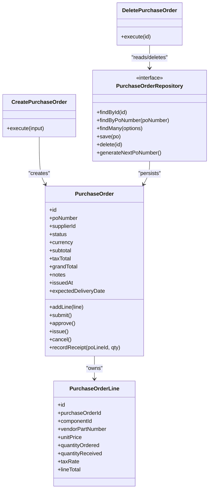

**Diagram sources**
- [0010-purchase-orders.md:37-77](file://docs/rfcs/0010-purchase-orders.md#L37-L77)
- [create-purchase-order.ts:12-44](file://packages/procurement/src/purchase-orders/create-purchase-order.ts#L12-L44)
- [delete-purchase-order.ts:7-23](file://packages/procurement/src/purchase-orders/delete-purchase-order.ts#L7-L23)
- [purchase-order.repository.ts:9-16](file://packages/procurement/src/purchase-orders/purchase-order.repository.ts#L9-L16)

**Section sources**
- [0010-purchase-orders.md:37-77](file://docs/rfcs/0010-purchase-orders.md#L37-L77)
- [create-purchase-order.ts:15-43](file://packages/procurement/src/purchase-orders/create-purchase-order.ts#L15-L43)
- [delete-purchase-order.ts:10-22](file://packages/procurement/src/purchase-orders/delete-purchase-order.ts#L10-L22)

### Pricing Calculations and Currency Handling
- Currency resolution precedence: explicit request currency > organization base currency > system fallback ("INR").
- Pricing fields: unit price, tax rate, line total; aggregate computes subtotal, tax total, grand total.
- DTOs enforce numeric types and optional tax rates.

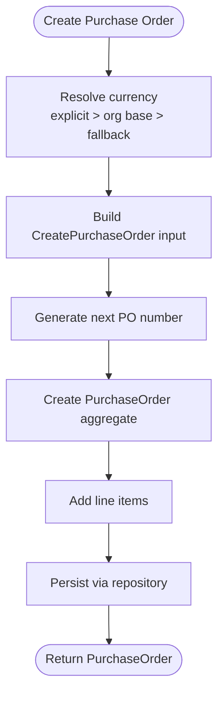

**Diagram sources**
- [currency-resolver.ts:14-25](file://apps/api/src/common/utils/currency-resolver.ts#L14-L25)
- [purchase-orders.service.ts:38-60](file://apps/api/src/purchase-orders/purchase-orders.service.ts#L38-L60)
- [create-purchase-order.ts:15-43](file://packages/procurement/src/purchase-orders/create-purchase-order.ts#L15-L43)

**Section sources**
- [currency-resolver.ts:14-25](file://apps/api/src/common/utils/currency-resolver.ts#L14-L25)
- [purchase-orders.service.ts:38-60](file://apps/api/src/purchase-orders/purchase-orders.service.ts#L38-L60)
- [dtos.ts:12-32](file://apps/api/src/purchase-orders/dtos.ts#L12-L32)
- [dtos.ts:34-72](file://apps/api/src/purchase-orders/dtos.ts#L34-L72)

### Approval Policies and Budget Controls
- Procurement policies define approval tiers and receiving tolerances.
- During submission/approval, policy evaluation determines if higher-level approval is required based on monetary thresholds.
- Tolerance policies constrain over/under receipts during goods receipt processing.

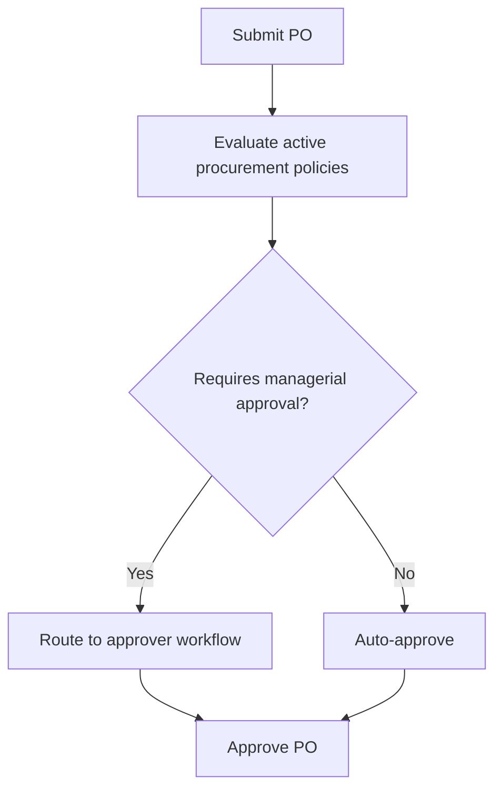

**Diagram sources**
- [0014-procurement-policies.md:17-29](file://docs/rfcs/0014-procurement-policies.md#L17-L29)
- [0014-procurement-policies.md:87-90](file://docs/rfcs/0014-procurement-policies.md#L87-L90)
- [0014-procurement-policies.md:157-163](file://docs/rfcs/0014-procurement-policies.md#L157-L163)

**Section sources**
- [0014-procurement-policies.md:11-29](file://docs/rfcs/0014-procurement-policies.md#L11-L29)
- [0014-procurement-policies.md:81-90](file://docs/rfcs/0014-procurement-policies.md#L81-L90)
- [0014-procurement-policies.md:107-110](file://docs/rfcs/0014-procurement-policies.md#L107-L110)

### Integration with Suppliers, Inventory, and Finance
- Suppliers: Supplier master data is referenced by POs; supplier service provides CRUD and mappings.
- Inventory: Goods receipt posts inventory transactions and updates projections; PO lines track received quantities and status transitions.
- Finance: PO totals and tax calculations support accounts payable and invoice matching downstream.

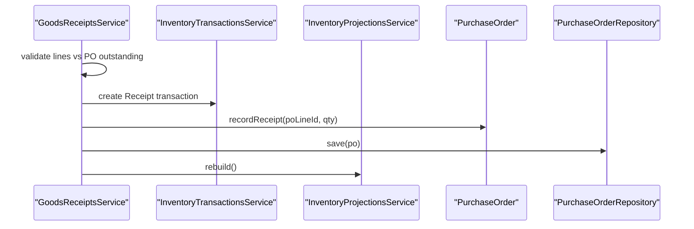

**Diagram sources**
- [goods-receipts.service.ts:42-116](file://apps/api/src/goods-receipts/goods-receipts.service.ts#L42-L116)
- [goods-receipts.service.ts:182-205](file://apps/api/src/goods-receipts/goods-receipts.service.ts#L182-L205)

**Section sources**
- [suppliers.service.ts:20-102](file://apps/api/src/suppliers/suppliers.service.ts#L20-L102)
- [goods-receipts.service.ts:42-116](file://apps/api/src/goods-receipts/goods-receipts.service.ts#L42-L116)
- [goods-receipts.service.ts:182-205](file://apps/api/src/goods-receipts/goods-receipts.service.ts#L182-L205)

### Audit Trails and Compliance
- RFCs define read-only reporting models and KPIs for procurement visibility.
- Auditability is supported by immutable domain events and timestamps in aggregates and repositories.
- Reporting queries should not mutate state and rely on optimized indexes.

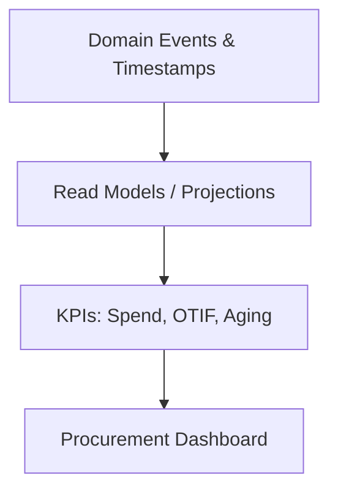

**Diagram sources**
- [0015-procurement-reporting.md:13-30](file://docs/rfcs/0015-procurement-reporting.md#L13-L30)
- [0015-procurement-reporting.md:89-97](file://docs/rfcs/0015-procurement-reporting.md#L89-L97)

**Section sources**
- [0015-procurement-reporting.md:11-30](file://docs/rfcs/0015-procurement-reporting.md#L11-L30)
- [0015-procurement-reporting.md:89-97](file://docs/rfcs/0015-procurement-reporting.md#L89-L97)

### Concrete Examples

#### Example: Create Purchase Order
- Steps:
  - Resolve currency using explicit, organization, or fallback.
  - Generate next PO number.
  - Create aggregate and add line items.
  - Persist and return PO.

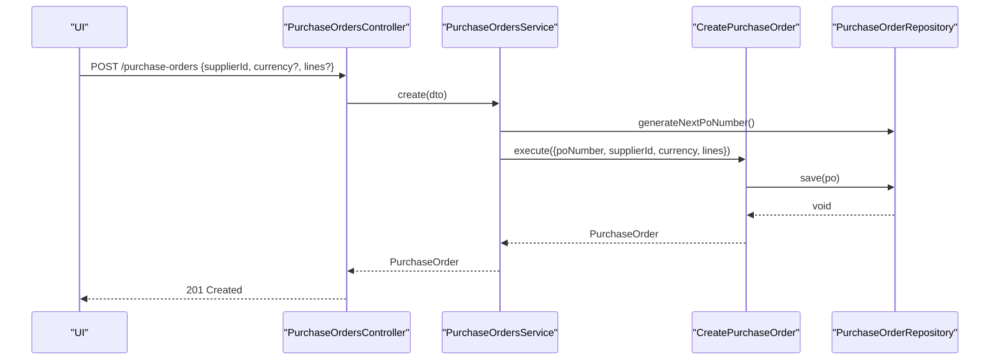

**Diagram sources**
- [purchase-orders.controller.ts:28-31](file://apps/api/src/purchase-orders/purchase-orders.controller.ts#L28-L31)
- [purchase-orders.service.ts:38-60](file://apps/api/src/purchase-orders/purchase-orders.service.ts#L38-L60)
- [create-purchase-order.ts:15-43](file://packages/procurement/src/purchase-orders/create-purchase-order.ts#L15-L43)

#### Example: Modify Lines and Validate Components
- Adding a line validates that the component is usable (not consolidated/retired).
- If valid, the line is added and the PO is persisted.

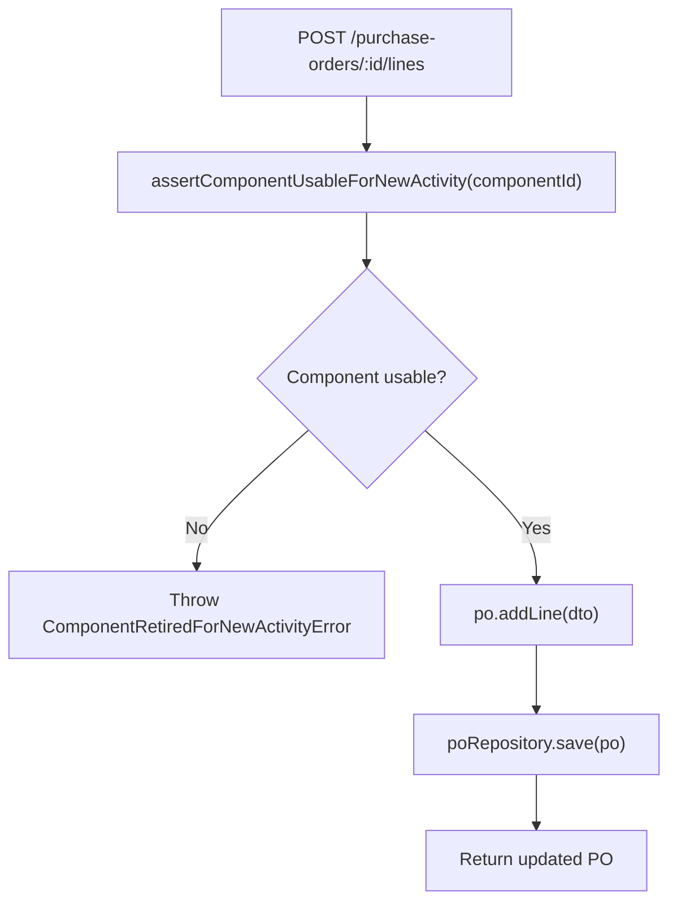

**Diagram sources**
- [purchase-orders.service.ts:102-115](file://apps/api/src/purchase-orders/purchase-orders.service.ts#L102-L115)
- [component-lifecycle.guard.ts:22-45](file://apps/api/src/components/component-lifecycle.guard.ts#L22-L45)

#### Example: Approval Workflow
- Submit transitions DRAFT to SUBMITTED.
- Approve transitions SUBMITTED to APPROVED.
- Policy evaluation may require higher-level approval based on thresholds.

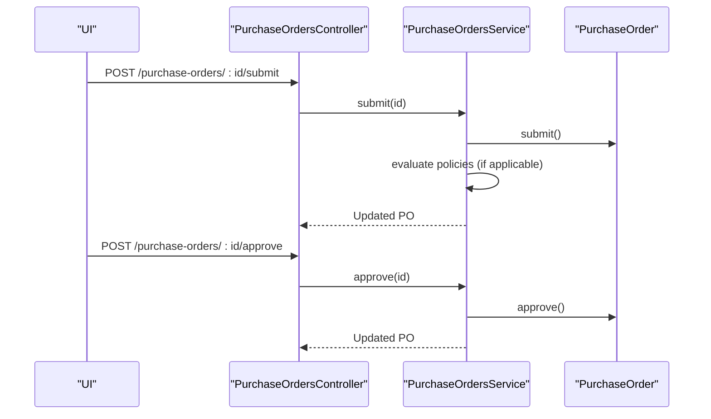

**Diagram sources**
- [purchase-orders.controller.ts:63-71](file://apps/api/src/purchase-orders/purchase-orders.controller.ts#L63-L71)
- [purchase-orders.service.ts:117-129](file://apps/api/src/purchase-orders/purchase-orders.service.ts#L117-L129)
- [0014-procurement-policies.md:157-163](file://docs/rfcs/0014-procurement-policies.md#L157-L163)

#### Example: Status Tracking Through Receiving
- Goods receipt validates against PO outstanding quantities.
- Posts inventory transactions, updates PO line received quantities, and sets PO status to PARTIALLY_RECEIVED or FULFILLED.

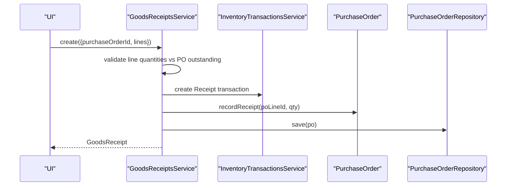

**Diagram sources**
- [goods-receipts.service.ts:42-116](file://apps/api/src/goods-receipts/goods-receipts.service.ts#L42-L116)
- [goods-receipts.service.ts:182-205](file://apps/api/src/goods-receipts/goods-receipts.service.ts#L182-L205)

## Dependency Analysis
The API layer depends on domain packages and shared utilities:
- Controllers depend on services.
- Services depend on domain use cases and repositories.
- Goods receipts integrate with inventory services and update POs.
- Supplier service provides master data references.
- Currency resolver centralizes currency precedence.
- Component lifecycle guard prevents invalid component usage.

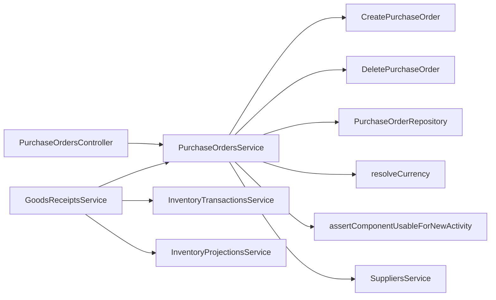

**Diagram sources**
- [purchase-orders.controller.ts:23-82](file://apps/api/src/purchase-orders/purchase-orders.controller.ts#L23-L82)
- [purchase-orders.service.ts:22-144](file://apps/api/src/purchase-orders/purchase-orders.service.ts#L22-L144)
- [goods-receipts.service.ts:26-116](file://apps/api/src/goods-receipts/goods-receipts.service.ts#L26-L116)
- [currency-resolver.ts:14-25](file://apps/api/src/common/utils/currency-resolver.ts#L14-L25)
- [component-lifecycle.guard.ts:22-45](file://apps/api/src/components/component-lifecycle.guard.ts#L22-L45)
- [suppliers.service.ts:20-102](file://apps/api/src/suppliers/suppliers.service.ts#L20-L102)

**Section sources**
- [purchase-orders.controller.ts:23-82](file://apps/api/src/purchase-orders/purchase-orders.controller.ts#L23-L82)
- [purchase-orders.service.ts:22-144](file://apps/api/src/purchase-orders/purchase-orders.service.ts#L22-L144)
- [goods-receipts.service.ts:26-116](file://apps/api/src/goods-receipts/goods-receipts.service.ts#L26-L116)

## Performance Considerations
- Repository queries should leverage indexes on supplier_id, status, and created_at for efficient filtering and reporting.
- Avoid unnecessary recomputation of totals; compute totals within the aggregate when lines change.
- Asynchronous projection rebuilds after goods receipt reduce synchronous overhead.
- Reporting queries should remain read-only and use optimized aggregation paths.

[No sources needed since this section provides general guidance]

## Troubleshooting Guide
Common issues and resolutions:
- Invalid status transition: Ensure the current state allows the requested action (e.g., cannot edit lines after APPROVED).
- Empty purchase order: Add at least one line before submitting.
- Not found errors: Verify PO ID exists before operations.
- Deletion restrictions: Only DRAFT or CANCELLED POs can be deleted.
- Retired component selection: Replace consolidated components with the surviving component.
- Exceeded receiving quantity: Ensure goods receipt quantities do not exceed PO outstanding amounts.

**Section sources**
- [purchase-order.errors.ts:1-43](file://packages/procurement/src/purchase-orders/purchase-order.errors.ts#L1-L43)
- [delete-purchase-order.ts:10-22](file://packages/procurement/src/purchase-orders/delete-purchase-order.ts#L10-L22)
- [component-lifecycle.guard.ts:22-45](file://apps/api/src/components/component-lifecycle.guard.ts#L22-L45)
- [goods-receipts.service.ts:42-60](file://apps/api/src/goods-receipts/goods-receipts.service.ts#L42-L60)

## Conclusion
The Purchase Order workflow in Ananya ERP combines robust domain modeling with clear API orchestration. The aggregate enforces lifecycle invariants, while the API layer coordinates cross-domain integrations for suppliers, inventory, and finance. Procurement policies provide governance for approvals and receiving tolerances, and reporting models deliver actionable insights. By adhering to the defined state transitions, validation rules, and integration patterns, organizations can maintain compliant, auditable procurement processes with reliable financial and inventory outcomes.

[No sources needed since this section summarizes without analyzing specific files]