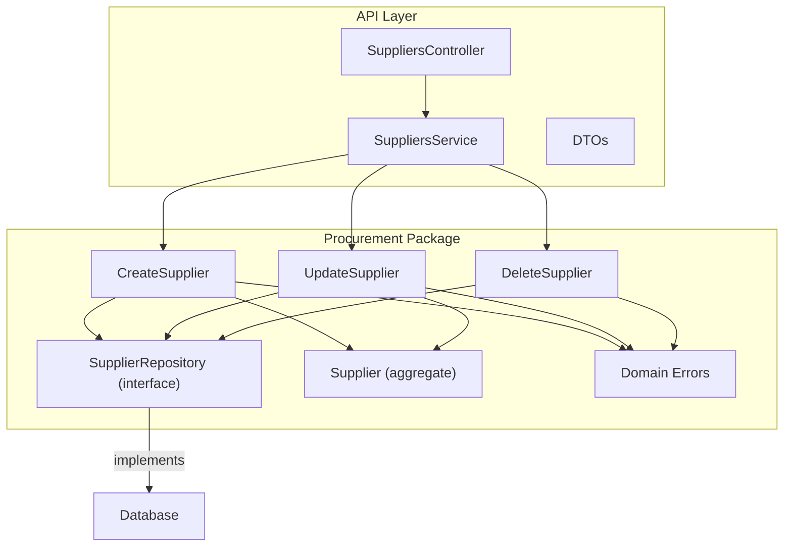
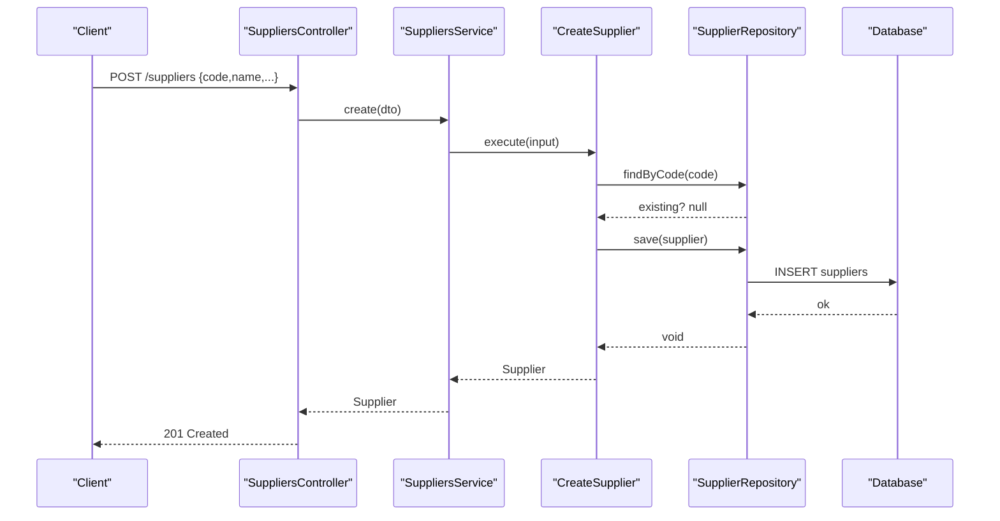
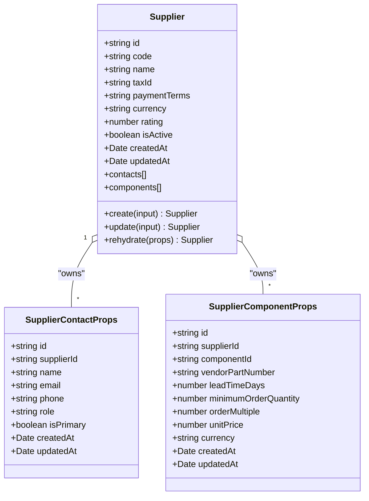
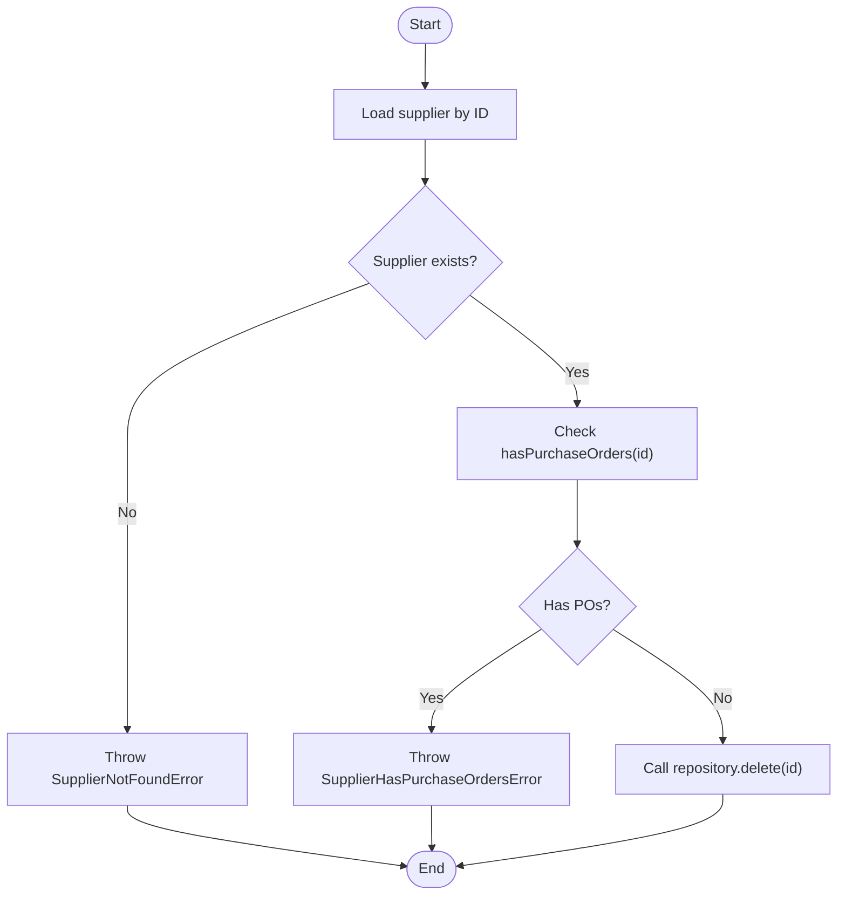
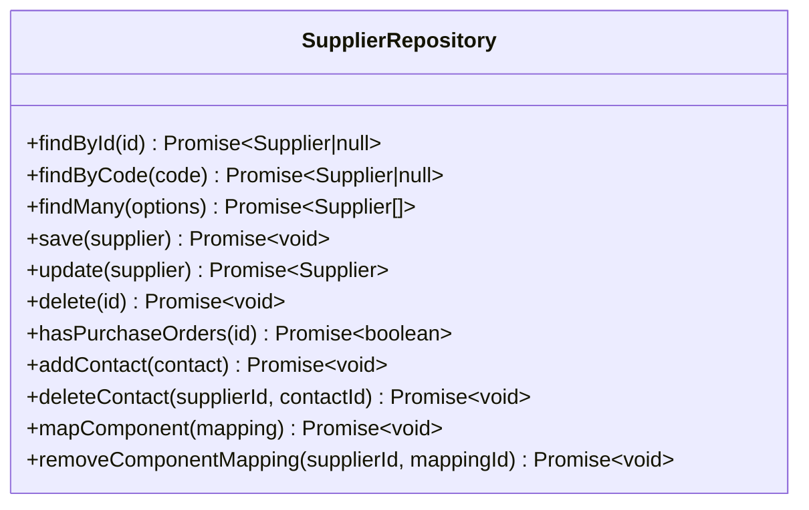
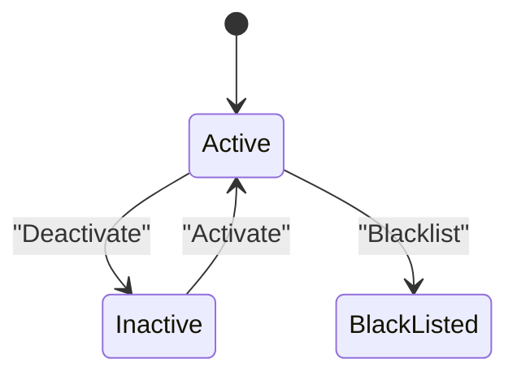
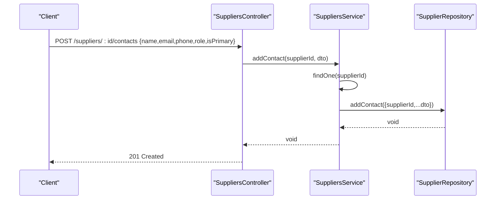
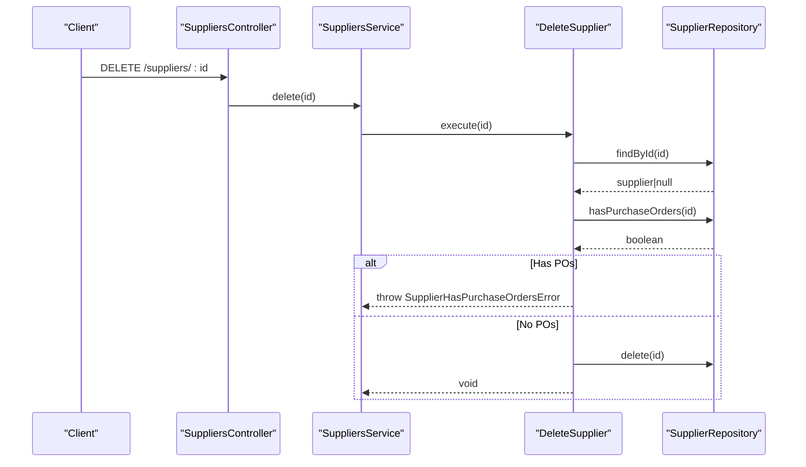
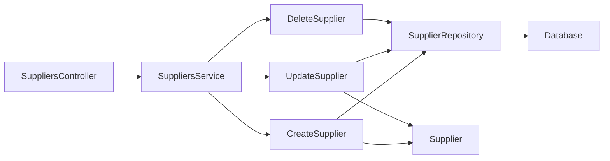

# Supplier Management

<cite>
**Referenced Files in This Document**
- [0009-supplier-management.md](file://docs/rfcs/0009-supplier-management.md)
- [suppliers.controller.ts](file://apps/api/src/suppliers/suppliers.controller.ts)
- [suppliers.service.ts](file://apps/api/src/suppliers/suppliers.service.ts)
- [dtos.ts](file://apps/api/src/suppliers/dtos.ts)
- [supplier.ts](file://packages/procurement/src/suppliers/supplier.ts)
- [supplier.repository.ts](file://packages/procurement/src/suppliers/supplier.repository.ts)
- [create-supplier.ts](file://packages/procurement/src/suppliers/create-supplier.ts)
- [update-supplier.ts](file://packages/procurement/src/suppliers/update-supplier.ts)
- [delete-supplier.ts](file://packages/procurement/src/suppliers/delete-supplier.ts)
- [supplier.errors.ts](file://packages/procurement/src/suppliers/supplier.errors.ts)
</cite>

## Table of Contents
1. [Introduction](#introduction)
2. [Project Structure](#project-structure)
3. [Core Components](#core-components)
4. [Architecture Overview](#architecture-overview)
5. [Detailed Component Analysis](#detailed-component-analysis)
6. [Dependency Analysis](#dependency-analysis)
7. [Performance Considerations](#performance-considerations)
8. [Troubleshooting Guide](#troubleshooting-guide)
9. [Conclusion](#conclusion)

## Introduction
This document explains the Supplier Management component within the Procurement Domain. It covers supplier entity modeling, lifecycle management, business rules for creation, updates, and deletion, repository implementation, validation rules, data integrity constraints, CRUD operations, performance tracking, integration with purchase orders, state transitions, approval workflows, categorization, contact information management, and compliance requirements. The content is grounded in the RFC design and the current API and domain implementations.

## Project Structure
Supplier Management spans two layers:
- API layer (NestJS): Controller, Service, DTOs, and exception filter
- Procurement package (Domain): Supplier aggregate, command handlers, repository interface, and domain errors

**Diagram sources**
- [suppliers.controller.ts:23-81](file://apps/api/src/suppliers/suppliers.controller.ts#L23-L81)
- [suppliers.service.ts:20-102](file://apps/api/src/suppliers/suppliers.service.ts#L20-L102)
- [create-supplier.ts:5-21](file://packages/procurement/src/suppliers/create-supplier.ts#L5-L21)
- [update-supplier.ts:8-32](file://packages/procurement/src/suppliers/update-supplier.ts#L8-L32)
- [delete-supplier.ts:7-24](file://packages/procurement/src/suppliers/delete-supplier.ts#L7-L24)
- [supplier.repository.ts:8-36](file://packages/procurement/src/suppliers/supplier.repository.ts#L8-L36)
- [supplier.ts:65-162](file://packages/procurement/src/suppliers/supplier.ts#L65-L162)
- [supplier.errors.ts:1-39](file://packages/procurement/src/suppliers/supplier.errors.ts#L1-L39)

**Section sources**
- [suppliers.controller.ts:23-81](file://apps/api/src/suppliers/suppliers.controller.ts#L23-L81)
- [suppliers.service.ts:20-102](file://apps/api/src/suppliers/suppliers.service.ts#L20-L102)
- [supplier.ts:65-162](file://packages/procurement/src/suppliers/supplier.ts#L65-L162)
- [supplier.repository.ts:8-36](file://packages/procurement/src/suppliers/supplier.repository.ts#L8-L36)

## Core Components
- Supplier aggregate: Encapsulates supplier identity, terms, contacts, catalog mappings, and lifecycle flags. Provides factory methods to create and update entities while enforcing invariants.
- Command handlers: CreateSupplier, UpdateSupplier, DeleteSupplier orchestrate use cases and enforce domain rules such as code uniqueness and referential integrity.
- Repository interface: Defines persistence operations including CRUD, contact/catalog management, and a check for existing purchase orders.
- API controller and service: Expose REST endpoints and map DTOs to domain inputs; delegate to command handlers and repository.
- DTOs: Validate incoming request payloads at the API boundary.

Key responsibilities:
- Supplier creation enforces non-empty code/name normalization and default values for payment terms and currency.
- Supplier updates allow partial changes with uniqueness checks on code changes.
- Deletion prevents removal when purchase orders reference the supplier.
- Contacts and component mappings are managed via repository methods exposed by the service.

**Section sources**
- [supplier.ts:65-162](file://packages/procurement/src/suppliers/supplier.ts#L65-L162)
- [create-supplier.ts:5-21](file://packages/procurement/src/suppliers/create-supplier.ts#L5-L21)
- [update-supplier.ts:8-32](file://packages/procurement/src/suppliers/update-supplier.ts#L8-L32)
- [delete-supplier.ts:7-24](file://packages/procurement/src/suppliers/delete-supplier.ts#L7-L24)
- [supplier.repository.ts:8-36](file://packages/procurement/src/suppliers/supplier.repository.ts#L8-L36)
- [dtos.ts:9-107](file://apps/api/src/suppliers/dtos.ts#L9-L107)

## Architecture Overview
The Supplier Management feature follows a layered architecture:
- Presentation/API: NestJS controller exposes REST endpoints.
- Application: Service coordinates commands and validates existence before delegating to domain logic.
- Domain: Command handlers encapsulate business rules and interact with the Supplier aggregate and repository interface.
- Infrastructure: A Drizzle-based repository implements the SupplierRepository interface (not shown here).

**Diagram sources**
- [suppliers.controller.ts:28-31](file://apps/api/src/suppliers/suppliers.controller.ts#L28-L31)
- [suppliers.service.ts:35-44](file://apps/api/src/suppliers/suppliers.service.ts#L35-L44)
- [create-supplier.ts:8-19](file://packages/procurement/src/suppliers/create-supplier.ts#L8-L19)
- [supplier.repository.ts:8-14](file://packages/procurement/src/suppliers/supplier.repository.ts#L8-L14)

## Detailed Component Analysis

### Supplier Entity Modeling
- Properties include identifier, code, name, tax ID, payment terms, currency, rating, active flag, timestamps, plus owned collections for contacts and component mappings.
- Factory method Supplier.create normalizes code and name, sets defaults for payment terms and currency, initializes rating and active status, and generates IDs and timestamps.
- Update method Supplier.update applies partial updates with validation and timestamp refresh.

**Diagram sources**
- [supplier.ts:7-46](file://packages/procurement/src/suppliers/supplier.ts#L7-L46)
- [supplier.ts:65-162](file://packages/procurement/src/suppliers/supplier.ts#L65-L162)

**Section sources**
- [supplier.ts:7-46](file://packages/procurement/src/suppliers/supplier.ts#L7-L46)
- [supplier.ts:65-162](file://packages/procurement/src/suppliers/supplier.ts#L65-L162)

### Lifecycle Management and Business Rules
- Creation:
  - Validates code and name presence.
  - Normalizes code to uppercase and trims whitespace.
  - Ensures code uniqueness via repository lookup.
  - Sets default payment terms and currency if not provided.
- Updates:
  - Allows partial updates to code, name, tax ID, payment terms, currency, and active flag.
  - Enforces code uniqueness when changing code.
  - Refreshes updated timestamp.
- Deletion:
  - Prevents deletion if purchase orders exist for the supplier.
  - Throws specific domain error when referenced by POs.

**Diagram sources**
- [delete-supplier.ts:10-23](file://packages/procurement/src/suppliers/delete-supplier.ts#L10-L23)
- [supplier.repository.ts:15-15](file://packages/procurement/src/suppliers/supplier.repository.ts#L15-L15)

**Section sources**
- [create-supplier.ts:8-19](file://packages/procurement/src/suppliers/create-supplier.ts#L8-L19)
- [update-supplier.ts:11-30](file://packages/procurement/src/suppliers/update-supplier.ts#L11-L30)
- [delete-supplier.ts:10-23](file://packages/procurement/src/suppliers/delete-supplier.ts#L10-L23)
- [supplier.errors.ts:17-38](file://packages/procurement/src/suppliers/supplier.errors.ts#L17-L38)

### Supplier Repository Implementation Contract
The repository interface defines:
- Retrieval: findById, findByCode, findMany with search and active filters.
- Persistence: save, update, delete.
- Referential integrity: hasPurchaseOrders to prevent unsafe deletions.
- Catalog and contacts: addContact, deleteContact, mapComponent, removeComponentMapping.

**Diagram sources**
- [supplier.repository.ts:3-36](file://packages/procurement/src/suppliers/supplier.repository.ts#L3-L36)

**Section sources**
- [supplier.repository.ts:3-36](file://packages/procurement/src/suppliers/supplier.repository.ts#L3-L36)

### Validation Rules and Data Integrity Constraints
- API-level validation via DTOs ensures required fields and types:
  - CreateSupplierDto: code, name required; optional taxId, paymentTerms, currency.
  - UpdateSupplierDto: all fields optional; includes isActive boolean.
  - AddContactDto: name required; optional email, phone, role, isPrimary.
  - MapComponentDto: componentId and vendorPartNumber required; numeric fields optional.
- Domain-level validation:
  - Code must be non-empty after trimming and uppercasing.
  - Name must be non-empty after trimming.
  - Defaults applied for payment terms and currency if omitted.
- Database schema constraints (RFC):
  - Unique code, required name, valid enums for payment terms, numeric ranges for rating, and foreign key constraints for contacts and component mappings.

**Section sources**
- [dtos.ts:9-107](file://apps/api/src/suppliers/dtos.ts#L9-L107)
- [supplier.ts:94-121](file://packages/procurement/src/suppliers/supplier.ts#L94-L121)
- [0009-supplier-management.md:156-197](file://docs/rfcs/0009-supplier-management.md#L156-L197)

### Supplier State Transitions and Approval Workflows
- States defined in RFC:
  - DRAFT/NEW -> ACTIVE <-> INACTIVE
  - ACTIVE -> BLACK-LISTED
- Business rule: Deactivated or blacklisted suppliers cannot be selected for new purchase orders.
- Current implementation:
  - New suppliers are created active by default.
  - Active flag can be toggled via update.
  - No explicit workflow engine is present; state transitions are enforced by business rules and UI/workflow processes.

**Diagram sources**
- [0009-supplier-management.md:116-123](file://docs/rfcs/0009-supplier-management.md#L116-L123)
- [supplier.ts:113-117](file://packages/procurement/src/suppliers/supplier.ts#L113-L117)

**Section sources**
- [0009-supplier-management.md:116-133](file://docs/rfcs/0009-supplier-management.md#L116-L133)
- [supplier.ts:113-117](file://packages/procurement/src/suppliers/supplier.ts#L113-L117)

### Supplier Categorization and Contact Information Management
- Categorization:
  - The RFC describes a Supplier Component Catalog mapping internal components to vendor part numbers, lead times, MOQ, order multiples, and pricing.
  - The repository provides mapComponent and removeComponentMapping to manage these relationships.
- Contact management:
  - Suppliers own multiple contacts with primary designation.
  - Service methods add/remove contacts after verifying supplier existence.

**Diagram sources**
- [suppliers.controller.ts:54-57](file://apps/api/src/suppliers/suppliers.controller.ts#L54-L57)
- [suppliers.service.ts:74-80](file://apps/api/src/suppliers/suppliers.service.ts#L74-L80)
- [supplier.repository.ts:16-24](file://packages/procurement/src/suppliers/supplier.repository.ts#L16-L24)

**Section sources**
- [0009-supplier-management.md:66-69](file://docs/rfcs/0009-supplier-management.md#L66-L69)
- [suppliers.controller.ts:54-57](file://apps/api/src/suppliers/suppliers.controller.ts#L54-L57)
- [suppliers.service.ts:74-80](file://apps/api/src/suppliers/suppliers.service.ts#L74-L80)
- [supplier.repository.ts:16-24](file://packages/procurement/src/suppliers/supplier.repository.ts#L16-L24)

### Integration with Purchase Orders
- Deletion protection:
  - DeleteSupplier queries hasPurchaseOrders via the repository and throws an error if any exist.
- Selection restrictions:
  - RFC states deactivated or blacklisted suppliers cannot be selected for new purchase orders.
- Pricing and lead time:
  - Supplier component mappings provide unit price, lead time, MOQ, and order multiple used during purchase planning and ordering.

**Diagram sources**
- [delete-supplier.ts:10-23](file://packages/procurement/src/suppliers/delete-supplier.ts#L10-L23)
- [supplier.repository.ts:15-15](file://packages/procurement/src/suppliers/supplier.repository.ts#L15-L15)

**Section sources**
- [delete-supplier.ts:10-23](file://packages/procurement/src/suppliers/delete-supplier.ts#L10-L23)
- [0009-supplier-management.md:126-133](file://docs/rfcs/0009-supplier-management.md#L126-L133)

### Concrete Examples of Supplier CRUD Operations
- Create supplier:
  - Endpoint: POST /suppliers
  - Payload: code, name, optional taxId, paymentTerms, currency
  - Behavior: Validates input, checks code uniqueness, creates supplier with defaults, persists, returns supplier.
- List/search suppliers:
  - Endpoint: GET /suppliers?search=...
  - Behavior: Delegates to repository findMany with optional search.
- Get supplier details:
  - Endpoint: GET /suppliers/:id
  - Behavior: Returns supplier if found; otherwise throws not found.
- Update supplier:
  - Endpoint: PUT /suppliers/:id
  - Behavior: Applies partial updates, enforces code uniqueness if changed, persists updated supplier.
- Delete supplier:
  - Endpoint: DELETE /suppliers/:id
  - Behavior: Checks for existing purchase orders; deletes if none; otherwise throws error.
- Manage contacts:
  - Add: POST /suppliers/:id/contacts
  - Remove: DELETE /suppliers/:id/contacts/:contactId
- Manage component mappings:
  - Map: POST /suppliers/:id/components
  - Unmap: DELETE /suppliers/:id/components/:mappingId

**Section sources**
- [suppliers.controller.ts:28-80](file://apps/api/src/suppliers/suppliers.controller.ts#L28-L80)
- [suppliers.service.ts:35-101](file://apps/api/src/suppliers/suppliers.service.ts#L35-L101)
- [dtos.ts:9-107](file://apps/api/src/suppliers/dtos.ts#L9-L107)

### Supplier Performance Tracking
- Rating field:
  - Supplier aggregate includes a numeric rating initialized to 5.0 on creation.
- Future extension:
  - RFC suggests automated vendor evaluation based on OTIF metrics from Goods Receipts.
- Current implementation:
  - Rating is available but not automatically updated by the current code paths; it can be updated through future domain services or manual updates.

**Section sources**
- [supplier.ts:113-116](file://packages/procurement/src/suppliers/supplier.ts#L113-L116)
- [0009-supplier-management.md:237-241](file://docs/rfcs/0009-supplier-management.md#L237-L241)

### Compliance Requirements
- Tax identification:
  - Optional taxId stored on supplier for compliance reporting.
- Currency and payment terms:
  - ISO currency codes and standardized payment terms ensure consistent financial processing.
- Auditability:
  - Timestamps (createdAt, updatedAt) support audit trails.
- Data integrity:
  - Unique code constraint and referential integrity for contacts and component mappings.

**Section sources**
- [supplier.ts:33-46](file://packages/procurement/src/suppliers/supplier.ts#L33-L46)
- [0009-supplier-management.md:156-197](file://docs/rfcs/0009-supplier-management.md#L156-L197)

## Dependency Analysis
The following diagram shows dependencies between API and domain components:

**Diagram sources**
- [suppliers.controller.ts:23-81](file://apps/api/src/suppliers/suppliers.controller.ts#L23-L81)
- [suppliers.service.ts:20-102](file://apps/api/src/suppliers/suppliers.service.ts#L20-L102)
- [create-supplier.ts:5-21](file://packages/procurement/src/suppliers/create-supplier.ts#L5-L21)
- [update-supplier.ts:8-32](file://packages/procurement/src/suppliers/update-supplier.ts#L8-L32)
- [delete-supplier.ts:7-24](file://packages/procurement/src/suppliers/delete-supplier.ts#L7-L24)
- [supplier.repository.ts:8-36](file://packages/procurement/src/suppliers/supplier.repository.ts#L8-L36)
- [supplier.ts:65-162](file://packages/procurement/src/suppliers/supplier.ts#L65-L162)

**Section sources**
- [suppliers.controller.ts:23-81](file://apps/api/src/suppliers/suppliers.controller.ts#L23-L81)
- [suppliers.service.ts:20-102](file://apps/api/src/suppliers/suppliers.service.ts#L20-L102)
- [supplier.repository.ts:8-36](file://packages/procurement/src/suppliers/supplier.repository.ts#L8-L36)

## Performance Considerations
- Indexing:
  - Ensure unique index on supplier.code and indexes on supplier_id in contacts and component mappings for fast lookups.
- Query optimization:
  - Use findMany with search and isActive filters to limit result sets.
- Transactional safety:
  - Persist supplier and related contacts/mappings within transactions to maintain consistency.
- Caching:
  - Cache frequently accessed supplier catalogs and ratings where appropriate.

[No sources needed since this section provides general guidance]

## Troubleshooting Guide
Common issues and resolutions:
- Duplicate supplier code:
  - Cause: Attempting to create or update with an existing code.
  - Resolution: Choose a unique code or update the existing record instead.
- Supplier not found:
  - Cause: Invalid ID or deleted supplier.
  - Resolution: Verify ID and ensure supplier exists before operations.
- Cannot delete supplier due to purchase orders:
  - Cause: Active purchase orders reference the supplier.
  - Resolution: Close or transfer purchase orders before deletion.
- Missing required fields:
  - Cause: DTO validation failures.
  - Resolution: Provide required fields per DTO definitions.

**Section sources**
- [supplier.errors.ts:17-38](file://packages/procurement/src/suppliers/supplier.errors.ts#L17-L38)
- [dtos.ts:9-107](file://apps/api/src/suppliers/dtos.ts#L9-L107)

## Conclusion
Supplier Management provides a robust foundation for managing external vendors within the Procurement Domain. The Supplier aggregate enforces core invariants, command handlers encapsulate business rules, and the repository interface abstracts persistence concerns. Integration points with purchase orders and catalog mappings enable end-to-end procurement workflows. Future enhancements can expand performance tracking and approval workflows while maintaining strong data integrity and compliance.

[No sources needed since this section summarizes without analyzing specific files]