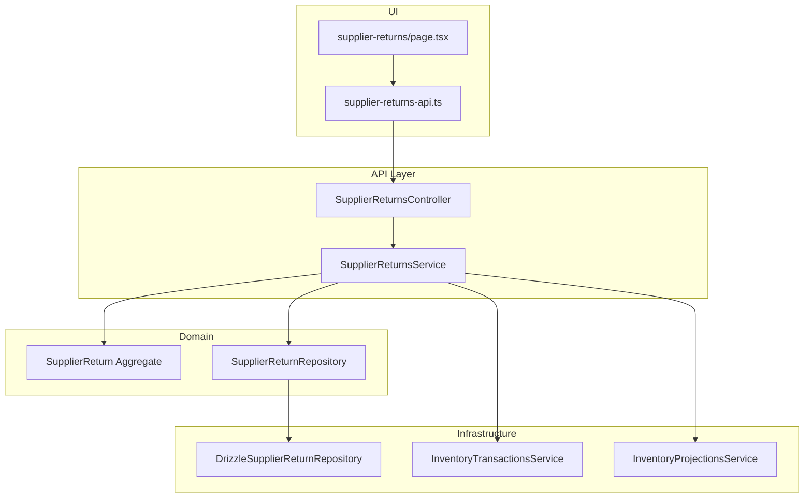
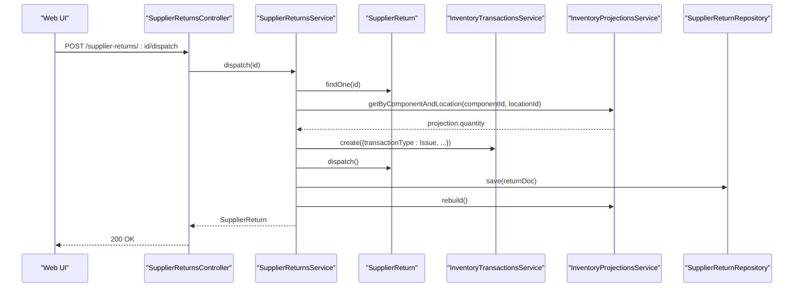
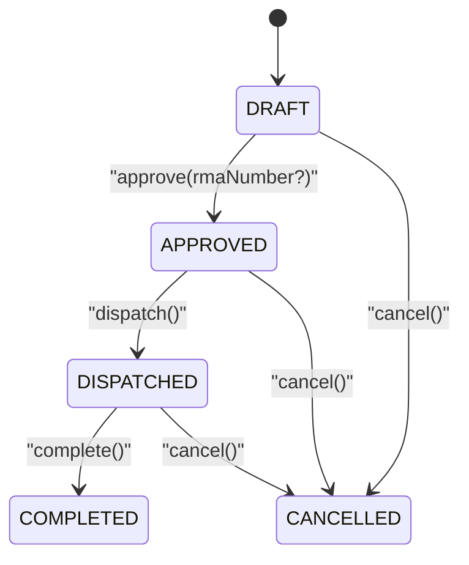
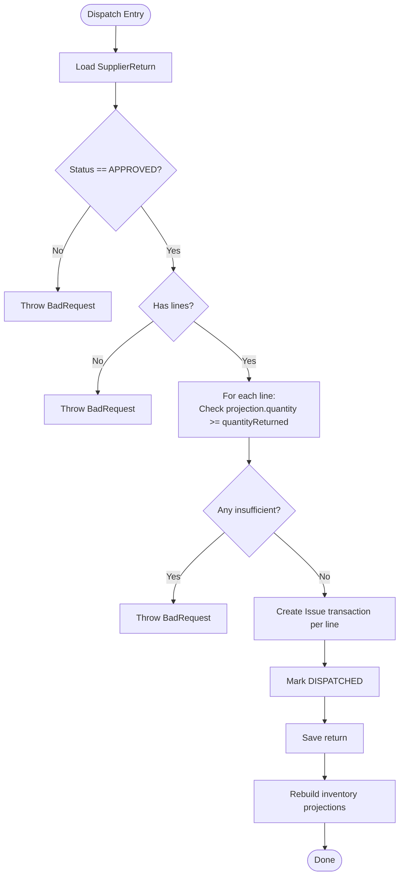
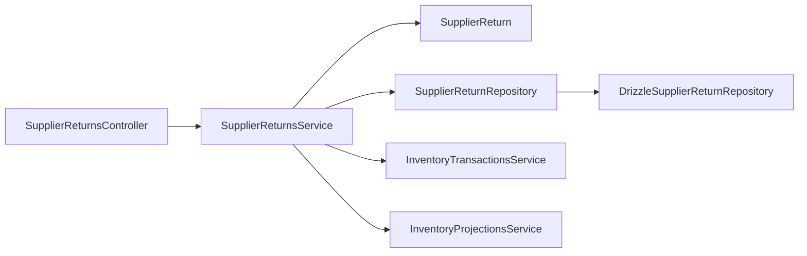

# Supplier Returns

<cite>
**Referenced Files in This Document**
- [RFC-0012: Supplier Returns](file://docs/rfcs/0012-supplier-returns.md)
- [SupplierReturnsController](file://apps/api/src/supplier-returns/supplier-returns.controller.ts)
- [SupplierReturnsService](file://apps/api/src/supplier-returns/supplier-returns.service.ts)
- [Supplier Return DTOs](file://apps/api/src/supplier-returns/dtos.ts)
- [Drizzle Supplier Return Repository](file://apps/api/src/infrastructure/repositories/drizzle-supplier-return.repository.ts)
- [Domain Model: SupplierReturn](file://packages/procurement/src/supplier-returns/supplier-return.ts)
- [Repository Contract](file://packages/procurement/src/supplier-returns/supplier-return.repository.ts)
- [Web API Client](file://apps/web/lib/api/supplier-returns-api.ts)
- [Web Page Header](file://apps/web/app/supplier-returns/page.tsx)
</cite>

## Table of Contents
1. Introduction
2. Project Structure
3. Core Components
4. Architecture Overview
5. Detailed Component Analysis
6. Dependency Analysis
7. Performance Considerations
8. Troubleshooting Guide
9. Conclusion
10. Appendices

## Introduction
This document explains the Supplier Returns functionality end-to-end, covering the return lifecycle from authorization to completion, goods return processing, and financial adjustments. It details return reason categorization, quality issue tracking, supplier performance impact, integration with goods receipts and purchase orders, inventory transactions, and accounting considerations. It also outlines return policies, vendor communication workflows, and dispute resolution processes.

## Project Structure
The Supplier Returns feature spans domain models, application services, controllers, repositories, and UI clients:
- Domain model defines the SupplierReturn aggregate, status transitions, lines, and totals.
- Application service orchestrates create, approve, dispatch, complete, cancel, and line management with inventory integration.
- Controller exposes REST endpoints for all operations.
- Repository persists returns and lines and generates sequential return numbers.
- Web client provides API methods and a page header describing the feature scope.

**Diagram sources**
- [SupplierReturnsController:20-89](file://apps/api/src/supplier-returns/supplier-returns.controller.ts#L20-L89)
- [SupplierReturnsService:24-262](file://apps/api/src/supplier-returns/supplier-returns.service.ts#L24-L262)
- [Domain Model: SupplierReturn:52-210](file://packages/procurement/src/supplier-returns/supplier-return.ts#L52-L210)
- [Repository Contract:8-16](file://packages/procurement/src/supplier-returns/supplier-return.repository.ts#L8-L16)
- [Drizzle Supplier Return Repository:46-177](file://apps/api/src/infrastructure/repositories/drizzle-supplier-return.repository.ts#L46-L177)
- [Web API Client:63-146](file://apps/web/lib/api/supplier-returns-api.ts#L63-L146)
- [Web Page Header:255-310](file://apps/web/app/supplier-returns/page.tsx#L255-L310)

**Section sources**
- [RFC-0012: Supplier Returns:11-23](file://docs/rfcs/0012-supplier-returns.md#L11-L23)
- [SupplierReturnsController:20-89](file://apps/api/src/supplier-returns/supplier-returns.controller.ts#L20-L89)
- [SupplierReturnsService:24-262](file://apps/api/src/supplier-returns/supplier-returns.service.ts#L24-L262)
- [Domain Model: SupplierReturn:52-210](file://packages/procurement/src/supplier-returns/supplier-return.ts#L52-L210)
- [Drizzle Supplier Return Repository:46-177](file://apps/api/src/infrastructure/repositories/drizzle-supplier-return.repository.ts#L46-L177)
- [Web API Client:63-146](file://apps/web/lib/api/supplier-returns-api.ts#L63-L146)
- [Web Page Header:255-310](file://apps/web/app/supplier-returns/page.tsx#L255-L310)

## Core Components
- SupplierReturn aggregate: encapsulates state machine (DRAFT → APPROVED → DISPATCHED → COMPLETED or CANCELLED), lines, totals, and business rules for modifications and transitions.
- SupplierReturnsService: validates inputs, enforces invariants (e.g., stock availability), coordinates inventory transactions on dispatch/cancel, and persists changes via repository.
- SupplierReturnsController: maps HTTP requests to service methods for full CRUD and lifecycle transitions.
- DrizzleSupplierReturnRepository: persists returns and lines, loads them into domain objects, and generates sequential return numbers.
- Inventory integrations: uses InventoryTransactionsService to record Issue/Receipt transactions and InventoryProjectionsService to validate and rebuild projections.
- Web client: exposes typed API methods and a page that surfaces key metrics and creation flow.

Key responsibilities:
- Create draft returns linked to suppliers and optionally purchase orders.
- Add/remove line items with component, location, quantity, unit price, reason, batch, and serials.
- Approve returns with optional RMA number.
- Dispatch returns after validating stock; generate inventory Issue transactions per line and mark as dispatched.
- Complete returns when physically received by supplier.
- Cancel returns; if already dispatched, restore stock via Receipt transactions and rebuild projections.

**Section sources**
- [Domain Model: SupplierReturn:52-210](file://packages/procurement/src/supplier-returns/supplier-return.ts#L52-L210)
- [SupplierReturnsService:32-262](file://apps/api/src/supplier-returns/supplier-returns.service.ts#L32-L262)
- [SupplierReturnsController:20-89](file://apps/api/src/supplier-returns/supplier-returns.controller.ts#L20-L89)
- [Drizzle Supplier Return Repository:46-177](file://apps/api/src/infrastructure/repositories/drizzle-supplier-return.repository.ts#L46-L177)
- [Web API Client:63-146](file://apps/web/lib/api/supplier-returns-api.ts#L63-L146)

## Architecture Overview
The Supplier Returns workflow integrates procurement, inventory, and finance domains:
- Procurement: links returns to suppliers and purchase orders; supports RMA references.
- Inventory: validates available stock at source locations; records Issue transactions on dispatch; restores stock on cancellation; rebuilds projections.
- Finance: future extension for credit memo reconciliation; current implementation focuses on inventory movements and return documentation.

**Diagram sources**
- [SupplierReturnsController:70-78](file://apps/api/src/supplier-returns/supplier-returns.controller.ts#L70-L78)
- [SupplierReturnsService:129-181](file://apps/api/src/supplier-returns/supplier-returns.service.ts#L129-L181)
- [Domain Model: SupplierReturn:138-147](file://packages/procurement/src/supplier-returns/supplier-return.ts#L138-L147)

**Section sources**
- [RFC-0012: Supplier Returns:121-131](file://docs/rfcs/0012-supplier-returns.md#L121-L131)
- [SupplierReturnsService:129-181](file://apps/api/src/supplier-returns/supplier-returns.service.ts#L129-L181)

## Detailed Component Analysis

### SupplierReturn Aggregate
- State machine: DRAFT → APPROVED → DISPATCHED → COMPLETED; any non-completed can transition to CANCELLED.
- Lines: each line captures component, location, quantity, unit price, reason, batch, and serial numbers.
- Totals: recalculated from lines based on unitPrice × quantityReturned.
- Invariants: enforce status-based mutations (e.g., only DRAFT allows line edits).

**Diagram sources**
- [Domain Model: SupplierReturn:125-167](file://packages/procurement/src/supplier-returns/supplier-return.ts#L125-L167)

**Section sources**
- [Domain Model: SupplierReturn:52-210](file://packages/procurement/src/supplier-returns/supplier-return.ts#L52-L210)

### SupplierReturnsService
Responsibilities:
- Create: generate next return number and persist new draft.
- Update/Delete: restrict to DRAFT/CANCELLED states.
- Lines: add/remove with stock availability checks against inventory projections.
- Approve: set status to APPROVED and store RMA number.
- Dispatch: validate stock across all lines, create Issue transactions per line, mark DISPATCHED, rebuild projections.
- Complete: shortcut approvals/dispatches if needed, then mark COMPLETED.
- Cancel: if DISPATCHED, restore stock via Receipt transactions and rebuild projections.

**Diagram sources**
- [SupplierReturnsService:129-181](file://apps/api/src/supplier-returns/supplier-returns.service.ts#L129-L181)

**Section sources**
- [SupplierReturnsService:32-262](file://apps/api/src/supplier-returns/supplier-returns.service.ts#L32-L262)

### SupplierReturnsController
Endpoints:
- POST /supplier-returns: create draft
- GET /supplier-returns: list with filters
- GET /supplier-returns/:id: get details
- PUT /supplier-returns/:id: update details (DRAFT only)
- DELETE /supplier-returns/:id: delete (DRAFT/CANCELLED only)
- PATCH /supplier-returns/:id/status: update status
- POST /supplier-returns/:id/lines: add line
- DELETE /supplier-returns/:id/lines/:lineId: remove line
- POST /supplier-returns/:id/approve: approve with optional RMA
- POST /supplier-returns/:id/dispatch: dispatch and deduct stock
- POST /supplier-returns/:id/complete: complete return
- POST /supplier-returns/:id/cancel: cancel return

**Section sources**
- [SupplierReturnsController:20-89](file://apps/api/src/supplier-returns/supplier-returns.controller.ts#L20-L89)

### DTOs and Validation
- CreateSupplierReturnDto: supplierId, optional purchaseOrderId, optional rmaNumber.
- UpdateSupplierReturnDto: same fields for editing draft.
- UpdateSupplierReturnStatusDto: target status and optional rmaNumber.
- AddSupplierReturnLineDto: componentId, locationId, quantityReturned, unitPrice, reason, optional batchNumber and serialNumbers.

Validation ensures required fields are present and types are correct before reaching the service layer.

**Section sources**
- [Supplier Return DTOs:9-77](file://apps/api/src/supplier-returns/dtos.ts#L9-L77)

### Repository and Persistence
- Loads SupplierReturn with its lines and rehydrates domain objects.
- Supports filtering by supplierId and status.
- Persists updates with upsert semantics for both header and lines.
- Generates sequential return numbers like SR-YYYY-NNNN.

**Section sources**
- [Drizzle Supplier Return Repository:46-177](file://apps/api/src/infrastructure/repositories/drizzle-supplier-return.repository.ts#L46-L177)

### Web Integration
- API client exposes methods for all lifecycle operations including approve, dispatch, complete, cancel, and line management.
- UI page surfaces key metrics (total returns, valuation, credited returns) and provides a dialog to create returns.

**Section sources**
- [Web API Client:63-146](file://apps/web/lib/api/supplier-returns-api.ts#L63-L146)
- [Web Page Header:255-310](file://apps/web/app/supplier-returns/page.tsx#L255-L310)

## Dependency Analysis
- SupplierReturnsController depends on SupplierReturnsService.
- SupplierReturnsService depends on:
  - SupplierReturn domain aggregate for state transitions and totals.
  - SupplierReturnRepository for persistence.
  - InventoryTransactionsService to record Issue/Receipt transactions.
  - InventoryProjectionsService to validate and rebuild stock projections.
- DrizzleSupplierReturnRepository implements SupplierReturnRepository and interacts with database schema tables for returns and lines.

**Diagram sources**
- [SupplierReturnsController:20-89](file://apps/api/src/supplier-returns/supplier-returns.controller.ts#L20-L89)
- [SupplierReturnsService:24-262](file://apps/api/src/supplier-returns/supplier-returns.service.ts#L24-L262)
- [Domain Model: SupplierReturn:52-210](file://packages/procurement/src/supplier-returns/supplier-return.ts#L52-L210)
- [Repository Contract:8-16](file://packages/procurement/src/supplier-returns/supplier-return.repository.ts#L8-L16)
- [Drizzle Supplier Return Repository:46-177](file://apps/api/src/infrastructure/repositories/drizzle-supplier-return.repository.ts#L46-L177)

**Section sources**
- [SupplierReturnsService:24-262](file://apps/api/src/supplier-returns/supplier-returns.service.ts#L24-L262)
- [Drizzle Supplier Return Repository:46-177](file://apps/api/src/infrastructure/repositories/drizzle-supplier-return.repository.ts#L46-L177)

## Performance Considerations
- Stock validation occurs per line during add and dispatch; ensure efficient projection queries to avoid latency spikes under load.
- Dispatch creates multiple Issue transactions; consider batching where possible and ensuring idempotency to prevent duplicate deductions.
- Projection rebuild runs after dispatch; schedule or optimize rebuild jobs to minimize blocking.
- Use filtered listing (by supplierId/status) to reduce payload sizes in list endpoints.

[No sources needed since this section provides general guidance]

## Troubleshooting Guide
Common errors and handling:
- Invalid status transitions: thrown by domain when mutating outside allowed states (e.g., modifying lines in non-DRAFT).
- Insufficient stock: thrown when requested quantity exceeds available projection at the selected location.
- Missing lines: cannot dispatch a return without at least one line item.
- Cannot cancel completed returns: enforced by domain logic.
- Status update invalid: thrown when an unsupported target status is provided.

Operational checks:
- Verify inventory projections exist for component/location combinations before dispatch.
- Confirm RMA number is captured during approval for traceability.
- Review inventory transactions created on dispatch and restoration on cancellation.

**Section sources**
- [Domain Model: SupplierReturn:97-167](file://packages/procurement/src/supplier-returns/supplier-return.ts#L97-L167)
- [SupplierReturnsService:64-82](file://apps/api/src/supplier-returns/supplier-returns.service.ts#L64-L82)
- [SupplierReturnsService:84-120](file://apps/api/src/supplier-returns/supplier-returns.service.ts#L84-L120)
- [SupplierReturnsService:129-181](file://apps/api/src/supplier-returns/supplier-returns.service.ts#L129-L181)
- [SupplierReturnsService:201-226](file://apps/api/src/supplier-returns/supplier-returns.service.ts#L201-L226)
- [SupplierReturnsService:228-260](file://apps/api/src/supplier-returns/supplier-returns.service.ts#L228-L260)

## Conclusion
Supplier Returns provide a robust, inventory-integrated workflow for returning defective or incorrect components to suppliers. The system enforces strict state transitions, validates stock availability, records precise inventory movements, and maintains audit trails through reasons, batches, and serial numbers. While credit memo reconciliation is planned as a future extension, current capabilities support comprehensive operational control and reporting for returns.

[No sources needed since this section summarizes without analyzing specific files]

## Appendices

### Return Lifecycle Summary
- Create Draft: initialize return with supplier and optional PO/RMA.
- Add Lines: specify component, location, quantity, unit price, reason, batch, serials.
- Approve: lock details and capture RMA number.
- Dispatch: validate stock, record Issue transactions per line, mark DISPATCHED, rebuild projections.
- Complete: finalize when supplier accepts return.
- Cancel: revert to original stock if previously dispatched; otherwise mark CANCELLED.

**Section sources**
- [SupplierReturnsService:32-262](file://apps/api/src/supplier-returns/supplier-returns.service.ts#L32-L262)
- [RFC-0012: Supplier Returns:103-119](file://docs/rfcs/0012-supplier-returns.md#L103-L119)

### Return Reason Categorization and Quality Tracking
- Reasons are stored per line to enable root cause analysis and quality reporting.
- Batch and serial numbers enhance traceability for recalls and defect investigations.
- Future enhancements may include standardized reason codes and dashboards for supplier performance impact.

**Section sources**
- [Supplier Return DTOs:47-77](file://apps/api/src/supplier-returns/dtos.ts#L47-L77)
- [Domain Model: SupplierReturn:97-123](file://packages/procurement/src/supplier-returns/supplier-return.ts#L97-L123)

### Integration with Goods Receipts and Purchase Orders
- Returns can be linked to purchase orders for context and reconciliation.
- Import/export routines handle cascading deletes for returns referencing deleted POs to maintain referential integrity.

**Section sources**
- [Import Export Service:2176-2190](file://apps/api/src/import-export/import-export.service.ts#L2176-L2190)

### Financial Adjustments and Accounting
- Current implementation focuses on inventory movements; credit memo reconciliation with accounting is listed as a future extension.
- Inventory Issue/Receipt transactions provide a clear audit trail for stock adjustments tied to returns.

**Section sources**
- [RFC-0012: Supplier Returns:205-208](file://docs/rfcs/0012-supplier-returns.md#L205-L208)
- [SupplierReturnsService:158-181](file://apps/api/src/supplier-returns/supplier-returns.service.ts#L158-L181)
- [SupplierReturnsService:201-226](file://apps/api/src/supplier-returns/supplier-returns.service.ts#L201-L226)

### Vendor Communication and Dispute Resolution
- Capture RMA numbers during approval to align with supplier processes.
- Store reasons and traceability data (batch/serial) to support disputes and claims.
- Use return history and statuses to coordinate follow-ups and resolutions.

**Section sources**
- [SupplierReturnsService:122-127](file://apps/api/src/supplier-returns/supplier-returns.service.ts#L122-L127)
- [SupplierReturnsController:70-73](file://apps/api/src/supplier-returns/supplier-returns.controller.ts#L70-L73)