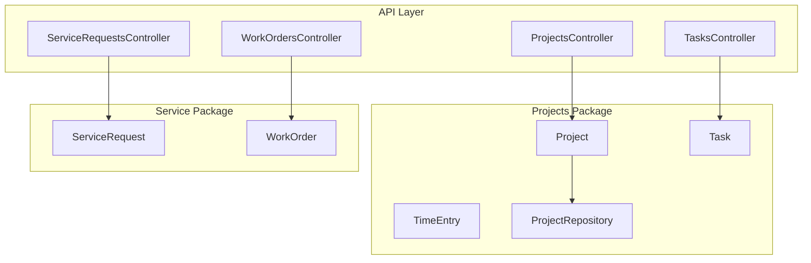
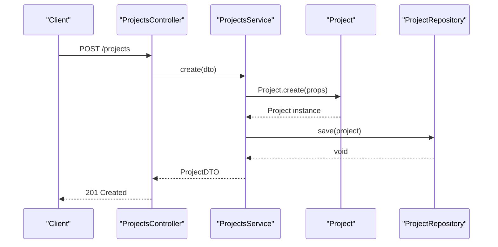
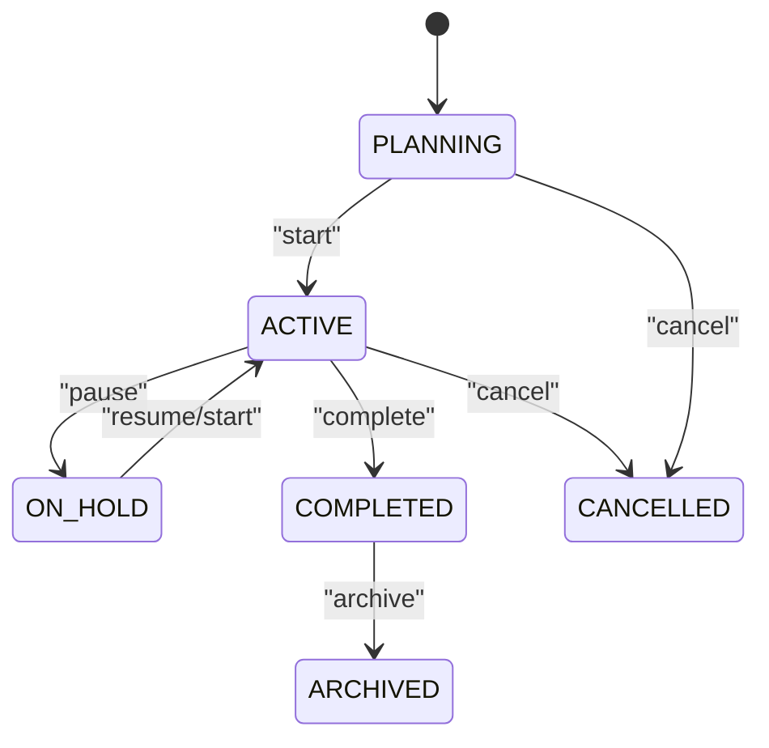
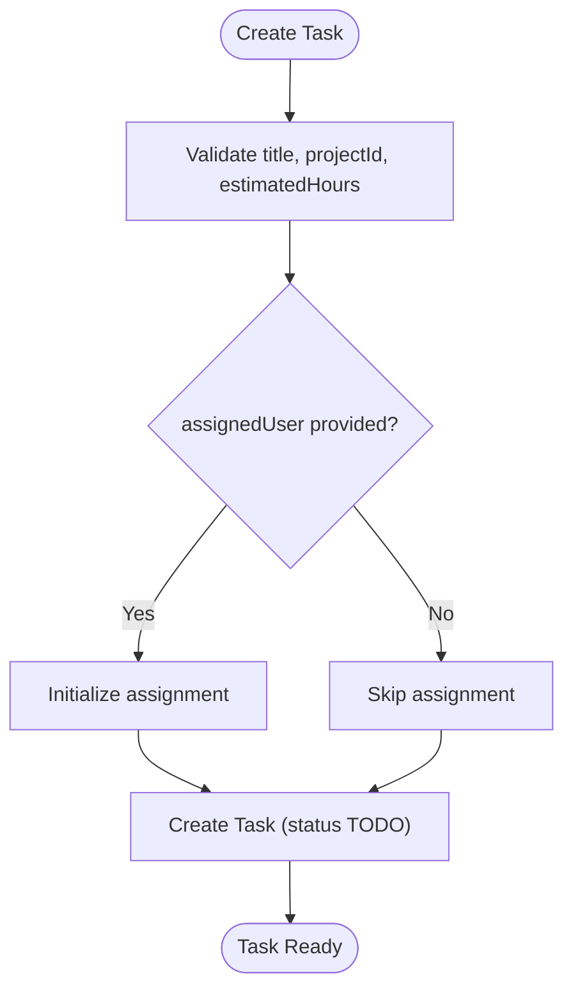
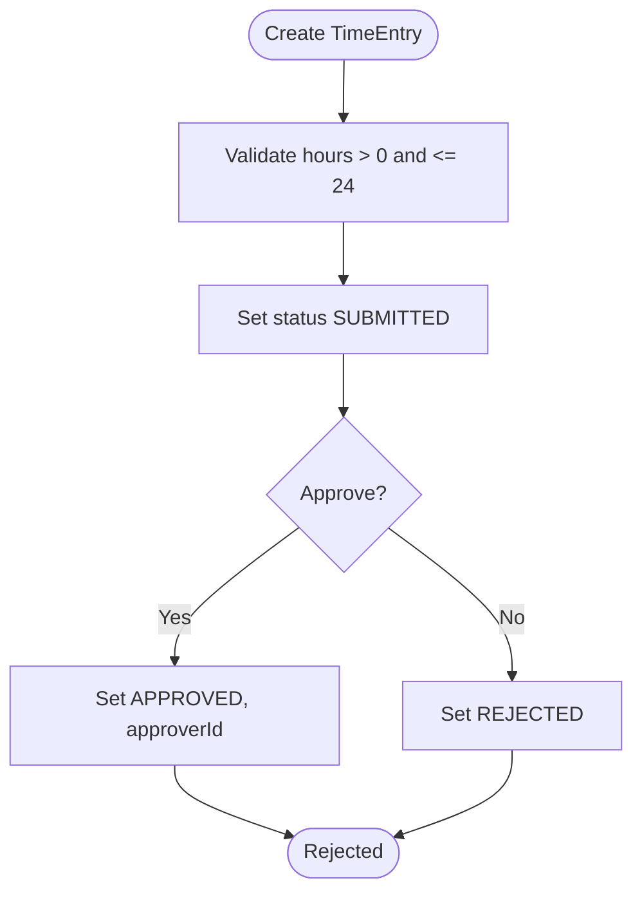
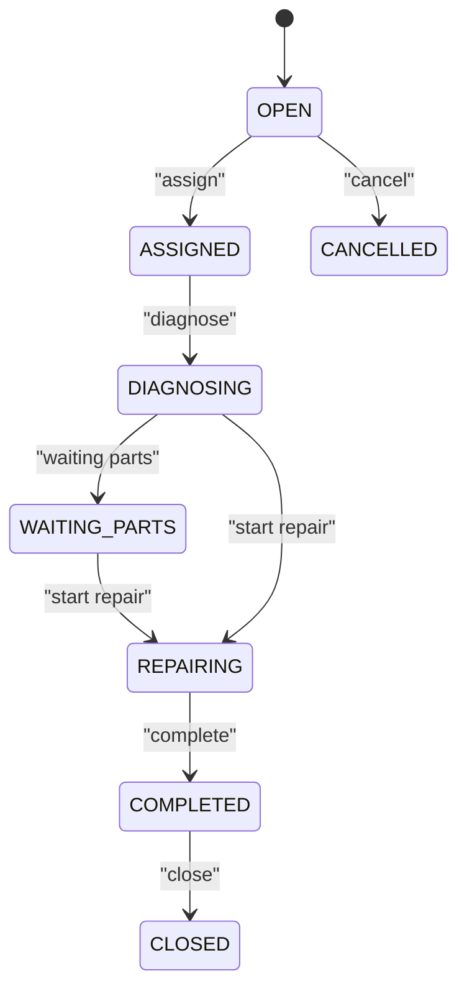
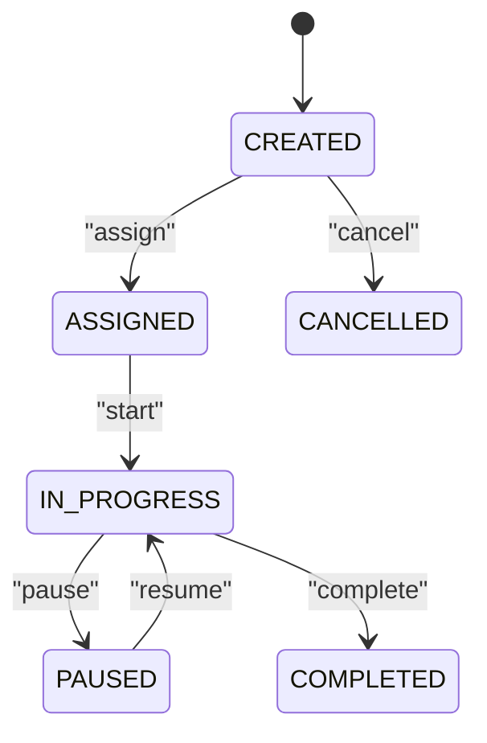
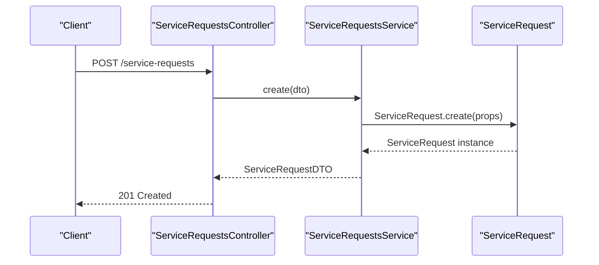
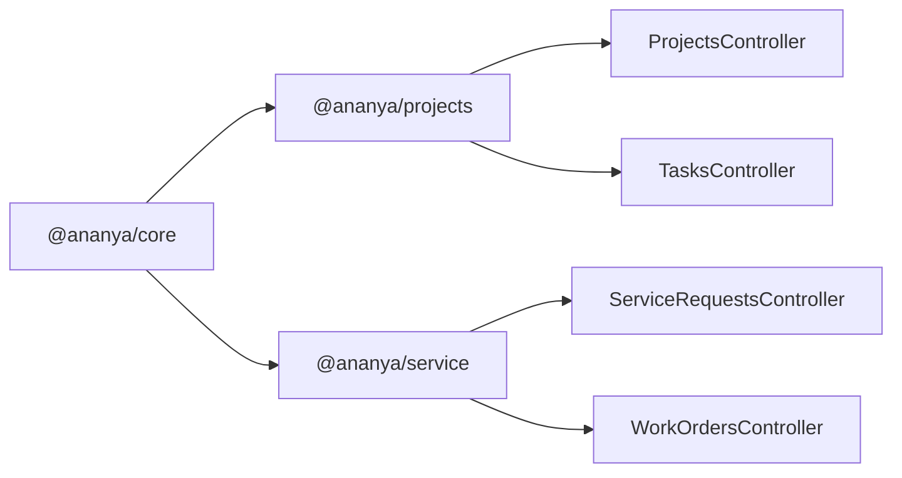

# Project & Service Domain

<cite>
**Referenced Files in This Document**
- [project.ts](file://packages/projects/src/projects/project.ts)
- [task.ts](file://packages/projects/src/tasks/task.ts)
- [time-entry.ts](file://packages/projects/src/time/time-entry.ts)
- [project.repository.ts](file://packages/projects/src/projects/project.repository.ts)
- [projects.controller.ts](file://apps/api/src/projects/projects.controller.ts)
- [service-request.ts](file://packages/service/src/requests/service-request.ts)
- [work-order.ts](file://packages/service/src/work-orders/work-order.ts)
- [service-requests.controller.ts](file://apps/api/src/service-requests/service-requests.controller.ts)
- [work-orders.controller.ts](file://apps/api/src/work-orders/work-orders.controller.ts)
- [tasks.controller.ts](file://apps/api/src/tasks/tasks.controller.ts)
- [0041-project-management.md](file://docs/rfcs/0041-project-management.md)
- [0046-service-requests.md](file://docs/rfcs/0046-service-requests.md)
- [0047-work-orders-and-repairs.md](file://docs/rfcs/0047-work-orders-and-repairs.md)
</cite>

## Table of Contents
1. Introduction
2. Project Structure
3. Core Components
4. Architecture Overview
5. Detailed Component Analysis
6. Dependency Analysis
7. Performance Considerations
8. Troubleshooting Guide
9. Conclusion
10. Appendices

## Introduction
This document explains the Project and Service Domain implementation across the packages and API layer. It covers project planning, task management, service requests, work orders, milestones, time tracking, resource allocation, and integration points with finance and human resources. It also documents business rules for milestones, time tracking, and service level agreements (SLAs), and provides concrete examples from the codebase showing how projects are created, tasks assigned, and service requests resolved.

## Project Structure
The domain is split into two primary packages:
- Projects package: Project lifecycle, milestones, materials, tasks, and time entries.
- Service package: Service requests and work orders for post-delivery support and repairs.

**Diagram sources**
- [project.ts:115-194](file://packages/projects/src/projects/project.ts#L115-L194)
- [task.ts:41-111](file://packages/projects/src/tasks/task.ts#L41-L111)
- [time-entry.ts:26-76](file://packages/projects/src/time/time-entry.ts#L26-L76)
- [project.repository.ts:19-26](file://packages/projects/src/projects/project.repository.ts#L19-L26)
- [service-request.ts:50-112](file://packages/service/src/requests/service-request.ts#L50-L112)
- [work-order.ts:33-88](file://packages/service/src/work-orders/work-order.ts#L33-L88)
- [projects.controller.ts:24-120](file://apps/api/src/projects/projects.controller.ts#L24-L120)
- [tasks.controller.ts:6-61](file://apps/api/src/tasks/tasks.controller.ts#L6-L61)
- [service-requests.controller.ts:14-83](file://apps/api/src/service-requests/service-requests.controller.ts#L14-L83)
- [work-orders.controller.ts:10-70](file://apps/api/src/work-orders/work-orders.controller.ts#L10-L70)

**Section sources**
- [project.ts:115-194](file://packages/projects/src/projects/project.ts#L115-L194)
- [task.ts:41-111](file://packages/projects/src/tasks/task.ts#L41-L111)
- [time-entry.ts:26-76](file://packages/projects/src/time/time-entry.ts#L26-L76)
- [project.repository.ts:19-26](file://packages/projects/src/projects/project.repository.ts#L19-L26)
- [service-request.ts:50-112](file://packages/service/src/requests/service-request.ts#L50-L112)
- [work-order.ts:33-88](file://packages/service/src/work-orders/work-order.ts#L33-L88)
- [projects.controller.ts:24-120](file://apps/api/src/projects/projects.controller.ts#L24-L120)
- [tasks.controller.ts:6-61](file://apps/api/src/tasks/tasks.controller.ts#L6-L61)
- [service-requests.controller.ts:14-83](file://apps/api/src/service-requests/service-requests.controller.ts#L14-L83)
- [work-orders.controller.ts:10-70](file://apps/api/src/work-orders/work-orders.controller.ts#L10-L70)

## Core Components
- Project: Aggregate root managing project metadata, status transitions, milestones, and material allocations. Supports creation, updates, start/pause/complete/archive/cancel, milestone management, and material issue/return flows.
- Task: Work item within a project with assignment, lifecycle (TODO/IN_PROGRESS/BLOCKED/DONE/CANCELLED), and actual hours logging.
- TimeEntry: Time logged against a task with approval workflow (SUBMITTED/APPROVED/REJECTED).
- ServiceRequest: Post-delivery request with lifecycle (OPEN/ASSIGNED/DIAGNOSING/WAITING_PARTS/REPAIRING/COMPLETED/CLOSED/CANCELLED), category, priority, and diagnostic notes.
- WorkOrder: Technical execution unit tied to a service request, with planned vs actual hours, lifecycle (CREATED/ASSIGNED/IN_PROGRESS/PAUSED/COMPLETED/CANCELLED), and hours logging.

Key business rules enforced by domain models:
- Project: Target completion date cannot be before start date; final statuses prevent edits or re-opening; material operations enforce availability and active state constraints.
- Task: Cannot assign/start/complete/cancel in invalid states; hours must be positive.
- TimeEntry: Hours per entry must be between 0 and 24; approved entries cannot be rejected.
- ServiceRequest: Final statuses prevent modifications; required fields validated on create.
- WorkOrder: Planned hours non-negative; hours must be positive; final statuses prevent further changes.

**Section sources**
- [project.ts:156-194](file://packages/projects/src/projects/project.ts#L156-L194)
- [project.ts:200-322](file://packages/projects/src/projects/project.ts#L200-L322)
- [project.ts:324-483](file://packages/projects/src/projects/project.ts#L324-L483)
- [project.ts:485-524](file://packages/projects/src/projects/project.ts#L485-L524)
- [task.ts:72-111](file://packages/projects/src/tasks/task.ts#L72-L111)
- [task.ts:117-172](file://packages/projects/src/tasks/task.ts#L117-L172)
- [time-entry.ts:51-76](file://packages/projects/src/time/time-entry.ts#L51-L76)
- [time-entry.ts:82-97](file://packages/projects/src/time/time-entry.ts#L82-L97)
- [service-request.ts:87-112](file://packages/service/src/requests/service-request.ts#L87-L112)
- [service-request.ts:118-182](file://packages/service/src/requests/service-request.ts#L118-L182)
- [work-order.ts:62-88](file://packages/service/src/work-orders/work-order.ts#L62-L88)
- [work-order.ts:94-146](file://packages/service/src/work-orders/work-order.ts#L94-L146)

## Architecture Overview
The system follows a layered architecture:
- API Controllers expose REST endpoints for each domain.
- Application Services orchestrate commands and coordinate domain aggregates.
- Domain Aggregates encapsulate business logic and invariants.
- Repositories define persistence contracts for aggregates.

**Diagram sources**
- [projects.controller.ts:29-32](file://apps/api/src/projects/projects.controller.ts#L29-L32)
- [project.ts:156-194](file://packages/projects/src/projects/project.ts#L156-L194)
- [project.repository.ts:19-26](file://packages/projects/src/projects/project.repository.ts#L19-L26)

**Section sources**
- [projects.controller.ts:24-120](file://apps/api/src/projects/projects.controller.ts#L24-L120)
- [project.ts:115-194](file://packages/projects/src/projects/project.ts#L115-L194)
- [project.repository.ts:19-26](file://packages/projects/src/projects/project.repository.ts#L19-L26)

## Detailed Component Analysis

### Project Lifecycle and Milestones
- Creation initializes a project in PLANNING with validation of name and dates.
- Status transitions: Start (PLANNING -> ACTIVE), Pause (ACTIVE -> ON_HOLD), Complete (to COMPLETED), Archive (to ARCHIVED), Cancel (to CANCELLED).
- Milestones can be added and completed; completion sets status to COMPLETED and percentage to 100.
- Material allocation supports allocating, issuing, and returning components with strict balance checks and activity logging.

**Diagram sources**
- [project.ts:241-322](file://packages/projects/src/projects/project.ts#L241-L322)

**Section sources**
- [project.ts:156-194](file://packages/projects/src/projects/project.ts#L156-L194)
- [project.ts:241-322](file://packages/projects/src/projects/project.ts#L241-L322)
- [project.ts:485-524](file://packages/projects/src/projects/project.ts#L485-L524)

### Task Management
- Tasks belong to projects and support assignment, lifecycle transitions (TODO/IN_PROGRESS/BLOCKED/DONE/CANCELLED), and actual hours logging.
- Assignment records an audit trail via assignments array.

**Diagram sources**
- [task.ts:72-111](file://packages/projects/src/tasks/task.ts#L72-L111)

**Section sources**
- [task.ts:72-111](file://packages/projects/src/tasks/task.ts#L72-L111)
- [task.ts:117-172](file://packages/projects/src/tasks/task.ts#L117-L172)

### Time Tracking
- Time entries are created against tasks with hours bounded to 0 < hours <= 24.
- Approval workflow enforces that approved entries cannot be rejected.

**Diagram sources**
- [time-entry.ts:51-76](file://packages/projects/src/time/time-entry.ts#L51-L76)
- [time-entry.ts:82-97](file://packages/projects/src/time/time-entry.ts#L82-L97)

**Section sources**
- [time-entry.ts:51-76](file://packages/projects/src/time/time-entry.ts#L51-L76)
- [time-entry.ts:82-97](file://packages/projects/src/time/time-entry.ts#L82-L97)

### Service Requests
- Creation requires customerId and title; defaults to OPEN status.
- Lifecycle includes assign, diagnose, waiting parts, repair, complete, close, cancel with state guards.

**Diagram sources**
- [service-request.ts:87-112](file://packages/service/src/requests/service-request.ts#L87-L112)
- [service-request.ts:118-182](file://packages/service/src/requests/service-request.ts#L118-L182)

**Section sources**
- [service-request.ts:87-112](file://packages/service/src/requests/service-request.ts#L87-L112)
- [service-request.ts:118-182](file://packages/service/src/requests/service-request.ts#L118-L182)

### Work Orders
- Linked to a service request; supports assign, start, pause, log hours, complete, cancel.
- Planned hours non-negative; hours logged must be positive; final states block further changes.

**Diagram sources**
- [work-order.ts:62-88](file://packages/service/src/work-orders/work-order.ts#L62-L88)
- [work-order.ts:94-146](file://packages/service/src/work-orders/work-order.ts#L94-L146)

**Section sources**
- [work-order.ts:62-88](file://packages/service/src/work-orders/work-order.ts#L62-L88)
- [work-order.ts:94-146](file://packages/service/src/work-orders/work-order.ts#L94-L146)

### API Integration Points
- ProjectsController exposes endpoints for project CRUD, status actions, milestones, and materials.
- TasksController exposes endpoints for task CRUD, assignment, lifecycle actions.
- ServiceRequestsController exposes endpoints for service request lifecycle.
- WorkOrdersController exposes endpoints for work order lifecycle and hours logging.

**Diagram sources**
- [service-requests.controller.ts:20-23](file://apps/api/src/service-requests/service-requests.controller.ts#L20-L23)
- [service-request.ts:87-112](file://packages/service/src/requests/service-request.ts#L87-L112)

**Section sources**
- [projects.controller.ts:24-120](file://apps/api/src/projects/projects.controller.ts#L24-L120)
- [tasks.controller.ts:6-61](file://apps/api/src/tasks/tasks.controller.ts#L6-L61)
- [service-requests.controller.ts:14-83](file://apps/api/src/service-requests/service-requests.controller.ts#L14-L83)
- [work-orders.controller.ts:10-70](file://apps/api/src/work-orders/work-orders.controller.ts#L10-L70)

## Dependency Analysis
- Projects package depends on core utilities for ID generation and exposes repository contracts for persistence.
- Service package depends on core utilities and defines its own aggregates without direct persistence coupling.
- API controllers depend on application services and domain types from packages.

**Diagram sources**
- [project.ts:1-5](file://packages/projects/src/projects/project.ts#L1-L5)
- [service-request.ts:1-2](file://packages/service/src/requests/service-request.ts#L1-L2)
- [work-order.ts:1-2](file://packages/service/src/work-orders/work-order.ts#L1-L2)
- [projects.controller.ts:22-23](file://apps/api/src/projects/projects.controller.ts#L22-L23)
- [service-requests.controller.ts:8-12](file://apps/api/src/service-requests/service-requests.controller.ts#L8-L12)
- [work-orders.controller.ts:8-9](file://apps/api/src/work-orders/work-orders.controller.ts#L8-L9)
- [tasks.controller.ts:4-5](file://apps/api/src/tasks/tasks.controller.ts#L4-L5)

**Section sources**
- [project.ts:1-5](file://packages/projects/src/projects/project.ts#L1-L5)
- [service-request.ts:1-2](file://packages/service/src/requests/service-request.ts#L1-L2)
- [work-order.ts:1-2](file://packages/service/src/work-orders/work-order.ts#L1-L2)
- [projects.controller.ts:22-23](file://apps/api/src/projects/projects.controller.ts#L22-L23)
- [service-requests.controller.ts:8-12](file://apps/api/src/service-requests/service-requests.controller.ts#L8-L12)
- [work-orders.controller.ts:8-9](file://apps/api/src/work-orders/work-orders.controller.ts#L8-L9)
- [tasks.controller.ts:4-5](file://apps/api/src/tasks/tasks.controller.ts#L4-L5)

## Performance Considerations
- Use repository queries with filters (status, priority, owner, customer, search) to minimize data transfer and improve list performance.
- Batch operations where possible (e.g., bulk task assignments) to reduce round trips.
- Avoid deep object graphs in responses; return DTOs with only necessary fields.
- Cache frequently accessed master data (categories, priorities) at the API layer if appropriate.
- For large project histories, paginate activities and milestones.

[No sources needed since this section provides general guidance]

## Troubleshooting Guide
Common errors and their causes:
- Invalid project status transitions: Attempting to start/complete/cancel in terminal states or incorrect current state.
- Material operation failures: Insufficient allocated balance or attempting issue/return outside ACTIVE status.
- Task state violations: Assigning/completing/canceling tasks in invalid states; negative or zero hours.
- Time entry validation: Hours out of range or approving already approved entries.
- Service request/state guard violations: Modifying closed/cancelled requests; missing required fields on create.
- Work order state guard violations: Logging hours or starting in terminal states; negative planned hours.

Mitigations:
- Validate inputs at API layer using DTOs and domain-level guards in aggregates.
- Provide clear error messages aligned with domain invariants.
- Log activities for all state transitions and material movements for auditability.

**Section sources**
- [project.ts:200-322](file://packages/projects/src/projects/project.ts#L200-L322)
- [project.ts:324-483](file://packages/projects/src/projects/project.ts#L324-L483)
- [task.ts:117-172](file://packages/projects/src/tasks/task.ts#L117-L172)
- [time-entry.ts:82-97](file://packages/projects/src/time/time-entry.ts#L82-L97)
- [service-request.ts:118-182](file://packages/service/src/requests/service-request.ts#L118-L182)
- [work-order.ts:94-146](file://packages/service/src/work-orders/work-order.ts#L94-L146)

## Conclusion
The Project and Service Domain implementation provides robust modeling for project planning, task execution, service request resolution, and work order management. State machines and domain invariants ensure consistency, while APIs enable seamless integration. Resource allocation and time tracking support cost accounting and utilization reporting. Future enhancements include SLA escalation triggers and deeper finance/HR integrations for budgeting and labor costing.

[No sources needed since this section summarizes without analyzing specific files]

## Appendices

### Business Rules Summary
- Project milestones: Add milestones with due dates; complete sets status and percentage; final project statuses restrict edits.
- Time tracking: Entries validated for hours range; approvals enforce auditability; approved entries cannot be rejected.
- Service level agreements: Service requests support priority and category; future extensions include automated SLA escalations.

**Section sources**
- [project.ts:485-524](file://packages/projects/src/projects/project.ts#L485-L524)
- [time-entry.ts:51-76](file://packages/projects/src/time/time-entry.ts#L51-L76)
- [0046-service-requests.md:126-129](file://docs/rfcs/0046-service-requests.md#L126-L129)

### Concrete Examples from Codebase
- Project creation: See aggregate creation and initial activity logging.
  - [project.ts:156-194](file://packages/projects/src/projects/project.ts#L156-L194)
- Task assignment: See assignment method and audit trail.
  - [task.ts:117-129](file://packages/projects/src/tasks/task.ts#L117-L129)
- Service request resolution: See assign/diagnose/repair/complete/close flows.
  - [service-request.ts:118-182](file://packages/service/src/requests/service-request.ts#L118-L182)

**Section sources**
- [project.ts:156-194](file://packages/projects/src/projects/project.ts#L156-L194)
- [task.ts:117-129](file://packages/projects/src/tasks/task.ts#L117-L129)
- [service-request.ts:118-182](file://packages/service/src/requests/service-request.ts#L118-L182)

### RFC References
- Project Management RFC outlines scope, language, state machine, and API design.
- Service Requests RFC defines lifecycle, categories, and cross-module references.
- Work Orders RFC specifies labor tracking and state transitions.

**Section sources**
- [0041-project-management.md:1-112](file://docs/rfcs/0041-project-management.md#L1-L112)
- [0046-service-requests.md:1-129](file://docs/rfcs/0046-service-requests.md#L1-L129)
- [0047-work-orders-and-repairs.md:1-126](file://docs/rfcs/0047-work-orders-and-repairs.md#L1-L126)