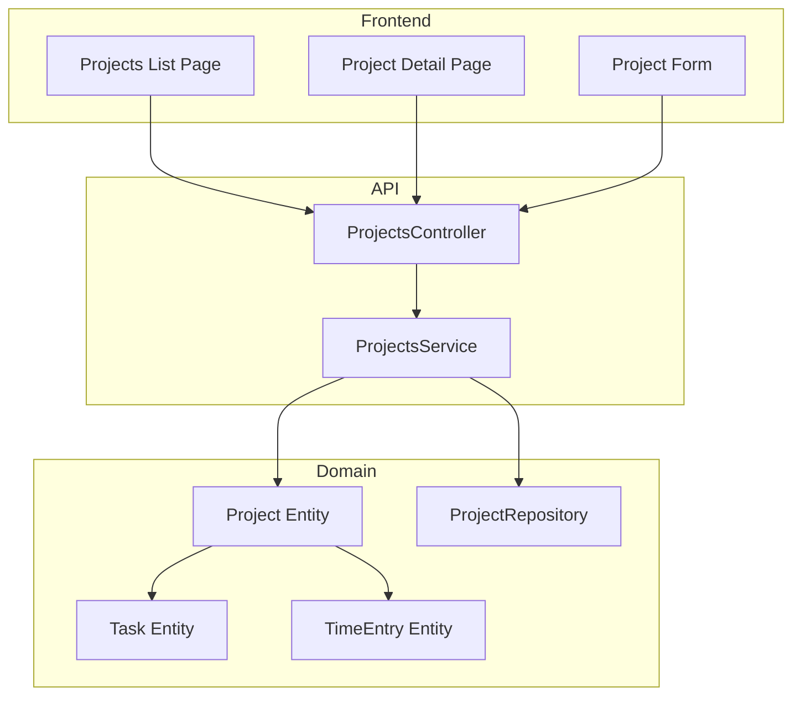
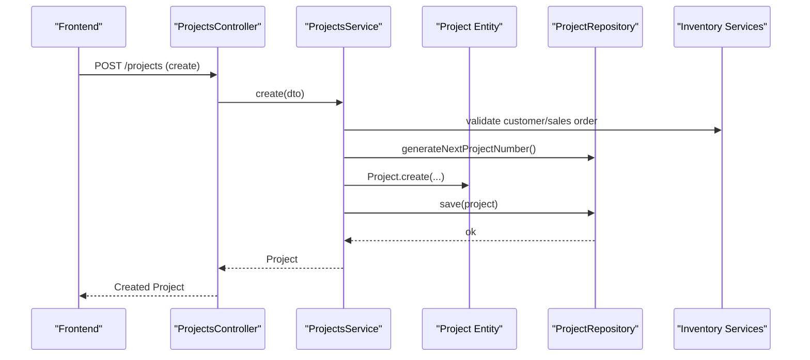
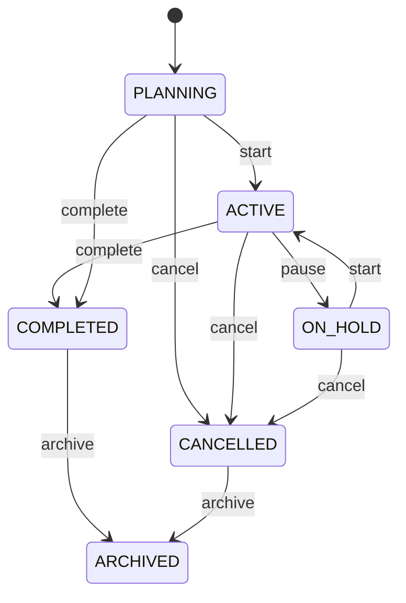
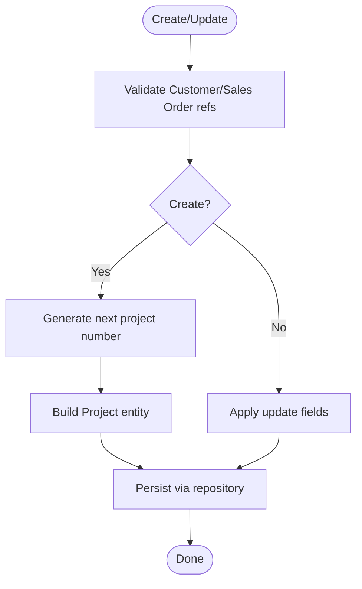
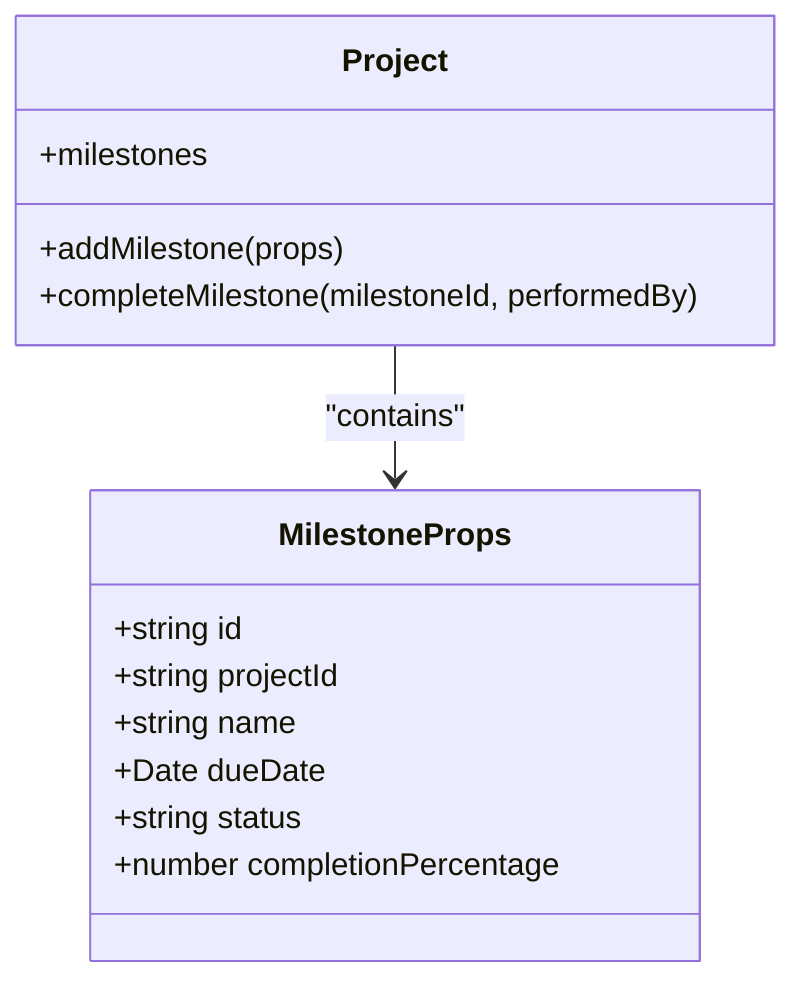
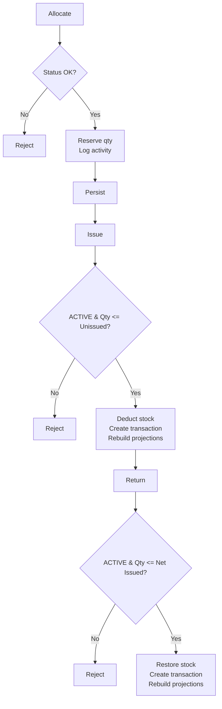
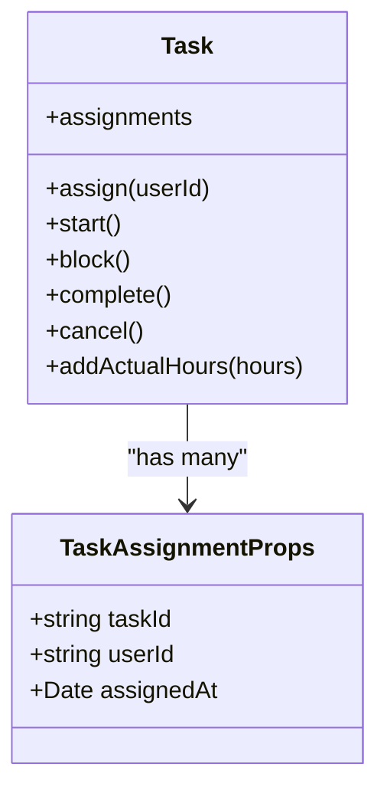
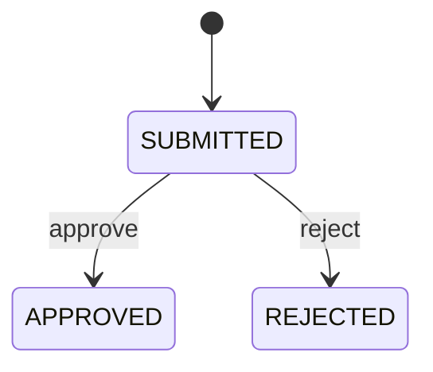
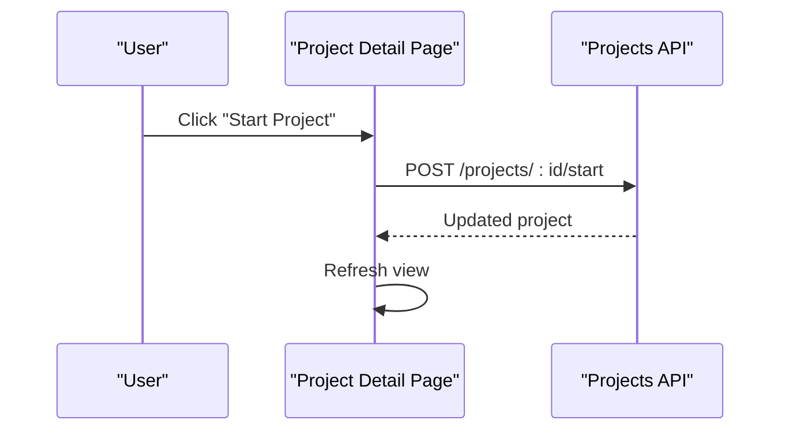
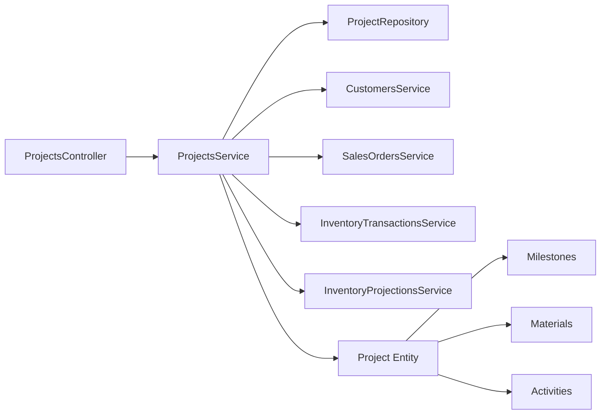

# Project Management

<cite>
**Referenced Files in This Document**
- [projects.controller.ts](file://apps/api/src/projects/projects.controller.ts)
- [projects.service.ts](file://apps/api/src/projects/projects.service.ts)
- [dtos.ts](file://apps/api/src/projects/dtos.ts)
- [project.ts](file://packages/projects/src/projects/project.ts)
- [project.repository.ts](file://packages/projects/src/projects/project.repository.ts)
- [task.ts](file://packages/projects/src/tasks/task.ts)
- [time-entry.ts](file://packages/projects/src/time/time-entry.ts)
- [page.tsx (Projects list)](file://apps/web/app/projects/page.tsx)
- [page.tsx (Project detail)](file://apps/web/app/projects/[id]/page.tsx)
- [project-form.tsx](file://apps/web/components/projects/project-form.tsx)
</cite>

## Table of Contents
1. Introduction
2. Project Structure
3. Core Components
4. Architecture Overview
5. Detailed Component Analysis
6. Dependency Analysis
7. Performance Considerations
8. Troubleshooting Guide
9. Conclusion
10. Appendices

## Introduction
This document explains the Project Management functionality, including project lifecycle, creation workflows, state management, milestones, resource allocation, and integrations with tasks and time tracking. It covers the data model (project types, status, priorities), API endpoints for CRUD and operations, frontend components for visualization and interaction, and reporting considerations.

## Project Structure
The feature spans three layers:
- API layer (NestJS): Controllers expose REST endpoints; services orchestrate domain logic and integrate with inventory and sales modules.
- Domain layer (packages/projects): Strongly typed entities and repositories define project lifecycle, milestones, materials, activities, tasks, and time entries.
- Frontend (Next.js app): Pages and forms provide UI for listing, creating/editing projects, managing materials, and performing lifecycle actions.

**Diagram sources**
- [projects.controller.ts:24-120](file://apps/api/src/projects/projects.controller.ts#L24-L120)
- [projects.service.ts:29-282](file://apps/api/src/projects/projects.service.ts#L29-L282)
- [project.ts:115-543](file://packages/projects/src/projects/project.ts#L115-L543)
- [project.repository.ts:19-26](file://packages/projects/src/projects/project.repository.ts#L19-L26)
- [task.ts:41-174](file://packages/projects/src/tasks/task.ts#L41-L174)
- [time-entry.ts:26-99](file://packages/projects/src/time/time-entry.ts#L26-L99)

**Section sources**
- [projects.controller.ts:24-120](file://apps/api/src/projects/projects.controller.ts#L24-L120)
- [projects.service.ts:29-282](file://apps/api/src/projects/projects.service.ts#L29-L282)
- [project.ts:115-543](file://packages/projects/src/projects/project.ts#L115-L543)
- [project.repository.ts:19-26](file://packages/projects/src/projects/project.repository.ts#L19-L26)
- [task.ts:41-174](file://packages/projects/src/tasks/task.ts#L41-L174)
- [time-entry.ts:26-99](file://packages/projects/src/time/time-entry.ts#L26-L99)
- [page.tsx (Projects list):118-455](file://apps/web/app/projects/page.tsx#L118-L455)
- [page.tsx (Project detail):121-800](file://apps/web/app/projects/[id]/page.tsx#L121-L800)
- [project-form.tsx:59-379](file://apps/web/components/projects/project-form.tsx#L59-L379)

## Core Components
- ProjectsController: Exposes REST endpoints for project CRUD, lifecycle transitions, milestone management, and material allocation/issue/return.
- ProjectsService: Validates inputs, enforces business rules, coordinates with external services (customers, sales orders, inventory transactions/projections), persists changes via repository.
- Project entity: Encapsulates project state machine, milestones, materials, activities, and validation constraints.
- Repository interface: Defines persistence operations and query filters.
- Tasks and TimeEntry entities: Support task assignment, hours logging, and approval workflow tied to projects.
- Frontend pages and form: Provide user interactions for listing, creating/editing projects, running lifecycle actions, and allocating/issuing/returning materials.

**Section sources**
- [projects.controller.ts:24-120](file://apps/api/src/projects/projects.controller.ts#L24-L120)
- [projects.service.ts:29-282](file://apps/api/src/projects/projects.service.ts#L29-L282)
- [project.ts:115-543](file://packages/projects/src/projects/project.ts#L115-L543)
- [project.repository.ts:19-26](file://packages/projects/src/projects/project.repository.ts#L19-L26)
- [task.ts:41-174](file://packages/projects/src/tasks/task.ts#L41-L174)
- [time-entry.ts:26-99](file://packages/projects/src/time/time-entry.ts#L26-L99)
- [page.tsx (Projects list):118-455](file://apps/web/app/projects/page.tsx#L118-L455)
- [page.tsx (Project detail):121-800](file://apps/web/app/projects/[id]/page.tsx#L121-L800)
- [project-form.tsx:59-379](file://apps/web/components/projects/project-form.tsx#L59-L379)

## Architecture Overview
The system follows a layered architecture:
- Presentation: Next.js pages render lists, details, and forms; they call the API client methods.
- Application: NestJS controller routes requests to service methods.
- Domain: Project entity enforces lifecycle rules, milestones, and material accounting; tasks and time entries are domain models that can be associated with projects.
- Infrastructure: Repository abstraction persists projects; services integrate with customers, sales orders, and inventory subsystems.

**Diagram sources**
- [projects.controller.ts:29-32](file://apps/api/src/projects/projects.controller.ts#L29-L32)
- [projects.service.ts:40-66](file://apps/api/src/projects/projects.service.ts#L40-L66)
- [project.ts:156-194](file://packages/projects/src/projects/project.ts#L156-L194)
- [project.repository.ts:23-25](file://packages/projects/src/projects/project.repository.ts#L23-L25)

**Section sources**
- [projects.controller.ts:24-120](file://apps/api/src/projects/projects.controller.ts#L24-L120)
- [projects.service.ts:29-282](file://apps/api/src/projects/projects.service.ts#L29-L282)
- [project.ts:115-543](file://packages/projects/src/projects/project.ts#L115-L543)
- [project.repository.ts:19-26](file://packages/projects/src/projects/project.repository.ts#L19-L26)

## Detailed Component Analysis

### Project Lifecycle and State Machine
- States: PLANNING, ACTIVE, ON_HOLD, COMPLETED, ARCHIVED, CANCELLED.
- Transitions enforced by the Project entity:
  - Start: PLANNING/ON_HOLD → ACTIVE
  - Pause: ACTIVE → ON_HOLD
  - Complete: non-CANCELLED/ARCHIVED → COMPLETED
  - Archive: any except ARCHIVED/CANCELLED → ARCHIVED
  - Cancel: non-COMPLETED/ARCHIVED → CANCELLED
- Activities are logged on each transition and key operations.

**Diagram sources**
- [project.ts:241-322](file://packages/projects/src/projects/project.ts#L241-L322)

**Section sources**
- [project.ts:241-322](file://packages/projects/src/projects/project.ts#L241-L322)

### Project Creation and Update Workflows
- Create:
  - Validate optional references (customer, sales order).
  - Generate unique project number.
  - Build Project entity with defaults (type INTERNAL, priority MEDIUM, status PLANNING).
  - Persist via repository.
- Update:
  - Load project, validate references if changed.
  - Apply updates and log activity.
  - Persist changes.

**Diagram sources**
- [projects.service.ts:40-97](file://apps/api/src/projects/projects.service.ts#L40-L97)
- [project.ts:156-194](file://packages/projects/src/projects/project.ts#L156-L194)

**Section sources**
- [projects.service.ts:40-97](file://apps/api/src/projects/projects.service.ts#L40-L97)
- [project.ts:156-194](file://packages/projects/src/projects/project.ts#L156-L194)

### Milestones
- Add milestone with name, due date, and optional completion percentage.
- Complete milestone sets status to COMPLETED and percentage to 100%.
- Milestones are stored within the project entity and persisted together.

**Diagram sources**
- [project.ts:485-524](file://packages/projects/src/projects/project.ts#L485-L524)

**Section sources**
- [project.ts:485-524](file://packages/projects/src/projects/project.ts#L485-L524)

### Material Allocation, Issue, and Return
- Allocate:
  - Reserve quantity against a component at a location.
  - Enforce positive quantity and non-finished states.
  - Log activity and persist.
- Issue:
  - Only allowed for ACTIVE projects.
  - Validates unissued allocated balance.
  - Creates inventory transaction and rebuilds projections.
- Return:
  - Only allowed for ACTIVE projects.
  - Validates net issued balance.
  - Creates return transaction and rebuilds projections.

**Diagram sources**
- [projects.service.ts:185-280](file://apps/api/src/projects/projects.service.ts#L185-L280)
- [project.ts:324-483](file://packages/projects/src/projects/project.ts#L324-L483)

**Section sources**
- [projects.service.ts:185-280](file://apps/api/src/projects/projects.service.ts#L185-L280)
- [project.ts:324-483](file://packages/projects/src/projects/project.ts#L324-L483)

### Tasks and Team Assignment
- Tasks belong to projects and support assignment, status transitions, and actual hours logging.
- Assignments track who is assigned and when.
- Hours logged increment actual hours on the task.

**Diagram sources**
- [task.ts:41-174](file://packages/projects/src/tasks/task.ts#L41-L174)

**Section sources**
- [task.ts:41-174](file://packages/projects/src/tasks/task.ts#L41-L174)

### Time Tracking Integration
- TimeEntry records hours per task with status flow: SUBMITTED → APPROVED or REJECTED.
- Validations ensure hours are within bounds and entries are valid.
- Approval workflow supports auditing and reporting.

**Diagram sources**
- [time-entry.ts:26-99](file://packages/projects/src/time/time-entry.ts#L26-L99)

**Section sources**
- [time-entry.ts:26-99](file://packages/projects/src/time/time-entry.ts#L26-L99)

### Frontend Visualization and Interactions
- Projects list page:
  - Displays KPIs (total, active, planning, completed).
  - Provides filters for status, priority, type.
  - Opens modal to create/edit projects using ProjectForm.
- Project detail page:
  - Shows project info, milestones, materials, and activities.
  - Enables lifecycle actions (start, pause, complete, archive, cancel).
  - Supports allocate/issue/return flows with validations and error handling.
- Project form:
  - Collects name, type, description, manager, owner, dates, priority.
  - Defaults manager/owner to current user for new projects.
  - Calls API to create/update and refreshes UI.

**Diagram sources**
- [page.tsx (Project detail):227-243](file://apps/web/app/projects/[id]/page.tsx#L227-L243)
- [projects.controller.ts:63-66](file://apps/api/src/projects/projects.controller.ts#L63-L66)

**Section sources**
- [page.tsx (Projects list):118-455](file://apps/web/app/projects/page.tsx#L118-L455)
- [page.tsx (Project detail):121-800](file://apps/web/app/projects/[id]/page.tsx#L121-L800)
- [project-form.tsx:59-379](file://apps/web/components/projects/project-form.tsx#L59-L379)

## Dependency Analysis
- Controller depends on Service and DTOs.
- Service depends on:
  - ProjectRepository (abstraction)
  - External services: Customers, SalesOrders, InventoryTransactions, InventoryProjections
- Domain Project depends on:
  - Types and errors from packages/projects
  - Entities for Milestones, Materials, Activities
- Frontend pages depend on API clients and shared UI components.

**Diagram sources**
- [projects.controller.ts:24-120](file://apps/api/src/projects/projects.controller.ts#L24-L120)
- [projects.service.ts:29-282](file://apps/api/src/projects/projects.service.ts#L29-L282)
- [project.ts:115-543](file://packages/projects/src/projects/project.ts#L115-L543)

**Section sources**
- [projects.controller.ts:24-120](file://apps/api/src/projects/projects.controller.ts#L24-L120)
- [projects.service.ts:29-282](file://apps/api/src/projects/projects.service.ts#L29-L282)
- [project.ts:115-543](file://packages/projects/src/projects/project.ts#L115-L543)

## Performance Considerations
- Batch queries where possible (e.g., loading components and locations concurrently in the frontend).
- Avoid unnecessary re-renders by memoizing derived data (used in frontend for projections and options).
- Rebuild inventory projections only after material issue/return to keep projections consistent without excessive overhead.
- Use repository findMany with filters to reduce payload size and server load.

[No sources needed since this section provides general guidance]

## Troubleshooting Guide
Common issues and resolutions:
- Cannot edit project in final states: Ensure project is not COMPLETED, ARCHIVED, or CANCELLED before updating.
- Cannot start/pause/complete/cancel due to invalid state transitions: Verify current status allows the requested action.
- Material allocation/issue/return failures:
  - Insufficient available stock at selected location during allocation/issue.
  - Invalid quantities (must be > 0).
  - Missing allocations for issue/return operations.
- Not found errors: Confirm project ID exists before calling read/update endpoints.

**Section sources**
- [project.ts:200-322](file://packages/projects/src/projects/project.ts#L200-L322)
- [project.ts:324-483](file://packages/projects/src/projects/project.ts#L324-L483)
- [projects.service.ts:185-280](file://apps/api/src/projects/projects.service.ts#L185-L280)

## Conclusion
The Project Management module provides a robust, stateful project lifecycle with integrated milestones, material accounting, and links to tasks and time tracking. The API enforces business rules and integrates with inventory to maintain accurate stock levels, while the frontend offers intuitive workflows for creation, editing, and operational actions. Reporting can leverage activities, milestones, tasks, and time entries to derive insights into progress, costs, and productivity.

[No sources needed since this section summarizes without analyzing specific files]

## Appendices

### API Endpoints Summary
- POST /projects — Create project
- GET /projects — List projects with filters (status, priority, customerId, salesOrderId, projectManager, search)
- GET /projects/:id — Get project by ID
- PUT /projects/:id — Update project
- POST /projects/:id/start — Start project
- POST /projects/:id/pause — Pause project
- POST /projects/:id/complete — Complete project
- POST /projects/:id/archive — Archive project
- POST /projects/:id/cancel — Cancel project
- POST /projects/:id/milestones — Add milestone
- POST /projects/:id/milestones/:milestoneId/complete — Complete milestone
- POST /projects/:id/materials/allocate — Allocate material
- POST /projects/:id/materials/issue — Issue material
- POST /projects/:id/materials/return — Return material

**Section sources**
- [projects.controller.ts:24-120](file://apps/api/src/projects/projects.controller.ts#L24-L120)

### Data Model Highlights
- Project properties include identifiers, scheduling, ownership, linkage to customer/sales order, status, priority, materials, milestones, and activities.
- Milestones capture due dates and completion percentages.
- Materials track allocated, issued, and returned quantities per component/location with units and notes.
- Tasks support assignments, estimated vs actual hours, and status transitions.
- TimeEntries record daily hours per task with approval workflow.

**Section sources**
- [project.ts:65-84](file://packages/projects/src/projects/project.ts#L65-L84)
- [project.ts:54-63](file://packages/projects/src/projects/project.ts#L54-L63)
- [project.ts:30-42](file://packages/projects/src/projects/project.ts#L30-L42)
- [task.ts:15-29](file://packages/projects/src/tasks/task.ts#L15-L29)
- [time-entry.ts:5-16](file://packages/projects/src/time/time-entry.ts#L5-L16)

### Frontend Components Reference
- Projects list page: displays KPIs, filters, and actions; opens ProjectForm for create/edit.
- Project detail page: handles lifecycle actions and material operations; integrates with components and locations APIs for selection and availability checks.
- Project form: collects required fields, validates input, and calls API to create/update projects.

**Section sources**
- [page.tsx (Projects list):118-455](file://apps/web/app/projects/page.tsx#L118-L455)
- [page.tsx (Project detail):121-800](file://apps/web/app/projects/[id]/page.tsx#L121-L800)
- [project-form.tsx:59-379](file://apps/web/components/projects/project-form.tsx#L59-L379)