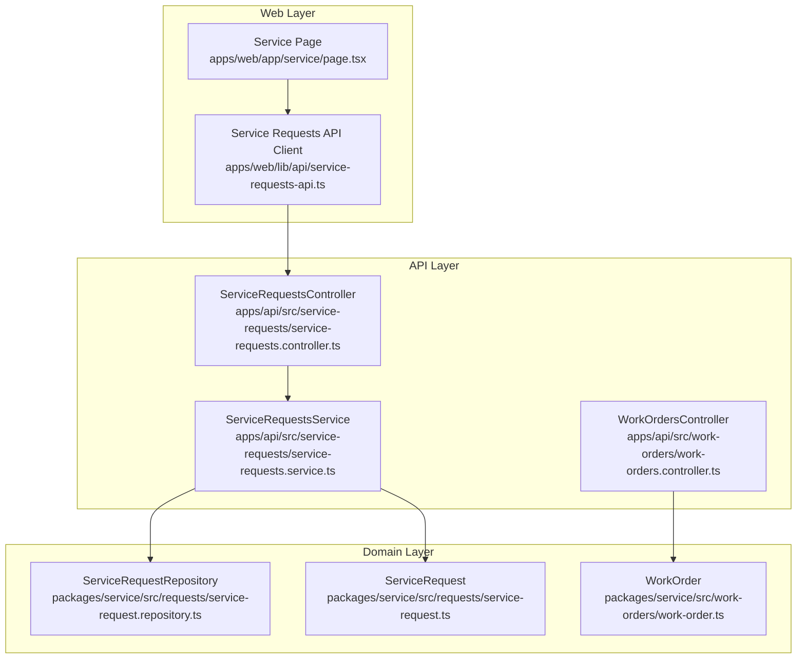
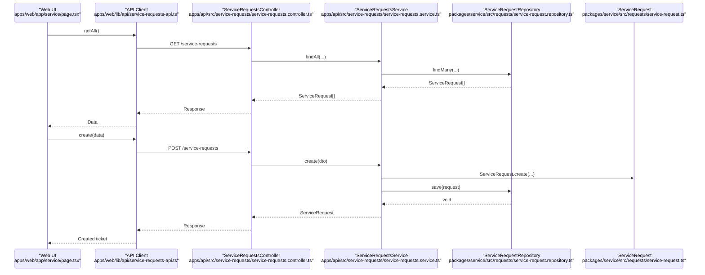
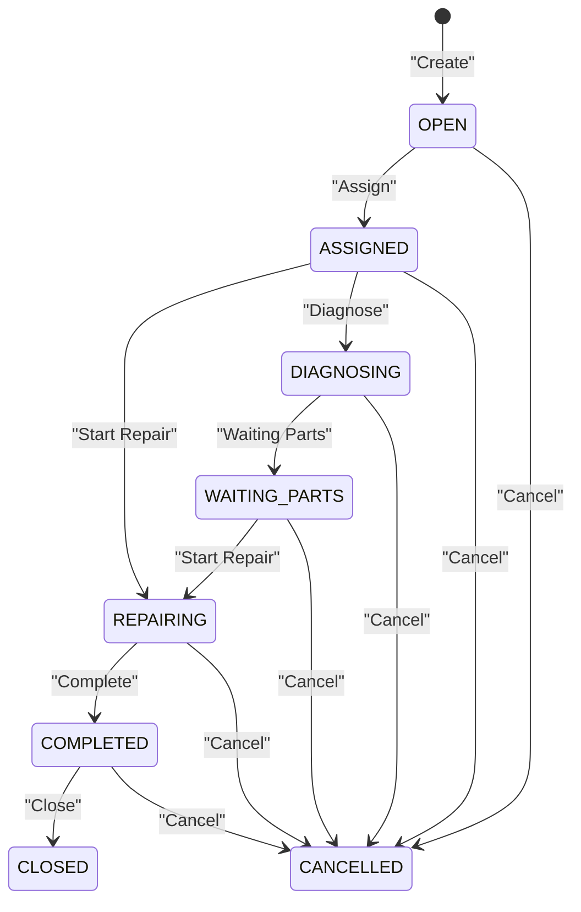
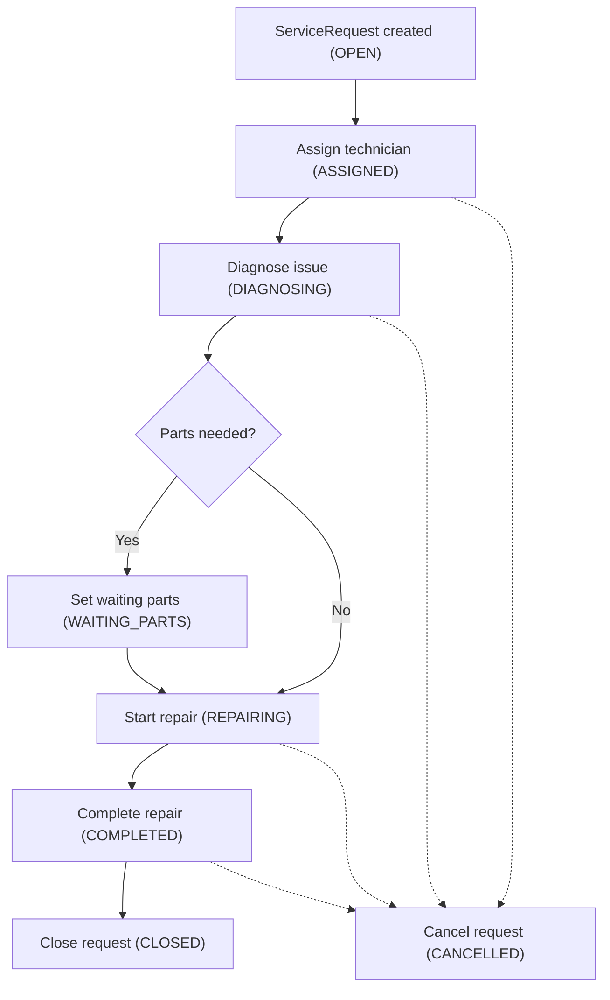
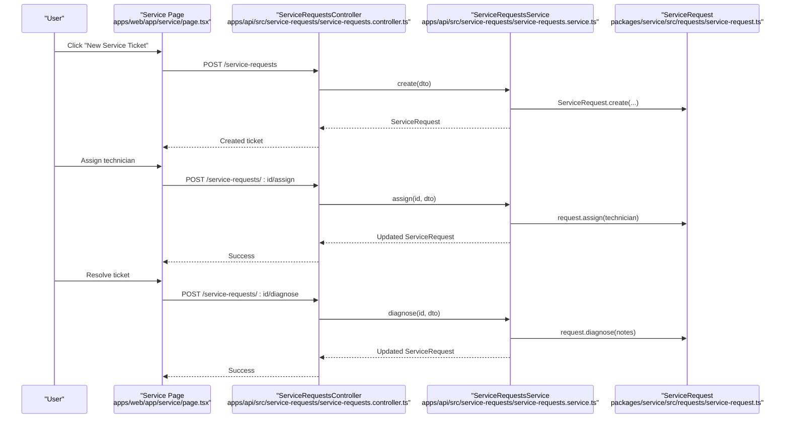
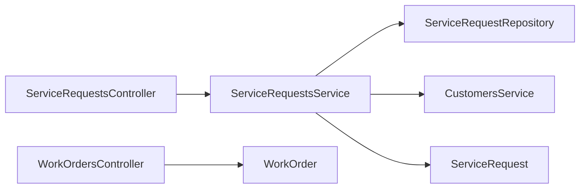

# Service Requests

<cite>
**Referenced Files in This Document**
- [service-requests.controller.ts](file://apps/api/src/service-requests/service-requests.controller.ts)
- [service-requests.service.ts](file://apps/api/src/service-requests/service-requests.service.ts)
- [dtos.ts](file://apps/api/src/service-requests/dtos.ts)
- [0046-service-requests.md](file://docs/rfcs/0046-service-requests.md)
- [0047-work-orders-and-repairs.md](file://docs/rfcs/0047-work-orders-and-repairs.md)
- [service-request.ts](file://packages/service/src/requests/service-request.ts)
- [service-request.repository.ts](file://packages/service/src/requests/service-request.repository.ts)
- [work-order.ts](file://packages/service/src/work-orders/work-order.ts)
- [work-orders.controller.ts](file://apps/api/src/work-orders/work-orders.controller.ts)
- [page.tsx](file://apps/web/app/service/page.tsx)
- [service-requests-api.ts](file://apps/web/lib/api/service-requests-api.ts)
</cite>

## Table of Contents
1. Introduction
2. Project Structure
3. Core Components
4. Architecture Overview
5. Detailed Component Analysis
6. Dependency Analysis
7. Performance Considerations
8. Troubleshooting Guide
9. Conclusion

## Introduction
This document provides comprehensive documentation for Service Request management within the Ananya ERP system. It explains the service request lifecycle, categorization and routing workflows, entities, priority levels, SLA tracking considerations, integrations with work orders, customers, and inventory systems, and examples of creation, assignment, and resolution processes. It also covers service catalog management concepts, escalation procedures, customer communication, API endpoints, and UI components used to handle service requests.

## Project Structure
The Service Requests feature spans three layers:
- Domain layer (packages/service): Defines domain models, value objects, and repository contracts for ServiceRequest and WorkOrder.
- Application/API layer (apps/api): Exposes HTTP endpoints and orchestrates business operations via controllers and services.
- Presentation layer (apps/web): Provides user interfaces for listing, creating, and navigating service requests.

**Diagram sources**
- [service-request.ts](file://packages/service/src/requests/service-request.ts)
- [service-request.repository.ts](file://packages/service/src/requests/service-request.repository.ts)
- [work-order.ts](file://packages/service/src/work-orders/work-order.ts)
- [service-requests.controller.ts](file://apps/api/src/service-requests/service-requests.controller.ts)
- [service-requests.service.ts](file://apps/api/src/service-requests/service-requests.service.ts)
- [work-orders.controller.ts](file://apps/api/src/work-orders/work-orders.controller.ts)
- [page.tsx](file://apps/web/app/service/page.tsx)
- [service-requests-api.ts](file://apps/web/lib/api/service-requests-api.ts)

**Section sources**
- [service-requests.controller.ts](file://apps/api/src/service-requests/service-requests.controller.ts)
- [service-requests.service.ts](file://apps/api/src/service-requests/service-requests.service.ts)
- [service-request.ts](file://packages/service/src/requests/service-request.ts)
- [service-request.repository.ts](file://packages/service/src/requests/service-request.repository.ts)
- [work-order.ts](file://packages/service/src/work-orders/work-order.ts)
- [work-orders.controller.ts](file://apps/api/src/work-orders/work-orders.controller.ts)
- [page.tsx](file://apps/web/app/service/page.tsx)
- [service-requests-api.ts](file://apps/web/lib/api/service-requests-api.ts)

## Core Components
- ServiceRequest domain model: Encapsulates state transitions, validation rules, and core attributes such as customer reference, sales order/project references, component/serial number, priority, category, status, assigned technician, and diagnostic notes.
- ServiceRequestRepository contract: Defines persistence operations including find by id/number, list with filters, save, and generating next service numbers.
- ServiceRequestsController: Exposes REST endpoints for CRUD and lifecycle actions (assign, diagnose, waiting parts, start repair, complete, close, cancel).
- ServiceRequestsService: Orchestrates application logic, validates inputs, enforces invariants, and persists changes through the repository.
- WorkOrder domain model: Represents technical tasks linked to a ServiceRequest, with its own lifecycle and labor hours tracking.
- Web UI: Lists service requests, creates new tickets, and navigates to details; integrates with the backend via an API client.

Key data types:
- ServiceRequestStatus: OPEN, ASSIGNED, DIAGNOSING, WAITING_PARTS, REPAIRING, COMPLETED, CLOSED, CANCELLED.
- ServicePriority: LOW, MEDIUM, HIGH, URGENT.
- ServiceCategory: HARDWARE, SOFTWARE, MAINTENANCE, INSTALLATION, INSPECTION.
- WorkOrderStatus: CREATED, ASSIGNED, IN_PROGRESS, PAUSED, COMPLETED, CANCELLED.
- WorkOrderPriority: LOW, MEDIUM, HIGH, URGENT.

**Section sources**
- [service-request.ts](file://packages/service/src/requests/service-request.ts)
- [service-request.repository.ts](file://packages/service/src/requests/service-request.repository.ts)
- [service-requests.controller.ts](file://apps/api/src/service-requests/service-requests.controller.ts)
- [service-requests.service.ts](file://apps/api/src/service-requests/service-requests.service.ts)
- [work-order.ts](file://packages/service/src/work-orders/work-order.ts)
- [0046-service-requests.md](file://docs/rfcs/0046-service-requests.md)
- [0047-work-orders-and-repairs.md](file://docs/rfcs/0047-work-orders-and-repairs.md)

## Architecture Overview
The Service Requests architecture follows a layered design:
- Presentation layer (Next.js web app) renders lists and forms and calls the API client.
- API layer (NestJS) exposes REST endpoints that delegate to application services.
- Domain layer (TypeScript packages) defines immutable aggregates and repository contracts.
- Persistence is abstracted behind repositories; concrete implementations are not shown here but are expected to implement the defined interfaces.

**Diagram sources**
- [page.tsx](file://apps/web/app/service/page.tsx)
- [service-requests-api.ts](file://apps/web/lib/api/service-requests-api.ts)
- [service-requests.controller.ts](file://apps/api/src/service-requests/service-requests.controller.ts)
- [service-requests.service.ts](file://apps/api/src/service-requests/service-requests.service.ts)
- [service-request.repository.ts](file://packages/service/src/requests/service-request.repository.ts)
- [service-request.ts](file://packages/service/src/requests/service-request.ts)

## Detailed Component Analysis

### Service Request Lifecycle and State Machine
The ServiceRequest aggregate enforces a strict state machine:
- Creation initializes status to OPEN.
- Assign sets status to ASSIGNED.
- Diagnose sets status to DIAGNOSING.
- Waiting Parts transitions to WAITING_PARTS.
- Start Repair transitions to REPAIRING.
- Complete transitions to COMPLETED.
- Close transitions to CLOSED.
- Cancel transitions to CANCELLED.

Certain transitions are blocked from terminal states (CLOSED or CANCELLED), ensuring data integrity.

**Diagram sources**
- [service-request.ts](file://packages/service/src/requests/service-request.ts)
- [0046-service-requests.md](file://docs/rfcs/0046-service-requests.md)

**Section sources**
- [service-request.ts](file://packages/service/src/requests/service-request.ts)
- [0046-service-requests.md](file://docs/rfcs/0046-service-requests.md)

### Categorization and Routing Workflows
- Categories classify requests into HARDWARE, SOFTWARE, MAINTENANCE, INSTALLATION, INSPECTION.
- Priority levels (LOW, MEDIUM, HIGH, URGENT) influence routing and SLA handling.
- The API supports filtering by status, priority, category, customerId, assignedTechnician, and search text, enabling flexible routing and dashboards.

Routing recommendations:
- Use category and priority to route to appropriate teams or queues.
- Filter by assignedTechnician to show individual workload.
- Use search to locate tickets by number, customer, or asset.

**Section sources**
- [service-requests.controller.ts](file://apps/api/src/service-requests/service-requests.controller.ts)
- [service-requests.service.ts](file://apps/api/src/service-requests/service-requests.service.ts)
- [service-request.ts](file://packages/service/src/requests/service-request.ts)

### Entities, Attributes, and Invariants
Core attributes:
- Identifier fields: id, serviceNumber.
- References: customerId, salesOrderId, projectId, componentId, serialNumber.
- Descriptive fields: title, description.
- Classification: priority, category.
- Operational fields: status, assignedTechnician, diagnosticNotes.
- Timestamps: createdAt, updatedAt.

Invariants:
- customerId and title are required at creation.
- Terminal states (CLOSED, CANCELLED) restrict further modifications.
- Completed/Closed cannot be re-opened; Cancelled cannot be closed.

**Section sources**
- [service-request.ts](file://packages/service/src/requests/service-request.ts)
- [0046-service-requests.md](file://docs/rfcs/0046-service-requests.md)

### Integration with Work Orders
Work Orders represent technical tasks tied to a ServiceRequest:
- Links via serviceRequestId.
- Tracks planned vs actual labor hours.
- Has its own lifecycle: CREATED, ASSIGNED, IN_PROGRESS, PAUSED, COMPLETED, CANCELLED.

Integration points:
- Create Work Order after diagnosis or during repair planning.
- Assign technicians and log hours against the Work Order.
- Complete Work Order when repair tasks finish; then complete/close the Service Request.

**Diagram sources**
- [service-request.ts](file://packages/service/src/requests/service-request.ts)
- [work-order.ts](file://packages/service/src/work-orders/work-order.ts)
- [0047-work-orders-and-repairs.md](file://docs/rfcs/0047-work-orders-and-repairs.md)

**Section sources**
- [work-order.ts](file://packages/service/src/work-orders/work-order.ts)
- [0047-work-orders-and-repairs.md](file://docs/rfcs/0047-work-orders-and-repairs.md)

### Integration with Customers and Inventory
- Customer linkage: ServiceRequest requires a valid customerId; creation validates existence via CustomersService before persisting.
- Inventory linkage: Optional references to componentId and serialNumber allow linking to specific assets or parts.

Operational implications:
- Ensure customer master data exists before creating service requests.
- Use component/serial references to track asset-specific issues and warranty conditions.

**Section sources**
- [service-requests.service.ts](file://apps/api/src/service-requests/service-requests.service.ts)
- [service-request.ts](file://packages/service/src/requests/service-request.ts)

### Examples: Creation, Assignment, and Resolution
Creation flow:
- Web UI calls serviceRequestsApi.create with customer, title, optional description/priority/category.
- Controller delegates to ServiceRequestsService.create.
- Service validates customer, generates serviceNumber, constructs ServiceRequest, and saves it.

Assignment flow:
- Call POST /service-requests/:id/assign with technician identifier.
- Service loads request, invokes assign(), and persists updated state.

Resolution flow:
- Diagnose: POST /service-requests/:id/diagnose with notes.
- Waiting parts: POST /service-requests/:id/waiting-parts.
- Start repair: POST /service-requests/:id/start-repair.
- Complete: POST /service-requests/:id/complete.
- Close: POST /service-requests/:id/close.
- Cancel: POST /service-requests/:id/cancel.

**Diagram sources**
- [page.tsx](file://apps/web/app/service/page.tsx)
- [service-requests.controller.ts](file://apps/api/src/service-requests/service-requests.controller.ts)
- [service-requests.service.ts](file://apps/api/src/service-requests/service-requests.service.ts)
- [service-request.ts](file://packages/service/src/requests/service-request.ts)

**Section sources**
- [service-requests.controller.ts](file://apps/api/src/service-requests/service-requests.controller.ts)
- [service-requests.service.ts](file://apps/api/src/service-requests/service-requests.service.ts)
- [service-request.ts](file://packages/service/src/requests/service-request.ts)

### SLA Tracking and Escalation Procedures
- SLA tracking is identified as a future extension in the RFC. Current implementation does not include automated SLA timers or escalation triggers.
- Recommended approach:
  - Add SLA policies per category/priority.
  - Introduce background jobs to compute SLA breaches and trigger escalations.
  - Emit notifications to stakeholders upon breach or near-miss thresholds.

Escalation procedures:
- Define escalation rules based on priority and aging.
- Notify supervisors or alternate teams when SLA thresholds are exceeded.
- Log escalation events for auditability.

**Section sources**
- [0046-service-requests.md](file://docs/rfcs/0046-service-requests.md)

### Service Catalog Management
- Service categories (HARDWARE, SOFTWARE, MAINTENANCE, INSTALLATION, INSPECTION) provide a basic classification mechanism.
- For advanced catalog features (templates, standard diagnostics, pricing), extend the domain with catalog definitions and bind them to categories.
- UI can present category-driven forms and default values.

**Section sources**
- [service-request.ts](file://packages/service/src/requests/service-request.ts)
- [0046-service-requests.md](file://docs/rfcs/0046-service-requests.md)

### Customer Communication
- Future extensions mention customer notification webhooks.
- Implement event-driven notifications triggered by key lifecycle events (creation, assignment, status changes, completion).
- Provide channels (email, SMS, in-app) and templates per category/priority.

**Section sources**
- [0046-service-requests.md](file://docs/rfcs/0046-service-requests.md)

### API Endpoints for Service Operations
Endpoints exposed by ServiceRequestsController:
- POST /service-requests: Create a new service request.
- GET /service-requests: List service requests with filters (status, priority, category, customerId, assignedTechnician, search).
- GET /service-requests/:id: Get a single service request.
- POST /service-requests/:id/assign: Assign a technician.
- POST /service-requests/:id/diagnose: Record diagnostic notes.
- POST /service-requests/:id/waiting-parts: Mark as waiting for parts.
- POST /service-requests/:id/start-repair: Start repair.
- POST /service-requests/:id/complete: Complete the request.
- POST /service-requests/:id/close: Close the request.
- POST /service-requests/:id/cancel: Cancel the request.

DTOs:
- CreateServiceRequestDto: customerId, salesOrderId, projectId, componentId, serialNumber, title, description, priority, category.
- AssignServiceRequestDto: technician.
- DiagnoseServiceRequestDto: notes.

**Section sources**
- [service-requests.controller.ts](file://apps/api/src/service-requests/service-requests.controller.ts)
- [dtos.ts](file://apps/api/src/service-requests/dtos.ts)

### UI Components for Service Request Handling
- Service page displays a table of service requests with columns for ticket number, customer & asset, subject, priority, status, reported date, and actions.
- Includes stat cards for open tickets, active technicians, and SLA compliance.
- Provides a dialog to create a new service ticket using ServiceRequestForm.
- Uses StatusBadge for status visualization and links to detail pages.

**Section sources**
- [page.tsx](file://apps/web/app/service/page.tsx)

## Dependency Analysis
- ServiceRequestsController depends on ServiceRequestsService and DTOs.
- ServiceRequestsService depends on ServiceRequestRepository and CustomersService.
- ServiceRequestRepository contract is implemented elsewhere; domain models live in packages/service.
- WorkOrdersController is independent but conceptually linked to ServiceRequest via serviceRequestId.

**Diagram sources**
- [service-requests.controller.ts](file://apps/api/src/service-requests/service-requests.controller.ts)
- [service-requests.service.ts](file://apps/api/src/service-requests/service-requests.service.ts)
- [service-request.repository.ts](file://packages/service/src/requests/service-request.repository.ts)
- [service-request.ts](file://packages/service/src/requests/service-request.ts)
- [work-orders.controller.ts](file://apps/api/src/work-orders/work-orders.controller.ts)
- [work-order.ts](file://packages/service/src/work-orders/work-order.ts)

**Section sources**
- [service-requests.controller.ts](file://apps/api/src/service-requests/service-requests.controller.ts)
- [service-requests.service.ts](file://apps/api/src/service-requests/service-requests.service.ts)
- [service-request.repository.ts](file://packages/service/src/requests/service-request.repository.ts)
- [service-request.ts](file://packages/service/src/requests/service-request.ts)
- [work-orders.controller.ts](file://apps/api/src/work-orders/work-orders.controller.ts)
- [work-order.ts](file://packages/service/src/work-orders/work-order.ts)

## Performance Considerations
- Filtering and search: Ensure repository implementations leverage indexes on frequently filtered fields (status, priority, category, customerId, assignedTechnician).
- Pagination: Consider adding pagination to list endpoints to handle large datasets efficiently.
- N+1 queries: Avoid fetching related entities (customer, asset) inside loops; batch load where possible.
- Concurrency: Use optimistic concurrency control if multiple users update the same service request concurrently.

[No sources needed since this section provides general guidance]

## Troubleshooting Guide
Common issues and resolutions:
- Invalid state transitions: Attempting to modify a CLOSED or CANCELLED request will throw errors. Validate current status before invoking transition methods.
- Missing customer reference: Creating a service request without a valid customerId fails validation. Ensure customer exists before creation.
- Duplicate or missing identifiers: Verify serviceNumber generation and uniqueness constraints in the repository implementation.
- API validation errors: DTOs enforce required fields; ensure all mandatory properties are provided.

Error handling patterns:
- ServiceRequestsService throws NotFoundException when a requested ID does not exist.
- Domain methods throw descriptive errors for invalid transitions or invariant violations.

**Section sources**
- [service-requests.service.ts](file://apps/api/src/service-requests/service-requests.service.ts)
- [service-request.ts](file://packages/service/src/requests/service-request.ts)

## Conclusion
Service Requests in Ananya ERP provide a robust foundation for managing post-delivery support and repairs. The domain model enforces clear lifecycle transitions and invariants, while the API offers comprehensive endpoints for creation, assignment, diagnosis, and resolution. Integrations with customers and inventory are supported via references, and Work Orders enable detailed task execution and labor tracking. Future enhancements should focus on SLA automation, escalation triggers, and customer notifications to enhance operational efficiency and customer experience.