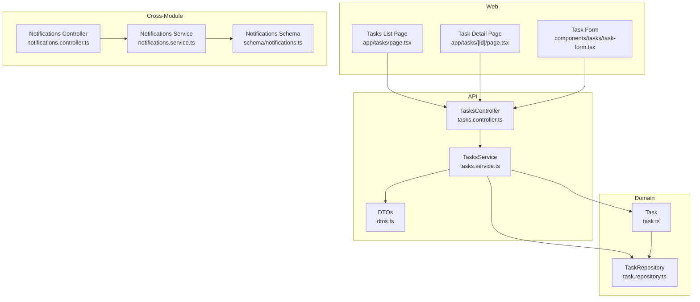
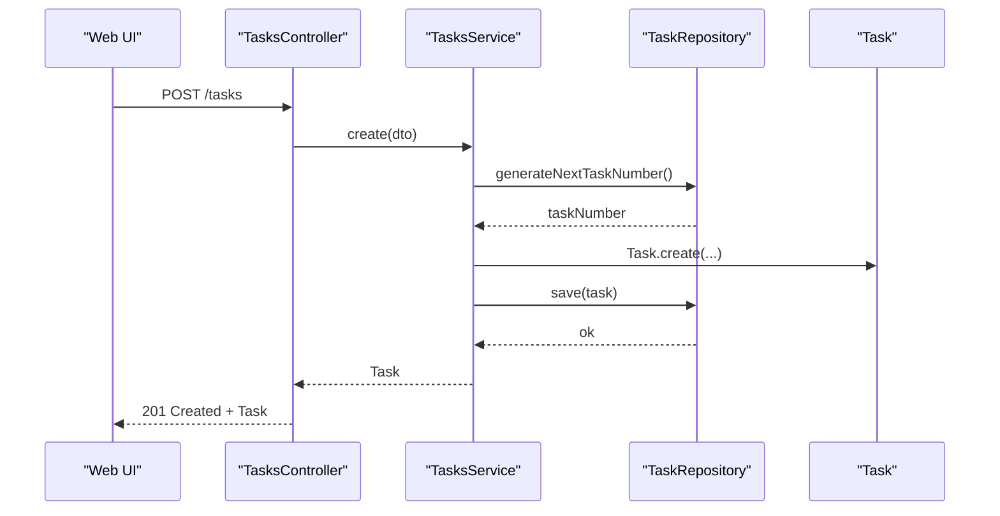
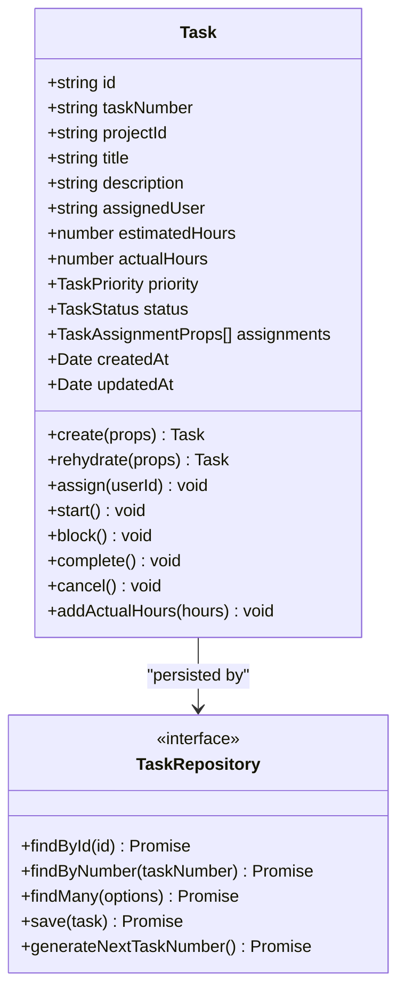
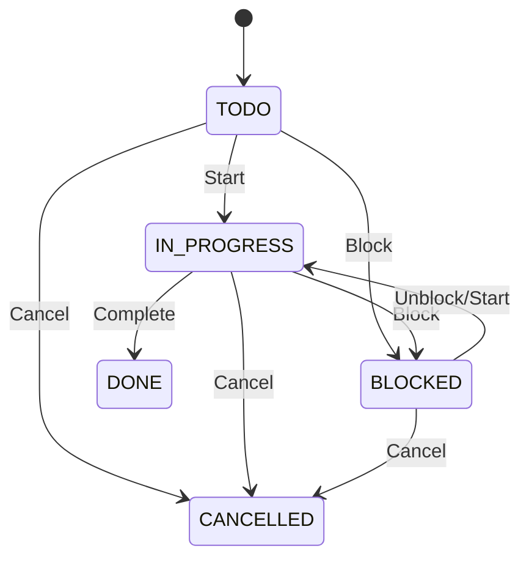
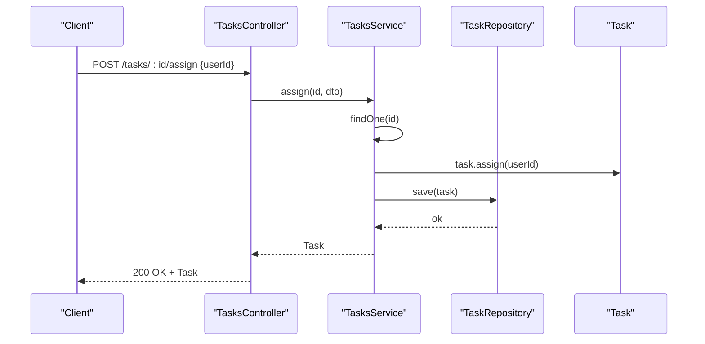
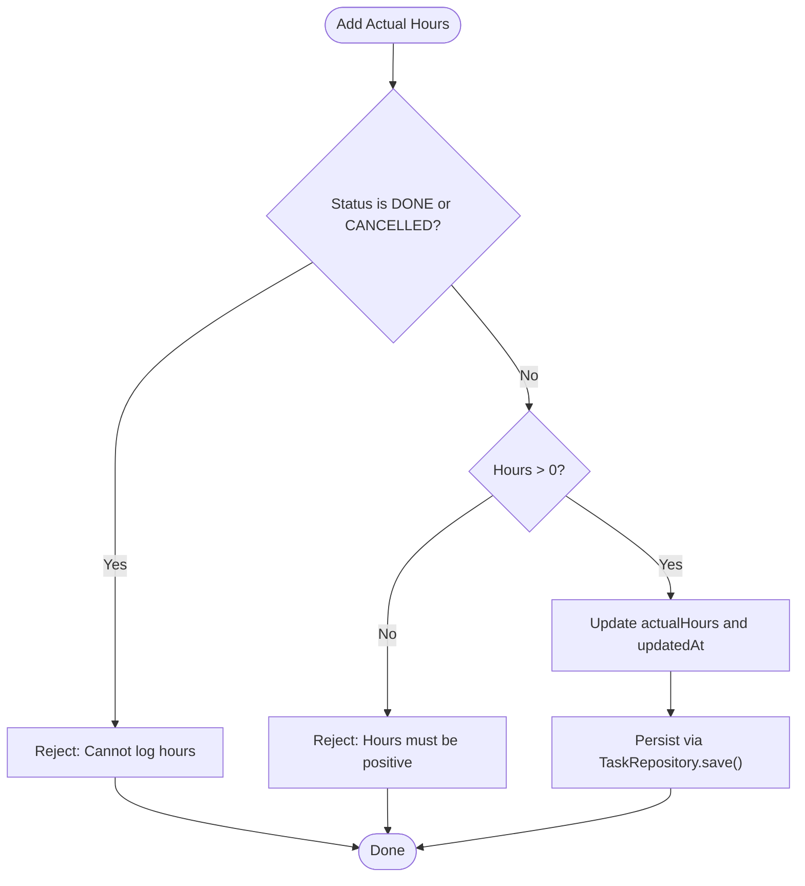
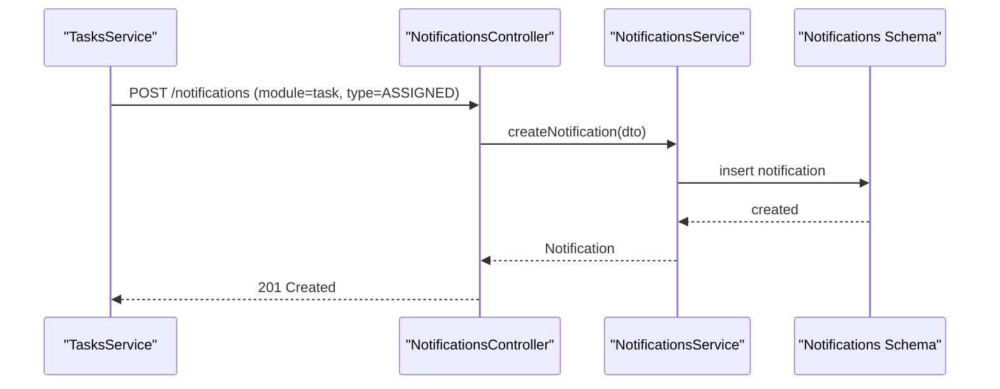
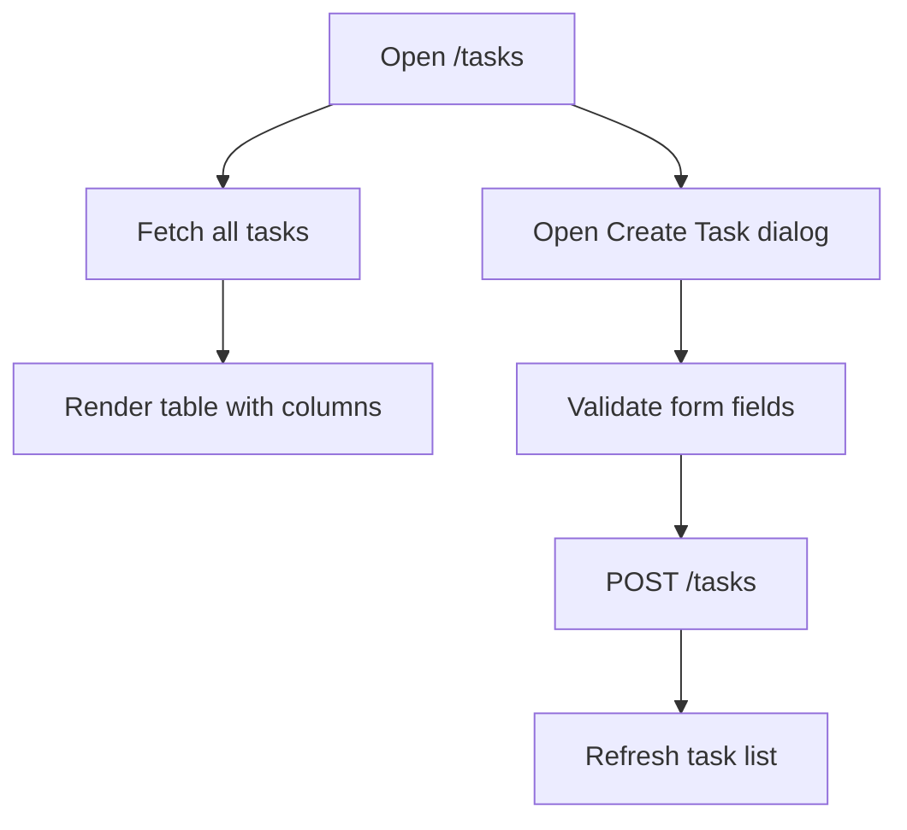
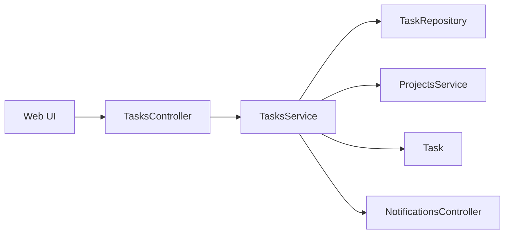

# Task Management

<cite>
**Referenced Files in This Document**
- [0043-task-management.md](file://docs/rfcs/0043-task-management.md)
- [task.ts](file://packages/projects/src/tasks/task.ts)
- [task.repository.ts](file://packages/projects/src/tasks/task.repository.ts)
- [tasks.controller.ts](file://apps/api/src/tasks/tasks.controller.ts)
- [tasks.service.ts](file://apps/api/src/tasks/tasks.service.ts)
- [dtos.ts](file://apps/api/src/tasks/dtos.ts)
- [page.tsx (Tasks list)](file://apps/web/app/tasks/page.tsx)
- [page.tsx (Task detail)](file://apps/web/app/tasks/[id]/page.tsx)
- [task-form.tsx](file://apps/web/components/tasks/task-form.tsx)
- [notifications.ts](file://packages/database/src/schema/notifications.ts)
- [notifications.controller.ts](file://apps/api/src/notifications/notifications.controller.ts)
- [notifications.service.ts](file://apps/api/src/notifications/notifications.service.ts)
</cite>

## Table of Contents
1. [Introduction](#introduction)
2. [Project Structure](#project-structure)
3. [Core Components](#core-components)
4. [Architecture Overview](#architecture-overview)
5. [Detailed Component Analysis](#detailed-component-analysis)
6. [Dependency Analysis](#dependency-analysis)
7. [Performance Considerations](#performance-considerations)
8. [Troubleshooting Guide](#troubleshooting-guide)
9. [Conclusion](#conclusion)
10. [Appendices](#appendices)

## Introduction
This document explains the Task Management feature across projects, covering task creation, assignment, workflow states, relationships with projects and team members, prioritization, due dates, progress tracking, dependencies, subtasks, notifications, API endpoints, UI components, and integration points with time tracking and project reporting. It is designed for both technical and non-technical readers.

## Project Structure
The Task Management feature spans domain logic, application services, REST APIs, and web UI:
- Domain model and repository contract live in the projects package.
- Application service and NestJS controller implement REST endpoints.
- Web pages and a form component provide the user interface.
- Notifications schema and controllers support cross-module alerts.

**Diagram sources**
- [task.ts:1-174](file://packages/projects/src/tasks/task.ts#L1-L174)
- [task.repository.ts:1-18](file://packages/projects/src/tasks/task.repository.ts#L1-L18)
- [tasks.controller.ts:1-62](file://apps/api/src/tasks/tasks.controller.ts#L1-L62)
- [tasks.service.ts:1-114](file://apps/api/src/tasks/tasks.service.ts#L1-L114)
- [dtos.ts:1-41](file://apps/api/src/tasks/dtos.ts#L1-L41)
- [page.tsx (Tasks list):1-137](file://apps/web/app/tasks/page.tsx#L1-L137)
- [page.tsx (Task detail):1-82](file://apps/web/app/tasks/[id]/page.tsx#L1-L82)
- [task-form.tsx:1-165](file://apps/web/components/tasks/task-form.tsx#L1-L165)
- [notifications.ts:1-38](file://packages/database/src/schema/notifications.ts#L1-L38)
- [notifications.controller.ts:1-55](file://apps/api/src/notifications/notifications.controller.ts#L1-L55)
- [notifications.service.ts:53-100](file://apps/api/src/notifications/notifications.service.ts#L53-L100)

**Section sources**
- [0043-task-management.md:1-118](file://docs/rfcs/0043-task-management.md#L1-L118)

## Core Components
- Task aggregate: Encapsulates task state, assignments, priority, estimated/actual hours, and lifecycle methods.
- TaskRepository contract: Defines persistence operations and query filters.
- TasksService: Orchestrates task operations, validates project state, and persists changes.
- TasksController: Exposes REST endpoints for CRUD and status transitions.
- DTOs: Validate incoming request payloads.
- Web UI: Lists tasks, creates tasks via a dialog form, and shows task details.
- Notifications: Cross-module alerting infrastructure used to surface updates.

Key responsibilities:
- Task: Invariants, state machine, assignment history, and hour logging.
- Repository: Query by filters (project, assignee, status, priority, search), save, and generate unique task numbers.
- Service: Business rules (e.g., cannot create tasks on completed/cancelled projects), orchestration, and persistence.
- Controller: HTTP routing and parameter binding.
- UI: Data fetching, validation, and user interactions.

**Section sources**
- [task.ts:1-174](file://packages/projects/src/tasks/task.ts#L1-L174)
- [task.repository.ts:1-18](file://packages/projects/src/tasks/task.repository.ts#L1-L18)
- [tasks.service.ts:1-114](file://apps/api/src/tasks/tasks.service.ts#L1-L114)
- [tasks.controller.ts:1-62](file://apps/api/src/tasks/tasks.controller.ts#L1-L62)
- [dtos.ts:1-41](file://apps/api/src/tasks/dtos.ts#L1-L41)
- [page.tsx (Tasks list):1-137](file://apps/web/app/tasks/page.tsx#L1-L137)
- [task-form.tsx:1-165](file://apps/web/components/tasks/task-form.tsx#L1-L165)

## Architecture Overview
The system follows a layered architecture:
- Presentation layer: Next.js pages and components render task lists and forms.
- API layer: NestJS controller routes requests to services.
- Application layer: TasksService enforces business rules and coordinates domain objects.
- Domain layer: Task aggregate encapsulates core logic and invariants.
- Persistence layer: TaskRepository defines how tasks are stored and queried.

**Diagram sources**
- [tasks.controller.ts:10-13](file://apps/api/src/tasks/tasks.controller.ts#L10-L13)
- [tasks.service.ts:26-46](file://apps/api/src/tasks/tasks.service.ts#L26-L46)
- [task.repository.ts:11-17](file://packages/projects/src/tasks/task.repository.ts#L11-L17)
- [task.ts:72-111](file://packages/projects/src/tasks/task.ts#L72-L111)

## Detailed Component Analysis

### Domain Model: Task Aggregate
The Task aggregate enforces invariants and manages lifecycle transitions:
- Creation requires a valid title and projectId; estimatedHours must be non-negative.
- Assignments are recorded with timestamps and user IDs.
- Status transitions follow a strict state machine.
- Actual hours can only be added when not DONE or CANCELLED.

**Diagram sources**
- [task.ts:1-174](file://packages/projects/src/tasks/task.ts#L1-L174)
- [task.repository.ts:1-18](file://packages/projects/src/tasks/task.repository.ts#L1-L18)

**Section sources**
- [task.ts:72-173](file://packages/projects/src/tasks/task.ts#L72-L173)
- [task.repository.ts:1-18](file://packages/projects/src/tasks/task.repository.ts#L1-L18)

### State Machine and Workflow
Task statuses and allowed transitions:
- TODO → IN_PROGRESS (Start)
- IN_PROGRESS → BLOCKED (Block)
- IN_PROGRESS → DONE (Complete)
- TODO → BLOCKED (Block)
- Any except DONE → CANCELLED (Cancel)
- CANCELLED cannot be completed; DONE cannot be cancelled.

**Diagram sources**
- [task.ts:117-173](file://packages/projects/src/tasks/task.ts#L117-L173)
- [0043-task-management.md:67-75](file://docs/rfcs/0043-task-management.md#L67-L75)

**Section sources**
- [0043-task-management.md:67-75](file://docs/rfcs/0043-task-management.md#L67-L75)
- [task.ts:117-173](file://packages/projects/src/tasks/task.ts#L117-L173)

### API Endpoints and Request Flow
Endpoints exposed by TasksController:
- POST /tasks — Create a task
- GET /tasks — List tasks with filters
- GET /tasks/:id — Get a task
- POST /tasks/:id/assign — Assign a user
- POST /tasks/:id/start — Start a task
- POST /tasks/:id/block — Block a task
- POST /tasks/:id/complete — Complete a task
- POST /tasks/:id/cancel — Cancel a task

Request flow example (assignment):

**Diagram sources**
- [tasks.controller.ts:37-40](file://apps/api/src/tasks/tasks.controller.ts#L37-L40)
- [tasks.service.ts:72-77](file://apps/api/src/tasks/tasks.service.ts#L72-L77)
- [task.ts:117-129](file://packages/projects/src/tasks/task.ts#L117-L129)

**Section sources**
- [tasks.controller.ts:1-62](file://apps/api/src/tasks/tasks.controller.ts#L1-L62)
- [tasks.service.ts:26-114](file://apps/api/src/tasks/tasks.service.ts#L26-L114)
- [dtos.ts:1-41](file://apps/api/src/tasks/dtos.ts#L1-L41)

### Task Creation and Validation
- Server-side DTO validation ensures required fields and constraints.
- Domain-level validation prevents invalid creation (missing title/projectId, negative hours).
- The service checks that the target project is active before creating a task.

Validation highlights:
- CreateTaskDto validates projectId, title, optional description/assignedUser, estimatedHours >= 0, and optional priority.
- Task.create enforces domain invariants.
- TasksService.create verifies project status and generates a unique task number.

**Section sources**
- [dtos.ts:10-34](file://apps/api/src/tasks/dtos.ts#L10-L34)
- [task.ts:72-111](file://packages/projects/src/tasks/task.ts#L72-L111)
- [tasks.service.ts:26-46](file://apps/api/src/tasks/tasks.service.ts#L26-L46)

### Assignment and Progress Tracking
- Assignment records include userId, taskId, and timestamp.
- Progress tracked via status transitions and actual hours accumulation.
- Time entries integrate by adding actual hours to the task when appropriate.

**Diagram sources**
- [task.ts:163-173](file://packages/projects/src/tasks/task.ts#L163-L173)
- [tasks.service.ts:107-112](file://apps/api/src/tasks/tasks.service.ts#L107-L112)

**Section sources**
- [task.ts:117-173](file://packages/projects/src/tasks/task.ts#L117-L173)
- [tasks.service.ts:107-112](file://apps/api/src/tasks/tasks.service.ts#L107-L112)

### Relationships: Projects, Milestones, Team Members
- Projects: Tasks belong to a project; creation is blocked if the project is COMPLETED or CANCELLED.
- Milestones: RFC indicates tasks link to project milestones; implementation details are outside the current files.
- Team Members: Assigned users are tracked per task with an assignment history.

Integration notes:
- TasksService uses ProjectsService to validate project state during creation.
- Assignment history is maintained within the Task aggregate.

**Section sources**
- [tasks.service.ts:26-46](file://apps/api/src/tasks/tasks.service.ts#L26-L46)
- [task.ts:8-13](file://packages/projects/src/tasks/task.ts#L8-L13)
- [0043-task-management.md:83-86](file://docs/rfcs/0043-task-management.md#L83-L86)

### Prioritization and Due Dates
- Priority values: LOW, MEDIUM, HIGH, URGENT.
- Due dates are surfaced in the UI but not enforced at the domain level in the referenced files.

**Section sources**
- [task.ts:3-6](file://packages/projects/src/tasks/task.ts#L3-L6)
- [page.tsx (Tasks list):68-83](file://apps/web/app/tasks/page.tsx#L68-L83)

### Dependencies and Subtasks
- RFC mentions future extensions for checklist sub-items and task dependencies.
- Current code does not implement explicit dependency edges or subtask hierarchies.

**Section sources**
- [0043-task-management.md:115-118](file://docs/rfcs/0043-task-management.md#L115-L118)

### Notification System Integration
- A general notification schema supports module-scoped alerts with priorities and read status.
- Notifications controller provides endpoints to create, list, mark read, and bulk-mark-read.
- Task-related notifications can be emitted from services to inform assignees and stakeholders.

**Diagram sources**
- [notifications.controller.ts:37-40](file://apps/api/src/notifications/notifications.controller.ts#L37-L40)
- [notifications.service.ts:53-71](file://apps/api/src/notifications/notifications.service.ts#L53-L71)
- [notifications.ts:14-38](file://packages/database/src/schema/notifications.ts#L14-L38)

**Section sources**
- [notifications.controller.ts:1-55](file://apps/api/src/notifications/notifications.controller.ts#L1-L55)
- [notifications.service.ts:53-100](file://apps/api/src/notifications/notifications.service.ts#L53-L100)
- [notifications.ts:1-38](file://packages/database/src/schema/notifications.ts#L1-L38)

### UI Components: Task Boards and Lists
- Tasks list page displays columns for title, assignee, module context, status, and due date.
- Task detail page shows task metadata and actions.
- Task form validates inputs and submits to the API.

**Diagram sources**
- [page.tsx (Tasks list):17-33](file://apps/web/app/tasks/page.tsx#L17-L33)
- [page.tsx (Tasks list):40-84](file://apps/web/app/tasks/page.tsx#L40-L84)
- [task-form.tsx:59-75](file://apps/web/components/tasks/task-form.tsx#L59-L75)

**Section sources**
- [page.tsx (Tasks list):1-137](file://apps/web/app/tasks/page.tsx#L1-L137)
- [page.tsx (Task detail):1-82](file://apps/web/app/tasks/[id]/page.tsx#L1-L82)
- [task-form.tsx:1-165](file://apps/web/components/tasks/task-form.tsx#L1-L165)

### Examples: CRUD Operations, Bulk Assignments, Status Updates
- Create: Use POST /tasks with CreateTaskDto.
- Read: Use GET /tasks (with filters) and GET /tasks/:id.
- Update: Use POST /tasks/:id/assign, start, block, complete, cancel.
- Bulk assignments: Not implemented in the referenced controller; consider extending with a batch endpoint.
- Status updates: Use dedicated endpoints for each transition.

Operational guidance:
- Always validate project state before creating tasks.
- Respect status transitions; invalid transitions will throw errors.
- Log actual hours only for active tasks.

**Section sources**
- [tasks.controller.ts:10-60](file://apps/api/src/tasks/tasks.controller.ts#L10-L60)
- [tasks.service.ts:26-114](file://apps/api/src/tasks/tasks.service.ts#L26-L114)

### Integration with Time Tracking and Project Reporting
- Time tracking: Add actual hours via the task’s addActualHours method; ensure hours are positive and task is not DONE/CANCELLED.
- Project reporting: Tasks contribute to project metrics through estimated vs. actual hours and status distribution.

Recommendations:
- Integrate time entry creation with task completion workflows.
- Surface task progress in project dashboards using status counts and hour deltas.

**Section sources**
- [task.ts:163-173](file://packages/projects/src/tasks/task.ts#L163-L173)
- [0043-task-management.md:19-21](file://docs/rfcs/0043-task-management.md#L19-L21)

## Dependency Analysis
High-level dependencies:
- TasksController depends on TasksService.
- TasksService depends on TaskRepository and ProjectsService.
- TaskRepository abstracts persistence; Task aggregate contains domain logic.
- Web UI depends on API endpoints.
- Notifications subsystem is independent but can be triggered by task operations.

**Diagram sources**
- [tasks.controller.ts:1-62](file://apps/api/src/tasks/tasks.controller.ts#L1-L62)
- [tasks.service.ts:1-24](file://apps/api/src/tasks/tasks.service.ts#L1-L24)
- [task.repository.ts:1-18](file://packages/projects/src/tasks/task.repository.ts#L1-L18)
- [task.ts:1-174](file://packages/projects/src/tasks/task.ts#L1-L174)
- [notifications.controller.ts:1-55](file://apps/api/src/notifications/notifications.controller.ts#L1-L55)

**Section sources**
- [tasks.controller.ts:1-62](file://apps/api/src/tasks/tasks.controller.ts#L1-L62)
- [tasks.service.ts:1-24](file://apps/api/src/tasks/tasks.service.ts#L1-L24)

## Performance Considerations
- Filtering: Use query parameters (projectId, assignedUser, status, priority, search) to reduce payload sizes.
- Pagination: Consider implementing pagination for large task sets.
- Indexing: Ensure database indexes on frequently filtered columns (project_id, assigned_user, status, priority).
- Caching: Cache read-heavy queries like task lists for authenticated users where appropriate.
- Transactions: Persist task changes atomically to maintain consistency.

[No sources needed since this section provides general guidance]

## Troubleshooting Guide
Common issues and resolutions:
- Cannot create tasks on completed/cancelled projects: Verify project status before calling create.
- Invalid status transitions: Ensure transitions follow the state machine; avoid starting/completing cancelled tasks.
- Negative or zero hours logged: Only log positive hours against active tasks.
- Missing required fields: Validate DTOs and domain invariants; ensure title and projectId are provided.
- Assignment failures: Confirm the task is not in DONE or CANCELLED status before assigning.

Error handling references:
- Service-level exceptions for missing tasks and invalid project states.
- Domain-level exceptions for invalid transitions and hour logging.

**Section sources**
- [tasks.service.ts:26-46](file://apps/api/src/tasks/tasks.service.ts#L26-L46)
- [tasks.service.ts:64-70](file://apps/api/src/tasks/tasks.service.ts#L64-L70)
- [task.ts:117-173](file://packages/projects/src/tasks/task.ts#L117-L173)

## Conclusion
Task Management provides a robust foundation for creating, assigning, and tracking tasks within projects. The domain model enforces clear invariants and a well-defined state machine. The API exposes comprehensive endpoints for task operations, while the UI offers intuitive interfaces for listing, creating, and viewing tasks. Notifications and time tracking integrations enable broader operational visibility. Future enhancements can introduce subtasks and dependencies to further enrich workflow modeling.

[No sources needed since this section summarizes without analyzing specific files]

## Appendices

### API Reference Summary
- POST /tasks — Create task
- GET /tasks — List tasks (filters: projectId, assignedUser, status, priority, search)
- GET /tasks/:id — Get task
- POST /tasks/:id/assign — Assign user
- POST /tasks/:id/start — Start task
- POST /tasks/:id/block — Block task
- POST /tasks/:id/complete — Complete task
- POST /tasks/:id/cancel — Cancel task

**Section sources**
- [tasks.controller.ts:10-60](file://apps/api/src/tasks/tasks.controller.ts#L10-L60)
- [0043-task-management.md:94-103](file://docs/rfcs/0043-task-management.md#L94-L103)