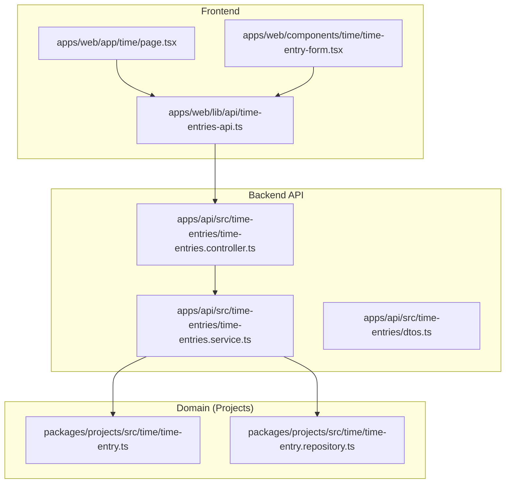
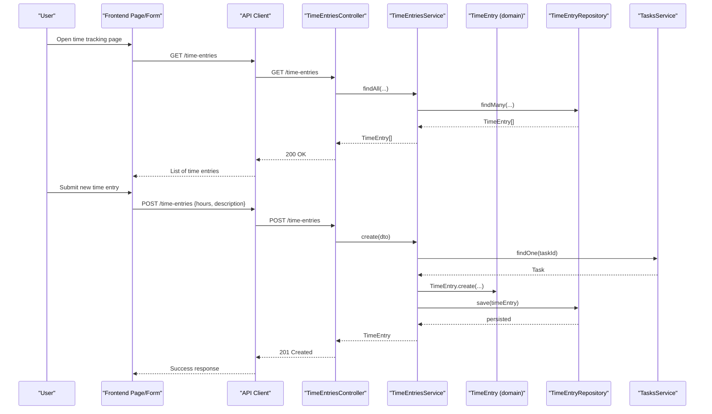
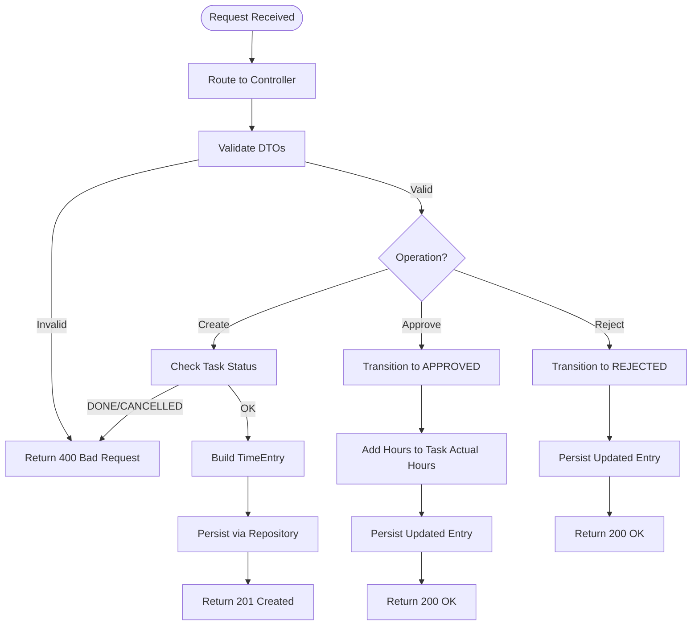
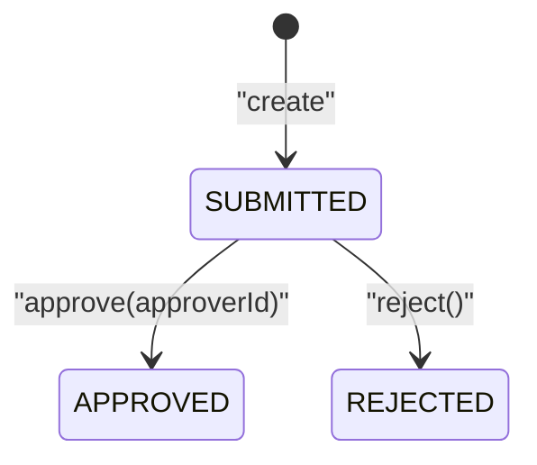
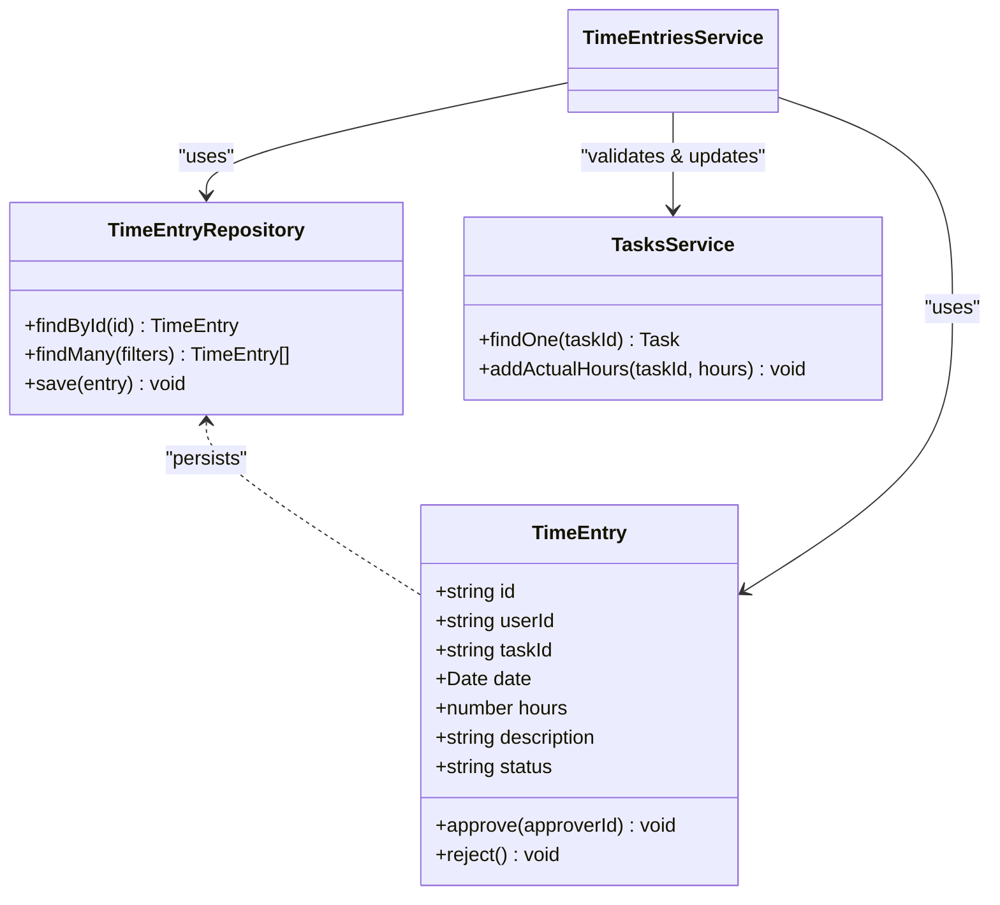
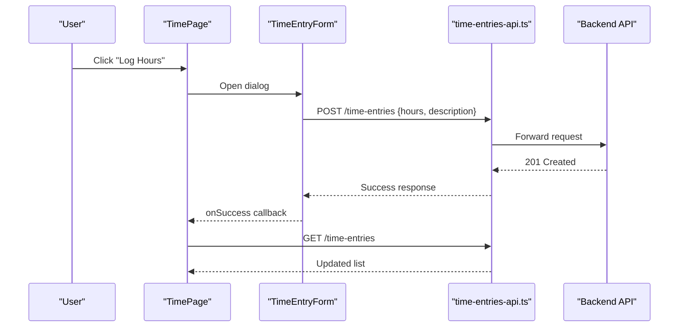
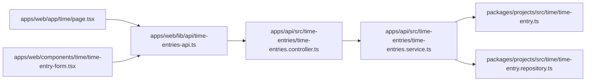

# Time Tracking

<cite>
**Referenced Files in This Document**
- [0044-time-tracking.md](file://docs/rfcs/0044-time-tracking.md)
- [time-entries.controller.ts](file://apps/api/src/time-entries/time-entries.controller.ts)
- [time-entries.service.ts](file://apps/api/src/time-entries/time-entries.service.ts)
- [dtos.ts](file://apps/api/src/time-entries/dtos.ts)
- [page.tsx](file://apps/web/app/time/page.tsx)
- [time-entry-form.tsx](file://apps/web/components/time/time-entry-form.tsx)
- [time-entries-api.ts](file://apps/web/lib/api/time-entries-api.ts)
- [time-entry.repository.ts](file://packages/projects/src/time/time-entry.repository.ts)
- [time-entry.ts](file://packages/projects/src/time/time-entry.ts)
</cite>

## Table of Contents
1. [Introduction](#introduction)
2. [Project Structure](#project-structure)
3. [Core Components](#core-components)
4. [Architecture Overview](#architecture-overview)
5. [Detailed Component Analysis](#detailed-component-analysis)
6. [Dependency Analysis](#dependency-analysis)
7. [Performance Considerations](#performance-considerations)
8. [Troubleshooting Guide](#troubleshooting-guide)
9. [Conclusion](#conclusion)
10. [Appendices](#appendices)

## Introduction
This document explains the Time Tracking functionality, covering time entry creation, categorization, approval workflows, and integration with projects and tasks. It also documents entities, billable vs non-billable considerations, rate calculations, timesheet generation, reporting, API endpoints, and frontend components for time entry interfaces.

## Project Structure
Time tracking spans backend (NestJS), domain package (projects), and frontend (Next.js):
- Backend API: controller, service, DTOs
- Domain: TimeEntry aggregate and repository contract
- Frontend: page, form component, API client

**Diagram sources**
- [page.tsx:1-146](file://apps/web/app/time/page.tsx#L1-L146)
- [time-entry-form.tsx:1-114](file://apps/web/components/time/time-entry-form.tsx#L1-L114)
- [time-entries-api.ts:1-32](file://apps/web/lib/api/time-entries-api.ts#L1-L32)
- [time-entries.controller.ts:1-47](file://apps/api/src/time-entries/time-entries.controller.ts#L1-L47)
- [time-entries.service.ts:1-83](file://apps/api/src/time-entries/time-entries.service.ts#L1-L83)
- [time-entry.repository.ts](file://packages/projects/src/time/time-entry.repository.ts)
- [time-entry.ts](file://packages/projects/src/time/time-entry.ts)

**Section sources**
- [0044-time-tracking.md:1-103](file://docs/rfcs/0044-time-tracking.md#L1-L103)

## Core Components
- TimeEntriesController: Exposes REST endpoints for creating, listing, retrieving, approving, and rejecting time entries.
- TimeEntriesService: Orchestrates business logic, validates task state, persists entries, updates task actual hours on approval, and delegates to domain objects and repository.
- DTOs: Validate input for create and approve operations.
- Domain TimeEntry: Aggregate root representing a time entry with status transitions and methods such as approve/reject.
- Repository Contract: Persistence interface for TimeEntry.
- Frontend Page and Form: UI for logging labor hours and displaying logs.
- Frontend API Client: HTTP client wrapper for time entry endpoints.

Key responsibilities:
- Creation: Enforce hour bounds and required fields; validate task eligibility.
- Approval workflow: Transition from SUBMITTED to APPROVED or REJECTED; update task actual hours upon approval.
- Querying: Filter by user, task, status, and date range.

**Section sources**
- [time-entries.controller.ts:1-47](file://apps/api/src/time-entries/time-entries.controller.ts#L1-L47)
- [time-entries.service.ts:1-83](file://apps/api/src/time-entries/time-entries.service.ts#L1-L83)
- [dtos.ts:1-39](file://apps/api/src/time-entries/dtos.ts#L1-L39)
- [time-entry.ts](file://packages/projects/src/time/time-entry.ts)
- [time-entry.repository.ts](file://packages/projects/src/time/time-entry.repository.ts)
- [page.tsx:1-146](file://apps/web/app/time/page.tsx#L1-L146)
- [time-entry-form.tsx:1-114](file://apps/web/components/time/time-entry-form.tsx#L1-L114)
- [time-entries-api.ts:1-32](file://apps/web/lib/api/time-entries-api.ts#L1-L32)

## Architecture Overview
The system follows a layered architecture:
- Presentation layer (frontend) calls REST endpoints via an API client.
- Controller layer maps HTTP requests to service methods.
- Service layer enforces business rules and coordinates domain and infrastructure.
- Domain layer encapsulates TimeEntry aggregate behavior and repository contracts.

**Diagram sources**
- [time-entries.controller.ts:10-45](file://apps/api/src/time-entries/time-entries.controller.ts#L10-L45)
- [time-entries.service.ts:25-81](file://apps/api/src/time-entries/time-entries.service.ts#L25-L81)
- [time-entry.ts](file://packages/projects/src/time/time-entry.ts)
- [time-entry.repository.ts](file://packages/projects/src/time/time-entry.repository.ts)

## Detailed Component Analysis

### API Endpoints
- POST /time-entries
  - Purpose: Create a new time entry.
  - Request body: userId, taskId, date, hours, description.
  - Validation: hours between 0.1 and 24; required fields enforced.
  - Behavior: Validates task is not DONE or CANCELLED; creates TimeEntry in SUBMITTED state; persists via repository.
- GET /time-entries
  - Purpose: List time entries with optional filters.
  - Query params: userId, taskId, status, startDate, endDate.
  - Response: Array of time entries.
- GET /time-entries/:id
  - Purpose: Retrieve a single time entry by ID.
- POST /time-entries/:id/approve
  - Purpose: Approve a submitted time entry.
  - Request body: approverId.
  - Behavior: Transitions to APPROVED; adds hours to task actual hours; persists updated entry.
- POST /time-entries/:id/reject
  - Purpose: Reject a submitted time entry.
  - Behavior: Transitions to REJECTED; persists updated entry.

**Diagram sources**
- [time-entries.controller.ts:10-45](file://apps/api/src/time-entries/time-entries.controller.ts#L10-L45)
- [time-entries.service.ts:25-81](file://apps/api/src/time-entries/time-entries.service.ts#L25-L81)
- [dtos.ts:11-38](file://apps/api/src/time-entries/dtos.ts#L11-L38)

**Section sources**
- [time-entries.controller.ts:1-47](file://apps/api/src/time-entries/time-entries.controller.ts#L1-L47)
- [time-entries.service.ts:25-81](file://apps/api/src/time-entries/time-entries.service.ts#L25-L81)
- [dtos.ts:11-38](file://apps/api/src/time-entries/dtos.ts#L11-L38)

### Domain Model and State Machine
- Entities and Value Objects:
  - TimeEntry: Aggregate root with fields for user, task, date, hours, description, status, approver metadata, timestamps.
  - TimeEntryStatus: Enum-like values including SUBMITTED, APPROVED, REJECTED.
- State Machine:
  - SUBMITTED can transition to APPROVED or REJECTED.
- Invariants:
  - Hours must be > 0 and <= 24 per entry.
  - Time entries require an existing task in allowed statuses; completed/cancelled tasks cannot receive new time entries.

**Diagram sources**
- [0044-time-tracking.md:61-67](file://docs/rfcs/0044-time-tracking.md#L61-L67)
- [time-entry.ts](file://packages/projects/src/time/time-entry.ts)

**Section sources**
- [0044-time-tracking.md:20-31](file://docs/rfcs/0044-time-tracking.md#L20-L31)
- [0044-time-tracking.md:55-67](file://docs/rfcs/0044-time-tracking.md#L55-L67)
- [time-entry.ts](file://packages/projects/src/time/time-entry.ts)

### Integration with Projects and Tasks
- Task validation: Before creating a time entry, the service checks that the referenced task is not in DONE or CANCELLED status.
- Task hour aggregation: On approval, the service increments the task’s actual hours using TasksService.addActualHours.
- Project linkage: Time entries are associated with tasks, which belong to projects; approved entries provide accurate labor data for project post-mortems and billing verification.

**Diagram sources**
- [time-entry.ts](file://packages/projects/src/time/time-entry.ts)
- [time-entry.repository.ts](file://packages/projects/src/time/time-entry.repository.ts)
- [time-entries.service.ts:25-81](file://apps/api/src/time-entries/time-entries.service.ts#L25-L81)

**Section sources**
- [time-entries.service.ts:25-81](file://apps/api/src/time-entries/time-entries.service.ts#L25-L81)
- [0044-time-tracking.md:75-77](file://docs/rfcs/0044-time-tracking.md#L75-L77)

### Billable vs Non-Billable Tracking and Rate Calculations
- Current implementation does not include explicit billable flags or rate fields in the TimeEntry DTOs or domain model shown here.
- To support billable vs non-billable tracking:
  - Extend TimeEntry with a billable flag and optionally a rate or cost field.
  - Introduce categorization via attributes or tags linked to tasks or projects.
  - Compute billed amount as hours × applicable rate when billable is true.
- For productivity analytics:
  - Track total logged hours per user/task/project.
  - Segment by billable/non-billable to derive utilization metrics.

[No sources needed since this section provides general guidance]

### Timesheet Generation and Reporting
- Timesheet generation:
  - Use GET /time-entries with filters (userId, taskId, status, startDate, endDate) to assemble weekly or monthly timesheets.
  - Aggregate hours per user and per task for summaries.
- Reporting:
  - Summarize approved vs rejected entries.
  - Break down hours by project/task categories.
  - Export reports for billing verification and project post-mortems.

[No sources needed since this section provides general guidance]

### Frontend Components for Time Entry Interfaces
- TimePage:
  - Displays a table of time entries with columns for employee name, reference order/ticket, work completed, logged hours, and date.
  - Shows summary stats: total hours logged today, active timesheets count, and labor utilization indicator.
  - Provides a dialog to log hours via TimeEntryForm.
- TimeEntryForm:
  - Validates hours (0.1–24) and optional description.
  - Submits to POST /time-entries and handles server errors.
- API Client:
  - Wraps HTTP calls for getAll, getById, and create.

**Diagram sources**
- [page.tsx:16-146](file://apps/web/app/time/page.tsx#L16-L146)
- [time-entry-form.tsx:33-61](file://apps/web/components/time/time-entry-form.tsx#L33-L61)
- [time-entries-api.ts:15-31](file://apps/web/lib/api/time-entries-api.ts#L15-L31)

**Section sources**
- [page.tsx:16-146](file://apps/web/app/time/page.tsx#L16-L146)
- [time-entry-form.tsx:18-61](file://apps/web/components/time/time-entry-form.tsx#L18-L61)
- [time-entries-api.ts:15-31](file://apps/web/lib/api/time-entries-api.ts#L15-L31)

## Dependency Analysis
- Controller depends on Service and DTOs.
- Service depends on Domain TimeEntry, Repository contract, and TasksService.
- Frontend Page and Form depend on API client module.
- API client depends on shared apiClient for HTTP transport.

**Diagram sources**
- [page.tsx:1-146](file://apps/web/app/time/page.tsx#L1-L146)
- [time-entry-form.tsx:1-114](file://apps/web/components/time/time-entry-form.tsx#L1-L114)
- [time-entries-api.ts:1-32](file://apps/web/lib/api/time-entries-api.ts#L1-L32)
- [time-entries.controller.ts:1-47](file://apps/api/src/time-entries/time-entries.controller.ts#L1-L47)
- [time-entries.service.ts:1-83](file://apps/api/src/time-entries/time-entries.service.ts#L1-L83)
- [time-entry.ts](file://packages/projects/src/time/time-entry.ts)
- [time-entry.repository.ts](file://packages/projects/src/time/time-entry.repository.ts)

**Section sources**
- [time-entries.controller.ts:1-47](file://apps/api/src/time-entries/time-entries.controller.ts#L1-L47)
- [time-entries.service.ts:1-83](file://apps/api/src/time-entries/time-entries.service.ts#L1-L83)
- [time-entries-api.ts:1-32](file://apps/web/lib/api/time-entries-api.ts#L1-L32)

## Performance Considerations
- Filtering efficiency: Ensure repository supports indexed queries on userId, taskId, status, and date ranges to optimize list performance.
- Pagination: Consider adding pagination to GET /time-entries for large datasets.
- Batch operations: For bulk approvals or rejections, introduce batch endpoints to reduce round trips.
- Caching: Cache frequently accessed lists (e.g., current week’s entries) at the frontend level.

[No sources needed since this section provides general guidance]

## Troubleshooting Guide
Common issues and resolutions:
- Cannot log time against a task:
  - Cause: Task is in DONE or CANCELLED status.
  - Resolution: Update task status to an allowed state before logging time.
- Invalid hours:
  - Cause: Hours outside 0.1–24 range.
  - Resolution: Adjust hours within valid bounds.
- Not found error:
  - Cause: Requested time entry ID does not exist.
  - Resolution: Verify ID and permissions.
- Approval failures:
  - Cause: Missing approverId or invalid state transition.
  - Resolution: Provide approverId and ensure entry is in SUBMITTED state.

**Section sources**
- [time-entries.service.ts:25-81](file://apps/api/src/time-entries/time-entries.service.ts#L25-L81)
- [dtos.ts:11-38](file://apps/api/src/time-entries/dtos.ts#L11-L38)

## Conclusion
Time tracking is implemented with a clear separation of concerns: frontend UI, NestJS API, and domain-driven TimeEntry aggregate. The system supports creation, filtering, approval, and rejection of time entries, integrates with tasks for hour aggregation, and provides a foundation for timesheet generation and reporting. Future enhancements can add billable/non-billable categorization, rate calculations, and advanced analytics.

[No sources needed since this section summarizes without analyzing specific files]

## Appendices

### API Reference Summary
- POST /time-entries
  - Body: userId, taskId, date, hours, description
  - Response: TimeEntry
- GET /time-entries
  - Query: userId, taskId, status, startDate, endDate
  - Response: TimeEntry[]
- GET /time-entries/:id
  - Response: TimeEntry
- POST /time-entries/:id/approve
  - Body: approverId
  - Response: TimeEntry
- POST /time-entries/:id/reject
  - Response: TimeEntry

**Section sources**
- [time-entries.controller.ts:10-45](file://apps/api/src/time-entries/time-entries.controller.ts#L10-L45)
- [dtos.ts:11-38](file://apps/api/src/time-entries/dtos.ts#L11-L38)

### Data Models
- TimeEntry fields: id, userId, taskId, date, hours, description, status, approver metadata, timestamps.
- TimeEntryStatus: SUBMITTED, APPROVED, REJECTED.

**Section sources**
- [0044-time-tracking.md:79-82](file://docs/rfcs/0044-time-tracking.md#L79-L82)
- [time-entry.ts](file://packages/projects/src/time/time-entry.ts)