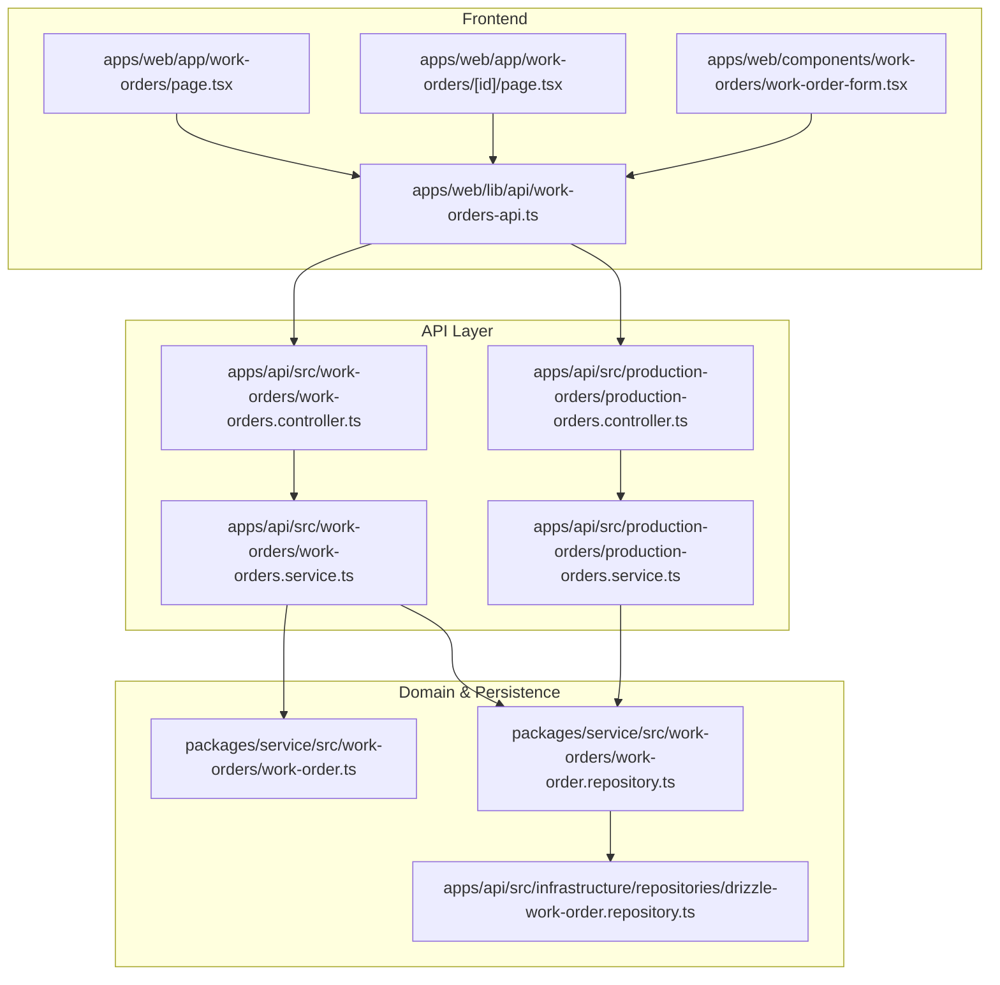
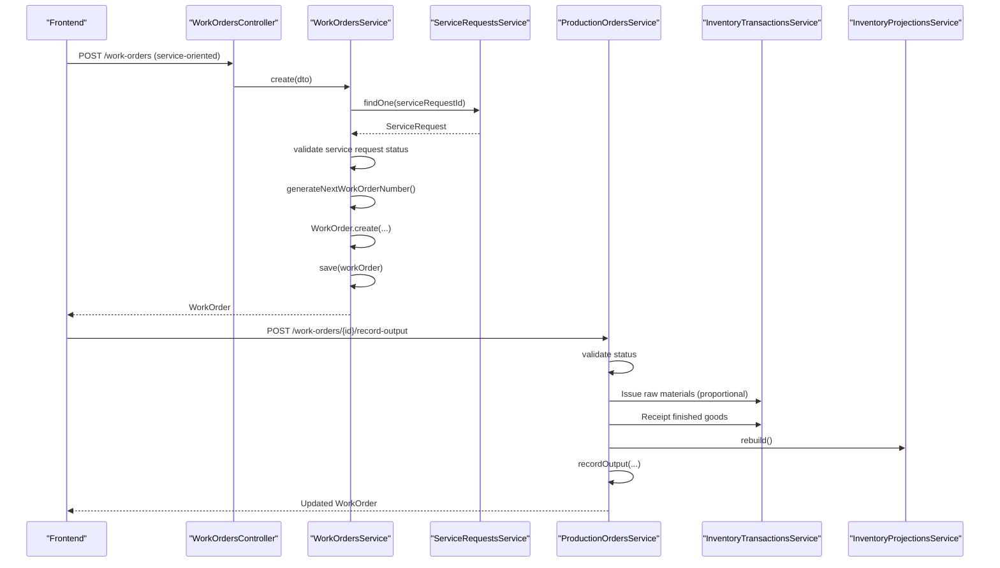
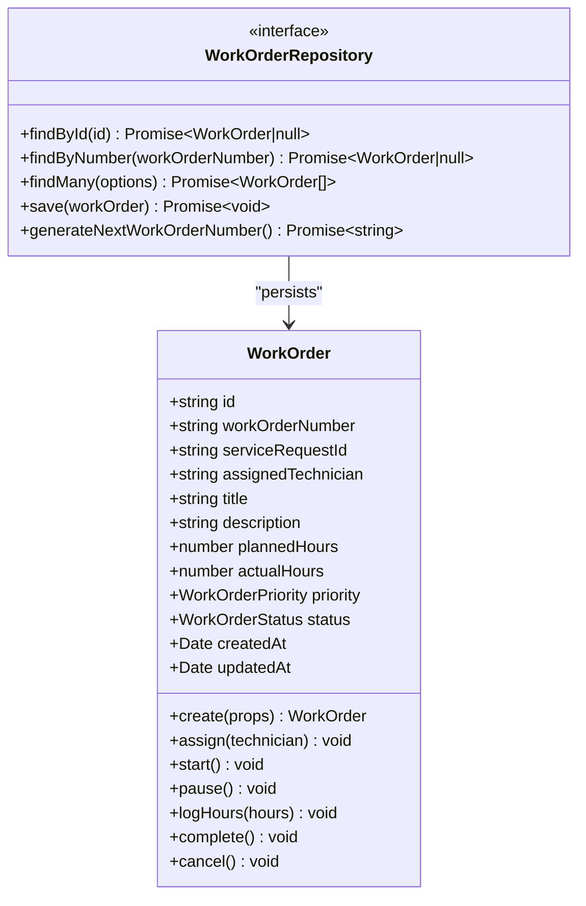
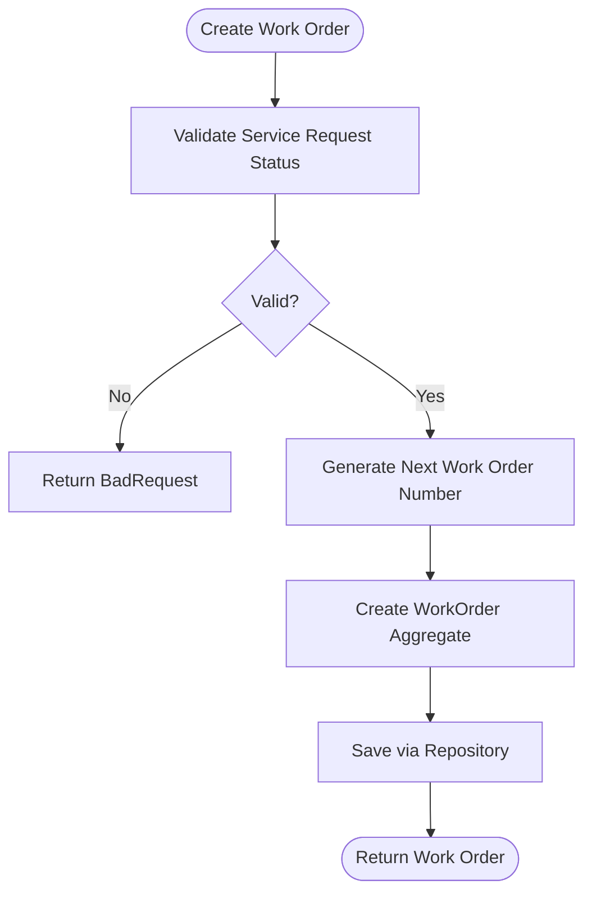
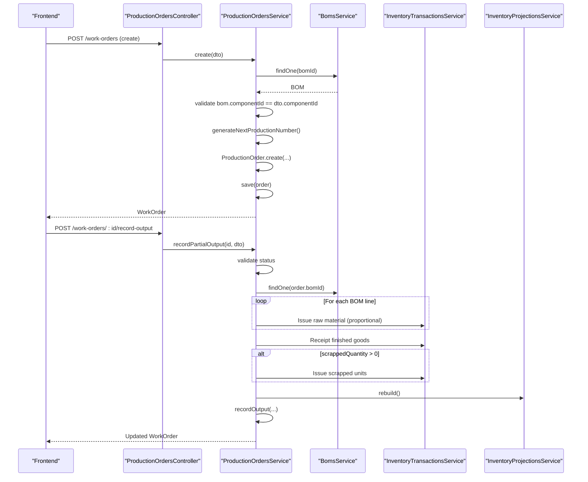
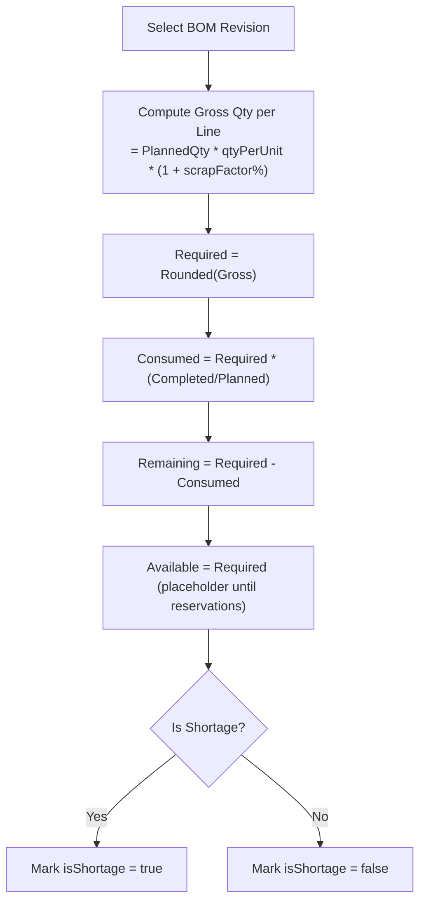
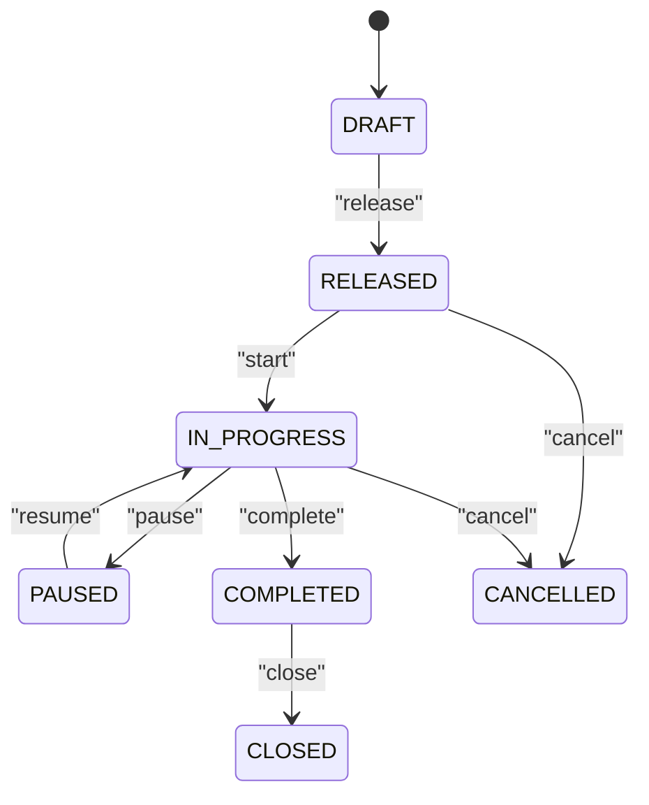
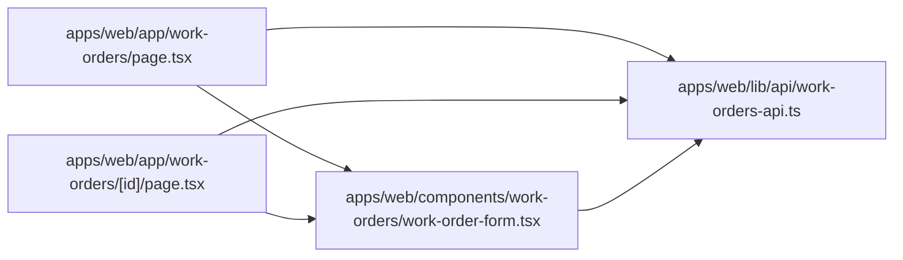
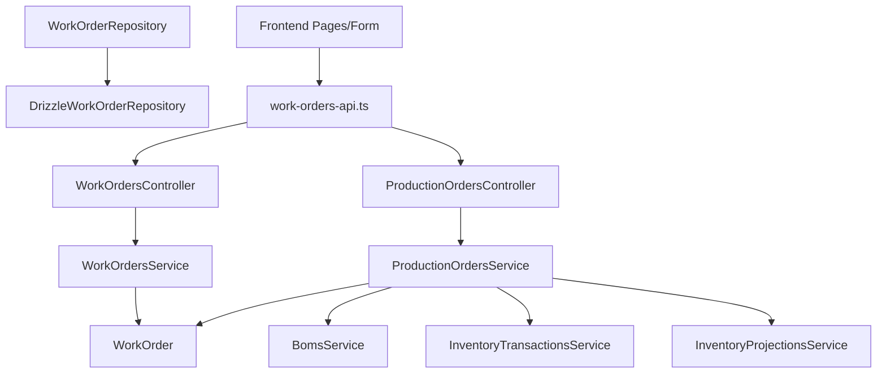

# Work Orders

<cite>
**Referenced Files in This Document**
- [0047-work-orders-and-repairs.md](file://docs/rfcs/0047-work-orders-and-repairs.md)
- [work-order.ts](file://packages/service/src/work-orders/work-order.ts)
- [work-order.repository.ts](file://packages/service/src/work-orders/work-order.repository.ts)
- [drizzle-work-order.repository.ts](file://apps/api/src/infrastructure/repositories/drizzle-work-order.repository.ts)
- [work-orders.controller.ts](file://apps/api/src/work-orders/work-orders.controller.ts)
- [work-orders.service.ts](file://apps/api/src/work-orders/work-orders.service.ts)
- [dtos.ts](file://apps/api/src/work-orders/dtos.ts)
- [production-orders.controller.ts](file://apps/api/src/production-orders/production-orders.controller.ts)
- [production-orders.service.ts](file://apps/api/src/production-orders/production-orders.service.ts)
- [page.tsx (Work Orders list)](file://apps/web/app/work-orders/page.tsx)
- [page.tsx (Work Order detail)](file://apps/web/app/work-orders/[id]/page.tsx)
- [work-order-form.tsx](file://apps/web/components/work-orders/work-order-form.tsx)
- [work-orders-api.ts](file://apps/web/lib/api/work-orders-api.ts)
- [material-consumption-api.ts](file://apps/web/lib/api/material-consumption-api.ts)
</cite>

## Table of Contents
1. [Introduction](#introduction)
2. [Project Structure](#project-structure)
3. [Core Components](#core-components)
4. [Architecture Overview](#architecture-overview)
5. [Detailed Component Analysis](#detailed-component-analysis)
6. [Dependency Analysis](#dependency-analysis)
7. [Performance Considerations](#performance-considerations)
8. [Troubleshooting Guide](#troubleshooting-guide)
9. [Conclusion](#conclusion)
10. [Appendices](#appendices)

## Introduction
This document explains Work Order management across the system, including:
- Creation from service requests or projects
- Material requirements and consumption
- Execution workflows and status tracking
- Completion criteria and reporting
- Integration with inventory, materials, BOMs, locations, and service teams
- API endpoints for work order operations
- Frontend components for work order management interfaces

The repository implements two related but distinct concepts:
- Service-oriented Work Orders focused on technician assignment and labor hours
- Manufacturing-oriented Production Orders (also exposed as Work Orders) focused on material consumption, output recording, scrap, scheduling, and completion

## Project Structure
Work Order functionality spans backend controllers/services, domain models, repositories, and frontend pages and forms.

**Diagram sources**
- [work-orders.controller.ts:10-70](file://apps/api/src/work-orders/work-orders.controller.ts#L10-L70)
- [work-orders.service.ts:22-118](file://apps/api/src/work-orders/work-orders.service.ts#L22-L118)
- [production-orders.controller.ts:26-129](file://apps/api/src/production-orders/production-orders.controller.ts#L26-L129)
- [production-orders.service.ts:58-471](file://apps/api/src/production-orders/production-orders.service.ts#L58-L471)
- [work-order.ts:33-147](file://packages/service/src/work-orders/work-order.ts#L33-L147)
- [work-order.repository.ts:11-17](file://packages/service/src/work-orders/work-order.repository.ts#L11-L17)
- [drizzle-work-order.repository.ts:30-115](file://apps/api/src/infrastructure/repositories/drizzle-work-order.repository.ts#L30-L115)
- [work-orders-api.ts:108-195](file://apps/web/lib/api/work-orders-api.ts#L108-L195)
- [page.tsx (Work Orders list):117-516](file://apps/web/app/work-orders/page.tsx#L117-L516)
- [page.tsx (Work Order detail):128-800](file://apps/web/app/work-orders/[id]/page.tsx#L128-L800)
- [work-order-form.tsx:56-431](file://apps/web/components/work-orders/work-order-form.tsx#L56-L431)

**Section sources**
- [work-orders.controller.ts:10-70](file://apps/api/src/work-orders/work-orders.controller.ts#L10-L70)
- [production-orders.controller.ts:26-129](file://apps/api/src/production-orders/production-orders.controller.ts#L26-L129)
- [work-orders.service.ts:22-118](file://apps/api/src/work-orders/work-orders.service.ts#L22-L118)
- [production-orders.service.ts:58-471](file://apps/api/src/production-orders/production-orders.service.ts#L58-L471)
- [work-order.ts:33-147](file://packages/service/src/work-orders/work-order.ts#L33-L147)
- [work-order.repository.ts:11-17](file://packages/service/src/work-orders/work-order.repository.ts#L11-L17)
- [drizzle-work-order.repository.ts:30-115](file://apps/api/src/infrastructure/repositories/drizzle-work-order.repository.ts#L30-L115)
- [work-orders-api.ts:108-195](file://apps/web/lib/api/work-orders-api.ts#L108-L195)
- [page.tsx (Work Orders list):117-516](file://apps/web/app/work-orders/page.tsx#L117-L516)
- [page.tsx (Work Order detail):128-800](file://apps/web/app/work-orders/[id]/page.tsx#L128-L800)
- [work-order-form.tsx:56-431](file://apps/web/components/work-orders/work-order-form.tsx#L56-L431)

## Core Components
- Domain model: WorkOrder aggregate with state transitions and labor hour logging
- Repository interface and Drizzle implementation for persistence
- Application services:
  - WorkOrdersService for service-oriented work orders (technician assignment, start/pause/hours)
  - ProductionOrdersService for manufacturing execution (release/start/output/scrap/complete/close/cancel)
- API controllers exposing REST endpoints
- Frontend pages and form for creating/editing/listing/viewing work orders
- API client types and methods for frontend integration

Key responsibilities:
- Validate inputs and enforce business rules
- Coordinate cross-module integrations (BOMs, Inventory Transactions, Inventory Projections)
- Provide query endpoints for filtering and search
- Render UI for planning, execution, and reporting

**Section sources**
- [work-order.ts:33-147](file://packages/service/src/work-orders/work-order.ts#L33-L147)
- [work-order.repository.ts:11-17](file://packages/service/src/work-orders/work-order.repository.ts#L11-L17)
- [drizzle-work-order.repository.ts:30-115](file://apps/api/src/infrastructure/repositories/drizzle-work-order.repository.ts#L30-L115)
- [work-orders.service.ts:22-118](file://apps/api/src/work-orders/work-orders.service.ts#L22-L118)
- [production-orders.service.ts:58-471](file://apps/api/src/production-orders/production-orders.service.ts#L58-L471)
- [work-orders.controller.ts:10-70](file://apps/api/src/work-orders/work-orders.controller.ts#L10-L70)
- [production-orders.controller.ts:26-129](file://apps/api/src/production-orders/production-orders.controller.ts#L26-L129)
- [work-orders-api.ts:108-195](file://apps/web/lib/api/work-orders-api.ts#L108-L195)
- [page.tsx (Work Orders list):117-516](file://apps/web/app/work-orders/page.tsx#L117-L516)
- [page.tsx (Work Order detail):128-800](file://apps/web/app/work-orders/[id]/page.tsx#L128-L800)
- [work-order-form.tsx:56-431](file://apps/web/components/work-orders/work-order-form.tsx#L56-L431)

## Architecture Overview
Two complementary flows exist:
- Service-oriented Work Orders: creation tied to a service request, technician assignment, start/pause, and labor hours logging
- Manufacturing-oriented Production Orders (exposed as Work Orders): creation from BOMs, release to floor, start production, record partial outputs and scrap, complete/close, cancel; integrates with inventory transactions and projections

**Diagram sources**
- [work-orders.controller.ts:14-17](file://apps/api/src/work-orders/work-orders.controller.ts#L14-L17)
- [work-orders.service.ts:30-50](file://apps/api/src/work-orders/work-orders.service.ts#L30-L50)
- [production-orders.controller.ts:87-93](file://apps/api/src/production-orders/production-orders.controller.ts#L87-L93)
- [production-orders.service.ts:204-273](file://apps/api/src/production-orders/production-orders.service.ts#L204-L273)

**Section sources**
- [work-orders.service.ts:30-50](file://apps/api/src/work-orders/work-orders.service.ts#L30-L50)
- [production-orders.service.ts:204-273](file://apps/api/src/production-orders/production-orders.service.ts#L204-L273)

## Detailed Component Analysis

### Domain Model: WorkOrder
The WorkOrder aggregate enforces:
- Required fields: serviceRequestId, title
- Planned hours non-negative
- Actual hours positive increments
- Status transitions: CREATED -> ASSIGNED -> IN_PROGRESS -> PAUSED -> COMPLETED/CANCELLED
- Hours cannot be logged against COMPLETED or CANCELLED orders

**Diagram sources**
- [work-order.ts:33-147](file://packages/service/src/work-orders/work-order.ts#L33-L147)
- [work-order.repository.ts:11-17](file://packages/service/src/work-orders/work-order.repository.ts#L11-L17)

**Section sources**
- [work-order.ts:33-147](file://packages/service/src/work-orders/work-order.ts#L33-L147)
- [work-order.repository.ts:11-17](file://packages/service/src/work-orders/work-order.repository.ts#L11-L17)

### Service-Oriented Work Orders API
Endpoints:
- POST /work-orders
- GET /work-orders
- GET /work-orders/:id
- POST /work-orders/:id/assign
- POST /work-orders/:id/start
- POST /work-orders/:id/pause
- POST /work-orders/:id/hours
- POST /work-orders/:id/complete
- POST /work-orders/:id/cancel

Behavior highlights:
- Creation validates service request is not CLOSED or CANCELLED
- Number generation uses repository helper
- State transitions enforced by domain model

**Diagram sources**
- [work-orders.service.ts:30-50](file://apps/api/src/work-orders/work-orders.service.ts#L30-L50)
- [work-orders.controller.ts:14-17](file://apps/api/src/work-orders/work-orders.controller.ts#L14-L17)

**Section sources**
- [work-orders.controller.ts:10-70](file://apps/api/src/work-orders/work-orders.controller.ts#L10-L70)
- [work-orders.service.ts:30-118](file://apps/api/src/work-orders/work-orders.service.ts#L30-L118)
- [dtos.ts:10-46](file://apps/api/src/work-orders/dtos.ts#L10-L46)

### Manufacturing Execution: Production Orders (Work Orders)
Endpoints:
- POST /work-orders (create)
- GET /work-orders (list)
- GET /work-orders/:id
- GET /work-orders/:id/materials
- GET /work-orders/:id/timeline
- PUT /work-orders/:id (update draft)
- POST /work-orders/:id/release
- POST /work-orders/:id/start
- POST /work-orders/:id/record-output
- POST /work-orders/:id/record-scrap
- POST /work-orders/:id/pause
- POST /work-orders/:id/resume
- POST /work-orders/:id/complete
- POST /work-orders/:id/close
- DELETE /work-orders/:id

Execution flow:
- Create validates BOM matches component
- Release prepares order for execution
- Start transitions to active production
- Record partial output issues proportional raw materials, receives finished goods, records scrap if any, updates projections
- Complete finalizes remaining quantities and posts final inventory movements
- Timeline aggregates activity events from inventory transactions

**Diagram sources**
- [production-orders.controller.ts:33-98](file://apps/api/src/production-orders/production-orders.controller.ts#L33-L98)
- [production-orders.service.ts:68-94](file://apps/api/src/production-orders/production-orders.service.ts#L68-L94)
- [production-orders.service.ts:204-273](file://apps/api/src/production-orders/production-orders.service.ts#L204-L273)

**Section sources**
- [production-orders.controller.ts:26-129](file://apps/api/src/production-orders/production-orders.controller.ts#L26-L129)
- [production-orders.service.ts:58-471](file://apps/api/src/production-orders/production-orders.service.ts#L58-L471)

### Material Requirements and Consumption
- Material requirements are derived from BOM lines and scaled by planned quantity and scrap factor
- The detail endpoint returns required, reserved, consumed, remaining, available quantities and shortage flags
- Consumption can be recorded explicitly via Material Consumption module or implicitly through production output/scrap

**Diagram sources**
- [production-orders.service.ts:146-184](file://apps/api/src/production-orders/production-orders.service.ts#L146-L184)
- [work-orders-api.ts:34-45](file://apps/web/lib/api/work-orders-api.ts#L34-L45)

**Section sources**
- [production-orders.service.ts:146-184](file://apps/api/src/production-orders/production-orders.service.ts#L146-L184)
- [material-consumption-api.ts:14-41](file://apps/web/lib/api/material-consumption-api.ts#L14-L41)

### Scheduling, Resource Allocation, and Performance Metrics
- Scheduling fields: startDate, endDate
- Priority levels: LOW, NORMAL, HIGH, URGENT
- Location assignment for production floor
- Progress metrics:
  - Yield completion percentage
  - Units planned vs completed vs remaining vs scrapped
- Activity timeline provides auditability of start, material consumption, output produced, scrap, pause/resume, completion

**Diagram sources**
- [production-orders.controller.ts:77-129](file://apps/api/src/production-orders/production-orders.controller.ts#L77-L129)
- [production-orders.service.ts:186-471](file://apps/api/src/production-orders/production-orders.service.ts#L186-L471)

**Section sources**
- [production-orders.service.ts:186-471](file://apps/api/src/production-orders/production-orders.service.ts#L186-L471)

### Frontend Components
- Work Orders list page:
  - Displays table with columns for work order number, product, BOM revision, planned quantity, location, priority, status, date created
  - Filters by status and priority
  - Actions: view details, edit/delete drafts, create new
- Work Order detail page:
  - Shows summary, progress cards, material requirements table, linked inventory transactions
  - Action buttons based on status: Edit Draft, Delete, Release, Start, Pause, Resume, Record Output, Record Scrap, Complete, Cancel
- Work Order form:
  - Validates and submits create/update payloads
  - Loads components and locations, dynamically loads BOM revisions for selected product
  - Live preview of calculated material consumption based on selected BOM and planned quantity

**Diagram sources**
- [page.tsx (Work Orders list):117-516](file://apps/web/app/work-orders/page.tsx#L117-L516)
- [page.tsx (Work Order detail):128-800](file://apps/web/app/work-orders/[id]/page.tsx#L128-L800)
- [work-order-form.tsx:56-431](file://apps/web/components/work-orders/work-order-form.tsx#L56-L431)
- [work-orders-api.ts:108-195](file://apps/web/lib/api/work-orders-api.ts#L108-L195)

**Section sources**
- [page.tsx (Work Orders list):117-516](file://apps/web/app/work-orders/page.tsx#L117-L516)
- [page.tsx (Work Order detail):128-800](file://apps/web/app/work-orders/[id]/page.tsx#L128-L800)
- [work-order-form.tsx:56-431](file://apps/web/components/work-orders/work-order-form.tsx#L56-L431)
- [work-orders-api.ts:108-195](file://apps/web/lib/api/work-orders-api.ts#L108-L195)

## Dependency Analysis
- Controllers depend on services for business logic
- Services depend on domain models and repositories
- ProductionOrdersService depends on BOMs, Inventory Transactions, and Inventory Projections
- Frontend depends on typed API client methods and shared UI components

**Diagram sources**
- [work-orders.controller.ts:10-70](file://apps/api/src/work-orders/work-orders.controller.ts#L10-L70)
- [work-orders.service.ts:22-118](file://apps/api/src/work-orders/work-orders.service.ts#L22-L118)
- [production-orders.controller.ts:26-129](file://apps/api/src/production-orders/production-orders.controller.ts#L26-L129)
- [production-orders.service.ts:58-471](file://apps/api/src/production-orders/production-orders.service.ts#L58-L471)
- [work-order.ts:33-147](file://packages/service/src/work-orders/work-order.ts#L33-L147)
- [work-order.repository.ts:11-17](file://packages/service/src/work-orders/work-order.repository.ts#L11-L17)
- [drizzle-work-order.repository.ts:30-115](file://apps/api/src/infrastructure/repositories/drizzle-work-order.repository.ts#L30-L115)
- [work-orders-api.ts:108-195](file://apps/web/lib/api/work-orders-api.ts#L108-L195)

**Section sources**
- [work-orders.service.ts:22-118](file://apps/api/src/work-orders/work-orders.service.ts#L22-L118)
- [production-orders.service.ts:58-471](file://apps/api/src/production-orders/production-orders.service.ts#L58-L471)
- [work-order.repository.ts:11-17](file://packages/service/src/work-orders/work-order.repository.ts#L11-L17)
- [drizzle-work-order.repository.ts:30-115](file://apps/api/src/infrastructure/repositories/drizzle-work-order.repository.ts#L30-L115)

## Performance Considerations
- Batch loading of master data (components, locations, BOMs) in frontend reduces round trips
- Material requirement calculations are computed server-side using BOM and current completion ratio
- Inventory projection rebuild occurs after significant inventory changes to keep projections consistent
- Use pagination and filters on list endpoints to limit payload sizes

[No sources needed since this section provides general guidance]

## Troubleshooting Guide
Common issues and resolutions:
- Cannot create work order for closed/cancelled service request: ensure service request is open before creation
- Cannot log hours against completed/cancelled work order: only active or assigned orders accept hours
- Cannot edit non-draft work order: restrict edits to DRAFT status
- Only DRAFT work orders can be deleted: delete action guarded by status check
- Invalid BOM/component mismatch during creation: verify BOM belongs to selected component

Validation and error handling points:
- DTO validation via class-validator decorators
- Domain model throws errors for invalid state transitions or negative values
- Service layer throws BadRequestException/NotFoundException for business rule violations

**Section sources**
- [work-orders.service.ts:30-50](file://apps/api/src/work-orders/work-orders.service.ts#L30-L50)
- [work-order.ts:94-147](file://packages/service/src/work-orders/work-order.ts#L94-L147)
- [production-orders.service.ts:96-118](file://apps/api/src/production-orders/production-orders.service.ts#L96-L118)
- [production-orders.service.ts:463-469](file://apps/api/src/production-orders/production-orders.service.ts#L463-L469)
- [dtos.ts:10-46](file://apps/api/src/work-orders/dtos.ts#L10-L46)

## Conclusion
Work Order management in this system supports both service-oriented tasks and manufacturing execution. The domain model enforces robust state transitions and constraints, while the application services coordinate cross-module integrations such as BOMs and inventory. The frontend provides comprehensive interfaces for planning, execution, and reporting, with clear visibility into material requirements, progress, and activity timelines.

[No sources needed since this section summarizes without analyzing specific files]

## Appendices

### API Endpoints Summary
- Work Orders (service-oriented):
  - POST /work-orders
  - GET /work-orders
  - GET /work-orders/:id
  - POST /work-orders/:id/assign
  - POST /work-orders/:id/start
  - POST /work-orders/:id/pause
  - POST /work-orders/:id/hours
  - POST /work-orders/:id/complete
  - POST /work-orders/:id/cancel
- Work Orders (manufacturing execution):
  - POST /work-orders
  - GET /work-orders
  - GET /work-orders/:id
  - GET /work-orders/:id/materials
  - GET /work-orders/:id/timeline
  - PUT /work-orders/:id
  - POST /work-orders/:id/release
  - POST /work-orders/:id/start
  - POST /work-orders/:id/record-output
  - POST /work-orders/:id/record-scrap
  - POST /work-orders/:id/pause
  - POST /work-orders/:id/resume
  - POST /work-orders/:id/complete
  - POST /work-orders/:id/close
  - DELETE /work-orders/:id

**Section sources**
- [work-orders.controller.ts:10-70](file://apps/api/src/work-orders/work-orders.controller.ts#L10-L70)
- [production-orders.controller.ts:26-129](file://apps/api/src/production-orders/production-orders.controller.ts#L26-L129)
- [work-orders-api.ts:108-195](file://apps/web/lib/api/work-orders-api.ts#L108-L195)

### RFC Reference
RFC-0047 defines the service-oriented Work Order design, including state machine, commands, queries, and API endpoints.

**Section sources**
- [0047-work-orders-and-repairs.md:1-126](file://docs/rfcs/0047-work-orders-and-repairs.md#L1-L126)