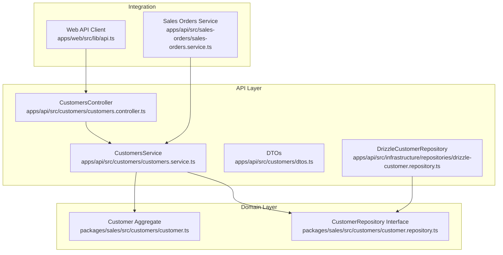
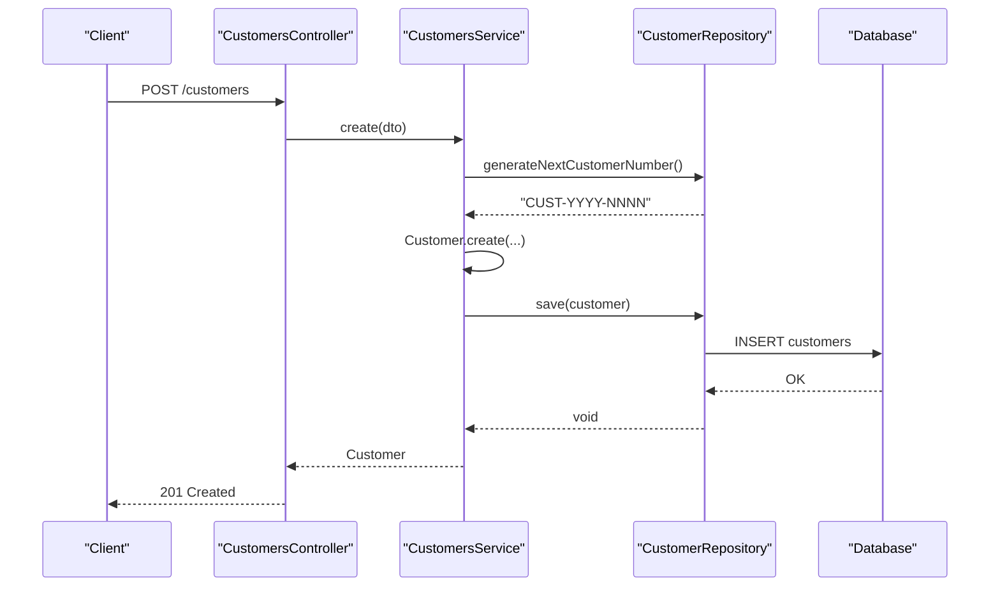
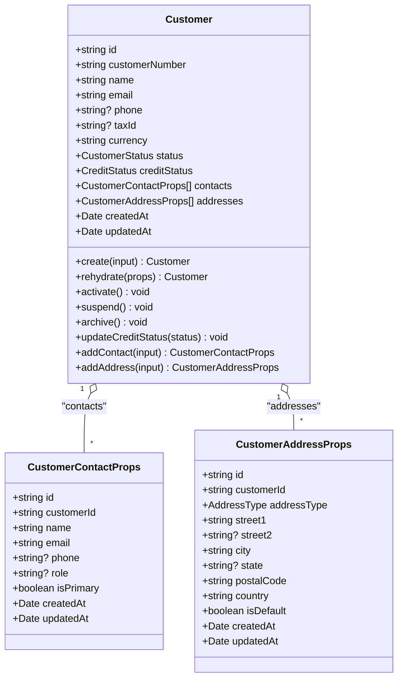
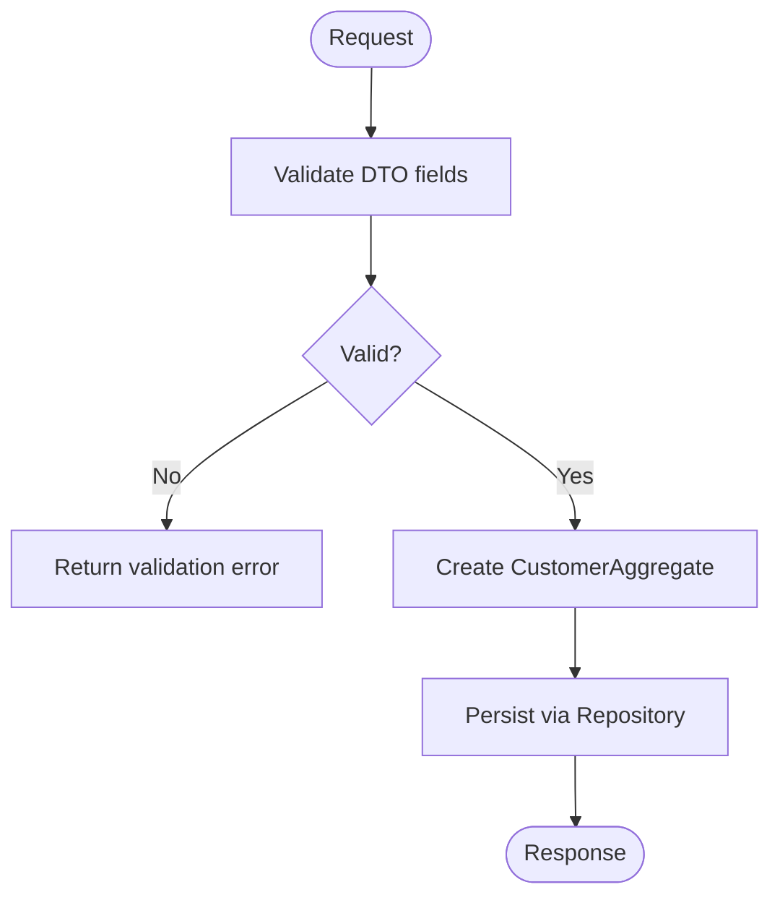
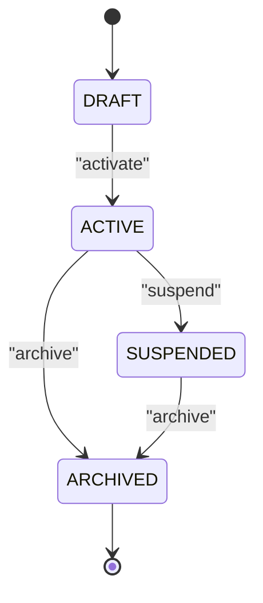
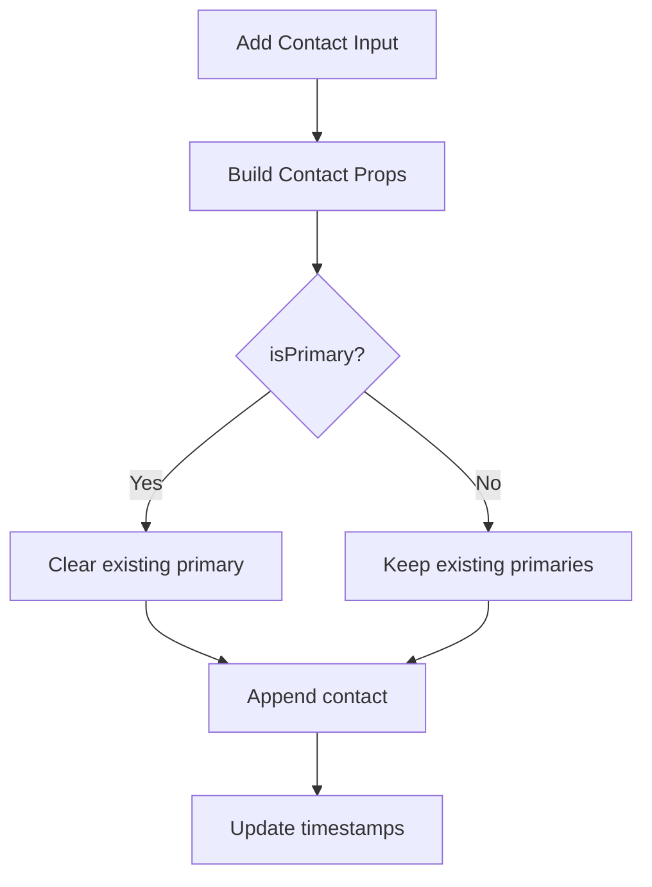
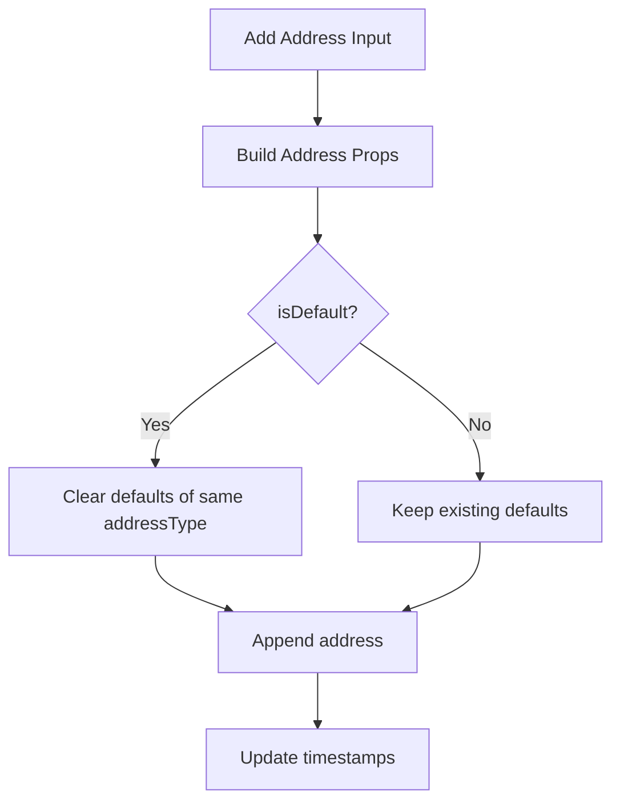
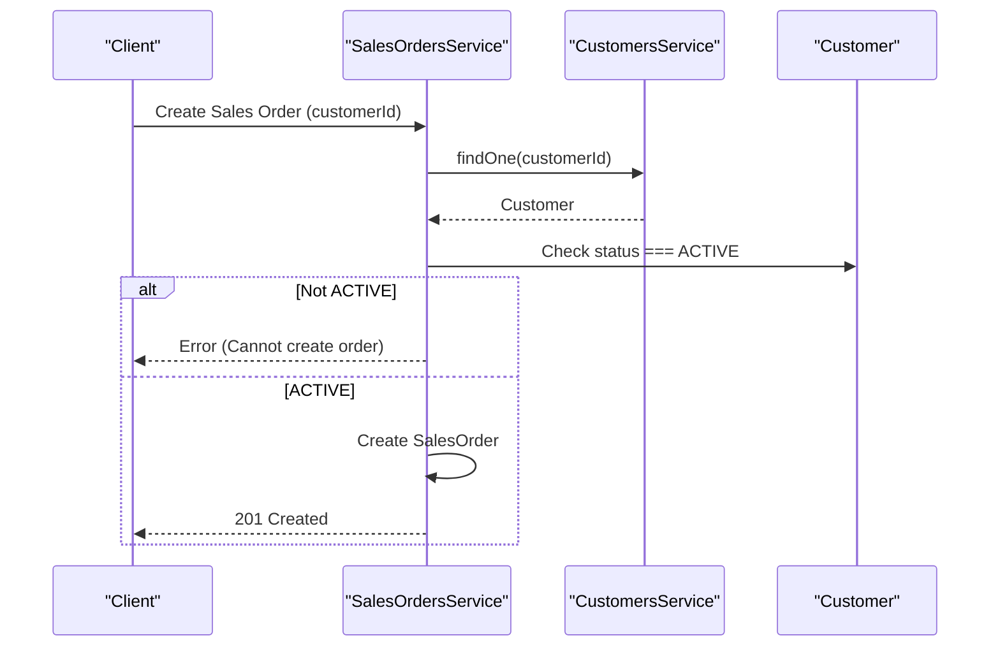
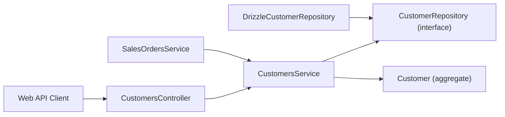

# Customer Management

<cite>
**Referenced Files in This Document**
- [0026-customer-management.md](file://docs/rfcs/0026-customer-management.md)
- [customer.ts](file://packages/sales/src/customers/customer.ts)
- [customer.repository.ts](file://packages/sales/src/customers/customer.repository.ts)
- [drizzle-customer.repository.ts](file://apps/api/src/infrastructure/repositories/drizzle-customer.repository.ts)
- [customers.controller.ts](file://apps/api/src/customers/customers.controller.ts)
- [customers.service.ts](file://apps/api/src/customers/customers.service.ts)
- [dtos.ts](file://apps/api/src/customers/dtos.ts)
- [sales-orders.service.ts](file://apps/api/src/sales-orders/sales-orders.service.ts)
- [api.ts](file://apps/web/src/lib/api.ts)
</cite>

## Table of Contents
1. Introduction
2. Project Structure
3. Core Components
4. Architecture Overview
5. Detailed Component Analysis
6. Dependency Analysis
7. Performance Considerations
8. Troubleshooting Guide
9. Conclusion

## Introduction
This document explains the Customer Management system within the Ananya ERP platform. It covers customer entity modeling, contact and address management, segmentation via status and credit status, account hierarchy concepts, lifecycle states, credit controls, tax configuration fields, and integration points with sales orders and quotations. It also addresses validation rules, duplicate detection considerations, and data privacy guidance.

## Project Structure
The Customer Management feature spans three layers:
- Domain layer (Sales package): Customer aggregate, types, and repository interface
- Application/API layer (NestJS): Controller, service, DTOs, and Drizzle repository implementation
- Documentation (RFC): Design intent, state machine, API surface, and domain invariants

**Diagram sources**
- [customer.ts:59-197](file://packages/sales/src/customers/customer.ts#L59-L197)
- [customer.repository.ts:1-15](file://packages/sales/src/customers/customer.repository.ts#L1-L15)
- [drizzle-customer.repository.ts:67-226](file://apps/api/src/infrastructure/repositories/drizzle-customer.repository.ts#L67-L226)
- [customers.controller.ts:10-50](file://apps/api/src/customers/customers.controller.ts#L10-L50)
- [customers.service.ts:17-84](file://apps/api/src/customers/customers.service.ts#L17-L84)
- [dtos.ts:10-86](file://apps/api/src/customers/dtos.ts#L10-L86)
- [sales-orders.service.ts:31-49](file://apps/api/src/sales-orders/sales-orders.service.ts#L31-L49)
- [api.ts:882-927](file://apps/web/src/lib/api.ts#L882-L927)

**Section sources**
- [0026-customer-management.md:1-124](file://docs/rfcs/0026-customer-management.md#L1-L124)

## Core Components
- Customer aggregate: Encapsulates identity, master data, contacts, addresses, status, and credit status. Provides factory methods and lifecycle transitions.
- Repository interface: Defines persistence operations for customers, including search and number generation.
- API controller and service: Expose REST endpoints for CRUD, lifecycle transitions, and relationship management.
- DTOs: Validate incoming payloads for creation and relationship updates.
- Drizzle repository: Persists customer, contacts, and addresses; maps database rows to domain objects.

Key responsibilities:
- Enforce domain invariants (status transitions, defaults).
- Provide query capabilities by status and search terms.
- Generate unique customer numbers.
- Persist related entities atomically per save operation.

**Section sources**
- [customer.ts:3-197](file://packages/sales/src/customers/customer.ts#L3-L197)
- [customer.repository.ts:1-15](file://packages/sales/src/customers/customer.repository.ts#L1-L15)
- [customers.controller.ts:10-50](file://apps/api/src/customers/customers.controller.ts#L10-L50)
- [customers.service.ts:17-84](file://apps/api/src/customers/customers.service.ts#L17-L84)
- [dtos.ts:10-86](file://apps/api/src/customers/dtos.ts#L10-L86)
- [drizzle-customer.repository.ts:22-226](file://apps/api/src/infrastructure/repositories/drizzle-customer.repository.ts#L22-L226)

## Architecture Overview
The Customer Management subsystem follows a layered architecture:
- Presentation/API: NestJS controller exposes REST endpoints.
- Application: Service orchestrates use cases, validates inputs, and delegates to domain and repository.
- Domain: Customer aggregate enforces business rules and state transitions.
- Infrastructure: Drizzle repository implements persistence using relational tables.

**Diagram sources**
- [customers.controller.ts:14-17](file://apps/api/src/customers/customers.controller.ts#L14-L17)
- [customers.service.ts:24-37](file://apps/api/src/customers/customers.service.ts#L24-L37)
- [drizzle-customer.repository.ts:220-225](file://apps/api/src/infrastructure/repositories/drizzle-customer.repository.ts#L220-L225)
- [customer.ts:90-107](file://packages/sales/src/customers/customer.ts#L90-L107)

## Detailed Component Analysis

### Customer Aggregate Model
The Customer aggregate models:
- Identity and master data: id, customerNumber, name, email, phone, taxId, currency
- Lifecycle and risk: status (DRAFT, ACTIVE, SUSPENDED, ARCHIVED), creditStatus (OK, ON_HOLD, CREDIT_EXCEEDED)
- Relationships: contacts and addresses collections
- Behaviors: activate, suspend, archive, updateCreditStatus, addContact, addAddress

**Diagram sources**
- [customer.ts:3-197](file://packages/sales/src/customers/customer.ts#L3-L197)

**Section sources**
- [customer.ts:3-197](file://packages/sales/src/customers/customer.ts#L3-L197)

### API Endpoints and Validation
Endpoints:
- POST /customers: Create a new customer
- GET /customers: List customers with optional status filter and search
- GET /customers/:id: Retrieve a single customer
- POST /customers/:id/activate: Transition to ACTIVE
- POST /customers/:id/suspend: Transition to SUSPENDED
- POST /customers/:id/contacts: Add a contact
- POST /customers/:id/addresses: Add an address

Validation highlights:
- Name and email are required on creation
- Email format validated
- Optional phone, taxId, currency
- Contact requires name and email; optional phone, role, isPrimary
- Address requires type, street1, city, postalCode, country; optional street2, state, isDefault

**Diagram sources**
- [dtos.ts:10-86](file://apps/api/src/customers/dtos.ts#L10-L86)
- [customers.service.ts:24-37](file://apps/api/src/customers/customers.service.ts#L24-L37)

**Section sources**
- [customers.controller.ts:10-50](file://apps/api/src/customers/customers.controller.ts#L10-L50)
- [dtos.ts:10-86](file://apps/api/src/customers/dtos.ts#L10-L86)

### Customer Lifecycle States
State machine:
- DRAFT → ACTIVE via activate
- ACTIVE → SUSPENDED via suspend
- ACTIVE or SUSPENDED → ARCHIVED via archive
- Archived cannot be activated again

Business rule:
- Inactive or suspended customers cannot accept quotations or place sales orders.

**Diagram sources**
- [0026-customer-management.md:69-77](file://docs/rfcs/0026-customer-management.md#L69-L77)
- [customer.ts:113-129](file://packages/sales/src/customers/customer.ts#L113-L129)

**Section sources**
- [0026-customer-management.md:63-77](file://docs/rfcs/0026-customer-management.md#L63-L77)
- [customer.ts:113-129](file://packages/sales/src/customers/customer.ts#L113-L129)

### Contact Information Management
- Contacts include name, email, phone, role, and primary flag
- Adding a contact can set it as primary; if so, existing primary is cleared
- Timestamps track creation and updates

**Diagram sources**
- [customer.ts:136-161](file://packages/sales/src/customers/customer.ts#L136-L161)

**Section sources**
- [customer.ts:136-161](file://packages/sales/src/customers/customer.ts#L136-L161)

### Address Management
- Addresses include billing/shipping/bboth type, location details, default flag
- Setting an address as default clears other defaults of the same type
- Timestamps track changes

**Diagram sources**
- [customer.ts:163-196](file://packages/sales/src/customers/customer.ts#L163-L196)

**Section sources**
- [customer.ts:163-196](file://packages/sales/src/customers/customer.ts#L163-L196)

### Customer Segmentation
Segmentation is achieved through:
- Status: DRAFT, ACTIVE, SUSPENDED, ARCHIVED
- Credit status: OK, ON_HOLD, CREDIT_EXCEEDED
- Search and filter APIs support listing by status and text search across name, number, and email

Use cases:
- Filter active customers for order creation
- Identify accounts on credit hold for review workflows

**Section sources**
- [customer.ts:3-5](file://packages/sales/src/customers/customer.ts#L3-L5)
- [customers.controller.ts:19-25](file://apps/api/src/customers/customers.controller.ts#L19-L25)
- [drizzle-customer.repository.ts:104-132](file://apps/api/src/infrastructure/repositories/drizzle-customer.repository.ts#L104-L132)

### Account Hierarchy
- The current model represents a flat customer account with multiple contacts and addresses
- No explicit parent-child hierarchy is modeled at this time
- Future extensions may introduce organizational hierarchies via additional attributes or linking structures

[No sources needed since this section provides conceptual guidance]

### Credit Limits, Payment Terms, and Tax Configurations
- Credit limits and payment terms are not modeled in the current Customer aggregate
- Tax configuration is represented by a taxId field
- Credit status can be updated via updateCreditStatus to reflect risk posture

Recommendations:
- Introduce numeric credit limit and payment term fields when financial policies require enforcement
- Use credit status to gate downstream processes (e.g., quotation acceptance, order creation)

**Section sources**
- [customer.ts:65-68](file://packages/sales/src/customers/customer.ts#L65-L68)
- [customer.ts:131-134](file://packages/sales/src/customers/customer.ts#L131-L134)

### Examples: Creation, Updates, and Relationship Management
- Create a customer: POST /customers with name, email, optional phone/taxId/currency
- Add a contact: POST /customers/:id/contacts with name, email, optional phone/role/isPrimary
- Add an address: POST /customers/:id/addresses with addressType, street1, city, postalCode, country, optional street2/state/isDefault
- Activate/suspend: POST /customers/:id/activate or /suspend

These flows are implemented by the controller delegating to the service, which uses the Customer aggregate and repository.

**Section sources**
- [customers.controller.ts:14-50](file://apps/api/src/customers/customers.controller.ts#L14-L50)
- [customers.service.ts:24-84](file://apps/api/src/customers/customers.service.ts#L24-L84)

### Integration with Sales Orders and Quotations
- Sales Order creation validates that the referenced customer is ACTIVE; otherwise, it rejects the request
- Web client exposes quotation operations that reference a customerId
- RFC defines a domain service guard to enforce ACTIVE status before commercial order creation

**Diagram sources**
- [sales-orders.service.ts:31-49](file://apps/api/src/sales-orders/sales-orders.service.ts#L31-L49)
- [0026-customer-management.md:51-54](file://docs/rfcs/0026-customer-management.md#L51-L54)

**Section sources**
- [sales-orders.service.ts:31-49](file://apps/api/src/sales-orders/sales-orders.service.ts#L31-L49)
- [api.ts:882-927](file://apps/web/src/lib/api.ts#L882-L927)
- [0026-customer-management.md:51-54](file://docs/rfcs/0026-customer-management.md#L51-L54)

### Data Validation Rules
- Required fields enforced via DTO decorators
- Email format validated
- Address type constrained to allowed values
- Default flags managed by domain logic to ensure consistency

Operational notes:
- Missing or invalid fields result in validation errors from the API layer
- Domain-level defaults (e.g., currency, status, credit status) are applied during creation

**Section sources**
- [dtos.ts:10-86](file://apps/api/src/customers/dtos.ts#L10-L86)
- [customer.ts:90-107](file://packages/sales/src/customers/customer.ts#L90-L107)

### Duplicate Detection and Data Privacy
Duplicate detection:
- No automated duplicate detection is implemented for customers in the current codebase
- RFC suggests uniqueness constraints on customer number and recommends ensuring at least one primary contact or address before activation
- Consider adding pre-save checks for name/email uniqueness and deduplication strategies

Data privacy compliance:
- Personal data includes email, phone, and contact names
- Ensure access controls and auditability around customer records
- Avoid logging sensitive fields and restrict retention according to policy

[No sources needed since this section provides general guidance]

## Dependency Analysis
The following diagram shows key dependencies between components:

**Diagram sources**
- [customers.controller.ts:1-12](file://apps/api/src/customers/customers.controller.ts#L1-L12)
- [customers.service.ts:1-22](file://apps/api/src/customers/customers.service.ts#L1-L22)
- [customer.repository.ts:1-15](file://packages/sales/src/customers/customer.repository.ts#L1-L15)
- [drizzle-customer.repository.ts:1-21](file://apps/api/src/infrastructure/repositories/drizzle-customer.repository.ts#L1-L21)
- [sales-orders.service.ts:31-49](file://apps/api/src/sales-orders/sales-orders.service.ts#L31-L49)
- [api.ts:882-927](file://apps/web/src/lib/api.ts#L882-L927)

**Section sources**
- [customers.controller.ts:1-50](file://apps/api/src/customers/customers.controller.ts#L1-L50)
- [customers.service.ts:1-84](file://apps/api/src/customers/customers.service.ts#L1-L84)
- [customer.repository.ts:1-15](file://packages/sales/src/customers/customer.repository.ts#L1-L15)
- [drizzle-customer.repository.ts:1-226](file://apps/api/src/infrastructure/repositories/drizzle-customer.repository.ts#L1-L226)
- [sales-orders.service.ts:31-49](file://apps/api/src/sales-orders/sales-orders.service.ts#L31-L49)
- [api.ts:882-927](file://apps/web/src/lib/api.ts#L882-L927)

## Performance Considerations
- Query performance: Filtering by status and searching by name/number/email is supported; consider indexing these columns in the database schema
- N+1 queries: The repository loads contacts and addresses per row; batch loading or eager joins could reduce round-trips for large lists
- Number generation: Current implementation counts all customers to compute next number; consider a dedicated sequence table for scalability

[No sources needed since this section provides general guidance]

## Troubleshooting Guide
Common issues and resolutions:
- Cannot create sales order for a customer: Ensure the customer status is ACTIVE; check the customer’s lifecycle and call activate if appropriate
- Not found errors: Verify the customer ID exists before calling find or lifecycle operations
- Validation failures: Confirm required fields and formats in DTOs (name, email, address fields)
- Primary/default conflicts: When setting a contact or address as primary/default, existing ones are cleared automatically; verify expected behavior

**Section sources**
- [sales-orders.service.ts:31-49](file://apps/api/src/sales-orders/sales-orders.service.ts#L31-L49)
- [customers.service.ts:43-49](file://apps/api/src/customers/customers.service.ts#L43-L49)
- [dtos.ts:10-86](file://apps/api/src/customers/dtos.ts#L10-L86)

## Conclusion
The Customer Management system provides a robust foundation for managing customer master data, contacts, and addresses, with clear lifecycle controls and integration safeguards for downstream sales processes. While credit limits and payment terms are not yet modeled, the design allows for future extension. Validation and repository patterns ensure data integrity, while the API surface supports essential operational workflows. For production readiness, consider implementing duplicate detection, enhanced indexing, and privacy controls aligned with organizational policies.