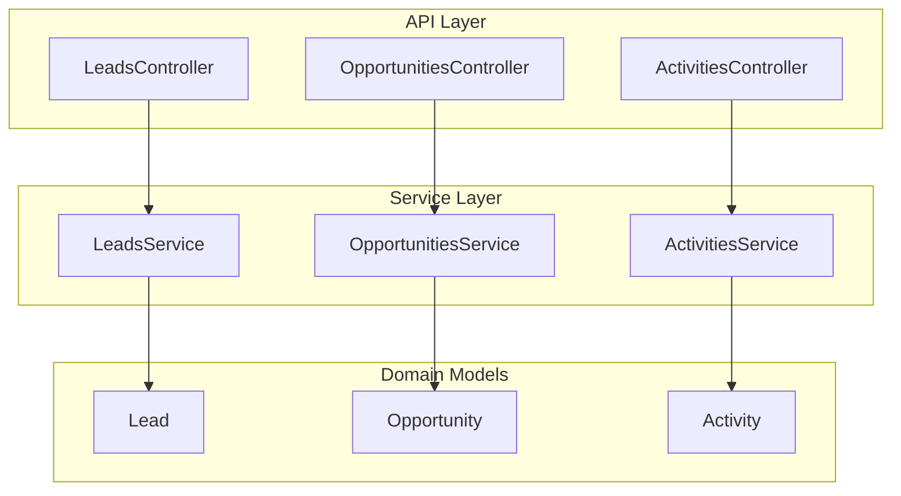
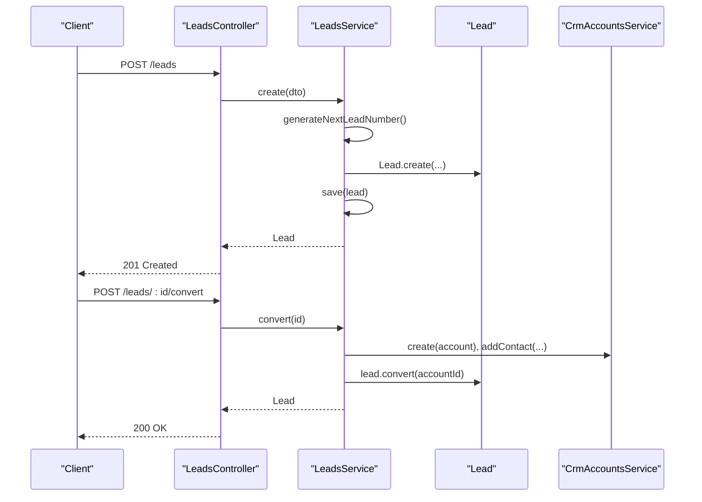
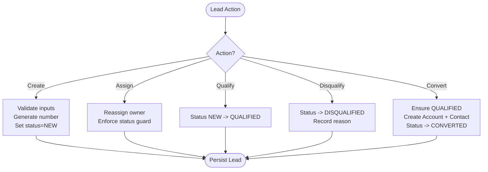
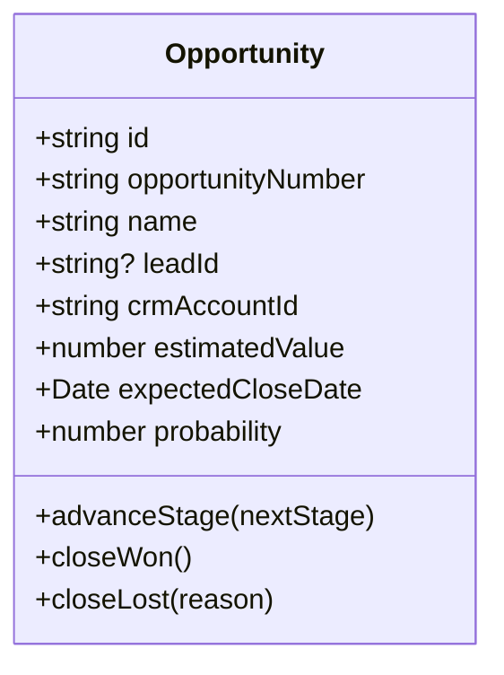
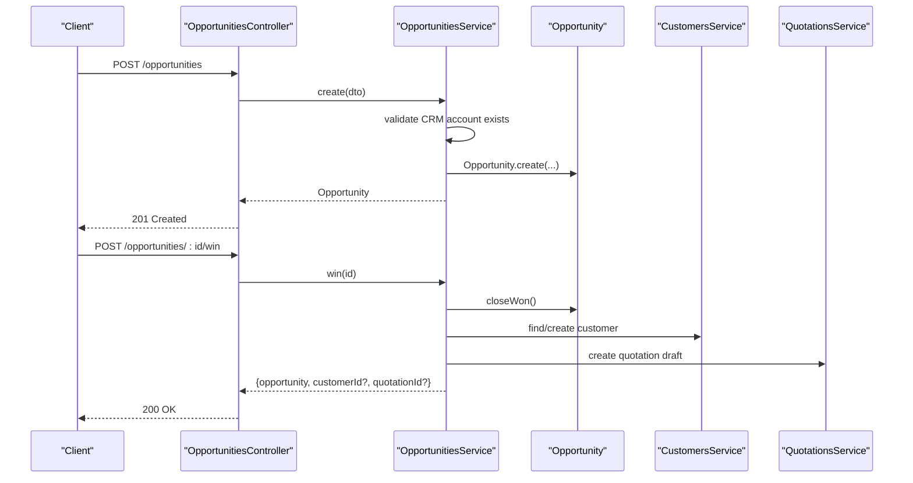
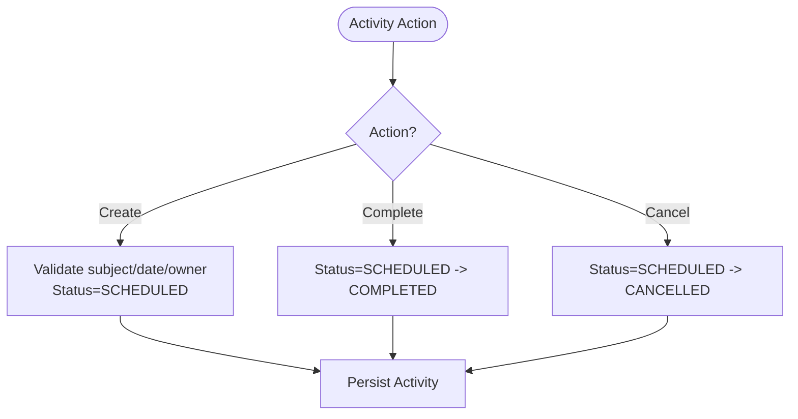
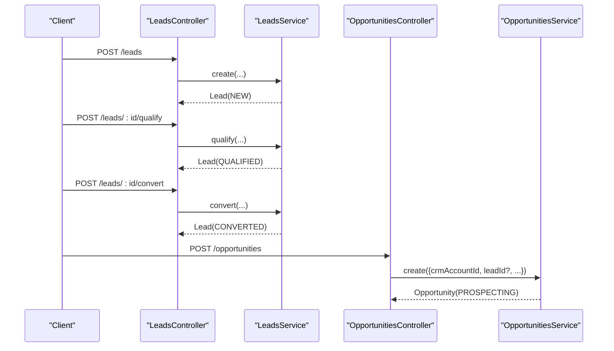
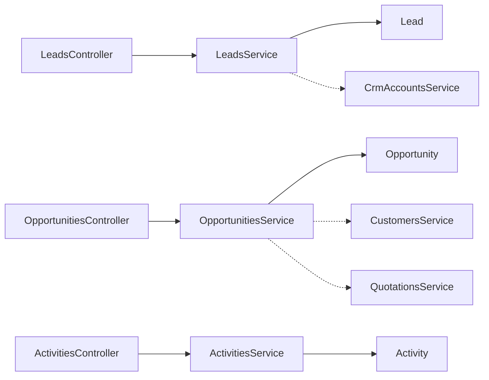

# Lead & Opportunity Management

<cite>
**Referenced Files in This Document**
- [leads.controller.ts](file://apps/api/src/leads/leads.controller.ts)
- [leads.service.ts](file://apps/api/src/leads/leads.service.ts)
- [dtos.ts (leads)](file://apps/api/src/leads/dtos.ts)
- [opportunities.controller.ts](file://apps/api/src/opportunities/opportunities.controller.ts)
- [opportunities.service.ts](file://apps/api/src/opportunities/opportunities.service.ts)
- [dtos.ts (opportunities)](file://apps/api/src/opportunities/dtos.ts)
- [activities.controller.ts](file://apps/api/src/activities/activities.controller.ts)
- [activities.service.ts](file://apps/api/src/activities/activities.service.ts)
- [dtos.ts (activities)](file://apps/api/src/activities/dtos.ts)
- [lead.ts](file://packages/crm/src/leads/lead.ts)
- [opportunity.ts](file://packages/crm/src/opportunities/opportunity.ts)
- [activity.ts](file://packages/crm/src/activities/activity.ts)
</cite>

## Table of Contents
1. Introduction
2. Project Structure
3. Core Components
4. Architecture Overview
5. Detailed Component Analysis
6. Dependency Analysis
7. Performance Considerations
8. Troubleshooting Guide
9. Conclusion

## Introduction
This document explains the lead and opportunity tracking functionality, including how leads are generated, scored, qualified, converted to opportunities, and progressed through a sales pipeline. It also covers activity tracking, follow-up scheduling, and collaboration features that support sales teams. The system is implemented as NestJS API controllers and services backed by domain models in a shared CRM package.

## Project Structure
The CRM feature spans three main areas:
- Leads: creation, assignment, qualification/disqualification, and conversion to CRM accounts
- Opportunities: creation from leads or accounts, stage progression, win/lose handling, and integration with quotations
- Activities: scheduling and tracking calls, meetings, emails, tasks, and demos linked to leads, accounts, or opportunities

**Diagram sources**
- [leads.controller.ts:6-48](file://apps/api/src/leads/leads.controller.ts#L6-L48)
- [opportunities.controller.ts:10-49](file://apps/api/src/opportunities/opportunities.controller.ts#L10-L49)
- [activities.controller.ts:6-47](file://apps/api/src/activities/activities.controller.ts#L6-L47)
- [leads.service.ts:8-97](file://apps/api/src/leads/leads.service.ts#L8-L97)
- [opportunities.service.ts:24-133](file://apps/api/src/opportunities/opportunities.service.ts#L24-L133)
- [activities.service.ts:12-71](file://apps/api/src/activities/activities.service.ts#L12-L71)
- [lead.ts:36-136](file://packages/crm/src/leads/lead.ts#L36-L136)
- [opportunity.ts:31-121](file://packages/crm/src/opportunities/opportunity.ts#L31-L121)
- [activity.ts:31-97](file://packages/crm/src/activities/activity.ts#L31-L97)

**Section sources**
- [leads.controller.ts:6-48](file://apps/api/src/leads/leads.controller.ts#L6-L48)
- [opportunities.controller.ts:10-49](file://apps/api/src/opportunities/opportunities.controller.ts#L10-L49)
- [activities.controller.ts:6-47](file://apps/api/src/activities/activities.controller.ts#L6-L47)

## Core Components
- Leads: Create, list, assign, qualify, disqualify, convert to CRM account; supports filtering by status, source, owner, and search
- Opportunities: Create, list, advance stages, close won/lost; integrates with customers and quotations on win
- Activities: Create, list, complete, cancel; link activities to leads, accounts, or opportunities for collaboration and follow-ups

Key capabilities:
- Lead generation sources via typed enum values
- Stage-based probability updates for opportunities
- Automated handoff to sales artifacts when an opportunity is won
- Activity scheduling and lifecycle management

**Section sources**
- [leads.service.ts:16-97](file://apps/api/src/leads/leads.service.ts#L16-L97)
- [opportunities.service.ts:34-133](file://apps/api/src/opportunities/opportunities.service.ts#L34-L133)
- [activities.service.ts:19-71](file://apps/api/src/activities/activities.service.ts#L19-L71)

## Architecture Overview
The API exposes REST endpoints that delegate to services. Services enforce business rules using domain models and coordinate with other modules (CRM accounts, customers, quotations). Domain models encapsulate state transitions and validation.

**Diagram sources**
- [leads.controller.ts:10-48](file://apps/api/src/leads/leads.controller.ts#L10-L48)
- [leads.service.ts:16-97](file://apps/api/src/leads/leads.service.ts#L16-L97)
- [lead.ts:69-136](file://packages/crm/src/leads/lead.ts#L69-L136)

**Section sources**
- [leads.controller.ts:6-48](file://apps/api/src/leads/leads.controller.ts#L6-L48)
- [leads.service.ts:8-97](file://apps/api/src/leads/leads.service.ts#L8-L97)

## Detailed Component Analysis

### Lead Management
- Sources: Typed enumeration defines supported channels such as website, referral, trade show, cold outreach, inbound phone
- Statuses: NEW, QUALIFIED, DISQUALIFIED, CONVERTED
- Lifecycle:
  - Create: validates required fields, assigns default source if missing, sets initial status to NEW
  - Assign: reassigns owner unless lead is CONVERTED or DISQUALIFIED
  - Qualify: only allowed from NEW to QUALIFIED
  - Disqualify: records reason; not allowed after conversion
  - Convert: requires QUALIFIED; creates CRM account and primary contact, then marks lead as CONVERTED

**Diagram sources**
- [lead.ts:69-136](file://packages/crm/src/leads/lead.ts#L69-L136)
- [leads.service.ts:16-97](file://apps/api/src/leads/leads.service.ts#L16-L97)

**Section sources**
- [lead.ts:3-23](file://packages/crm/src/leads/lead.ts#L3-L23)
- [lead.ts:69-136](file://packages/crm/src/leads/lead.ts#L69-L136)
- [leads.service.ts:16-97](file://apps/api/src/leads/leads.service.ts#L16-L97)
- [dtos.ts (leads):4-44](file://apps/api/src/leads/dtos.ts#L4-L44)

### Opportunity Pipeline and Revenue Forecasting
- Stages: PROSPECTING, QUALIFICATION, PROPOSAL, NEGOTIATION, WON, LOST
- Probability:
  - Defaults to 20% at creation
  - Updates automatically on stage advancement:
    - QUALIFICATION -> 40%
    - PROPOSAL -> 60%
    - NEGOTIATION -> 80%
  - WON -> 100%, LOST -> 0%
- Win flow:
  - On win, attempts to create or reuse a Customer and generates a draft Quotation; errors are tolerated to avoid blocking sales closure
- Creation:
  - Requires CRM account ID and estimated value; optional lead reference

**Diagram sources**
- [opportunity.ts:31-121](file://packages/crm/src/opportunities/opportunity.ts#L31-L121)

**Diagram sources**
- [opportunities.controller.ts:14-49](file://apps/api/src/opportunities/opportunities.controller.ts#L14-L49)
- [opportunities.service.ts:34-126](file://apps/api/src/opportunities/opportunities.service.ts#L34-L126)
- [opportunity.ts:60-121](file://packages/crm/src/opportunities/opportunity.ts#L60-L121)

**Section sources**
- [opportunity.ts:3-19](file://packages/crm/src/opportunities/opportunity.ts#L3-L19)
- [opportunity.ts:60-121](file://packages/crm/src/opportunities/opportunity.ts#L60-L121)
- [opportunities.service.ts:34-133](file://apps/api/src/opportunities/opportunities.service.ts#L34-L133)
- [dtos.ts (opportunities):11-47](file://apps/api/src/opportunities/dtos.ts#L11-L47)

### Activity Tracking and Follow-ups
- Types: CALL, MEETING, EMAIL, TASK, DEMO
- Statuses: SCHEDULED, COMPLETED, CANCELLED
- Linkage: Activities can be associated with leads, accounts, or opportunities for context
- Operations:
  - Create: validates subject, due date, owner; defaults to SCHEDULED
  - Complete: prevents completion if already cancelled
  - Cancel: prevents cancellation if already completed

**Diagram sources**
- [activity.ts:31-97](file://packages/crm/src/activities/activity.ts#L31-L97)
- [activities.service.ts:19-71](file://apps/api/src/activities/activities.service.ts#L19-L71)

**Section sources**
- [activity.ts:3-19](file://packages/crm/src/activities/activity.ts#L3-L19)
- [activity.ts:58-97](file://packages/crm/src/activities/activity.ts#L58-L97)
- [activities.service.ts:19-71](file://apps/api/src/activities/activities.service.ts#L19-L71)
- [dtos.ts (activities):9-37](file://apps/api/src/activities/dtos.ts#L9-L37)

### Lead Conversion to Opportunity
While conversion primarily produces a CRM account and contact, opportunities are created separately and can reference the originating lead. Typical workflow:
- Create a lead and qualify it
- Convert the lead to a CRM account and contact
- Create an opportunity linked to the account (and optionally the original lead)
- Advance through stages to update probability and forecast revenue

**Diagram sources**
- [leads.controller.ts:10-48](file://apps/api/src/leads/leads.controller.ts#L10-L48)
- [leads.service.ts:16-97](file://apps/api/src/leads/leads.service.ts#L16-L97)
- [opportunities.controller.ts:14-17](file://apps/api/src/opportunities/opportunities.controller.ts#L14-L17)
- [opportunities.service.ts:34-49](file://apps/api/src/opportunities/opportunities.service.ts#L34-L49)

**Section sources**
- [leads.service.ts:16-97](file://apps/api/src/leads/leads.service.ts#L16-L97)
- [opportunities.service.ts:34-49](file://apps/api/src/opportunities/opportunities.service.ts#L34-L49)

## Dependency Analysis
- Controllers depend on their respective services for request handling
- Services depend on domain models for business rules and on other services for cross-module operations (e.g., CRM accounts, customers, quotations)
- Domain models encapsulate state machines and validation, ensuring consistent behavior across the system

**Diagram sources**
- [leads.controller.ts:6-48](file://apps/api/src/leads/leads.controller.ts#L6-L48)
- [opportunities.controller.ts:10-49](file://apps/api/src/opportunities/opportunities.controller.ts#L10-L49)
- [activities.controller.ts:6-47](file://apps/api/src/activities/activities.controller.ts#L6-L47)
- [leads.service.ts:8-97](file://apps/api/src/leads/leads.service.ts#L8-L97)
- [opportunities.service.ts:24-133](file://apps/api/src/opportunities/opportunities.service.ts#L24-L133)
- [activities.service.ts:12-71](file://apps/api/src/activities/activities.service.ts#L12-L71)

**Section sources**
- [leads.service.ts:8-97](file://apps/api/src/leads/leads.service.ts#L8-L97)
- [opportunities.service.ts:24-133](file://apps/api/src/opportunities/opportunities.service.ts#L24-L133)
- [activities.service.ts:12-71](file://apps/api/src/activities/activities.service.ts#L12-L71)

## Performance Considerations
- Use query filters on controllers to reduce payload sizes (status, source, owner, search for leads; stage, crmAccountId, search for opportunities; type, status, owner, related IDs for activities)
- Avoid unnecessary joins by leveraging repository abstractions exposed by services
- Batch operations where possible (e.g., bulk activity creation) to minimize network overhead
- Ensure indexes on frequently filtered fields (status, source, stage, owner, related IDs) at the data layer

[No sources needed since this section provides general guidance]

## Troubleshooting Guide
Common issues and resolutions:
- Cannot assign owner to converted/disqualified lead: ensure the lead is still active before reassignment
- Only NEW leads can be qualified: verify current status before calling qualify
- Converted leads cannot be disqualified: conversion finalizes the lead lifecycle
- Closed opportunities cannot advance: WON or LOST states prevent further stage changes
- Won/Lost transitions are mutually exclusive: ensure correct closing action based on current stage
- Activity completion/cancellation conflicts: cannot complete a cancelled activity or cancel a completed one

Validation and error handling:
- DTOs enforce required fields and types at the API boundary
- Domain models throw explicit errors for invalid state transitions
- Services throw NotFound exceptions when entities are missing

**Section sources**
- [lead.ts:98-136](file://packages/crm/src/leads/lead.ts#L98-L136)
- [opportunity.ts:91-121](file://packages/crm/src/opportunities/opportunity.ts#L91-L121)
- [activity.ts:83-97](file://packages/crm/src/activities/activity.ts#L83-L97)
- [leads.service.ts:41-67](file://apps/api/src/leads/leads.service.ts#L41-L67)
- [opportunities.service.ts:63-68](file://apps/api/src/opportunities/opportunities.service.ts#L63-L68)
- [activities.service.ts:51-69](file://apps/api/src/activities/activities.service.ts#L51-L69)

## Conclusion
The system provides a robust foundation for lead and opportunity management with clear state machines, automated probability updates, and integrated sales handoff workflows. Activities enable team collaboration and follow-up tracking across the CRM lifecycle. By leveraging typed enums, strict validation, and service-layer orchestration, the platform ensures consistency and extensibility for future enhancements.