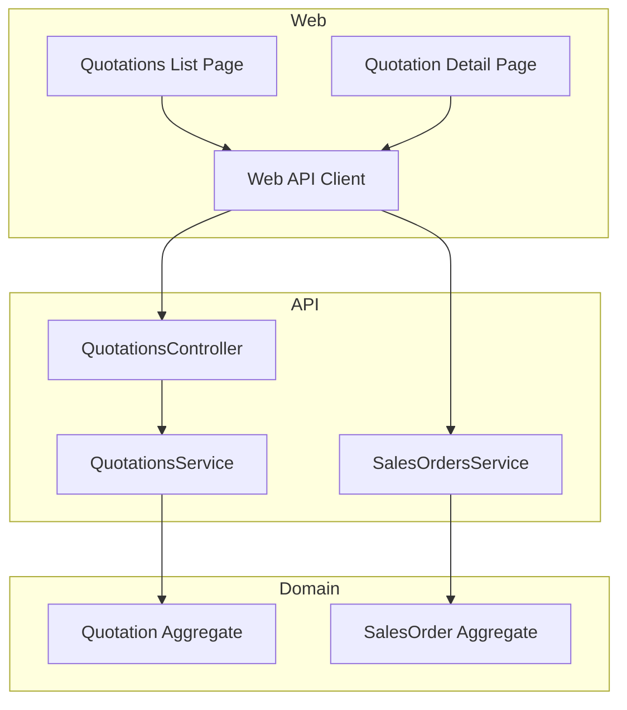
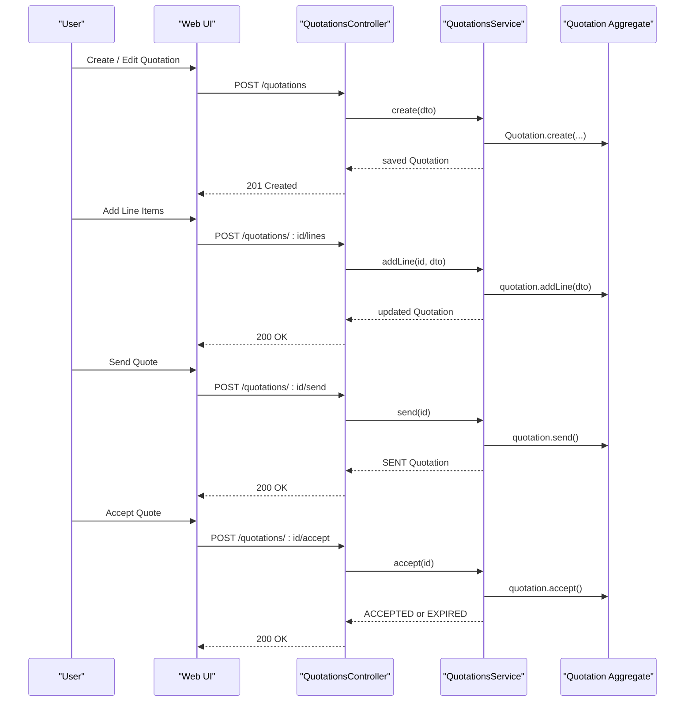
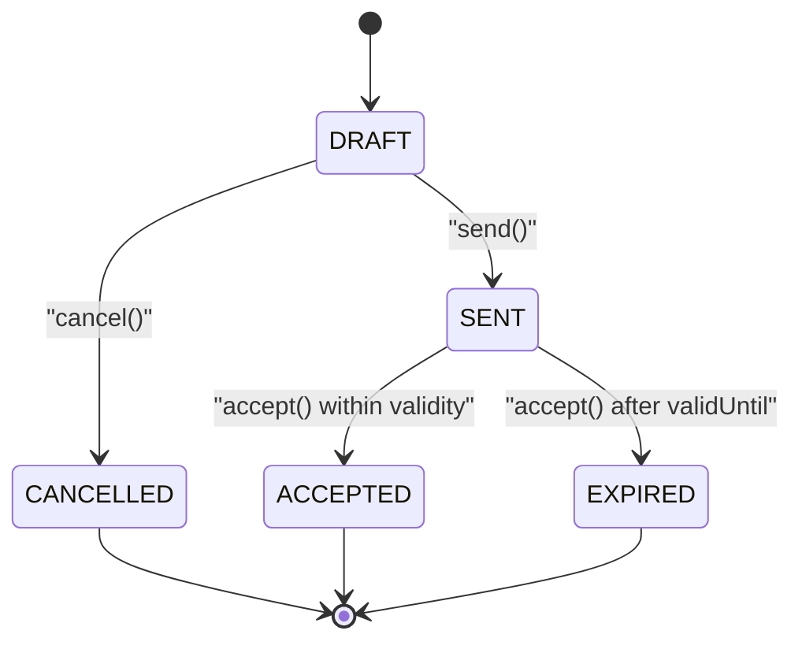
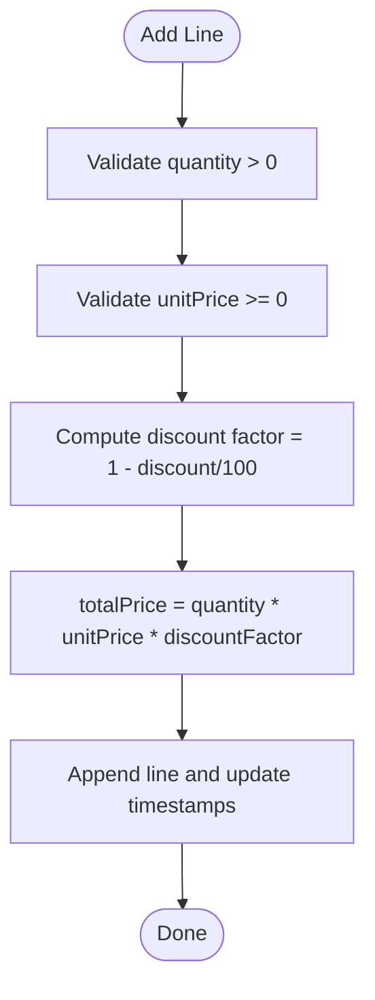
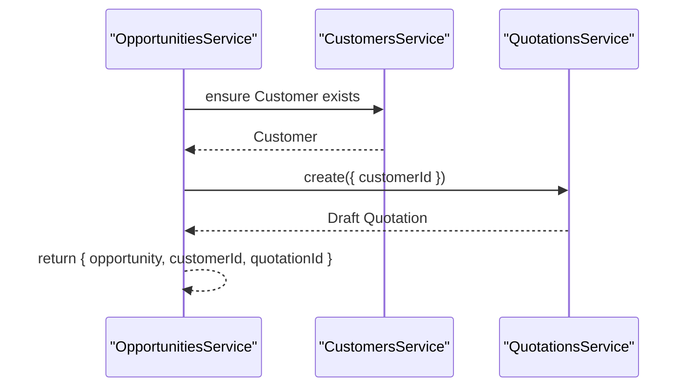
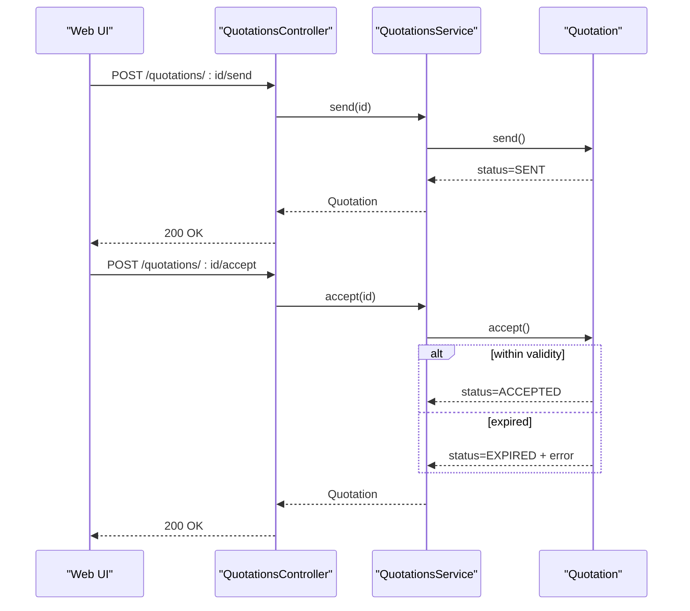
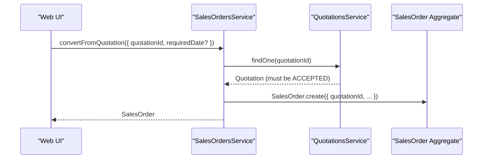
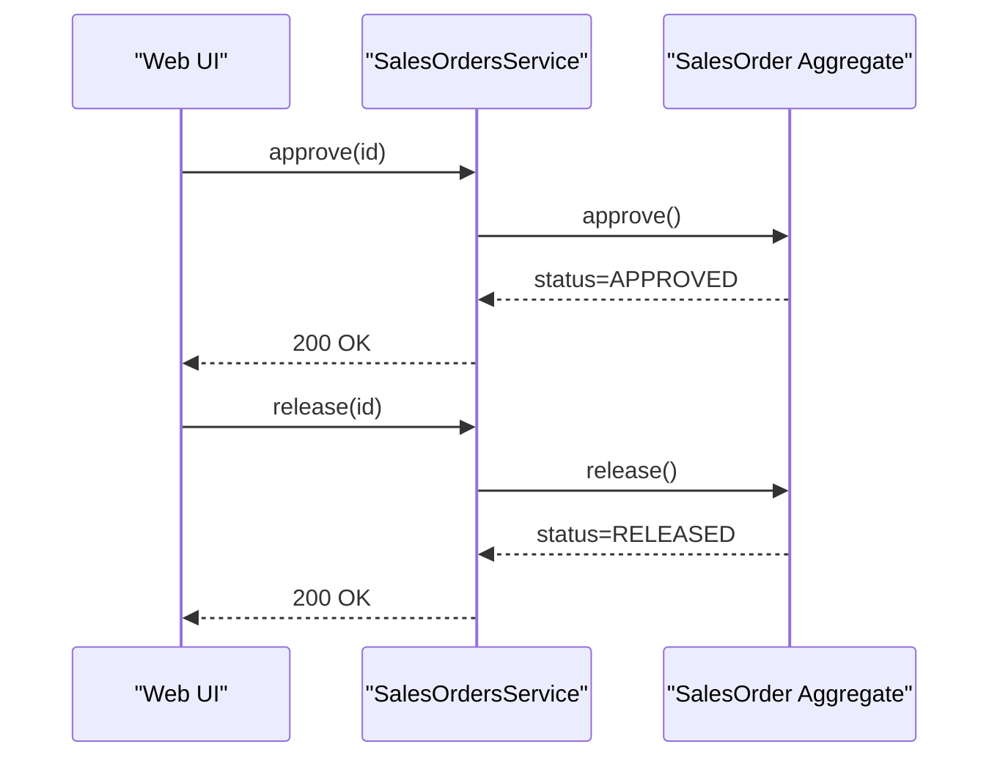
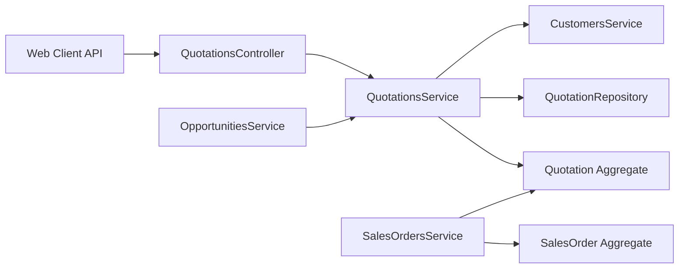

# Quotation System

<cite>
**Referenced Files in This Document**
- [0027-quotations-and-sales-orders.md](file://docs/rfcs/0027-quotations-and-sales-orders.md)
- [quotation.ts](file://packages/sales/src/quotations/quotation.ts)
- [quotations.controller.ts](file://apps/api/src/quotations/quotations.controller.ts)
- [quotations.service.ts](file://apps/api/src/quotations/quotations.service.ts)
- [sales-orders.service.ts](file://apps/api/src/sales-orders/sales-orders.service.ts)
- [sales-order.ts](file://packages/sales/src/sales-orders/sales-order.ts)
- [opportunities.service.ts](file://apps/api/src/opportunities/opportunities.service.ts)
- [api.ts](file://apps/web/src/lib/api.ts)
- [page.tsx (Quotations list)](file://apps/web/app/quotations/page.tsx)
- [page.tsx (Quotation detail)](file://apps/web/app/quotations/[id]/page.tsx)
</cite>

## Table of Contents
1. Introduction
2. Project Structure
3. Core Components
4. Architecture Overview
5. Detailed Component Analysis
6. Dependency Analysis
7. Performance Considerations
8. Troubleshooting Guide
9. Conclusion
10. Appendices

## Introduction
This document explains the quotation management system: how quotations are created from leads or opportunities, pricing calculations and discount application, status tracking, acceptance workflows, conversion to sales orders, and related analytics. It focuses on the implemented domain model, API endpoints, and UI flows that support end-to-end quote-to-order processes.

## Project Structure
The quotation feature spans multiple layers:
- Domain model for Quotation and Sales Order aggregates
- Application services exposing REST endpoints
- Web client APIs and pages for listing, creating, sending, accepting, and converting quotations
- RFC defining state machines, invariants, and integration points

**Diagram sources**
- [page.tsx (Quotations list):54-194](file://apps/web/app/quotations/page.tsx#L54-L194)
- [page.tsx (Quotation detail):1-40](file://apps/web/app/quotations/[id]/page.tsx#L1-L40)
- [api.ts:882-927](file://apps/web/src/lib/api.ts#L882-L927)
- [quotations.controller.ts:6-46](file://apps/api/src/quotations/quotations.controller.ts#L6-L46)
- [quotations.service.ts:21-80](file://apps/api/src/quotations/quotations.service.ts#L21-L80)
- [sales-orders.service.ts:31-66](file://apps/api/src/sales-orders/sales-orders.service.ts#L31-L66)
- [quotation.ts:44-157](file://packages/sales/src/quotations/quotation.ts#L44-L157)
- [sales-order.ts:153-191](file://packages/sales/src/sales-orders/sales-order.ts#L153-L191)

**Section sources**
- [0027-quotations-and-sales-orders.md:1-114](file://docs/rfcs/0027-quotations-and-sales-orders.md#L1-L114)

## Core Components
- Quotation aggregate: defines states, line items, pricing, discounts, validity, and transitions.
- Quotations API: create, add lines, send, accept, cancel; list by customer/status.
- Opportunities integration: automatically creates a draft quotation when an opportunity is won.
- Sales Orders conversion: only ACCEPTED quotations can be converted into Sales Orders.
- Web UI: lists quotations, shows totals and conversion rate, provides actions to send PDF and convert to order.

Key responsibilities:
- Pricing and discount calculation per line item within the domain aggregate.
- Status enforcement via domain methods (DRAFT → SENT → ACCEPTED/EXPIRED/CANCELLED).
- Conversion guardrails ensuring only accepted quotes become orders.

**Section sources**
- [quotation.ts:44-157](file://packages/sales/src/quotations/quotation.ts#L44-L157)
- [quotations.controller.ts:6-46](file://apps/api/src/quotations/quotations.controller.ts#L6-L46)
- [quotations.service.ts:21-80](file://apps/api/src/quotations/quotations.service.ts#L21-L80)
- [opportunities.service.ts:81-126](file://apps/api/src/opportunities/opportunities.service.ts#L81-L126)
- [sales-orders.service.ts:31-66](file://apps/api/src/sales-orders/sales-orders.service.ts#L31-L66)
- [page.tsx (Quotations list):54-194](file://apps/web/app/quotations/page.tsx#L54-L194)

## Architecture Overview
The system follows a layered architecture with clear separation between presentation, API, and domain logic. The RFC defines the canonical state machines and invariants that both API and domain enforce.

**Diagram sources**
- [quotations.controller.ts:10-46](file://apps/api/src/quotations/quotations.controller.ts#L10-L46)
- [quotations.service.ts:21-80](file://apps/api/src/quotations/quotations.service.ts#L21-L80)
- [quotation.ts:67-157](file://packages/sales/src/quotations/quotation.ts#L67-L157)

## Detailed Component Analysis

### Quotation Domain Model
- States: DRAFT, SENT, ACCEPTED, EXPIRED, CANCELLED.
- Lines: componentId, quantity, unitPrice, discount percentage, totalPrice computed per line.
- Validity: default validUntil set at creation; accept enforces expiry.
- Invariants:
  - Only DRAFT allows adding lines.
  - Only DRAFT can be sent.
  - Only SENT can be accepted; if expired, becomes EXPIRED.
  - ACCEPTED cannot be cancelled.

**Diagram sources**
- [quotation.ts:3-4](file://packages/sales/src/quotations/quotation.ts#L3-L4)
- [quotation.ts:125-157](file://packages/sales/src/quotations/quotation.ts#L125-L157)

**Section sources**
- [quotation.ts:44-157](file://packages/sales/src/quotations/quotation.ts#L44-L157)

### Pricing and Discount Calculation
- Per-line total price is calculated as: quantity × unitPrice × (1 − discount/100).
- Total quotation amount is the sum of all line totals.
- Validation ensures positive quantities and non-negative unit prices.

**Diagram sources**
- [quotation.ts:93-123](file://packages/sales/src/quotations/quotation.ts#L93-L123)

**Section sources**
- [quotation.ts:89-123](file://packages/sales/src/quotations/quotation.ts#L89-L123)

### Quotation Creation from Opportunities
- When an opportunity is closed won, the system attempts to:
  - Ensure a corresponding Customer exists (create if missing).
  - Generate a draft Quotation linked to that Customer.
- Errors during handoff are ignored to avoid blocking opportunity closure.

**Diagram sources**
- [opportunities.service.ts:81-126](file://apps/api/src/opportunities/opportunities.service.ts#L81-L126)

**Section sources**
- [opportunities.service.ts:81-126](file://apps/api/src/opportunities/opportunities.service.ts#L81-L126)

### Quotation Approval Workflow and Status Tracking
- Send: transitions DRAFT → SENT; requires at least one line.
- Accept: transitions SENT → ACCEPTED if within validity; otherwise SENT → EXPIRED.
- Cancel: transitions non-ACCEPTED to CANCELLED; ACCEPTED cannot be cancelled.

**Diagram sources**
- [quotations.controller.ts:33-46](file://apps/api/src/quotations/quotations.controller.ts#L33-L46)
- [quotations.service.ts:62-80](file://apps/api/src/quotations/quotations.service.ts#L62-L80)
- [quotation.ts:125-157](file://packages/sales/src/quotations/quotation.ts#L125-L157)

**Section sources**
- [quotations.controller.ts:33-46](file://apps/api/src/quotations/quotations.controller.ts#L33-L46)
- [quotations.service.ts:62-80](file://apps/api/src/quotations/quotations.service.ts#L62-L80)
- [quotation.ts:125-157](file://packages/sales/src/quotations/quotation.ts#L125-L157)

### Quote-to-Order Conversion
- Only ACCEPTED quotations can be converted to Sales Orders.
- Conversion creates a new Sales Order referencing the original quotation.
- The RFC also documents approval and release workflows for Sales Orders.

**Diagram sources**
- [sales-orders.service.ts:51-66](file://apps/api/src/sales-orders/sales-orders.service.ts#L51-L66)
- [0027-quotations-and-sales-orders.md:45-66](file://docs/rfcs/0027-quotations-and-sales-orders.md#L45-L66)

**Section sources**
- [sales-orders.service.ts:51-66](file://apps/api/src/sales-orders/sales-orders.service.ts#L51-L66)
- [0027-quotations-and-sales-orders.md:45-66](file://docs/rfcs/0027-quotations-and-sales-orders.md#L45-L66)

### Sales Order Approval and Release Flow
- Approve: DRAFT → APPROVED.
- Release: APPROVED → RELEASED (triggers fulfillment downstream).
- Fulfillment updates line-level fulfilled quantities and finalizes order status.

**Diagram sources**
- [sales-order.ts:153-161](file://packages/sales/src/sales-orders/sales-order.ts#L153-L161)
- [api.ts:972-984](file://apps/web/src/lib/api.ts#L972-L984)

**Section sources**
- [sales-order.ts:153-191](file://packages/sales/src/sales-orders/sales-order.ts#L153-L191)
- [api.ts:972-984](file://apps/web/src/lib/api.ts#L972-L984)

### Template Management
- No dedicated template entity or service was found in the analyzed files.
- The web UI includes a “Send PDF to Client” action on the quotation detail page, indicating print/PDF generation may be handled elsewhere or via external tooling.

[No sources needed since this section summarizes findings without analyzing specific files beyond what is already cited above]

### Tax Handling
- No tax fields or tax calculation logic were identified in the quotation domain or API surfaces reviewed.
- Future extensions mentioned in the RFC include automated price tier matrices and volume discounts, but not taxes.

[No sources needed since this section summarizes findings without analyzing specific files beyond what is already cited above]

### Version Control
- The current implementation does not expose explicit versioning for quotations in the analyzed code.
- Each change updates timestamps; audit/versioning could be extended using activity/document features present in the platform.

[No sources needed since this section summarizes findings without analyzing specific files beyond what is already cited above]

### Analytics, Conversion Rates, and Sales Performance
- The quotations list page displays:
  - Total quotations count
  - Accepted proposals count
  - Conversion rate metric
- These metrics enable basic performance visibility; deeper analytics can be built atop these counts and statuses.

**Section sources**
- [page.tsx (Quotations list):168-184](file://apps/web/app/quotations/page.tsx#L168-L184)

## Dependency Analysis
- QuotationsController depends on QuotationsService and uses QuotationStatus from the sales package.
- QuotationsService depends on CustomersService for validation and on the QuotationRepository abstraction.
- OpportunitiesService integrates with QuotationsService to auto-create drafts upon winning deals.
- SalesOrdersService enforces conversion rules based on quotation status.

**Diagram sources**
- [quotations.controller.ts:1-46](file://apps/api/src/quotations/quotations.controller.ts#L1-L46)
- [quotations.service.ts:1-80](file://apps/api/src/quotations/quotations.service.ts#L1-L80)
- [sales-orders.service.ts:31-66](file://apps/api/src/sales-orders/sales-orders.service.ts#L31-L66)
- [opportunities.service.ts:81-126](file://apps/api/src/opportunities/opportunities.service.ts#L81-L126)

**Section sources**
- [quotations.controller.ts:1-46](file://apps/api/src/quotations/quotations.controller.ts#L1-L46)
- [quotations.service.ts:1-80](file://apps/api/src/quotations/quotations.service.ts#L1-L80)
- [sales-orders.service.ts:31-66](file://apps/api/src/sales-orders/sales-orders.service.ts#L31-L66)
- [opportunities.service.ts:81-126](file://apps/api/src/opportunities/opportunities.service.ts#L81-L126)

## Performance Considerations
- Keep quotation line additions minimal per request; batch operations can reduce round trips.
- Avoid unnecessary re-fetches of quotation details in the UI; cache where appropriate.
- For large catalogs, consider server-side filtering and pagination when listing quotations.

[No sources needed since this section provides general guidance]

## Troubleshooting Guide
Common errors and their causes:
- Cannot add lines to non-DRAFT quotations: ensure the quote is still in DRAFT before editing.
- Cannot send quotations without line items: add at least one line before sending.
- Cannot accept expired quotations: check the validUntil date; renew or recreate if necessary.
- Cannot cancel ACCEPTED quotations: use conversion to order instead.
- Cannot convert non-ACCEPTED quotations to orders: ensure the quote is SENT and accepted first.

**Section sources**
- [quotation.ts:93-157](file://packages/sales/src/quotations/quotation.ts#L93-L157)
- [sales-orders.service.ts:51-66](file://apps/api/src/sales-orders/sales-orders.service.ts#L51-L66)

## Conclusion
The quotation system provides a robust, state-driven workflow from creation through acceptance and conversion to sales orders. Pricing and discounts are enforced at the domain level, while the API and UI expose clear operations for managing quotations. Integration with opportunities streamlines quote creation, and the web UI offers essential analytics like conversion rates. Future enhancements can extend templates, taxes, and advanced analytics.

## Appendices

### API Surface Summary
- Create quotation: POST /quotations
- List quotations: GET /quotations?customerId=&status=
- Get quotation: GET /quotations/:id
- Add line: POST /quotations/:id/lines
- Send quotation: POST /quotations/:id/send
- Accept quotation: POST /quotations/:id/accept
- Cancel quotation: POST /quotations/:id/cancel
- Convert to order: POST /sales-orders (with quotationId)
- Approve/release order: POST /sales-orders/:id/approve, /sales-orders/:id/release

**Section sources**
- [quotations.controller.ts:10-46](file://apps/api/src/quotations/quotations.controller.ts#L10-L46)
- [api.ts:882-927](file://apps/web/src/lib/api.ts#L882-L927)
- [api.ts:972-984](file://apps/web/src/lib/api.ts#L972-L984)
- [0027-quotations-and-sales-orders.md:96-104](file://docs/rfcs/0027-quotations-and-sales-orders.md#L96-L104)