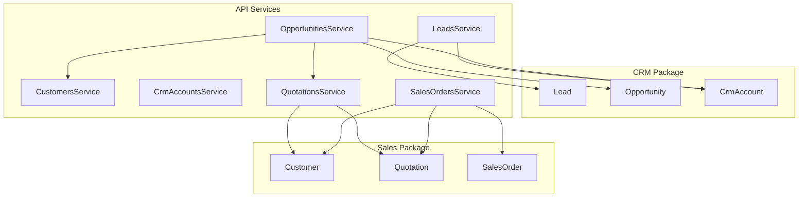
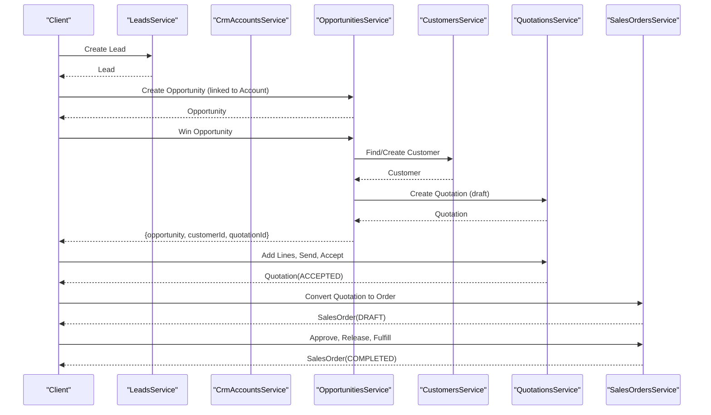
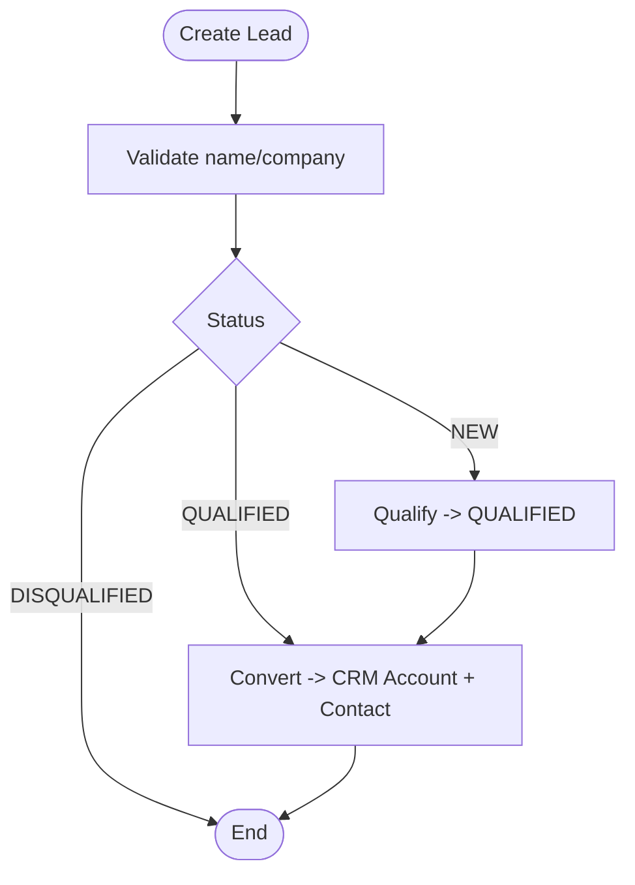
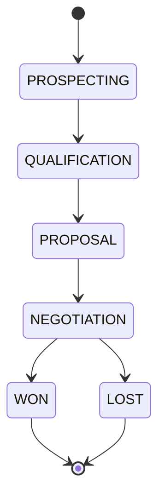
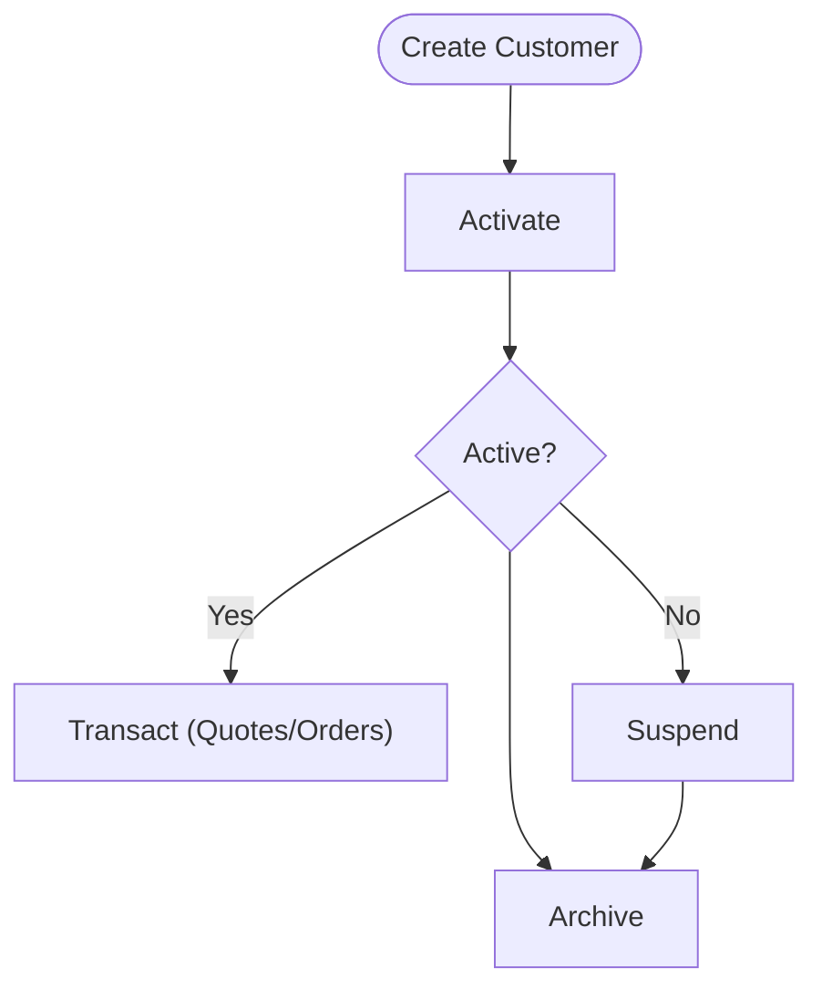
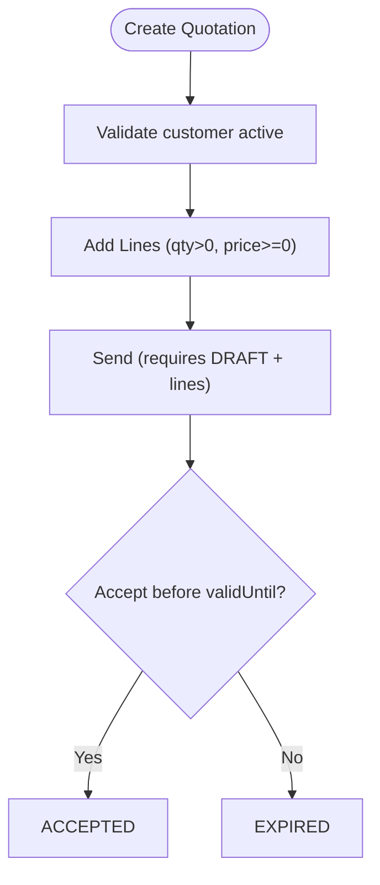
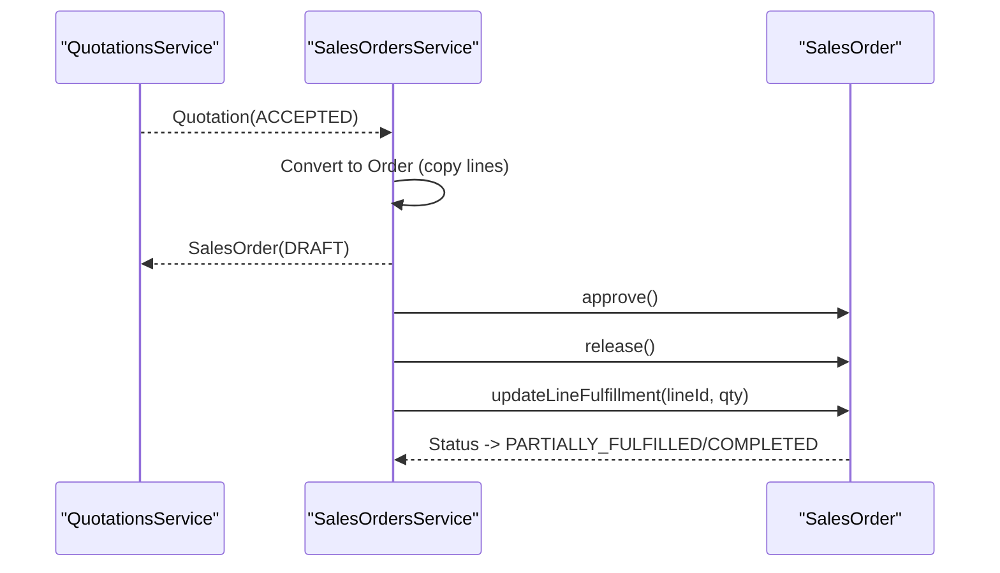
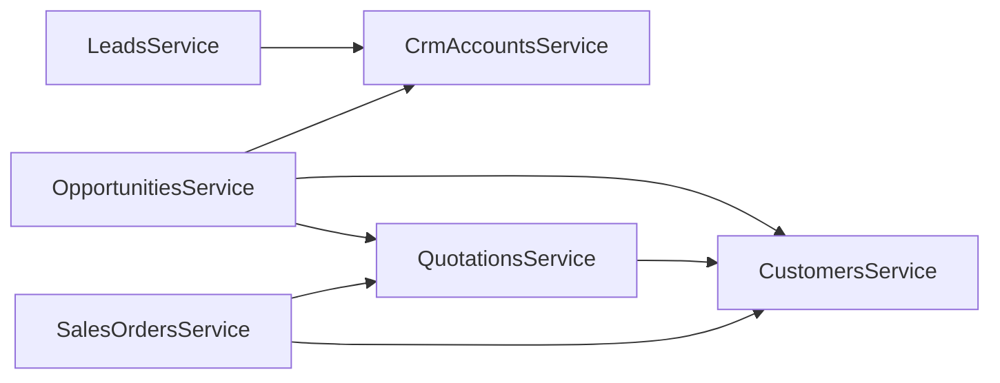

# Sales & CRM Domain

<cite>
**Referenced Files in This Document**
- [lead.ts](file://packages/crm/src/leads/lead.ts)
- [opportunity.ts](file://packages/crm/src/opportunities/opportunity.ts)
- [crm-account.ts](file://packages/crm/src/accounts/crm-account.ts)
- [customer.ts](file://packages/sales/src/customers/customer.ts)
- [quotation.ts](file://packages/sales/src/quotations/quotation.ts)
- [sales-order.ts](file://packages/sales/src/sales-orders/sales-order.ts)
- [leads.service.ts](file://apps/api/src/leads/leads.service.ts)
- [opportunities.service.ts](file://apps/api/src/opportunities/opportunities.service.ts)
- [customers.service.ts](file://apps/api/src/customers/customers.service.ts)
- [crm-accounts.service.ts](file://apps/api/src/crm-accounts/crm-accounts.service.ts)
- [quotations.service.ts](file://apps/api/src/quotations/quotations.service.ts)
- [sales-orders.service.ts](file://apps/api/src/sales-orders/sales-orders.service.ts)
</cite>

## Table of Contents
1. Introduction
2. Project Structure
3. Core Components
4. Architecture Overview
5. Detailed Component Analysis
6. Dependency Analysis
7. Performance Considerations
8. Troubleshooting Guide
9. Conclusion

## Introduction
This document explains the Sales and CRM domain implementation across packages and the API layer. It covers how customer relationships, leads, opportunities, quotations, and sales orders are modeled and orchestrated end-to-end. It also documents pipeline stages, lifecycle transitions, business rules for quote-to-order conversion, credit management, and integration points with finance and inventory domains through fulfillment and order release flows.

## Project Structure
The domain is split into two packages:
- CRM package: models accounts, contacts, leads, opportunities, activities, and notes.
- Sales package: models customers, quotations, sales orders, returns, and fulfillment requests.

The API layer (NestJS services) orchestrates these domain models via repositories and coordinates cross-domain actions such as converting a lead to an account, creating a quotation from a won opportunity, and converting an accepted quotation into a sales order.

**Diagram sources**
- [leads.service.ts:16-97](file://apps/api/src/leads/leads.service.ts#L16-L97)
- [opportunities.service.ts:34-125](file://apps/api/src/opportunities/opportunities.service.ts#L34-L125)
- [quotations.service.ts:21-79](file://apps/api/src/quotations/quotations.service.ts#L21-L79)
- [sales-orders.service.ts:31-79](file://apps/api/src/sales-orders/sales-orders.service.ts#L31-L79)
- [crm-account.ts:74-92](file://packages/crm/src/accounts/crm-account.ts#L74-L92)
- [lead.ts:69-96](file://packages/crm/src/leads/lead.ts#L69-L96)
- [opportunity.ts:60-85](file://packages/crm/src/opportunities/opportunity.ts#L60-L85)
- [customer.ts:90-107](file://packages/sales/src/customers/customer.ts#L90-L107)
- [quotation.ts:67-83](file://packages/sales/src/quotations/quotation.ts#L67-L83)
- [sales-order.ts:81-95](file://packages/sales/src/sales-orders/sales-order.ts#L81-L95)

**Section sources**
- [lead.ts:1-138](file://packages/crm/src/leads/lead.ts#L1-L138)
- [opportunity.ts:1-123](file://packages/crm/src/opportunities/opportunity.ts#L1-L123)
- [crm-account.ts:1-138](file://packages/crm/src/accounts/crm-account.ts#L1-L138)
- [customer.ts:1-198](file://packages/sales/src/customers/customer.ts#L1-L198)
- [quotation.ts:1-157](file://packages/sales/src/quotations/quotation.ts#L1-L157)
- [sales-order.ts:1-192](file://packages/sales/src/sales-orders/sales-order.ts#L1-L192)
- [leads.service.ts:1-99](file://apps/api/src/leads/leads.service.ts#L1-L99)
- [opportunities.service.ts:1-135](file://apps/api/src/opportunities/opportunities.service.ts#L1-L135)
- [customers.service.ts:1-85](file://apps/api/src/customers/customers.service.ts#L1-L85)
- [crm-accounts.service.ts:1-52](file://apps/api/src/crm-accounts/crm-accounts.service.ts#L1-L52)
- [quotations.service.ts:1-83](file://apps/api/src/quotations/quotations.service.ts#L1-L83)
- [sales-orders.service.ts:1-135](file://apps/api/src/sales-orders/sales-orders.service.ts#L1-L135)

## Core Components
- Lead: Tracks prospects with status transitions (NEW → QUALIFIED → CONVERTED or DISQUALIFIED). Enforces validation on creation and stateful operations like qualification and conversion.
- Opportunity: Models sales deals with stages (PROSPECTING → QUALIFICATION → PROPOSAL → NEGOTIATION → WON/LOST), probability updates, and closed states.
- CrmAccount: Represents company entities with contacts and archival support.
- Customer: Sales-facing entity with status (DRAFT/ACTIVE/SUSPENDED/ARCHIVED), credit status (OK/ON_HOLD/CREDIT_EXCEEDED), contacts, and addresses.
- Quotation: Draftable, sendable, acceptable quotes with line items, discounts, validity windows, and statuses (DRAFT/SENT/ACCEPTED/EXPIRED/CANCELLED).
- SalesOrder: Order lifecycle (DRAFT → APPROVED → RELEASED → ALLOCATED → PARTIALLY_FULFILLED → COMPLETED → CANCELLED) with line-level fulfillment tracking and tax/discount calculations.

Key business rules:
- Only NEW leads can be qualified; only QUALIFIED leads can convert to CRM Accounts.
- Opportunities cannot advance from WON/LOST; probabilities update by stage.
- Customer must be ACTIVE to create quotations or sales orders.
- Quotation lines require positive quantity and non-negative unit price; totals computed per line.
- Sales order lines compute subtotal and total price with discount and tax; fulfillment updates auto-transition order status.

**Section sources**
- [lead.ts:69-136](file://packages/crm/src/leads/lead.ts#L69-L136)
- [opportunity.ts:60-121](file://packages/crm/src/opportunities/opportunity.ts#L60-L121)
- [crm-account.ts:74-136](file://packages/crm/src/accounts/crm-account.ts#L74-L136)
- [customer.ts:90-134](file://packages/sales/src/customers/customer.ts#L90-L134)
- [quotation.ts:67-155](file://packages/sales/src/quotations/quotation.ts#L67-L155)
- [sales-order.ts:81-191](file://packages/sales/src/sales-orders/sales-order.ts#L81-L191)

## Architecture Overview
The API services coordinate domain objects and repositories to implement CRM and sales workflows:
- Lead conversion creates a CRM Account and primary contact, then marks the lead converted.
- Winning an opportunity optionally creates a Customer (if missing) and drafts a Quotation.
- Quotations enforce customer status and allow sending, accepting (with expiry checks), and cancellation.
- Sales Orders can be created directly or converted from accepted quotations, preserving line details.
- Fulfillment updates incrementally move orders toward completion.

**Diagram sources**
- [leads.service.ts:16-97](file://apps/api/src/leads/leads.service.ts#L16-L97)
- [opportunities.service.ts:81-125](file://apps/api/src/opportunities/opportunities.service.ts#L81-L125)
- [quotations.service.ts:21-79](file://apps/api/src/quotations/quotations.service.ts#L21-L79)
- [sales-orders.service.ts:31-79](file://apps/api/src/sales-orders/sales-orders.service.ts#L31-L79)

## Detailed Component Analysis

### Lead Management
- Creation validates required fields and sets default source/status.
- Qualification restricts to NEW status.
- Disqualification records reason and prevents re-disqualifying converted leads.
- Conversion requires QUALIFIED status and links to a newly created CRM Account with a primary contact derived from lead data.

**Diagram sources**
- [lead.ts:69-136](file://packages/crm/src/leads/lead.ts#L69-L136)
- [leads.service.ts:70-97](file://apps/api/src/leads/leads.service.ts#L70-L97)

**Section sources**
- [lead.ts:69-136](file://packages/crm/src/leads/lead.ts#L69-L136)
- [leads.service.ts:16-97](file://apps/api/src/leads/leads.service.ts#L16-L97)

### Opportunity Pipeline
- Stages: PROSPECTING → QUALIFICATION → PROPOSAL → NEGOTIATION → WON/LOST.
- Probability updates automatically when advancing stages.
- Closing methods prevent reversing between WON and LOST.
- Winning triggers downstream handoff: ensure Customer exists and draft a Quotation.

**Diagram sources**
- [opportunity.ts:3-4](file://packages/crm/src/opportunities/opportunity.ts#L3-L4)
- [opportunity.ts:91-121](file://packages/crm/src/opportunities/opportunity.ts#L91-L121)
- [opportunities.service.ts:81-125](file://apps/api/src/opportunities/opportunities.service.ts#L81-L125)

**Section sources**
- [opportunity.ts:60-121](file://packages/crm/src/opportunities/opportunity.ts#L60-L121)
- [opportunities.service.ts:34-125](file://apps/api/src/opportunities/opportunities.service.ts#L34-L125)

### Customer Lifecycle and Credit Management
- Status flow: DRAFT → ACTIVE → SUSPENDED/ARCHIVED. Archived cannot be activated.
- Credit status: OK, ON_HOLD, CREDIT_EXCEEDED. Methods exist to update credit status.
- Contacts and addresses support primary/default semantics.

**Diagram sources**
- [customer.ts:90-134](file://packages/sales/src/customers/customer.ts#L90-L134)
- [customers.service.ts:24-63](file://apps/api/src/customers/customers.service.ts#L24-L63)

**Section sources**
- [customer.ts:90-134](file://packages/sales/src/customers/customer.ts#L90-L134)
- [customers.service.ts:24-63](file://apps/api/src/customers/customers.service.ts#L24-L63)

### Quotation Generation and Acceptance
- Creation enforces ACTIVE customer and defaults currency/validity.
- Line items validate quantities/prices and compute totals with discounts.
- Sending requires DRAFT and at least one line.
- Accepting checks validity window; expired quotes transition to EXPIRED.

**Diagram sources**
- [quotations.service.ts:21-79](file://apps/api/src/quotations/quotations.service.ts#L21-L79)
- [quotation.ts:67-155](file://packages/sales/src/quotations/quotation.ts#L67-L155)

**Section sources**
- [quotations.service.ts:21-79](file://apps/api/src/quotations/quotations.service.ts#L21-L79)
- [quotation.ts:67-155](file://packages/sales/src/quotations/quotation.ts#L67-L155)

### Quote-to-Order Conversion and Fulfillment
- Conversion allowed only from ACCEPTED quotations; copies lines with quantities, prices, and discounts.
- Order approval requires DRAFT and at least one line.
- Release transitions to fulfillment-ready state.
- Fulfillment updates increment fulfilled quantities and auto-update order status to PARTIALLY_FULFILLED or COMPLETED.

**Diagram sources**
- [sales-orders.service.ts:51-79](file://apps/api/src/sales-orders/sales-orders.service.ts#L51-L79)
- [sales-order.ts:105-191](file://packages/sales/src/sales-orders/sales-order.ts#L105-L191)

**Section sources**
- [sales-orders.service.ts:51-79](file://apps/api/src/sales-orders/sales-orders.service.ts#L51-L79)
- [sales-order.ts:105-191](file://packages/sales/src/sales-orders/sales-order.ts#L105-L191)

### CRM Analytics, Reporting, and Integrations
- CRM analytics: Opportunity stage distribution, expected close dates, estimated values, and probabilities enable revenue forecasting and pipeline analysis.
- Sales reporting: Quotation acceptance rates, order conversion from quotations, and fulfillment progress provide operational insights.
- Integration points:
  - Finance: Quotation and order totals include discounts and taxes; future invoicing can derive from accepted quotations/orders.
  - Inventory: Order release and fulfillment steps interact with reservations and stock movements via fulfillment requests and warehouse modules.

[No sources needed since this section provides conceptual guidance based on observed domain capabilities]

## Dependency Analysis
- API services depend on domain classes from @ananya/crm and @ananya/sales.
- Cross-service dependencies:
  - OpportunitiesService depends on CrmAccountsService, CustomersService, and QuotationsService to orchestrate win-handoff.
  - SalesOrdersService depends on CustomersService and QuotationsService to enforce preconditions and copy lines.
  - QuotationsService depends on CustomersService to validate customer status.
  - LeadsService depends on CrmAccountsService to create accounts during conversion.

**Diagram sources**
- [leads.service.ts:1-99](file://apps/api/src/leads/leads.service.ts#L1-L99)
- [opportunities.service.ts:1-135](file://apps/api/src/opportunities/opportunities.service.ts#L1-L135)
- [quotations.service.ts:1-83](file://apps/api/src/quotations/quotations.service.ts#L1-L83)
- [sales-orders.service.ts:1-135](file://apps/api/src/sales-orders/sales-orders.service.ts#L1-L135)

**Section sources**
- [leads.service.ts:1-99](file://apps/api/src/leads/leads.service.ts#L1-L99)
- [opportunities.service.ts:1-135](file://apps/api/src/opportunities/opportunities.service.ts#L1-L135)
- [quotations.service.ts:1-83](file://apps/api/src/quotations/quotations.service.ts#L1-L83)
- [sales-orders.service.ts:1-135](file://apps/api/src/sales-orders/sales-orders.service.ts#L1-L135)

## Performance Considerations
- Repository abstractions suggest efficient querying by status, search, and owner filters; leverage these for dashboards and reports.
- Avoid excessive round-trips by batching operations where possible (e.g., adding multiple quotation lines before saving).
- Use status-based queries to minimize data scanning in large datasets.
- Consider caching frequently accessed master data (e.g., customer lists) at the service layer if read-heavy.

[No sources needed since this section provides general guidance]

## Troubleshooting Guide
Common errors and their causes:
- Lead assignment/disqualification/state transitions:
  - Cannot reassign owner for converted/disqualified leads.
  - Only NEW leads can be qualified.
  - Converted leads cannot be disqualified.
- Opportunity stage transitions:
  - Closed opportunities (WON/LOST) cannot advance.
  - Won/Lost cannot be reversed.
- Customer operations:
  - Cannot activate archived customers.
- Quotation operations:
  - Can only add lines to DRAFT quotations.
  - Cannot send without lines.
  - Accepting expired quotations results in EXPIRED status.
- Sales order operations:
  - Can only add lines to DRAFT orders.
  - Approval requires lines.
  - Cannot cancel completed orders.

These validations are enforced within domain methods and surfaced via exceptions in API services.

**Section sources**
- [lead.ts:98-136](file://packages/crm/src/leads/lead.ts#L98-L136)
- [opportunity.ts:91-121](file://packages/crm/src/opportunities/opportunity.ts#L91-L121)
- [customer.ts:113-134](file://packages/sales/src/customers/customer.ts#L113-L134)
- [quotation.ts:93-155](file://packages/sales/src/quotations/quotation.ts#L93-L155)
- [sales-order.ts:105-191](file://packages/sales/src/sales-orders/sales-order.ts#L105-L191)

## Conclusion
The Sales and CRM domain implements robust state machines for leads, opportunities, quotations, and sales orders, with clear business rules and lifecycle transitions. The API layer orchestrates cross-domain workflows such as lead conversion, opportunity win-handoff, quotation generation, and quote-to-order conversion. Revenue forecasting and reporting can be built on opportunity stages and values, while fulfillment integrates with inventory and finance through order release and subsequent processes.

[No sources needed since this section summarizes without analyzing specific files]