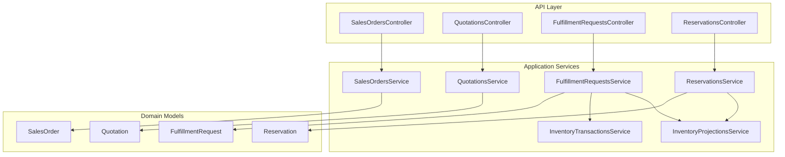
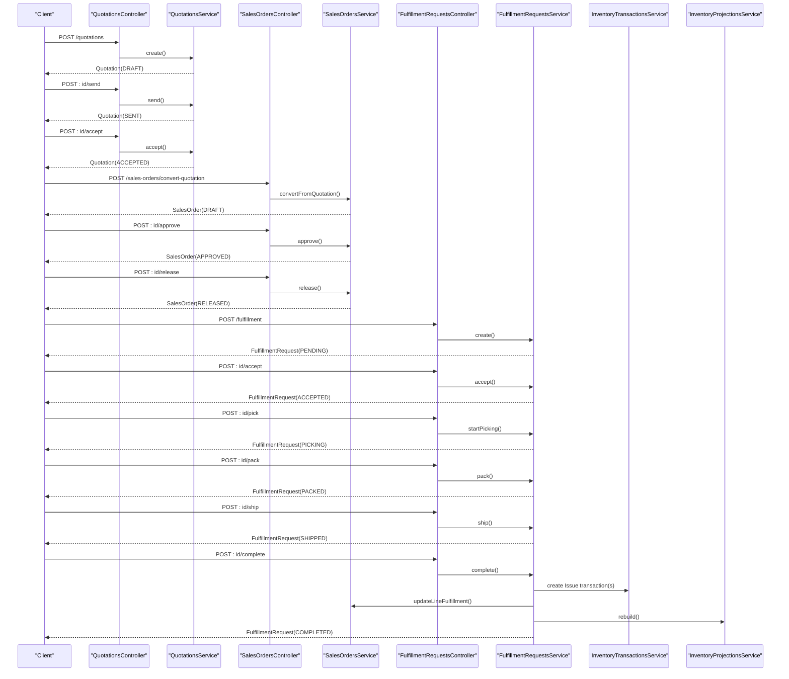
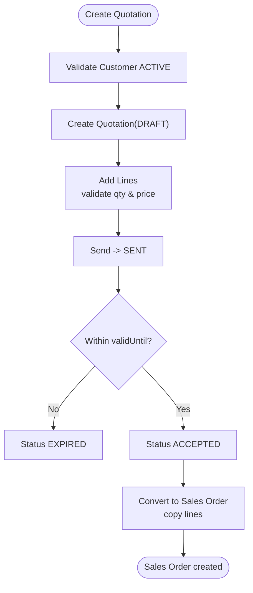
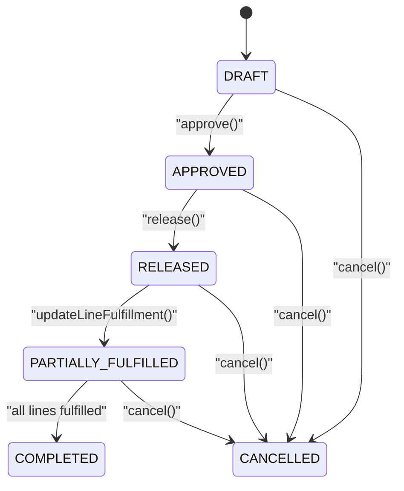
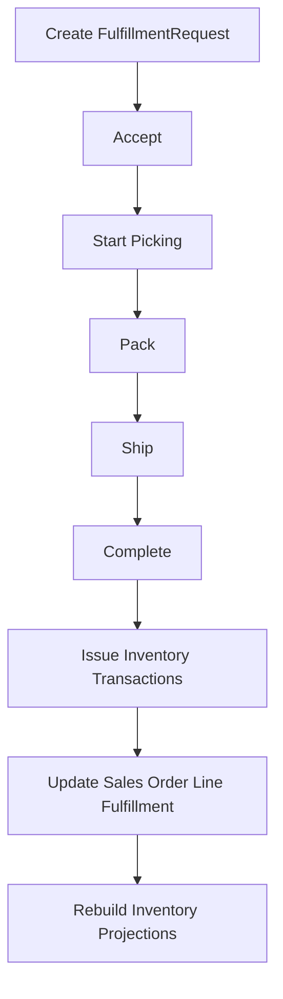
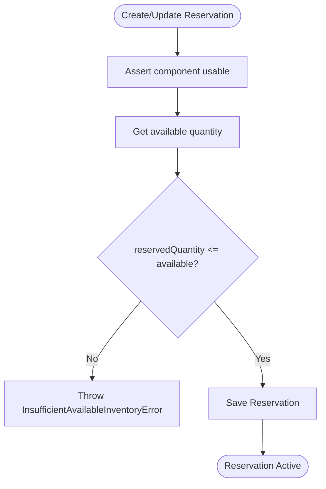
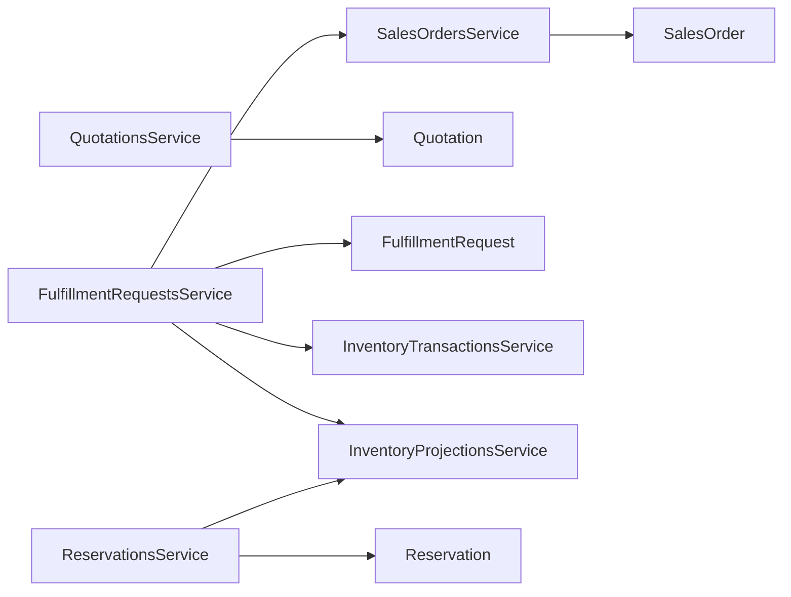

# Sales Order Processing

<cite>
**Referenced Files in This Document**
- [sales-orders.controller.ts](file://apps/api/src/sales-orders/sales-orders.controller.ts)
- [sales-orders.service.ts](file://apps/api/src/sales-orders/sales-orders.service.ts)
- [quotations.controller.ts](file://apps/api/src/quotations/quotations.controller.ts)
- [quotations.service.ts](file://apps/api/src/quotations/quotations.service.ts)
- [fulfillment-requests.controller.ts](file://apps/api/src/fulfillment/fulfillment-requests.controller.ts)
- [fulfillment-requests.service.ts](file://apps/api/src/fulfillment/fulfillment-requests.service.ts)
- [reservations.controller.ts](file://apps/api/src/reservations/reservations.controller.ts)
- [reservations.service.ts](file://apps/api/src/reservations/reservations.service.ts)
- [inventory-transactions.service.ts](file://apps/api/src/inventory-transactions/inventory-transactions.service.ts)
- [inventory-projections.service.ts](file://apps/api/src/inventory-projections/inventory-projections.service.ts)
- [sales-order.ts](file://packages/sales/src/sales-orders/sales-order.ts)
- [quotation.ts](file://packages/sales/src/quotations/quotation.ts)
- [fulfillment-request.ts](file://packages/sales/src/fulfillment/fulfillment-request.ts)
- [reservation.ts](file://packages/inventory/src/reservations/reservation.ts)
</cite>

## Table of Contents
1. Introduction
2. Project Structure
3. Core Components
4. Architecture Overview
5. Detailed Component Analysis
6. Dependency Analysis
7. Performance Considerations
8. Troubleshooting Guide
9. Conclusion

## Introduction
This document explains sales order processing end-to-end: creating orders from quotations, validating pricing and customer eligibility, allocating inventory through reservations, fulfilling orders with partial shipments and backorders, handling status transitions, integrating with warehouse operations, and triggering financial postings. It also outlines analytics and fulfillment metrics that can be derived from the implemented data model and services.

## Project Structure
The sales order domain is implemented as a NestJS API layer over domain models in packages. Controllers expose REST endpoints; services orchestrate business logic and coordinate with repositories and other application services (inventory projections, transactions). Domain classes encapsulate state machines for Quotations, Sales Orders, Fulfillment Requests, and Inventory Reservations.

**Diagram sources**
- [sales-orders.controller.ts:10-55](file://apps/api/src/sales-orders/sales-orders.controller.ts#L10-L55)
- [quotations.controller.ts:6-46](file://apps/api/src/quotations/quotations.controller.ts#L6-L46)
- [fulfillment-requests.controller.ts:10-68](file://apps/api/src/fulfillment/fulfillment-requests.controller.ts#L10-L68)
- [reservations.controller.ts:17-82](file://apps/api/src/reservations/reservations.controller.ts#L17-L82)
- [sales-orders.service.ts:23-133](file://apps/api/src/sales-orders/sales-orders.service.ts#L23-L133)
- [quotations.service.ts:14-81](file://apps/api/src/quotations/quotations.service.ts#L14-L81)
- [fulfillment-requests.service.ts:24-171](file://apps/api/src/fulfillment/fulfillment-requests.service.ts#L24-L171)
- [reservations.service.ts:20-209](file://apps/api/src/reservations/reservations.service.ts#L20-L209)
- [inventory-transactions.service.ts:13-43](file://apps/api/src/inventory-transactions/inventory-transactions.service.ts#L13-L43)
- [inventory-projections.service.ts:12-45](file://apps/api/src/inventory-projections/inventory-projections.service.ts#L12-L45)

**Section sources**
- [sales-orders.controller.ts:10-55](file://apps/api/src/sales-orders/sales-orders.controller.ts#L10-L55)
- [quotations.controller.ts:6-46](file://apps/api/src/quotations/quotations.controller.ts#L6-L46)
- [fulfillment-requests.controller.ts:10-68](file://apps/api/src/fulfillment/fulfillment-requests.controller.ts#L10-L68)
- [reservations.controller.ts:17-82](file://apps/api/src/reservations/reservations.controller.ts#L17-L82)

## Core Components
- Quotation lifecycle: Draft → Sent → Accepted/Expired/Canceled. Only accepted quotations convert to sales orders.
- Sales Order lifecycle: Draft → Approved → Released → Partially Fulfilled → Completed or Cancelled.
- Fulfillment Request lifecycle: Pending → Accepted → Picking → Packed → Shipped → Completed or Cancelled.
- Reservation lifecycle: Draft/Active → Fulfilled/Released/Cancelled/Expired.

Key responsibilities:
- QuotationsService validates customer eligibility and enforces quotation state rules.
- SalesOrdersService creates orders, converts accepted quotations, approves/releases orders, updates line fulfillment, and cancels orders.
- FulfillmentRequestsService generates fulfillment requests from released/approved orders, manages warehouse workflow, posts inventory issues on completion, and rebuilds projections.
- ReservationsService validates available inventory before reserving stock and exposes available quantity calculations.

**Section sources**
- [quotations.service.ts:21-81](file://apps/api/src/quotations/quotations.service.ts#L21-L81)
- [sales-orders.service.ts:31-133](file://apps/api/src/sales-orders/sales-orders.service.ts#L31-L133)
- [fulfillment-requests.service.ts:33-171](file://apps/api/src/fulfillment/fulfillment-requests.service.ts#L33-L171)
- [reservations.service.ts:27-209](file://apps/api/src/reservations/reservations.service.ts#L27-L209)
- [quotation.ts:67-155](file://packages/sales/src/quotations/quotation.ts#L67-L155)
- [sales-order.ts:81-190](file://packages/sales/src/sales-orders/sales-order.ts#L81-L190)
- [fulfillment-request.ts:79-168](file://packages/sales/src/fulfillment/fulfillment-request.ts#L79-L168)
- [reservation.ts:47-212](file://packages/inventory/src/reservations/reservation.ts#L47-L212)

## Architecture Overview
The system separates concerns across controllers, services, domain models, and inventory subsystems.

**Diagram sources**
- [quotations.controller.ts:10-46](file://apps/api/src/quotations/quotations.controller.ts#L10-L46)
- [quotations.service.ts:21-81](file://apps/api/src/quotations/quotations.service.ts#L21-L81)
- [sales-orders.controller.ts:14-55](file://apps/api/src/sales-orders/sales-orders.controller.ts#L14-L55)
- [sales-orders.service.ts:31-133](file://apps/api/src/sales-orders/sales-orders.service.ts#L31-L133)
- [fulfillment-requests.controller.ts:16-68](file://apps/api/src/fulfillment/fulfillment-requests.controller.ts#L16-L68)
- [fulfillment-requests.service.ts:33-171](file://apps/api/src/fulfillment/fulfillment-requests.service.ts#L33-L171)
- [inventory-transactions.service.ts:19-31](file://apps/api/src/inventory-transactions/inventory-transactions.service.ts#L19-L31)
- [inventory-projections.service.ts:38-44](file://apps/api/src/inventory-projections/inventory-projections.service.ts#L38-L44)

## Detailed Component Analysis

### Quotation Lifecycle and Conversion to Sales Order
- Creation requires an active customer; otherwise, a validation error is thrown.
- Lines are validated for positive quantities and non-negative unit prices.
- Sending requires lines; acceptance checks validity date and prevents cancellation after acceptance.
- Conversion copies accepted quotation lines into a new sales order and sets required date if provided.

**Diagram sources**
- [quotations.service.ts:21-81](file://apps/api/src/quotations/quotations.service.ts#L21-L81)
- [quotation.ts:93-155](file://packages/sales/src/quotations/quotation.ts#L93-L155)
- [sales-orders.service.ts:51-79](file://apps/api/src/sales-orders/sales-orders.service.ts#L51-L79)

**Section sources**
- [quotations.controller.ts:10-46](file://apps/api/src/quotations/quotations.controller.ts#L10-L46)
- [quotations.service.ts:21-81](file://apps/api/src/quotations/quotations.service.ts#L21-L81)
- [quotation.ts:67-155](file://packages/sales/src/quotations/quotation.ts#L67-L155)
- [sales-orders.service.ts:51-79](file://apps/api/src/sales-orders/sales-orders.service.ts#L51-L79)

### Sales Order State Machine and Pricing Validation
- States: DRAFT → APPROVED → RELEASED → PARTIALLY_FULFILLED → COMPLETED or CANCELLED.
- Adding lines is allowed only in DRAFT; quantities must be > 0; unitPrice must be >= 0.
- Total price per line applies discount then tax; order total aggregates line totals.
- Approve requires at least one line; Release requires APPROVED; UpdateLineFulfillment computes PARTIALLY_FULFILLED vs COMPLETED based on fulfilled vs ordered quantities.

**Diagram sources**
- [sales-order.ts:105-190](file://packages/sales/src/sales-orders/sales-order.ts#L105-L190)
- [sales-orders.service.ts:96-133](file://apps/api/src/sales-orders/sales-orders.service.ts#L96-L133)

**Section sources**
- [sales-orders.controller.ts:14-55](file://apps/api/src/sales-orders/sales-orders.controller.ts#L14-L55)
- [sales-orders.service.ts:31-133](file://apps/api/src/sales-orders/sales-orders.service.ts#L31-L133)
- [sales-order.ts:81-190](file://packages/sales/src/sales-orders/sales-order.ts#L81-L190)

### Fulfillment Workflow and Warehouse Integration
- Fulfillment requests can be created only for orders in RELEASED or APPROVED states.
- Auto-populates request lines from unfulfilled order lines.
- Warehouse steps: Accept → Pick → Pack → Ship → Complete.
- On completion:
  - Issues inventory via InventoryTransactionsService for each line.
  - Updates Sales Order line fulfillment balances.
  - Rebuilds inventory projections.

**Diagram sources**
- [fulfillment-requests.service.ts:33-171](file://apps/api/src/fulfillment/fulfillment-requests.service.ts#L33-L171)
- [fulfillment-request.ts:97-168](file://packages/sales/src/fulfillment/fulfillment-request.ts#L97-L168)
- [inventory-transactions.service.ts:19-31](file://apps/api/src/inventory-transactions/inventory-transactions.service.ts#L19-L31)
- [inventory-projections.service.ts:38-44](file://apps/api/src/inventory-projections/inventory-projections.service.ts#L38-L44)

**Section sources**
- [fulfillment-requests.controller.ts:16-68](file://apps/api/src/fulfillment/fulfillment-requests.controller.ts#L16-L68)
- [fulfillment-requests.service.ts:33-171](file://apps/api/src/fulfillment/fulfillment-requests.service.ts#L33-L171)
- [fulfillment-request.ts:79-168](file://packages/sales/src/fulfillment/fulfillment-request.ts#L79-L168)

### Inventory Allocation and Backorder Handling
- ReservationsService validates component usability and available quantity before creating/updating reservations.
- Available quantity is computed from inventory projections minus active reservation commitments.
- If insufficient inventory, an InsufficientAvailableInventoryError is raised.
- Backorder handling:
  - Sales orders remain partially fulfilled until all lines reach their requested quantities.
  - Fulfillment requests can be generated for any unfulfilled portion of released/approved orders.
  - When inventory becomes available, additional fulfillment requests can be created and completed to progress toward COMPLETED.

**Diagram sources**
- [reservations.service.ts:27-71](file://apps/api/src/reservations/reservations.service.ts#L27-L71)
- [reservations.service.ts:177-209](file://apps/api/src/reservations/reservations.service.ts#L177-L209)
- [reservation.ts:74-102](file://packages/inventory/src/reservations/reservation.ts#L74-L102)

**Section sources**
- [reservations.controller.ts:22-82](file://apps/api/src/reservations/reservations.controller.ts#L22-L82)
- [reservations.service.ts:27-209](file://apps/api/src/reservations/reservations.service.ts#L27-L209)
- [reservation.ts:47-212](file://packages/inventory/src/reservations/reservation.ts#L47-L212)

### Financial Posting and Auditability
- Fulfillment completion triggers inventory issue transactions, which are immutable ledger entries.
- The inventory subsystem maintains projections and transactions for auditability and reporting.
- While explicit journal entry creation is not shown in these files, the inventory issue transactions provide the foundation for downstream financial posting and reconciliation.

**Section sources**
- [fulfillment-requests.service.ts:127-163](file://apps/api/src/fulfillment/fulfillment-requests.service.ts#L127-L163)
- [inventory-transactions.service.ts:19-31](file://apps/api/src/inventory-transactions/inventory-transactions.service.ts#L19-L31)

## Dependency Analysis
- Controllers depend on their respective services for business logic.
- FulfillmentRequestsService depends on SalesOrdersService, InventoryTransactionsService, and InventoryProjectionsService.
- ReservationsService depends on InventoryProjectionsService to compute available quantities.
- Domain models enforce state transitions and validation rules independently of persistence.

**Diagram sources**
- [sales-orders.service.ts:23-133](file://apps/api/src/sales-orders/sales-orders.service.ts#L23-L133)
- [quotations.service.ts:14-81](file://apps/api/src/quotations/quotations.service.ts#L14-L81)
- [fulfillment-requests.service.ts:24-171](file://apps/api/src/fulfillment/fulfillment-requests.service.ts#L24-L171)
- [reservations.service.ts:20-209](file://apps/api/src/reservations/reservations.service.ts#L20-L209)
- [sales-order.ts:56-190](file://packages/sales/src/sales-orders/sales-order.ts#L56-L190)
- [quotation.ts:44-155](file://packages/sales/src/quotations/quotation.ts#L44-L155)
- [fulfillment-request.ts:50-168](file://packages/sales/src/fulfillment/fulfillment-request.ts#L50-L168)
- [reservation.ts:16-212](file://packages/inventory/src/reservations/reservation.ts#L16-L212)

**Section sources**
- [sales-orders.service.ts:23-133](file://apps/api/src/sales-orders/sales-orders.service.ts#L23-L133)
- [fulfillment-requests.service.ts:24-171](file://apps/api/src/fulfillment/fulfillment-requests.service.ts#L24-L171)
- [reservations.service.ts:20-209](file://apps/api/src/reservations/reservations.service.ts#L20-L209)

## Performance Considerations
- Avoid unnecessary projection rebuilds: only rebuild inventory projections when necessary (e.g., after completing fulfillment).
- Batch operations: when issuing multiple inventory transactions, consider batching to reduce database round-trips.
- Query filters: use customerId/status filters on list endpoints to limit result sets.
- Reservation availability checks: compute available quantities once per request where possible to avoid repeated queries.

[No sources needed since this section provides general guidance]

## Troubleshooting Guide
Common errors and resolutions:
- Creating a quotation or sales order with a non-active customer: ensure the customer record is ACTIVE before proceeding.
- Converting a quotation that is not ACCEPTED: only ACCEPTED quotations can be converted to sales orders.
- Approving a sales order without lines: add at least one line before approving.
- Releasing a sales order not in APPROVED state: approve first.
- Creating fulfillment requests for orders not in RELEASED/APPROVED: transition the order accordingly.
- Completing a fulfillment request not in SHIPPED state: ship first.
- Insufficient available inventory for reservations: check on-hand and active reservations; adjust quantities or wait for replenishment.

**Section sources**
- [quotations.service.ts:21-37](file://apps/api/src/quotations/quotations.service.ts#L21-L37)
- [sales-orders.service.ts:31-49](file://apps/api/src/sales-orders/sales-orders.service.ts#L31-L49)
- [sales-orders.service.ts:51-57](file://apps/api/src/sales-orders/sales-orders.service.ts#L51-L57)
- [sales-order.ts:105-161](file://packages/sales/src/sales-orders/sales-order.ts#L105-L161)
- [fulfillment-requests.service.ts:33-39](file://apps/api/src/fulfillment/fulfillment-requests.service.ts#L33-L39)
- [fulfillment-requests.service.ts:127-133](file://apps/api/src/fulfillment/fulfillment-requests.service.ts#L127-L133)
- [reservations.service.ts:27-55](file://apps/api/src/reservations/reservations.service.ts#L27-L55)

## Conclusion
The sales order processing pipeline integrates quotation management, order approval and release, inventory allocation via reservations, and a structured fulfillment workflow. Status transitions are enforced by domain models, while application services coordinate cross-cutting concerns such as inventory transactions and projections. This design supports partial shipments, backorder handling, and clear audit trails for financial and operational analytics.

[No sources needed since this section summarizes without analyzing specific files]