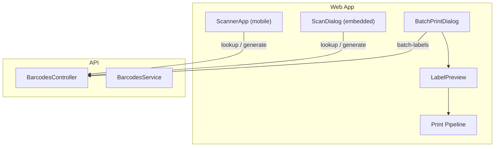
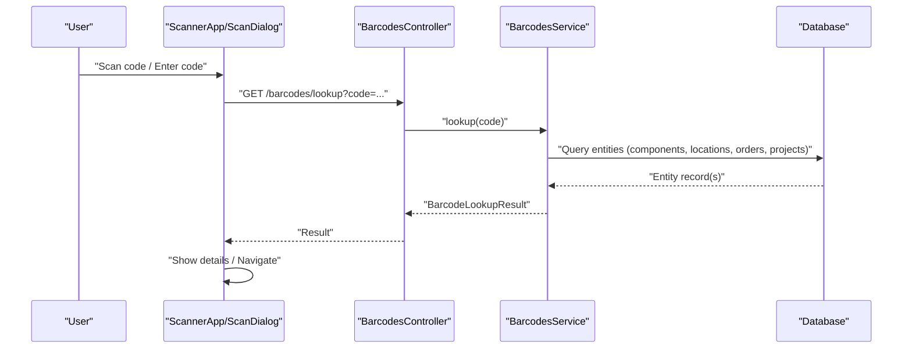
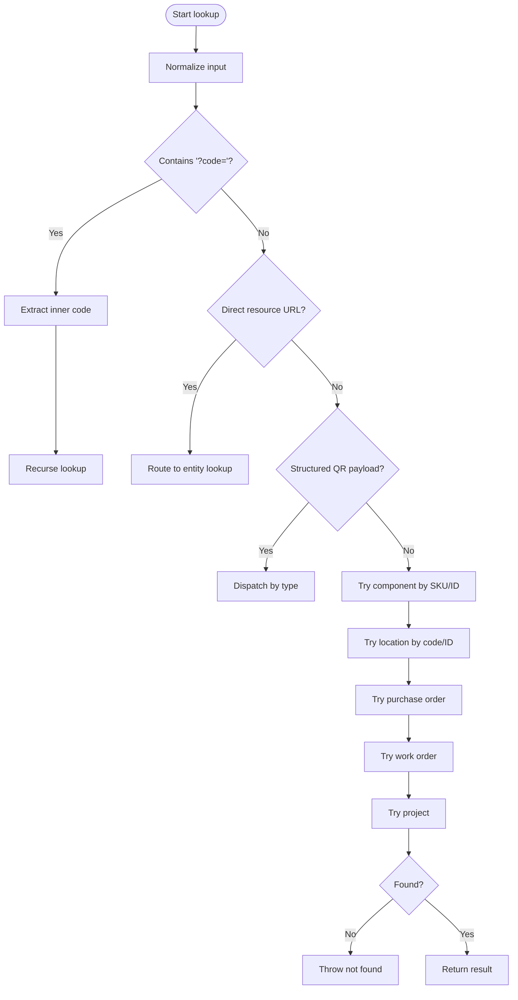
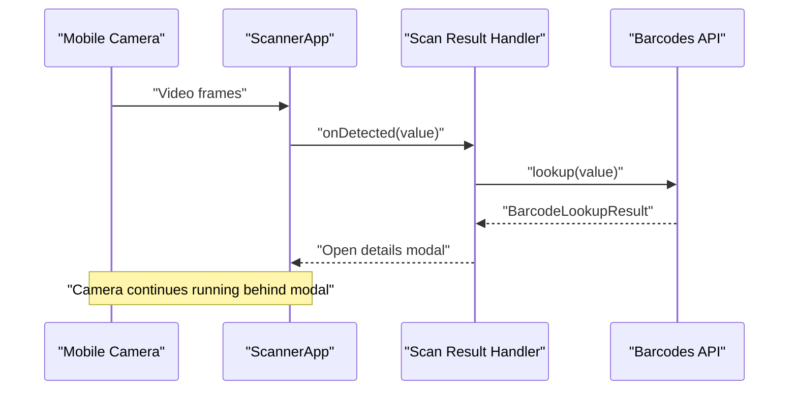
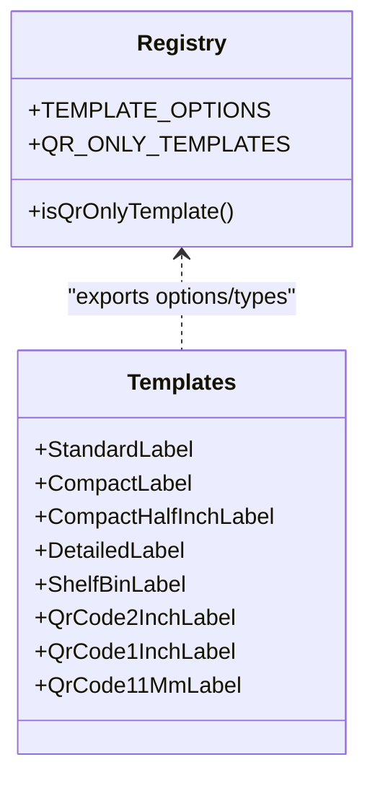
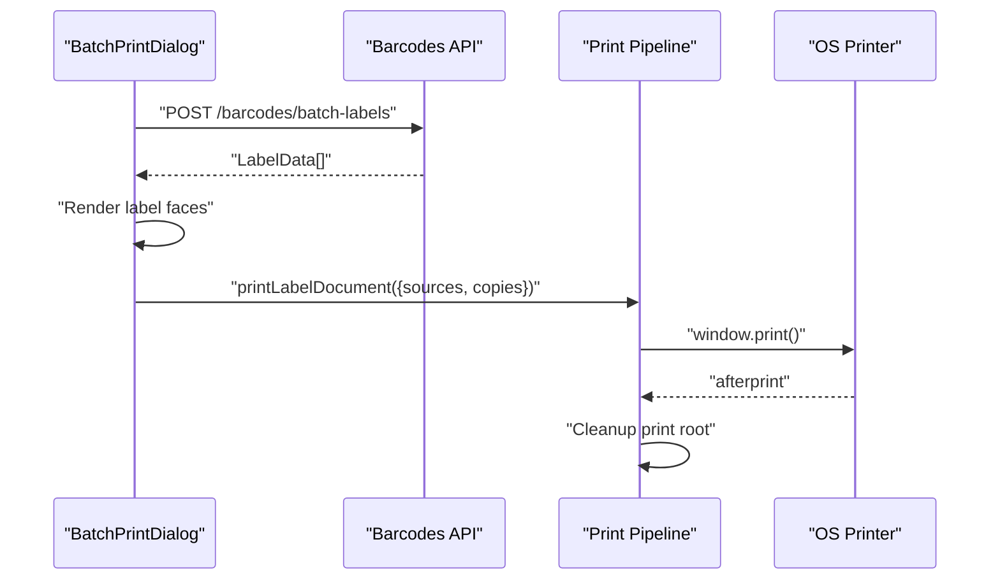
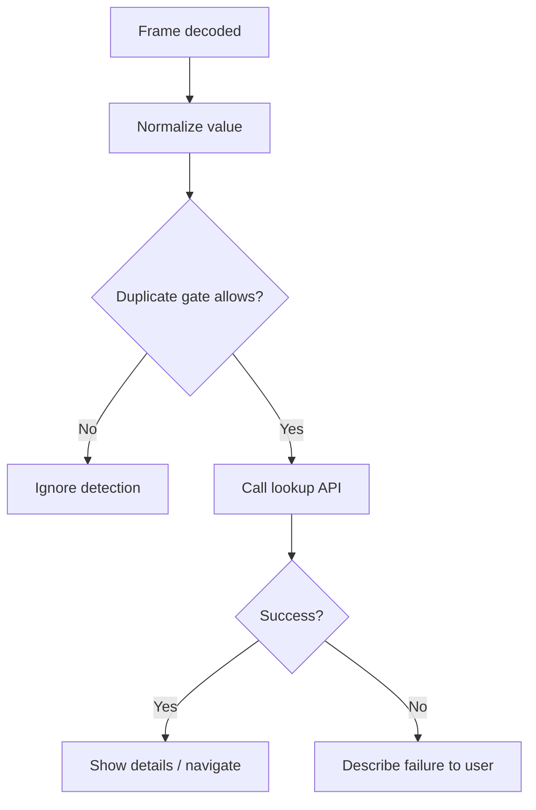
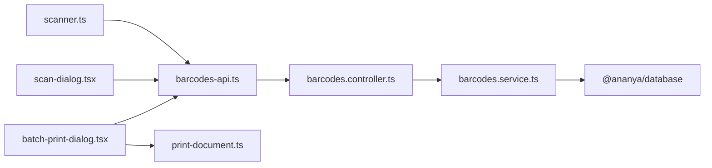

# Barcode & Scanning Integration

<cite>
**Referenced Files in This Document**
- [barcodes.service.ts](file://apps/api/src/barcodes/barcodes.service.ts)
- [barcodes.controller.ts](file://apps/api/src/barcodes/barcodes.controller.ts)
- [barcodes-api.ts](file://apps/web/lib/api/barcodes-api.ts)
- [scanner-app.tsx](file://apps/web/components/scanner/scanner-app.tsx)
- [scanner.ts](file://apps/web/lib/scanner.ts)
- [scan-dialog.tsx](file://apps/web/components/barcodes/scan-dialog.tsx)
- [batch-print-dialog.tsx](file://apps/web/components/barcodes/batch-print-dialog.tsx)
- [print-document.ts](file://apps/web/lib/print/print-document.ts)
- [templates/index.ts](file://apps/web/components/barcodes/templates/index.ts)
- [registry.ts](file://apps/web/components/barcodes/templates/registry.ts)
</cite>

## Table of Contents
1. Introduction
2. Project Structure
3. Core Components
4. Architecture Overview
5. Detailed Component Analysis
6. Dependency Analysis
7. Performance Considerations
8. Troubleshooting Guide
9. Conclusion

## Introduction
This document explains the barcode scanning and label generation capabilities in the application. It covers supported barcode formats, the label template system, mobile scanning integration, the barcode generation workflow, custom label templates, print queue management, scanning interface behavior, real-time entity lookup, error handling for invalid or duplicate scans, and performance and compatibility considerations.

## Project Structure
The barcode and scanning features span a small backend API and several frontend modules:
- Backend API exposes endpoints to look up scanned codes, generate label payloads, and batch-generate labels.
- Frontend provides:
  - A standalone scanner app optimized for mobile use.
  - An embedded scan dialog with live camera scanning, manual input, and image upload.
  - A label preview and batch print dialog that builds a printable sheet from rendered label faces.
  - A shared print pipeline that creates a dedicated off-screen print root and uses browser printing reliably across devices.

**Diagram sources**
- [scanner-app.tsx:42-183](file://apps/web/components/scanner/scanner-app.tsx#L42-L183)
- [scan-dialog.tsx:104-226](file://apps/web/components/barcodes/scan-dialog.tsx#L104-L226)
- [batch-print-dialog.tsx:48-134](file://apps/web/components/barcodes/batch-print-dialog.tsx#L48-L134)
- [barcodes.controller.ts:48-69](file://apps/api/src/barcodes/barcodes.controller.ts#L48-L69)
- [barcodes.service.ts:55-149](file://apps/api/src/barcodes/barcodes.service.ts#L55-L149)

**Section sources**
- [barcodes.controller.ts:48-69](file://apps/api/src/barcodes/barcodes.controller.ts#L48-L69)
- [barcodes.service.ts:55-149](file://apps/api/src/barcodes/barcodes.service.ts#L55-L149)
- [scanner-app.tsx:42-183](file://apps/web/components/scanner/scanner-app.tsx#L42-L183)
- [scan-dialog.tsx:104-226](file://apps/web/components/barcodes/scan-dialog.tsx#L104-L226)
- [batch-print-dialog.tsx:48-134](file://apps/web/components/barcodes/batch-print-dialog.tsx#L48-L134)
- [print-document.ts:172-336](file://apps/web/lib/print/print-document.ts#L172-L336)

## Core Components
- Barcodes API client: Defines types for barcode formats, entity types, and methods to lookup codes, generate label payloads, and fetch batch labels.
- Barcodes controller/service: Validates inputs, resolves scanned codes against multiple entity types, and returns structured results and label data.
- Scanner app: Standalone full-screen scanner with camera, overlay, and details modal; supports deep links and offline-friendly states.
- Scan dialog: Embedded scanner with native BarcodeDetector fallback to jsQR, manual entry, image upload, auto-navigate, and torch control.
- Batch print dialog: Builds a reviewable queue of label faces, selects template/format/copies, and triggers the print pipeline.
- Print pipeline: Creates an off-screen print root, serializes label faces, waits for fonts/images, and invokes window.print with safe margins.

**Section sources**
- [barcodes-api.ts:1-84](file://apps/web/lib/api/barcodes-api.ts#L1-L84)
- [barcodes.controller.ts:15-69](file://apps/api/src/barcodes/barcodes.controller.ts#L15-L69)
- [barcodes.service.ts:13-469](file://apps/api/src/barcodes/barcodes.service.ts#L13-L469)
- [scanner-app.tsx:19-183](file://apps/web/components/scanner/scanner-app.tsx#L19-L183)
- [scan-dialog.tsx:171-226](file://apps/web/components/barcodes/scan-dialog.tsx#L171-L226)
- [batch-print-dialog.tsx:97-134](file://apps/web/components/barcodes/batch-print-dialog.tsx#L97-L134)
- [print-document.ts:172-336](file://apps/web/lib/print/print-document.ts#L172-L336)

## Architecture Overview
The scanning flow is unified: any scanned value—whether a QR payload, URL, SKU, location code, or ID—is normalized and sent to the same lookup endpoint. The service tries multiple entity types and returns a consistent result used by both the UI and label generation. Label generation composes a payload with primary code, QR payload, title, subtitle, and optional attributes like location path.

**Diagram sources**
- [scanner-app.tsx:42-183](file://apps/web/components/scanner/scanner-app.tsx#L42-L183)
- [scan-dialog.tsx:171-226](file://apps/web/components/barcodes/scan-dialog.tsx#L171-L226)
- [barcodes.controller.ts:48-69](file://apps/api/src/barcodes/barcodes.controller.ts#L48-L69)
- [barcodes.service.ts:55-149](file://apps/api/src/barcodes/barcodes.service.ts#L55-L149)

## Detailed Component Analysis

### Barcode Lookup and Generation Workflow
- Supported inputs include:
  - Structured QR payload starting with a known prefix followed by type and identifier.
  - Direct resource URLs for components, locations, purchase orders, work orders, and projects.
  - Raw identifiers such as UUIDs, SKUs, location codes, PO numbers, production numbers, or project numbers.
- The service attempts lookups in a defined order and returns a consistent structure including entity type, ID, display code, QR payload, name, subtitle, target URL, and details.
- Label payload generation reuses the lookup logic and enriches it with additional attributes such as location paths where applicable.

**Diagram sources**
- [barcodes.service.ts:55-149](file://apps/api/src/barcodes/barcodes.service.ts#L55-L149)

**Section sources**
- [barcodes.service.ts:55-149](file://apps/api/src/barcodes/barcodes.service.ts#L55-L149)
- [barcodes.service.ts:405-452](file://apps/api/src/barcodes/barcodes.service.ts#L405-L452)

### Mobile Scanning Integration
- Standalone scanner app:
  - Full-screen camera viewfinder with reticle overlay and status captions.
  - Supports deep links via query parameters so printed labels can open the scanner directly.
  - Uses a state machine to avoid decoding while processing or showing details.
  - Presents explicit failure panels for camera issues and retry flows.
- Embedded scan dialog:
  - Attempts native BarcodeDetector first, then falls back to jsQR on a center crop, then full frame if needed.
  - Provides manual entry, image upload, auto-open navigation, and torch control when available.
  - Plays a short beep on successful scan and opens a details modal.

**Diagram sources**
- [scanner-app.tsx:42-183](file://apps/web/components/scanner/scanner-app.tsx#L42-L183)
- [scanner.ts:185-194](file://apps/web/lib/scanner.ts#L185-L194)
- [barcodes.controller.ts:48-69](file://apps/api/src/barcodes/barcodes.controller.ts#L48-L69)

**Section sources**
- [scanner-app.tsx:19-183](file://apps/web/components/scanner/scanner-app.tsx#L19-L183)
- [scan-dialog.tsx:228-359](file://apps/web/components/barcodes/scan-dialog.tsx#L228-L359)
- [scanner.ts:185-194](file://apps/web/lib/scanner.ts#L185-L194)

### Label Template System
- Templates are centrally declared in a registry with picker labels and physical sizes.
- Some templates are QR-only and disable linear barcode format selection.
- Each template renders one physical sticker face; the preview and print pipeline reuse these elements.

**Diagram sources**
- [registry.ts:12-65](file://apps/web/components/barcodes/templates/registry.ts#L12-L65)
- [templates/index.ts:1-41](file://apps/web/components/barcodes/templates/index.ts#L1-L41)

**Section sources**
- [registry.ts:12-65](file://apps/web/components/barcodes/templates/registry.ts#L12-L65)
- [templates/index.ts:1-41](file://apps/web/components/barcodes/templates/index.ts#L1-L41)

### Batch Printing Operations and Print Queue Management
- Batch print dialog:
  - Fetches label data for multiple IDs via a batch endpoint.
  - Renders a reviewable queue using the selected template and format.
  - Allows selecting copies per label; copies are applied at print time, keeping the preview one-per-label.
- Print pipeline:
  - Creates an off-screen print root outside dialogs and scroll containers.
  - Serializes label faces into HTML and injects a minimal stylesheet that sets page margins and wraps labels without splitting them across pages.
  - Waits for fonts and images to settle before invoking window.print.
  - Cleans up the print root after the job completes.

**Diagram sources**
- [batch-print-dialog.tsx:97-134](file://apps/web/components/barcodes/batch-print-dialog.tsx#L97-L134)
- [print-document.ts:312-336](file://apps/web/lib/print/print-document.ts#L312-L336)
- [barcodes.controller.ts:65-69](file://apps/api/src/barcodes/barcodes.controller.ts#L65-L69)

**Section sources**
- [batch-print-dialog.tsx:97-134](file://apps/web/components/barcodes/batch-print-dialog.tsx#L97-L134)
- [print-document.ts:172-336](file://apps/web/lib/print/print-document.ts#L172-L336)

### Scanning Interface Behavior and Real-Time Entity Lookup
- Duplicate detection:
  - A suppression gate prevents repeated handling of the same code until it leaves the frame and a cooldown elapses.
  - This avoids reopening the same record immediately after closing the modal.
- Error handling:
  - Invalid or empty input yields a user-friendly “Invalid QR code” message.
  - Not found returns a clear “not found” message with the scanned value.
  - Network or session errors are distinguished and surfaced appropriately.
- Live scanning:
  - Native BarcodeDetector is attempted first; if unavailable or unsuccessful, jsQR decodes a center crop and then the full frame.
  - Manual entry and image upload provide alternative inputs.

**Diagram sources**
- [scanner.ts:111-158](file://apps/web/lib/scanner.ts#L111-L158)
- [scanner.ts:185-249](file://apps/web/lib/scanner.ts#L185-L249)
- [scan-dialog.tsx:171-226](file://apps/web/components/barcodes/scan-dialog.tsx#L171-L226)

**Section sources**
- [scanner.ts:111-158](file://apps/web/lib/scanner.ts#L111-L158)
- [scanner.ts:185-249](file://apps/web/lib/scanner.ts#L185-L249)
- [scan-dialog.tsx:171-226](file://apps/web/components/barcodes/scan-dialog.tsx#L171-L226)

### Examples from the Codebase
- Label template creation:
  - Add a new template key and picker label in the registry and implement a corresponding React component exported from the templates index.
  - Reference: [registry.ts:12-65](file://apps/web/components/barcodes/templates/registry.ts#L12-L65), [templates/index.ts:1-41](file://apps/web/components/barcodes/templates/index.ts#L1-L41)
- Batch printing operations:
  - Use the batch endpoint to fetch label data for multiple IDs, render previews, and call the print pipeline with copies.
  - Reference: [barcodes.controller.ts:65-69](file://apps/api/src/barcodes/barcodes.controller.ts#L65-L69), [batch-print-dialog.tsx:97-134](file://apps/web/components/barcodes/batch-print-dialog.tsx#L97-L134), [print-document.ts:312-336](file://apps/web/lib/print/print-document.ts#L312-L336)
- Scanner app integration:
  - Open the standalone scanner, optionally with a deep link containing a code parameter; the app resolves it immediately and keeps the camera live.
  - Reference: [scanner-app.tsx:42-80](file://apps/web/components/scanner/scanner-app.tsx#L42-L80), [scanner.ts:185-194](file://apps/web/lib/scanner.ts#L185-L194)

## Dependency Analysis
- Frontend depends on:
  - barcodes-api.ts for typed requests and response shapes.
  - scanner.ts for lifecycle, duplicate suppression, and failure descriptions.
  - print-document.ts for reliable printing across browsers.
- Backend depends on:
  - Database schema for components, locations, purchase orders, production orders, and projects.
  - Query utilities for flexible matching by ID or human-readable codes.

**Diagram sources**
- [barcodes-api.ts:1-84](file://apps/web/lib/api/barcodes-api.ts#L1-L84)
- [scanner.ts:185-194](file://apps/web/lib/scanner.ts#L185-L194)
- [scan-dialog.tsx:171-226](file://apps/web/components/barcodes/scan-dialog.tsx#L171-L226)
- [batch-print-dialog.tsx:97-134](file://apps/web/components/barcodes/batch-print-dialog.tsx#L97-L134)
- [print-document.ts:312-336](file://apps/web/lib/print/print-document.ts#L312-L336)
- [barcodes.controller.ts:48-69](file://apps/api/src/barcodes/barcodes.controller.ts#L48-L69)
- [barcodes.service.ts:1-12](file://apps/api/src/barcodes/barcodes.service.ts#L1-L12)

**Section sources**
- [barcodes-api.ts:1-84](file://apps/web/lib/api/barcodes-api.ts#L1-L84)
- [scanner.ts:185-194](file://apps/web/lib/scanner.ts#L185-L194)
- [scan-dialog.tsx:171-226](file://apps/web/components/barcodes/scan-dialog.tsx#L171-L226)
- [batch-print-dialog.tsx:97-134](file://apps/web/components/barcodes/batch-print-dialog.tsx#L97-L134)
- [print-document.ts:312-336](file://apps/web/lib/print/print-document.ts#L312-L336)
- [barcodes.controller.ts:48-69](file://apps/api/src/barcodes/barcodes.controller.ts#L48-L69)
- [barcodes.service.ts:1-12](file://apps/api/src/barcodes/barcodes.service.ts#L1-L12)

## Performance Considerations
- Scanning performance:
  - Prefer native BarcodeDetector when available; fall back to jsQR with a center crop to reduce decode cost.
  - Suppress duplicate detections to avoid redundant network calls and UI churn.
  - Keep the camera loop lightweight; pause decoding while processing or showing details.
- Printing performance:
  - Build a dedicated off-screen print root to avoid layout conflicts with dialogs and page constraints.
  - Wait for fonts and images before printing to prevent blank output.
  - Use a safe page margin to ensure content lands within the printer’s printable area.
- Offline scanning capabilities:
  - The scanner UI remains usable even when the network is down; failures are described clearly and retries are supported.
  - Deep-linked codes are resolved immediately upon load; if the server is unreachable, the operator can continue scanning other codes.
- Compatibility:
  - Camera access requires a secure context; unsupported environments show explicit guidance.
  - Torch control is device-capability gated and only shown when available.

[No sources needed since this section provides general guidance]

## Troubleshooting Guide
- No entity matched:
  - The service throws a not found error when no entity matches the scanned code or QR identifier.
  - The UI surfaces a clear message indicating what was scanned and suggests next steps.
- Invalid or unreadable code:
  - Empty or malformed input is classified as invalid and explained to the user.
- Session expired:
  - Authentication errors are detected and prompt the user to sign in again.
- Network errors:
  - Non-API errors are treated as network issues and instruct the user to check connectivity.
- Camera issues:
  - Unsupported browsers, denied permissions, missing cameras, busy tracks, and aborts are mapped to friendly messages with retry actions.

**Section sources**
- [barcodes.service.ts:146-149](file://apps/api/src/barcodes/barcodes.service.ts#L146-L149)
- [scanner.ts:197-249](file://apps/web/lib/scanner.ts#L197-L249)
- [scanner.ts:251-344](file://apps/web/lib/scanner.ts#L251-L344)
- [scan-dialog.tsx:213-226](file://apps/web/components/barcodes/scan-dialog.tsx#L213-L226)

## Conclusion
The barcode and scanning subsystem provides a robust, unified lookup experience across QR and linear barcodes, integrates seamlessly with mobile cameras, and offers a reliable label generation and printing pipeline. The design emphasizes clarity in error messaging, efficient scanning with duplicate suppression, and predictable printing behavior across devices. Extending the system involves adding new entity types to the lookup service, introducing new label templates through the registry, and leveraging the existing print pipeline for consistent output.