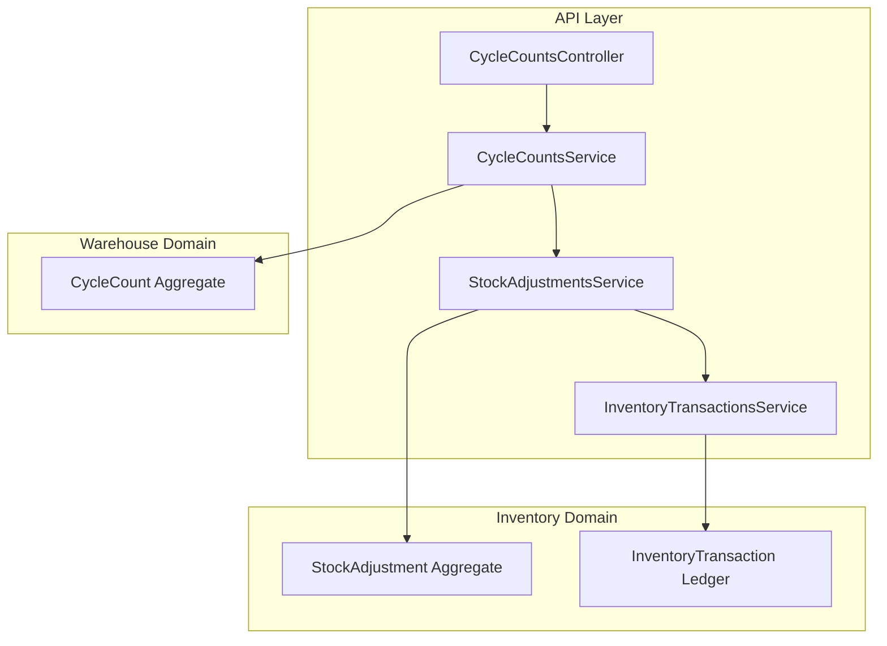
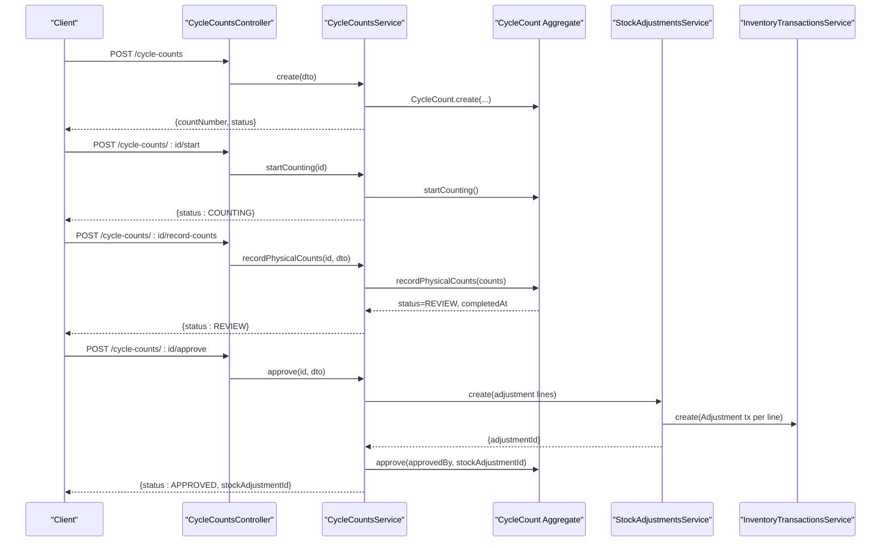
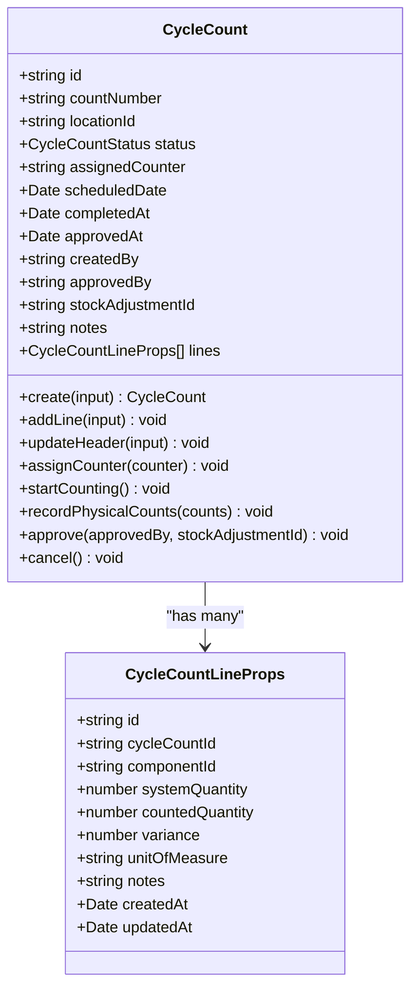
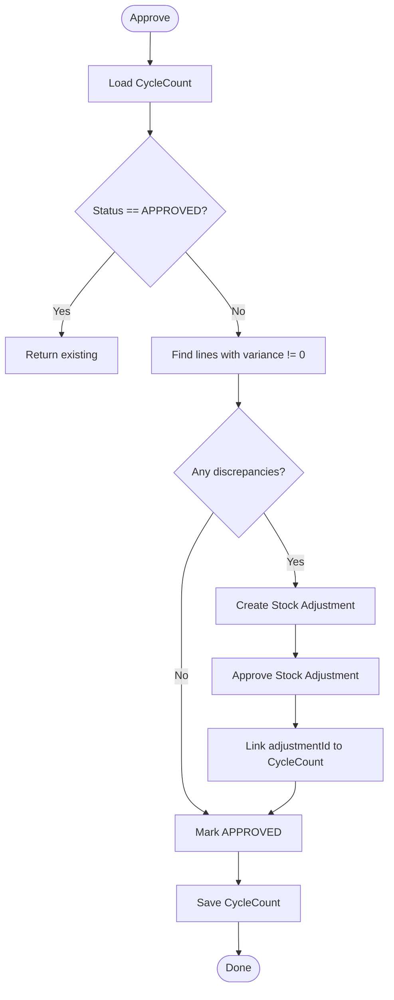
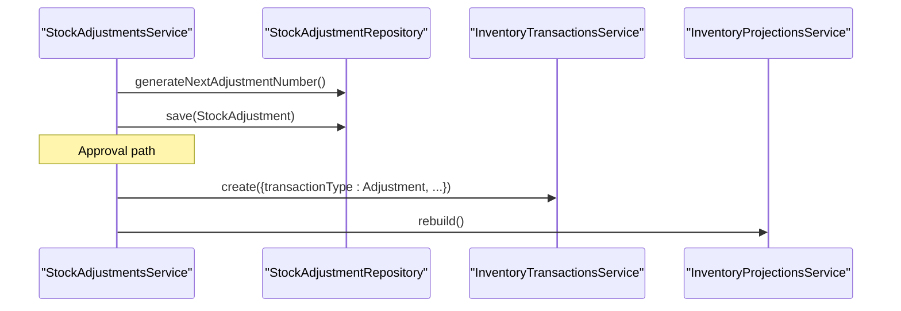
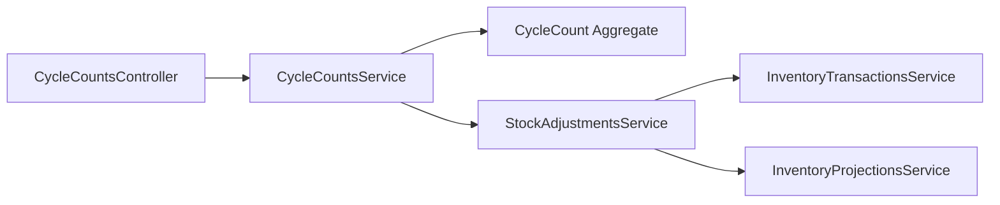

# Cycle Counting

<cite>
**Referenced Files in This Document**
- [cycle-counts.controller.ts](file://apps/api/src/cycle-counts/cycle-counts.controller.ts)
- [cycle-counts.service.ts](file://apps/api/src/cycle-counts/cycle-counts.service.ts)
- [dtos.ts](file://apps/api/src/cycle-counts/dtos.ts)
- [cycle-count.ts](file://packages/warehouse/src/cycle-counts/cycle-count.ts)
- [cycle-count.errors.ts](file://packages/warehouse/src/cycle-counts/cycle-count.errors.ts)
- [stock-adjustments.service.ts](file://apps/api/src/stock-adjustments/stock-adjustments.service.ts)
- [inventory-transactions.service.ts](file://apps/api/src/inventory-transactions/inventory-transactions.service.ts)
- [0023-cycle-counting.md](file://docs/rfcs/0023-cycle-counting.md)
</cite>

## Table of Contents
1. [Introduction](#introduction)
2. [Project Structure](#project-structure)
3. [Core Components](#core-components)
4. [Architecture Overview](#architecture-overview)
5. [Detailed Component Analysis](#detailed-component-analysis)
6. [Dependency Analysis](#dependency-analysis)
7. [Performance Considerations](#performance-considerations)
8. [Troubleshooting Guide](#troubleshooting-guide)
9. [Conclusion](#conclusion)

## Introduction
This document explains the cycle counting functionality that provides continuous inventory reconciliation. It covers count scheduling, discrepancy detection, and adjustment workflows; count types such as ABC analysis and random sampling; count templates and automated scheduling rules; the reconciliation process including variance analysis and audit trail maintenance; examples from the codebase for plan creation, physical count execution, and automatic adjustments; accuracy metrics; performance optimization; and integration with inventory valuation systems.

The implementation is centered around a domain model for CycleCount, an API controller and service layer, and integration with StockAdjustment and InventoryTransactions to ensure immutable, auditable ledger updates.

## Project Structure
Cycle counting spans the Warehouse domain (domain model), the API layer (controller/service), and integration points with Inventory (adjustments and transactions). The RFC defines recurring schedule concepts and future automation.

**Diagram sources**
- [cycle-counts.controller.ts:23-94](file://apps/api/src/cycle-counts/cycle-counts.controller.ts#L23-L94)
- [cycle-counts.service.ts:32-209](file://apps/api/src/cycle-counts/cycle-counts.service.ts#L32-L209)
- [cycle-count.ts:64-256](file://packages/warehouse/src/cycle-counts/cycle-count.ts#L64-L256)
- [stock-adjustments.service.ts:18-135](file://apps/api/src/stock-adjustments/stock-adjustments.service.ts#L18-L135)
- [inventory-transactions.service.ts:12-43](file://apps/api/src/inventory-transactions/inventory-transactions.service.ts#L12-L43)

**Section sources**
- [cycle-counts.controller.ts:23-94](file://apps/api/src/cycle-counts/cycle-counts.controller.ts#L23-L94)
- [cycle-counts.service.ts:32-209](file://apps/api/src/cycle-counts/cycle-counts.service.ts#L32-L209)
- [cycle-count.ts:64-256](file://packages/warehouse/src/cycle-counts/cycle-count.ts#L64-L256)
- [stock-adjustments.service.ts:18-135](file://apps/api/src/stock-adjustments/stock-adjustments.service.ts#L18-L135)
- [inventory-transactions.service.ts:12-43](file://apps/api/src/inventory-transactions/inventory-transactions.service.ts#L12-L43)
- [0023-cycle-counting.md:11-22](file://docs/rfcs/0023-cycle-counting.md#L11-L22)

## Core Components
- CycleCountsController: Exposes REST endpoints for creating, updating, assigning counters, starting counts, recording physical counts, reviewing variances, approving, canceling, and deleting cycle counts.
- CycleCountsService: Orchestrates lifecycle operations, computes discrepancy summaries, and integrates with StockAdjustmentsService to reconcile differences.
- CycleCount aggregate: Encapsulates state transitions, line management, variance calculation, and approval linkage to stock adjustments.
- StockAdjustmentsService: Creates and approves stock adjustments, posting immutable InventoryTransactions and rebuilding projections.
- InventoryTransactionsService: Persists immutable inventory ledger entries with validation against component lifecycle constraints.

Key responsibilities:
- Count planning and scheduling via DTOs and repository abstractions.
- Physical count entry and variance computation.
- Automated adjustment generation and approval workflow.
- Audit trail through immutable transactions and status transitions.

**Section sources**
- [cycle-counts.controller.ts:23-94](file://apps/api/src/cycle-counts/cycle-counts.controller.ts#L23-L94)
- [cycle-counts.service.ts:32-209](file://apps/api/src/cycle-counts/cycle-counts.service.ts#L32-L209)
- [cycle-count.ts:64-256](file://packages/warehouse/src/cycle-counts/cycle-count.ts#L64-L256)
- [stock-adjustments.service.ts:18-135](file://apps/api/src/stock-adjustments/stock-adjustments.service.ts#L18-L135)
- [inventory-transactions.service.ts:12-43](file://apps/api/src/inventory-transactions/inventory-transactions.service.ts#L12-L43)

## Architecture Overview
The cycle counting flow starts at the controller, delegates to the service, which manipulates the CycleCount aggregate and coordinates with stock adjustments and inventory transactions for reconciliation.

**Diagram sources**
- [cycle-counts.controller.ts:28-89](file://apps/api/src/cycle-counts/cycle-counts.controller.ts#L28-L89)
- [cycle-counts.service.ts:39-193](file://apps/api/src/cycle-counts/cycle-counts.service.ts#L39-L193)
- [cycle-count.ts:99-243](file://packages/warehouse/src/cycle-counts/cycle-count.ts#L99-L243)
- [stock-adjustments.service.ts:27-120](file://apps/api/src/stock-adjustments/stock-adjustments.service.ts#L27-L120)
- [inventory-transactions.service.ts:19-31](file://apps/api/src/inventory-transactions/inventory-transactions.service.ts#L19-L31)

## Detailed Component Analysis

### CycleCount Aggregate
The CycleCount aggregate enforces business rules for count planning, assignment, counting, review, approval, and cancellation. It calculates per-line variance and maintains timestamps and audit fields.

State transitions are enforced by domain errors when invalid transitions occur or when attempting to mutate immutable records.

**Diagram sources**
- [cycle-count.ts:64-256](file://packages/warehouse/src/cycle-counts/cycle-count.ts#L64-L256)
- [cycle-count.errors.ts:3-24](file://packages/warehouse/src/cycle-counts/cycle-count.errors.ts#L3-L24)

**Section sources**
- [cycle-count.ts:64-256](file://packages/warehouse/src/cycle-counts/cycle-count.ts#L64-L256)
- [cycle-count.errors.ts:3-24](file://packages/warehouse/src/cycle-counts/cycle-count.errors.ts#L3-L24)

### CycleCountsController
Exposes endpoints for full lifecycle management:
- Create, update, list, find, assign counter, start counting, record physical counts, review variances, approve, cancel, delete.

Validation and error handling are delegated to the service and domain layer.

**Section sources**
- [cycle-counts.controller.ts:23-94](file://apps/api/src/cycle-counts/cycle-counts.controller.ts#L23-L94)

### CycleCountsService
Responsibilities:
- Generate next count number and persist CycleCount.
- Update header and lines while enforcing immutability.
- Assign counter and transition states.
- Record physical counts and compute variances.
- Review discrepancies and summarize matching, shortage, surplus, and total difference.
- Approve cycle counts and automatically create and approve stock adjustments for non-zero variances.

**Diagram sources**
- [cycle-counts.service.ts:156-193](file://apps/api/src/cycle-counts/cycle-counts.service.ts#L156-L193)

**Section sources**
- [cycle-counts.service.ts:39-209](file://apps/api/src/cycle-counts/cycle-counts.service.ts#L39-L209)

### StockAdjustmentsService
Creates stock adjustments from cycle count discrepancies and posts immutable inventory transactions upon approval. After posting, it rebuilds inventory projections to keep read models consistent.

**Diagram sources**
- [stock-adjustments.service.ts:27-120](file://apps/api/src/stock-adjustments/stock-adjustments.service.ts#L27-L120)

**Section sources**
- [stock-adjustments.service.ts:18-135](file://apps/api/src/stock-adjustments/stock-adjustments.service.ts#L18-L135)

### InventoryTransactionsService
Persists immutable inventory ledger entries and validates that consolidated components cannot receive new stock, preserving data integrity.

**Section sources**
- [inventory-transactions.service.ts:12-43](file://apps/api/src/inventory-transactions/inventory-transactions.service.ts#L12-L43)

### Data Transfer Objects (DTOs)
Define input contracts for:
- Creating and updating cycle counts with optional lines.
- Assigning counters.
- Recording physical counts per line.
- Approving cycle counts.

These DTOs enforce required fields, numeric ranges, and nested array structures.

**Section sources**
- [dtos.ts:12-119](file://apps/api/src/cycle-counts/dtos.ts#L12-L119)

### RFC Concepts: Scheduling and Automation
The RFC outlines:
- Recurring schedules (Daily, Weekly, Monthly, Quarterly).
- Bin selection rules (Zone-based, ABC velocity-based, high-value components).
- Automated generation of StockCount documents on scheduled dates.
- Tracking next execution date and schedule status.

While the current API focuses on ad-hoc and manual workflows, the RFC provides the blueprint for automated scheduling and template-driven count plans.

**Section sources**
- [0023-cycle-counting.md:11-22](file://docs/rfcs/0023-cycle-counting.md#L11-L22)
- [0023-cycle-counting.md:26-31](file://docs/rfcs/0023-cycle-counting.md#L26-L31)
- [0023-cycle-counting.md:34-38](file://docs/rfcs/0023-cycle-counting.md#L34-L38)
- [0023-cycle-counting.md:46-50](file://docs/rfcs/0023-cycle-counting.md#L46-L50)
- [0023-cycle-counting.md:53-78](file://docs/rfcs/0023-cycle-counting.md#L53-L78)
- [0023-cycle-counting.md:122-127](file://docs/rfcs/0023-cycle-counting.md#L122-L127)

## Dependency Analysis
The following diagram shows how the API controller and service depend on domain aggregates and other services.

**Diagram sources**
- [cycle-counts.controller.ts:23-94](file://apps/api/src/cycle-counts/cycle-counts.controller.ts#L23-L94)
- [cycle-counts.service.ts:32-209](file://apps/api/src/cycle-counts/cycle-counts.service.ts#L32-L209)
- [stock-adjustments.service.ts:18-135](file://apps/api/src/stock-adjustments/stock-adjustments.service.ts#L18-L135)
- [inventory-transactions.service.ts:12-43](file://apps/api/src/inventory-transactions/inventory-transactions.service.ts#L12-L43)

**Section sources**
- [cycle-counts.controller.ts:23-94](file://apps/api/src/cycle-counts/cycle-counts.controller.ts#L23-L94)
- [cycle-counts.service.ts:32-209](file://apps/api/src/cycle-counts/cycle-counts.service.ts#L32-L209)
- [stock-adjustments.service.ts:18-135](file://apps/api/src/stock-adjustments/stock-adjustments.service.ts#L18-L135)
- [inventory-transactions.service.ts:12-43](file://apps/api/src/inventory-transactions/inventory-transactions.service.ts#L12-L43)

## Performance Considerations
- Batch physical count recording: Submit multiple line counts in one request to reduce round trips and enable efficient variance computation.
- Minimize unnecessary updates: Only update headers and lines when necessary; the domain enforces immutability after certain states.
- Projection rebuild cost: Approving stock adjustments triggers projection rebuilds; batch approvals where possible to limit rebuild frequency.
- Query filtering: Use controller query parameters (locationId, status, assignedCounter, search) to narrow result sets and improve listing performance.
- Unit of measure consistency: Ensure all quantities are recorded in base units to avoid conversion overhead and maintain deterministic calculations.

[No sources needed since this section provides general guidance]

## Troubleshooting Guide
Common issues and resolutions:
- Invalid status transitions: Attempting to move CycleCount between incompatible states throws domain errors. Verify the current status before calling methods like startCounting, recordPhysicalCounts, or approve.
- Negative counted quantity: The domain rejects negative values for countedQuantity; validate inputs before submission.
- Immutable records: Approved or Cancelled CycleCounts cannot be modified; create a new count if changes are required.
- Component usability: New inventory transactions are blocked for consolidated components; ensure the component is active and usable before posting adjustments.

Error mapping:
- InvalidCycleCountStatusTransitionError: Indicates an illegal state change.
- InvalidCountedQuantityError: Indicates invalid input for counted quantity.
- ImmutableCycleCountError: Indicates attempted mutation of an immutable record.

Exception handling:
- CycleCountExceptionFilter converts domain errors into standardized HTTP responses with appropriate messages.

**Section sources**
- [cycle-count.errors.ts:3-24](file://packages/warehouse/src/cycle-counts/cycle-count.errors.ts#L3-L24)
- [cycle-count.ts:181-243](file://packages/warehouse/src/cycle-counts/cycle-count.ts#L181-L243)
- [inventory-transactions.service.ts:19-31](file://apps/api/src/inventory-transactions/inventory-transactions.service.ts#L19-L31)

## Conclusion
The cycle counting feature provides a robust, auditable process for continuous inventory reconciliation. It supports manual workflows today and is designed to integrate with automated scheduling and selection rules defined in the RFC. Variance analysis drives automatic stock adjustments, ensuring immutable ledger updates and consistent projections. By adhering to the domain invariants and leveraging the provided APIs, teams can maintain accurate inventory records and trace all changes through the audit trail.

[No sources needed since this section summarizes without analyzing specific files]